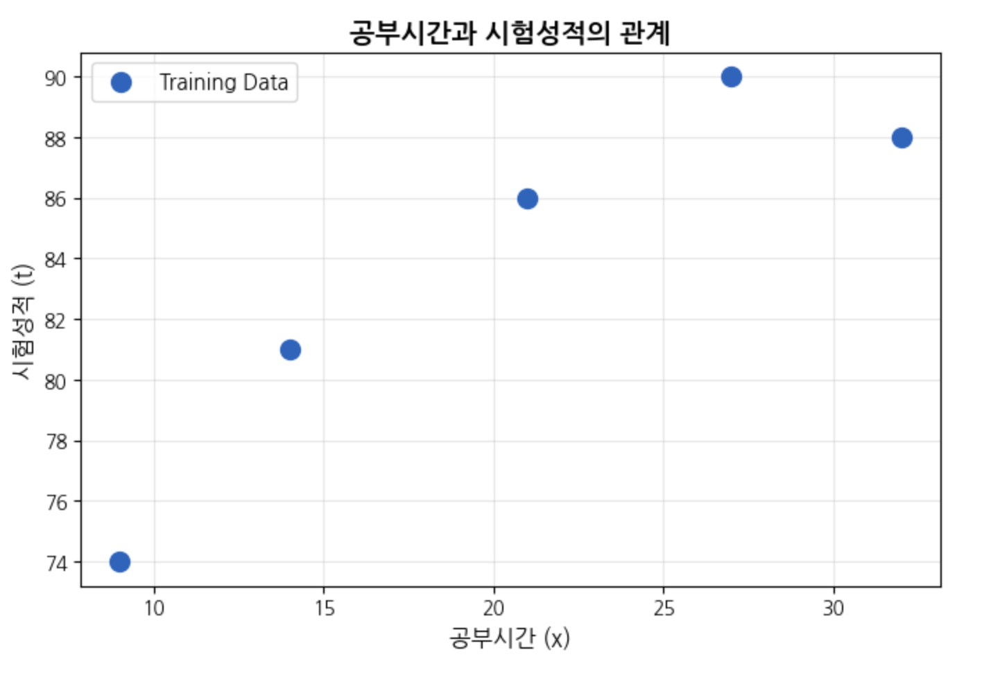
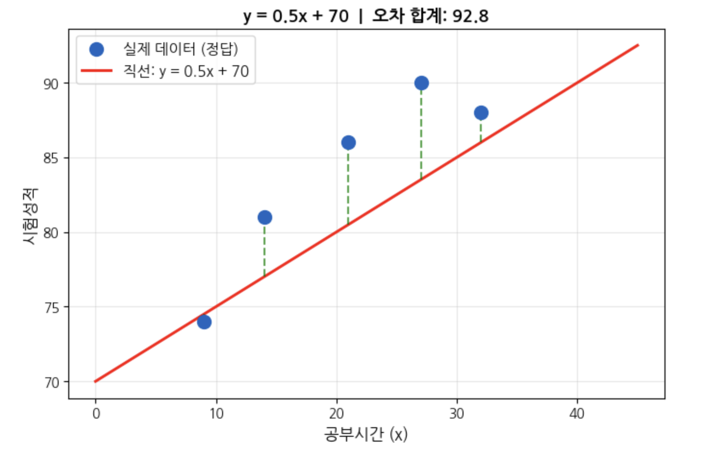
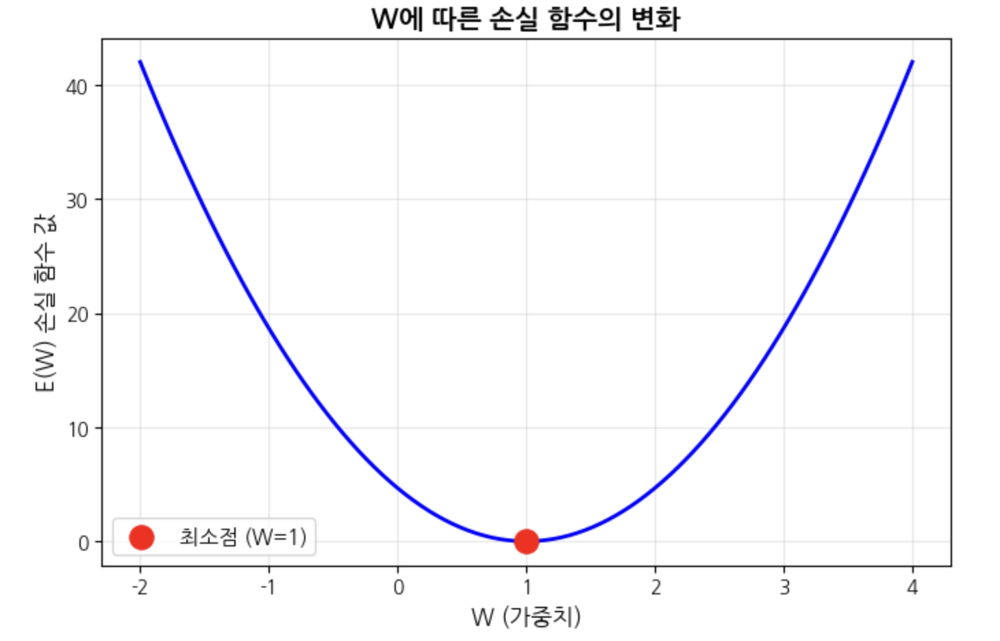
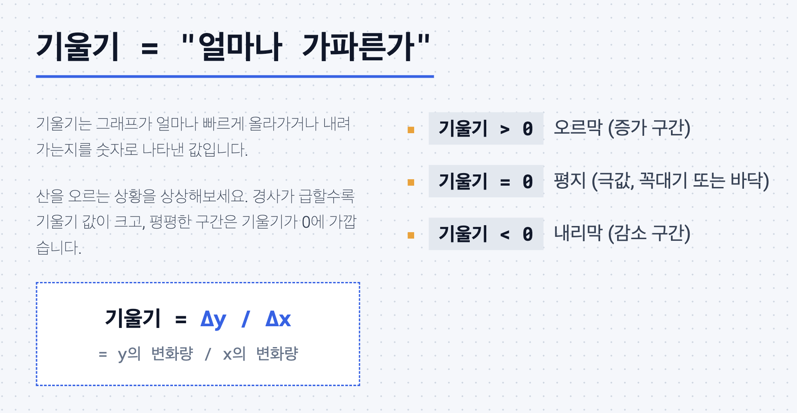
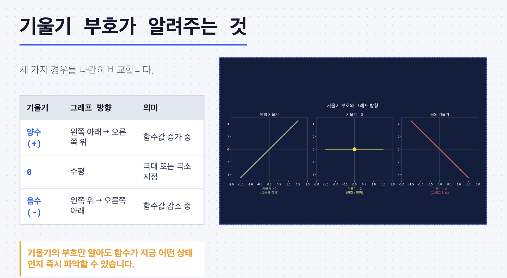
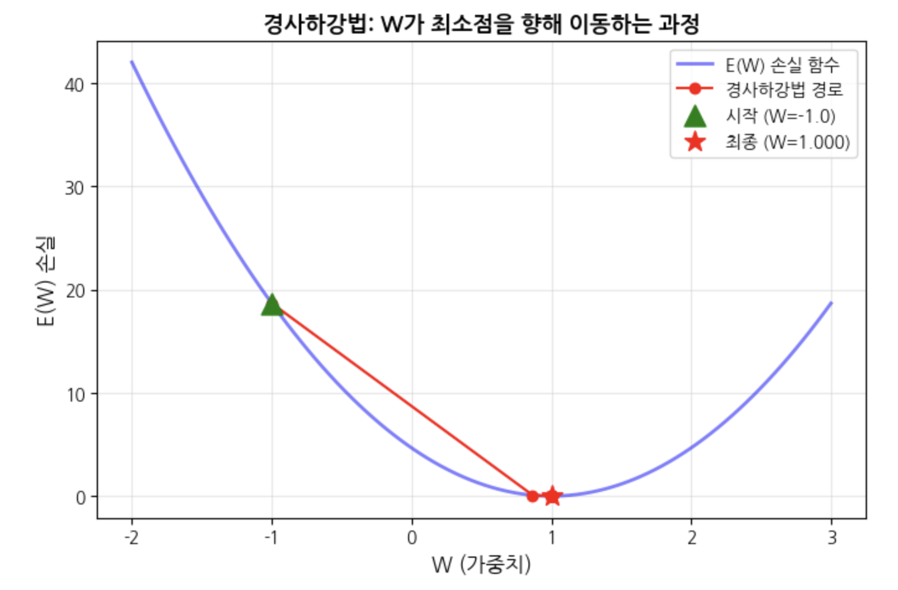
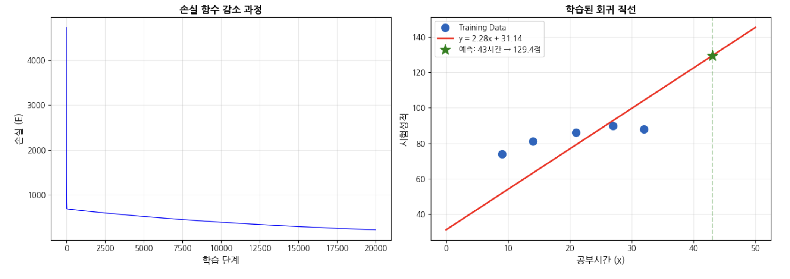
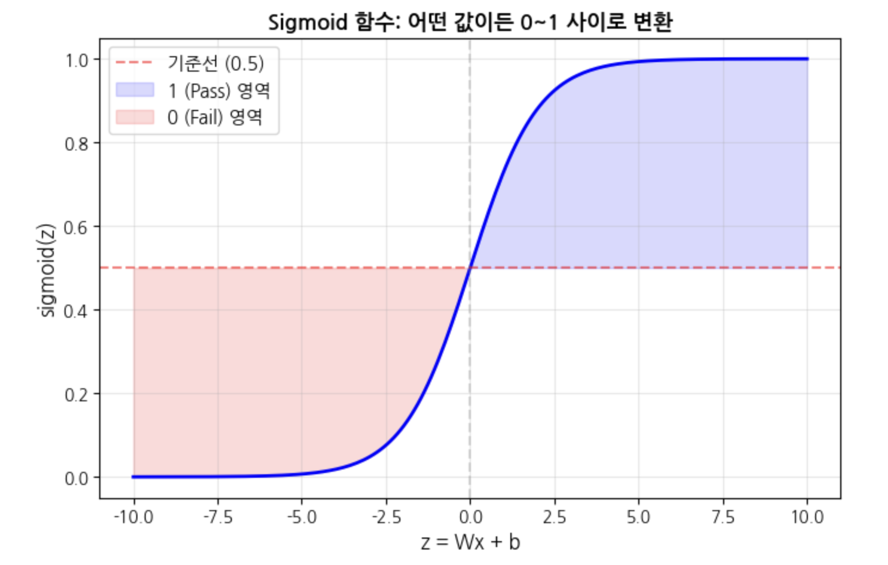
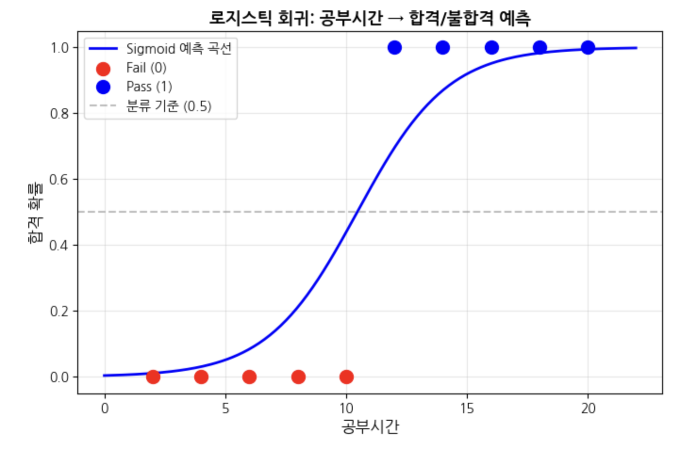

# 머신러닝 회귀분석 기초

## 학습 목표
1. **선형 회귀(Linear Regression)**의 원리를 이해하고 Python으로 구현할 수 있다
2. **손실 함수(Loss Function)**와 **경사하강법(Gradient Descent)**의 관계를 설명할 수 있다
3. **로지스틱 회귀(Logistic Regression)**로 분류 문제를 풀 수 있다
4. 선형 회귀와 로지스틱 회귀의 차이를 설명할 수 있다

## 목차

| Part | 주제 |
|------|------|
| Part 1 | 지도학습 개요 — 회귀 vs 분류 |
| Part 2 | 선형 회귀 — 직선으로 미래를 예측하기 |
| Part 3 | 손실 함수 — 얼마나 틀렸는지 측정하기 |
| Part 4 | 경사하강법 — 최적의 W, b 찾기 |
| Part 5 | Python으로 단순 선형 회귀 구현 |
| Part 6 | 다변수 선형 회귀 (Multi-variable) |
| Part 7 | 로지스틱 회귀 — 분류 문제 풀기 |
| Part 8 | 정리 + XOR 문제 복선 |

---

## Part 1. 지도학습 개요 — 회귀 vs 분류

**지도학습(Supervised Learning)**은 **정답(레이블)이 있는 데이터**로 학습하는 방법입니다.

지도학습은 예측하려는 값의 종류에 따라 두 가지로 나뉩니다:

| | 회귀 (Regression) | 분류 (Classification) |
|---|---|---|
| **예측 값** | 연속적인 숫자 | 범주 (카테고리) |
| **예시** | 공부시간 → 시험점수 | 공부시간 → 합격/불합격 |
| **예시** | 집 면적 → 가격 | 이메일 → 스팸/정상 |
| **출력** | 73.5점, 85.2점, ... | 0 또는 1 (Pass/Fail) |

### 학습의 흐름

```
Training Data (입력 + 정답)
    ↓
학습 (Learning) — 데이터의 패턴을 찾아 W, b를 조정
    ↓
모델 완성 (y = Wx + b)
    ↓
Test Data (새로운 입력)
    ↓
예측 (Predict) — 미래 값 예측
```

---

### 지도학습 예시: 공부시간과 시험성적 데이터

```python
# 지도학습 예시: 공부시간과 시험성적 데이터
import numpy as np
import matplotlib.pyplot as plt

# 한글 폰트 설정 (Colab용)
try:
    import subprocess, matplotlib.font_manager as fm
    subprocess.run(['apt-get', '-qq', '-y', 'install', 'fonts-nanum'],
                   capture_output=True, check=True)
    for fpath in fm.findSystemFonts(fontpaths=['/usr/share/fonts/truetype/nanum']):
        fm.fontManager.addfont(fpath)
    plt.rcParams['font.family'] = 'NanumGothic'
except:
    pass  # Colab이 아닌 환경에서는 기본 폰트 사용

plt.rcParams['axes.unicode_minus'] = False
plt.rcParams['mathtext.fontset'] = 'cm'

# Training Data
x_data = np.array([9, 14, 21, 27, 32])   # 공부시간
t_data = np.array([74, 81, 86, 90, 88])   # 시험성적 (정답)

print('=== Training Data ===')
print(f'{"공부시간(x)":>12} | {"시험성적(t)":>12}')
print('-' * 28)
for x, t in zip(x_data, t_data):
    print(f'{x:>12} | {t:>12}')

# 데이터 시각화
plt.figure(figsize=(8, 5))
plt.scatter(x_data, t_data, s=100, c='#1565C0', zorder=5, label='Training Data')
plt.xlabel('공부시간 (x)', fontsize=12)
plt.ylabel('시험성적 (t)', fontsize=12)
plt.title('공부시간과 시험성적의 관계', fontsize=14, fontweight='bold')
plt.legend(fontsize=11)
plt.grid(True, alpha=0.3)
plt.show()

print('\n질문: 공부시간이 43시간이면 시험성적은 몇 점일까?')
```

**실행 결과:**

```
=== Training Data ===
    공부시간(x) |     시험성적(t)
----------------------------
           9 |           74
          14 |           81
          21 |           86
          27 |           90
          32 |           88

질문: 공부시간이 43시간이면 시험성적은 몇 점일까?
```

---

## Part 2. 선형 회귀 — 직선으로 미래를 예측하기

**선형 회귀(Linear Regression)**는 데이터를 가장 잘 표현하는 **직선(y = Wx + b)**을 찾는 것입니다.

| 요소 | 의미 | 비유 |
|------|------|------|
| **W** (가중치, Weight) | 직선의 기울기 | 공부 1시간당 성적이 얼마나 오르는지 |
| **b** (편향, Bias) | 직선의 y절편 | 공부를 안 해도 받는 기본 점수 |
| **y** (예측값) | Wx + b의 결과 | 모델이 예측한 시험성적 |
| **t** (정답, Target) | 실제 정답 | 실제 시험성적 |

> **학습의 목표**: 모든 데이터에 대해 예측값(y)과 정답(t)의 차이가 **최소**가 되는 W와 b를 찾는 것!

---

### 직선 y = Wx + b 를 직접 그려보기

```python
# W와 b 값을 바꿔가며 어떤 직선이 데이터에 잘 맞는지 관찰해보세요

import numpy as np
import matplotlib.pyplot as plt

x_data = np.array([9, 14, 21, 27, 32])
t_data = np.array([74, 81, 86, 90, 88])

# TODO: W와 b 값을 바꿔보세요!
W = 0.5   # 기울기 (0.5, 0.7, 1.0 등으로 바꿔보세요)
b = 70    # y절편 (60, 70, 75 등으로 바꿔보세요)

# 예측값 계산
y_pred = W * x_data + b

# 시각화
plt.figure(figsize=(8, 5))
plt.scatter(x_data, t_data, s=100, c='#1565C0', zorder=5, label='실제 데이터 (정답)')

# 직선 그리기
x_line = np.linspace(0, 45, 100)
y_line = W * x_line + b
plt.plot(x_line, y_line, 'r-', linewidth=2, label=f'직선: y = {W}x + {b}')

# 오차 표시 (점선)
for x, t, y in zip(x_data, t_data, y_pred):
    plt.vlines(x, min(t, y), max(t, y), colors='green', linestyles='dashed', alpha=0.7)

plt.xlabel('공부시간 (x)', fontsize=12)
plt.ylabel('시험성적', fontsize=12)
plt.title(f'y = {W}x + {b}  |  오차 합계: {np.sum((t_data - y_pred)**2):.1f}', fontsize=13, fontweight='bold')
plt.legend(fontsize=11)
plt.grid(True, alpha=0.3)
plt.show()

# 각 데이터의 오차
print(f'{"공부시간(x)":>12} | {"정답(t)":>8} | {"예측(y)":>8} | {"오차(t-y)":>10}')
print('-' * 48)
for x, t, y in zip(x_data, t_data, y_pred):
    print(f'{x:>12} | {t:>8} | {y:>8.1f} | {t-y:>10.1f}')
print(f'\n오차 제곱의 합: {np.sum((t_data - y_pred)**2):.1f}')
print('\n★ W와 b를 바꿔서 오차 합계를 줄여보세요!')
```

**실행 결과:**

```
  공부시간(x) |   정답(t) |   예측(y) |   오차(t-y)
------------------------------------------------
           9 |       74 |     74.5 |       -0.5
          14 |       81 |     77.0 |        4.0
          21 |       86 |     80.5 |        5.5
          27 |       90 |     83.5 |        6.5
          32 |       88 |     86.0 |        2.0

오차 제곱의 합: 86.5

★ W와 b를 바꿔서 오차 합계를 줄여보세요!
```

---

## Part 3. 손실 함수 — 얼마나 틀렸는지 측정하기

**손실 함수(Loss Function)**는 예측값(y)과 정답(t)의 차이를 숫자 하나로 나타낸 것입니다.

### 평균 제곱 오차 (MSE, Mean Squared Error)

```
E(W, b) = (1/n) × Σ(t - y)²
         = (1/n) × Σ(t - (Wx + b))²
```

| 기호 | 의미 |
|------|------|
| E(W, b) | 손실 함수 — W와 b에 따라 값이 변함 |
| t | 정답 (실제 시험성적) |
| y = Wx + b | 예측값 |
| n | 데이터 개수 |

**왜 제곱?**
- 오차가 양수든 음수든 **항상 양수**로 만들기 위해
- 큰 오차에 **더 큰 패널티**를 주기 위해

> **핵심**: 손실 함수 E(W, b)의 값이 **작을수록** 좋은 모델입니다.
> 학습의 목표 = E(W, b)가 **최소**가 되는 W와 b를 찾는 것!

---

### 손실 함수 E(W,b) 시각화

```python
# W 값에 따라 손실 함수가 어떻게 변하는지 관찰합니다
# (이해를 위해 b=0으로 단순화)

import numpy as np
import matplotlib.pyplot as plt

# 간단한 데이터: y = x (정답 W=1)
x_simple = np.array([1, 2, 3])
t_simple = np.array([1, 2, 3])

# 다양한 W 값에 대해 손실 함수 계산
W_range = np.linspace(-2, 4, 100)
losses = []

for W in W_range:
    y = W * x_simple  # 예측 (b=0으로 가정)
    loss = np.mean((t_simple - y) ** 2)  # MSE
    losses.append(loss)

# 시각화
plt.figure(figsize=(8, 5))
plt.plot(W_range, losses, 'b-', linewidth=2)
plt.scatter([1], [0], c='red', s=150, zorder=5, label='최소점 (W=1)')
plt.xlabel('W (가중치)', fontsize=12)
plt.ylabel('E(W) 손실 함수 값', fontsize=12)
plt.title('W에 따른 손실 함수의 변화', fontsize=14, fontweight='bold')
plt.legend(fontsize=11)
plt.grid(True, alpha=0.3)
plt.show()

# W별 손실 값 표
print(f'{"W":>6} | {"E(W)":>8}')
print('-' * 18)
for W_val in [-1, 0, 0.5, 1, 1.5, 2, 3]:
    loss_val = np.mean((t_simple - W_val * x_simple) ** 2)
    print(f'{W_val:>6.1f} | {loss_val:>8.2f}')

print('\n★ W=1일 때 손실이 0 → 완벽한 직선!')
print('  손실 함수의 최소점을 찾는 것이 학습의 목표입니다.')
```

**실행 결과:**

```
     W |     E(W)
------------------
  -1.0 |    18.67
   0.0 |     4.67
   0.5 |     1.17
   1.0 |     0.00
   1.5 |     1.17
   2.0 |     4.67
   3.0 |    18.67

★ W=1일 때 손실이 0 → 완벽한 직선!
  손실 함수의 최소점을 찾는 것이 학습의 목표입니다.
```

---

## Part 4. 경사하강법 — 최적의 W, b 찾기

손실 함수의 최소점을 찾는 방법이 **경사하강법(Gradient Descent)**입니다.

### 핵심 아이디어

```
W_new = W_old - 학습률 × (손실 함수의 기울기)
```

**비유**: 눈을 감고 산에서 내려오기
1. 현재 위치에서 **발밑의 경사(기울기)**를 느낀다
2. 경사가 내려가는 방향으로 **한 발짝** 이동한다
3. 이를 **반복**하면 가장 낮은 곳(최소점)에 도달한다

| 요소 | 의미 |
|------|------|
| 기울기 (gradient) | 현재 W에서 손실 함수가 증가/감소하는 방향 |
| 학습률 (learning rate) | 한 번에 얼마나 이동할지 (한 발짝의 크기) |




---

### 경사하강법 시각화: W를 한 발짝씩 업데이트

```python
import numpy as np
import matplotlib.pyplot as plt

x_simple = np.array([1, 2, 3])
t_simple = np.array([1, 2, 3])

# 경사하강법 실행
W = -1.0            # 시작점 (임의의 값)
learning_rate = 0.1  # 학습률
history = [(W, np.mean((t_simple - W * x_simple) ** 2))]  # (W값, 손실) 기록

print(f'{"Step":>4} | {"W":>8} | {"E(W)":>8} | {"기울기":>8}')
print('-' * 40)

for step in range(15):
    # 손실 함수의 기울기 계산 (미분)
    # E(W) = mean((t - Wx)^2) 의 W에 대한 미분
    gradient = -2 * np.mean((t_simple - W * x_simple) * x_simple)

    # W 업데이트
    W = W - learning_rate * gradient
    loss = np.mean((t_simple - W * x_simple) ** 2)
    history.append((W, loss))

    if step < 8 or step == 14:
        print(f'{step+1:>4} | {W:>8.4f} | {loss:>8.4f} | {gradient:>8.4f}')
    elif step == 8:
        print('  ...')

# 시각화
W_range = np.linspace(-2, 3, 100)
losses = [np.mean((t_simple - w * x_simple) ** 2) for w in W_range]

plt.figure(figsize=(8, 5))
plt.plot(W_range, losses, 'b-', linewidth=2, alpha=0.5, label='E(W) 손실 함수')

# 경사하강법 경로 표시
w_hist = [h[0] for h in history]
l_hist = [h[1] for h in history]
plt.plot(w_hist, l_hist, 'ro-', markersize=6, label='경사하강법 경로')
plt.scatter([w_hist[0]], [l_hist[0]], c='green', s=150, zorder=5, marker='^', label=f'시작 (W={w_hist[0]:.1f})')
plt.scatter([w_hist[-1]], [l_hist[-1]], c='red', s=150, zorder=5, marker='*', label=f'최종 (W={w_hist[-1]:.3f})')

plt.xlabel('W (가중치)', fontsize=12)
plt.ylabel('E(W) 손실', fontsize=12)
plt.title('경사하강법: W가 최소점을 향해 이동하는 과정', fontsize=13, fontweight='bold')
plt.legend(fontsize=10)
plt.grid(True, alpha=0.3)
plt.show()

print(f'\n시작: W = {w_hist[0]:.1f}')
print(f'최종: W = {w_hist[-1]:.4f} (정답: 1.0에 수렴!)')
```

**실행 결과:**

```
Step |        W |     E(W) |   기울기
----------------------------------------
   1 |  -0.0733 |   6.8211 |  -9.2667
   2 |   0.5862 |   1.0117 |  -6.5956
   3 |   0.8554 |   0.1234 |  -2.6916
   4 |   0.9494 |   0.0151 |  -0.9398
   5 |   0.9823 |   0.0018 |  -0.3284
   6 |   0.9938 |   0.0002 |  -0.1148
   7 |   0.9978 |   0.0000 |  -0.0401
   8 |   0.9992 |   0.0000 |  -0.0140
  ...
  15 |   1.0000 |   0.0000 |  -0.0000

시작: W = -1.0
최종: W = 1.0000 (정답: 1.0에 수렴!)
```

---

## Part 5. Python으로 단순 선형 회귀 구현

이제 실제 데이터(공부시간 → 시험성적)로 선형 회귀를 처음부터 구현해봅시다.

### 구현 순서
1. 학습 데이터(Training Data) 준비
2. 임의의 가중치 W, 편향 b 초기화
3. 손실 함수 E(W, b) 정의
4. 경사하강법으로 W, b 업데이트 반복
5. 학습 결과 확인 + 미래 값 예측

---

### Step 1: 학습 데이터 준비

```python
import numpy as np

# 공부시간 → 시험성적 데이터
x_data = np.array([9, 14, 21, 27, 32]).reshape(-1, 1).astype(np.float64)
t_data = np.array([74, 81, 86, 90, 88]).reshape(-1, 1).astype(np.float64)

print(f'입력 데이터 x 크기: {x_data.shape}')  # (5, 1)
print(f'정답 데이터 t 크기: {t_data.shape}')  # (5, 1)
```

**실행 결과:**

```
입력 데이터 x 크기: (5, 1)
정답 데이터 t 크기: (5, 1)
```

### Step 2: 가중치 W, 편향 b 초기화 (랜덤)

```python
np.random.seed(42)
W = np.random.rand(1, 1)  # 가중치 (1x1 행렬)
b = np.random.rand(1)     # 편향 (스칼라)

print(f'초기 W = {W[0][0]:.4f}')
print(f'초기 b = {b[0]:.4f}')
print(f'초기 직선: y = {W[0][0]:.4f}x + {b[0]:.4f}')
```

**실행 결과:**

```
초기 W = 0.3745
초기 b = 0.9507
초기 직선: y = 0.3745x + 0.9507
```

### Step 3: 손실 함수 정의 (MSE)

```python
def loss_func(x, t, W, b):
    """평균 제곱 오차 (Mean Squared Error)"""
    y = np.dot(x, W) + b    # 예측: y = Wx + b
    error = t - y            # 오차: 정답 - 예측
    return np.mean(error ** 2)  # 오차 제곱의 평균

# 초기 손실 확인
initial_loss = loss_func(x_data, t_data, W, b)
print(f'초기 손실: {initial_loss:.2f}')
```

**실행 결과:**

```
초기 손실: 5654.79
```

### Step 4: 수치 미분 함수 정의

```python
def numerical_derivative(f, x):
    """수치 미분: f(x)의 기울기를 근사적으로 계산"""
    delta_x = 1e-4
    grad = np.zeros_like(x)

    # x의 각 원소에 대해 편미분 계산
    it = np.nditer(x, flags=['multi_index'], op_flags=['readwrite'])
    while not it.finished:
        idx = it.multi_index
        original = x[idx]

        x[idx] = original + delta_x
        fx_plus = f(x)

        x[idx] = original - delta_x
        fx_minus = f(x)

        grad[idx] = (fx_plus - fx_minus) / (2 * delta_x)
        x[idx] = original
        it.iternext()

    return grad

print('수치 미분 함수 정의 완료!')
```

**실행 결과:**

```
수치 미분 함수 정의 완료!
```

### Step 5: 경사하강법으로 W, b 학습

```python
learning_rate = 1e-4  # 학습률
num_steps = 20000     # 반복 횟수

# W에 대한 손실 함수 (수치 미분용)
f_W = lambda W_: loss_func(x_data, t_data, W_, b)
# b에 대한 손실 함수 (수치 미분용)
f_b = lambda b_: loss_func(x_data, t_data, W, b_)

print('학습 시작!')
print(f'{"Step":>6} | {"손실(E)":>10} | {"W":>8} | {"b":>8}')
print('-' * 42)

loss_history = []

for step in range(num_steps):
    # W, b 각각의 기울기 계산
    W -= learning_rate * numerical_derivative(f_W, W)
    b -= learning_rate * numerical_derivative(f_b, b)

    # 손실 기록
    current_loss = loss_func(x_data, t_data, W, b)
    loss_history.append(current_loss)

    # 진행 상황 출력
    if step % 4000 == 0 or step == num_steps - 1:
        print(f'{step:>6} | {current_loss:>10.4f} | {W[0][0]:>8.4f} | {b[0]:>8.4f}')

print(f'\n학습 완료!')
print(f'최종 직선: y = {W[0][0]:.4f}x + {b[0]:.4f}')
```

**실행 결과:**

```
학습 시작!
  Step |      손실(E) |        W |        b
------------------------------------------
     0 |  4720.7749 |   0.6877 |   0.9645
  4000 |   553.1191 |   3.2282 |   8.5131
  8000 |   442.3671 |   2.9511 |  15.1603
 12000 |   353.9970 |   2.7035 |  21.0979
 16000 |   283.4857 |   2.4824 |  26.4018
 19999 |   227.2367 |   2.2849 |  31.1384

학습 완료!
최종 직선: y = 2.2849x + 31.1384
```

### Step 6: 학습 결과 확인 + 미래 값 예측

```python
import matplotlib.pyplot as plt

fig, (ax1, ax2) = plt.subplots(1, 2, figsize=(14, 5))

# 왼쪽: 손실 함수 감소 과정
ax1.plot(loss_history, 'b-', linewidth=1)
ax1.set_xlabel('학습 단계', fontsize=12)
ax1.set_ylabel('손실 (E)', fontsize=12)
ax1.set_title('손실 함수 감소 과정', fontsize=13, fontweight='bold')
ax1.grid(True, alpha=0.3)

# 오른쪽: 학습된 직선과 데이터
ax2.scatter(x_data, t_data, s=100, c='#1565C0', zorder=5, label='Training Data')
x_line = np.linspace(0, 50, 100)
y_line = W[0][0] * x_line + b[0]
ax2.plot(x_line, y_line, 'r-', linewidth=2, label=f'y = {W[0][0]:.2f}x + {b[0]:.2f}')

# 43시간 예측
pred_43 = W[0][0] * 43 + b[0]
ax2.scatter([43], [pred_43], s=200, c='green', marker='*', zorder=5, label=f'예측: 43시간 → {pred_43:.1f}점')
ax2.axvline(x=43, color='green', linestyle='--', alpha=0.3)

ax2.set_xlabel('공부시간 (x)', fontsize=12)
ax2.set_ylabel('시험성적', fontsize=12)
ax2.set_title('학습된 회귀 직선', fontsize=13, fontweight='bold')
ax2.legend(fontsize=10)
ax2.grid(True, alpha=0.3)

plt.tight_layout()
plt.show()

print(f'\n=== 예측 결과 ===')
print(f'공부시간 43시간일 때 예측 시험성적: {pred_43:.1f}점')
```

**실행 결과:**

```
=== 예측 결과 ===
공부시간 43시간일 때 예측 시험성적: 129.4점
```

---

## Part 6. 다변수 선형 회귀 (Multi-variable)

입력 변수가 여러 개일 때도 같은 원리가 적용됩니다.

```
단일 변수: y = W₁x₁ + b
다변수:    y = W₁x₁ + W₂x₂ + W₃x₃ + b
```

### 예시: 3과목 점수로 총점 예측

| 국어(x1) | 영어(x2) | 수학(x3) | 총점(t) |
|----------|----------|----------|--------|
| 73 | 80 | 75 | 152 |
| 93 | 88 | 93 | 185 |
| 89 | 91 | 90 | 180 |
| 96 | 93 | 95 | 192 |

---

### 다변수 선형 회귀 구현

```python
# 국어, 영어, 수학 점수로 총점을 예측합니다

import numpy as np

# 학습 데이터: 국어(x1), 영어(x2), 수학(x3) → 총점(t)
x_data = np.array([
    [73, 80, 75],
    [93, 88, 93],
    [89, 91, 90],
    [96, 93, 95],
    [73, 66, 70],
    [53, 46, 55],
    [69, 74, 77],
    [47, 56, 60],
], dtype=np.float64)

t_data = np.array([
    [152], [185], [180], [192],
    [142], [102], [146], [108],
], dtype=np.float64)

print(f'입력 크기: {x_data.shape}')   # (8, 3) — 8개 데이터, 3개 변수
print(f'정답 크기: {t_data.shape}')   # (8, 1)

# 가중치 초기화: W (3x1), b (1)
np.random.seed(42)
W = np.random.rand(3, 1)  # 입력이 3개이므로 가중치도 3개
b = np.random.rand(1)

print(f'\n초기 W = {W.flatten()}')
print(f'초기 b = {b[0]:.4f}')

# 학습
learning_rate = 1e-5

def loss_func_multi(x, t, W, b):
    y = np.dot(x, W) + b
    return np.mean((t - y) ** 2)

f_W = lambda W_: loss_func_multi(x_data, t_data, W_, b)
f_b = lambda b_: loss_func_multi(x_data, t_data, W, b_)

print('\n학습 시작...')
for step in range(30001):
    W -= learning_rate * numerical_derivative(f_W, W)
    b -= learning_rate * numerical_derivative(f_b, b)

    if step % 6000 == 0:
        loss = loss_func_multi(x_data, t_data, W, b)
        print(f'  Step {step:>5}: 손실 = {loss:.4f}')

print(f'\n학습 완료!')
print(f'W = {W.flatten()}')
print(f'b = {b[0]:.4f}')

# 예측: 국어=100, 영어=98, 수학=81 → 총점?
test_input = np.array([[100, 98, 81]])
prediction = np.dot(test_input, W) + b
print(f'\n[예측] 국어=100, 영어=98, 수학=81 → 총점: {prediction[0][0]:.1f}점')
```

**실행 결과:**

```
입력 크기: (8, 3)
정답 크기: (8, 1)

초기 W = [0.37454012 0.95071431 0.73199394]
초기 b = 0.5987

학습 시작...
  Step     0: 손실 = 16.0041
  Step  6000: 손실 = 0.9836
  Step 12000: 손실 = 0.8918
  Step 18000: 손실 = 0.8887
  Step 24000: 손실 = 0.8877
  Step 30000: 손실 = 0.8870

학습 완료!
W = [0.88057722 0.62526965 0.50310491]
b = 0.5537

[예측] 국어=100, 영어=98, 수학=81 → 총점: 190.6점
```

---

## Part 7. 로지스틱 회귀 — 분류 문제 풀기

### 회귀 → 분류로 확장

선형 회귀는 **연속적인 숫자**를 예측하지만, 분류는 **0 또는 1**을 예측해야 합니다.

**해결책**: 선형 회귀의 출력을 **Sigmoid 함수**에 통과시켜 0~1 사이 값으로 변환!

```
선형 회귀:     y = Wx + b                 → 연속적인 숫자
로지스틱 회귀:  y = sigmoid(Wx + b)        → 0~1 사이 확률
                 → 0.5 이상이면 1 (Pass)
                 → 0.5 미만이면 0 (Fail)
```

### Sigmoid 함수

```
sigmoid(z) = 1 / (1 + e^(-z))
```

- 어떤 값이든 **0~1 사이**로 변환
- 출력 값은 **확률**로 해석 가능 (0.8 → 80% 확률로 합격)

---

### Sigmoid 함수 시각화

```python
import numpy as np
import matplotlib.pyplot as plt

def sigmoid(z):
    return 1 / (1 + np.exp(-z))

z = np.linspace(-10, 10, 200)

plt.figure(figsize=(8, 5))
plt.plot(z, sigmoid(z), 'b-', linewidth=2)
plt.axhline(y=0.5, color='red', linestyle='--', alpha=0.5, label='기준선 (0.5)')
plt.axvline(x=0, color='gray', linestyle='--', alpha=0.3)

plt.fill_between(z, sigmoid(z), 0.5, where=(sigmoid(z) >= 0.5),
                 alpha=0.15, color='blue', label='1 (Pass) 영역')
plt.fill_between(z, sigmoid(z), 0.5, where=(sigmoid(z) < 0.5),
                 alpha=0.15, color='red', label='0 (Fail) 영역')

plt.xlabel('z = Wx + b', fontsize=12)
plt.ylabel('sigmoid(z)', fontsize=12)
plt.title('Sigmoid 함수: 어떤 값이든 0~1 사이로 변환', fontsize=13, fontweight='bold')
plt.legend(fontsize=11)
plt.grid(True, alpha=0.3)
plt.show()

print('sigmoid(-5) =', f'{sigmoid(-5):.4f}', ' → 0에 가까움 (Fail)')
print('sigmoid( 0) =', f'{sigmoid(0):.4f}', '  → 정확히 0.5 (경계)')
print('sigmoid( 5) =', f'{sigmoid(5):.4f}', ' → 1에 가까움 (Pass)')
```

**실행 결과:**

```
sigmoid(-5) = 0.0067  → 0에 가까움 (Fail)
sigmoid( 0) = 0.5000   → 정확히 0.5 (경계)
sigmoid( 5) = 0.9933  → 1에 가까움 (Pass)
```

### 로지스틱 회귀 구현: 공부시간 → 합격/불합격

```python
import numpy as np

# 학습 데이터
x_data = np.array([2, 4, 6, 8, 10, 12, 14, 16, 18, 20]).reshape(-1, 1).astype(np.float64)
t_data = np.array([0, 0, 0, 0, 0,   1,  1,  1,  1,  1]).reshape(-1, 1).astype(np.float64)
# 10시간 이하: 불합격(0), 12시간 이상: 합격(1)

print('=== Training Data ===')
print(f'{"공부시간":>8} | {"결과":>6}')
print('-' * 20)
for x, t in zip(x_data, t_data):
    result = 'Pass' if t[0] == 1 else 'Fail'
    print(f'{x[0]:>8.0f} | {result:>6}')

# 가중치 초기화
np.random.seed(42)
W = np.random.rand(1, 1)
b = np.random.rand(1)

def sigmoid(z):
    return 1 / (1 + np.exp(-z))

# 분류용 손실 함수 (Cross-Entropy)
def loss_func_classification(x, t, W, b):
    delta = 1e-7  # log(0) 방지
    z = np.dot(x, W) + b
    y = sigmoid(z)
    # Cross-Entropy Loss
    return -np.mean(t * np.log(y + delta) + (1 - t) * np.log(1 - y + delta))

# 학습
learning_rate = 1e-2

f_W = lambda W_: loss_func_classification(x_data, t_data, W_, b)
f_b = lambda b_: loss_func_classification(x_data, t_data, W, b_)

print('\n학습 시작...')
for step in range(10001):
    W -= learning_rate * numerical_derivative(f_W, W)
    b -= learning_rate * numerical_derivative(f_b, b)

    if step % 2000 == 0:
        loss = loss_func_classification(x_data, t_data, W, b)
        print(f'  Step {step:>5}: 손실 = {loss:.4f}')

print(f'\n학습 완료!')
print(f'W = {W[0][0]:.4f}, b = {b[0]:.4f}')
```

**실행 결과:**

```
=== Training Data ===
    공부시간 |     결과
--------------------
       2 |   Fail
       4 |   Fail
       6 |   Fail
       8 |   Fail
      10 |   Fail
      12 |   Pass
      14 |   Pass
      16 |   Pass
      18 |   Pass
      20 |   Pass

학습 시작...
  Step     0: 손실 = 1.5469
  Step  2000: 손실 = 0.3388
  Step  4000: 손실 = 0.2371
  Step  6000: 손실 = 0.1937
  Step  8000: 손실 = 0.1687
  Step 10000: 손실 = 0.1521

학습 완료!
W = 0.5352, b = -5.6030
```

### 분류 결과 시각화 + 미래 값 예측

```python
import matplotlib.pyplot as plt

# Sigmoid 곡선 그리기
x_line = np.linspace(0, 22, 200).reshape(-1, 1)
z_line = np.dot(x_line, W) + b
y_line = sigmoid(z_line)

plt.figure(figsize=(8, 5))
plt.plot(x_line, y_line, 'b-', linewidth=2, label='Sigmoid 예측 곡선')
plt.scatter(x_data[t_data.flatten()==0], t_data[t_data.flatten()==0],
            s=100, c='red', zorder=5, label='Fail (0)')
plt.scatter(x_data[t_data.flatten()==1], t_data[t_data.flatten()==1],
            s=100, c='blue', zorder=5, label='Pass (1)')
plt.axhline(y=0.5, color='gray', linestyle='--', alpha=0.5, label='분류 기준 (0.5)')

plt.xlabel('공부시간', fontsize=12)
plt.ylabel('합격 확률', fontsize=12)
plt.title('로지스틱 회귀: 공부시간 → 합격/불합격 예측', fontsize=13, fontweight='bold')
plt.legend(fontsize=10)
plt.grid(True, alpha=0.3)
plt.show()

# 미래 값 예측
print('=== 미래 값 예측 ===')
for test_hour in [3, 7, 11, 15, 17]:
    prob = sigmoid(W[0][0] * test_hour + b[0])
    result = 'Pass' if prob >= 0.5 else 'Fail'
    print(f'  공부 {test_hour:>2}시간 → 확률 {prob:.4f} → {result}')
```

**실행 결과:**

```
=== 미래 값 예측 ===
  공부  3시간 → 확률 0.0176 → Fail
  공부  7시간 → 확률 0.1357 → Fail
  공부 11시간 → 확률 0.5675 → Pass
  공부 15시간 → 확률 0.9145 → Pass
  공부 17시간 → 확률 0.9668 → Pass
```

---

## Part 8. 정리 + XOR 문제 복선

### 오늘 배운 핵심 비교

| | 선형 회귀 | 로지스틱 회귀 |
|---|---|---|
| **목적** | 연속값 예측 (점수, 가격) | 분류 (합격/불합격, 스팸/정상) |
| **출력** | y = Wx + b | y = sigmoid(Wx + b) |
| **출력 범위** | -∞ ~ +∞ | 0 ~ 1 |
| **손실 함수** | MSE (평균 제곱 오차) | Cross-Entropy |
| **최적화** | 경사하강법 | 경사하강법 |

### 공통 핵심 흐름

```
1. 데이터 준비 (x, t)
2. 가중치 W, 편향 b 랜덤 초기화
3. 손실 함수 정의 (예측과 정답의 차이 측정)
4. 경사하강법으로 W, b 반복 업데이트
5. 학습된 모델로 미래 값 예측
```

### 한계와 다음 단계

로지스틱 회귀는 **직선 하나**로 데이터를 분류합니다.
하지만 **XOR 문제**처럼 직선 하나로 분류할 수 없는 경우가 있습니다.

> 이 한계를 극복하는 것이 바로 **신경망(Neural Network)**이며,
> 여러 층을 쌓은 것이 **딥러닝(Deep Learning)**입니다!

---

### 핵심 요약

1. **선형 회귀**: y = Wx + b (연속값 예측)
2. **손실 함수**: 예측과 정답의 차이 (작을수록 좋음)
3. **경사하강법**: 기울기 방향으로 W, b 수정
4. **로지스틱 회귀**: sigmoid(Wx+b) (0/1 분류)
5. **공통**: 데이터 → 손실함수 → 경사하강법 → 예측

**다음 단계**: 직선의 한계 → 신경망(딥러닝)!
