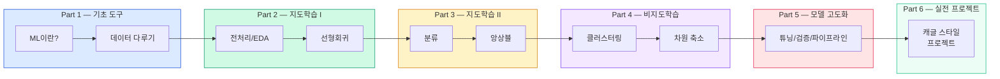



# Machine Learning — 비전공자를 위한 머신러닝

머신러닝을 처음 접하는 분들을 위한 80시간 완성 커리큘럼입니다.  
수식보다 **직관**, 이론보다 **코드**, 암기보다 **이해**를 먼저 합니다.

---

## 대상 수강생

| 항목 | 내용 |
|------|------|
| **사전 지식** | Python 기초 이수자 (변수, 반복문, 함수, 클래스 기본) |
| **수학 수준** | 고등학교 수학 수준이면 충분 (수식은 선택 심화) |
| **목표** | 실제 데이터로 ML 모델을 만들고 결과를 설명할 수 있는 수준 |

---

## 사용 도구

| 도구 | 역할 |
|------|------|
| **Google Colab** | 설치 없이 브라우저에서 실행하는 코딩 환경 |
| **Python** | 프로그래밍 언어 |
| **scikit-learn** | ML 알고리즘 라이브러리 (이 과정의 핵심 도구) |
| **pandas** | 데이터 조작 및 분석 |
| **numpy** | 수치 계산 및 행렬 연산 |
| **matplotlib** | 기본 시각화 |
| **seaborn** | 통계적 시각화 (matplotlib 위에 올라간 도구) |

---

## 전체 흐름



---

## 데이터셋 진행

| 단계 | 데이터셋 | 특징 |
|------|----------|------|
| **입문** | Iris (붓꽃) | 150행, 4특성, 3클래스 — 가장 깨끗한 연습용 데이터 |
| **중급** | Titanic (타이타닉) | 891행, 결측치, 범주형 변수 포함 — 현실적인 데이터 |
| **중고급** | California Housing (집값) | 회귀 문제, 지리 데이터 포함 |
| **고급** | MNIST (손글씨) | 70,000개 이미지 — 딥러닝 입문 전 연습 |

---

## 교육 원칙: 직관 → 코드 → 수학(선택)

앤드류 응(Andrew Ng) 교수의 교육 철학을 따릅니다.

```
1️⃣ 직관      "스팸 필터가 어떻게 작동하는지" 비유로 이해
     ↓
2️⃣ 코드      실제 Python 코드로 구현하고 결과 확인
     ↓
3️⃣ 수학(선택) 관심 있는 분만 읽는 📐 더 알아보기 접기/펼치기
```

수학 공식을 몰라도 모델을 만들 수 있습니다.  
이해가 쌓이면 수식이 자연스럽게 따라옵니다.

---

## scikit-learn 통일 API 패턴

이 과정에서 배우는 **모든 ML 알고리즘**은 다음 3줄 패턴을 따릅니다.

```python
# 1. 모델 선택
model = 어떤알고리즘()

# 2. 학습 (훈련 데이터로)
model.fit(X_train, y_train)

# 3. 예측 & 평가
predictions = model.predict(X_test)
score = model.score(X_test, y_test)
```

LinearRegression, LogisticRegression, RandomForest, SVM — 알고리즘 이름만 바뀌고 **패턴은 항상 동일**합니다.

---

## 전체 커리큘럼 (6 Parts, 18 챕터)

| Part | 챕터 | 제목 | 핵심 내용 | 시간 |
|------|------|------|----------|------|
| **Part 1** 기초 도구 | [M01](/ml-new/intro) | ML이란? | AI/ML/DL 관계, 학습 유형, scikit-learn 소개 | 4h |
| | [M02](/ml-new/data-tools) | 데이터 다루기 | NumPy, Pandas, matplotlib, seaborn | 8h |
| | [M03](/ml-new/preprocessing) | 데이터 전처리 | 스케일링, 인코딩, train_test_split, Pipeline | 8h |
| | [M04](/ml-new/eda) | 탐색적 데이터 분석 | EDA, 상관관계, 이상치 탐지 | 4h |
| **Part 2** 지도학습 I | [M05](/ml-new/linear-regression) | 선형 회귀 | 가설 함수, 비용 함수, 경사하강법 | 8h |
| | [M06](/ml-new/regularization) | 규제 | Ridge, Lasso, 과적합 방지 | 4h |
| | [M07](/ml-new/logistic) | 로지스틱 회귀 | 시그모이드, 이진 분류, 혼동 행렬 | 6h |
| **Part 3** 지도학습 II | [M08](/ml-new/decision-tree) | 의사결정 나무 | 불순도, 가지치기, 시각화 | 4h |
| | [M09](/ml-new/ensemble) | 앙상블 | RandomForest, Gradient Boosting, XGBoost | 8h |
| | [M10](/ml-new/svm) | SVM | 마진, 커널 트릭, 비선형 분류 | 4h |
| **Part 4** 비지도학습 | [M11](/ml-new/clustering) | 클러스터링 | K-Means, DBSCAN, 엘보우 기법 | 4h |
| | [M12](/ml-new/pca) | 차원 축소 | PCA, 설명 분산, 시각화 | 4h |
| **Part 5** 모델 고도화 | [M13](/ml-new/evaluation) | 모델 평가 | 교차 검증, ROC-AUC, F1-score | 4h |
| | [M14](/ml-new/tuning) | 하이퍼파라미터 튜닝 | GridSearchCV, RandomizedSearchCV | 4h |
| | [M15](/ml-new/pipeline) | 고급 Pipeline | ColumnTransformer, 전처리 자동화 | 4h |
| **Part 6** 실전 프로젝트 | [M16](/ml-new/titanic-project) | Titanic 프로젝트 | 전체 ML 파이프라인 실전 적용 | 4h |
| | [M17](/ml-new/housing-project) | Housing 프로젝트 | 회귀 문제 실전, 특성 엔지니어링 | 4h |
| | [M18](/ml-new/kaggle-style) | 캐글 스타일 제출 | 대회 형식, 리더보드, 팀 협업 | 4h |

**총 80시간 (10일 × 8시간)**

---

## 학습 방법 가이드

1. **코드를 반드시 직접 실행하세요** — 읽기만 하면 이해한 것 같지만, 실행해야 진짜 이해입니다
2. **실행 결과를 예측한 뒤 실행하세요** — "이 코드가 어떤 결과를 낼까?" 먼저 생각하고 실행
3. **수식은 처음엔 건너뛰어도 됩니다** — 📐 더 알아보기는 나중에 돌아와서 읽어도 됩니다
4. **실습 과제는 꼭 해보세요** — 기본 → 중급 순서로, 심화는 여력이 될 때


