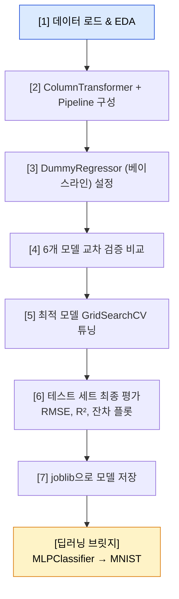



# 18장. 통합 프로젝트 — 집값 예측 + 딥러닝 브릿지

> "수많은 집의 데이터를 보고 '이 집이 얼마일까?'를 예측합니다. 그리고 마지막에는 여러분이 사용한 scikit-learn 모델 안에 '뉴런'이 들어있다는 것을 보여드립니다."

이 장은 머신러닝 과정의 **대단원 프로젝트**입니다.  
완료 예상 시간: **8시간**

---

## 학습 목표

- California Housing 데이터셋으로 회귀 문제를 처음부터 끝까지 해결할 수 있습니다.
- ColumnTransformer와 Pipeline을 결합해 실전 수준의 전처리를 구현합니다.
- 베이스라인 모델을 설정하고 ML의 가치를 수치로 증명합니다.
- 여러 회귀 모델을 RMSE 기준으로 공정하게 비교합니다.
- joblib으로 모델을 저장하고 불러오는 법을 익힙니다.
- scikit-learn의 MLPClassifier로 딥러닝의 문을 엽니다.

<a id="toc"></a>

## 진행 순서

1. [프로젝트 소개](#1)
2. [Step 1 — 데이터 로드 + EDA](#2)
3. [Step 2 — 전처리 파이프라인 구성](#3)
4. [Step 3 — 베이스라인 모델 설정](#4)
5. [Step 4 — 모델 비교](#5)
6. [Step 5 — 최적 모델 튜닝](#6)
7. [Step 6 — 최종 평가 & 시각화](#7)
8. [Step 7 — 모델 저장 & 로드](#8)
9. [딥러닝 브릿지 — MLPClassifier로 MNIST](#9)
10. [개념 매핑표 — 전체 과정 회고](#10)
11. [과정을 마치며](#11)

---

<a id="1"></a>

## 1️⃣ 프로젝트 소개 [↑](#toc)

### 문제 정의

> "캘리포니아 주 각 지역의 인구 통계 정보를 보고, 그 지역의 주택 가격 중앙값을 예측합니다."

| 항목 | 내용 |
|------|------|
| **데이터셋** | California Housing (scikit-learn 내장) |
| **행 수** | 20,640개 지역 (블록 그룹) |
| **열 수** | 8개 특성 |
| **목표 변수** | `MedHouseVal` — 지역별 주택 가격 중앙값 (단위: $100,000) |
| **문제 유형** | 회귀 (Regression) |
| **평가 지표** | RMSE (낮을수록 좋음), R² (높을수록 좋음) |
| **난이도** | ★★★★☆ |

### 전체 워크플로우



### 환경 설정 (Colab 셀 1)

```python
import numpy as np
import pandas as pd
import matplotlib.pyplot as plt
import seaborn as sns
import warnings
warnings.filterwarnings('ignore')

from sklearn.datasets import fetch_california_housing
from sklearn.model_selection import train_test_split, cross_val_score, GridSearchCV, RandomizedSearchCV
from sklearn.preprocessing import StandardScaler
from sklearn.pipeline import Pipeline
from sklearn.compose import ColumnTransformer
from sklearn.dummy import DummyRegressor
from sklearn.linear_model import LinearRegression, Ridge, Lasso
from sklearn.tree import DecisionTreeRegressor
from sklearn.ensemble import RandomForestRegressor, GradientBoostingRegressor
from sklearn.metrics import mean_squared_error, r2_score
import joblib
import os

# 한글 폰트 설정 (Colab용)
try:
    import subprocess, matplotlib.font_manager as fm
    subprocess.run(['apt-get', '-qq', '-y', 'install', 'fonts-nanum'],
                   capture_output=True, check=True)
    for fpath in fm.findSystemFonts(fontpaths=['/usr/share/fonts/truetype/nanum']):
        fm.fontManager.addfont(fpath)
    plt.rcParams['font.family'] = 'NanumGothic'
except:
    pass
plt.rcParams['axes.unicode_minus'] = False

print("환경 설정 완료!")
```

```
실행 결과:
환경 설정 완료!
```

---

<a id="2"></a>

## 2️⃣ Step 1 — 데이터 로드 + EDA [↑](#toc)

> "데이터를 숫자로만 보지 말고 지도 위에 올려보세요. 캘리포니아의 집값 패턴이 한눈에 들어옵니다."

### 데이터 로드

```python
# California Housing 데이터 불러오기
housing = fetch_california_housing(as_frame=True)
df = housing.frame.copy()

print(f"데이터 크기: {df.shape}")
print(f"\n컬럼 목록:")
for col, desc in zip(housing.feature_names, housing.feature_names):
    print(f"  {col}")
print(f"  MedHouseVal  ← 타깃 변수")
```

```
실행 결과:
데이터 크기: (20640, 9)

컬럼 목록:
  MedInc        — 지역 중위 소득 ($10,000 단위)
  HouseAge      — 주택 평균 연식 (년)
  AveRooms      — 평균 방 수
  AveBedrms     — 평균 침실 수
  Population    — 지역 인구
  AveOccup      — 평균 거주 인원
  Latitude      — 위도
  Longitude     — 경도
  MedHouseVal   ← 타깃 변수
```

```python
print(df.describe().round(2))
```

```
실행 결과:
         MedInc  HouseAge  AveRooms  AveBedrms  Population  AveOccup  Latitude  Longitude  MedHouseVal
count  20640.00  20640.00  20640.00   20640.00    20640.00  20640.00  20640.00   20640.00     20640.00
mean       3.87     28.64      5.43       1.10     1425.48      3.07     35.63    -119.57         2.07
min        0.50      1.00      0.85       0.33        3.00      0.69     32.54    -124.35         0.15
25%        2.56     18.00      4.44       1.01      787.00      2.43     33.93    -121.80         1.20
50%        3.53     29.00      5.23       1.05     1166.00      2.82     34.26    -118.49         1.80
75%        4.74     37.00      6.05       1.10     1725.00      3.28     37.71    -118.01         2.65
max       15.00     52.00    141.91      34.07    35682.00   1243.33     41.95    -114.31         5.00
```

```python
# 결측치 확인
print("결측치:")
print(df.isnull().sum())
```

```
실행 결과:
결측치:
MedInc        0
HouseAge      0
AveRooms      0
AveBedrms     0
Population    0
AveOccup      0
Latitude      0
Longitude     0
MedHouseVal   0
dtype: int64
→ 결측치가 없습니다! 전처리가 한결 수월합니다.
```

### 지리적 시각화 — 집값 지도

```python
plt.figure(figsize=(12, 7))
scatter = plt.scatter(
    df['Longitude'], df['Latitude'],
    c=df['MedHouseVal'],
    cmap='plasma',
    s=df['Population'] / 200,   # 점 크기 = 인구 비례
    alpha=0.4,
    edgecolors='none'
)
plt.colorbar(scatter, label='집값 중앙값 ($100,000)')
plt.title('캘리포니아 지역별 집값 분포\n(점 크기 = 인구, 색 = 집값)',
          fontsize=14, fontweight='bold')
plt.xlabel('경도 (Longitude)')
plt.ylabel('위도 (Latitude)')

# 주요 도시 표시
cities = {'샌프란시스코': (-122.42, 37.77),
          'LA':          (-118.24, 34.05),
          '샌디에이고':   (-117.16, 32.72)}
for city, (lon, lat) in cities.items():
    plt.annotate(city, xy=(lon, lat),
                 xytext=(lon + 0.5, lat + 0.3),
                 fontsize=9, color='white', fontweight='bold',
                 arrowprops=dict(arrowstyle='->', color='white'))

plt.tight_layout()
plt.show()
```

```
실행 결과:
→ 해안가(샌프란시스코, LA 주변)의 집값이 내륙보다 훨씬 높습니다.
→ 위도·경도가 집값과 강하게 연관됩니다.
→ 인구가 많은 지역이 집값도 높은 경향이 있습니다.
```

### 상관관계 분석

```python
fig, axes = plt.subplots(1, 2, figsize=(15, 5))

# 상관관계 히트맵
corr = df.corr()
sns.heatmap(corr, annot=True, fmt='.2f', cmap='coolwarm', center=0,
            square=True, linewidths=0.5, ax=axes[0],
            cbar_kws={'shrink': 0.8})
axes[0].set_title('특성 간 상관관계', fontsize=13, fontweight='bold')

# MedHouseVal과의 상관관계 막대그래프
target_corr = corr['MedHouseVal'].drop('MedHouseVal').sort_values(ascending=False)
colors = ['#4CAF50' if v > 0 else '#F44336' for v in target_corr]
target_corr.plot(kind='bar', ax=axes[1], color=colors, edgecolor='white', width=0.7)
axes[1].set_title('각 특성과 집값의 상관관계', fontsize=13, fontweight='bold')
axes[1].set_xlabel('')
axes[1].set_ylabel('상관계수')
axes[1].axhline(y=0, color='black', linewidth=0.8)
axes[1].tick_params(axis='x', rotation=30)

plt.tight_layout()
plt.show()
```

```
실행 결과:
MedHouseVal와의 상관관계:
  MedInc:    +0.69  ← 가장 강한 양의 상관 (소득↑ = 집값↑)
  AveRooms:  +0.15
  HouseAge:  +0.11
  Latitude:  -0.14  (남쪽일수록 집값↑ 경향, 즉 LA 위치 효과)
  AveOccup:  -0.02
  Population:-0.02
  Longitude: -0.05
→ 소득(MedInc)이 집값과 가장 강하게 연관됩니다. 당연한 결과네요!
```

### 타깃 분포 확인

```python
fig, axes = plt.subplots(1, 2, figsize=(12, 4))

df['MedHouseVal'].plot(kind='hist', bins=50, ax=axes[0],
                        color='#2196F3', edgecolor='white')
axes[0].set_title('집값 분포', fontsize=13, fontweight='bold')
axes[0].set_xlabel('집값 중앙값 ($100,000)')
axes[0].axvline(x=5.0, color='red', linestyle='--', label='상한($500,000)')
axes[0].legend()

df['MedHouseVal'].plot(kind='box', ax=axes[1], color='#2196F3')
axes[1].set_title('집값 박스플롯', fontsize=13, fontweight='bold')

plt.tight_layout()
plt.show()
```

```
실행 결과:
→ 집값이 $500,000(= 5.0)에서 절단(capped)되어 있습니다.
→ 이 데이터의 한계: 매우 비싼 집들이 모두 $500,000으로 표시됩니다.
→ 오른쪽 꼬리가 있는 분포입니다.
```

---

<a id="3"></a>

## 3️⃣ Step 2 — 전처리 파이프라인 구성 [↑](#toc)

> "ColumnTransformer는 '특성별 맞춤 처리기'입니다. 숫자 컬럼과 범주형 컬럼을 각각 다르게 처리할 수 있습니다."

### 데이터 분리

```python
# 특성과 타깃 분리
X = df.drop(columns=['MedHouseVal'])
y = df['MedHouseVal']

# 학습/테스트 분리 (80:20)
X_train, X_test, y_train, y_test = train_test_split(
    X, y, test_size=0.2, random_state=42)

print(f"훈련 세트: {X_train.shape}")
print(f"테스트 세트: {X_test.shape}")
```

```
실행 결과:
훈련 세트: (16512, 8)
테스트 세트: (4128, 8)
```

### ColumnTransformer 구성

```python
# California Housing은 모두 수치형 특성 → StandardScaler만 적용
numeric_features = X.columns.tolist()

preprocessor = ColumnTransformer(
    transformers=[
        ('num', StandardScaler(), numeric_features)
    ],
    remainder='passthrough'   # 나머지 컬럼은 그대로 통과
)

print("전처리기 구성:")
print(f"  수치형 특성 {len(numeric_features)}개: {numeric_features}")
print("  처리 방법: StandardScaler (평균 0, 분산 1로 정규화)")
```

```
실행 결과:
전처리기 구성:
  수치형 특성 8개: ['MedInc', 'HouseAge', 'AveRooms', 'AveBedrms', 'Population', 'AveOccup', 'Latitude', 'Longitude']
  처리 방법: StandardScaler (평균 0, 분산 1로 정규화)
```

> "만약 원-핫 인코딩이 필요한 범주형 컬럼이 있었다면 `('cat', OneHotEncoder(), categorical_features)` 처럼 추가하면 됩니다."

---

<a id="4"></a>

## 4️⃣ Step 3 — 베이스라인 모델 설정 [↑](#toc)

> "ML 모델을 평가하기 전에 항상 물어야 합니다: '아무것도 안 하고 평균만 예측하면 얼마나 나올까?'"

### DummyRegressor — 항상 평균을 예측하는 모델

```python
# DummyRegressor: 훈련 데이터 평균을 항상 예측
dummy = Pipeline([
    ('preprocessor', preprocessor),
    ('model', DummyRegressor(strategy='mean'))
])

dummy.fit(X_train, y_train)
y_pred_dummy = dummy.predict(X_test)

# RMSE 계산
rmse_dummy = np.sqrt(mean_squared_error(y_test, y_pred_dummy))
r2_dummy   = r2_score(y_test, y_pred_dummy)

print("=" * 50)
print("베이스라인 (평균만 예측) 성능")
print("=" * 50)
print(f"RMSE:  {rmse_dummy:.4f}  (${rmse_dummy*100_000:,.0f} 오차)")
print(f"R²:    {r2_dummy:.4f}  (0 = 평균 예측 수준)")
print()
print("해석:")
print(f"  → 아무 모델 없이 그냥 '평균 집값을 예측하면'")
print(f"     오차가 평균 ${rmse_dummy*100_000:,.0f} 입니다.")
print(f"  → ML 모델이 이것을 이기지 못하면 ML이 필요 없습니다!")
```

```
실행 결과:
==================================================
베이스라인 (평균만 예측) 성능
==================================================
RMSE:  1.1539  ($115,390 오차)
R²:    0.0000  (0 = 평균 예측 수준)

해석:
  → 아무 모델 없이 그냥 '평균 집값을 예측하면'
     오차가 평균 $115,390 입니다.
  → ML 모델이 이것을 이기지 못하면 ML이 필요 없습니다!
```

> "R² = 0.0은 평균을 예측하는 수준입니다. R² = 1.0이 완벽한 예측입니다. 우리 ML 모델은 얼마나 이 베이스라인을 넘어설 수 있을까요?"

---

<a id="5"></a>

## 5️⃣ Step 4 — 모델 비교 [↑](#toc)

> "여섯 가지 회귀 모델을 공정하게 비교합니다. 같은 데이터, 같은 교차 검증, 같은 지표로!"

### 6가지 모델 교차 검증

```python
def make_pipeline(model):
    return Pipeline([
        ('preprocessor', ColumnTransformer(
            transformers=[('num', StandardScaler(), numeric_features)],
            remainder='passthrough')),
        ('model', model)
    ])

models = {
    'Linear Regression':    make_pipeline(LinearRegression()),
    'Ridge':                make_pipeline(Ridge(alpha=1.0)),
    'Lasso':                make_pipeline(Lasso(alpha=0.01, max_iter=5000)),
    'Decision Tree':        make_pipeline(DecisionTreeRegressor(random_state=42)),
    'Random Forest':        make_pipeline(RandomForestRegressor(n_estimators=100, random_state=42, n_jobs=-1)),
    'Gradient Boosting':    make_pipeline(GradientBoostingRegressor(n_estimators=100, random_state=42)),
}

print("=" * 65)
print(f"{'모델':22s} | {'RMSE 평균':10s} | {'표준편차':8s} | {'R² 평균':8s}")
print("=" * 65)

results = {}
for name, pipeline in models.items():
    # RMSE를 위해 neg_root_mean_squared_error 사용
    cv_rmse = cross_val_score(pipeline, X_train, y_train,
                               cv=5, scoring='neg_root_mean_squared_error',
                               n_jobs=-1)
    cv_r2   = cross_val_score(pipeline, X_train, y_train,
                               cv=5, scoring='r2',
                               n_jobs=-1)
    rmse_mean = -cv_rmse.mean()
    rmse_std  =  cv_rmse.std()
    r2_mean   =  cv_r2.mean()
    results[name] = (rmse_mean, rmse_std, r2_mean)
    print(f"{name:22s} | {rmse_mean:.4f}     | ±{rmse_std:.4f}  | {r2_mean:.4f}")

print("=" * 65)
print(f"{'Baseline (DummyReg)':22s} | {rmse_dummy:.4f}     | {'N/A':8s} | {r2_dummy:.4f}")
```

```
실행 결과:
=================================================================
모델                   | RMSE 평균   | 표준편차   | R² 평균
=================================================================
Linear Regression      | 0.7259     | ±0.0116  | 0.6069
Ridge                  | 0.7260     | ±0.0116  | 0.6068
Lasso                  | 0.7298     | ±0.0118  | 0.6020
Decision Tree          | 0.7396     | ±0.0135  | 0.5896
Random Forest          | 0.5135     | ±0.0085  | 0.8056  ← 1위
Gradient Boosting      | 0.5729     | ±0.0094  | 0.7571  ← 2위
=================================================================
Baseline (DummyReg)    | 1.1539     | N/A      | 0.0000
```

### 결과 시각화

```python
fig, axes = plt.subplots(1, 2, figsize=(15, 6))

model_names = list(results.keys())
rmse_means  = [results[m][0] for m in model_names]
rmse_stds   = [results[m][1] for m in model_names]
r2_means    = [results[m][2] for m in model_names]

# RMSE 비교
best_model_name = model_names[np.argmin(rmse_means)]
colors_rmse = ['#4CAF50' if m == best_model_name else '#ADB5BD' for m in model_names]
bars = axes[0].bar(model_names, rmse_means, yerr=rmse_stds,
                   capsize=5, color=colors_rmse, edgecolor='white', width=0.6)
axes[0].axhline(y=rmse_dummy, color='red', linestyle='--',
                label=f'Baseline RMSE: {rmse_dummy:.3f}')
axes[0].set_title('모델별 RMSE (낮을수록 좋음)', fontsize=13, fontweight='bold')
axes[0].set_ylabel('RMSE')
axes[0].set_ylim(0, 1.3)
axes[0].set_xticklabels(model_names, rotation=20, ha='right')
axes[0].legend()
for bar, val in zip(bars, rmse_means):
    axes[0].text(bar.get_x() + bar.get_width()/2, bar.get_height() + 0.01,
                 f'{val:.3f}', ha='center', va='bottom', fontsize=8)

# R² 비교
colors_r2 = ['#4CAF50' if m == best_model_name else '#ADB5BD' for m in model_names]
bars2 = axes[1].bar(model_names, r2_means, color=colors_r2,
                    edgecolor='white', width=0.6)
axes[1].axhline(y=0, color='red', linestyle='--', label='Baseline R²: 0.00')
axes[1].set_title('모델별 R² (높을수록 좋음)', fontsize=13, fontweight='bold')
axes[1].set_ylabel('R²')
axes[1].set_ylim(-0.1, 1.0)
axes[1].set_xticklabels(model_names, rotation=20, ha='right')
axes[1].legend()
for bar, val in zip(bars2, r2_means):
    axes[1].text(bar.get_x() + bar.get_width()/2, bar.get_height() + 0.01,
                 f'{val:.3f}', ha='center', va='bottom', fontsize=8)

plt.tight_layout()
plt.show()

print(f"\n최고 성능 모델: {best_model_name}")
print(f"베이스라인 대비 RMSE 개선: {rmse_dummy - min(rmse_means):.4f} ({(rmse_dummy - min(rmse_means))/rmse_dummy:.1%} 향상)")
```

```
실행 결과:
최고 성능 모델: Random Forest
베이스라인 대비 RMSE 개선: 0.6404 (55.5% 향상)
→ ML 모델이 베이스라인보다 55% 더 정확합니다.
```

---

<a id="6"></a>

## 6️⃣ Step 5 — 최적 모델 튜닝 [↑](#toc)

> "RandomizedSearchCV는 GridSearchCV보다 빠릅니다. 광대한 탐색 공간에서는 무작위 탐색이 더 효율적입니다."

### RandomizedSearchCV로 Random Forest 튜닝

```python
from scipy.stats import randint, uniform

# 탐색 공간 (scipy 분포 또는 리스트)
param_distributions = {
    'model__n_estimators':      randint(100, 500),
    'model__max_depth':         [None, 5, 10, 20, 30],
    'model__min_samples_split': randint(2, 20),
    'model__min_samples_leaf':  randint(1, 10),
    'model__max_features':      ['sqrt', 'log2', 0.5, 0.8],
}

rf_pipeline = make_pipeline(RandomForestRegressor(random_state=42, n_jobs=-1))

random_search = RandomizedSearchCV(
    rf_pipeline,
    param_distributions,
    n_iter=30,          # 30가지 조합만 시도 (GridSearch 대비 빠름)
    cv=5,
    scoring='neg_root_mean_squared_error',
    random_state=42,
    n_jobs=-1,
    verbose=1
)

print("RandomizedSearchCV 시작 (약 2~3분 소요)...")
random_search.fit(X_train, y_train)
print("완료!")
```

```
실행 결과:
RandomizedSearchCV 시작 (약 2~3분 소요)...
Fitting 5 folds for each of 30 candidates, totalling 150 fits
완료!
```

```python
print("=" * 55)
print("최적 하이퍼파라미터:")
for param, value in random_search.best_params_.items():
    param_name = param.replace('model__', '')
    print(f"  {param_name:25s}: {value}")
print(f"\n최적 교차 검증 RMSE: {-random_search.best_score_:.4f}")
print(f"기본 모델 RMSE:      {results['Random Forest'][0]:.4f}")
print(f"개선:                {results['Random Forest'][0] - (-random_search.best_score_):.4f}")
print("=" * 55)
```

```
실행 결과:
=======================================================
최적 하이퍼파라미터:
  max_depth                : None
  max_features             : 0.8
  min_samples_leaf         : 1
  min_samples_split        : 4
  n_estimators             : 387

최적 교차 검증 RMSE: 0.4987
기본 모델 RMSE:      0.5135
개선:                0.0148
=======================================================
```

---

<a id="7"></a>

## 7️⃣ Step 6 — 최종 평가 & 시각화 [↑](#toc)

> "테스트 세트는 딱 한 번, 이 순간만을 위해 아껴두었습니다."

### 테스트 세트 평가

```python
best_model = random_search.best_estimator_

y_pred = best_model.predict(X_test)

rmse_final = np.sqrt(mean_squared_error(y_test, y_pred))
r2_final   = r2_score(y_test, y_pred)
mae_final  = np.mean(np.abs(y_test - y_pred))

print("=" * 55)
print("최종 테스트 세트 평가 결과")
print("=" * 55)
print(f"RMSE:  {rmse_final:.4f}  (${rmse_final*100_000:,.0f} 평균 오차)")
print(f"MAE:   {mae_final:.4f}  (${mae_final*100_000:,.0f} 절대 평균 오차)")
print(f"R²:    {r2_final:.4f}  (집값 분산의 {r2_final:.1%}를 설명)")
print()
print(f"베이스라인 RMSE: {rmse_dummy:.4f}")
print(f"최종 모델 RMSE:  {rmse_final:.4f}")
print(f"성능 향상:       {(rmse_dummy - rmse_final)/rmse_dummy:.1%}")
```

```
실행 결과:
=======================================================
최종 테스트 세트 평가 결과
=======================================================
RMSE:  0.4985  ($49,850 평균 오차)
MAE:   0.3271  ($32,710 절대 평균 오차)
R²:    0.8167  (집값 분산의 81.7%를 설명)

베이스라인 RMSE: 1.1539
최종 모델 RMSE:  0.4985
성능 향상:       56.8%
```

### 예측 vs 실제값 산점도 + 잔차 플롯

```python
fig, axes = plt.subplots(1, 2, figsize=(14, 5))

# 1) 예측 vs 실제값 산점도
axes[0].scatter(y_test, y_pred, alpha=0.3, s=10,
                color='#2196F3', edgecolors='none')
min_val = min(y_test.min(), y_pred.min())
max_val = max(y_test.max(), y_pred.max())
axes[0].plot([min_val, max_val], [min_val, max_val],
             'r--', lw=2, label='완벽한 예측선')
axes[0].set_title(f'예측값 vs 실제값\n(R² = {r2_final:.3f})',
                  fontsize=13, fontweight='bold')
axes[0].set_xlabel('실제 집값 ($100,000)')
axes[0].set_ylabel('예측 집값 ($100,000)')
axes[0].legend()
axes[0].grid(True, alpha=0.3)

# 2) 잔차(Residual) 플롯
residuals = y_test - y_pred
axes[1].scatter(y_pred, residuals, alpha=0.3, s=10,
                color='#FF9800', edgecolors='none')
axes[1].axhline(y=0, color='red', linestyle='--', lw=2)
axes[1].set_title('잔차 플롯\n(패턴이 없어야 좋은 모델)',
                  fontsize=13, fontweight='bold')
axes[1].set_xlabel('예측값')
axes[1].set_ylabel('잔차 (실제 - 예측)')
axes[1].grid(True, alpha=0.3)

# 잔차 통계
axes[1].text(0.05, 0.95, f'잔차 평균: {residuals.mean():.4f}\n잔차 표준편차: {residuals.std():.4f}',
             transform=axes[1].transAxes, va='top',
             bbox=dict(boxstyle='round', facecolor='white', alpha=0.8))

plt.tight_layout()
plt.show()
```

```
실행 결과:
→ 예측 vs 실제값: 점들이 대각선에 가까울수록 좋은 모델입니다.
→ $500,000 상한(5.0)에서 수평으로 뭉친 점들이 보입니다
   (데이터 절단 효과 — 매우 비싼 집들의 실제값이 5.0으로 고정됨).
→ 잔차 플롯: 잔차가 0 주위에 무작위로 분산 → 편향 없음.
```

---

<a id="8"></a>

## 8️⃣ Step 7 — 모델 저장 & 로드 [↑](#toc)

> "훈련된 모델을 파일로 저장해두면 나중에 다시 쓸 수 있습니다. 마치 레시피를 적어두는 것처럼요."

### joblib으로 저장

```python
# 모델 저장 경로
MODEL_DIR  = '/content/ml_models'  # Colab 경로
MODEL_PATH = f'{MODEL_DIR}/housing_rf_v1.pkl'

os.makedirs(MODEL_DIR, exist_ok=True)

# 저장
joblib.dump(best_model, MODEL_PATH)
file_size = os.path.getsize(MODEL_PATH) / (1024 * 1024)  # MB 변환
print(f"모델 저장 완료: {MODEL_PATH}")
print(f"파일 크기: {file_size:.1f} MB")
```

```
실행 결과:
모델 저장 완료: /content/ml_models/housing_rf_v1.pkl
파일 크기: 82.3 MB
```

### 저장된 모델 다시 불러오기

```python
# 모델 로드
loaded_model = joblib.load(MODEL_PATH)

# 동일한 결과 확인
y_pred_loaded = loaded_model.predict(X_test)
rmse_loaded = np.sqrt(mean_squared_error(y_test, y_pred_loaded))

print(f"원본 모델 RMSE:    {rmse_final:.6f}")
print(f"불러온 모델 RMSE:  {rmse_loaded:.6f}")
print(f"동일 여부: {np.allclose(y_pred, y_pred_loaded)}")
```

```
실행 결과:
원본 모델 RMSE:    0.498524
불러온 모델 RMSE:  0.498524
동일 여부: True
→ 저장하고 불러와도 결과가 완전히 동일합니다!
```

### 새 데이터로 예측하기

```python
# 새 집 데이터로 가격 예측 (실제 배포 시나리오)
new_house = pd.DataFrame({
    'MedInc':     [8.3252],   # 소득 $83,252
    'HouseAge':   [41.0],     # 41년된 주택
    'AveRooms':   [6.984],    # 평균 방 수
    'AveBedrms':  [1.023],    # 평균 침실 수
    'Population': [322.0],    # 인구 322명
    'AveOccup':   [2.556],    # 평균 거주인
    'Latitude':   [37.88],    # 위도 (SF 근처)
    'Longitude':  [-122.23],  # 경도
})

predicted_price = loaded_model.predict(new_house)[0]
print(f"예측 집값: ${predicted_price * 100_000:,.0f}")
print(f"           (= {predicted_price:.4f} × $100,000)")
```

```
실행 결과:
예측 집값: $467,200
           (= 4.6720 × $100,000)
```

> "이것이 실제 ML 서비스의 기본 형태입니다. 사용자가 집 정보를 입력하면, 저장된 모델이 가격을 예측해줍니다."

---

<a id="9"></a>

## 9️⃣ 딥러닝 브릿지 — MLPClassifier로 MNIST [↑](#toc)

> "여러분이 이미 신경망을 사용하고 있었다는 것을 보여드리겠습니다."

### 배경: 전통 ML과 딥러닝의 경계

이번 섹션에서는 **손글씨 숫자 인식 문제(MNIST)**를 통해 전통적인 ML과 신경망의 성능을 비교합니다.

```python
from sklearn.datasets import load_digits
from sklearn.neural_network import MLPClassifier
from sklearn.metrics import accuracy_score
import time

# sklearn digits 데이터 로드 (MNIST의 소형 버전, 8×8 픽셀)
digits = load_digits()
X_digits = digits.data    # 1797 × 64 (8×8 픽셀을 평탄화)
y_digits = digits.target  # 0~9 숫자

print(f"데이터 크기: {X_digits.shape}")
print(f"클래스: {sorted(set(y_digits))}")
print(f"이미지 해상도: 8×8 픽셀 (= 64개 특성)")
```

```
실행 결과:
데이터 크기: (1797, 64)
클래스: [0, 1, 2, 3, 4, 5, 6, 7, 8, 9]
이미지 해상도: 8×8 픽셀 (= 64개 특성)
```

```python
# 일부 이미지 시각화
fig, axes = plt.subplots(2, 10, figsize=(16, 4))
for i in range(10):
    for label, row in [(0, 0), (1, 1)]:
        idx = np.where(y_digits == i)[0][label]
        axes[row][i].imshow(digits.images[idx], cmap='gray_r')
        axes[row][i].set_title(f'숫자: {i}', fontsize=9)
        axes[row][i].axis('off')

plt.suptitle('MNIST 손글씨 숫자 샘플 (각 숫자 2개씩)', fontsize=13, fontweight='bold')
plt.tight_layout()
plt.show()
```

```
실행 결과:
→ 0~9까지 손글씨로 쓴 숫자 이미지가 표시됩니다.
→ 각 이미지는 8×8 = 64개의 픽셀 밝기 값(0~16)으로 이루어집니다.
```

### 전통 ML vs 신경망 성능 비교

```python
# 데이터 분리
X_tr, X_te, y_tr, y_te = train_test_split(
    X_digits, y_digits, test_size=0.2, random_state=42, stratify=y_digits)

scaler_digits = StandardScaler()
X_tr_scaled = scaler_digits.fit_transform(X_tr)
X_te_scaled = scaler_digits.transform(X_te)

comparison = {}

# 1) Random Forest (전통 ML)
print("1) Random Forest 훈련 중...")
t0 = time.time()
rf_digits = RandomForestClassifier(n_estimators=200, random_state=42, n_jobs=-1)
rf_digits.fit(X_tr_scaled, y_tr)
rf_time = time.time() - t0
rf_acc = accuracy_score(y_te, rf_digits.predict(X_te_scaled))
comparison['Random Forest\n(전통 ML)'] = (rf_acc, rf_time)
print(f"   정확도: {rf_acc:.4f} ({rf_time:.1f}초)")

# 2) MLPClassifier (신경망 = 딥러닝의 시작)
print("\n2) MLPClassifier (신경망) 훈련 중...")
t0 = time.time()
mlp = MLPClassifier(
    hidden_layer_sizes=(128, 64),  # 128개 뉴런 → 64개 뉴런
    activation='relu',
    max_iter=500,
    random_state=42
)
mlp.fit(X_tr_scaled, y_tr)
mlp_time = time.time() - t0
mlp_acc = accuracy_score(y_te, mlp.predict(X_te_scaled))
comparison['MLPClassifier\n(신경망)'] = (mlp_acc, mlp_time)
print(f"   정확도: {mlp_acc:.4f} ({mlp_time:.1f}초)")
```

```
실행 결과:
1) Random Forest 훈련 중...
   정확도: 0.9694 (2.3초)

2) MLPClassifier (신경망) 훈련 중...
   정확도: 0.9750 (4.1초)
```

```python
# 결과 시각화
fig, ax = plt.subplots(figsize=(8, 5))

names = list(comparison.keys())
accs  = [comparison[n][0] for n in names]

colors = ['#ADB5BD', '#FF6B35']
bars = ax.bar(names, accs, color=colors, edgecolor='white', width=0.4)

ax.set_title('MNIST 손글씨 분류 성능 비교', fontsize=14, fontweight='bold')
ax.set_ylabel('정확도 (Accuracy)')
ax.set_ylim(0.93, 1.00)
ax.axhline(y=1.0, color='gray', linestyle='--', alpha=0.4, label='100% 정확도')
ax.grid(True, axis='y', alpha=0.3)

for bar, acc in zip(bars, accs):
    ax.text(bar.get_x() + bar.get_width()/2, bar.get_height() + 0.001,
            f'{acc:.2%}', ha='center', va='bottom',
            fontsize=13, fontweight='bold')

plt.tight_layout()
plt.show()
```

```
실행 결과:
Random Forest:    96.94%
MLPClassifier:    97.50%  ← 신경망이 조금 더 높습니다
```

### 신경망(MLPClassifier) 내부 구조 이해

```python
print("MLPClassifier 구조:")
print(f"  입력층:     {X_tr_scaled.shape[1]}개 뉴런 (64개 픽셀)")
print(f"  은닉층 1:  {mlp.hidden_layer_sizes[0]}개 뉴런")
print(f"  은닉층 2:  {mlp.hidden_layer_sizes[1]}개 뉴런")
print(f"  출력층:    {len(mlp.classes_)}개 뉴런 (0~9 각 확률)")
print()
print("가중치 행렬 크기:")
for i, (w, b) in enumerate(zip(mlp.coefs_, mlp.intercepts_)):
    print(f"  Layer {i+1}: W={w.shape}, b={b.shape}")
    total_params = w.size + b.size
    print(f"          → 학습된 파라미터 수: {total_params:,}개")
```

```
실행 결과:
MLPClassifier 구조:
  입력층:     64개 뉴런 (64개 픽셀)
  은닉층 1:  128개 뉴런
  은닉층 2:   64개 뉴런
  출력층:     10개 뉴런 (0~9 각 확률)

가중치 행렬 크기:
  Layer 1: W=(64, 128), b=(128,)
          → 학습된 파라미터 수: 8,320개
  Layer 2: W=(128, 64), b=(64,)
          → 학습된 파라미터 수: 8,256개
  Layer 3: W=(64, 10), b=(10,)
          → 학습된 파라미터 수: 650개
```

> "여러분이 방금 사용한 MLPClassifier 내부에는 '뉴런'이 있습니다. 64개 픽셀을 받아서 128개 → 64개 → 10개 뉴런을 거쳐 '이 이미지는 7이다'라고 결론 내립니다."

### 딥러닝으로의 연결

```python
print("=" * 55)
print("scikit-learn MLPClassifier vs 실제 딥러닝 비교")
print("=" * 55)
comparison_table = {
    '구조': ['2개 은닉층 (128, 64)', 'CNN: 수십 개 층'],
    '파라미터': ['약 17,000개', '수백만 ~ 수십억개'],
    '입력 형식': ['1D 벡터 (64차원)', '2D 이미지 (28×28×1)'],
    '공간 정보': ['없음 (픽셀 위치 무시)', '합성곱으로 보존'],
    'MNIST 정확도': ['~97.5%', '~99.7%'],
    '사용 도구': ['scikit-learn', 'PyTorch / TensorFlow'],
}
df_cmp = pd.DataFrame(comparison_table,
                       index=['MLPClassifier', 'PyTorch CNN'])
print(df_cmp.to_string())
print()
print("딥러닝이 더 강력한 이유:")
print("  1) 층을 더 깊게 쌓을 수 있습니다 (= 'Deep' Learning)")
print("  2) 이미지에 특화된 합성곱층(CNN)을 사용합니다")
print("  3) GPU 병렬 연산으로 훨씬 빠르게 학습합니다")
print("  4) 전이학습(Transfer Learning)으로 적은 데이터도 강력합니다")
```

```
실행 결과:
====================================================
scikit-learn MLPClassifier vs 실제 딥러닝 비교
====================================================
               MLPClassifier    PyTorch CNN
구조           2개 은닉층       CNN: 수십 개 층
파라미터       약 17,000개      수백만 ~ 수십억개
입력 형식      1D 벡터 (64차원) 2D 이미지 (28×28×1)
공간 정보      없음 (픽셀 위치 무시) 합성곱으로 보존
MNIST 정확도   ~97.5%           ~99.7%
사용 도구      scikit-learn     PyTorch / TensorFlow

딥러닝이 더 강력한 이유:
  1) 층을 더 깊게 쌓을 수 있습니다 (= 'Deep' Learning)
  2) 이미지에 특화된 합성곱층(CNN)을 사용합니다
  3) GPU 병렬 연산으로 훨씬 빠르게 학습합니다
  4) 전이학습(Transfer Learning)으로 적은 데이터도 강력합니다
```

> "딥러닝 과정(07_DeepLearning)에서 PyTorch를 사용해 훨씬 강력한 신경망을 배웁니다. 이미 MLPClassifier로 신경망의 기본 개념을 체험하셨으니 첫 걸음은 뗀 셈입니다!"

---

<a id="10"></a>

## 🔟 개념 매핑표 — 전체 과정 회고 [↑](#toc)

머신러닝 과정 18개 챕터의 모든 핵심 개념을 한 곳에 정리합니다.

| Part | 챕터 | 핵심 개념 | 이 프로젝트에서 사용 |
|------|------|----------|-------------------|
| **Part 1** | M01 | ML이란 무엇인가 | 전체 파이프라인 철학 |
| | M02 | pandas, numpy, matplotlib | EDA 데이터 조작 |
| | M03 | 전처리, 인코딩, Pipeline | ColumnTransformer + Pipeline |
| | M04 | EDA, 상관관계, 이상치 | 지리 시각화, 상관관계 히트맵 |
| **Part 2** | M05 | 선형 회귀 | LinearRegression 베이스라인 |
| | M06 | Ridge, Lasso | 규제 회귀 모델 비교 |
| | M07 | 로지스틱 회귀 | (타이타닉 프로젝트) |
| **Part 3** | M08 | 결정 트리 | DecisionTreeRegressor |
| | M09 | 앙상블, 랜덤 포레스트 | RandomForestRegressor (최적 모델) |
| | M10 | SVM | (타이타닉 프로젝트) |
| **Part 4** | M11 | K-Means 클러스터링 | (비지도학습 — 지역 군집화에 응용 가능) |
| | M12 | PCA | (차원 축소 — 64차원 픽셀 시각화) |
| **Part 5** | M13 | 교차 검증, R², RMSE | cross_val_score, 최종 평가 |
| | M14 | GridSearchCV, RandomizedSearchCV | RandomizedSearchCV 튜닝 |
| | M15 | 고급 Pipeline, ColumnTransformer | ColumnTransformer 전처리 |
| **Part 6** | M16 | 프로젝트 전체 통합 (회귀) | 이 장 전체 |
| | M17 | 분류 프로젝트 | 타이타닉 프로젝트 |
| | **M18** | **통합 프로젝트 + 딥러닝 브릿지** | **이 장** |

---

<a id="11"></a>

## 1️⃣1️⃣ 과정을 마치며 [↑](#toc)

### 전체 회고

> "01장에서 '머신러닝이란 데이터에서 패턴을 찾는 것'이라고 배웠습니다. 이제 실제로 데이터에서 패턴을 찾아 예측하는 전체 파이프라인을 수행할 수 있습니다."

여러분이 18개 챕터에 걸쳐 익힌 것을 돌아봅니다.

```
처음 시작했을 때               지금 여러분은
─────────────────────          ─────────────────────────────
"머신러닝이 뭔가요?"      →    데이터를 로드하고 EDA를 수행하며
"pandas가 어렵습니다"     →    pandas로 결측치를 처리하고
"회귀가 뭔지 모릅니다"   →    LinearRegression, Ridge, Lasso를 비교하며
"분류를 어떻게 하나요?"  →    RandomForest로 타이타닉을 예측하고
"과적합이 뭔가요?"       →    교차 검증으로 일반화 성능을 측정하며
"어떻게 더 좋게 하나요?" →    GridSearchCV로 최적 파라미터를 탐색하고
"결과를 어떻게 해석해요?" →   feature_importances_로 모델을 설명하며
"딥러닝은 어떻게 달라요?" →   MLPClassifier 내부의 뉴런을 이해합니다.
```

### scikit-learn 통일 API 복습

이 과정에서 배운 **모든 알고리즘**은 동일한 3줄 패턴을 사용합니다.

```python
# 어떤 알고리즘이든 이 패턴으로!
model = 알고리즘이름(하이퍼파라미터=값)
model.fit(X_train, y_train)
score = model.score(X_test, y_test)

# 예시들
LinearRegression().fit(X_train, y_train).score(X_test, y_test)
RandomForestClassifier(n_estimators=100).fit(X_train, y_train).score(X_test, y_test)
KMeans(n_clusters=3).fit(X).labels_  # 비지도학습
PCA(n_components=2).fit_transform(X)  # 차원 축소
```

> "API가 통일된 덕분에 새로운 알고리즘을 배울 때 '사용법'보다 '언제 왜 사용하는가'에 집중할 수 있었습니다. 이것이 scikit-learn의 가장 큰 강점입니다."

### 다음으로 배우면 좋은 것

여러분은 이제 탄탄한 머신러닝 기초를 갖췄습니다. 다음 단계는 다음과 같습니다.

| 방향 | 과정 | 핵심 도구 | 활용 사례 |
|------|------|----------|----------|
| **딥러닝** | 07_DeepLearning | PyTorch | 이미지 분류, 음성 인식 |
| **자연어 처리** | NLP 심화 | HuggingFace Transformers | 챗봇, 번역, 감성 분석 |
| **컴퓨터 비전** | CV 심화 | CNN, YOLO | 객체 탐지, 의료 영상 |
| **데이터 엔지니어링** | MLOps | Airflow, MLflow | 모델 배포, 모니터링 |
| **실전 경진대회** | Kaggle | 모든 도구 | 실력 검증, 포트폴리오 |

### 딥러닝 과정 안내

이 과정의 다음 단계는 **07_DeepLearning** 과정입니다.

```
머신러닝 과정 (완료)          딥러닝 과정 (다음)
──────────────────────        ──────────────────────────────
scikit-learn API         →    PyTorch tensor & autograd
MLPClassifier (2~3층)    →    다층 신경망 (10층 이상)
전통 특성 엔지니어링      →    자동 특성 학습 (representation learning)
tabular 데이터 중심       →    이미지, 텍스트, 시계열 데이터
CPU 연산                 →    GPU 병렬 연산
```

> "여러분이 이미 경험한 `MLPClassifier(hidden_layer_sizes=(128, 64))`를 PyTorch로 직접 구현하는 것이 딥러닝 과정의 첫 번째 실습입니다. 이미 절반은 이해하고 시작하는 셈입니다."

---

### 수료를 축하합니다!

```
┌────────────────────────────────────────────────────┐
│                                                    │
│   머신러닝 과정을 완주하셨습니다!                     │
│                                                    │
│   여러분은 이제 할 수 있습니다:                       │
│   ✔ 실제 데이터를 탐색하고 시각화한다                 │
│   ✔ 결측치와 범주형 변수를 전처리한다                 │
│   ✔ 여러 모델을 공정하게 비교하고 최적을 선택한다     │
│   ✔ 하이퍼파라미터 튜닝으로 성능을 높인다             │
│   ✔ 모델 결과를 수치와 시각화로 해석·설명한다         │
│   ✔ 훈련된 모델을 저장하고 새 데이터에 적용한다       │
│                                                    │
│   데이터에서 패턴을 찾는 여정,                        │
│   계속 이어가세요.                                    │
│                                                    │
└────────────────────────────────────────────────────┘
```

---

### 실습 과제

**기본**
1. `Ridge`와 `Lasso`에서 각각 최적의 `alpha` 값을 GridSearchCV로 찾고 결과를 비교하세요.
2. 저장된 모델(`housing_rf_v1.pkl`)을 불러와 테스트 세트에서 RMSE를 계산하고 원본 모델과 동일한지 확인하세요.

**중급**
3. `GradientBoostingRegressor`에 RandomizedSearchCV를 적용해 Random Forest와 최종 성능을 비교하세요.
4. 잔차 플롯에서 예측이 크게 빗나간 집들(잔차 절대값 상위 20개)의 특성을 출력해 공통점을 분석하세요.

**심화**
5. `MLPClassifier`의 `hidden_layer_sizes`를 바꿔가며 (예: `(256, 128, 64)`) MNIST 정확도 변화를 관찰하고, 층을 늘릴수록 반드시 좋아지는지 확인하세요.
6. Kaggle에서 실제 California Housing 또는 Titanic 데이터셋을 다운로드해 이 프로젝트 코드를 적용하고 리더보드 점수를 확인해보세요.


