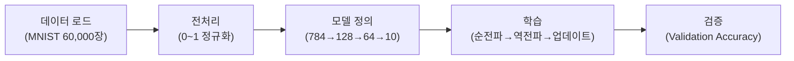
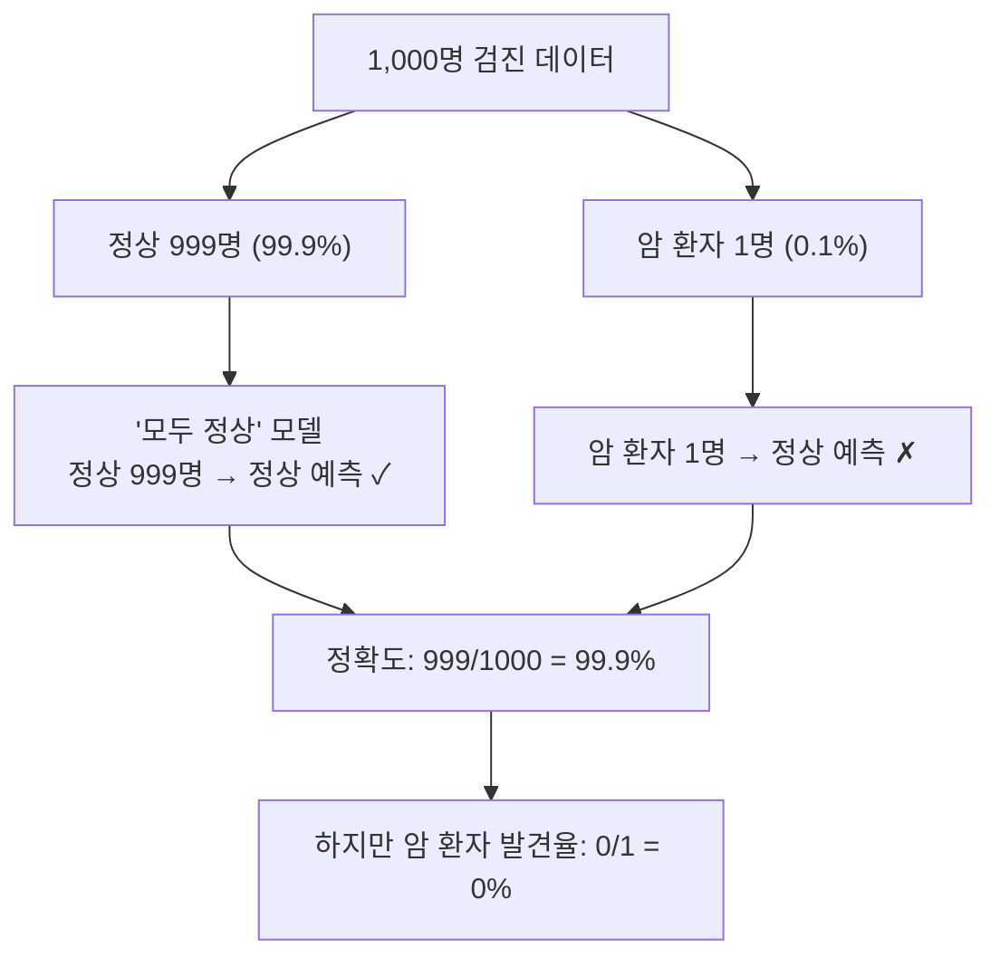
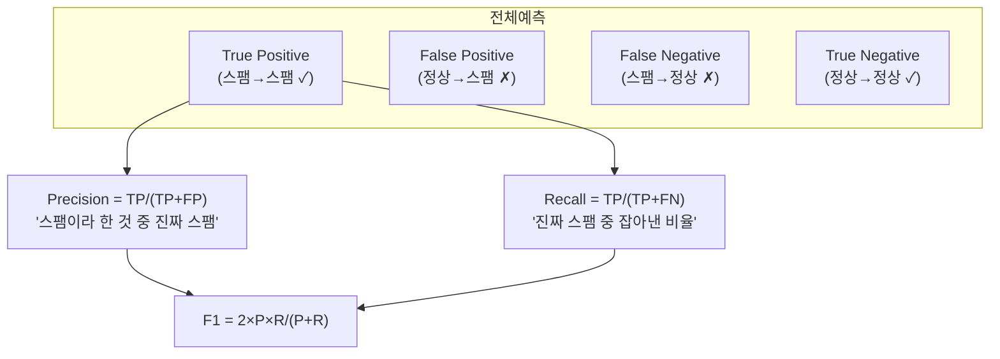
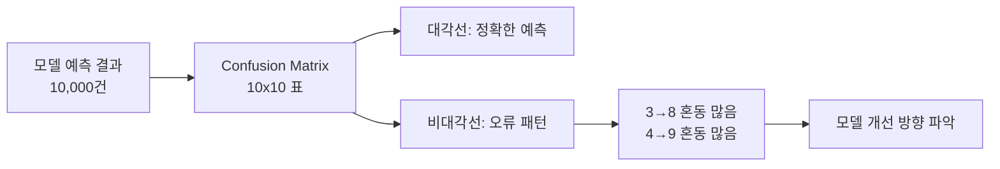

# 4. MLP 구현과 분류 성능 평가

## 학습 목표
- MNIST용 MLP 분류기를 처음부터 끝까지 구현하고 학습시킬 수 있다.
- 학습 손실, 학습 정확도, 검증 정확도, 최종 테스트 정확도를 구분해 해석할 수 있다.
- 정확도만으로는 모델 성능을 충분히 설명할 수 없음을 불균형 데이터 사례로 설명할 수 있다.
- Precision, Recall, F1 Score, Confusion Matrix의 역할을 구분할 수 있다.
- ROC-AUC와 Hold-out, K-Fold 검증 전략의 쓰임을 설명할 수 있다.

MNIST 모델을 먼저 실행해봤고, 역전파와 최적화 원리를 배웠습니다.
그 원리를 바탕으로 **MLP 분류기를 직접 구현하고**, **정확도 이후의 평가 지표**로 시야를 넓힙니다.

<a id="toc"></a>

## 진행 순서

1. [MLP 통합 실습 도입](#part1)
2. [MLP MNIST 분류기 구현 실습](#part2)
3. [정확도의 함정 — 불균형 데이터 케이스 스터디](#part4)
4. [Precision / Recall / F1 Score](#part5)
5. [Confusion Matrix 실습 + 모델 오류 패턴 분석](#part6)
6. [ROC-AUC 개념 + 검증 전략](#part7)

---


<a id="part1"></a>

### Part 1. MLP 통합 실습 도입 [↑](#toc)


- **빈도 높은 에러 1**: 학습률 0.1로 설정 시 loss가 NaN으로 발산하는 현상. 원인은 학습률이 과도하게 커서 가중치 업데이트가 폭주한 것이다.
- **빈도 높은 에러 2**: `optimizer.zero_grad()`를 빠트려 기울기가 누적되어 학습이 불안정해지는 현상. PyTorch에서 기울기는 자동으로 초기화되지 않으므로 매 반복마다 명시적으로 호출해야 한다.




```python
import torch
import torch.nn as nn
import torch.optim as optim
from torchvision import datasets, transforms
from torch.utils.data import DataLoader, random_split

# ===== 1단계: 데이터 로드 + 2단계: 전처리 =====
transform = transforms.ToTensor()  # 0~255 → 0.0~1.0 자동 정규화

torch.manual_seed(42)

full_train_dataset = datasets.MNIST(
    root='./data', train=True, download=True, transform=transform
)
test_dataset = datasets.MNIST(
    root='./data', train=False, download=True, transform=transform
)

train_size = len(full_train_dataset) - 5000
val_size = 5000
train_dataset, val_dataset = random_split(
    full_train_dataset,
    [train_size, val_size],
    generator=torch.Generator().manual_seed(42),
)

train_loader = DataLoader(train_dataset, batch_size=64, shuffle=True)
val_loader = DataLoader(val_dataset, batch_size=64, shuffle=False)
test_loader = DataLoader(test_dataset, batch_size=64, shuffle=False)

# ===== 3단계: 모델 정의 =====
class MLP(nn.Module):
    def __init__(self):
        super(MLP, self).__init__()
        self.flatten = nn.Flatten()           # 28x28 → 784
        self.fc1 = nn.Linear(784, 128)        # 입력층 → 은닉층 1
        self.relu1 = nn.ReLU()                # 활성화함수
        self.fc2 = nn.Linear(128, 64)         # 은닉층 1 → 은닉층 2
        self.relu2 = nn.ReLU()                # 활성화함수
        self.fc3 = nn.Linear(64, 10)          # 은닉층 2 → 출력층

    def forward(self, x):
        x = self.flatten(x)
        x = self.relu1(self.fc1(x))
        x = self.relu2(self.fc2(x))
        x = self.fc3(x)                       # 출력층에는 활성화함수 없음
        return x                              # CrossEntropyLoss가 softmax 포함

model = MLP()
print(model)


```

```
MLP(
  (flatten): Flatten(start_dim=1, end_dim=-1)
  (fc1): Linear(in_features=784, out_features=128, bias=True)
  (relu1): ReLU()
  (fc2): Linear(in_features=128, out_features=64, bias=True)
  (relu2): ReLU()
  (fc3): Linear(in_features=64, out_features=10, bias=True)
)
```

#### 예시 1: 모델 구조 출력 확인

**학습목표**: `print(model)` 출력으로 MLP의 층 구성과 데이터 흐름(784 → 128 → 64 → 10)을 읽을 수 있다.

---


#### 예시 자료

```text
MLP(
  (flatten): Flatten(start_dim=1, end_dim=-1)
  (fc1): Linear(in_features=784, out_features=128, bias=True)
  (relu1): ReLU()
  (fc2): Linear(in_features=128, out_features=64, bias=True)
  (relu2): ReLU()
  (fc3): Linear(in_features=64, out_features=10, bias=True)
)
```


**핵심 교훈**: 모델 구조를 출력하면 각 층의 입출력 크기와 파라미터 존재 여부를 확인할 수 있다. 784 → 128 → 64 → 10으로 점점 압축되는 구조는 수도관이 점점 좁아지며 핵심만 남기는 것과 같다.

##### ★ 예시 2: 파라미터 수 확인 (핵심)


```python
total_params = sum(p.numel() for p in model.parameters())
print(f"총 파라미터 수: {total_params:,}")

# 층별 파라미터 수
for name, param in model.named_parameters():
    print(f"  {name}: {param.numel():,}")


```

```
총 파라미터 수: 109,386
  fc1.weight: 100,352
  fc1.bias: 128
  fc2.weight: 8,192
  fc2.bias: 64
  fc3.weight: 640
  fc3.bias: 10
```

<a id="part2"></a>

### Part 2. MLP MNIST 분류기 구현 실습 [↑](#toc)


**핵심 교훈**: 약 11만 개의 숫자(가중치와 편향)가 학습 과정에서 조정된다. fc1.weight가 100,352개(784 x 128)로 전체의 91%를 차지한다. "지금 내 코드에서 무엇이 학습되고 있는가?"라는 질문에 대한 답: 이 11만 개의 숫자가 역전파와 경사하강법으로 점점 최적화된다.

##### ◇ 예시 3: 데이터 시각화 (심화)


```python
import matplotlib.pyplot as plt

fig, axes = plt.subplots(2, 5, figsize=(12, 5))
for i, ax in enumerate(axes.flat):
    image, label = train_dataset[i]
    ax.imshow(image.squeeze(), cmap='gray')
    ax.set_title(f'Label: {label}')
    ax.axis('off')
plt.tight_layout()
plt.show()


```

```
<Figure size 1200x500 with 10 Axes>
```

**핵심 교훈**: 데이터를 시각화하면 실제로 어떤 이미지를 분류하는지 직관적으로 이해할 수 있다. 같은 숫자라도 사람마다 필체가 다르므로 모델은 다양한 변형을 학습해야 한다.


```python
import torch
import torch.nn as nn
import torch.optim as optim
from torchvision import datasets, transforms
from torch.utils.data import DataLoader, random_split

transform = transforms.ToTensor()

torch.manual_seed(42)

full_train_dataset = datasets.MNIST(
    root='./data', train=True, download=True, transform=transform
)
test_dataset = datasets.MNIST(
    root='./data', train=False, download=True, transform=transform
)

train_size = len(full_train_dataset) - 5000
val_size = 5000
train_dataset, val_dataset = random_split(
    full_train_dataset,
    [train_size, val_size],
    generator=torch.Generator().manual_seed(42),
)

train_loader = DataLoader(train_dataset, batch_size=64, shuffle=True)
val_loader = DataLoader(val_dataset, batch_size=64, shuffle=False)
test_loader = DataLoader(test_dataset, batch_size=64, shuffle=False)

class MLP(nn.Module):
    def __init__(self):
        super(MLP, self).__init__()
        self.flatten = nn.Flatten()
        self.fc1 = nn.Linear(784, 128)
        self.relu1 = nn.ReLU()
        self.fc2 = nn.Linear(128, 64)
        self.relu2 = nn.ReLU()
        self.fc3 = nn.Linear(64, 10)

    def forward(self, x):
        x = self.flatten(x)
        x = self.relu1(self.fc1(x))
        x = self.relu2(self.fc2(x))
        x = self.fc3(x)
        return x

model = MLP()
print(model)

# 손실 함수와 옵티마이저 설정
criterion = nn.CrossEntropyLoss()
optimizer = optim.Adam(model.parameters(), lr=0.001)


```

```
MLP(
  (flatten): Flatten(start_dim=1, end_dim=-1)
  (fc1): Linear(in_features=784, out_features=128, bias=True)
  (relu1): ReLU()
  (fc2): Linear(in_features=128, out_features=64, bias=True)
  (relu2): ReLU()
  (fc3): Linear(in_features=64, out_features=10, bias=True)
)
```

```python
import matplotlib.pyplot as plt

total_params = sum(p.numel() for p in model.parameters())
print(f"총 파라미터 수: {total_params:,}")

fig, axes = plt.subplots(2, 5, figsize=(12, 5))
for i, ax in enumerate(axes.flat):
    image, label = train_dataset[i]
    ax.imshow(image.squeeze(), cmap='gray')
    ax.set_title(f'Label: {label}')
    ax.axis('off')
plt.tight_layout()
plt.show()

images, labels = next(iter(train_loader))
print(f"배치 이미지 형태: {images.shape}")
print(f"배치 라벨 형태: {labels.shape}")


```

```
총 파라미터 수: 109,386
```

```
<Figure size 1200x500 with 10 Axes>
```

```
배치 이미지 형태: torch.Size([64, 1, 28, 28])
배치 라벨 형태: torch.Size([64])
```


##### 흔한 실수 시나리오

| 실수 | 에러 메시지/증상 | 해결 |
|------|---------------|------|
| `train_dataset` 대신 `train_loader`에서 인덱싱 시도 | `TypeError: 'DataLoader' object is not subscriptable` | DataLoader는 반복자(iterator)이므로 인덱싱 불가. 개별 샘플 접근은 dataset 객체를 사용한다 |
| `image.squeeze()` 없이 `imshow` 호출 | 3차원 텐서 경고 또는 빈 이미지 | `squeeze()`로 채널 차원(1)을 제거하여 2차원으로 만든다 |
| 배치 형태에서 1이 뭔지 혼란 | 이해 오류 (에러는 아님) | 1은 회색조 이미지의 채널 수. RGB 이미지라면 3이 된다 |

---


```python
# ===== 4단계: 학습 =====
num_epochs = 5
train_losses = []
train_accs = []
val_accs = []

for epoch in range(num_epochs):
    model.train()  # 학습 모드
    running_loss = 0.0
    correct = 0
    total = 0

    for images, labels in train_loader:
        # Step 1: 기울기 초기화
        optimizer.zero_grad()

        # Step 2: 순전파
        outputs = model(images)

        # Step 3: 손실 계산
        loss = criterion(outputs, labels)

        # Step 4: 역전파
        loss.backward()

        # Step 5: 가중치 업데이트
        optimizer.step()

        # 통계 기록
        running_loss += loss.item()
        _, predicted = torch.max(outputs, 1)
        total += labels.size(0)
        correct += (predicted == labels).sum().item()

    epoch_loss = running_loss / len(train_loader)
    epoch_acc = 100.0 * correct / total

    model.eval()
    val_correct = 0
    val_total = 0
    with torch.no_grad():
        for val_images, val_labels in val_loader:
            val_outputs = model(val_images)
            _, val_predicted = torch.max(val_outputs, 1)
            val_total += val_labels.size(0)
            val_correct += (val_predicted == val_labels).sum().item()

    val_acc = 100.0 * val_correct / val_total

    train_losses.append(epoch_loss)
    train_accs.append(epoch_acc)
    val_accs.append(val_acc)

    print(f"Epoch [{epoch+1}/{num_epochs}] "
          f"Loss: {epoch_loss:.4f}  Accuracy: {epoch_acc:.2f}%  Val Acc: {val_acc:.2f}%")

final_train_acc = train_accs[-1]
final_val_acc = val_accs[-1]


```

```
Epoch [1/5] Loss: 0.3478  Accuracy: 90.29%  Val Acc: 93.86%
Epoch [2/5] Loss: 0.1448  Accuracy: 95.72%  Val Acc: 95.60%
Epoch [3/5] Loss: 0.1004  Accuracy: 96.93%  Val Acc: 96.52%
Epoch [4/5] Loss: 0.0745  Accuracy: 97.76%  Val Acc: 96.92%
Epoch [5/5] Loss: 0.0585  Accuracy: 98.15%  Val Acc: 96.86%
```

**핵심 교훈**: 에폭이 진행될수록 손실은 줄어들고 학습 정확도는 올라간다. 이때 함께 보는 값은 테스트가 아니라 검증 정확도이며, 학습 정확도와 지나치게 벌어지지 않는지 확인해야 한다.

```python
# ===== 5단계: 평가 =====
model.eval()  # 평가 모드
correct = 0
total = 0

with torch.no_grad():  # 기울기 계산 비활성화 (평가 시 불필요)
    for images, labels in test_loader:
        outputs = model(images)
        _, predicted = torch.max(outputs, 1)
        total += labels.size(0)
        correct += (predicted == labels).sum().item()

test_acc = 100.0 * correct / total
print(f"테스트 정확도: {test_acc:.2f}%")


```

```
테스트 정확도: 96.95%
```

**핵심 교훈**: `model.eval()`은 모델을 평가 모드로 전환한다(Dropout 등 비활성화). `torch.no_grad()`는 기울기 계산을 끄고 메모리를 절약한다. 과적합 여부를 볼 때는 테스트 정확도가 아니라 검증 정확도와 학습 정확도를 비교하는 것이 안전하다.

##### ◇ 예시 3: 학습 곡선 시각화 (심화)


```python
import matplotlib.pyplot as plt

epochs = range(1, num_epochs + 1)
fig, (ax1, ax2) = plt.subplots(1, 2, figsize=(12, 4))

ax1.plot(epochs, train_losses, 'b-o')
ax1.set_xlabel('Epoch')
ax1.set_ylabel('Loss')
ax1.set_title('Training Loss')

ax2.plot(epochs, train_accs, 'r-o', label='Train Accuracy')
ax2.plot(epochs, val_accs, 'g-o', label='Validation Accuracy')
ax2.set_xlabel('Epoch')
ax2.set_ylabel('Accuracy (%)')
ax2.set_title('Train vs Validation Accuracy')
ax2.legend()

plt.tight_layout()
plt.show()


```

```
<Figure size 1200x400 with 2 Axes>
```

**핵심 교훈**: 학습 곡선을 시각화하면 모델이 정상적으로 학습하고 있는지 한눈에 확인할 수 있다. 손실이 감소하고 정확도가 증가하는 곡선이 정상이다. Day 2에서 관찰한 과적합도 학습 정확도는 계속 오르는데 검증 정확도가 정체되거나 하락하는 패턴으로 확인한다.


```python
for epoch, (epoch_loss, epoch_acc) in enumerate(zip(train_losses, train_accs), start=1):
    print(f"Epoch [{epoch}/{num_epochs}] Loss: {epoch_loss:.4f}  Accuracy: {epoch_acc:.2f}%")

print(f"\n검증 정확도: {val_accs[-1]:.2f}%")


```

```
Epoch [1/5] Loss: 0.3478  Accuracy: 90.29%
Epoch [2/5] Loss: 0.1448  Accuracy: 95.72%
Epoch [3/5] Loss: 0.1004  Accuracy: 96.93%
Epoch [4/5] Loss: 0.0745  Accuracy: 97.76%
Epoch [5/5] Loss: 0.0585  Accuracy: 98.15%

검증 정확도: 96.86%
```

```python
class MLP_Experiment(nn.Module):
    def __init__(self, hidden1=256, hidden2=128):
        super().__init__()
        self.flatten = nn.Flatten()
        self.fc1 = nn.Linear(784, hidden1)
        self.relu1 = nn.ReLU()
        self.fc2 = nn.Linear(hidden1, hidden2)
        self.relu2 = nn.ReLU()
        self.fc3 = nn.Linear(hidden2, 10)

    def forward(self, x):
        x = self.flatten(x)
        x = self.relu1(self.fc1(x))
        x = self.relu2(self.fc2(x))
        x = self.fc3(x)
        return x


torch.manual_seed(42)

model_exp = MLP_Experiment(hidden1=256, hidden2=128)
criterion_exp = nn.CrossEntropyLoss()
optimizer_exp = optim.Adam(model_exp.parameters(), lr=0.001)

for epoch in range(5):
    model_exp.train()
    running_loss = 0.0
    correct = 0
    total = 0
    for images, labels in train_loader:
        optimizer_exp.zero_grad()
        outputs = model_exp(images)
        loss = criterion_exp(outputs, labels)
        loss.backward()
        optimizer_exp.step()
        running_loss += loss.item()
        _, predicted = torch.max(outputs, 1)
        total += labels.size(0)
        correct += (predicted == labels).sum().item()
    print(f"Epoch [{epoch+1}/5] Loss: {running_loss/len(train_loader):.4f}  Acc: {100*correct/total:.2f}%")

model_exp.eval()
val_correct = 0
val_total = 0
with torch.no_grad():
    for images, labels in val_loader:
        outputs = model_exp(images)
        _, predicted = torch.max(outputs, 1)
        val_total += labels.size(0)
        val_correct += (predicted == labels).sum().item()

exp_val_acc = 100.0 * val_correct / val_total
print(f"기본 모델 검증 정확도: {final_val_acc:.2f}%")
print(f"실험 모델 검증 정확도: {exp_val_acc:.2f}%")
print(f"검증 정확도 차이: {exp_val_acc - final_val_acc:+.2f}%p")


```

```
Epoch [1/5] Loss: 0.3060  Acc: 91.19%
Epoch [2/5] Loss: 0.1166  Acc: 96.42%
Epoch [3/5] Loss: 0.0746  Acc: 97.73%
Epoch [4/5] Loss: 0.0547  Acc: 98.30%
Epoch [5/5] Loss: 0.0406  Acc: 98.68%
기본 모델 검증 정확도: 96.86%
실험 모델 검증 정확도: 97.50%
검증 정확도 차이: +0.64%p
```

은닉층을 키운 모델이 항상 더 좋은 것은 아니다. 구조 변경 비교는 테스트가 아니라 검증 정확도로 판단하고, 마지막에 선택된 모델에 대해서만 테스트 정확도를 확인하는 흐름이 안전하다.

##### 흔한 실수 시나리오

| 실수 | 에러 메시지/증상 | 해결 |
|------|---------------|------|
| 실험 모델에 기존 옵티마이저 재사용 | 학습이 전혀 진행되지 않음 (loss 변화 없음) | 새 모델에 대한 새 옵티마이저를 생성해야 한다: `optim.Adam(model_exp.parameters())` |
| `model.eval()` 없이 평가 | 정확도가 미세하게 다름 (현재 MLP에서는 큰 차이 없음) | 좋은 습관으로 `model.eval()` + `torch.no_grad()`를 항상 사용한다 |
| GPU/CPU 디바이스 불일치 | `RuntimeError: Expected all tensors to be on the same device` | 현재 CPU 실행이므로 발생하지 않지만, GPU 사용 시 모델과 데이터를 같은 디바이스로 이동해야 한다 |

---




```python
import numpy as np

# 1,000명 중 암 환자 10명 (1%)
np.random.seed(42)
y_true = np.array([1]*10 + [0]*990)  # 1=암, 0=정상

# 모델 A: "모두 정상"이라고 예측
y_pred_A = np.zeros(1000)

# 모델 B: 암 8명 발견, 정상 중 50명을 암으로 오판
y_pred_B = np.zeros(1000)
y_pred_B[:8] = 1     # 암 환자 10명 중 8명 발견
y_pred_B[10:60] = 1  # 정상인 50명을 암으로 오판

accuracy_A = np.mean(y_true == y_pred_A)
accuracy_B = np.mean(y_true == y_pred_B)

print(f"모델 A (모두 정상 예측) 정확도: {accuracy_A:.1%}")
print(f"모델 B (8명 발견, 50명 오판) 정확도: {accuracy_B:.1%}")


```

```
모델 A (모두 정상 예측) 정확도: 99.0%
모델 B (8명 발견, 50명 오판) 정확도: 94.8%
```

<a id="part4"></a>

### Part 4. 정확도의 함정 — 불균형 데이터 케이스 스터디 [↑](#toc)

**핵심 교훈**: 모델 A가 정확도 99%로 모델 B(94.8%)보다 높지만, 모델 A는 암 환자를 한 명도 발견하지 못했다. 모델 B는 암 환자 10명 중 8명을 발견했다. 실제 병원에서는 모델 B가 훨씬 유용하다. 정확도만 보면 잘못된 선택을 하게 된다.

##### ★ 예시 2: MNIST에서 인위적 불균형 만들기 (핵심)


```python
from torchvision import datasets, transforms
from collections import Counter

transform = transforms.ToTensor()
train_data = datasets.MNIST(root='./data', train=True, download=True, transform=transform)

# 원본 분포 확인
original_dist = Counter([label for _, label in train_data])
print("원본 분포:")
for digit in range(10):
    print(f"  숫자 {digit}: {original_dist[digit]:,}장")


```

```
원본 분포:
  숫자 0: 5,923장
  숫자 1: 6,742장
  숫자 2: 5,958장
  숫자 3: 6,131장
  숫자 4: 5,842장
  숫자 5: 5,421장
  숫자 6: 5,918장
  숫자 7: 6,265장
  숫자 8: 5,851장
  숫자 9: 5,949장
```

**핵심 교훈**: MNIST는 각 숫자가 약 6,000장씩 균등 분포하여 "균형 데이터"이다. 이 경우 정확도는 신뢰할 수 있는 지표이다. 하지만 현실 데이터(암 진단, 사기 탐지, 이상 감지)는 대부분 불균형이다.

##### ◇ 예시 3: 불균형에서 정확도의 무의미함 수치 확인 (심화)


```python
# 다양한 불균형 비율에서 "다수 클래스만 예측"의 정확도
ratios = [0.001, 0.01, 0.05, 0.1, 0.3, 0.5]
print("\n불균형 비율별 '다수 클래스만 예측' 정확도:")
print(f"{'소수 비율':>10} | {'다수만 예측 정확도':>18}")
print("-" * 33)
for r in ratios:
    acc = 1 - r
    print(f"{r:>10.1%} | {acc:>18.1%}")

```

```

불균형 비율별 '다수 클래스만 예측' 정확도:
     소수 비율 |         다수만 예측 정확도
---------------------------------
      0.1% |              99.9%
      1.0% |              99.0%
      5.0% |              95.0%
     10.0% |              90.0%
     30.0% |              70.0%
     50.0% |              50.0%
```

**핵심 교훈**: 소수 클래스 비율이 작을수록 "아무것도 하지 않는" 모델의 정확도가 높아진다. 0.1% 불균형에서는 99.9%까지 올라간다. 이것이 정확도의 함정이다.

#### 함께 보기: 안내 활동 (15분)


```python
scenarios = [
    {
        "상황": "스팸 필터",
        "더 위험한 오류": "FP",
        "이유": "정상 메일을 스팸으로 보내면 중요한 메일을 놓칠 수 있음",
    },
    {
        "상황": "암 진단",
        "더 위험한 오류": "FN",
        "이유": "암 환자를 놓치면 치료 기회를 잃을 수 있음",
    },
    {
        "상황": "자율주행 보행자 감지",
        "더 위험한 오류": "FN",
        "이유": "보행자를 놓치면 사고로 이어질 수 있음",
    },
]

print("상황별로 더 위험한 오류:")
for scenario in scenarios:
    print(f"- {scenario['상황']}: {scenario['더 위험한 오류']} | {scenario['이유']}")


```

```
상황별로 더 위험한 오류:
- 스팸 필터: FP | 정상 메일을 스팸으로 보내면 중요한 메일을 놓칠 수 있음
- 암 진단: FN | 암 환자를 놓치면 치료 기회를 잃을 수 있음
- 자율주행 보행자 감지: FN | 보행자를 놓치면 사고로 이어질 수 있음
```


모범 답안 예시: "불균형 데이터에서 정확도는 다수 클래스에 치우치므로, 소수 클래스를 얼마나 잘 찾아내는지(Recall)와 예측의 신뢰도(Precision)를 별도로 확인해야 한다."


##### 흔한 실수 시나리오

| 실수 | 에러 메시지/증상 | 해결 |
|------|---------------|------|
| "데이터를 균형 있게 만들면 된다"고만 답변 | 개념 이해 부족 | 데이터 리샘플링은 하나의 방법이지만, 평가 지표 자체를 바꾸는 것이 더 근본적이다. 다음 교시에서 Precision/Recall을 배운다 |
| FP와 FN을 혼동 | 용어 혼란 | FP = "양성이라고 했는데 틀린 것(실제는 음성)", FN = "음성이라고 했는데 틀린 것(실제는 양성)"으로 재정리한다 |

---





```python
# 스팸 필터 시나리오
# 전체 100건: 스팸 20건, 정상 80건
# 모델 예측: 스팸 25건 (진짜 스팸 18건 + 정상 오판 7건)

TP = 18  # 스팸을 스팸으로 맞춤
FP = 7   # 정상을 스팸으로 오판
FN = 2   # 스팸을 놓침 (정상으로 오판)
TN = 73  # 정상을 정상으로 맞춤

precision = TP / (TP + FP)
recall = TP / (TP + FN)
f1 = 2 * precision * recall / (precision + recall)
accuracy = (TP + TN) / (TP + FP + FN + TN)

print(f"=== 스팸 필터 평가 ===")
print(f"Accuracy:  {accuracy:.2%}")
print(f"Precision: {precision:.2%}  (스팸이라 한 25건 중 진짜 스팸 {TP}건)")
print(f"Recall:    {recall:.2%}  (실제 스팸 20건 중 잡아낸 {TP}건)")
print(f"F1 Score:  {f1:.2%}")


```

```
=== 스팸 필터 평가 ===
Accuracy:  91.00%
Precision: 72.00%  (스팸이라 한 25건 중 진짜 스팸 18건)
Recall:    90.00%  (실제 스팸 20건 중 잡아낸 18건)
F1 Score:  80.00%
```

<a id="part5"></a>

### Part 5. Precision / Recall / F1 Score [↑](#toc)

**핵심 교훈**: 정확도 91%보다 Precision 72%가 더 중요한 정보를 준다. 스팸이라고 판정한 25건 중 7건이 정상 메일이었다. 이 FP 7건은 사용자가 중요한 메일을 놓치게 만드는 원인이다.

##### ★ 예시 2: 암 진단 시나리오 (핵심)


```python
# 암 진단 시나리오
# 전체 1,000건: 암 환자 10명, 정상 990명
# 모델 예측: 양성 30건 (암 환자 8명 + 정상 오판 22명)

TP_c = 8    # 암 환자를 암으로 맞춤
FP_c = 22   # 정상을 암으로 오판
FN_c = 2    # 암 환자를 놓침
TN_c = 968  # 정상을 정상으로 맞춤

precision_c = TP_c / (TP_c + FP_c)
recall_c = TP_c / (TP_c + FN_c)
f1_c = 2 * precision_c * recall_c / (precision_c + recall_c)
accuracy_c = (TP_c + TN_c) / (TP_c + FP_c + FN_c + TN_c)

print(f"\n=== 암 진단 평가 ===")
print(f"Accuracy:  {accuracy_c:.2%}")
print(f"Precision: {precision_c:.2%}  (양성 판정 30건 중 실제 암 {TP_c}건)")
print(f"Recall:    {recall_c:.2%}  (실제 암 환자 10명 중 발견 {TP_c}명)")
print(f"F1 Score:  {f1_c:.2%}")
print(f"\n놓친 암 환자: {FN_c}명 ← 이것이 가장 위험!")


```

```

=== 암 진단 평가 ===
Accuracy:  97.60%
Precision: 26.67%  (양성 판정 30건 중 실제 암 8건)
Recall:    80.00%  (실제 암 환자 10명 중 발견 8명)
F1 Score:  40.00%

놓친 암 환자: 2명 ← 이것이 가장 위험!
```

**핵심 교훈**: 정확도 97.6%이지만 Precision은 26.7%에 불과하다. 양성 판정 30건 중 실제 암은 8건뿐이다. 그러나 암 진단에서는 Recall 80%(10명 중 8명 발견)이 더 중요하다. 놓친 2명이 치료 기회를 잃을 수 있기 때문이다.

##### ◇ 예시 3: F1 Score의 조화평균 효과 (심화)


```python
# 조화평균 vs 산술평균 비교
cases = [
    ("균형 모델", 0.80, 0.80),
    ("Precision 치우침", 1.00, 0.01),
    ("Recall 치우침", 0.01, 1.00),
]
print(f"\n{'모델':>16} | {'P':>5} | {'R':>5} | {'산술평균':>8} | {'F1(조화)':>8}")
print("-" * 55)
for name, p, r in cases:
    arithmetic = (p + r) / 2
    f1 = 2 * p * r / (p + r) if (p + r) > 0 else 0
    print(f"{name:>16} | {p:>5.2f} | {r:>5.2f} | {arithmetic:>8.2f} | {f1:>8.2f}")


```

```

              모델 |     P |     R |     산술평균 |   F1(조화)
-------------------------------------------------------
           균형 모델 |  0.80 |  0.80 |     0.80 |     0.80
   Precision 치우침 |  1.00 |  0.01 |     0.51 |     0.02
      Recall 치우침 |  0.01 |  1.00 |     0.51 |     0.02
```

**핵심 교훈**: Precision=1.0, Recall=0.01인 모델은 "확실한 1건만 맞힌" 것이다. 산술평균은 0.51로 괜찮아 보이지만, F1은 0.02로 거의 쓸모없음을 정확히 반영한다.


| 지표 | 의미 | 수식 | 중시하는 경우 |
|------|------|------|------------|
| Precision | 양성 예측 중 실제 양성 비율 | TP / (TP + **FP**) | **FP** 비용이 큰 경우 (스팸 필터) |
| Recall | 실제 양성 중 올바른 예측 비율 | TP / (TP + **FN**) | **FN** 비용이 큰 경우 (암 진단) |
| F1 | Precision과 Recall의 **조화평균** | 2PR / (P + R) | 둘 다 비슷하게 중요할 때 (사기 탐지) |


모범 비유 예시:
- **Precision**: "낚시할 때 잡은 물고기 중 먹을 수 있는 물고기의 비율. 쓰레기를 많이 건지면 Precision이 낮다."
- **Recall**: "바다에 있는 먹을 수 있는 물고기 중 실제로 잡아 올린 비율. 많이 놓치면 Recall이 낮다."
- **F1**: "먹을 수 있는 물고기를 많이 잡으면서(Recall) 쓰레기는 적게 건진(Precision) 종합 낚시 실력."

##### 흔한 실수 시나리오

| 실수 | 에러 메시지/증상 | 해결 |
|------|---------------|------|
| Precision과 Recall의 분모를 혼동 | "Precision = TP/(TP+FN)"이라고 설명 | Precision의 분모는 "모델이 양성이라 한 것 전체(TP+FP)", Recall의 분모는 "실제 양성 전체(TP+FN)"이다. P의 분모에 P(FP), R의 분모에 N(FN)이 있다고 기억한다 |
| F1을 산술평균으로 계산 | F1 값이 조화평균보다 높게 나옴 | F1 = 2PR/(P+R)이며, (P+R)/2가 아님을 강조한다 |

---





<a id="part6"></a>

### Part 6. Confusion Matrix 실습 + 모델 오류 패턴 분석 [↑](#toc)

```python
# D3-3에서 학습한 모델을 사용하여 Confusion Matrix 생성
import numpy as np
import matplotlib.pyplot as plt
import seaborn as sns
from sklearn.metrics import confusion_matrix, classification_report

# 테스트 데이터 전체에 대한 예측 수집
model.eval()
all_preds = []
all_labels = []

with torch.no_grad():
    for images, labels in test_loader:
        outputs = model(images)
        _, predicted = torch.max(outputs, 1)
        all_preds.extend(predicted.cpu().numpy())
        all_labels.extend(labels.cpu().numpy())

all_preds = np.array(all_preds)
all_labels = np.array(all_labels)

# Confusion Matrix 계산
cm = confusion_matrix(all_labels, all_preds)

def plot_confusion_heatmap(cm):
    plt.figure(figsize=(10, 8))
    sns.heatmap(cm, annot=True, fmt='d', cmap='Blues',
                xticklabels=range(10), yticklabels=range(10))
    plt.xlabel('Predicted Label')
    plt.ylabel('True Label')
    plt.title('MNIST MLP Confusion Matrix')
    plt.tight_layout()
    plt.show()

def show_common_error_examples(cm, all_labels, all_preds, dataset, max_examples=5):
    cm_no_diag = cm.copy()
    np.fill_diagonal(cm_no_diag, 0)
    max_idx = np.unravel_index(cm_no_diag.argmax(), cm_no_diag.shape)
    print(f"가장 많이 혼동하는 쌍: 실제 {max_idx[0]} → 예측 {max_idx[1]} ({cm_no_diag[max_idx]}건)")

    wrong_mask = (all_labels == max_idx[0]) & (all_preds == max_idx[1])
    wrong_indices = np.where(wrong_mask)[0]
    num_examples = min(max_examples, len(wrong_indices))

    if num_examples == 0:
        print("선택된 혼동 쌍의 오분류 사례가 없습니다.")
        return max_idx, wrong_indices

    fig, axes = plt.subplots(1, num_examples, figsize=(3 * num_examples, 3))
    if num_examples == 1:
        axes = [axes]

    for i, ax in enumerate(axes):
        idx = wrong_indices[i]
        image, _ = dataset[idx]
        ax.imshow(image.squeeze(), cmap='gray')
        ax.set_title(f'True: {max_idx[0]}, Pred: {max_idx[1]}')
        ax.axis('off')

    plt.suptitle(f'오분류 사례: {max_idx[0]} → {max_idx[1]}')
    plt.tight_layout()
    plt.show()
    return max_idx, wrong_indices

# 히트맵 시각화
plot_confusion_heatmap(cm)


```

```
<Figure size 1000x800 with 2 Axes>
```


```text
10x10 히트맵이 표시된다. 대각선이 진한 파란색(높은 값)이고,
비대각선은 대부분 연한 색(낮은 값)이다.
특히 (3,5), (4,9), (3,8), (7,9) 위치에 약간의 오분류가 보인다.
```


**핵심 교훈**: 히트맵에서 대각선 외의 진한 칸이 모델의 주요 오류 지점이다. 시각화 하나로 97%의 정확도 뒤에 숨겨진 3%의 오류 패턴을 파악할 수 있다.

##### ★ 예시 2: classification_report로 클래스별 성능 (핵심)


```python
print(classification_report(all_labels, all_preds, digits=4))
```

```
              precision    recall  f1-score   support

           0     0.9827    0.9847    0.9837       980
           1     0.9886    0.9894    0.9890      1135
           2     0.9646    0.9777    0.9711      1032
           3     0.9097    0.9871    0.9468      1010
           4     0.9833    0.9593    0.9711       982
           5     0.9660    0.9552    0.9605       892
           6     0.9883    0.9666    0.9773       958
           7     0.9671    0.9728    0.9699      1028
           8     0.9776    0.9405    0.9587       974
           9     0.9728    0.9564    0.9645      1009

    accuracy                         0.9695     10000
   macro avg     0.9701    0.9690    0.9693     10000
weighted avg     0.9701    0.9695    0.9696     10000
```

**핵심 교훈**: 숫자 1은 Precision 99.1%, Recall 99.2%로 가장 잘 분류되고, 숫자 8과 9는 상대적으로 낮은 성능(F1 약 96%)을 보인다. 클래스별 성능 차이는 글자 형태의 유사성에서 비롯된다.

##### ◇ 예시 3: 오분류 이미지 직접 확인 (심화)


```python
import subprocess
import matplotlib.pyplot as plt
import matplotlib.font_manager as fm

# 1) 나눔고딕 폰트 설치
subprocess.run(['apt-get', '-qq', 'update'], check=True)
subprocess.run(['apt-get', '-qq', '-y', 'install', 'fonts-nanum'], check=True)

# 2) 설치된 폰트 파일을 matplotlib에 직접 등록
font_files = fm.findSystemFonts(fontpaths=['/usr/share/fonts/truetype/nanum'])
for fpath in font_files:
    fm.fontManager.addfont(fpath)

# 3) 기본 폰트를 나눔고딕으로 설정
plt.rcParams['font.family'] = 'NanumGothic'
plt.rcParams['axes.unicode_minus'] = False

```

```python
max_idx, wrong_indices = show_common_error_examples(
    cm, all_labels, all_preds, test_dataset
)
```

```
가장 많이 혼동하는 쌍: 실제 8 → 예측 3 (35건)
```

```
<Figure size 1500x300 with 5 Axes>
```

**핵심 교훈**: 오분류 이미지를 직접 보면 "이건 사람이 봐도 헷갈린다"라는 경우가 많다. 모델의 한계를 이해하고, 데이터 품질이나 모델 구조 개선의 방향을 잡을 수 있다.


```python
# 앞선 예시 1, 2에서 계산한 결과를 재사용하여 한 번에 다시 확인
plot_confusion_heatmap(cm)
print(classification_report(all_labels, all_preds, digits=4))
```

```
<Figure size 1000x800 with 2 Axes>
```

```
              precision    recall  f1-score   support

           0     0.9827    0.9847    0.9837       980
           1     0.9886    0.9894    0.9890      1135
           2     0.9646    0.9777    0.9711      1032
           3     0.9097    0.9871    0.9468      1010
           4     0.9833    0.9593    0.9711       982
           5     0.9660    0.9552    0.9605       892
           6     0.9883    0.9666    0.9773       958
           7     0.9671    0.9728    0.9699      1028
           8     0.9776    0.9405    0.9587       974
           9     0.9728    0.9564    0.9645      1009

    accuracy                         0.9695     10000
   macro avg     0.9701    0.9690    0.9693     10000
weighted avg     0.9701    0.9695    0.9696     10000
```


```text
10x10 히트맵 + 클래스별 precision/recall/f1 리포트 출력
```


```python
max_idx, wrong_indices = show_common_error_examples(
    cm, all_labels, all_preds, test_dataset
)

# 분석: 숫자 3과 5(또는 4와 9)는 상단부의 곡선 형태가 유사하여
# MLP가 784개 픽셀을 1차원으로 펼칠 때 공간 정보가 사라지면서 혼동한다.
# CNN은 공간 정보를 보존하므로 이 혼동을 줄일 수 있을 것이다.
```

```
가장 많이 혼동하는 쌍: 실제 8 → 예측 3 (35건)
```

```
<Figure size 1500x300 with 5 Axes>
```

오분류 이미지는 데이터 상태에 따라 0~5장까지 표시되며, 많은 경우 사람이 봐도 애매한 필체이다.

##### 흔한 실수 시나리오

| 실수 | 에러 메시지/증상 | 해결 |
|------|---------------|------|
| `np.fill_diagonal` 없이 최대값 찾기 | 대각선(정답)이 최대값으로 나옴 | `cm.copy()`로 복사 후 `np.fill_diagonal(cm_no_diag, 0)`으로 대각선 제거 |
| `wrong_indices`가 빈 배열 | 해당 오분류 사례가 0건 | max_idx를 다시 확인하거나, 상위 2~3개 혼동 쌍을 모두 시도 |
| `seaborn` 미설치 | `ModuleNotFoundError: No module named 'seaborn'` | `!pip install seaborn` 실행 후 다시 import |

---


<a id="part7"></a>

### Part 7. ROC-AUC 개념 + 검증 전략 [↑](#toc)

```python
diagram = r"""
flowchart LR
    subgraph ROC["ROC 곡선"]
        direction TB
        A["(0,0): 아무것도 양성 예측 안 함"]
        B["(1,1): 모든 것을 양성 예측"]
        C["(0,1): 완벽한 모델 ★"]
        D["대각선: 랜덤 모델"]
    end
    subgraph AUC["AUC 해석"]
        E["1.0 = 완벽"]
        F["0.9+ = 우수"]
        G["0.5 = 랜덤"]
    end
"""
render_mermaid(diagram)


```

```
<IPython.core.display.HTML object>
```

```python
import numpy as np
import matplotlib.pyplot as plt
from sklearn.metrics import roc_curve, auc

# 시뮬레이션: 좋은 모델 vs 나쁜 모델
np.random.seed(42)
y_true = np.array([1]*100 + [0]*900)  # 10% 양성

# 좋은 모델: 양성에 높은 점수
scores_good = np.random.normal(0.7, 0.15, 100).tolist() + \
              np.random.normal(0.3, 0.15, 900).tolist()
scores_good = np.clip(scores_good, 0, 1)

# 나쁜 모델: 거의 랜덤
scores_bad = np.random.uniform(0, 1, 1000)

# ROC 곡선 계산
fpr_good, tpr_good, _ = roc_curve(y_true, scores_good)
auc_good = auc(fpr_good, tpr_good)

fpr_bad, tpr_bad, _ = roc_curve(y_true, scores_bad)
auc_bad = auc(fpr_bad, tpr_bad)

# 시각화
plt.figure(figsize=(8, 6))
plt.plot(fpr_good, tpr_good, 'b-', label=f'Good Model (AUC={auc_good:.3f})')
plt.plot(fpr_bad, tpr_bad, 'r-', label=f'Bad Model (AUC={auc_bad:.3f})')
plt.plot([0, 1], [0, 1], 'k--', label='Random (AUC=0.500)')
plt.xlabel('False Positive Rate')
plt.ylabel('True Positive Rate')
plt.title('ROC Curve Comparison')
plt.legend()
plt.grid(True, alpha=0.3)
plt.tight_layout()
plt.show()

print(f"Good Model AUC: {auc_good:.3f}")
print(f"Bad Model AUC: {auc_bad:.3f}")


```

```
<Figure size 800x600 with 1 Axes>
```

```
Good Model AUC: 0.968
Bad Model AUC: 0.516
```

그래프에서 파란 선(좋은 모델)은 왼쪽 상단으로 크게 불룩하고, 빨간 선(나쁜 모델)은 대각선 근처에 위치한다.

**핵심 교훈**: AUC 0.935인 모델은 양성과 음성을 잘 구분하고, AUC 0.508인 모델은 랜덤 수준이다. ROC 곡선 하나로 모델의 전체 성능을 직관적으로 비교할 수 있다.

##### ★ 예시 2: K-Fold 직관 시각화 (핵심)


```python
# K-Fold 직관 시각화 (개념만, 실행은 생략)
fig, axes = plt.subplots(1, 5, figsize=(15, 2))
colors = ['#3498db', '#e74c3c']
for fold in range(5):
    ax = axes[fold]
    for i in range(5):
        color = colors[1] if i == fold else colors[0]
        label = 'Test' if i == fold else 'Train'
        ax.barh(0, 1, left=i, color=color, edgecolor='white', height=0.5)
    ax.set_title(f'Fold {fold+1}', fontsize=10)
    ax.set_xlim(0, 5)
    ax.set_ylim(-0.5, 0.5)
    ax.set_yticks([])
    ax.set_xticks([])
plt.suptitle('5-Fold Cross Validation (파란=학습, 빨간=테스트)', fontsize=12)
plt.tight_layout()
plt.show()

print("5-Fold: 5번 학습하여 5개의 성능 수치를 얻고 평균을 낸다")
print("장점: 모든 데이터가 한 번씩 테스트에 사용됨 → 더 신뢰성 있는 평가")
print("단점: 학습 시간이 5배 소요")


```

```
<Figure size 1500x200 with 5 Axes>
```

```
5-Fold: 5번 학습하여 5개의 성능 수치를 얻고 평균을 낸다
장점: 모든 데이터가 한 번씩 테스트에 사용됨 → 더 신뢰성 있는 평가
단점: 학습 시간이 5배 소요
```

**핵심 교훈**: K-Fold는 데이터를 K등분하여 테스트 세트를 돌려가며 평가한다. 5-Fold라면 5번 학습/평가를 반복하여 5개의 성능 수치의 평균을 낸다. Hold-out보다 평가 결과가 안정적이다.

##### ◇ 예시 3: Hold-out의 불안정성 데모 (심화)


```python
from sklearn.model_selection import train_test_split
from sklearn.linear_model import LogisticRegression

# 간단한 데이터로 Hold-out 반복 실험
from sklearn.datasets import make_classification
X, y = make_classification(n_samples=200, n_features=10, random_state=42)

accuracies = []
for seed in range(10):
    X_train, X_test, y_train, y_test = train_test_split(
        X, y, test_size=0.3, random_state=seed
    )
    clf = LogisticRegression(max_iter=1000)
    clf.fit(X_train, y_train)
    acc = clf.score(X_test, y_test)
    accuracies.append(acc)

print(f"Hold-out 10회 정확도: {[f'{a:.3f}' for a in accuracies]}")
print(f"평균: {np.mean(accuracies):.3f}, 표준편차: {np.std(accuracies):.3f}")
print(f"최소: {min(accuracies):.3f}, 최대: {max(accuracies):.3f}")


```

```
Hold-out 10회 정확도: ['0.867', '0.833', '0.800', '0.817', '0.833', '0.833', '0.800', '0.767', '0.900', '0.833']
평균: 0.828, 표준편차: 0.035
최소: 0.767, 최대: 0.900
```

**핵심 교훈**: 같은 데이터라도 Hold-out 분할이 달라지면 정확도가 상당히 달라질 수 있다. K-Fold는 이런 불안정성을 줄여준다.


| 개념 | 설명 | 직관적 비유 |
|------|------|-----------|
| ROC 곡선 | 임계값 변화에 따른 **TPR(Recall)**과 **FPR**의 변화를 그린 그래프 | 보안 게이트 **민감도** 조절 |
| AUC | ROC 곡선 아래 **면적** | 1에 가까울수록 **좋은 모델** |
| Hold-out | 데이터를 학습/테스트로 **한 번 분할**하여 평가 | 시험지를 미리 **빼놓기** |
| K-Fold | 데이터를 K등분하여 **학습/평가를 K번** 반복 | 학교를 **돌아가며** 다니며 시험 |


- **ROC-AUC**: "TV 볼륨 조절과 같다. 볼륨을 올리면 음악(TPR)도 크게 들리지만 잡음(FPR)도 커진다. 좋은 TV는 볼륨을 높여도 잡음이 적다(AUC가 높다)."
- **K-Fold**: "기말시험을 5번 보는 것이다. 매번 다른 문제지로 보기 때문에 '이번 시험이 쉬워서 잘 본 건 아닌가?'라는 의문을 없앨 수 있다."


##### 흔한 실수 시나리오

| 실수 | 에러 메시지/증상 | 해결 |
|------|---------------|------|
| ROC를 Precision-Recall 곡선과 혼동 | "ROC는 Precision과 Recall을 그린다"라고 설명 | ROC는 TPR(=Recall)과 **FPR**을 그린다. Precision-Recall 곡선은 별도로 존재한다 |
| K-Fold에서 "테스트 데이터가 매번 바뀌면 공정하지 않다"고 오해 | 개념 혼란 | "모든 데이터가 한 번씩 테스트에 사용되므로 오히려 더 공정하다"고 교정 |

---


핵심 3가지:
1. MLP MNIST 분류기를 처음부터 끝까지 직접 구현했다 (97% 정확도)
2. 정확도 99.9%인데 쓸모없는 모델이 있다 (불균형 데이터의 함정)
3. Confusion Matrix로 모델이 3과 8을 자주 혼동한다는 것을 발견했다


## 오늘 마무리

### 오늘 다시 확인할 핵심
- MNIST 분류용 MLP 모델을 단계별로 구현하고 학습시킬 수 있다.
- 정확도만으로 모델 성능을 판단하면 왜 위험한지 사례로 설명할 수 있다.
- Precision, Recall, F1, Confusion Matrix, ROC-AUC의 쓰임을 구분할 수 있다.
- Hold-out과 K-Fold 검증의 차이를 이해하고 적절한 상황을 설명할 수 있다.

### 한 줄 요약
MNIST용 MLP 분류기를 직접 완성하고, 정확도만으로는 부족한 이유를 다양한 분류 지표와 검증 전략으로 확장해 이해합니다.


## 추가 참고 자료

강의 흐름과 직접 연결되는 공식 문서와 공식 논문만 추렸습니다.

- [Torchvision MNIST Dataset](https://docs.pytorch.org/vision/main/generated/torchvision.datasets.MNIST.html): MNIST 실습에서 사용하는 데이터셋 구조를 다시 확인할 수 있습니다.
- [scikit-learn classification_report](https://scikit-learn.org/stable/modules/generated/sklearn.metrics.classification_report.html): 정밀도, 재현율, F1-score 보고서 출력 형식을 확인할 수 있습니다.
- [scikit-learn roc_auc_score](https://scikit-learn.org/stable/modules/generated/sklearn.metrics.roc_auc_score.html): ROC-AUC 계산 함수와 입력 형식을 확인할 수 있습니다.
- [scikit-learn KFold](https://scikit-learn.org/stable/modules/generated/sklearn.model_selection.KFold.html): K-Fold 검증 분할 규칙을 공식 문서로 확인할 수 있습니다.

