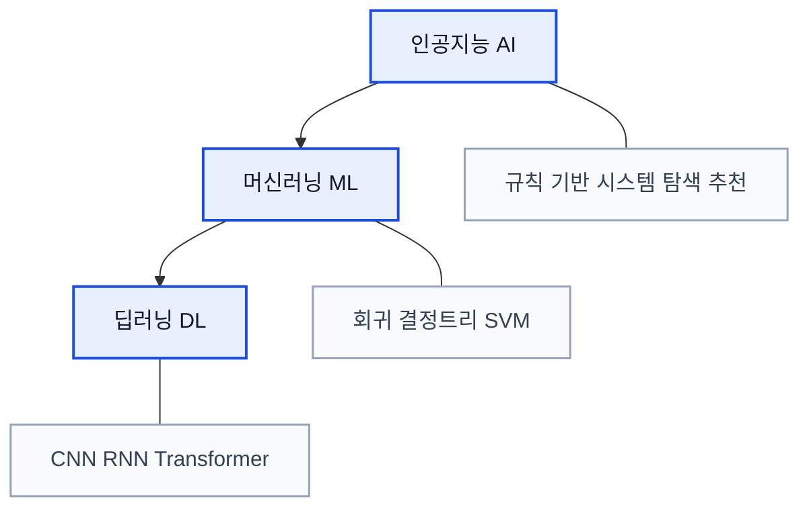
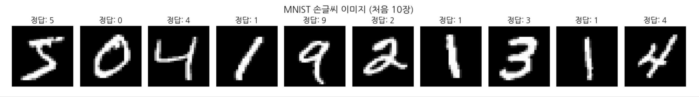
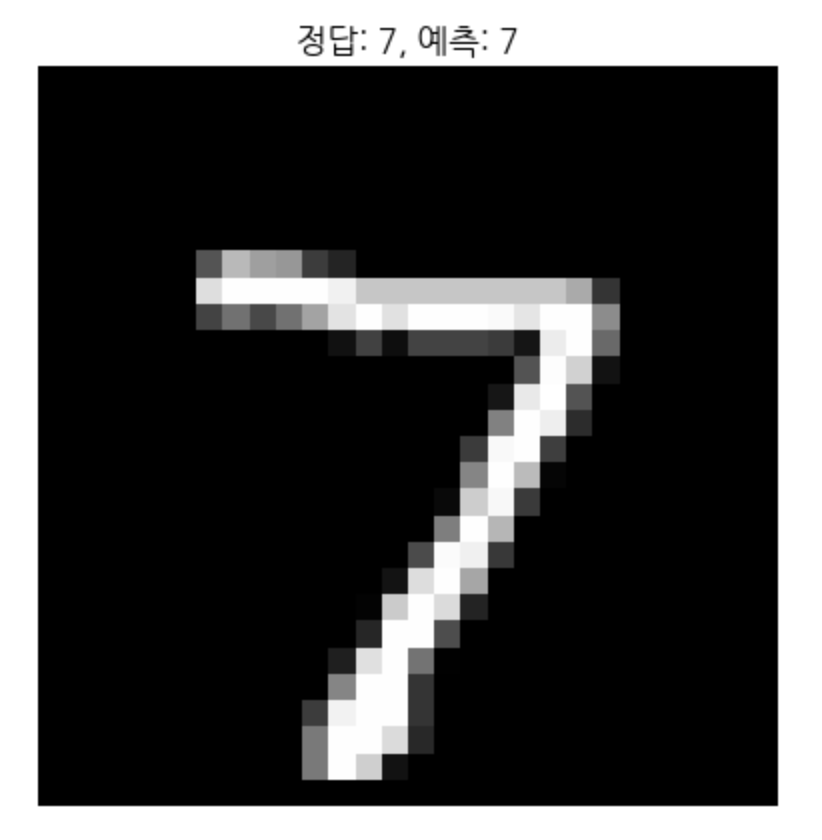
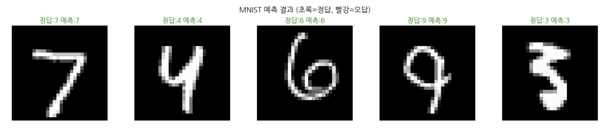
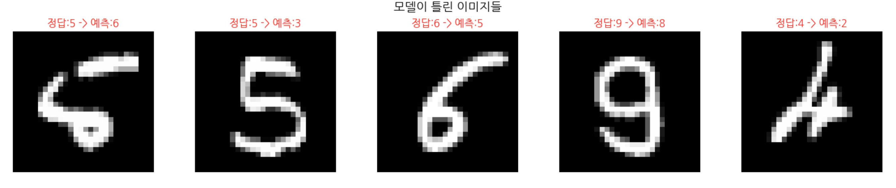

# 4. 딥러닝 입문: MNIST 체험

## 학습 목표

- AI, 머신러닝, 딥러닝의 포함 관계를 구분할 수 있다.
- MNIST 데이터셋을 활용하여 딥러닝 모델의 학습과 예측 과정을 체험한다.

MNIST 데모를 실행해보며 딥러닝이 무엇을 할 수 있는지 직접 체험합니다.

<a id="toc"></a>

## 진행 순서

1. [입문자가 자주 하는 오해](#part1)
2. [MNIST로 모델 학습해보기](#part2)

<a id="part1"></a>

## 1. 입문자가 자주 하는 오해 [↑](#toc)

딥러닝을 처음 배울 때 가장 많이 나오는 오해는 아래와 같습니다.

| 오개념 | 올바른 이해 |
|:------:|:------:|
| 딥러닝과 머신러닝은 같은 것이다 | 딥러닝은 머신러닝의 하위 집합이다 |
| `deep`은 심오하다는 뜻이다 | `deep`은 층(layer)이 깊다는 구조적 의미다 |
| 수학을 잘해야만 딥러닝을 배울 수 있다 | 비유와 실험을 통해 먼저 이해한다 |
| 딥러닝은 데이터가 엄청 많아야만 가능하다 | 사전학습된 모델을 통해 전이학습 등으로 적은 데이터에서도 시작할 수 있다 |
| 딥러닝 모델은 완전한 블랙박스다 | 시각화 도구로 내부를 어느 정도 관찰할 수 있다 |


### 핵심 정리
- **AI**는 가장 넓은 개념입니다.
- **ML**은 데이터에서 규칙을 학습하는 방법입니다.
- **DL**은 여러 층의 신경망을 사용하는 머신러닝입니다.

즉, **모든 딥러닝은 머신러닝이지만, 모든 머신러닝이 딥러닝은 아닙니다.**




<a id="part2"></a>

## 2. MNIST로 모델 학습해보기 [↑](#toc)


###  0. 한글 폰트 설정 (Colab용)
Colab에서 matplotlib 한글이 깨지지 않도록 폰트를 설치합니다. 

```python
import subprocess
import matplotlib.pyplot as plt
import matplotlib.font_manager as fm

# 1) 나눔고딕 폰트 설치
subprocess.run(['apt-get', '-qq', 'update'], check=True)
subprocess.run(['apt-get', '-qq', '-y', 'install', 'fonts-nanum'], check=True)

# 2) 설치된 폰트 파일을 matplotlib에 직접 등록
font_files = fm.findSystemFonts(fontpaths=['/usr/share/fonts/truetype/nanum'])
for fpath in font_files:
    fm.fontManager.addfont(fpath)

# 3) 기본 폰트를 나눔고딕으로 설정
plt.rcParams['font.family'] = 'NanumGothic'
plt.rcParams['axes.unicode_minus'] = False

# 4) 테스트
fig, ax = plt.subplots(figsize=(4, 1))
ax.text(0.5, 0.5, '한글 폰트 테스트 성공!', ha='center', va='center', fontsize=16)
ax.axis('off')
plt.show()

print('한글 폰트 설정 완료!')
```

**실행 결과:**

```
한글 폰트 설정 완료!
```

### 1. 데이터 로드 및 준비

```python
import torch
import torchvision
import torchvision.transforms as transforms

# 이미지를 숫자(텐서)로 변환하는 설정
transform = transforms.Compose([    # 여러 변환을 순서대로 묶어주는 파이프라인
    transforms.ToTensor(),          # PIL 이미지(0-255) -> 텐서 변환(0.0-1.0)
    transforms.Normalize((0.5,), (0.5,))  # 값을 -1~1 범위로 정규화
])

# MNIST 학습 데이터 60,000장 다운로드
train_dataset = torchvision.datasets.MNIST(
    root='./data', train=True, download=True, transform=transform
)

# MNIST 테스트 데이터 10,000장 다운로드
test_dataset = torchvision.datasets.MNIST(
    root='./data', train=False, download=True, transform=transform
)

print(f"학습 데이터: {len(train_dataset)}장")
print(f"테스트 데이터: {len(test_dataset)}장")


```

**코드 설명:**

| 코드 | 설명 |
|------|------|
| `import torch` | PyTorch 핵심 라이브러리 |
| `import torchvision` | 이미지 관련 유틸리티 (데이터셋, 모델, 변환) |
| `transforms.Compose([...])` | 여러 변환을 순서대로 묶어주는 파이프라인 |
| `transforms.ToTensor()` | PIL 이미지(0\~255 정수) → 텐서(0.0\~1.0 실수)로 변환. shape: `(1, 28, 28)` (채널, 높이, 너비) |
| `transforms.Normalize((0.5,), (0.5,))` |`transforms.Normalize(mean, std)` `(x - 0.5) / 0.5` 공식으로 값 범위를 **-1.0\~1.0**으로 변환. 튜플이 1개인 이유는 MNIST가 흑백(채널 1개)이기 때문 |
| `torchvision.datasets.MNIST(...)` | MNIST 데이터셋을 다운로드하고 로드 |
| `root='./data'` | 데이터 저장/로드 디렉토리 경로 |
| `train=True / False` | 학습셋(60,000장) vs 테스트셋(10,000장) 선택 |
| `download=True` | 로컬에 없으면 인터넷에서 자동 다운로드 |
| `transform=transform` | 로드 시 위에서 정의한 전처리를 자동 적용 |

> **`transforms.ToTensor()` 상세 설명 — 이미지를 텐서로 변환하는 방법들**
>
> **방법 1. `transforms.ToTensor()` (가장 일반적)**
> ```python
> from torchvision import transforms
> from PIL import Image
>
> transform = transforms.ToTensor()
> image = Image.open("image.jpg")
> tensor = transform(image)  # (C, H, W), 0.0~1.0
> ```
>
> **방법 2. `transforms.functional.to_tensor()`**
> ```python
> from torchvision.transforms.functional import to_tensor
> from PIL import Image
>
> image = Image.open("image.jpg")
> tensor = to_tensor(image)  # (C, H, W), 0.0~1.0
> ```
>
> **방법 3. `torch.from_numpy()` (NumPy 경유)**
> ```python
> import numpy as np
> import torch
> from PIL import Image
>
> image = Image.open("image.jpg")
> np_array = np.array(image)            # (H, W, C), 0~255
> tensor = torch.from_numpy(np_array)   # 그대로 정수 텐서
> tensor = tensor.permute(2, 0, 1).float() / 255.0  # (C, H, W), 0.0~1.0 으로 직접 변환
> ```
>
> | 방법 | 자동 스케일링 (0\~1) | 축 순서 변환 (C,H,W) | 용도 |
> |------|:---:|:---:|------|
> | `ToTensor()` | O | O | 전처리 파이프라인에서 사용 |
> | `functional.to_tensor()` | O | O | 단일 이미지 변환 시 |
> | `torch.from_numpy()` | X | X | 수동 제어가 필요할 때 |
>
> **핵심:** `ToTensor()`는 **0\~255 → 0.0\~1.0 스케일링**과 **(H,W,C) → (C,H,W) 축 변환**을 자동으로 해줍니다. `torch.from_numpy()`는 둘 다 직접 처리해야 합니다.

> **`transforms.Normalize(mean, std)` 상세 설명**
>
> **공식:** `output = (input - mean) / std` (채널별로 적용)
>
> | 파라미터 | 값 | 의미 |
> |---------|-----|------|
> | `mean` | `(0.5,)` | 각 채널에서 뺄 평균값. 튜플 원소 수 = 채널 수 |
> | `std` | `(0.5,)` | 각 채널을 나눌 표준편차값 |
>
> **계산 과정 (MNIST 흑백 1채널 기준):**
>
> | 단계 | 픽셀값 범위 | 설명 |
> |------|-----------|------|
> | 원본 이미지 | 0 \~ 255 | 정수 |
> | `ToTensor()` 후 | 0.0 \~ 1.0 | 255로 나눠서 실수로 변환 |
> | `Normalize(0.5, 0.5)` 후 | **-1.0 \~ 1.0** | `(0.0-0.5)/0.5 = -1.0`, `(1.0-0.5)/0.5 = 1.0` |
>
> **튜플인 이유:** 채널마다 다른 mean/std를 지정할 수 있기 때문입니다.
> - MNIST(흑백 1채널): `Normalize((0.5,), (0.5,))`
> - RGB 컬러 3채널: `Normalize((0.5, 0.5, 0.5), (0.5, 0.5, 0.5))`
> - ImageNet 사전학습 모델: `Normalize((0.485, 0.456, 0.406), (0.229, 0.224, 0.225))`
>
> **왜 정규화하나?**
> 1. **학습 안정성** — 입력값이 0 중심 대칭이면 가중치 업데이트가 한쪽으로 치우치지 않음
> 2. **수렴 속도 향상** — 경사하강법이 더 빠르게 최적점에 도달
> 3. **기울기 소실 방지** — Sigmoid/Tanh 활성화 함수의 유효 범위(-1\~1 근처)에 값이 위치

```
전처리 흐름:
원본 이미지 (28×28, 0~255) → ToTensor() → (1,28,28), 0.0~1.0 → Normalize → (1,28,28), -1.0~1.0
```

**실행 결과:**

```
학습 데이터: 60000장
테스트 데이터: 10000장
```

**정보확인**


```python
print(type(train_dataset))
print(type(train_dataset[0]))
print(type(train_dataset[0][0]))
print(type(train_dataset[0][1]))
print(train_dataset[0][0].min().item())
print(train_dataset[0][0].max().item())
print(train_dataset[0][0].shape)
```

`transforms.ToTensor(),`
`transforms.Normalize((0.5,), (0.5,))` 둘다 적용
```
<class 'torchvision.datasets.mnist.MNIST'>
<class 'tuple'>
<class 'torch.Tensor'>
<class 'int'>
-1.0
1.0
torch.Size([1, 28, 28])
```

`transforms.ToTensor(),`만 적용

```
<class 'torchvision.datasets.mnist.MNIST'>
<class 'tuple'>
<class 'torch.Tensor'>
<class 'int'>
0.0
1.0
torch.Size([1, 28, 28])
```

둘다 적용 안했을때

```python
import numpy as np
print(type(train_dataset))
print(type(train_dataset[0]))
print(type(train_dataset[0][0]))
print(type(train_dataset[0][1]))
print(np.array(train_dataset[0][0]).min().item())
print(np.array(train_dataset[0][0]).max().item())
print(train_dataset[0][0])
print(np.array(train_dataset[0][0]).shape)
```

```
<class 'torchvision.datasets.mnist.MNIST'>
<class 'tuple'>
<class 'PIL.Image.Image'>
<class 'int'>
0
255
<PIL.Image.Image image mode=L size=28x28 at 0x7ECC5F76C050>
(28, 28)
```

**핵심**: 데이터 로드는 한 줄(`torchvision.datasets.MNIST`)로 완료된다. 60,000장의 손글씨 이미지가 자동으로 다운로드된다.

#### 손글씨 이미지 시각화

```python
import matplotlib.pyplot as plt

# 처음 10장의 이미지를 출력
fig, axes = plt.subplots(1, 10, figsize=(15, 2))
for i in range(10):
    image, label = train_dataset[i]
    print(image.shape,image.squeeze().shape)
    axes[i].imshow(image.squeeze(), cmap='gray')
    axes[i].set_title(f"정답: {label}")
    axes[i].axis('off')
plt.suptitle("MNIST 손글씨 이미지 (처음 10장)", fontsize=14)
plt.tight_layout()
plt.show()
```

```
torch.Size([1, 28, 28]) torch.Size([28, 28])
```



**예상 결과**: 0~9 숫자가 적힌 손글씨 이미지 10장이 가로로 나열되어 표시된다. 각 이미지 위에 정답 레이블이 표시된다.

**핵심**: 컴퓨터는 이 이미지를 28x28 = 784개의 숫자(픽셀 밝기)로 인식한다. 사람에게는 "5"라는 숫자가 보이지만, 컴퓨터에게는 784개의 숫자 배열이다.

### 2.  모델 정의 및 학습


```python
import torch.nn as nn

# 간단한 2층 신경망 정의
model = nn.Sequential(
    nn.Flatten(),           # 28x28 이미지를 784개 숫자로 펼침
    nn.Linear(784, 128),    # 784개 입력 -> 128개 은닉 노드
    nn.ReLU(),              # 활성화함수
    nn.Linear(128, 10)      # 128개 은닉 -> 10개 출력 (0~9)
)

# 학습 설정
criterion = nn.CrossEntropyLoss()
optimizer = torch.optim.Adam(model.parameters(), lr=0.001)
train_loader = torch.utils.data.DataLoader(train_dataset, batch_size=64, shuffle=True)

# 3에폭 학습 (약 1~2분 소요)
for epoch in range(3):
    total_loss = 0
    for images, labels in train_loader:
        outputs = model(images)
        loss = criterion(outputs, labels)
        optimizer.zero_grad()
        loss.backward()
        optimizer.step()
        total_loss += loss.item()
    print(f"에폭 {epoch+1}/3, 평균 손실: {total_loss/len(train_loader):.4f}")

# 테스트 정확도 측정
test_loader = torch.utils.data.DataLoader(test_dataset, batch_size=64)
correct = 0
total = 0
with torch.no_grad():
    for images, labels in test_loader:
        outputs = model(images)
        _, predicted = torch.max(outputs, 1)
        total += labels.size(0)
        correct += (predicted == labels).sum().item()

print(f"\n테스트 정확도: {correct/total*100:.1f}%")


```

> **`torch.max()`와 `argmax()` 이해하기**
>
> 모델의 출력은 각 클래스(0\~9)에 대한 점수(logit)입니다. 여기서 가장 높은 점수의 클래스 번호를 꺼내는 것이 예측입니다.
>
> ```python
> # 예시: 모델이 하나의 이미지에 대해 10개 클래스 점수를 출력
> outputs = torch.tensor([[0.1, 0.2, 8.5, 0.3, 0.1, 0.5, 0.2, 0.1, 0.3, 0.1]])
> #                        0    1    2    3    4    5    6    7    8    9
> #                                  ↑ 가장 큰 값 = "2번 클래스"로 예측
> ```
>
> | 방법 | 코드 | 반환값 | 용도 |
> |------|------|--------|------|
> | `torch.max(x, dim)` | `_, predicted = torch.max(outputs, 1)` | **(최대값, 인덱스)** 튜플 | 최대값과 위치 둘 다 필요할 때 |
> | `.argmax(dim)` | `predicted = outputs.argmax(dim=1)` | **인덱스만** | 위치(클래스 번호)만 필요할 때 |
>
> ```python
> values, indices = torch.max(outputs, 1)  # values=tensor([8.5]), indices=tensor([2])
> predicted = outputs.argmax(dim=1)         # tensor([2]) — 같은 결과
> ```
>
> - `dim=1`: 각 행(샘플)에서 열(클래스) 방향으로 비교
> - `_`: 최대값 자체는 필요 없으므로 버림 (관례적으로 `_` 사용)
> - `.item()`: 텐서를 Python 숫자로 변환 (`tensor(2)` → `2`)

**실행 결과:**

```
에폭 1/3, 평균 손실: 0.3892
에폭 2/3, 평균 손실: 0.2003
에폭 3/3, 평균 손실: 0.1455

테스트 정확도: 96.2%
```

### 3. 예측

```python
# 위의 학습된 모델로 개별 이미지 예측하기

# 테스트 이미지 1장 선택
test_image, true_label = test_dataset[0]

# 모델로 예측
with torch.no_grad():
    output = model(test_image.unsqueeze(0))  # 배치 차원 추가
    predicted_label = output.argmax(dim=1).item()

# 결과 시각화
plt.imshow(test_image.squeeze(), cmap='gray')
plt.title(f"정답: {true_label}, 예측: {predicted_label}")
plt.axis('off')
plt.show()

# 모델이 다른 이미지도 맞히는지 확인해보세요
```


```python
# 다양한 인덱스의 이미지를 예측하여 비교
test_indices = [0, 42, 100, 999, 2953]

fig, axes = plt.subplots(1, len(test_indices), figsize=(15, 3))
for i, idx in enumerate(test_indices):
    test_image, true_label = test_dataset[idx]
    with torch.no_grad():
        output = model(test_image.unsqueeze(0))
        predicted_label = output.argmax(dim=1).item()

    axes[i].imshow(test_image.squeeze(), cmap='gray')
    color = 'green' if predicted_label == true_label else 'red'
    axes[i].set_title(f"정답:{true_label} 예측:{predicted_label}", color=color)
    axes[i].axis('off')

plt.suptitle("MNIST 예측 결과 (초록=정답, 빨강=오답)", fontsize=13)
plt.tight_layout()
plt.show()
```

**예상 결과**: 5장의 이미지에 대한 예측 결과가 표시된다. 대부분 초록색(정답)이지만, 간혹 빨간색(오답)이 나타날 수 있다.



```python
# 모델이 틀린 이미지 찾기
wrong_predictions = []
with torch.no_grad():
    for idx in range(100):  # 처음 100장에서 오답 탐색
        image, true_label = test_dataset[idx]
        output = model(image.unsqueeze(0))
        pred = output.argmax(dim=1).item()
        if pred != true_label:
            wrong_predictions.append((idx, true_label, pred))

print(f"처음 100장 중 오답 수: {len(wrong_predictions)}개")
for idx, true, pred in wrong_predictions:
    print(f"  인덱스 {idx}: 정답={true}, 예측={pred}")


```

**실행 결과:**

```
처음 100장 중 오답 수: 1개
  인덱스 8: 정답=5, 예측=6
```

```python
wrong_predictions = []
with torch.no_grad():
    for idx in range(len(test_dataset)):
        image, true_label = test_dataset[idx]
        output = model(image.unsqueeze(0))
        pred = output.argmax(dim=1).item()
        if pred != true_label:
            wrong_predictions.append((idx, true_label, pred, image))

print(f"전체 {len(test_dataset)}장 중 오답 수: {len(wrong_predictions)}개")

# 오답 중 처음 5개를 시각화
fig, axes = plt.subplots(1, min(5, len(wrong_predictions)), figsize=(15, 3))
for i in range(min(5, len(wrong_predictions))):
    idx, true, pred, image = wrong_predictions[i]
    axes[i].imshow(image.squeeze(), cmap='gray')
    axes[i].set_title(f"정답:{true} -> 예측:{pred}", color='red')
    axes[i].axis('off')
plt.suptitle("모델이 틀린 이미지들", fontsize=14)
plt.tight_layout()
plt.show()


```

**실행 결과:**

```
전체 10000장 중 오답 수: 384개
```


빨간 제목과 함께 모델이 헷갈린 이미지 5장이 표시된다. 흔히 3과 8, 4와 9, 7과 2 등이 혼동된다.

##### 흔한 실수 시나리오

| 실수 | 에러 메시지 | 해결 |
|:------:|:-----------:|:------:|
| 모델 학습 셀을 실행하지 않고 뒤에 코드 셀 실행 | `NameError: name 'model' is not defined` | 앞선 핵심 코드 셀을 위에서부터 순서대로 다시 실행한다 |
| Colab 런타임이 끊긴 후 재접속 | `RuntimeError: ...` 또는 변수 미정의 | "런타임 > 모두 실행"으로 전체 노트북을 다시 실행한다 |
| `test_dataset[99999]` 처럼 범위를 초과한 인덱스 사용 | `IndexError: index 99999 is out of bounds for axis 0 with size 10000` | 테스트 데이터는 10,000장이므로 인덱스를 0~9999 범위로 사용한다 |

