# CNN(Convolutional Neural Network)

## 1. Linear Layer 기반의 Image Classification 시 문제점
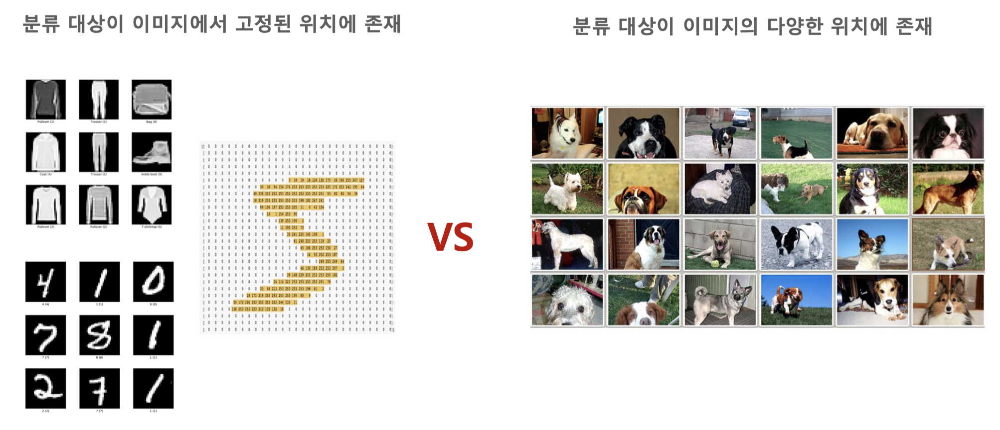

## 2. Feature Extraction 기반의 Image 분류 매커니즘
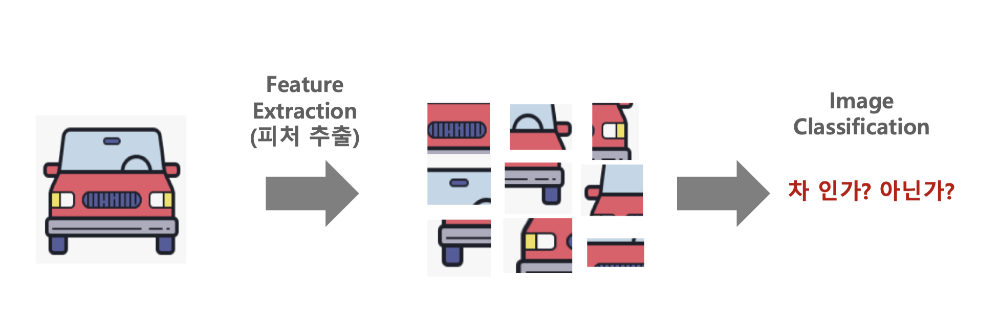

## 3. Deep Learning CNN 구조
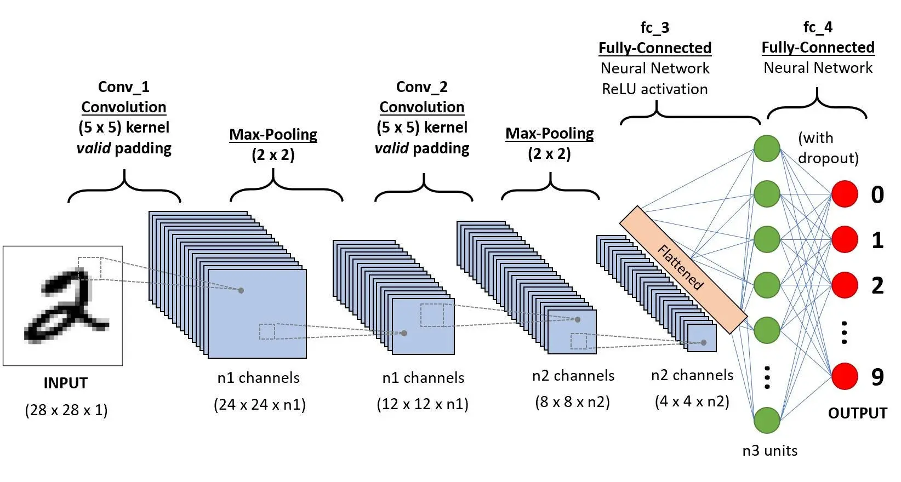

## 4. CNN Layer 별 Feature 학습
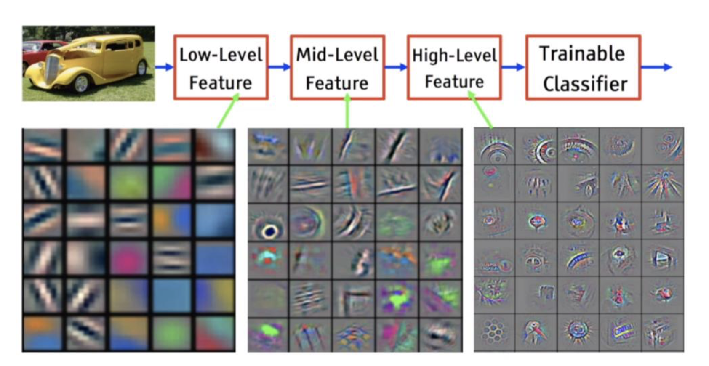

## 5. 이미지 필터
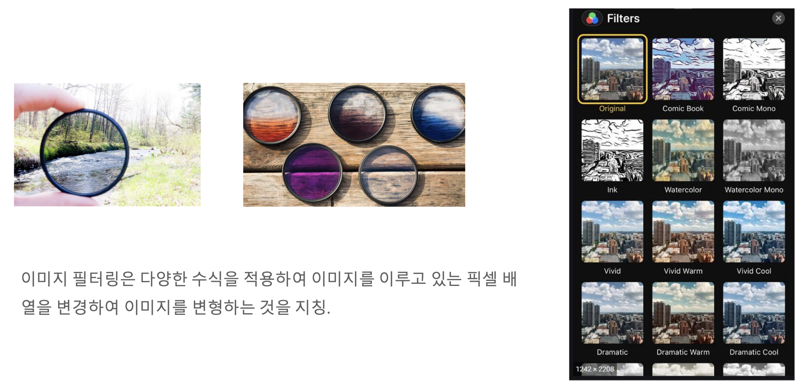

## 6. Convolution Layer Filter(kernel)
필터는 전체 너비를 파싱할 때까지 특정 보폭 값으로 오른쪽으로 이동합니다.  
계속해서 전체 이미지가 탐색될 때까지 이 과정을 반복해서 처리합니다.   
Kernel Size(크기)라고 하면 면적(가로x세로)을 의미하며 가로와 세로는 서로 다를 수 있지만 보통은 일치 합니다. (3 X 3, 5 X 5, 7 X 7)  
Deep Learning CNN은 Filter값을 사용자가 직접 만들거나 선택할 필요는 없고, Deep Learning Network 구성을 통해 이미지 분류 등의 목적에 부합하는 최적의 filter 값을 학습을 통해 스스로 최적화 합니다.

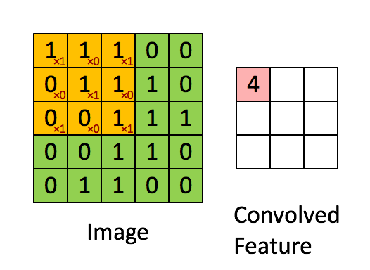

### Conv2d 파라미터 이해

PyTorch에서 `nn.Conv2d`의 주요 파라미터는 다음과 같습니다.

| 파라미터 | 의미 |
|---------|------|
| `in_channels` | 받게 될 channel의 갯수 (흑백=1, RGB=3) |
| `out_channels` | 보내고 싶은 channel의 갯수 (= 필터 갯수) |
| `kernel_size` | 만들고 싶은 kernel(weight)의 사이즈 |
| `stride` | 필터가 이동하는 간격 |

```py
import torch
import torch.nn as nn
import torch.nn.functional as F
import numpy as np
import matplotlib.pyplot as plt

# Conv2d Layer 생성: 1채널 입력 → 20채널 출력, 5x5 커널
layer = nn.Conv2d(in_channels=1, out_channels=20, kernel_size=5, stride=1)
layer
```

### Convolution Weight 시각화

Conv Layer의 weight는 학습 가능한 상태이므로 `detach()`로 gradient 그래프에서 분리한 뒤 numpy로 변환해야 합니다.

```py
# weight shape 확인: (out_channels, in_channels, H, W)
weight = layer.weight
print(weight.shape)  # torch.Size([20, 1, 5, 5])

# detach()로 gradient 그래프에서 분리 후 numpy 변환
weight = weight.detach().numpy()

# 첫 번째 필터 시각화
plt.imshow(weight[0, 0, :, :], 'jet')
plt.colorbar()
plt.title('Conv Filter Weight')
plt.show()
```

### Conv Layer Input → Weight → Output 비교 시각화

MNIST 이미지 1장을 Conv Layer에 통과시켜 입력/필터/출력을 나란히 비교합니다.

```py
from torchvision import datasets, transforms

# MNIST 이미지 1장 로드
train_loader = torch.utils.data.DataLoader(
    datasets.MNIST('dataset', train=True, download=True,
                   transform=transforms.Compose([transforms.ToTensor()])),
    batch_size=1)
image, label = next(iter(train_loader))

# Conv Layer 통과
output_data = layer(image)
output = output_data.data.cpu().numpy()
image_arr = image.numpy()

# Input / Weight / Output 3분할 비교
plt.figure(figsize=(15, 5))
plt.subplot(131)
plt.title('Input')
plt.imshow(np.squeeze(image_arr), 'gray')
plt.subplot(132)
plt.title('Weight (Filter #0)')
plt.imshow(weight[0, 0, :, :], 'jet')
plt.subplot(133)
plt.title('Output (Feature Map #0)')
plt.imshow(output[0, 0, :, :], 'gray')
plt.show()
```

## 7. 다중 채널 일때 Convolution Layer
여러 채널(예: RGB)이 있는 이미지의 경우 커널은 입력 이미지의 깊이와 동일한 깊이입니다.  
Kn과 In 스택([K1, I1]; [K2, I2]; [K3, I3]) 사이에서 행렬 곱셈이 수행되고 모든 결과를 바이어스와 합산하여 한 개의 깊이 채널로 압축된 복잡한 특징 출력을 얻는다.

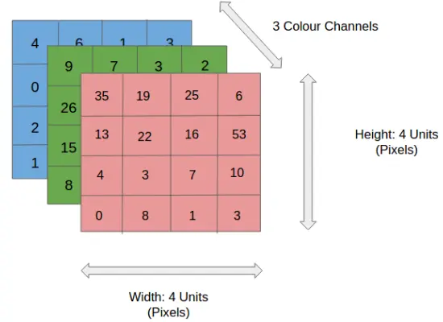
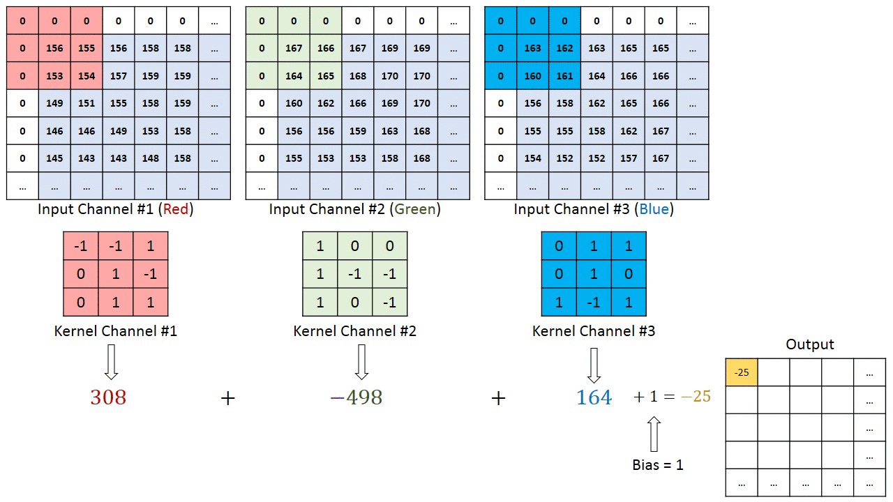
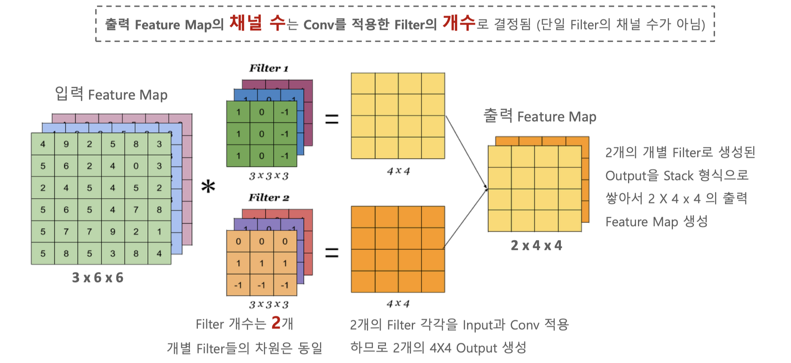

## 8. Stride
stride는 입력 데이터(원본 image또는 입력 feature map)에 Conv Filter를 적용할 때 Sliding Window가 이동하는 간격을 의미하고,   
기본은 1이지만, 2를(2 pixel 단위로 Sliding window 이동) 적용하여 입력 feature map 대비 출력 feature map의 크기를 대략 절반으로 줄일수 있습니다.  
stride를 키우면 공간적인 feature 특성을 손실할 가능성이 높아지지만, 이것이 중요 feature들의 손실을 반드시 의미하지는 않습니다.  
오히려 불필요한 특성을 제거하는 효과를 가져 올 수 있습니다.   
또한 Convolution 연산 속도가 향상됩니다.  

Stride = 1
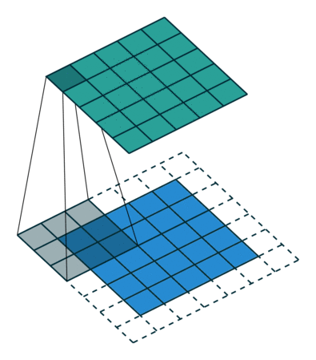

Stride = 2
  

## 9. padding
Filter를 적용하여 Conv 연산 수행 시 출력 Feature Map이 입력 Feature Map 대비 계속적으로 작아지는 것을 막기 위해 적용합니다.
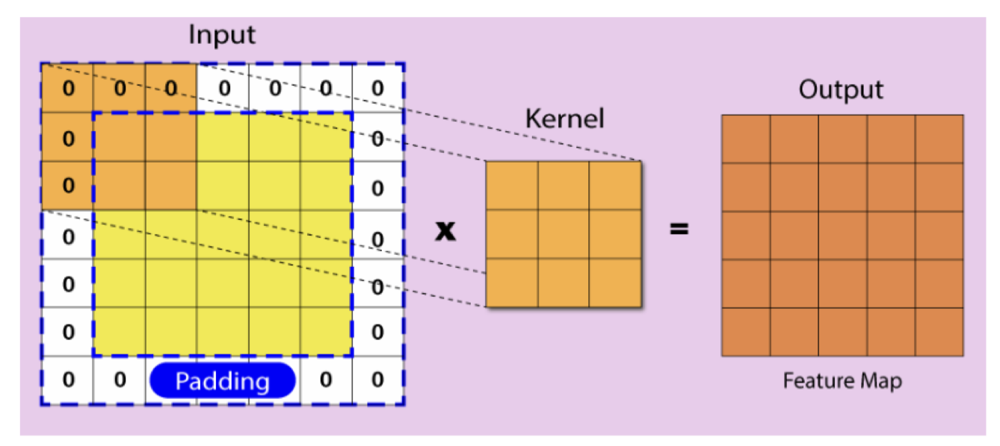  

## 10. Pooling
Conv 적용된 Feature map의 일정 영역 별로 하나의 값을 추출하여(주로 Max 또는 Average 적용) Feature map의 사이즈를 줄입니다.(sub sampling).  
일반적으로 Pooling 크기와 Stride를 동일하게 부여하여 모든 값이 한번만 처리 될 수 있도록 합니다.   
일정 영역에서 가장 큰 값 또는 평균 값을 추출하므로 위치의 변화에 따른 feature 값의 변화를 일정 수준 중화 시킬 수 있습니다.   
보통은 Conv->ReLU activation 들을 연속 적용 후 Feature Map에 Pooling 적용합니다.
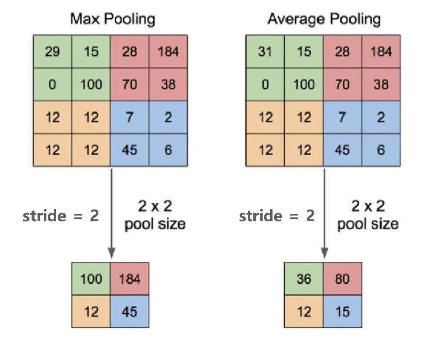

### Pooling 시각화

`F.max_pool2d`는 입력을 넣고 kernel 사이즈와 stride를 순서대로 지정합니다.
MaxPool Layer는 **학습할 weight가 없기 때문에** 바로 `numpy()`로 변환할 수 있습니다.

```py
# MaxPooling 적용: 2x2 커널, stride 2
pool = F.max_pool2d(image, 2, 2)
print(f"입력: {image.shape} → 출력: {pool.shape}")

# Input vs Pooled Output 비교 시각화
pool_arr = pool.numpy()

plt.figure(figsize=(10, 5))
plt.subplot(121)
plt.title("Input (28x28)")
plt.imshow(np.squeeze(image_arr), 'gray')
plt.subplot(122)
plt.title('After MaxPool2d (14x14)')
plt.imshow(np.squeeze(pool_arr), 'gray')
plt.show()
```

## 11. Dropout
Fully Connected Layer의 너무 촘촘한 연결로 인한 많은 파라미터(weight) 생성은 오히려 오버 피팅을 가져 올 수 있음.   
Dropout을 통해 Layer간 연결을 줄일 수 있으며 오버 피팅 개선을 가져 올 수 있음.
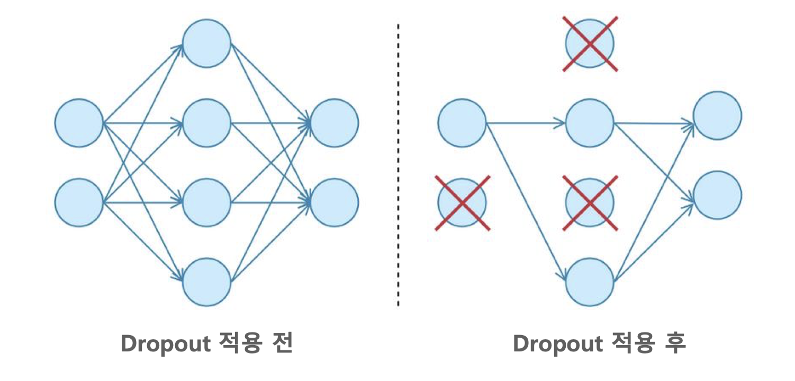

## 12. Linear Layer 시각화

`nn.Linear`는 2D 이미지를 직접 받을 수 없으므로, `.view()`로 1D로 펼쳐야(flatten) 합니다.

```py
# 28x28 이미지 → 784 길이의 1D 벡터로 변환
flatten = image.view(1, 28 * 28)
print(f"변환 전: {image.shape} → 변환 후: {flatten.shape}")

# Linear Layer 통과: 784 → 10 (클래스 수)
lin = nn.Linear(784, 10)(flatten)
print(f"Linear 출력: {lin.shape}")

# Linear 출력 시각화 (10개 클래스에 대한 점수)
plt.imshow(lin.detach().numpy(), 'jet')
plt.colorbar()
plt.title('Linear Output (10 classes)')
plt.show()
```

## 13. Softmax 시각화

Linear Layer의 출력을 확률로 변환하는 것이 Softmax입니다.
결과를 numpy로 꺼내기 위해서는 `torch.no_grad()`로 gradient 계산을 비활성화해야 합니다.

```py
with torch.no_grad():
    flatten = image.view(1, 28 * 28)
    lin = nn.Linear(784, 10)(flatten)
    softmax = F.softmax(lin, dim=1)

print(softmax)
print(f"확률 합계: {np.sum(softmax.numpy())}")  # 1.0
```

> Softmax 출력값의 합은 항상 1.0이 됩니다. 각 값은 해당 클래스일 확률을 의미합니다.

## 14. conv 연산 적용 후 출력 피처맵의 크기(size) 구하기 
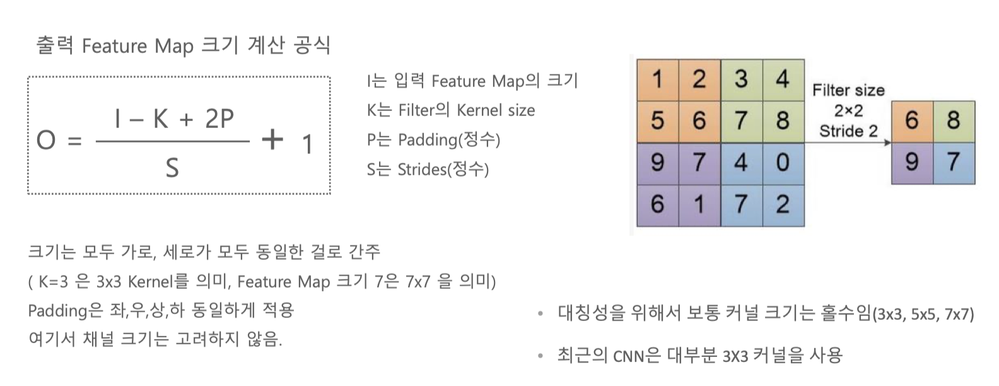 

### Stride가 1이고, padding이 없는 경우
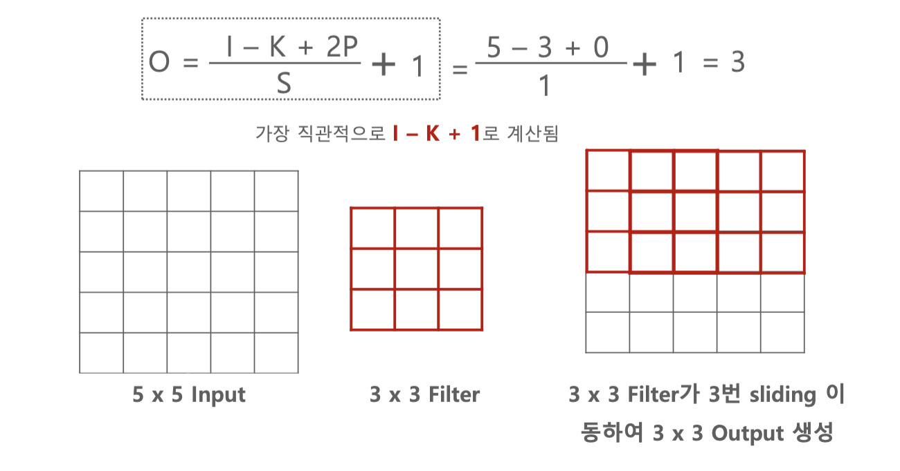  

### Stride가 1이고, padding이 1인 경우
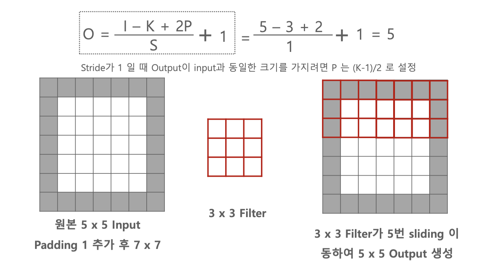  

### Stride가 2이고, padding이 없는 경우
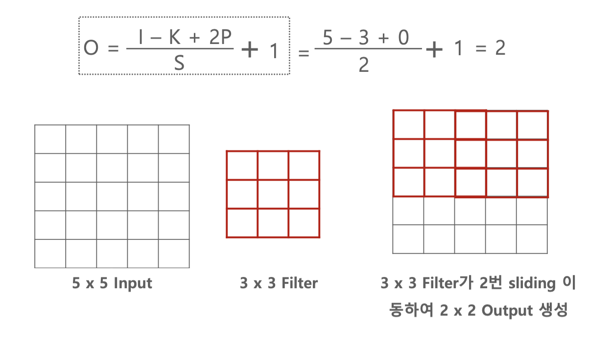  

### Stride가 1이고, padding이 1인 경우
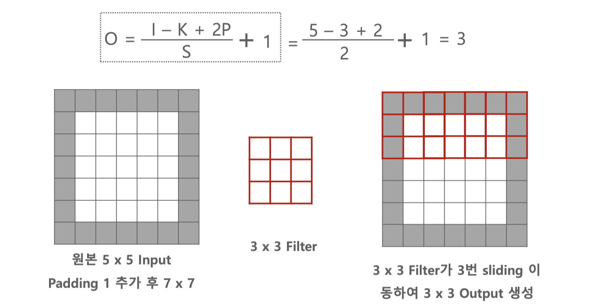   

# CNN을 이용한 숫자 인식 모델 만들기

## 1. 모델생성 및 학습 및 평가

### 1. 구글 드라이브와 연결

데이터 파일 및 결과 파일을 구글 드라이브에 저장하기 위해 구글 드라이브를 연결 
```py
from google.colab import drive
drive.mount('/content/drive')
```

저장할 경로를 미리 선언
```py
root_dir = '/content/drive/MyDrive/Colab Notebooks/pytorch_test/mnist'
```

### 2. 모델 생성

필요한 라이브러리 import
```py
import torch
import torch.nn as nn
import torch.nn.functional as F
import torch.optim as optim
from torchvision import datasets, transforms
from matplotlib import pyplot as plt
```

현재 gpu를 사용할 수 있는지 확인
```py
is_cuda = torch.cuda.is_available()
is_cuda
```

gpu 사용 여부에 따라 device에 값을 셋팅 
```py
device = torch.device('cuda' if is_cuda else 'cpu')
device
```

하이퍼 파라미터 값을 설정
```py
batch_size = 50
epoch_num = 15
learning_rate = 0.0001
```

학습과 평가에 사용할 MNIST 데이터를 다운로드 받아서 저장
```py
train_data = datasets.MNIST(root=root_dir+'/data',
                            train=True,
                            download = True,
                            transform=transforms.ToTensor())
test_data = datasets.MNIST(root=root_dir+'/data',
                            train=False,
                            transform=transforms.ToTensor())
```

다운로드 받은 데이터 건수 확인
```py
print(len(train_data),len(test_data))
```

다운로드 받은 데이터의 타입 확인
```py
print(type(train_data))
```

이미지와 레이블 저장 형태 확인
```py
image,label = train_data[0]
print(label.shape)
print(image.shape)
```

이미지 출력
```py
plt.imshow(image.squeeze(),cmap='gray')
```

모델에 배치 사이즈 만큼 읽어서 제공할 DataLoader 생성
```py
train_loader = torch.utils.data.DataLoader(dataset=train_data,
                                           batch_size=batch_size,
                                           shuffle = True)
test_loader = torch.utils.data.DataLoader(dataset=test_data,
                                           batch_size=batch_size,
                                           shuffle = True)
```

DataLoader 로더해서 형태 파악
```py
first_batch = train_loader.__iter__().__next__()

print(type(first_batch))
print(len(first_batch))

print(len(first_batch))
print(first_batch[0].shape)
print(first_batch[1].shape)
```

```py
print(f"{'name':15s} | {'type':<25s} | {'size'}")
print(f"{'num of batch':15s} | {'':<25s} | {len(train_loader)}")
print(f"{'first_batch':15s} | {str(type(first_batch)):<25s} | {len(first_batch)}")
print(f"{'first_batch[0]':15s} | {str(type(first_batch[0])):<25s} | {first_batch[0].shape}")
print(f"{'first_batch[1]':15s} | {str(type(first_batch[1])):<25s} | {first_batch[1].shape}")
```

name            | type                      | size  
num of batch    |                           | 1200  
first_batch     | <class 'list'>            | 2
first_batch[0]  | <class 'torch.Tensor'>    | torch.Size([50, 1, 28, 28])
first_batch[1]  | <class 'torch.Tensor'>    | torch.Size([50])


### nn과 nn.functional의 차이

| 구분 | `nn` (예: `nn.Conv2d`) | `nn.functional` (예: `F.relu`) |
|------|----------------------|-------------------------------|
| 학습 파라미터 | **있음** (weight, bias 포함) | **없음** |
| 사용 위치 | `__init__`에서 정의 | `forward`에서 호출 |
| 예시 | `nn.Conv2d`, `nn.Linear`, `nn.Dropout2d` | `F.relu`, `F.max_pool2d`, `F.log_softmax` |

> 간단히 정리하면: `nn`은 학습 파라미터가 담긴 레이어, `nn.functional`은 학습 파라미터가 없는 연산 함수입니다.

모델 정의
```py
class CNN(nn.Module):
    def __init__(self):
        super(CNN, self).__init__()
        self.conv1 = nn.Conv2d(1, 32, 3, 1)
        self.conv2 = nn.Conv2d(32, 64, 3, 1)
        self.dropout1 = nn.Dropout2d(0.25)
        self.dropout2 = nn.Dropout2d(0.5)
        self.fc1 = nn.Linear(9216, 128)
        self.fc2 = nn.Linear(128, 10)

    def forward(self, x):
        x = self.conv1(x)
        x = F.relu(x)
        x = self.conv2(x)
        x = F.relu(x)
        x = F.max_pool2d(x, 2)
        x = self.dropout1(x)
        x = torch.flatten(x, 1)
        x = self.fc1(x)
        x = F.relu(x)
        x = self.dropout2(x)
        x = self.fc2(x)
        output = F.log_softmax(x, dim=1)
        return output
```

모델 생성및 옵티마이저, 오차함수 생성
```py
model = CNN().to(device)
optimizer = optim.Adam(model.parameters(),lr = learning_rate)
criterion = nn.CrossEntropyLoss()

print(model)
```

### 3. 모델 학습

생성된 모델 학습모드로 설정하고 학습 진행
```py
model.train()
i = 0
for epoch in range(epoch_num):
  for data, target in train_loader:
    data = data.to(device)
    target = target.to(device)
    optimizer.zero_grad()
    output = model(data)
    loss = criterion(output,target)
    loss.backward()
    optimizer.step()
    if i % 1000 == 0:
      print(f"train step:{i}\tloss:{loss.item()}")
    i += 1

```

### 4. 모델 평가 및 모델 저장

테스트 데이터로 모델 평가
```py
model.eval()
correct = 0
for data, target in test_loader:
  data = data.to(device)
  target = target.to(device)
  output = model(data)
  prediction = output.data.max(1)[1]
  correct += prediction.eq(target.data).sum()
```

결과값의 형태 파악
```py
print(output.shape)

print(output.max(1))
```

정확도 계산해서 출력
```py
print(100*correct/len(test_loader.dataset))
```

모델 저장
```py
torch.save(model.state_dict(),root_dir+'/model/mnist_cnn.pt')
```

## 2. 생성된 모델 사용하기

```py
from PIL import Image
from torchvision import transforms
import torchvision.transforms.functional as TF

# 이미지 전처리 (MNIST와 동일하게 처리하고 색상 반전 추가)
def preprocess_image(img_path):
    # 이미지 불러오기
    image = Image.open(img_path).convert('RGB')

    # 전처리: 흑백으로 변환, 크기 조정, 텐서 변환, 정규화
    preprocess = transforms.Compose([
        transforms.Grayscale(num_output_channels=1),  # 흑백 변환
        transforms.Resize((28, 28)),  # 크기 조정
        transforms.ToTensor(),  # 텐서로 변환
    ])

    # 이미지 반전 (검은 바탕에 흰 글씨로 만들기)
    image = TF.invert(image)

    # 전처리 적용
    image_tensor = preprocess(image).unsqueeze(0)  # 배치 차원 추가 (1, 1, 28, 28)

    return image_tensor
```

```py
import glob

# 이미지 파일 불러오기 및 전처리
img_path = root_dir+'/myimg/*.png'  # 테스트할 이미지 경로

files = glob.glob(img_path)

model = CNN()
model.load_state_dict(torch.load(root_dir+'/model/mnist_cnn.pt',map_location=torch.device('cpu')))

model.eval()

for path in files:
  image = preprocess_image(path)
  output = model(image)
  pred = torch.argmax(output,dim=1)
  print(pred)
  plt.imshow(image.squeeze(),cmap='gray')
  plt.show()
```

## 3. 웹으로 서비스 하기

model.py
```py
import torch
import torch.nn as nn
import torch.nn.functional as F
from PIL import Image
from torchvision import transforms
import torchvision.transforms.functional as TF

class CNN(nn.Module):
    def __init__(self):
        super(CNN, self).__init__()
        self.conv1 = nn.Conv2d(1, 32, 3, 1)
        self.conv2 = nn.Conv2d(32, 64, 3, 1)
        self.dropout1 = nn.Dropout2d(0.25)
        self.dropout2 = nn.Dropout2d(0.5)
        self.fc1 = nn.Linear(9216, 128)
        self.fc2 = nn.Linear(128, 10)

    def forward(self, x):
        x = self.conv1(x)
        x = F.relu(x)
        x = self.conv2(x)
        x = F.relu(x)
        x = F.max_pool2d(x, 2)
        x = self.dropout1(x)
        x = torch.flatten(x, 1)
        x = self.fc1(x)
        x = F.relu(x)
        x = self.dropout2(x)
        x = self.fc2(x)
        output = F.log_softmax(x, dim=1)
        return output

    
# 이미지 전처리 (MNIST와 동일하게 처리하고 색상 반전 추가)
def preprocess_image(img_path):
    # 이미지 불러오기
    image = Image.open(img_path).convert('RGB')

    # 전처리: 흑백으로 변환, 크기 조정, 텐서 변환, 정규화
    preprocess = transforms.Compose([
        transforms.Grayscale(num_output_channels=1),  # 흑백 변환
        transforms.Resize((28, 28)),  # 크기 조정
        transforms.ToTensor()  # 텐서로 변환
    ])
    
    # 이미지 반전 (검은 바탕에 흰 글씨로 만들기)
    image = TF.invert(image)

    # 전처리 적용
    image = preprocess(image).unsqueeze(0)  # 배치 차원 추가 (1, 1, 28, 28)
    
    return image

```

app.py
```py
from flask import Flask, redirect, render_template,request
import os
import model as m
import torch

app = Flask(__name__)

@app.route('/')
def index():
    return render_template('index.html')

@app.route('/mnist',methods=['get'])
def mnist():
    return render_template('mnist_upload.html')


@app.route('/mnist',methods=['post'])
def fileupload():
    f = request.files['imgfile']
    img_path=os.path.dirname(__file__)+'/static/uploads/'+f.filename
    f.save(img_path)
    
    # 이미지 전처리 및 예측
    image = m.preprocess_image(img_path)

    # 모델 불러오기
    model = m.CNN()
    model.load_state_dict(torch.load('mnist_cnn.pt',map_location='cpu'))

    # 모델 재평가
    model.eval()

    # 예측
    output = model(image)
    predicted = torch.argmax(output, dim=1)  # 가장 높은 확률을 가진 클래스를 예측

    # 예측 결과 출력
    print(f'Predicted class: {predicted.item()}')
    return render_template('mnist_result.html',data=predicted.item(),img_path='uploads/'+f.filename)

if __name__ == '__main__':
    app.run(debug=True,port=8088)
```

/templates/default.html
```html
<!DOCTYPE html>
<html>
    <head>
        <link href="https://cdn.jsdelivr.net/npm/bootstrap@5.0.0-beta1/dist/css/bootstrap.min.css" rel="stylesheet" integrity="sha384-giJF6kkoqNQ00vy+HMDP7azOuL0xtbfIcaT9wjKHr8RbDVddVHyTfAAsrekwKmP1" crossorigin="anonymous">
        <title>
            
            
            
        </title>
    </head>
    <body>
    
         
        
    
        <script src="https://cdn.jsdelivr.net/npm/@popperjs/core@2.5.4/dist/umd/popper.min.js" integrity="sha384-q2kxQ16AaE6UbzuKqyBE9/u/KzioAlnx2maXQHiDX9d4/zp8Ok3f+M7DPm+Ib6IU" crossorigin="anonymous"></script>
        <script src="https://cdn.jsdelivr.net/npm/bootstrap@5.0.0-beta1/dist/js/bootstrap.min.js" integrity="sha384-pQQkAEnwaBkjpqZ8RU1fF1AKtTcHJwFl3pblpTlHXybJjHpMYo79HY3hIi4NKxyj" crossorigin="anonymous"></script>
    </body>
</html>
```
/templates/menu.html
```html
<nav class="navbar navbar-expand-lg" style="background-color:rgb(2, 2, 2);">
  <div class="container-fluid">
    <a class="navbar-brand" href="#">부경대학교 디지털 스마트 6기</a>
    <button class="navbar-toggler" type="button" data-bs-toggle="collapse" data-bs-target="#navbarSupportedContent" aria-controls="navbarSupportedContent" aria-expanded="false" aria-label="Toggle navigation">
      <span class="navbar-toggler-icon"></span>
    </button>
    <div class="collapse navbar-collapse" id="navbarSupportedContent">
      <ul class="navbar-nav me-auto mb-2 mb-lg-0">
        <li class="nav-item">
          <a class="nav-link active" aria-current="page" href="/">Home</a>
        </li>
        <li class="nav-item">
          <a class="nav-link" href="/mnist">숫자인식</a>
        </li>
        <li class="nav-item dropdown">
          <a class="nav-link dropdown-toggle" href="#" role="button" data-bs-toggle="dropdown" aria-expanded="false">
            Dropdown
          </a>
          <ul class="dropdown-menu">
            <li><a class="dropdown-item" href="#">Action</a></li>
            <li><a class="dropdown-item" href="#">Another action</a></li>
            <li><hr class="dropdown-divider"></li>
            <li><a class="dropdown-item" href="#">Something else here</a></li>
          </ul>
        </li>
        <li class="nav-item">
          <a class="nav-link disabled" aria-disabled="true">Disabled</a>
        </li>
      </ul>
      <form class="d-flex" role="search">
        <input class="form-control me-2" type="search" placeholder="Search" aria-label="Search">
        <button class="btn btn-outline-success" type="submit">Search</button>
      </form>
    </div>
  </div>
</nav>
```

/templates/index.html
```html


홈페이지


<h1>홈페이지</h1>



```

/templates/mnist_upload.html
```html


숫자 이미지 입력


<br>
<br>
<br>
<div class="container">
  <form action="/mnist" method="post" enctype="multipart/form-data">
    <div>
      <label for="formFileLg" class="form-label">판독할 숫자 이미지를 선택하세요</label>
      <input class="form-control form-control-lg" id="formFileLg" name="imgfile" type="file">
    </div>
    <br>
    <div class="col-auto">
      <button type="submit" class="btn btn-primary mb-3">숫자판독시작</button>
    </div>
  </form>
</div>

```

/templates/mnist_result.html
```html


숫자 분석 결과 페이지


<br>
<br>
<br>
<div class="container">
<h1>숫자 판독 결과는 {{data}}입니다.</h1>

</div>

```
