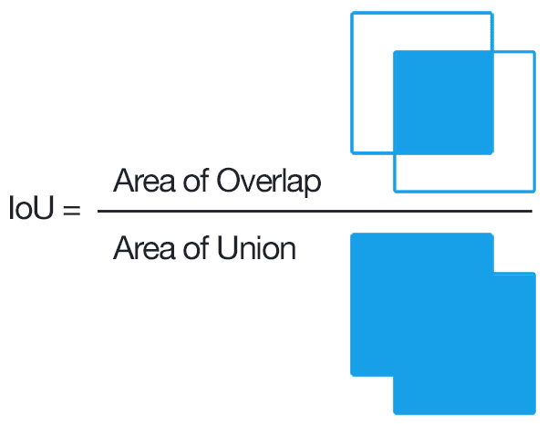
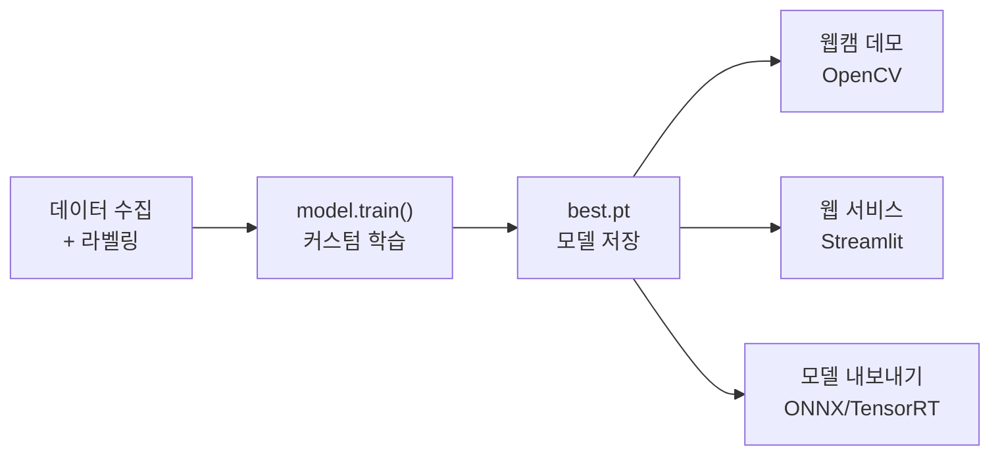

# 9. 객체 탐지와 YOLO26 — 5가지 비전 태스크와 서비스 배포

[객체탐지와 YOLO26](https://docs.google.com/presentation/d/1Vly2Q90zqc12vtlyEZWOiNsLIiSwI5yY/edit?usp=sharing&ouid=108962028468973154136&rtpof=true&sd=true)

## 학습 목표

1. 객체 탐지의 핵심 개념(Bounding Box, IOU, NMS, mAP)을 설명할 수 있다
2. YOLO26이 지원하는 5가지 비전 태스크의 차이를 이해하고 적절한 태스크를 선택할 수 있다
3. YOLO26으로 5가지 태스크의 추론을 실행하고, 결과 데이터를 활용할 수 있다
4. 커스텀 데이터셋으로 YOLO26 모델을 학습하고 저장·재활용할 수 있다
5. 학습한 모델을 웹캠과 연동하여 실시간 객체 탐지를 구현할 수 있다
6. Streamlit으로 YOLO26 기반 웹 서비스를 만들 수 있다

> **환경**: 이 수업의 실습은 Google Colab(무료 GPU)에서 진행합니다. Streamlit 섹션은 로컬 환경에서 실행합니다.
>
> **사용 모델**: **YOLO26** — Ultralytics의 최신 공식 모델(2026.01). CPU에서 YOLO11 대비 약 30% 빠르고, NMS 후처리가 불필요한 end-to-end 구조입니다.

<a id="toc"></a>
## 진행 순서

1. [객체 탐지 핵심 개념](#part1)
2. [YOLO26과 5가지 비전 태스크](#part2)
3. [기본 사용법 — 5가지 태스크 추론](#part3)
4. [커스텀 학습 — 내 데이터로 모델 만들기](#part4)
5. [웹캠 실시간 인식](#part5)
6. [Streamlit 서비스 배포](#part6)
7. [통합 정리](#part7)

---

<a id="part1"></a>
## 1. 객체 탐지 핵심 개념 [↑](#toc)

**학습목표**: 객체 탐지의 핵심 개념(Bounding Box, IOU, NMS, mAP)을 설명할 수 있다

객체 탐지(Object Detection)는 이미지에서 **객체의 위치(Bounding Box)**와 **클래스(종류)**를 동시에 예측하는 기술입니다.

### Bounding Box와 IOU

- **Bounding Box**: 객체를 감싸는 가장 작은 직사각형
- **IOU(Intersection Over Union)**: 예측 박스와 정답 박스가 얼마나 겹치는지의 비율 (0~1)
  - 쉽게 말해, **"두 박스가 얼마나 겹치는가"**입니다
  - 계산: `IOU = 겹치는 영역 ÷ 합친 전체 영역`
  - 일반적으로 IOU 0.5 이상이면 "정답"으로 간주



### NMS(Non-Maximum Suppression)

하나의 객체에 여러 박스가 겹쳐서 생길 수 있습니다. NMS는 **가장 확률이 높은 박스만 남기고 나머지를 제거**합니다.

1. 확률 기준으로 모든 박스를 정렬
2. 가장 높은 박스를 선택
3. 나머지 박스와의 IOU를 계산하여, 겹치는 박스는 제거

> **YOLO26과 NMS**: YOLO26은 NMS가 모델 내부에 내장된 **end-to-end 구조**입니다. 이전 모델(YOLO11 이하)에서는 NMS를 별도로 수행했지만, YOLO26은 자동으로 처리합니다. 개념은 알아두되, 코드에서 직접 구현할 필요는 없습니다.

### 정밀도, 재현율, mAP

| 지표 | 의미 | 비유 |
|------|------|------|
| **정밀도(Precision)** | 탐지한 것 중 실제로 맞은 비율 | "경보를 울렸을 때 진짜 도둑이었던 비율" |
| **재현율(Recall)** | 실제 객체 중 탐지한 비율 | "전체 도둑 중 잡아낸 비율" |
| **AP** | 한 클래스의 PR 곡선 아래 면적 | "한 과목 시험 점수" |
| **mAP** | 모든 클래스의 AP 평균 | "전 과목 평균" |

- **conf(신뢰도 기준값)를 높이면**: 확실한 것만 탐지 → 정밀도↑, 재현율↓
- **conf를 낮추면**: 더 많이 탐지하지만 오탐 증가 → 정밀도↓, 재현율↑

### YOLO — 실시간 객체 탐지

YOLO(You Only Look Once)는 이미지를 **한 번만 보고** 모든 객체를 동시에 탐지하는 1-stage 방식입니다. 실시간 처리가 가능하여 자율주행, CCTV, 로봇 등에 널리 사용됩니다.

| 버전 | 연도 | 핵심 변화 |
|------|------|----------|
| YOLOv1~v3 | 2015~2018 | 원저자(Redmon) 개발, 실시간 탐지의 시작 |
| YOLOv5/v8 | 2020~2023 | Ultralytics 개발, PyTorch 기반 프레임워크화 |
| YOLO11 | 2024.09 | 5가지 태스크 통합 지원 |
| **YOLO26** | **2026.01** | **NMS-free end-to-end, MuSGD 옵티마이저, 엣지 최적화** |

> **확인**: IOU가 0.3이면 좋은 탐지라고 할 수 있을까요? 왜 0.5를 기준으로 사용할까요?

---

<a id="part2"></a>
## 2. YOLO26과 5가지 비전 태스크 [↑](#toc)

**학습목표**: 5가지 비전 태스크의 차이를 이해하고 적절한 태스크를 선택할 수 있다

### 왜 Detection만으로는 부족한가?

- **자율주행**: 보행자의 정확한 윤곽이 필요 → **Segmentation**
- **피트니스 앱**: 무릎 각도, 허리 굽힘 분석 → **Pose Estimation**
- **위성 영상**: 비행기·선박이 기울어져 있음 → **OBB**
- **품질 검사**: 양품/불량품 구분 → **Classification**

### 태스크 비교

| 태스크 | 출력 | 모델 파일 | 사전학습 데이터 | 핵심 질문 |
|--------|------|----------|---------------|-----------|
| **Detection** | 사각형 박스 + 클래스 | `yolo26n.pt` | COCO (80클래스) | "무엇이 어디에?" |
| **Segmentation** | 픽셀 마스크 + 클래스 | `yolo26n-seg.pt` | COCO (80클래스) | "정확한 윤곽은?" |
| **Pose** | 17개 관절 키포인트 | `yolo26n-pose.pt` | COCO-Keypoints | "사람의 자세는?" |
| **OBB** | 회전된 박스 + 클래스 | `yolo26n-obb.pt` | DOTA-v1 (15클래스) | "객체의 방향은?" |
| **Classification** | 이미지 전체 클래스 | `yolo26n-cls.pt` | ImageNet (1000클래스) | "이 이미지는 무엇?" |

> **중요**: 사전학습 모델은 위 표의 데이터셋 클래스만 인식합니다. 예를 들어 Detection은 COCO 80 클래스(사람, 자동차, 개 등)만 탐지합니다. 다른 객체를 탐지하려면 **섹션 4의 커스텀 학습**이 필요합니다.

### 태스크 선택 플로우

```
이미지가 들어왔다!
    │
    ├─ "이미지가 뭔지만 알면 된다" → Classification
    │
    ├─ "어디에 뭐가 있는지 알아야 한다"
    │       ├─ "위치만 알면 된다" → Detection
    │       ├─ "정확한 윤곽이 필요하다" → Segmentation
    │       ├─ "객체가 기울어져 있다" → OBB
    │       └─ "사람의 자세를 알아야 한다" → Pose
    │
    └─ "객체의 면적/비율을 계산해야 한다" → Segmentation
```

### 모델 크기별 성능 (Detection 기준)

| 모델 | mAP 50-95 | CPU 속도(ms) | 파라미터 | 권장 환경 |
|------|:---------:|:----------:|:-------:|----------|
| yolo26n (nano) | 40.9 | 38.9 | 2.4M | 모바일, Colab 무료, 실시간 |
| yolo26s (small) | 48.6 | 87.2 | 9.5M | 웹 서비스 |
| yolo26m (medium) | 53.1 | 220 | 20.4M | GPU 서버 |
| yolo26l (large) | 55.0 | 286 | 24.8M | 고정확도 필요 시 |

이 실습에서는 Colab 환경에서 빠르게 실행 가능한 **nano(n)** 모델을 사용합니다.

> **확인**: 의료 영상에서 종양의 크기를 측정하려면 Detection과 Segmentation 중 어떤 태스크가 더 적합할까요?

---

<a id="part3"></a>
## 3. 기본 사용법 — 5가지 태스크 추론 [↑](#toc)

**학습목표**: YOLO26으로 5가지 태스크의 추론을 실행하고, 결과 데이터를 활용할 수 있다

> 이 실습은 Colab 노트북에서 진행합니다.

### 한글폰트 설정
```py
import subprocess
import matplotlib.pyplot as plt
import matplotlib.font_manager as fm

# 1) 나눔고딕 폰트 설치
subprocess.run(['apt-get', '-qq', 'update'], check=True)
subprocess.run(['apt-get', '-qq', '-y', 'install', 'fonts-nanum'], check=True)

# 2) 설치된 폰트 파일을 matplotlib에 직접 등록
font_files = fm.findSystemFonts(fontpaths=['/usr/share/fonts/truetype/nanum'])
for fpath in font_files:
    fm.fontManager.addfont(fpath)

# 3) 기본 폰트를 나눔고딕으로 설정
plt.rcParams['font.family'] = 'NanumGothic'
plt.rcParams['axes.unicode_minus'] = False
```

### Ultralytics 설치

```bash
!pip install ultralytics
```

5가지 태스크 모두 **같은 코드 패턴**으로 실행됩니다. 모델 파일만 바꾸면 됩니다.

```python
from ultralytics import YOLO

model = YOLO("yolo26n.pt")        # ← 이 파일명만 변경
results = model("image.jpg")
results[0].plot()                  # 어노테이션된 이미지 반환
```

> **참고**: "모델 파일만 바꾸면 된다"는 **추론(예측)**에 해당합니다. 학습할 때는 태스크별로 데이터 형식이 다릅니다.

---

### 3-A. Detection (객체 탐지)

```python
from ultralytics import YOLO
from IPython.display import display
from PIL import Image
import cv2

model = YOLO("yolo26n.pt")
results = model("https://ultralytics.com/images/bus.jpg")
r = results[0]

# 탐지 결과 이미지 출력
# r.plot(): 탐지된 박스, 클래스명, 신뢰도를 이미지 위에 그려서 numpy 배열로 반환
annotated = r.plot()

# cv2(OpenCV)는 색상을 BGR(파랑-초록-빨강) 순서로 저장하지만,
# 화면에 표시하려면 RGB(빨강-초록-파랑) 순서로 변환이 필요합니다.
# cvtColor: BGR→RGB 변환 / Image.fromarray: numpy 배열→이미지 객체
display(Image.fromarray(cv2.cvtColor(annotated, cv2.COLOR_BGR2RGB)))
```

**`r.boxes` — 바운딩 박스 결과:**

| 속성 | Shape | 설명 |
|------|-------|------|
| `boxes.xyxy` | `(N, 4)` | 좌상단(x1,y1), 우하단(x2,y2) 좌표 |
| `boxes.conf` | `(N,)` | 각 객체의 신뢰도 (0~1) |
| `boxes.cls` | `(N,)` | 클래스 인덱스 |

```python
# 각 객체의 정보 출력
for box in r.boxes:
    cls_name = r.names[int(box.cls[0])]       # 클래스 이름
    conf = float(box.conf[0])                  # 신뢰도
    x1, y1, x2, y2 = box.xyxy[0].tolist()     # 좌표
    print(f"{cls_name}: {conf:.2f}, ({x1:.0f},{y1:.0f})-({x2:.0f},{y2:.0f})")
    # 결과 예시: person: 0.88, (43,231)-(518,732)
```

**활용 예시 1 — 객체 크롭 & 시각화:**

```python
import matplotlib.pyplot as plt
from collections import Counter

# 탐지된 각 객체를 잘라내서 표시
# plt.subplots(1, N): 1행 N열의 그래프 칸을 만듦
# fig = 전체 그래프 틀, axes = 각 칸에 대한 리스트
fig, axes = plt.subplots(1, min(len(r.boxes), 5), figsize=(15, 3))
if len(r.boxes) == 1:
    axes = [axes]  # 객체가 1개일 때도 리스트로 통일 (axes[i] 접근을 위해)

for i, box in enumerate(r.boxes[:5]):  # 최대 5개까지 표시
    x1, y1, x2, y2 = box.xyxy[0].cpu().numpy().astype(int)
    # .cpu(): GPU→CPU 이동, .numpy(): 텐서→배열 변환 (일반 라이브러리 호환용)
    crop = r.orig_img[y1:y2, x1:x2]   # y1~y2행, x1~x2열 영역 추출
    cls_name = r.names[int(box.cls[0])]
    conf_val = float(box.conf[0])
    axes[i].imshow(cv2.cvtColor(crop, cv2.COLOR_BGR2RGB))
    axes[i].set_title(f"{cls_name} {conf_val:.0%}")
    axes[i].axis('off')
plt.tight_layout()
plt.show()
```

**활용 예시 2 — 클래스별 개수 집계:**

```python
# 클래스별 개수 세기 — 재고 관리, 교통량 분석 등에 활용
class_names = [r.names[int(c)] for c in r.boxes.cls]
counts = Counter(class_names)
print(counts)  # 결과 예시: Counter({'person': 4, 'bus': 1})

# 막대 그래프로 시각화
plt.bar(counts.keys(), counts.values(), color='steelblue')
plt.title("탐지된 객체 수")
plt.ylabel("개수")
plt.show()
```

**활용 예시 3 — 신뢰도 임계값(conf) 비교:**

```python
url = "https://ultralytics.com/images/bus.jpg"

fig, axes = plt.subplots(1, 3, figsize=(18, 5))
# zip(): 두 리스트를 짝지어 순회 → (axes[0], 0.25), (axes[1], 0.5), (axes[2], 0.75)
for ax, conf_val in zip(axes, [0.25, 0.5, 0.75]):
    res = model(url, conf=conf_val)
    img = res[0].plot()
    ax.imshow(cv2.cvtColor(img, cv2.COLOR_BGR2RGB))
    ax.set_title(f"conf={conf_val} → {len(res[0].boxes)}개 탐지")
    ax.axis('off')
plt.suptitle("신뢰도 임계값에 따른 탐지 결과 변화", fontsize=14)
plt.tight_layout()
plt.show()
```

> **확인**: conf를 0.9로 설정하면 탐지 결과가 어떻게 달라질까요?

---

### 3-B. Segmentation (인스턴스 분할)

```python
model = YOLO("yolo26n-seg.pt")
results = model("https://ultralytics.com/images/bus.jpg")
r = results[0]

# 세그멘테이션 결과 이미지 출력
annotated = r.plot()
display(Image.fromarray(cv2.cvtColor(annotated, cv2.COLOR_BGR2RGB)))
```

**`r.masks` — 마스크 결과** (boxes도 함께 제공):

| 속성 | Shape | 설명 |
|------|-------|------|
| `masks.data` | `(N, H, W)` | 각 객체의 이진 마스크 |
| `masks.xy` | 리스트 | 각 마스크의 윤곽 좌표 (픽셀) |

> **용어**: 마스크(mask)는 이미지의 각 픽셀이 "객체인지(1) 아닌지(0)"를 나타내는 데이터입니다. `masks.data`의 크기는 원본 이미지와 다를 수 있어 `cv2.resize()`로 복원이 필요합니다.

```python
import numpy as np
import cv2

# 첫 번째 객체의 마스크 면적 계산
mask = r.masks.data[0].cpu().numpy()                    # (H, W), 0 또는 1

# cv2.resize는 크기를 (width, height) 순서로 받지만,
# orig_shape는 (height, width) 순서이므로 [1]=width, [0]=height로 뒤집어서 전달
mask_resized = cv2.resize(mask, (r.orig_shape[1], r.orig_shape[0]))

# mask > 0.5 → 각 픽셀이 True/False인 배열 생성
# np.sum()은 True(=1)의 개수를 셈 → 객체가 차지하는 픽셀 수 = 면적
pixel_area = np.sum(mask_resized > 0.5)
print(f"객체 면적: {pixel_area} 픽셀")

# 배경 제거 — 마스크 영역만 남기기
bg_removed = r.orig_img.copy()
bg_removed[mask_resized <= 0.5] = [255, 255, 255]  # 배경을 흰색으로

# 배경 제거 결과 확인
display(Image.fromarray(cv2.cvtColor(bg_removed, cv2.COLOR_BGR2RGB)))
```

**활용 예시 — 객체별 컬러 마스크 시각화:**

> **참고**: 아래 코드는 시각화를 위한 것으로, 세부 내용을 이해하지 않아도 됩니다. 실행 결과만 확인하세요.

```python
import matplotlib.pyplot as plt

# 각 객체를 다른 색상으로 표시 (Instance Segmentation 확인)
fig, axes = plt.subplots(1, 2, figsize=(14, 5))

# 왼쪽: 원본 이미지
axes[0].imshow(cv2.cvtColor(r.orig_img, cv2.COLOR_BGR2RGB))
axes[0].set_title("원본 이미지")
axes[0].axis('off')

# 오른쪽: 객체별 컬러 마스크
colors = plt.cm.tab10(np.linspace(0, 1, len(r.masks.data)))
overlay = np.zeros_like(r.orig_img, dtype=np.float32)
for i, mask in enumerate(r.masks.data):
    m = cv2.resize(mask.cpu().numpy(), (r.orig_shape[1], r.orig_shape[0]))
    for c in range(3):
        overlay[:, :, c] += m * colors[i][2 - c] * 255  # BGR 순서

# addWeighted: 두 이미지를 60:40 비율로 반투명 합성
blended = cv2.addWeighted(r.orig_img.astype(np.float32), 0.6, overlay, 0.4, 0)
axes[1].imshow(cv2.cvtColor(blended.astype(np.uint8), cv2.COLOR_BGR2RGB))
axes[1].set_title(f"인스턴스 마스크 ({len(r.masks.data)}개 객체)")
axes[1].axis('off')
plt.tight_layout()
plt.show()
```

| 항목 | Detection | Segmentation |
|------|-----------|-------------|
| 출력 | 사각형 박스 좌표 | 픽셀 단위 마스크 |
| 정보량 | 위치 + 클래스 | 위치 + 클래스 + **윤곽** |
| 용도 | 개수 세기, 위치 파악 | 면적 계산, 배경 분리 |

---

### 3-C. Pose Estimation (자세 추정)

```python
# Pose는 사람이 크게 나온 이미지에서 잘 작동합니다
# bus.jpg는 사람이 작아 키포인트가 부정확 → zidane.jpg 사용
model = YOLO("yolo26n-pose.pt")
results = model("https://ultralytics.com/images/zidane.jpg")
r = results[0]

# Pose 결과 이미지 출력 (관절 뼈대가 표시됨)
annotated = r.plot()
display(Image.fromarray(cv2.cvtColor(annotated, cv2.COLOR_BGR2RGB)))
```

**`r.keypoints` — 키포인트 결과:**

| 속성 | Shape | 설명 |
|------|-------|------|
| `keypoints.xy` | `(N, 17, 2)` | 사람 N명, 관절 17개, x/y 좌표 |
| `keypoints.conf` | `(N, 17)` | 각 관절의 신뢰도 |

**COCO 17개 관절 인덱스:**

| 인덱스 | 관절 | 인덱스 | 관절 |
|:---:|------|:---:|------|
| 0 | 코 | 9 | 왼손목 |
| 1 | 왼눈 | 10 | 오른손목 |
| 2 | 오른눈 | 11 | 왼엉덩이 |
| 3 | 왼귀 | 12 | 오른엉덩이 |
| 4 | 오른귀 | 13 | 왼무릎 |
| 5 | 왼어깨 | 14 | 오른무릎 |
| 6 | 오른어깨 | 15 | 왼발목 |
| 7 | 왼팔꿈치 | 16 | 오른발목 |
| 8 | 오른팔꿈치 | | |

**활용 예시 1 — 관절별 신뢰도 확인:**

```python
import numpy as np
import matplotlib.pyplot as plt

# 첫 번째 사람의 키포인트
xy = r.keypoints.xy[0].cpu().numpy()      # (17, 2)
kp_conf = r.keypoints.conf[0].cpu().numpy()   # (17,)

JOINT_NAMES = ["코", "왼눈", "오른눈", "왼귀", "오른귀",
               "왼어깨", "오른어깨", "왼팔꿈치", "오른팔꿈치",
               "왼손목", "오른손목", "왼엉덩이", "오른엉덩이",
               "왼무릎", "오른무릎", "왼발목", "오른발목"]

# 관절별 신뢰도 막대 그래프
colors = ['green' if c > 0.5 else 'red' for c in kp_conf]
plt.barh(JOINT_NAMES, kp_conf, color=colors)
plt.xlabel("신뢰도")
plt.title("관절별 탐지 신뢰도 (초록=높음, 빨강=낮음)")
plt.xlim(0, 1)
plt.tight_layout()
plt.show()
```

**활용 예시 2 — 팔꿈치 각도 계산:**

```python
# 각도 계산 함수
# 원리: 어깨→팔꿈치 방향과 손목→팔꿈치 방향, 두 방향 사이의 각도를 구합니다
# (벡터의 내적 → 코사인값 → 각도로 변환)
def calc_angle(a, b, c):
    """세 점에서 b를 꼭짓점으로 하는 각도를 계산합니다."""
    ba = a - b    # b에서 a 방향의 벡터 (예: 팔꿈치→어깨)
    bc = c - b    # b에서 c 방향의 벡터 (예: 팔꿈치→손목)
    # np.dot: 두 벡터의 내적(방향 유사도), np.linalg.norm: 벡터의 길이
    cosine = np.dot(ba, bc) / (np.linalg.norm(ba) * np.linalg.norm(bc) + 1e-6)
    # 1e-6 = 0.000001, 분모가 0이 되는 것을 방지하는 안전장치
    return np.degrees(np.arccos(np.clip(cosine, -1, 1)))

# 왼쪽 팔꿈치 각도: 어깨(5) - 팔꿈치(7) - 손목(9)
angle = calc_angle(xy[5], xy[7], xy[9])
print(f"왼쪽 팔꿈치 각도: {angle:.1f}°")

# 이미지에 각도 표시
img_with_angle = r.plot()
elbow_pos = tuple(xy[7].astype(int))
cv2.putText(img_with_angle, f"{angle:.0f} deg", elbow_pos,
            cv2.FONT_HERSHEY_SIMPLEX, 1, (0, 255, 255), 2)
display(Image.fromarray(cv2.cvtColor(img_with_angle, cv2.COLOR_BGR2RGB)))
```

**활용 예시 3 — 넘어짐 감지 (코와 엉덩이 높이 비교):**

```python
for person_idx in range(r.keypoints.xy.shape[0]):
    kp = r.keypoints.xy[person_idx].cpu().numpy()
    nose_y = kp[0][1]                          # 코의 y좌표
    hip_y = (kp[11][1] + kp[12][1]) / 2        # 양쪽 엉덩이 y좌표 평균

    # 이미지에서 y값이 클수록 아래쪽 → 코가 엉덩이보다 아래면 넘어짐
    if nose_y > hip_y:
        print(f"사람 {person_idx+1}: ⚠️ 넘어짐 의심! (코 y={nose_y:.0f} > 엉덩이 y={hip_y:.0f})")
    else:
        print(f"사람 {person_idx+1}: ✅ 정상 (코 y={nose_y:.0f} < 엉덩이 y={hip_y:.0f})")
```

**실무 활용:**

| 분야 | 활용 | 키포인트 |
|------|------|---------|
| 피트니스 | 스쿼트 자세 교정 | 엉덩이 + 무릎 + 발목 |
| 안전 관리 | 넘어짐 감지 | 코(0)와 엉덩이(11,12)의 높이 비교 |
| 스포츠 | 투구 폼 분석 | 전신 17개 |

---

### 3-D. OBB (회전 경계 상자)

기울어진 객체(위성 영상의 비행기, 항구의 선박 등)에 **회전된 박스**를 적용합니다.

> **주의**: OBB 모델은 **DOTA-v1 (항공/위성 영상)** 데이터로 학습되어 있습니다.
> `bus.jpg` 같은 거리 사진에서는 탐지되지 않습니다! 위에서 내려다본(bird's-eye view) 이미지가 필요합니다.
> DOTA-v1 15개 클래스: 비행기, 선박, 차량, 야구장, 테니스코트, 농구코트, 항구, 다리, 헬리콥터 등

```python
model = YOLO("yolo26n-obb.pt")

# 내 이미지로 OBB 추론 — 항공/위성 사진을 업로드하거나 URL을 지정하세요

img_path = "https://image.kmib.co.kr/online_image/2020/0902/611211110014971423_1.jpg"  # ← 여기에 항공 영상 URL 또는 파일 경로

results = model(img_path)
r = results[0]

# OBB 결과 이미지 출력
annotated = r.plot()
display(Image.fromarray(cv2.cvtColor(annotated, cv2.COLOR_BGR2RGB)))

# 탐지 결과 확인
if r.obb is not None and len(r.obb) > 0:
    print(f"탐지된 객체: {len(r.obb)}개")
else:
    print("탐지된 객체가 없습니다.")
    print("💡 OBB는 항공/위성 영상에서 작동합니다. 위에서 내려다본 이미지를 사용해보세요.")
```

**`r.obb` — 회전 박스 결과:**

| 속성 | Shape | 설명 |
|------|-------|------|
| `obb.xywhr` | `(N, 5)` | 중심(x,y), 크기(w,h), 회전각도(라디안) |
| `obb.xyxyxyxy` | `(N, 4, 2)` | 4개 꼭짓점의 x,y 좌표 |
| `obb.conf` | `(N,)` | 신뢰도 |

> **용어**: **라디안(radian)**은 각도 단위입니다. 360° = 약 6.28 라디안. 변환: `np.degrees(라디안값)`

**활용 예시 — OBB 정보 출력 & 꼭짓점 시각화:**

```python
# 각 객체의 회전 정보 출력
if r.obb is not None and len(r.obb) > 0:
    for i in range(len(r.obb)):
        xc, yc, w, h, rot = r.obb.xywhr[i].cpu().numpy()
        cls_name = r.names[int(r.obb.cls[i])]
        conf_val = float(r.obb.conf[i])
        print(f"{cls_name}: {conf_val:.0%}, 중심({xc:.0f},{yc:.0f}), "
              f"크기({w:.0f}x{h:.0f}), 회전 {np.degrees(rot):.1f}°")

    # 꼭짓점을 직접 그려서 확인
    img_obb = r.orig_img.copy()
    for i in range(len(r.obb)):
        corners = r.obb.xyxyxyxy[i].cpu().numpy().astype(int)  # (4, 2)
        cv2.polylines(img_obb, [corners], True, (0, 255, 0), 2)
        xc, yc = int(r.obb.xywhr[i][0]), int(r.obb.xywhr[i][1])
        cls_name = r.names[int(r.obb.cls[i])]
        cv2.putText(img_obb, cls_name, (xc, yc),
                    cv2.FONT_HERSHEY_SIMPLEX, 0.6, (0, 255, 255), 2)
    display(Image.fromarray(cv2.cvtColor(img_obb, cv2.COLOR_BGR2RGB)))
else:
    print("탐지된 객체가 없습니다. OBB는 항공/위성 영상에서 작동합니다.")
```

---

### 3-E. Classification (이미지 분류)

이미지 **전체**를 하나의 클래스로 분류합니다. ImageNet 1000 클래스로 사전학습되어 있습니다.

```python
model = YOLO("yolo26n-cls.pt")
results = model("https://ultralytics.com/images/bus.jpg")
r = results[0]

# Classification 결과 이미지 출력 (클래스명 + 신뢰도가 표시됨)
annotated = r.plot()
display(Image.fromarray(cv2.cvtColor(annotated, cv2.COLOR_BGR2RGB)))
```

**`r.probs` — 분류 결과:**

| 속성 | 설명 |
|------|------|
| `probs.top1` | 최고 확률 클래스 인덱스 |
| `probs.top1conf` | 최고 확률 신뢰도 |
| `probs.top5` | 상위 5개 클래스 인덱스 |
| `probs.top5conf` | 상위 5개 신뢰도 |

**활용 예시 — Top-5 분류 결과 시각화:**

```python
import matplotlib.pyplot as plt

# 상위 5개 클래스 이름과 신뢰도
top5_names = [r.names[int(idx)] for idx in r.probs.top5]
top5_confs = r.probs.top5conf.cpu().numpy()

# 가로 막대 그래프
plt.barh(top5_names[::-1], top5_confs[::-1], color='steelblue')
plt.xlabel("신뢰도")
plt.title(f"분류 결과: {top5_names[0]} ({top5_confs[0]:.1%})")
plt.xlim(0, 1)
plt.tight_layout()
plt.show()

# 텍스트로도 출력
for name, conf_val in zip(top5_names, top5_confs):
    bar = "█" * int(conf_val * 30)
    print(f"  {name:20s} {conf_val:.4f} {bar}")
```

---

### 3-F. Results 공통 메서드

모든 태스크에서 동일하게 사용할 수 있는 메서드입니다.

```python
# Detection 모델로 예시 (다른 태스크도 동일)
model = YOLO("yolo26n.pt")
results = model("https://ultralytics.com/images/bus.jpg")
r = results[0]

# 1) 시각화 — 어노테이션된 이미지 반환 (numpy 배열)
annotated = r.plot()
display(Image.fromarray(cv2.cvtColor(annotated, cv2.COLOR_BGR2RGB)))

# 2) 이미지 파일로 저장
r.save("result.jpg")
print("✅ result.jpg 저장 완료")

# 3) 탐지된 객체를 개별 이미지로 크롭하여 저장 (Detection/Segmentation/Pose/OBB용)
r.save_crop("crops/")
print("✅ crops/ 폴더에 개별 객체 이미지 저장 완료")
```

```python
# 4) JSON 형태로 변환 — API 서버 응답, 데이터베이스 저장 등에 활용
import json
json_str = r.to_json()                # 결과를 JSON 문자열로 변환
parsed = json.loads(json_str)         # JSON 문자열 → 파이썬 딕셔너리 리스트로 변환
print(f"JSON 객체 수: {len(parsed)}")
# json.dumps: 딕셔너리 → 보기 좋게 들여쓰기된 JSON 문자열로 변환
print(json.dumps(parsed[0], indent=2, ensure_ascii=False))  # 첫 번째 객체 확인
```

```python
# 5) 요약 딕셔너리 — 정규화된 좌표 포함
summary = r.summary()
for obj in summary:
    print(f"  {obj['name']}: 신뢰도 {obj['confidence']:.2f}")

# 6) 추론 속도 확인
print(f"\n추론 속도: {r.speed}")
# 결과 예시: {'preprocess': 2.1, 'inference': 15.3, 'postprocess': 1.2}
```

> **확인**: Detection 모델의 results에서 `r.masks`를 접근하면 어떤 값이 반환될까요? (힌트: `None`)

---

<a id="part4"></a>
## 4. 커스텀 학습 — 내 데이터로 모델 만들기 [↑](#toc)

**학습목표**: 커스텀 데이터셋으로 YOLO26 모델을 학습하고 저장·재활용할 수 있다

> 이 실습은 Colab 노트북에서 진행합니다.

COCO 80 클래스에 없는 객체(예: 포트홀, 특수 부품)를 탐지하려면 **커스텀 학습(Fine-tuning)**이 필요합니다.

### 전체 워크플로우

```
1. 데이터 수집 → 2. 라벨링 (Roboflow 등)
→ 3. 디렉토리 구조 정리 → 4. data.yaml 작성
→ 5. 학습(train) → 6. 검증(val)
→ 7. 모델 저장(best.pt) → 8. 재활용(웹캠, Streamlit)
```

### 데이터셋 구조

```
my_dataset/
├── images/
│   ├── train/          # 학습 이미지
│   │   ├── img001.jpg
│   │   └── img002.jpg
│   └── val/            # 검증 이미지
│       └── img003.jpg
└── labels/
    ├── train/          # 학습 라벨 (이미지와 같은 파일명)
    │   ├── img001.txt
    │   └── img002.txt
    └── val/
        └── img003.txt
```

각 `.txt` 라벨 파일에는 한 줄에 하나의 객체를 기록합니다:

```
클래스인덱스  x중심  y중심  너비  높이
```

> 좌표는 모두 0~1로 **정규화**된 값입니다 (이미지 크기로 나눈 비율).

### 실습: 포트홀 탐지 모델 학습

**1단계: 데이터셋 다운로드**

```bash
%mkdir -p /content/datasets/pothole
%cd /content/datasets/pothole
!curl -L "https://public.roboflow.com/ds/z4Ay3aTtU2?key=c1LsIm90PW" > roboflow.zip
!unzip -q roboflow.zip
!rm roboflow.zip
%cd /content
```

**2단계: data.yaml 확인 및 수정**

Roboflow에서 다운로드한 데이터셋에는 `data.yaml`이 **이미 포함**되어 있습니다. 내용을 확인하고 경로를 맞춰줍니다.

```python
import yaml, os

# yaml.safe_load: yaml 파일 → 파이썬 딕셔너리로 읽기
# yaml.dump: 파이썬 딕셔너리 → yaml 형식 문자열로 변환
with open('/content/datasets/pothole/data.yaml', 'r') as f:
    data_config = yaml.safe_load(f)
    print("현재 data.yaml 내용:")
    print(yaml.dump(data_config, default_flow_style=False))
```

| 필드 | 역할 | 예시 |
|------|------|------|
| `train` | 학습 이미지 경로 | `train/images` |
| `val` | 검증 이미지 경로 | `valid/images` |
| `nc` | 클래스 수 | `1` |
| `names` | 클래스 이름 목록 | `['pothole']` |

> **주의**: Roboflow 데이터셋은 검증 폴더가 `val`이 아니라 **`valid`**인 경우가 많습니다. 경로가 실제 폴더와 일치하는지 확인하세요.

```python
# 경로를 실제 폴더 구조에 맞춰 수정
data_config['path'] = '/content/datasets/pothole'

if os.path.exists('/content/datasets/pothole/valid'):
    data_config['val'] = 'valid/images'   # Roboflow 기본 구조
else:
    data_config['val'] = 'images/val'     # 일반 YOLO 구조

with open('/content/datasets/pothole/data.yaml', 'w') as f:
    yaml.dump(data_config, f, default_flow_style=False)

print("✅ data.yaml 수정 완료")
print(yaml.dump(data_config, default_flow_style=False))
```

**학습 실행:**

```python
from ultralytics import YOLO

# 1. 사전학습 모델 로드 (COCO 80 클래스로 학습된 가중치)
model = YOLO("yolo26n.pt")

# 2. 커스텀 데이터로 Fine-tuning
results = model.train(
    data="/content/datasets/pothole/data.yaml",
    epochs=100,       # 전체 학습 횟수
    imgsz=640,        # 입력 이미지 크기
    batch=16,         # 한 번에 처리할 이미지 수
    patience=50,      # 50 에폭 동안 개선 없으면 조기 종료
    device="",        # 자동 감지 (GPU 있으면 GPU, 없으면 CPU)
)
```

**주요 학습 파라미터:**

| 파라미터 | 기본값 | 설명 |
|---------|:-----:|------|
| `epochs` | 100 | 전체 학습 횟수 |
| `batch` | 16 | 배치 크기 (-1: 자동 조정) |
| `imgsz` | 640 | 입력 이미지 크기 |
| `patience` | 100 | 조기 종료 기준 (N 에폭 무개선 시 중단) |
| `optimizer` | auto | 옵티마이저 (SGD, Adam 등. YOLO26은 MuSGD 도입) |
| `lr0` | 0.01 | 초기 학습률 |
| `conf` | 0.25 | 추론 시 신뢰도 기준값 |

### 학습 결과 확인

학습이 끝나면 `runs/detect/train/` 폴더에 결과가 저장됩니다.

```python
from IPython.display import Image

# 학습 곡선 확인
Image(filename='runs/detect/train/results.png', width=800)

# 검증 결과 확인
model = YOLO("runs/detect/train/weights/best.pt")
metrics = model.val(data="/content/datasets/pothole/data.yaml")
print(f"mAP50: {metrics.box.map50:.4f}")
print(f"mAP50-95: {metrics.box.map:.4f}")
```

### 모델 저장 및 재활용

학습 후 자동으로 2개의 모델이 저장됩니다:
- `runs/detect/train/weights/best.pt` — **최고 성능** 모델 (이것을 사용)
- `runs/detect/train/weights/last.pt` — 마지막 에폭 모델

```python
# Google Drive에 백업 (Colab 런타임 종료 시 파일 소실 방지)
from google.colab import drive
drive.mount('/content/drive')

!mkdir -p '/content/drive/MyDrive/models'
!cp runs/detect/train/weights/best.pt '/content/drive/MyDrive/models/pothole_best.pt'

# 저장한 모델 재로드
model = YOLO('/content/drive/MyDrive/models/pothole_best.pt')

# 새 이미지에 추론
results = model("new_road_image.jpg", conf=0.5)
results[0].show()
```

### 모델 내보내기 (Export)

학습한 `.pt` 모델은 PyTorch 전용입니다. 다른 환경(웹 서버, 모바일, 임베디드)에서 사용하려면 범용 포맷으로 **내보내기(Export)**가 필요합니다.

#### 왜 내보내기가 필요한가?

| 상황 | `.pt` (PyTorch) | 내보내기 포맷 |
|------|:---:|:---:|
| Python + PyTorch 환경 | ✅ 바로 사용 | 불필요 |
| PyTorch 없는 서버 (CPU) | ❌ | ONNX |
| NVIDIA GPU 서버 (최대 속도) | ❌ | TensorRT |
| 모바일 앱 (Android/iOS) | ❌ | TFLite / CoreML |
| 웹 브라우저 | ❌ | ONNX (onnxruntime-web) |

#### 주요 내보내기 포맷

| 포맷 | `format` 인자 | 출력 파일 | 속도 향상 | 주요 용도 |
|------|:---:|:---:|:---:|------|
| **ONNX** | `onnx` | `.onnx` | ~3배 | CPU 범용, 웹 서버, 크로스 플랫폼 |
| **TensorRT** | `engine` | `.engine` | ~5배 | NVIDIA GPU 최대 속도 |
| **CoreML** | `coreml` | `.mlpackage` | — | iOS/macOS 앱 |
| **TFLite** | `tflite` | `.tflite` | — | Android, 라즈베리파이 |
| **OpenVINO** | `openvino` | 폴더 | ~3배 | Intel CPU/GPU |

#### 실습: ONNX로 내보내기 & 사용

```python
model = YOLO("runs/detect/train/weights/best.pt")

# 1) ONNX로 내보내기
export_path = model.export(format="onnx")
print(f"✅ 내보내기 완료: {export_path}")
```

```python
# 2) 내보낸 ONNX 모델로 추론 — .pt와 동일한 코드!
onnx_model = YOLO("runs/detect/train/weights/best.onnx")
results = onnx_model("https://ultralytics.com/images/bus.jpg")

# 결과 확인 (사용법은 .pt 모델과 완전히 동일)
annotated = results[0].plot()
display(Image.fromarray(cv2.cvtColor(annotated, cv2.COLOR_BGR2RGB)))

print(f"탐지 객체: {len(results[0].boxes)}개")
for box in results[0].boxes:
    cls = onnx_model.names[int(box.cls[0])]
    conf_val = float(box.conf[0])
    print(f"  {cls}: {conf_val:.1%}")
```

```python
# 3) 속도 비교: .pt vs .onnx
import time

test_url = "https://ultralytics.com/images/bus.jpg"

# PyTorch 모델
pt_model = YOLO("runs/detect/train/weights/best.pt")
start = time.time()
for _ in range(10):
    pt_model(test_url, verbose=False)
pt_time = (time.time() - start) / 10

# ONNX 모델
onnx_model = YOLO("runs/detect/train/weights/best.onnx")
start = time.time()
for _ in range(10):
    onnx_model(test_url, verbose=False)
onnx_time = (time.time() - start) / 10

print(f"PyTorch: {pt_time*1000:.0f}ms / ONNX: {onnx_time*1000:.0f}ms")
print(f"ONNX가 {pt_time/onnx_time:.1f}배 빠름")
```

#### 내보낸 모델 파일 공유

```python
# Google Drive에 ONNX 모델도 함께 저장
!cp runs/detect/train/weights/best.onnx '/content/drive/MyDrive/models/pothole_best.onnx'
print("✅ ONNX 모델 Drive 저장 완료")

# 이후 다른 환경에서 사용:
# model = YOLO("pothole_best.onnx")
# results = model("test_image.jpg")
```

> **핵심**: 내보낸 모델은 `.pt`와 **동일한 코드**(`YOLO()` → `model()` → `results`)로 사용합니다. 포맷만 다르고 사용법은 같습니다.

> **확인**: 학습한 포트홀 모델로 "자동차"를 탐지할 수 있을까요? 왜 그런가요?

---

### 4-B. Classification 학습 (ImageNet10)

Classification은 커스텀 학습이 **가장 쉬운** 태스크입니다. 라벨 파일이 필요 없고, **폴더 이름이 곧 클래스**입니다.

#### 데이터 구조 — 폴더 분류만 하면 됨

```
my_cls_dataset/
├── train/
│   ├── dog/           ← 폴더 이름 = 클래스 이름
│   │   ├── img001.jpg
│   │   └── img002.jpg
│   └── cat/
│       ├── img003.jpg
│       └── img004.jpg
└── val/
    ├── dog/
    │   └── img005.jpg
    └── cat/
        └── img006.jpg
```

> **Detection과의 차이**: Detection은 `labels/` 폴더에 좌표가 적힌 `.txt` 파일이 필요했지만, Classification은 **이미지를 클래스별 폴더에 넣기만 하면 됩니다.** `data.yaml`도 필요 없습니다.

#### ImageNet10 데이터셋

`imagenet10`은 Ultralytics가 제공하는 **ImageNet의 미니 버전**입니다. 학습 코드에서 `data="imagenet10"`으로 지정하면 자동 다운로드됩니다.

| 항목 | 내용 |
|------|------|
| **클래스 수** | 10개 (tench, goldfish, shark, hen, ostrich, brambling, goldfinch, house finch, junco, indigo bunting) |
| **이미지 수** | 클래스당 약 수십 장 |
| **용도** | Classification 학습 테스트용 소규모 데이터셋 |
| **원본** | ImageNet (1000 클래스) 중 10개만 추출 |

#### 실습: ImageNet10 분류 모델 학습

```python
from ultralytics import YOLO

# 1) Classification 사전학습 모델 로드
model = YOLO("yolo26n-cls.pt")

# 2) 학습 — data에 데이터셋 이름만 지정! (yaml 불필요, 자동 다운로드)
results = model.train(
    data="imagenet10",     # 10개 클래스 미니 데이터셋 (자동 다운로드)
    epochs=10,             # 간단 테스트용 10 에폭
    imgsz=224,             # Classification은 보통 224x224 크기 사용
    batch=64,              # Classification은 이미지가 작아 배치를 크게 잡아도 됨
    device="",             # 자동 감지 (GPU 있으면 GPU, 없으면 CPU)
)
```

```python
# 3) 학습 곡선 확인
from IPython.display import Image as IPImage
display(IPImage(filename='runs/classify/train/results.png', width=800))
```

```python
# 4) 학습된 모델로 추론
best_model = YOLO("runs/classify/train/weights/best.pt")
results = best_model("https://ultralytics.com/images/bus.jpg")
r = results[0]

# 분류 결과 이미지 출력
annotated = r.plot()
display(Image.fromarray(cv2.cvtColor(annotated, cv2.COLOR_BGR2RGB)))

# 상위 5개 결과 막대 그래프
import matplotlib.pyplot as plt

top5_names = [r.names[int(idx)] for idx in r.probs.top5]
top5_confs = r.probs.top5conf.cpu().numpy()

plt.barh(top5_names[::-1], top5_confs[::-1], color='steelblue')
plt.xlabel("신뢰도")
plt.title(f"분류 결과: {top5_names[0]} ({top5_confs[0]:.1%})")
plt.xlim(0, 1)
plt.tight_layout()
plt.show()
```

> **내 데이터로 학습하려면**: 위 폴더 구조대로 `train/클래스명/이미지` 형태로 정리한 뒤, `data="내폴더경로"`로 지정하면 됩니다.

---

### 4-C. Segmentation 학습

Segmentation의 학습 코드는 Detection과 **완전히 동일**합니다. 차이점은 **모델 파일(`-seg.pt`)**과 **라벨 형식(폴리곤 좌표)**뿐입니다.

#### 라벨 형식 차이

```
# Detection 라벨 — 사각형 좌표 4개
class  x_center  y_center  width  height
0      0.52      0.38      0.28   0.42

# Segmentation 라벨 — 윤곽을 따라가는 폴리곤 좌표 (점 여러 개)
class  x1  y1  x2  y2  x3  y3  x4  y4  ...
0      0.38 0.20  0.45 0.18  0.55 0.25  0.60 0.35  ...
```

> Segmentation 라벨은 객체의 윤곽을 따라 점을 찍은 좌표입니다. [Roboflow](https://roboflow.com/)에서 "Instance Segmentation" 형식으로 라벨링하면 자동 생성됩니다.

#### 학습 코드 — Detection과 거의 동일

```python
from ultralytics import YOLO

# 모델 파일만 -seg.pt로 변경! 나머지 코드는 Detection과 동일
model = YOLO("yolo26n-seg.pt")

# Ultralytics가 coco8-seg 샘플 데이터를 자동 다운로드합니다
results = model.train(
    data="coco8-seg.yaml",   # Segmentation용 미니 데이터셋 (자동 다운로드)
    epochs=10,               # 간단 테스트용
    imgsz=640,
    batch=16,
    device="",
)
```

```python
# 학습 곡선 확인
from IPython.display import Image as IPImage
display(IPImage(filename='runs/segment/train/results.png', width=800))
```

```python
# 학습된 Segmentation 모델로 추론
best_model = YOLO("runs/segment/train/weights/best.pt")
results = best_model("https://ultralytics.com/images/bus.jpg")
r = results[0]

# 결과 시각화 (마스크가 오버레이된 이미지)
annotated = r.plot()
display(Image.fromarray(cv2.cvtColor(annotated, cv2.COLOR_BGR2RGB)))

# 마스크 정보 확인
if r.masks is not None:
    print(f"탐지 객체: {len(r.masks.data)}개")
    for i, box in enumerate(r.boxes):
        cls_name = r.names[int(box.cls[0])]
        area = int(r.masks.data[i].sum())
        print(f"  {cls_name}: 마스크 면적 {area}px")
```

---

### 4-D. 다른 태스크 학습 (Pose, OBB) — 참고

Pose와 OBB도 **학습 코드는 동일**합니다. 차이는 라벨 형식과 라벨링 도구뿐입니다.

#### 태스크별 라벨 형식 비교

| 태스크 | 라벨 형식 | 예시 | 라벨링 도구 |
|--------|---------|------|-----------|
| **Detection** | `cls x y w h` | `0 0.52 0.38 0.28 0.42` | Roboflow, LabelImg |
| **Segmentation** | `cls x1 y1 x2 y2 ...` | `0 0.38 0.20 0.45 0.18 ...` | Roboflow (Polygon) |
| **Pose** | `cls x y w h kp1x kp1y kp1v ...` | `0 0.52 0.38 0.28 0.42 0.5 0.3 2 ...` | CVAT, Roboflow |
| **OBB** | `cls x1 y1 x2 y2 x3 y3 x4 y4` | `0 0.1 0.2 0.3 0.1 0.4 0.3 0.2 0.4` | Roboflow (OBB) |

> **kp1v** = keypoint visibility (0: 안보임, 1: 가려짐, 2: 보임)

#### 학습 명령어 — 모델 파일만 변경

```python
# Pose 학습 (COCO8-pose 자동 다운로드)
model = YOLO("yolo26n-pose.pt")
model.train(data="coco8-pose.yaml", epochs=10, imgsz=640, device="")

# OBB 학습 (DOTA8 자동 다운로드)
model = YOLO("yolo26n-obb.pt")
model.train(data="dota8.yaml", epochs=10, imgsz=640, device="")
```

> **핵심**: 5가지 태스크 모두 **학습 코드 구조는 동일**합니다. 차이는 모델 파일(`.pt` / `-seg.pt` / `-cls.pt` 등)과 라벨 형식뿐입니다.

> **확인**: Classification과 Detection의 데이터 구조에서 가장 큰 차이는 무엇인가요?

---

<a id="part5"></a>
## 5. 웹캠 실시간 인식 [↑](#toc)

**학습목표**: 학습한 모델을 웹캠과 연동하여 실시간 객체 탐지를 구현할 수 있다

### 방법 1: Colab 웹캠 캡처

Colab은 서버 환경이라 웹캠에 직접 접근할 수 없습니다. JavaScript로 브라우저 웹캠을 캡처합니다.

> **참고**: 아래 `capture_image()` 함수의 JavaScript 코드는 이해하지 않아도 됩니다. "웹캠에서 사진을 찍는 함수"로만 기억하세요.

```python
from ultralytics import YOLO
from IPython.display import display, Javascript
from google.colab.output import eval_js
from base64 import b64decode
import cv2, numpy as np
from PIL import Image

def capture_image():
    """브라우저 웹캠에서 이미지 1장을 캡처합니다."""
    js = Javascript('''
    async function takePhoto() {
        const video = document.createElement('video');
        const stream = await navigator.mediaDevices.getUserMedia({video: true});
        video.srcObject = stream;
        await video.play();
        await new Promise(r => setTimeout(r, 1000));
        const canvas = document.createElement('canvas');
        canvas.width = video.videoWidth;
        canvas.height = video.videoHeight;
        canvas.getContext('2d').drawImage(video, 0, 0);
        stream.getTracks().forEach(t => t.stop());
        return canvas.toDataURL('image/jpeg', 0.8);
    }
    ''')
    display(js)
    data = eval_js('takePhoto()')
    # 브라우저가 보낸 base64 이미지 데이터를 OpenCV 이미지로 변환 (이해 불필요)
    binary = b64decode(data.split(',')[1])
    return cv2.imdecode(np.frombuffer(binary, np.uint8), cv2.IMREAD_COLOR)

# === 핵심: YOLO 모델로 웹캠 이미지 탐지 ===
model = YOLO("yolo26n.pt")       # 또는 학습한 모델: YOLO("best.pt")
img = capture_image()
results = model(img)

# 결과 시각화
annotated = results[0].plot()
display(Image.fromarray(cv2.cvtColor(annotated, cv2.COLOR_BGR2RGB)))

# 결과 정보 추출
for box in results[0].boxes:
    cls = results[0].names[int(box.cls[0])]
    conf = float(box.conf[0])
    print(f"  {cls}: {conf:.2f}")
```

### 방법 2: 로컬 실시간 웹캠 (OpenCV)

로컬 PC에서는 OpenCV로 웹캠에 직접 접근하여 **실시간** 탐지가 가능합니다.

> **사전 설치**: `uv pip install ultralytics opencv-python` (pip 환경: `pip install ultralytics opencv-python`)

```python
import cv2
from ultralytics import YOLO

model = YOLO("yolo26n.pt")  # 또는 학습한 모델

cap = cv2.VideoCapture(0)   # 0 = 기본 내장 카메라 (외장 카메라는 1, 2 등)

while True:
    ret, frame = cap.read()
    if not ret:
        break

    # stream=True 대신 단일 프레임 추론 (메모리 효율)
    results = model(frame, conf=0.5, verbose=False)
    annotated = results[0].plot()

    cv2.imshow("YOLO26 실시간 탐지", annotated)

    # cv2.waitKey(1): 1ms 동안 키보드 입력 대기
    # ord('q'): 'q' 문자의 숫자 코드. q를 누르면 루프 종료
    if cv2.waitKey(1) & 0xFF == ord('q'):
        break

cap.release()              # 카메라 자원 해제 (안 하면 카메라를 다시 못 열 수 있음)
cv2.destroyAllWindows()    # 열린 OpenCV 창 모두 닫기
```

**성능 최적화 팁:**

| 팁 | 효과 |
|----|------|
| `verbose=False` | 콘솔 출력 비활성화로 속도 향상 |
| `conf=0.5` 이상 설정 | 불필요한 탐지 감소 |
| `imgsz=320` 지정 | 해상도 낮춰 4배 빠름 (정확도 감소) |
| `vid_stride=2` | 2프레임마다 1회 추론 |

> **확인**: 포트홀 학습 모델(`best.pt`)로 웹캠 실시간 탐지를 하려면, 위 코드에서 어떤 부분만 바꾸면 될까요?

---

<a id="part6"></a>
## 6. Streamlit 서비스 배포 [↑](#toc)

**학습목표**: Streamlit으로 YOLO26 기반 웹 서비스를 만들 수 있다

Streamlit은 Python 코드만으로 **웹 애플리케이션**을 만드는 프레임워크입니다. 학습한 모델을 다른 사람이 웹 브라우저에서 사용할 수 있게 합니다.

> **설치**: `uv pip install ultralytics streamlit` (pip 환경: `pip install ultralytics streamlit`)
>
> **실행**: `streamlit run app.py` (로컬 환경에서 실행)

### 방법 1: 공식 2줄 실행 (가장 간단)

Ultralytics가 공식 제공하는 Streamlit 앱입니다.

```python
# app_official.py
from ultralytics import solutions

inf = solutions.Inference(model="yolo26n.pt")
inf.inference()
```

```bash
streamlit run app_official.py
```

이것만으로 모델 선택, 신뢰도 조정, 이미지/비디오/웹캠 추론이 모두 가능한 앱이 실행됩니다.

### 방법 2: 커스텀 앱 — 이미지 업로드 + 탐지

한국어 UI와 상세 결과 표시가 필요할 때 직접 만듭니다.

```python
# app_detection.py
import streamlit as st
from ultralytics import YOLO
from PIL import Image
import numpy as np
import cv2

# ===== 모델 캐싱 (앱 시작 시 1회만 로드) =====
# @st.cache_resource: 데코레이터(@)로 함수에 캐싱 기능을 추가
# → 처음 호출 시에만 모델을 로드하고, 이후에는 저장된 결과를 재사용
# → 페이지 새로고침해도 모델을 다시 로드하지 않아 빠름
@st.cache_resource
def load_model(name):
    return YOLO(name)

# set_page_config: 브라우저 탭 제목과 페이지 레이아웃 설정
st.set_page_config(page_title="YOLO26 객체 탐지", layout="wide")
st.title("YOLO26 객체 탐지")

# 사이드바 설정
with st.sidebar:
    st.header("설정")
    model_name = st.selectbox("모델", ["yolo26n.pt", "yolo26s.pt"])
    confidence = st.slider("신뢰도 임계값", 0.0, 1.0, 0.25, 0.05)

model = load_model(model_name)

# 이미지 업로드
uploaded = st.file_uploader("이미지 업로드", type=["jpg", "jpeg", "png", "webp"])

if uploaded:
    image = Image.open(uploaded)
    results = model(np.array(image), conf=confidence)
    r = results[0]

    # st.columns(2): 화면을 2칸으로 나누어 나란히 배치
    col1, col2 = st.columns(2)
    with col1:
        st.subheader("원본")
        st.image(image, use_container_width=True)
    with col2:
        st.subheader("탐지 결과")
        # r.plot()은 BGR 순서 → RGB로 변환하여 Streamlit에 전달
        st.image(cv2.cvtColor(r.plot(), cv2.COLOR_BGR2RGB), use_container_width=True)

    # 상세 정보
    st.subheader("탐지 상세")
    for box in r.boxes:
        cls = r.names[int(box.cls[0])]
        conf_val = float(box.conf[0])
        x1, y1, x2, y2 = box.xyxy[0].tolist()
        st.write(f"**{cls}** — {conf_val:.1%} — "
                 f"위치: ({x1:.0f},{y1:.0f})~({x2:.0f},{y2:.0f})")
else:
    st.info("이미지를 업로드하세요.")
```

### 방법 3: 웹캠 캡처 + 탐지

```python
# app_webcam.py
import streamlit as st
from ultralytics import YOLO
from PIL import Image
import numpy as np
import cv2

@st.cache_resource
def load_model():
    return YOLO("yolo26n.pt")

st.title("웹캠 객체 탐지")
model = load_model()
confidence = st.slider("신뢰도", 0.0, 1.0, 0.25, 0.05)

# st.camera_input: 브라우저의 카메라에 접근하여 사진 촬영 (촬영 버튼이 자동 생성됨)
camera_image = st.camera_input("사진을 찍어주세요")

if camera_image:
    image = Image.open(camera_image)
    results = model(np.array(image), conf=confidence)

    st.image(cv2.cvtColor(results[0].plot(), cv2.COLOR_BGR2RGB), use_container_width=True)

    for box in results[0].boxes:
        cls = model.names[int(box.cls[0])]
        st.write(f"- {cls}: {float(box.conf[0]):.1%}")
```

### 방법 4: 멀티 태스크 앱 (5가지 태스크 전환)

```python
# app_multitask.py
import streamlit as st
from ultralytics import YOLO
from PIL import Image
import numpy as np
import cv2

TASKS = {
    "Detection": "yolo26n.pt",
    "Segmentation": "yolo26n-seg.pt",
    "Pose": "yolo26n-pose.pt",
    "OBB": "yolo26n-obb.pt",
    "Classification": "yolo26n-cls.pt",
}

@st.cache_resource
def load_model(path):
    return YOLO(path)

st.title("YOLO26 멀티 비전 태스크")

with st.sidebar:
    task = st.radio("태스크 선택", list(TASKS.keys()))
    confidence = st.slider("신뢰도", 0.0, 1.0, 0.25, 0.05)

model = load_model(TASKS[task])
uploaded = st.file_uploader("이미지 업로드", type=["jpg", "jpeg", "png", "webp"])

if uploaded:
    image = Image.open(uploaded)
    results = model(np.array(image), conf=confidence)
    r = results[0]

    # 태스크별 결과 표시
    if task == "Classification" and r.probs:
        # Classification: 원본 이미지 + Top-5 바 차트
        col1, col2 = st.columns(2)
        with col1:
            st.image(image, caption="원본", use_container_width=True)
        with col2:
            st.subheader("분류 결과")
            top1_name = r.names[int(r.probs.top1)]
            top1_conf = float(r.probs.top1conf)
            st.success(f"**{top1_name}** ({top1_conf:.1%})")
            for idx, conf_val in zip(r.probs.top5, r.probs.top5conf):
                name = r.names[int(idx)]
                pct = float(conf_val)
                st.write(f"{name}: {pct:.1%}")
                st.progress(pct)
    else:
        # Detection / Segmentation / Pose / OBB: 원본 + 어노테이션 이미지
        col1, col2 = st.columns(2)
        with col1:
            st.image(image, caption="원본", use_container_width=True)
        with col2:
            st.image(cv2.cvtColor(r.plot(), cv2.COLOR_BGR2RGB),
                     caption=f"{task} 결과", use_container_width=True)

        if task == "Pose" and r.keypoints is not None:
            st.subheader(f"탐지된 사람: {r.keypoints.xy.shape[0]}명")
        elif r.boxes is not None:
            st.subheader(f"탐지된 객체: {len(r.boxes)}개")
            for box in r.boxes:
                st.write(f"- {r.names[int(box.cls[0])]}: {float(box.conf[0]):.1%}")
```

### 배포 팁

**requirements.txt** (Streamlit Cloud 배포 시 필요):

```
ultralytics>=8.3.0
streamlit>=1.29.0
opencv-python-headless>=4.8.0
Pillow>=10.0.0
numpy>=1.24.0
```

> **참고**: 서버 환경에서는 `opencv-python` 대신 `opencv-python-headless`를 사용합니다 (GUI 의존성 없음). Streamlit Cloud는 GPU가 없으므로 **nano(n) 모델**을 권장합니다.

> **확인**: `@st.cache_resource`를 사용하지 않으면 어떤 문제가 생길까요? (힌트: 페이지 새로고침)

---

<a id="part7"></a>
## 7. 통합 정리 [↑](#toc)

### 5가지 태스크 최종 비교

| | Detection | Segmentation | Pose | OBB | Classification |
|---|---|---|---|---|---|
| **출력** | 박스 | 마스크 | 키포인트 | 회전 박스 | 클래스 |
| **결과 속성** | `boxes` | `masks` + `boxes` | `keypoints` + `boxes` | `obb` | `probs` |
| **대상** | 모든 객체 | 모든 객체 | 사람만 | 기울어진 객체 | 이미지 전체 |
| **정보** | 위치+클래스 | 윤곽+클래스 | 관절 좌표 | 위치+방향 | 클래스 확률 |

### 학습 → 배포 파이프라인



### 복습 질문

1. YOLO26에서 NMS가 불필요한 이유는 무엇인가?
2. Detection과 Segmentation의 `results` 속성은 어떻게 다른가?
3. Pose 모델로 스쿼트 자세를 판별하려면 어떤 키포인트를 사용해야 하는가?
4. 커스텀 학습 시 `data.yaml`에 반드시 포함해야 하는 정보는?
5. Streamlit에서 `@st.cache_resource`를 사용하는 이유는?
6. conf를 0.9로 설정하면 탐지 결과가 어떻게 변하는가?

### 심화 과제

- **기본**: Segmentation 마스크로 객체별 면적을 계산하고 가장 큰 객체 찾기
- **기본**: Pose 키포인트로 "손을 든 사람"을 감지하는 조건문 만들기
- **중급**: 자신의 이미지로 5가지 태스크를 모두 실행하고 결과 비교하기
- **중급**: nano(n) 모델과 small(s) 모델의 속도·정확도 차이 측정하기
- **심화**: Streamlit 멀티 태스크 앱에 웹캠 기능 추가하기
- **심화**: 학습한 커스텀 모델을 ONNX로 내보내고 속도 비교하기

### 참고 자료

- [Ultralytics YOLO26 공식 문서](https://docs.ultralytics.com/models/yolo26/) — YOLO26 아키텍처와 벤치마크
- [Ultralytics Tasks 가이드](https://docs.ultralytics.com/tasks/) — 5가지 태스크별 사용법
- [Ultralytics Training 가이드](https://docs.ultralytics.com/modes/train/) — 학습 파라미터 전체 목록
- [Ultralytics Predict 가이드](https://docs.ultralytics.com/modes/predict/) — Results 객체 상세
- [Ultralytics Streamlit 가이드](https://docs.ultralytics.com/guides/streamlit-live-inference/) — 공식 Streamlit 통합
- [Roboflow](https://roboflow.com/) — 데이터 라벨링 및 커스텀 데이터셋
- [COCO Dataset](https://cocodataset.org/) — 80 클래스 사전학습 데이터셋
- [DOTA Dataset](https://captain-whu.github.io/DOTA/) — OBB 사전학습 데이터셋
