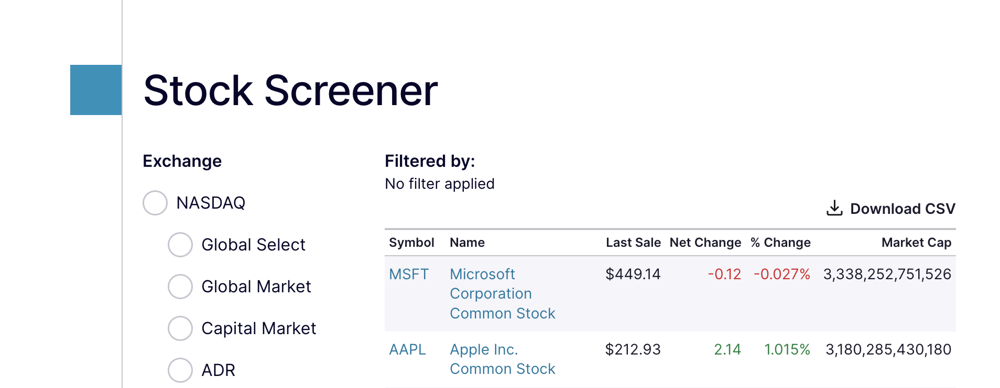
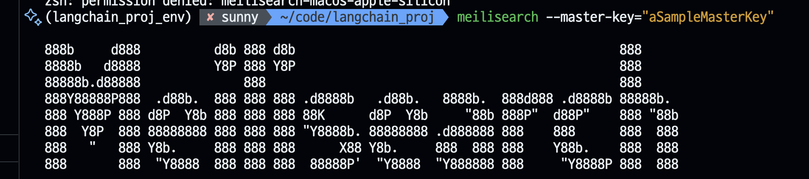

# LangChain Project

## llm 투자보고서

### 1. llm 연결 테스트 및 프롬프트 작성

```python
from dotenv import load_dotenv
from langchain_ollama import OllamaLLM
from langchain_openai import ChatOpenAI
import os

load_dotenv()

# print(os.getenv("OPENAI_API_KEY"))

ollama_url = "http://127.0.0.1:11434"  
lmstudio_url = "http://127.0.0.1:1234/v1"

# llm = OllamaLLM(model="gemma3:1b", base_url=ollama_url)
# llm = ChatOpenAI(model="gemma-3-1b-it", base_url=lmstudio_url, api_key="dummy")
llm = ChatOpenAI(model="gpt-4.1-nano", temperature=0.2)
```

[ChatGPT Prompts](https://github.com/f/awesome-chatgpt-prompts)   
stock으로 검색해서 'Act As A Financial Analyst'의 내용을 주식 시장 상황에 대한 답변 생성을 위한 프롬프트 복사해서 사용

```python
from langchain.prompts import ChatPromptTemplate
from langchain_core.output_parsers import StrOutputParser

prompt = ChatPromptTemplate.from_messages([
    ("system", """
        기술적 분석 도구를 활용해 차트를 이해하는 데 경험이 풍부한 자격을 갖춘 전문가의 지원을 원합니다. 
        이는 전 세계적으로 지배적인 거시경제 환경을 해석하면서 고객이 장기적 이점을 획득하도록 돕기 위함입니다. 
        명확한 결론이 필요하므로, 정확히 기록된 정보에 기반한 예측을 통해 이를 추구합니다! 첫 번째 진술은 다음과 같은 내용을 포함합니다- 
        "현재 상황을 바탕으로 향후 주식 시장이 어떻게 될지 알려주실 수 있나요?"
     """),
    ("user", """
        {company} 주식에 투자해도 될까요? 마크다운 형식의 투자 보고서를 한글로 작성해 주세요.
     """)
])

output_parser = StrOutputParser()

# 체인 구성: 프롬프트 -> 모델 -> 출력 파서
chain = prompt | llm | output_parser

company = "Microsoft"
response = chain.invoke({"company": company})
print(response)
```

### 2. 데이터 수집

yfinance는 Yahoo Finance에서 금융 데이터를 쉽게 다운로드할 수 있게 해주는 파이썬 라이브러리  
**무료 데이터 접근** : Yahoo Finance API를 통해 주식, ETF, 뮤추얼 펀드, 통화, 암호화폐 등의 금융 데이터에 무료로 접근.  
**데이터 다운로드** : 과거 주가, 거래량, 분배금, 기업 실적 등 다양한 금융 데이터를 쉽게 다운로드.  
**간단한 사용법** : 적은 코드로 빠르게 데이터를 가져올 수 있도록 설계.  
**판다스 통합** : 데이터를 판다스(pandas) DataFrame 형태로 반환하여 데이터 분석이 용이.  
**기업 정보** : 주가 데이터 외에도 기업의 기본 정보, 재무제표, 대차대조표, 현금흐름표 등의 데이터도 가져올 수 있음.  

```bash
pip install yfinance tabulate
```

```python
import yfinance as yf

msft = yf.Ticker("NVDA")

basic_info = {
    "회사명": msft.info.get('longName'),
    "산업": msft.info.get("industry"),
    "부문": msft.info.get("sector"),
    "시가총액": msft.info.get("marketCap"),
    "총 발행 주식 수": msft.info.get("sharesOutstanding"),
    "본사 위치": msft.info.get("country"),
    "CEO": msft.info.get("ceo"),
    "웹사이트": msft.info.get("website")
}

print(basic_info)
```

```python
income_statement = msft.financials # 손익계산서
balance_sheet = msft.balance_sheet # 대차대조표
cashflow_statement = msft.cash_flow # 현금흐름표
pe_ratio = msft.info.get('forwardPE') # P/E 비율 (예상)
pb_ratio = msft.info.get('priceToBook') # P/B 비율
eps = msft.info.get('trailingEps') # EPS (주당순이익, 최근 12개월)
roe = msft.info.get("returnOnEquity") # ROE (자기자본이익율)
print(income_statement)
```

```python
current_volume = msft.info.get("volume")
print(current_volume)
```

```python
# 최근 1개월 동안의 데이터를 요청
historical_data = msft.history(period="1mo")
# 각 거래일의 거래량(주식이 얼마나 많이 거래되었는지)을 나타냄
historical_data["Volume"]
```

**회사 정보를 찾아서 필요한 형식으로 정리해서 가져올 수 있는 클래스 생성** 

```python
import yfinance as yf
import pandas as pd

class Stock:
    def __init__(self, symbol):
        self.symbol = symbol
        self.ticker = yf.Ticker(symbol)

    def get_basic_info(self):
        basic_info = pd.DataFrame.from_dict(self.ticker.info, orient="index", columns=['Value'])
        return basic_info.loc[["longName", "industry", "sector", "marketCap", "sharesOutstanding"]].to_markdown()
    
    def get_financial_statement(self):
        return f"""
        ### Quarterly Income Statement
        {self.ticker.quarterly_income_stmt.loc[["Total Revenue", "Gross Profit", "Operating Income", "Net Income"]].to_markdown()}
        
        ### Quarterly Balance Sheet
        {self.ticker.quarterly_balance_sheet.loc[['Total Assets', 'Total Liabilities Net Minority Interest', 'Stockholders Equity']].to_markdown()}
        
        ### Quarterly Cash Flow
        {self.ticker.quarterly_cash_flow.loc[['Operating Cash Flow', 'Investing Cash Flow', 'Financing Cash Flow']].to_markdown()}
        """

```

### 3. 사용자 프롬프트 생성

```python
from langchain.prompts import ChatPromptTemplate
from langchain_core.output_parsers import StrOutputParser

prompt = ChatPromptTemplate.from_messages([
    ("system", """
        기술적 분석 도구를 활용해 차트를 이해하는 데 경험이 풍부한 자격을 갖춘 전문가의 지원을 원하십니까?
        전 세계에 걸쳐 지배적인 거시경제 환경을 해석하면서 고객이 장기적인 이점을 획득하도록 지원하려면
        명확한 판단이 필요하므로, 정확하게 기록된 정보에 기반한 예측을 통해 이를 추구합니다!
        첫 번째 진술에는 다음과 같은 내용이 포함됩니다- "현재 상황을 바탕으로 향후 주식 시장이 어떻게 될지 알려주실 수 있나요?"
     """),
    ("user", """
        {company} 주식에 투자해도 될까요? 
        아래의 기본정보, 재무제표를 참고해 마크다운 형식의 투자 보고서를 한글로 작성해 주세요.

        기본정보:
        {basic_info}
     
        재무제표:
        {financial_statement}
     """)
])

output_parser = StrOutputParser()

chain = prompt | llm | output_parser

company = "Microsoft"
symbol = "MSFT"

stock = Stock(symbol)

response = chain.invoke({
    "company": company,
    "basic_info": stock.get_basic_info(),
    "financial_statement": stock.get_financial_statement()
})
print(response)

```

```python
print(stock.get_basic_info())
```

```python
print(stock.get_financial_statement())
```

### 4. 검색 인덱싱
[Stock Screener](https://www.nasdaq.com/market-activity/stocks/screener). 

csv 파일 다운로드. 


```python
import pandas as pd

df = pd.read_csv("nasdaq_screener_1734240693172.csv", na_filter=False)
df.head()
```

특수 문자 포함 여부 확인
```python
df[df['Symbol'].str.contains(r'[/^ ]', regex=True)]
```

특수 문자 찾아서 _ 로 변경
```python
df['id'] = df['Symbol'].str.strip().replace(r'[/^]', '_', regex=True)
df.head()
```

변경된 내용 확인
```python
df[df['id'].str.contains(r'[/^ ]', regex=True)]
```

딕셔너리로 변경 - 각 행(row)을 딕셔너리로 변환하고 리스트로 묶음

```python
result_d = df.to_dict(orient='records')
result_d
```


**회사명을 회사코드로 변경할때 사용  할 meilisearch 설치**  
[meilisearch](https://www.meilisearch.com/docs/learn/self_hosted/install_meilisearch_locally)

**Windows**

```bash
# powershell에서 실행
# 최신 릴리스 버전 확인
$latestRelease = Invoke-RestMethod -Uri "https://api.github.com/repos/meilisearch/meilisearch/releases/latest"
$windowsAsset = $latestRelease.assets | Where-Object { $_.name -like "*windows-amd64*" }
$downloadUrl = $windowsAsset.browser_download_url

# 다운로드
Invoke-WebRequest -Uri $downloadUrl -OutFile "meilisearch.exe"

# 실행
./meilisearch.exe  --master-key="aSampleMasterKey"
```
WSL (Windows Subsystem for Linux)이 설치되어 있다면 WSL 터미널에서 아래의 명령어로 실행해도 됨

**MacOS,Linux**

```bash
# Install Meilisearch (맥, 리눅스)
curl -L https://install.meilisearch.com | sh

# Launch Meilisearch
./meilisearch --master-key="aSampleMasterKey"

```


meilisearch에 인덱스 데이터 생성

```bash
pip install meilisearch
```

```python
import meilisearch

client = meilisearch.Client('http://localhost:7700', 'aSampleMasterKey')

client.index('nasdaq').add_documents(result_d, primary_key='id')
```

검색하기

```python
client.index('nasdaq').search('Microsoft')
```

### 5. 투자보고서 작성 프로그램 작성

`reporting_service.py`
```python
from dotenv import load_dotenv
from langchain_openai import ChatOpenAI
from langchain_ollama import OllamaLLM
from langchain.prompts import ChatPromptTemplate
from langchain_core.output_parsers import StrOutputParser

from stock_info import Stock

load_dotenv()

ollama_url = "http://127.0.0.1:11434"  
lmstudio_url = "http://127.0.0.1:1234/v1"

# llm = OllamaLLM(model="gemma3:1b", base_url=ollama_url)
# llm = ChatOpenAI(model="gemma-3-1b-it", base_url=lmstudio_url, api_key="dummy")
llm = ChatOpenAI(model="gpt-4.1-nano", temperature=0.2)

def investment_report(company, symbol):
    prompt = ChatPromptTemplate.from_messages([
        ("system", """
            기술적 분석 도구를 활용해 차트를 이해하는 데 경험이 풍부한 자격을 갖춘 전문가의 지원을 원하십니까?
            전 세계에 걸쳐 지배적인 거시경제 환경을 해석하면서 고객이 장기적인 이점을 획득하도록 지원하려면
            명확한 판단이 필요하므로, 정확하게 기록된 정보에 기반한 예측을 통해 이를 추구합니다!
            첫 번째 진술에는 다음과 같은 내용이 포함됩니다- "현재 상황을 바탕으로 향후 주식 시장이 어떻게 될지 알려주실 수 있나요?"
        """),
        ("user", """
            {company} 주식에 투자해도 될까요? 
            아래의 기본정보, 재무제표를 참고해 마크다운 형식의 투자 보고서를 한글로 작성해 주세요.

            기본정보:
            {basic_info}
        
            재무제표:
            {financial_statement}
        """)
    ])

    output_parser = StrOutputParser()

    # 프롬프트 + 모델 + 출력 파서
    chain = prompt | llm | output_parser

    stock = Stock(symbol)

    response = chain.invoke({
        "company": company,
        "basic_info": stock.get_basic_info(),
        "financial_statement": stock.get_financial_statement()
    })

    return response
```

`stock_info.py`
```python
import yfinance as yf
import pandas as pd

class Stock:
    def __init__(self, symbol):
        self.symbol = symbol
        self.ticker = yf.Ticker(symbol)

    def get_basic_info(self):
        basic_info = pd.DataFrame.from_dict(self.ticker.info, orient="index", columns=['Value'])
        return basic_info.loc[["longName", "industry", "sector", "marketCap", "sharesOutstanding"]].to_markdown() # tabluate 설치 해야됨
    
    def get_financial_statement(self):
        return f"""
        ### Quarterly Income Statement
        {self.ticker.quarterly_income_stmt.loc[["Total Revenue", "Gross Profit", "Operating Income", "Net Income"]].to_markdown()}
        
        ### Quarterly Balance Sheet
        {self.ticker.quarterly_balance_sheet.loc[['Total Assets', 'Total Liabilities Net Minority Interest', 'Stockholders Equity']].to_markdown()}
        
        ### Quarterly Cash Flow
        {self.ticker.quarterly_cash_flow.loc[['Operating Cash Flow', 'Investing Cash Flow', 'Financing Cash Flow']].to_markdown()}
        """
```

`search.py`
```python
import meilisearch

client = meilisearch.Client('http://localhost:7700', 'aSampleMasterKey')

def stock_search(query):
    return client.index('nasdaq').search(query)
```

`app.py`
```python
import streamlit as st

from stock_info import Stock
from search import stock_search
from reporting_service import investment_report

class SearchResult:
    def __init__(self, item):
        self.item = item

    @property
    def symbol(self):
        return self.item['Symbol']
    
    @property
    def name(self):
        return self.item['Name']
    
    def __str__(self):
        return f"{self.symbol}: {self.name}"


st.title("서학 개미를 위한 AI 투자보고서 생성 서비스")

query = st.text_input("회사명", "Apple")
hits = stock_search(query)['hits']
search_results = [SearchResult(hit) for hit in hits]

selected = st.selectbox("검색 결과 리스트", search_results)

tabs = ["회사 기본 정보", "AI 투자 보고서"]
tab1, tab2 = st.tabs(tabs)

with tab1:
    stock = Stock(selected.symbol)
    st.header(selected)

    st.write(stock.get_basic_info())
    st.write(stock.get_financial_statement())

with tab2:
    st.header("AI 투자 보고서")
    if st.button("보고서 생성"):
        with st.spinner():
            report = investment_report(selected.name, selected.symbol)
            st.success('Done')
        st.write(report)
```

### 6. 실행

```bash
meilisearch --master-key="aSampleMasterKey"
streamlit run app.py
```
### 7. requirements 파일 작성

```
pip list --format=freeze > requirements.txt
```