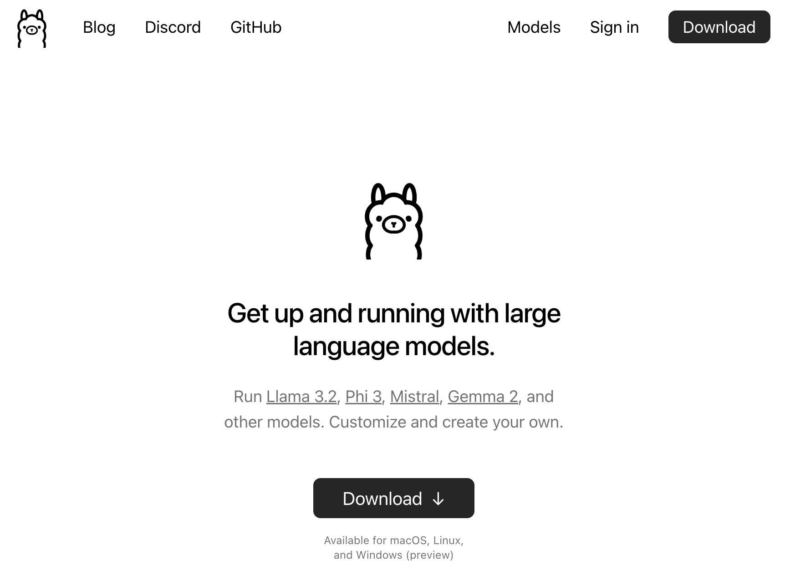
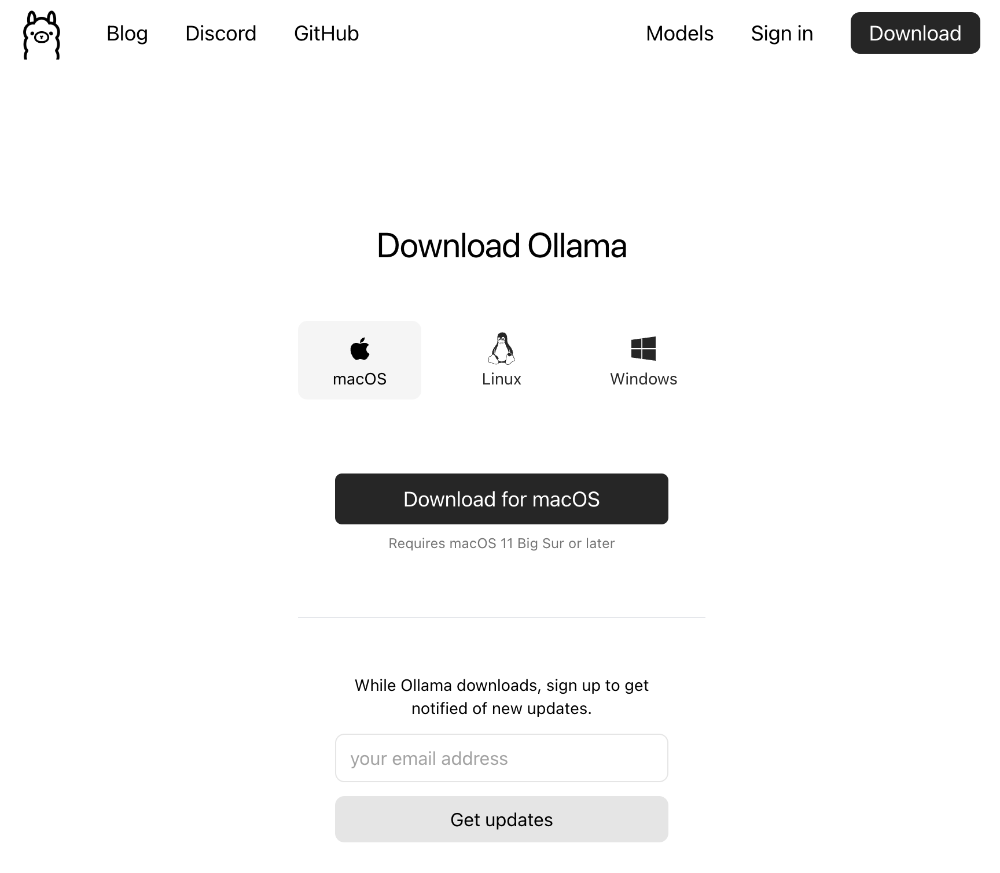
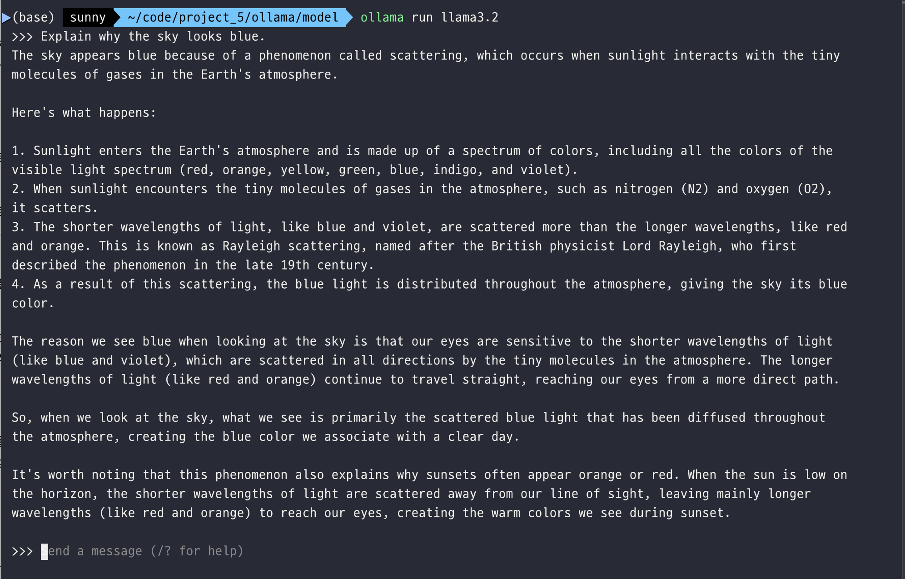

---
title: Ollama
layout: default
parent: LLM
nav_order: 1
permalink: /llm/ollama
# nav_exclude: true
# search_exclude: true
--- 
# Ollama

## Ollama 설치
[Ollama](https://ollama.com/)

### 1. 다운로드 클릭


### 2. 운영체제에 맞춰 다운로드


### 3. 설치 후 터미널에서 설치 확인 후, 모델 실행
#### 설치확인
```bash
ollama serve
```
웹브라우저에서 127.0.0.1:11434 접속해서  Ollama is running 나오면 실행중임.


```bash
ollama list
ollama run llama3.2
```



## Ollama 사용
```py
import requests
import json

# Define the URL and the payload
url = 'http://localhost:11434/api/generate'
data =input('질문: ')
payload = {
    "model": "llama3.2",
    "prompt": data
}

# Convert the payload to a JSON string
data = json.dumps(payload)

# Make the POST request
response = requests.post(url, data=data, headers={'Content-Type': 'application/json'})

if response.status_code == 200:
    list_dict_words = []
    for each_word in response.text.split("\n"):
        try:
            data = json.loads(each_word) 
        except:
            pass
        list_dict_words.append(data)
        
llama_response = " ".join([word['response'] for word in list_dict_words if type(word) == type({})])
print(llama_response)
```
