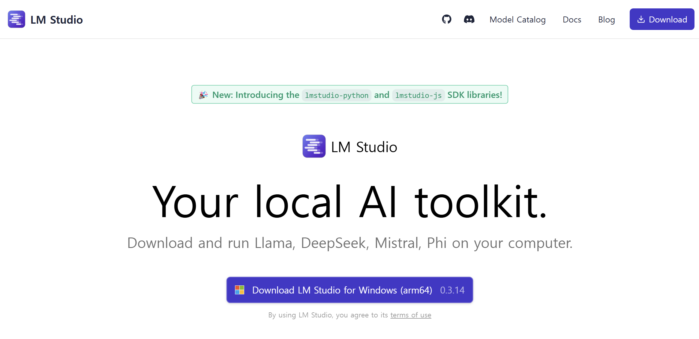
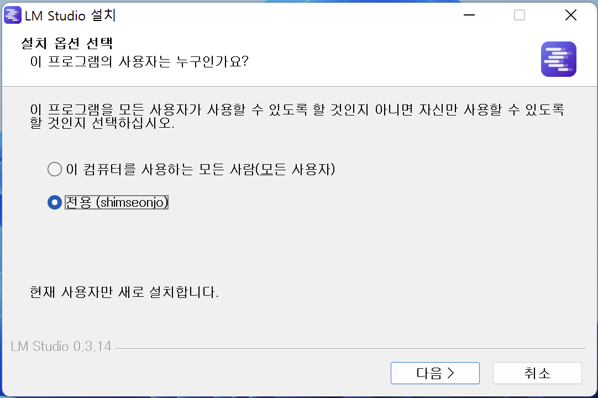
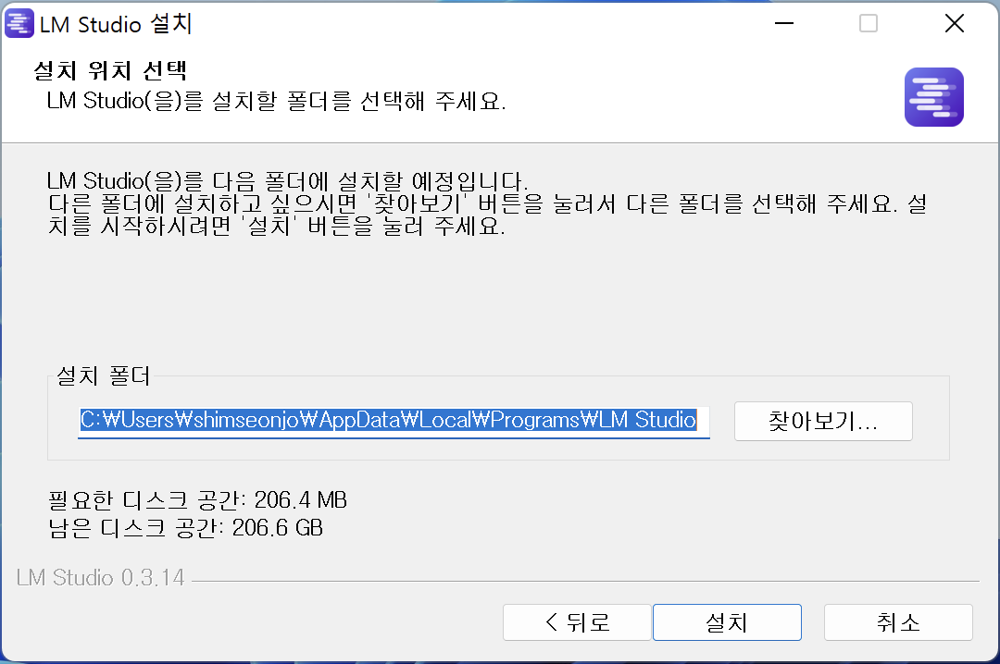
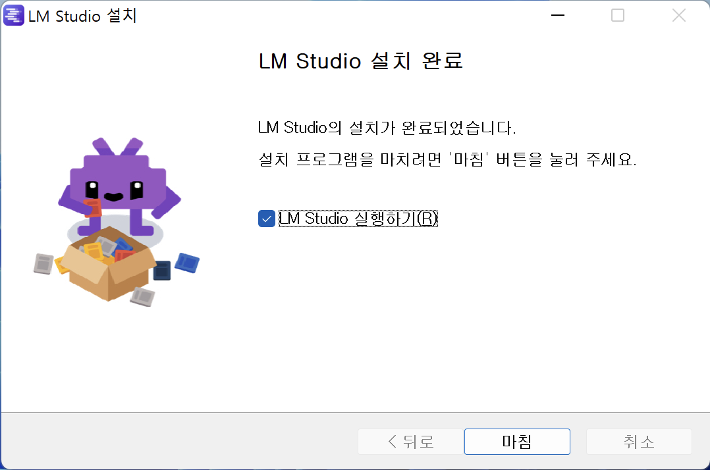
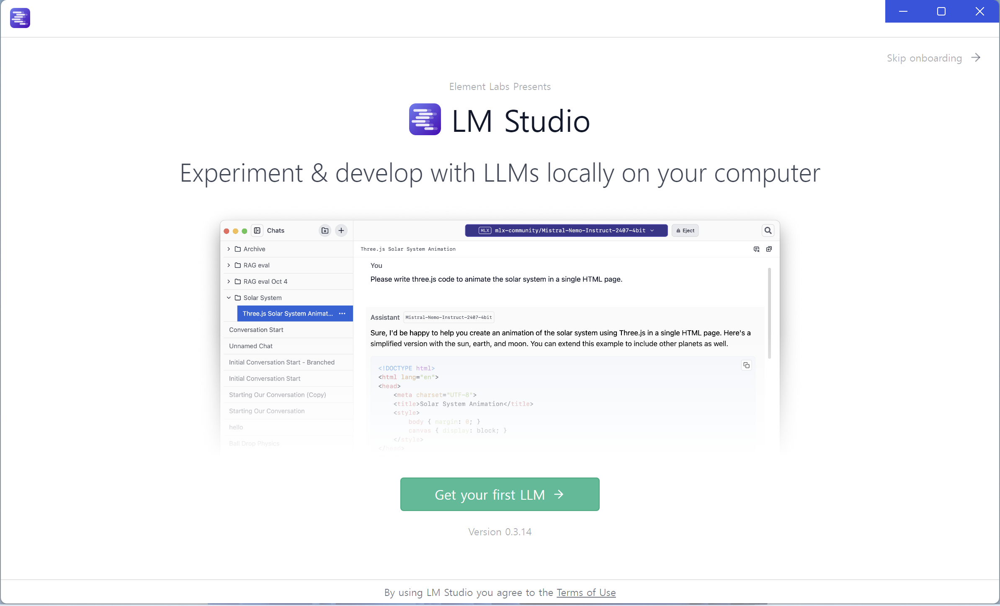
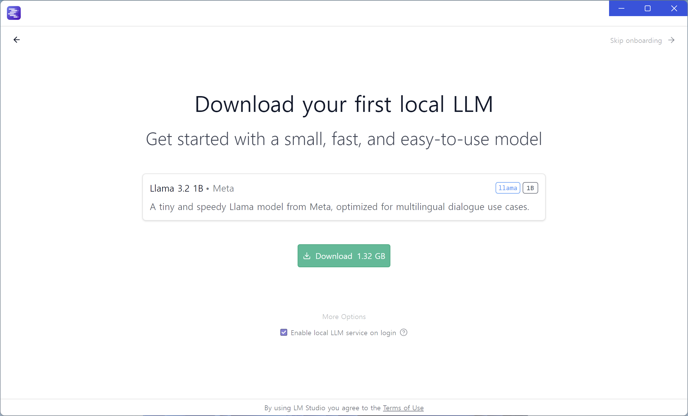
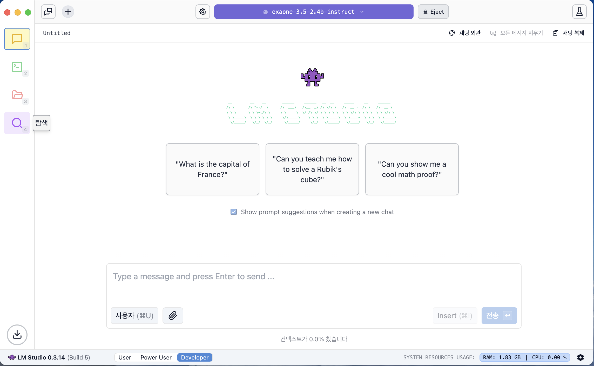
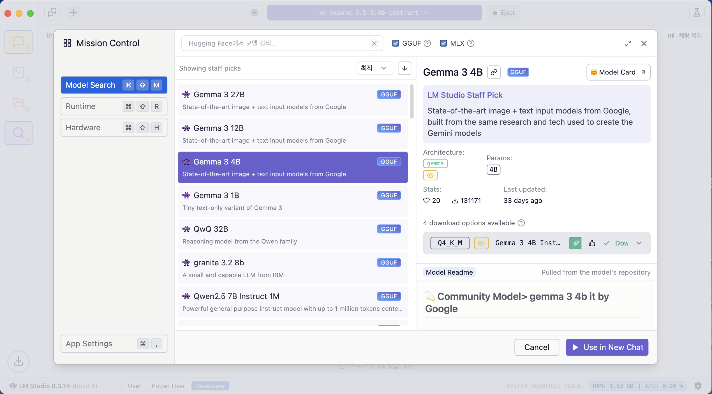

---
title: LM Studio
layout: default
parent: LLM
nav_order: 1
permalink: /llm/lmstudio
# nav_exclude: true
# search_exclude: true
--- 

## LM Studio 설치
[LM Studio](https://lmstudio.ai/)

### 1. 다운로드 클릭

### 2. 기본값 선택하고 다음 버튼 클릭

### 3. 설치 버튼 클릭

### 4. 마침 버튼 클릭

### 5. Get your first LLM 클릭하고 다운로드 받거나 오른쪽 상단 Skip onboarding 버튼 클릭

### 6. Get your first LLM를 클릭하면 Llama 3.2 1B 모델을 다운로드

### 7. 왼쪽 탐색 아이콘 클릭

### 8. 사용할 모델 다운로드 (gemma-3-1b)

