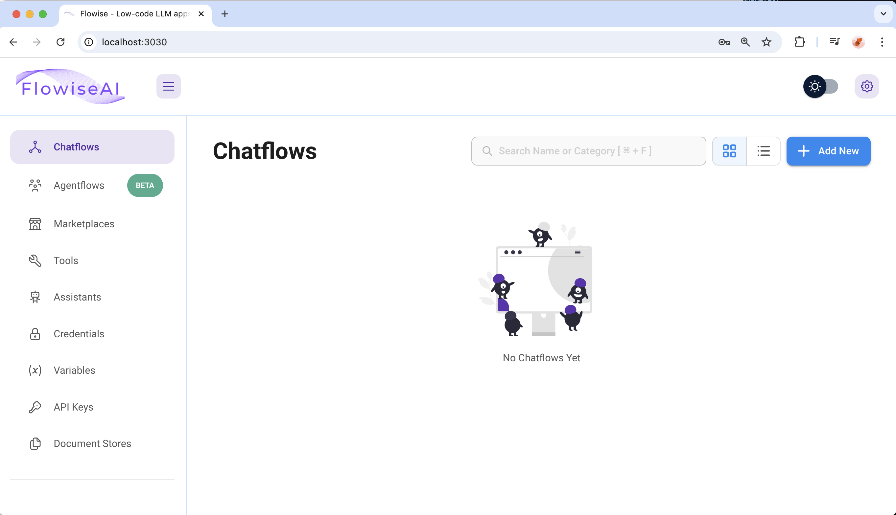
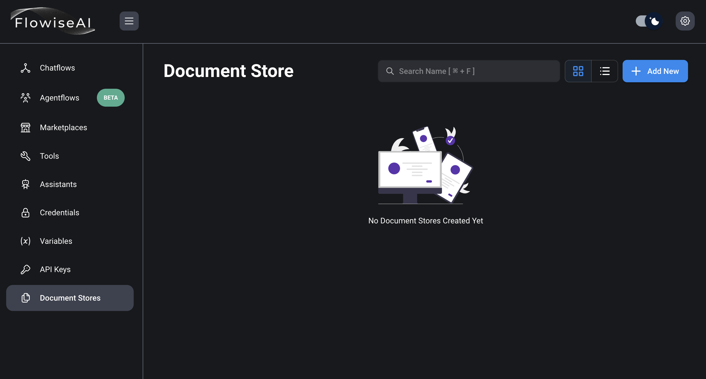
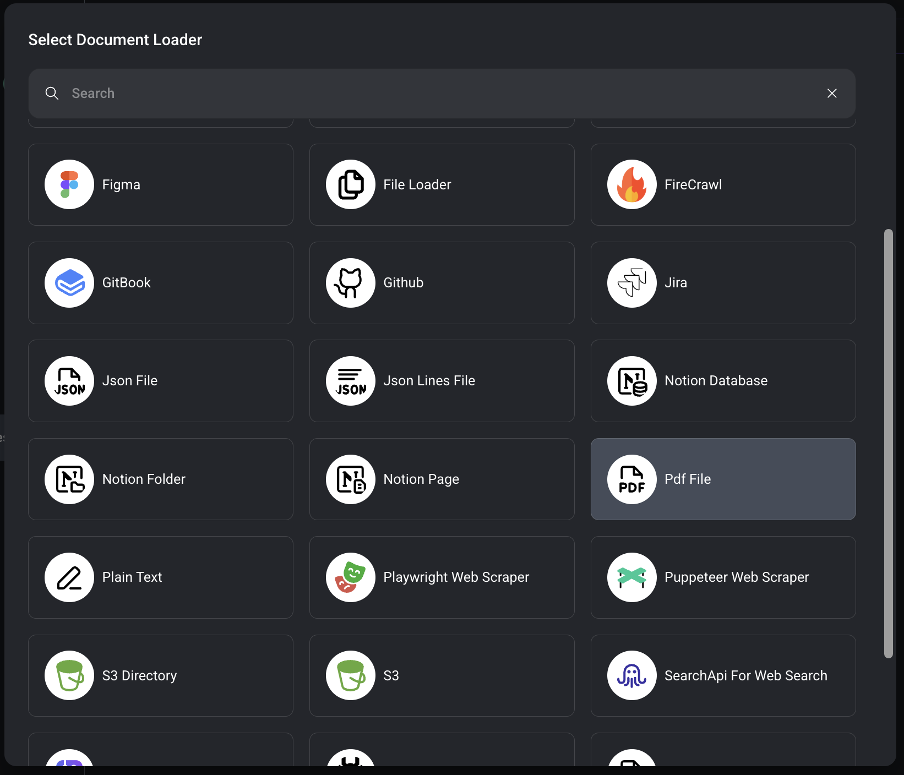
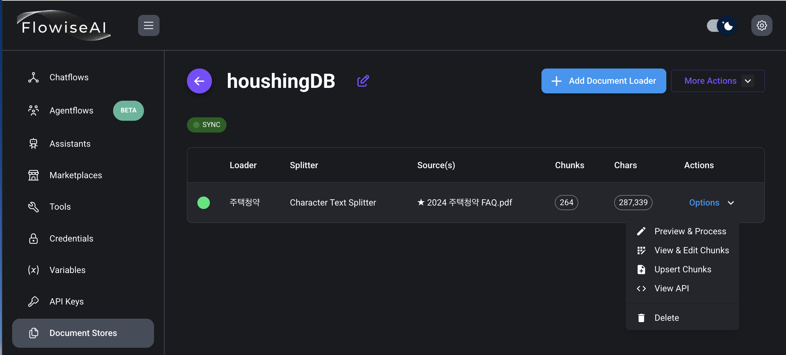
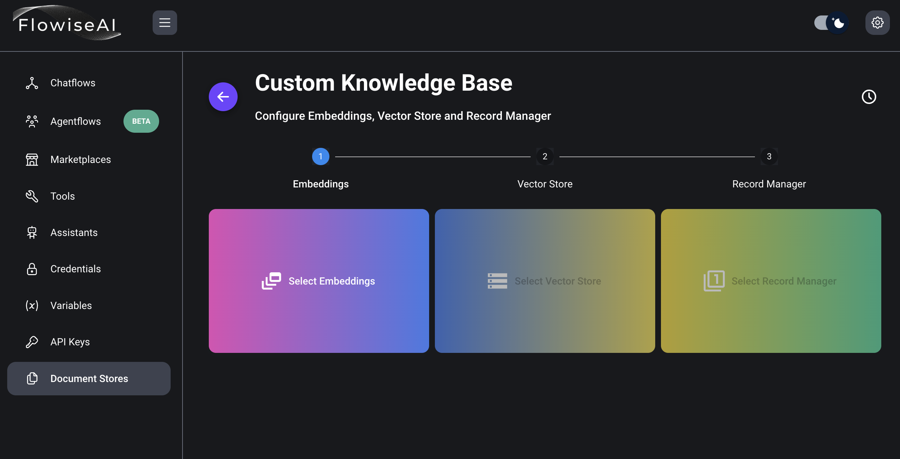
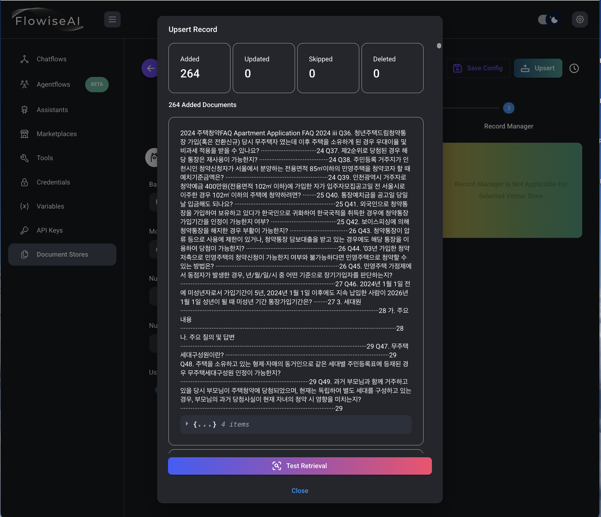
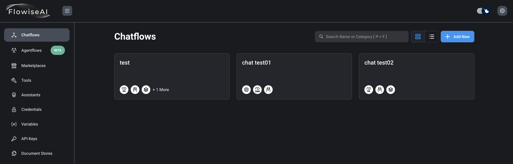
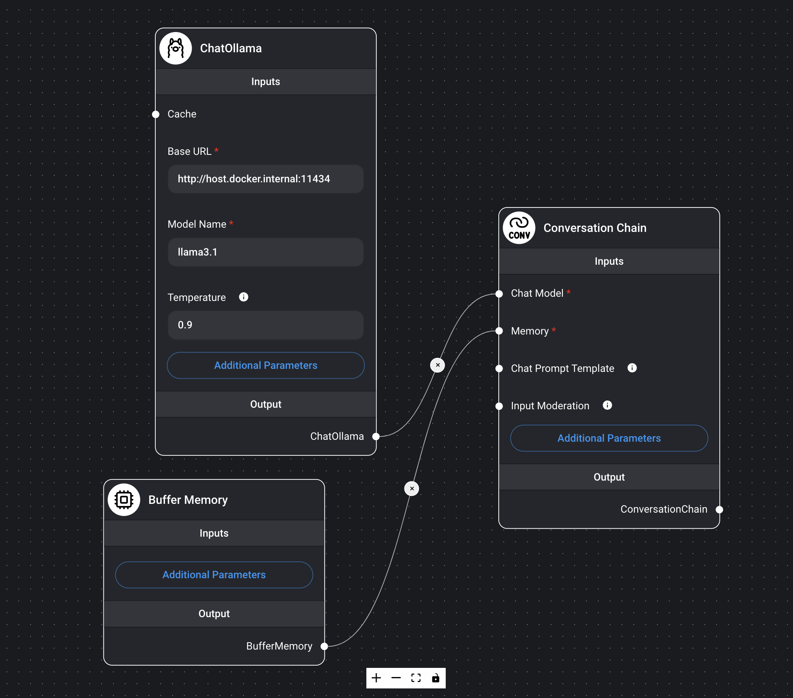
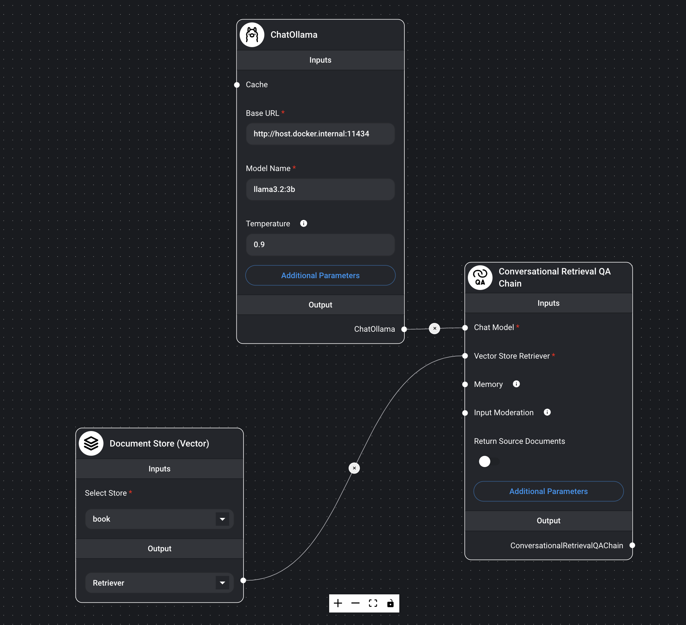
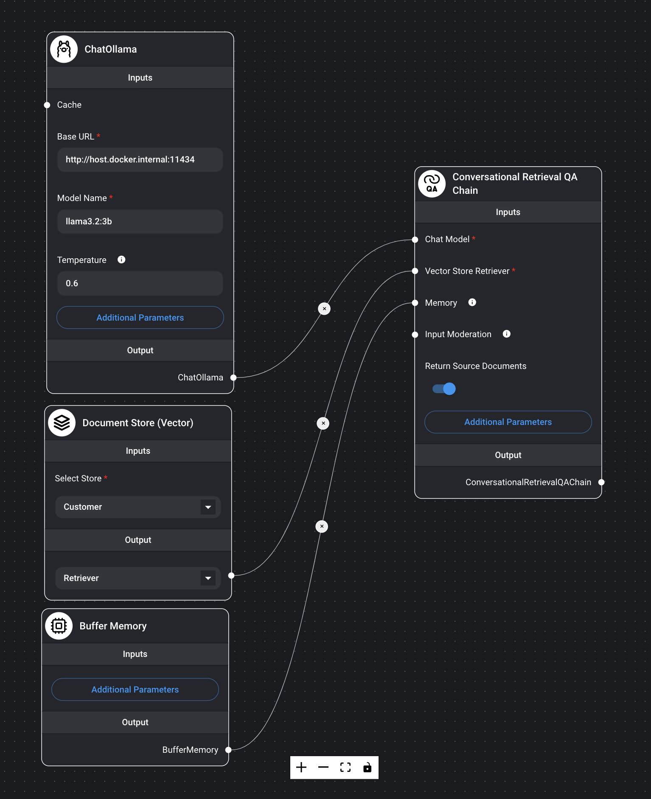

---
title: FlowiseAI
layout: default
parent: LLM
nav_order: 1
permalink: /llm/flowiseai
# nav_exclude: true
# search_exclude: true
--- 

## FlowiseAI

### 1. 필요한 모델 다운로드

```bash
ollama list
ollama run llama3.2:3b
/bye
ollama pull nomic-embed-text
```

### 2. FlowiseAI 설치

[FlowiseAI](https://flowiseai.com/)  
[github](https://github.com/FlowiseAI/Flowise)

#### 1) github clone

```bash
git clone https://github.com/FlowiseAI/Flowise.git
```

#### 2) docker 폴더로 이동

#### 3) .env.example 파일을 .env 로 복사

```bash
PORT=3030
FLOWISE_USERNAME=user
FLOWISE_PASSWORD=1234
```

#### 4) docker-compose.yml 수정

```yml
# ports 항목에 11434 포트 포워딩 추가
        ports:
            - '${PORT}:${PORT}'
            - 11434:11434
```

#### 5) docker compose로 빌드 및 실행

서비스 시작

```bash
docker-compose up -d
```

서비스 종료

```bash
docker-compose stop
```

### 3. FlowiseAI 사용하기

#### 1) localhost:3030 으로 접속


#### 2) Document Store 클릭


#### 3) Add New 클릭하고 Name 입력하고 Add 버튼 클릭


#### 4) 생성된 Document Store 클릭


#### 5) Add Document Loader 버튼 클릭


#### 6) 문서의 종류에 따라서 선택 후 등록


#### 7) Upset Config 버튼 클릭


#### 8) Select Embeddings 클릭


#### 9) Ollama Embeddings 선택


#### 10) Select Vector Store 클릭 후 Faiss 선택, 항목 입력 후 Upset 버튼 클릭


#### 11) Test Retrieval 버튼 클릭후 테스트, Save Config 버튼 클릭


#### 12) Chatflows 선택 후, Add New 버튼 클릭


#### 13) 작성






#### 14) streamlit으로 Flowise 연동해서 사용
streamlit_app.py
```py
import streamlit as st
from flowise import Flowise, PredictionData
import json

# Flowise app base url
base_url="http://localhost:3030"
# Chatflow/Agentflow ID
flow_id = "fda11deb-e4a5-4a3e-a413-6daf0ab5a527"
# Show title and description.
st.title("💬 Flowise Streamlit Chat")
st.write(
    "This is a simple chatbot that uses Flowise Python SDK"
)

# Create a Flowise client.
client = Flowise(base_url=base_url)

# Create a session state variable to store the chat messages. This ensures that the
# messages persist across reruns.
if "messages" not in st.session_state:
    st.session_state.messages = []

# Display the existing chat messages via `st.chat_message`.
for message in st.session_state.messages:
    with st.chat_message(message["role"]):
        st.markdown(message["content"])

def generate_response(prompt: str):
    print('generating response')
    completion = client.create_prediction(
        PredictionData(
            chatflowId=flow_id,
            question=prompt,
            overrideConfig={
                "sessionId": "session1234"
            },
            streaming=True
        )
    )

    for chunk in completion:
        print(chunk)
        parsed_chunk = json.loads(chunk)
        if (parsed_chunk['event'] == 'token' and parsed_chunk['data'] != ''):
            yield str(parsed_chunk['data'])

# Create a chat input field to allow the user to enter a message. This will display
# automatically at the bottom of the page.
if prompt := st.chat_input("What is up?"):

    # Store and display the current prompt.
    st.session_state.messages.append({"role": "user", "content": prompt})
    with st.chat_message("user"):
        st.markdown(prompt)

    # Stream the response to the chat using `st.write_stream`, then store it in 
    # session state.
    with st.chat_message("assistant"):
        response = generate_response(prompt)
        full_response = st.write_stream(response)
    st.session_state.messages.append({"role": "assistant", "content": full_response})

```

