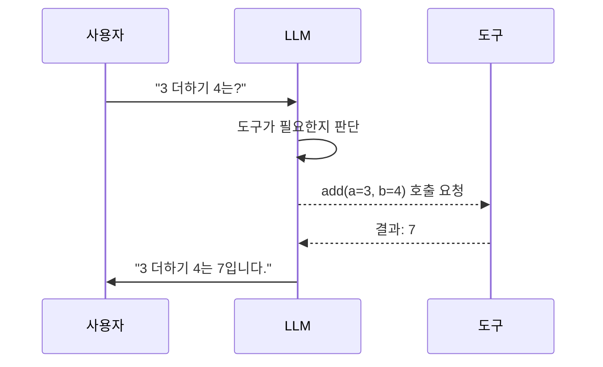
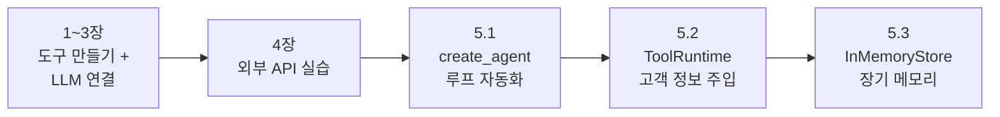

## 학습 목표

- @tool 데코레이터로 커스텀 도구를 정의할 수 있다
- 에이전트의 동작 원리(도구 선택 → 실행 → 반복)를 이해한다

<a id="toc"></a>

## 진행 순서

1. [도구란 무엇인가?](#part1) - LLM과 도구의 관계 이해
2. [도구 만들기](#part2) - @tool 데코레이터, Pydantic 스키마
3. [도구를 LLM에 연결하기](#part3) - bind_tools, tool_calls, 도구 실행 루프
4. [외부 API 호출 실습](#part4) - 날씨 API, 뉴스 API
5. [심화: 에이전트와 고급 기능](#part5) - create_agent, ToolRuntime, Store, 스트리밍


---

# LangChain 도구 (Tools)

이전 챕터까지 프롬프트로 질문하고, 파서로 결과를 정리하는 법을 배웠습니다. 하지만 LLM은 기본적으로 **텍스트만 생성**할 수 있습니다. "오늘 서울 날씨가 어때?"라고 물어도 실제 날씨를 조회하지 못하고 학습 데이터로 추측만 합니다.

**도구(Tool)**를 연결하면 LLM이 **실제로 날씨 API를 호출**하거나, **데이터베이스를 검색**하거나, **계산**할 수 있게 됩니다.

---

<a id="part1"></a>

## 1. 도구란 무엇인가? [↑](#toc)

### 스마트폰 비유

> LLM 혼자는 **전화만 되는 피처폰**과 같습니다. 도구를 연결하면 **앱이 설치된 스마트폰**이 됩니다. 날씨 앱(날씨 도구), 계산기 앱(계산 도구), 검색 앱(검색 도구)을 설치하면 LLM이 직접 사용합니다.

> 💡 쉽게 말해, **도구는 LLM이 사용할 수 있는 "앱"**,
> **에이전트는 어떤 앱을 열지 "결정하는 사용자"** 역할을 합니다.

### @tool 데코레이터란?

`@tool`은 일반 Python 함수에 **"이건 LLM이 사용할 수 있는 도구입니다"라는 명찰**을 달아주는 것입니다. 명찰에는 도구의 이름과 설명이 적혀 있어서, LLM이 언제 이 도구를 써야 하는지 판단할 수 있습니다.

---

<a id="part2"></a>

## 2. 도구 기본 사용법 [↑](#toc)

### 2.1 @tool 데코레이터

도구를 만드는 가장 간단한 방법은 @tool 데코레이터를 사용하는 것.  
함수의 docstring은 모델이 도구를 언제 사용해야 하는지 이해하는 데 도움이 되는 도구 설명.

``` python
from langchain_core.tools import tool

@tool
def search_database(query: str, limit: int = 10) -> str:
    """고객 DB에서 검색어에 맞는 레코드를 찾습니다."""
    return f"'{query}'에 대한 검색 결과 {limit}건을 찾았습니다."

# ✅ 테스트
result = search_database.invoke({"query": "홍길동", "limit": 3})
print("🔍 Tool 실행 결과:", result)
```

**출력 예시**
```
🔍 Tool 실행 결과: '홍길동'에 대한 검색 결과 3건을 찾았습니다.
```

### 2.2 도구 이름 및 설명 설정

```py
from langchain_core.tools import tool

@tool("web_search", description="웹 검색을 수행합니다.")
def search(query: str) -> str:
    """웹에서 관련 정보를 검색합니다."""
    return f"'{query}'에 대한 웹 검색 결과입니다."

# ✅ 테스트
print(search.invoke({"query": "LangChain"}))
```

### 2.3 Pydantic 모델 활용

```py
from langchain_core.tools import tool
from pydantic import BaseModel, Field

class WeatherInput(BaseModel):
    location: str = Field(description="도시 이름")
    units: str = Field(default="celsius", description="온도 단위")
    include_forecast: bool = Field(default=False, description="5일 예보 포함 여부")

@tool(args_schema=WeatherInput)
def get_weather(location: str, units: str = "celsius", include_forecast: bool = False) -> str:
    """현재 날씨와 선택적 예보를 반환합니다."""
    temp = 22 if units == "celsius" else 72
    result = f"{location}의 온도는 {temp}도 {units}입니다."
    if include_forecast:
        result += " (5일 예보: 맑음)"
    return result

# ✅ 테스트
print(get_weather.invoke({"location": "서울", "units": "celsius", "include_forecast": True}))
```

---

<a id="part3"></a>

## 3. 도구를 LLM에 연결하기 [↑](#toc)

2장에서 도구를 **만들었습니다**. 하지만 아직까지는 사람이 직접 `tool.invoke()`를 호출하고 있습니다. 진짜 핵심은 **LLM이 스스로 "이 도구를 써야겠다"고 판단**하는 것입니다.

### 3.1 bind_tools — LLM에 도구 알려주기

`bind_tools()`는 LLM에게 "이런 도구들을 사용할 수 있어"라고 알려주는 함수입니다.

```python
from dotenv import load_dotenv
load_dotenv()

from langchain_core.tools import tool
from langchain_openai import ChatOpenAI

# 1. 도구 정의
@tool
def add(a: int, b: int) -> int:
    """두 숫자를 더합니다."""
    return a + b

@tool
def multiply(a: int, b: int) -> int:
    """두 숫자를 곱합니다."""
    return a * b

# 2. LLM에 도구 연결
llm = ChatOpenAI(model="gpt-4o-mini", temperature=0)
llm_with_tools = llm.bind_tools([add, multiply])
```

> 💡 **Ollama 사용 시:** `from langchain_ollama import ChatOllama` 후 `llm = ChatOllama(model="gemma3:1b")`로 교체할 수 있습니다.

### 3.2 tool_calls — LLM이 뭘 호출했는지 확인하기

> 아래 코드는 **3.1을 먼저 실행한 상태**에서 이어서 실행합니다.

`bind_tools`를 한 LLM에 질문하면, LLM이 직접 답변하는 대신 **"이 도구를 이 인자로 호출해줘"라고 요청**합니다.

```python
from langchain_core.messages import HumanMessage

# LLM에게 질문
ai_msg = llm_with_tools.invoke([HumanMessage(content="3 더하기 4는?")])

# LLM은 직접 답하지 않고, 도구 호출을 "요청"합니다
print("LLM 응답 텍스트:", ai_msg.content)        # 보통 비어있음
print("도구 호출 요청:", ai_msg.tool_calls)       # 핵심!
```

**실행 결과:**
```
LLM 응답 텍스트:
도구 호출 요청: [{'name': 'add', 'args': {'a': 3, 'b': 4}, 'id': 'call_abc123'}]
```

> 핵심: LLM은 `add(3, 4)`를 **직접 실행하지 않습니다**. "add 함수를 a=3, b=4로 호출해줘"라고 **요청만** 합니다. 실제 실행은 우리가 해야 합니다.

### 3.3 도구 실행 → 결과를 LLM에 전달 → 최종 답변

> 아래 코드는 **3.1을 먼저 실행한 상태**에서 이어서 실행합니다.

```python
from langchain_core.messages import HumanMessage, ToolMessage

# 전체 대화 흐름을 메시지 리스트로 관리
messages = [HumanMessage(content="3 더하기 4는?")]

# Step 1: LLM이 도구 호출 요청
ai_msg = llm_with_tools.invoke(messages)
messages.append(ai_msg)
print(f"🤖 LLM 요청: {ai_msg.tool_calls[0]['name']}({ai_msg.tool_calls[0]['args']})")

# Step 2: 도구를 실제로 실행
tool_call = ai_msg.tool_calls[0]
if tool_call["name"] == "add":
    result = add.invoke(tool_call["args"])
elif tool_call["name"] == "multiply":
    result = multiply.invoke(tool_call["args"])

# Step 3: 실행 결과를 ToolMessage로 LLM에 전달
messages.append(ToolMessage(content=str(result), tool_call_id=tool_call["id"]))
print(f"🔧 도구 결과: {result}")

# Step 4: LLM이 최종 답변 생성
final = llm_with_tools.invoke(messages)
print(f"🤖 최종 답변: {final.content}")
```

**실행 결과:**
```
🤖 LLM 요청: add({'a': 3, 'b': 4})
🔧 도구 결과: 7
🤖 최종 답변: 3 더하기 4는 7입니다.
```

이 흐름을 그림으로 표현하면:



### 3.4 LLM이 도구를 사용하지 않는 경우

> 아래 코드는 **3.1를 먼저 실행한 상태**에서 이어서 실행합니다.

도구가 필요 없는 질문에는 LLM이 직접 답변합니다.

```python
from langchain_core.messages import HumanMessage

# 도구가 필요 없는 질문
ai_msg = llm_with_tools.invoke([HumanMessage(content="안녕하세요!")])

print("도구 호출:", ai_msg.tool_calls)   # 빈 리스트
print("직접 답변:", ai_msg.content)      # LLM이 직접 응답
```

**실행 결과:**
```
도구 호출: []
직접 답변: 안녕하세요! 무엇을 도와드릴까요?
```

> 핵심: LLM이 **도구를 쓸지 말지 스스로 판단**합니다. 도구가 바인딩되어 있다고 항상 사용하는 것이 아닙니다.

### 🎯 실습 미션

1. `add`와 `multiply` 도구를 바인딩한 상태에서 "5 곱하기 3은?"을 질문하고, `tool_calls`를 확인해보세요. LLM이 `multiply`를 선택하는지 확인합니다.
2. "오늘 기분이 어때?"처럼 도구가 필요 없는 질문을 해보고, `tool_calls`가 빈 리스트인지 확인해보세요.
3. 도구를 3개 이상 만들어 바인딩하고, 다양한 질문에 LLM이 적절한 도구를 선택하는지 테스트해보세요.

---

<a id="part4"></a>

## 4. 외부 API 호출 실습 (예: 날씨 API, 뉴스 API) [↑](#toc)

3장에서 배운 `bind_tools` 패턴을 실제 외부 API에 적용해봅니다.

### 4.1 환경 설정 및 API 키 준비

* **API 키 준비:** OpenAI API 키와 OpenWeatherMap, NewsAPI 등의 키를 발급받아 `.env` 파일에 저장합니다.
[News API](https://newsapi.org/) 에서 키를 새로 발급
[OpenWeatherMap](https://openweathermap.org/) 에 default 값으로 생성되어 있음(그대로 사용 새로 발급 시 바로 사용못함.)

`.env`
```
OPENAI_API_KEY=본인의_OpenAI_API키
OPENWEATHERMAP_API_KEY=본인의_OpenWeatherMap_API키
NEWSAPI_API_KEY=본인의_NewsAPI_API키
```

### 4.2 공통 도구 파일 만들기

날씨 도구와 뉴스 도구는 4장과 5장에서 공통으로 사용합니다. 별도 파일로 분리하여 재사용합니다.

```
프로젝트 폴더/
├── .env
├── tools_api.py          ← 공통 도구 정의
├── 04_bind_tools.py      ← 4.4 실습 코드
└── 05_agent.py           ← 5.1 실습 코드
```

`tools_api.py`
```python
from dotenv import load_dotenv
import os
import requests
from langchain_core.tools import tool
from pydantic import BaseModel, Field

load_dotenv()

# ========== 날씨 조회 도구 ==========

class WeatherInput(BaseModel):
    city: str = Field(description="날씨를 조회할 도시 이름 (영문)")

@tool(args_schema=WeatherInput)
def get_weather(city: str) -> str:
    """주어진 도시의 현재 날씨를 반환합니다."""
    api_key = os.getenv("OPENWEATHERMAP_API_KEY")
    url = "http://api.openweathermap.org/data/2.5/weather"
    params = {"q": city, "appid": api_key, "units": "metric", "lang": "kr"}
    response = requests.get(url, params=params, timeout=10)
    data = response.json()
    if data.get("cod") != 200:
        return f"'{city}'의 날씨 정보를 찾을 수 없습니다."
    temp = data["main"]["temp"]
    desc = data["weather"][0]["description"]
    return f"{data['name']}의 현재 기온은 {temp}℃, 날씨는 {desc}입니다."

# ========== 뉴스 검색 도구 ==========

class NewsInput(BaseModel):
    keyword: str = Field(description="최신 뉴스를 검색할 키워드 (한글 또는 영문)")

@tool(args_schema=NewsInput)
def get_news(keyword: str) -> str:
    """주어진 키워드에 대한 최신 뉴스 제목을 반환합니다."""
    api_key = os.getenv("NEWSAPI_API_KEY")
    url = "https://newsapi.org/v2/everything"
    params = {"q": keyword, "language": "ko", "sortBy": "publishedAt", "pageSize": 1, "apiKey": api_key}
    res = requests.get(url, params=params, timeout=10)
    data = res.json()
    articles = data.get("articles")
    if not articles:
        return f"'{keyword}'에 대한 최신 뉴스가 없습니다."
    top = articles[0]
    return f"'{keyword}' 관련 뉴스: {top.get('title', '(제목 없음)')} - {top.get('source', {}).get('name', '')}"
```

> 💡 이 파일을 한 번 만들어두면 이후 4.3, 4.4, 5.1에서 `from tools_api import get_weather, get_news`로 가져와 사용합니다.

### 4.3 도구 단독 테스트

먼저 도구가 제대로 동작하는지 직접 호출하여 확인합니다.

```python
from tools_api import get_weather, get_news

# 날씨 도구 테스트
print(get_weather.invoke({"city": "Seoul"}))

# 뉴스 도구 테스트
print(get_news.invoke({"keyword": "AI"}))
```

**실행 결과 (예시):**
```
Seoul의 현재 기온은 18.5℃, 날씨는 맑음입니다.
'AI' 관련 뉴스: 생성형 AI 시장 급성장... - 한국경제
```

### 4.4 bind_tools로 도구 연결 및 실행

3장에서 배운 `bind_tools` 패턴으로 두 도구를 LLM에 연결합니다.

`04_bind_tools.py`
```python
from dotenv import load_dotenv
load_dotenv()

from langchain_openai import ChatOpenAI
from langchain_core.messages import HumanMessage, ToolMessage
from tools_api import get_weather, get_news

llm = ChatOpenAI(model="gpt-4o-mini", temperature=0)
tools = [get_weather, get_news]
tools_by_name = {t.name: t for t in tools}
llm_with_tools = llm.bind_tools(tools)

# Step 1: 질문
messages = [HumanMessage(content="부산 날씨와 AI 관련 최신 뉴스를 알려줘")]
ai_msg = llm_with_tools.invoke(messages)
messages.append(ai_msg)

# Step 2: LLM이 요청한 도구들을 실행
for tool_call in ai_msg.tool_calls:
    tool_fn = tools_by_name[tool_call["name"]]
    result = tool_fn.invoke(tool_call["args"])
    messages.append(ToolMessage(content=str(result), tool_call_id=tool_call["id"]))
    print(f"🔧 {tool_call['name']}({tool_call['args']}) → {result}")

# Step 3: 도구 결과를 받아 최종 답변 생성
final = llm_with_tools.invoke(messages)
print(f"\n🤖 최종 답변:\n{final.content}")
```

```bash
python 04_bind_tools.py
```

**실행 결과 (예시):**
```
🔧 get_weather({'city': 'Busan'}) → Busan의 현재 기온은 18.5℃, 날씨는 맑음입니다.
🔧 get_news({'keyword': 'AI'}) → 'AI' 관련 뉴스: 생성형 AI 시장 급성장... - 한국경제

🤖 최종 답변:
부산의 현재 날씨는 18.5℃로 맑습니다.
AI 관련 최신 뉴스로는 "생성형 AI 시장 급성장..."이 한국경제에서 보도되었습니다.
```

> 💡 LLM이 질문을 분석하여 `get_weather`와 `get_news` **두 도구를 동시에 호출**할 수 있습니다. 이것이 에이전트의 핵심 — LLM이 어떤 도구를 사용할지 스스로 판단합니다.

---

<a id="part5"></a>

## 5. 심화: 고객 상담 챗봇 만들기 [↑](#toc)

{: .warning }
> **여기부터 심화 내용입니다.** 1~4장만으로도 도구 사용의 핵심을 충분히 학습할 수 있습니다.
>
> **버전 참고:** `create_agent`, `ToolRuntime` API는 **LangChain v1.0 이상**에서 동작합니다.

이 섹션에서는 하나의 **고객 상담 챗봇**을 점진적으로 발전시키면서 3가지 개념을 배웁니다.

| 단계 | 추가하는 기능 | 배우는 개념 |
|------|-------------|------------|
| 5.1 | 도구 실행 루프를 자동화 | `create_agent` |
| 5.2 | 로그인한 고객 정보를 도구에 자동 전달 | `ToolRuntime.context` |
| 5.3 | 고객의 선호 설정을 대화가 끝나도 기억 | `InMemoryStore` (장기 메모리) |

### 5.1 create_agent — 도구 실행 루프 자동화

4장에서 `bind_tools` + 수동 루프를 직접 작성했습니다. 코드가 길었죠? `create_agent`는 이 루프를 자동으로 처리합니다.

| | 4장 (bind_tools + 수동) | 5장 (create_agent) |
|---|---|---|
| 도구 바인딩 | `llm.bind_tools(tools)` | 자동 |
| tool_calls 확인 | `for tc in ai_msg.tool_calls:` | 자동 |
| 도구 실행 | `tool_fn.invoke(tc["args"])` | 자동 |
| ToolMessage 생성 | `ToolMessage(content=..., tool_call_id=...)` | 자동 |
| 반복 판단 | 직접 구현해야 함 | 자동 |

`05_1_agent_basic.py`
```py
from dotenv import load_dotenv
load_dotenv()

from langchain.agents import create_agent
from langchain_openai import ChatOpenAI
from tools_api import get_weather, get_news

# create_agent 한 줄로 에이전트 생성 — 4장의 20줄을 대체합니다
agent = create_agent(
    model=ChatOpenAI(model="gpt-4o-mini", temperature=0),
    tools=[get_weather, get_news],
    system_prompt="당신은 유용한 어시스턴트입니다.",
)

# 에이전트 실행
result = agent.invoke({
    "messages": [{"role": "user", "content": "부산 날씨와 AI 뉴스를 알려줘"}]
})
print(result["messages"][-1].content)
```

```bash
python 05_1_agent_basic.py
```

**실행 결과 (예시):**
```
부산의 현재 날씨는 18.5℃로 맑습니다.
AI 관련 최신 뉴스로는 "생성형 AI 시장 급성장..."이 한국경제에서 보도되었습니다.
```

에이전트 내부에서 어떤 일이 일어나는지 보고 싶다면 `stream`을 사용합니다:

```py
# 에이전트의 내부 동작을 단계별로 확인
for step in agent.stream(
    {"messages": [{"role": "user", "content": "서울 날씨 알려줘"}]},
    stream_mode="updates",
):
    for node_name, data in step.items():
        print(f"[{node_name}] {data['messages'][-1]}")
    print("---")
```

**실행 결과 (예시):**
```
[agent] content='' tool_calls=[{'name': 'get_weather', 'args': {'city': 'Seoul'}, ...}]
---
[tools] content='Seoul의 현재 기온은 22℃, 날씨는 맑음입니다.'
---
[agent] content='서울의 현재 기온은 22℃이고 날씨는 맑습니다!'
---
```

> `[agent]` = LLM이 생각하는 단계, `[tools]` = 도구가 실행되는 단계. 4장에서 수동으로 작성한 루프가 자동으로 돌아가는 것을 확인할 수 있습니다.

### 5.2 ToolRuntime.context — 고객 정보 자동 전달

지금까지의 도구는 사용자가 "내 이름은 홍길동이야"라고 직접 말해야 합니다. 하지만 실제 서비스에서는 **로그인 정보가 자동으로 전달**되어야 합니다.

`ToolRuntime`은 도구에 **LLM이 볼 수 없는 숨겨진 정보**를 자동 주입합니다. 마치 웹사이트에서 로그인하면 서버가 사용자 ID를 자동으로 아는 것과 같습니다.

```
사용자: "내 잔액이 얼마야?"
LLM → get_balance 도구 호출
      └─ ToolRuntime이 자동으로 user_id="hong123" 주입 (LLM은 모름)
          └─ 도구가 DB에서 hong123의 잔액 조회
              └─ "홍길동님의 잔액은 5,000원입니다"
```

`05_2_agent_context.py`
```py
from dotenv import load_dotenv
load_dotenv()

from dataclasses import dataclass
from langchain_openai import ChatOpenAI
from langchain_core.tools import tool
from langchain.tools import ToolRuntime
from langchain.agents import create_agent

# 1. 고객 데이터베이스 (실제로는 DB에서 조회)
CUSTOMER_DB = {
    "hong123": {"name": "홍길동", "balance": 5000, "grade": "VIP"},
    "kim456":  {"name": "김철수", "balance": 1200, "grade": "일반"},
}

# 2. 고객 컨텍스트 정의 — 로그인 정보와 같은 역할
@dataclass
class CustomerContext:
    user_id: str

# 3. 도구 정의 — runtime 파라미터는 LLM에게 보이지 않습니다
@tool
def get_balance(runtime: ToolRuntime[CustomerContext]) -> str:
    """현재 로그인한 고객의 잔액을 조회합니다."""
    user_id = runtime.context.user_id        # 자동 주입된 고객 ID
    customer = CUSTOMER_DB.get(user_id)
    if not customer:
        return "고객 정보를 찾을 수 없습니다."
    return f"{customer['name']}님의 잔액은 {customer['balance']:,}원입니다. (등급: {customer['grade']})"

@tool
def get_grade(runtime: ToolRuntime[CustomerContext]) -> str:
    """현재 로그인한 고객의 등급을 조회합니다."""
    user_id = runtime.context.user_id
    customer = CUSTOMER_DB.get(user_id)
    if not customer:
        return "고객 정보를 찾을 수 없습니다."
    return f"{customer['name']}님은 {customer['grade']} 등급입니다."

# 4. 에이전트 생성 — context_schema를 지정하면 ToolRuntime에 자동 주입
agent = create_agent(
    model=ChatOpenAI(model="gpt-4o-mini", temperature=0),
    tools=[get_balance, get_grade],
    context_schema=CustomerContext,
    system_prompt="당신은 친절한 고객 상담 어시스턴트입니다.",
)

# 5. 홍길동으로 로그인한 상태에서 질문
result = agent.invoke(
    {"messages": [{"role": "user", "content": "내 잔액이 얼마야?"}]},
    context=CustomerContext(user_id="hong123"),    # ← 로그인 정보 주입
)
print("홍길동:", result["messages"][-1].content)

# 6. 김철수로 로그인한 상태에서 같은 질문
result = agent.invoke(
    {"messages": [{"role": "user", "content": "내 잔액이 얼마야?"}]},
    context=CustomerContext(user_id="kim456"),     # ← 다른 고객
)
print("김철수:", result["messages"][-1].content)
```

```bash
python 05_2_agent_context.py
```

**실행 결과 (예시):**
```
홍길동: 홍길동님의 잔액은 5,000원입니다. (등급: VIP)
김철수: 김철수님의 잔액은 1,200원입니다. (등급: 일반)
```

> 핵심: 사용자는 "내 잔액"이라고만 말했지 "홍길동" 또는 "kim456"이라고 말하지 않았습니다. `ToolRuntime`이 `context`에서 자동으로 고객 ID를 꺼내 도구에 전달했기 때문입니다. LLM의 도구 스키마에는 `runtime` 파라미터가 **보이지 않습니다**.

### 5.3 InMemoryStore — 대화가 끝나도 기억하기

지금까지의 메모리(`MemorySaver`)는 **같은 대화(thread) 안에서만** 작동합니다. 대화가 끝나면 사라집니다.

하지만 "다크모드 선호", "한국어 사용" 같은 **고객 설정은 대화가 끝나도 기억**되어야 합니다. 이것이 `InMemoryStore`(장기 메모리)의 역할입니다.

| | MemorySaver (단기 메모리) | InMemoryStore (장기 메모리) |
|---|---|---|
| 비유 | 전화 통화 내용 | 고객 카드에 적힌 메모 |
| 범위 | 같은 대화(thread)에서만 유지 | 대화가 바뀌어도 유지 |
| 용도 | "아까 뭐라고 했지?" | "이 고객은 다크모드를 좋아해" |
| 키 | `thread_id` | `(namespace, key)` 자유 지정 |

`05_3_agent_store.py`
```py
from dotenv import load_dotenv
load_dotenv()

from dataclasses import dataclass
from langchain_openai import ChatOpenAI
from langchain_core.tools import tool
from langchain.tools import ToolRuntime
from langchain.agents import create_agent
from langgraph.store.memory import InMemoryStore
from langgraph.checkpoint.memory import MemorySaver

@dataclass
class CustomerContext:
    user_id: str

# 저장소 초기화
store = InMemoryStore()          # 장기 메모리 (대화를 넘어 유지)
checkpointer = MemorySaver()     # 단기 메모리 (대화 내 유지)

# 도구 1: 고객 선호 설정 저장
@tool
def save_preference(preference: str, runtime: ToolRuntime[CustomerContext]) -> str:
    """고객의 선호 설정을 저장합니다. 예: '다크모드', '한국어', '큰 글씨'"""
    user_id = runtime.context.user_id
    # 기존 설정 가져오기
    existing = runtime.store.get(("preferences",), user_id)
    prefs = existing.value if existing else {}
    # 새 설정 추가
    prefs[preference] = True
    runtime.store.put(("preferences",), user_id, prefs)
    return f"'{preference}' 설정이 저장되었습니다."

# 도구 2: 고객 선호 설정 조회
@tool
def get_preferences(runtime: ToolRuntime[CustomerContext]) -> str:
    """현재 고객의 저장된 선호 설정을 조회합니다."""
    user_id = runtime.context.user_id
    item = runtime.store.get(("preferences",), user_id)
    if not item or not item.value:
        return "저장된 설정이 없습니다."
    prefs = ", ".join(item.value.keys())
    return f"저장된 설정: {prefs}"

# 에이전트 생성 — store와 checkpointer를 모두 사용
agent = create_agent(
    model=ChatOpenAI(model="gpt-4o-mini", temperature=0),
    tools=[save_preference, get_preferences],
    context_schema=CustomerContext,
    store=store,                 # ← 장기 메모리
    checkpointer=checkpointer,  # ← 단기 메모리 (대화 내 맥락 유지)
    system_prompt="당신은 고객 설정을 관리하는 어시스턴트입니다.",
)

ctx = CustomerContext(user_id="hong123")

# ===== 대화 1: 고객이 설정을 저장 =====
print("=== 대화 1 (thread: chat-001) ===")
result = agent.invoke(
    {"messages": [{"role": "user", "content": "다크모드로 설정해줘"}]},
    context=ctx,
    config={"configurable": {"thread_id": "chat-001"}},
)
print(result["messages"][-1].content)

result = agent.invoke(
    {"messages": [{"role": "user", "content": "한국어도 추가해줘"}]},
    context=ctx,
    config={"configurable": {"thread_id": "chat-001"}},
)
print(result["messages"][-1].content)

# ===== 대화 2: 새로운 대화에서 설정 확인 =====
print("\n=== 대화 2 (thread: chat-002, 새 대화) ===")
result = agent.invoke(
    {"messages": [{"role": "user", "content": "내 설정이 뭐였지?"}]},
    context=ctx,
    config={"configurable": {"thread_id": "chat-002"}},  # ← 다른 thread!
)
print(result["messages"][-1].content)
```

```bash
python 05_3_agent_store.py
```

**실행 결과 (예시):**
```
=== 대화 1 (thread: chat-001) ===
'다크모드' 설정이 저장되었습니다.
'한국어' 설정도 추가되었습니다.

=== 대화 2 (thread: chat-002, 새 대화) ===
저장된 설정을 확인했습니다: 다크모드, 한국어
```

> 핵심: `thread_id`가 `chat-001` → `chat-002`로 바뀌었습니다. 새로운 대화인데도 고객의 설정이 유지됩니다. `MemorySaver`(단기)만으로는 불가능하고, `InMemoryStore`(장기)가 있기 때문입니다.

### 5장 정리

```
5.1 create_agent    — "도구 실행 루프를 자동화하고 싶다" → 4장의 수동 코드를 한 줄로
5.2 ToolRuntime     — "로그인 정보를 도구에 자동 전달하고 싶다" → context 주입
5.3 InMemoryStore   — "대화가 끝나도 설정을 기억하고 싶다" → 장기 메모리
```



---

### 🎯 실습 과제

- **기본**: `@tool`로 두 수의 덧셈/뺄셈을 하는 계산기 도구를 만들고 `.invoke()`로 테스트해 보세요
- **중급**: 3장의 `bind_tools` 패턴을 사용하여, 계산기 도구를 LLM에 연결하고 "15 곱하기 23은?"이라고 질문해 보세요. `tool_calls`가 어떻게 나오는지 확인합니다
- **심화**: 5.3의 `save_preference`에 "즐겨찾기 메뉴" 기능을 추가하고, 다른 `thread_id`에서 조회되는지 확인해 보세요
