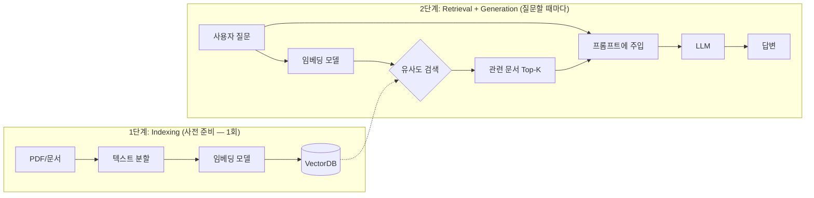

## 학습 목표

- RAG(검색 증강 생성)의 작동 원리를 설명할 수 있다
- VectorDB와 임베딩 모델의 역할을 이해한다

<a id="toc"></a>

## 진행 순서

1. [RAG란 무엇인가?](#part1) - RAG 개념과 기존 LLM 한계 보완
2. [작동 구조 요약](#part2) - Indexing + Retrieval 2단계 흐름
3. [VectorDB란?](#part3) - 대표 벡터 데이터베이스와 주요 기능
4. [임베딩(Embedding) 모델](#part4) - 텍스트 벡터 변환과 주요 모델 비교
5. [RAG 실습: Pinecone + LangChain](#part5) - 환경 준비, 문서 저장, 검색 코드
6. [정리](#part6) - 핵심 구조 및 도구 요약

> **사전 준비:** [1장 개발환경](/llm/langchain/install)에서 `.env` 파일 설정과 패키지 설치를 완료한 상태에서 진행합니다. Pinecone 실습을 위해 [Pinecone](https://www.pinecone.io/)에서 무료 가입 후 API 키를 발급받으세요.

---

# 검색 증강 생성(RAG) 개요 및 VectorDB, 임베딩 모델


<a id="part1"></a>

## 1️⃣ RAG란 무엇인가? [↑](#toc)
**RAG (Retrieval-Augmented Generation)** 은
LLM이 답을 만들 때 **외부 데이터베이스에서 최신 정보를 검색해 활용하는 기술**입니다.

### 오픈북 시험 비유

> RAG는 **오픈북 시험**과 같습니다.
> - **RAG 없는 LLM** = 클로즈드북 시험 — 학습할 때 외운 것만으로 답변 (오래된 정보, 착각 가능)
> - **RAG 있는 LLM** = 오픈북 시험 — 시험 중에 교과서를 펼쳐보고 답변 (정확한 근거 제시 가능)

---

### 왜 필요한가?

| 기존 LLM 한계 | RAG로 보완되는 점 |
|---------------|------------------|
| 오래된 학습 데이터 | 최신 문서 검색 후 활용 가능 |
| 보안 등의 문제로 기업 내부 데이터 부족 | 사내 문서/매뉴얼 연동 가능 |
| 환각(hallucination) 발생 | 실제 문서 근거로 답변 생성 |
| 근거 제시 불가 | 답변 출처 제공 가능 |

---

<a id="part2"></a>

## 2️⃣ 작동 구조 요약 [↑](#toc)

RAG는 **2단계**로 나뉩니다: 문서를 미리 저장하는 **Indexing**과, 질문할 때 검색하는 **Retrieval + Generation**.



| 단계 | 하는 일 | 언제 |
|------|---------|------|
| **Indexing** | 문서 → 청크 분할 → 임베딩 변환 → VectorDB 저장 | 문서가 바뀔 때 (1회 또는 주기적) |
| **Retrieval** | 질문 → 임베딩 → VectorDB에서 유사 문서 검색 | 사용자가 질문할 때마다 |
| **Generation** | 검색된 문서 + 질문 → 프롬프트 → LLM → 답변 | 사용자가 질문할 때마다 |

> **청크 분할(Chunking)이란?**
> 긴 문서를 통째로 임베딩하면 의미가 희석되어 검색 정확도가 떨어집니다. 그래서 문서를 적절한 크기의 조각(청크)으로 나누는 과정이 필요합니다. 예를 들어 100페이지 PDF를 500자씩 잘라서 각각 임베딩하면, "3장의 내용"을 정확히 검색할 수 있습니다. 이 실습에서는 짧은 문장을 사용하므로 분할이 필요 없지만, 실제 서비스에서는 반드시 고려해야 하는 단계입니다.

> 핵심: LLM이 "기억하는" 것이 아니라, **질문할 때마다 관련 문서를 찾아서 함께 전달**하는 것입니다.

---

<a id="part3"></a>

## 3️⃣ VectorDB란? [↑](#toc)
**비정형 데이터(문서, 이미지 등)** 를 벡터로 저장하고
**의미적 유사도**로 검색할 수 있는 데이터베이스입니다.

| 대표 VectorDB | 특징 | 비용 |
|----------------|------|------|
| **FAISS** | 오픈소스, 빠른 검색 속도, 로컬 실행 | 무료 |
| **Pinecone** | 클라우드 기반, 관리형 서비스, 무료 티어 | 무료~유료 |
| **Chroma** | 오픈소스, 순수 Python, 설치 간편 | 무료 |
| **Qdrant** | 실시간 업데이트, 필터링 강력 | 무료~유료 |

---

### 주요 기능
- **Similarity Search:** 의미적 유사도 기반 검색 ("서울 날씨" → "수도 기온" 매칭)
- **Metadata Filtering:** 출처/날짜 등 조건부 검색 (source="news"인 것만)
- **Hybrid Search:** 벡터 + 키워드 검색 결합

---

<a id="part4"></a>

## 4️⃣ 임베딩(Embedding) 모델 [↑](#toc)
**텍스트 → 숫자 벡터 변환**
→ 의미가 비슷한 문장은 벡터 공간상 가까움

| 문장 | 벡터 예시 |
|------|------------|
| "강아지가 귀엽다" | [0.12, 0.85, -0.33, ...] |
| "고양이가 사랑스럽다" | [0.11, 0.80, -0.31, ...] |
| "주식 시장이 하락했다" | [-0.45, 0.12, 0.67, ...] |

> "강아지"와 "고양이"는 벡터가 비슷 → 유사도 높음. "주식 시장"은 벡터가 다름 → 유사도 낮음.

### 주요 임베딩 모델

| 구분 | 예시 | 차원 | 특징 |
|------|------|------|------|
| **OpenAI 상용** | `text-embedding-3-small` | 1536 | 고성능, 다국어, API 기반 |
| **OpenAI 상용** | `text-embedding-3-large` | 3072 | 최고 품질, 비용 높음 |
| **Ollama 무료** | `nomic-embed-text` | 768 | 무료, 로컬 실행 |
| **오픈소스** | all-MiniLM-L6-v2 | 384 | 무료, 경량 |

> **"1536차원"이란?**
> 차원이란 문장의 의미를 표현하는 숫자의 개수입니다. `text-embedding-3-small`이 1536차원이라는 것은, 하나의 문장을 1536개의 숫자로 표현한다는 뜻입니다. 마치 사람을 설명할 때 "키, 몸무게, 나이, ..."처럼 여러 특성으로 나타내는 것과 같습니다. 차원이 높을수록 더 세밀하게 의미를 구분할 수 있지만, 저장 공간과 계산 비용도 늘어납니다.

> 💡 **이 과정에서 사용:** OpenAI `text-embedding-3-small` (Pinecone 실습) 또는 Ollama `nomic-embed-text` (로컬 실습, 16장에서 사용)
>
> ⚠️ **주의:** 임베딩 모델이 다르면 벡터 차원이 달라져 **같은 VectorDB 인덱스를 공유할 수 없습니다.** 모델을 변경하면 인덱스를 새로 만들어야 합니다.
>
> **💰 비용 참고 (2026년 기준)**
> - **OpenAI 임베딩:** `text-embedding-3-small`은 100만 토큰당 약 $0.02로 매우 저렴합니다
> - **Pinecone 무료 티어:** 인덱스 5개까지, 총 벡터 수 제한이 있으므로 실습 후 불필요한 인덱스는 삭제하는 것을 권장합니다
> - **비용 비교:** 임베딩 비용보다 LLM 호출 비용이 훨씬 높으므로, 임베딩 비용은 크게 걱정하지 않아도 됩니다

---

<a id="part5"></a>

## 5️⃣ RAG 실습: Pinecone + LangChain [↑](#toc)

### 환경 준비

```bash
uv add pinecone langchain-pinecone langchain-openai
```

`.env`
```
OPENAI_API_KEY=본인의_OpenAI_API키
PINECONE_API_KEY=본인의_Pinecone_API키
```

> 💡 `PINECONE_ENVIRONMENT`는 Serverless 인덱스에서는 불필요합니다. region은 코드에서 직접 지정합니다.

### 코드 1: Pinecone 초기화 + 인덱스 생성

```python
from dotenv import load_dotenv
from pinecone import Pinecone, ServerlessSpec
import os

# .env 파일에 저장된 API 키를 환경변수로 불러옴
# 코드에 직접 키를 쓰면 보안 위험이 있으므로, 별도 파일에서 읽어오는 것이 표준 관행
load_dotenv()

# Pinecone 서비스에 접속하기 위한 클라이언트 객체를 만듦
# 이후 인덱스 생성/조회 등 모든 Pinecone 작업은 이 pc 객체를 통해 수행됨
pc = Pinecone(api_key=os.getenv("PINECONE_API_KEY"))

# 벡터를 저장할 "인덱스(index)"의 이름과 설정을 정의
# 인덱스는 VectorDB 안에서 데이터를 담는 테이블 같은 개념
index_name = "example-index"

# 이미 같은 이름의 인덱스가 있으면 새로 만들지 않음
# dimension=1536은 OpenAI text-embedding-3-small이 출력하는 벡터 크기와 반드시 일치해야 함
# metric="cosine"은 두 벡터가 얼마나 비슷한지를 "방향의 유사도"로 측정하는 방식 (텍스트 검색에 적합)
if not pc.has_index(name=index_name):
    pc.create_index(
        name=index_name,
        dimension=1536,
        metric="cosine",
        spec=ServerlessSpec(cloud="aws", region="us-east-1")
    )

# 실제로 데이터를 넣고 검색할 인덱스 객체를 가져옴
# 현재 상태를 출력해서 연결이 정상인지 확인
index = pc.Index(index_name)
print(index.describe_index_stats())
```

**실행 결과 (예시):**
```
{'dimension': 1536, 'index_fullness': 0.0, 'namespaces': {}, 'total_vector_count': 0}
```

### 코드 2: 문서 저장

> 아래 코드는 **코드 1을 먼저 실행한 상태**에서 이어서 실행합니다.

```python
from langchain_core.documents import Document
from langchain_pinecone import PineconeVectorStore
from langchain_openai import OpenAIEmbeddings

# 검색 대상이 될 예시 문서들을 정의
# metadata(메타데이터)는 각 문서에 붙는 태그 정보로,
# 나중에 "뉴스 문서만 검색"처럼 범위를 좁힐 때 활용됨
docs = [
    # --- 기술 문서 (source: "docs") ---
    Document(page_content="LangChain은 LLM 기반 애플리케이션을 만드는 프레임워크입니다.", metadata={"source": "docs", "lang": "ko"}),
    Document(page_content="RAG는 검색 증강 생성으로, LLM의 환각을 줄여줍니다.", metadata={"source": "docs", "lang": "ko"}),
    Document(page_content="임베딩은 텍스트를 숫자 벡터로 변환하여 의미를 비교할 수 있게 합니다.", metadata={"source": "docs", "lang": "ko"}),
    Document(page_content="프롬프트 엔지니어링은 LLM에게 효과적으로 질문하는 기술입니다.", metadata={"source": "docs", "lang": "ko"}),
    Document(page_content="VectorDB는 벡터를 저장하고 유사도 기반으로 검색하는 데이터베이스입니다.", metadata={"source": "docs", "lang": "ko"}),

    # --- 뉴스 기사 (source: "news") ---
    Document(page_content="내일 서울 날씨는 맑고 최고 기온 25도입니다.", metadata={"source": "news", "lang": "ko"}),
    Document(page_content="주말에 비가 올 예정이니 우산을 챙기세요.", metadata={"source": "news", "lang": "ko"}),
    Document(page_content="이번 주 미세먼지 농도가 높아 마스크 착용이 권장됩니다.", metadata={"source": "news", "lang": "ko"}),
    Document(page_content="올해 여름은 평년보다 기온이 2도 높을 것으로 예상됩니다.", metadata={"source": "news", "lang": "ko"}),
    Document(page_content="오늘 부산은 흐리고 오후부터 소나기가 내리겠습니다.", metadata={"source": "news", "lang": "ko"}),
]

# 텍스트를 벡터(숫자 배열)로 변환하는 임베딩 모델을 준비
# 코드 1에서 인덱스를 1536차원으로 만들었으므로, 동일하게 1536차원을 출력하는 모델을 사용해야 함
embeddings = OpenAIEmbeddings(model="text-embedding-3-small")

# 위에서 만든 인덱스와 임베딩 모델을 연결해서 VectorStore 객체를 생성
# add_documents()를 호출하면 각 문서를 벡터로 변환한 뒤 Pinecone에 저장 (Indexing 단계 완료)
vector_store = PineconeVectorStore(index=index, embedding=embeddings)
vector_store.add_documents(docs)
print(f"✅ {len(docs)}개 문서가 Pinecone에 저장되었습니다.")
```

**실행 결과:**
```
✅ 10개 문서가 Pinecone에 저장되었습니다.
```

### 코드 3: 검색

> 아래 코드는 **코드 1~2를 먼저 실행한 상태**에서 이어서 실행합니다.

```python
# 질의 1: 기술 문서에서만 검색
# filter={"source": "docs"}를 지정하면 뉴스 문서는 후보에서 제외됨
# 이렇게 검색 범위를 좁히면 관련 없는 결과(예: 날씨 뉴스)가 섞이는 것을 방지할 수 있음
query1 = "LLM 앱을 만드는 도구가 뭐야?"
results1 = vector_store.similarity_search_with_score(query1, k=2, filter={"source": "docs"})
print("질의 1:", query1)
for doc, score in results1:
    # score(유사도 점수)는 0~1 사이 값으로, 1에 가까울수록 질문과 의미가 비슷한 문서
    print(f"  [유사도={score:.4f}] {doc.page_content}")

# 질의 2: 뉴스 문서에서만 날씨 정보를 검색
# 같은 질문이라도 filter를 바꾸면 다른 범위의 문서에서 검색됨
# k=2는 가장 유사한 문서 2개만 반환하도록 제한 (k를 키우면 더 많은 결과를 가져옴)
query2 = "내일 날씨 어때?"
results2 = vector_store.similarity_search_with_score(query2, k=2, filter={"source": "news"})
print("\n질의 2:", query2)
for doc, score in results2:
    print(f"  [유사도={score:.4f}] {doc.page_content}")
```

**실행 결과 (예시):**
```
질의 1: LLM 앱을 만드는 도구가 뭐야?
  [유사도=0.6234] LangChain은 LLM 기반 애플리케이션을 만드는 프레임워크입니다.
  [유사도=0.4521] RAG는 검색 증강 생성으로, LLM의 환각을 줄여줍니다.

질의 2: 내일 날씨 어때?
  [유사도=0.7812] 내일 서울 날씨는 맑고 최고 기온 25도입니다.
  [유사도=0.5234] 주말에 비가 올 예정이니 우산을 챙기세요.
```

> 핵심: "LLM 앱을 만드는 도구"라는 질문에 "LangChain"이 가장 유사하게 검색됩니다. 키워드가 정확히 일치하지 않아도 **의미적 유사도**로 찾아냅니다. 또한 `filter={"source": "news"}`로 뉴스 문서만 대상으로 검색할 수 있습니다. 10개의 문서 중 기술 문서 5개, 뉴스 5개가 있지만, 필터 덕분에 각각의 범위 안에서만 검색됩니다.

---

<a id="part6"></a>

## 6️⃣ 정리 [↑](#toc)

### RAG 핵심 구조

```
[Indexing]  문서 → 청크 분할 → 임베딩 → VectorDB 저장
[Retrieval] 질문 → 임베딩 → VectorDB 검색 → 관련 문서 반환
[Generation] 질문 + 관련 문서 → 프롬프트 → LLM → 답변
```

### 이 장에서 배운 것

| 개념 | 역할 | 비유 |
|------|------|------|
| **RAG** | LLM이 외부 문서를 검색해서 답변 | 오픈북 시험 |
| **VectorDB** | 문서를 벡터로 저장하고 유사도 검색 | 의미로 정리된 도서관 |
| **임베딩 모델** | 텍스트를 숫자 벡터로 변환 | 문장의 "좌표" 만들기 |
| **Similarity Search** | 의미가 비슷한 문서 찾기 | "비슷한 책 찾아주세요" |

### 다음 장 미리보기

| 장 | 내용 |
|---|---|
| 12장 | KNN/ANN/HNSW — 벡터 검색이 내부적으로 어떻게 동작하는지 |
| 13장 | 임베딩 모델과 인덱스 구축 — Pinecone에 실제 데이터 저장 |
| 14장 | 벡터 검색 — 다양한 검색 방법 (필터링, 하이브리드) |

---

### 🎯 실습 과제

- **기본**: 코드 1~3을 실행하고, 자신만의 문서 4개를 추가하여 검색해보세요
- **중급**: `filter` 파라미터를 변경하여 특정 source의 문서만 검색되는지 확인해보세요
- **심화**: `k=1`과 `k=5`로 검색 결과 수를 변경하며, 유사도 점수가 어떻게 달라지는지 관찰해보세요

> **실습 후 정리:** Pinecone 무료 티어는 인덱스 수가 제한되어 있습니다. 실습이 끝나면 아래 코드로 인덱스를 삭제하세요.
> ```python
> pc.delete_index("example-index")
> ```
