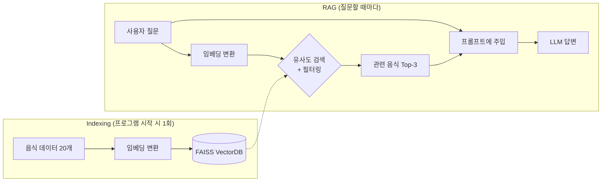

## 학습 목표

- 11~14장에서 배운 RAG 개념을 하나의 프로젝트에 통합하여 실습할 수 있다
- FAISS 기반 한국 음식 FAQ 챗봇을 만들며 임베딩, 벡터 검색, 필터링을 직접 체험한다

<a id="toc"></a>

## 진행 순서

1. [프로젝트 개요](#part1) - 무엇을 만드는가 + 11~14장 개념 매핑
2. [환경 설정](#part2) - 패키지 설치, .env
3. [지식 베이스 구축](#part3) - 인라인 음식 데이터 + FAISS 인덱싱
4. [RAG 유무 비교](#part4) - RAG 없이 vs RAG 있으면 답변이 어떻게 다른가
5. [메타데이터 필터링](#part5) - 채식/매운맛/카테고리별 검색
6. [터미널 챗봇](#part6) - while 루프로 전체 통합
7. [Streamlit 웹 앱](#part7) - 동일 기능을 웹 UI로
8. [실습 미션](#part8)

> **사전 준비:** [1장 개발환경](/llm/langchain/install)에서 `.env` 파일 설정과 패키지 설치를 완료한 상태에서 진행합니다.

---

# 한국 음식 FAQ 챗봇 — RAG 통합 실습

11~14장에서 배운 **임베딩, VectorDB, 벡터 검색, 메타데이터 필터링**을 하나의 챗봇에 통합합니다. 단계별로 독립 실행 가능한 파일로 구성합니다.

<a id="part1"></a>

## 1. 프로젝트 개요 [↑](#toc)

### 대화 시나리오

```
사용자: 비빔밥이 뭐야?
AI: 비빔밥은 밥 위에 나물, 고추장, 계란을 올린 한국 전통 음식입니다.
    다양한 채소를 사용하며 영양 균형이 좋습니다.
    [출처: 밥류, 채식 가능]

사용자: 채식으로 먹을 수 있는 매운 음식 추천해줘
AI: 떡볶이를 추천합니다! 가래떡을 고추장 양념에 볶은 길거리 음식으로...
    [필터: vegetarian=True, spicy=True]

사용자: 해산물 요리 뭐가 있어?
AI: 해물파전, 회덮밥 등이 있습니다...
    [필터: category=해산물]
```

### 11~14장 개념 매핑

| 대화 시점 | 체감하는 개념 | 해당 장 |
|---|---|---|
| 지식 베이스 구축 | 문서 → 임베딩 → VectorDB 저장 (Indexing) | 11장: RAG 개요, 13장: 임베딩 |
| "비빔밥이 뭐야?" | 질문 → 임베딩 → FAISS 유사도 검색 (Retrieval) | 12장: ANN/HNSW, 14장: 벡터 검색 |
| 유사도 점수 출력 | "비빔밥"과 "나물밥"이 높은 유사도 | 14장: similarity_search_with_score |
| 채식 필터링 | `filter={"vegetarian": True}` | 14장: 메타데이터 필터링 |
| 프롬프트 주입 → 답변 | 검색 결과 + 질문 → LLM → 답변 | 11장: RAG 파이프라인 |



---

<a id="part2"></a>

## 2. 환경 설정 [↑](#toc)

```bash
uv add langchain langchain-community langchain-openai faiss-cpu python-dotenv
```

`.env`
```
OPENAI_API_KEY=본인의_OpenAI_API키
```

> 💡 **Ollama 사용 시:** `uv add langchain-ollama`를 추가 설치하고, 코드에서 `ChatOpenAI` → `ChatOllama(model="gemma3:1b")`, `OpenAIEmbeddings` → `OllamaEmbeddings(model="nomic-embed-text")`로 교체합니다. 단, Ollama 임베딩은 768차원이므로 검색 결과가 약간 다를 수 있습니다.

### 프로젝트 파일 구조

이 실습은 단계별로 독립 실행 가능한 파일로 구성되어 있습니다. 각 파일을 VSCode에서 열고 `python 파일명.py`로 실행하세요.

| 파일 | 역할 | 실행 방법 |
|------|------|-----------|
| `food_data.py` | 공통 데이터와 함수 (다른 파일에서 import) | 직접 실행하지 않음 |
| `food_rag_step1.py` | 3장: 지식 베이스 구축 확인 | `python food_rag_step1.py` |
| `food_rag_step2.py` | 4장: RAG 유무 비교 | `python food_rag_step2.py` |
| `food_rag_step3.py` | 5장: 메타데이터 필터링 | `python food_rag_step3.py` |
| `food_rag.py` | 6장: 전체 통합 터미널 챗봇 | `python food_rag.py` |
| `food_app.py` | 7장: Streamlit 웹 앱 | `streamlit run food_app.py` |

> 💡 **왜 파일을 나누나요?** `.py` 파일은 `python 파일명.py`로 실행하면 처음부터 끝까지 한 번에 실행됩니다. 파일을 나누면 각 단계의 결과를 독립적으로 확인할 수 있고, 불필요한 API 호출 비용도 줄일 수 있습니다. `food_data.py`에 공통 데이터를 모아두면 여러 파일에서 `from food_data import ...`로 재사용할 수 있습니다.

---

<a id="part3"></a>

## 3. 지식 베이스 구축 [↑](#toc)

이 단계에서는 두 개의 파일을 만듭니다. `food_data.py`는 공통 데이터 모듈이고, `food_rag_step1.py`는 인덱싱이 잘 되었는지 확인하는 파일입니다.

### `food_data.py` — 공통 데이터 모듈

`food_data.py`
```python
# ============================================================
# food_data.py — 공통 데이터 모듈
# 다른 파일에서 from food_data import foods, build_vectorstore, format_docs 로 사용
# ============================================================

from langchain_core.documents import Document
from langchain_community.vectorstores import FAISS
from langchain_openai import OpenAIEmbeddings

# ============================================================
# [11장] 지식 베이스 — RAG의 "외부 데이터"
# 실제 서비스에서는 PDF, CSV, DB에서 불러오지만
# 이 실습에서는 코드에 직접 작성합니다.
# ============================================================

# Document는 "텍스트 한 조각"을 담는 상자입니다.
# page_content: AI가 읽을 실제 음식 설명 글
# metadata: 검색 시 조건으로 걸 수 있는 태그 정보
#   - category: 음식 종류 (밥류/분식/국물 등)
#   - vegetarian: 채식 가능 여부 (True/False)
#   - spicy: 매운 음식 여부 (True/False)
# 이 데이터가 나중에 "유사도 검색"의 대상이 됩니다.
foods = [
    # === 밥류 ===
    Document(
        page_content="비빔밥은 밥 위에 나물, 고추장, 계란을 올린 한국 전통 음식입니다. 다양한 채소를 사용하며 영양 균형이 좋습니다. 전주 비빔밥이 가장 유명합니다.",
        metadata={"category": "밥류", "vegetarian": True, "spicy": False}
    ),
    Document(
        page_content="김밥은 밥과 여러 재료를 김으로 말아 만든 음식입니다. 소풍이나 간식으로 인기가 많으며, 참치김밥, 치즈김밥 등 다양한 종류가 있습니다.",
        metadata={"category": "밥류", "vegetarian": False, "spicy": False}
    ),
    Document(
        page_content="회덮밥은 신선한 회(생선회)를 밥 위에 올리고 초고추장을 뿌려 먹는 음식입니다. 부산과 제주도에서 특히 유명합니다.",
        metadata={"category": "해산물", "vegetarian": False, "spicy": True}
    ),
    Document(
        page_content="볶음밥은 밥과 다양한 재료를 함께 볶은 음식입니다. 김치볶음밥, 새우볶음밥 등이 인기 메뉴입니다.",
        metadata={"category": "밥류", "vegetarian": False, "spicy": False}
    ),

    # === 분식 ===
    Document(
        page_content="떡볶이는 가래떡을 고추장 양념에 볶은 길거리 음식입니다. 매콤달콤한 맛이 특징이며, 어묵과 함께 먹습니다. 치즈떡볶이, 로제떡볶이 등 변형 메뉴도 많습니다.",
        metadata={"category": "분식", "vegetarian": True, "spicy": True}
    ),
    Document(
        page_content="순대는 돼지 소장에 당면, 채소, 선지 등을 넣어 만든 음식입니다. 떡볶이와 함께 분식집의 대표 메뉴입니다.",
        metadata={"category": "분식", "vegetarian": False, "spicy": False}
    ),
    Document(
        page_content="라면은 밀가루 면을 매운 국물에 끓인 한국식 인스턴트 음식입니다. 계란과 파를 넣어 끓이면 더 맛있습니다.",
        metadata={"category": "분식", "vegetarian": False, "spicy": True}
    ),

    # === 국물 ===
    Document(
        page_content="김치찌개는 잘 익은 김치를 돼지고기와 함께 끓인 매운 찌개입니다. 한국인의 소울푸드로 밥과 함께 먹습니다.",
        metadata={"category": "국물", "vegetarian": False, "spicy": True}
    ),
    Document(
        page_content="된장찌개는 된장을 풀어 두부, 호박, 감자 등을 넣고 끓인 구수한 찌개입니다. 한국의 가정식 대표 메뉴입니다.",
        metadata={"category": "국물", "vegetarian": True, "spicy": False}
    ),
    Document(
        page_content="삼계탕은 닭 한 마리에 인삼, 대추, 찹쌀을 넣고 푹 고아 만든 보양식입니다. 여름철 복날에 특히 많이 먹습니다.",
        metadata={"category": "국물", "vegetarian": False, "spicy": False}
    ),
    Document(
        page_content="순두부찌개는 부드러운 순두부를 매콤한 양념에 끓인 찌개입니다. 계란을 넣어 반숙으로 먹으면 맛있습니다.",
        metadata={"category": "국물", "vegetarian": True, "spicy": True}
    ),
    Document(
        page_content="떡국은 쌀로 만든 떡을 소고기 육수에 넣어 끓인 음식입니다. 설날에 먹는 전통 음식으로, 한 살 더 먹는다는 의미가 있습니다.",
        metadata={"category": "국물", "vegetarian": False, "spicy": False}
    ),

    # === 육류 ===
    Document(
        page_content="삼겹살은 돼지 뱃살을 구워 먹는 한국식 BBQ입니다. 쌈장과 상추, 마늘에 싸서 먹습니다. 소주와 함께 먹는 것이 한국 문화입니다.",
        metadata={"category": "육류", "vegetarian": False, "spicy": False}
    ),
    Document(
        page_content="불고기는 소고기를 간장 양념에 재워 구운 한국 전통 요리입니다. 달콤한 맛으로 외국인에게도 인기가 많습니다.",
        metadata={"category": "육류", "vegetarian": False, "spicy": False}
    ),
    Document(
        page_content="닭갈비는 닭고기를 고추장 양념에 볶은 매운 요리입니다. 춘천이 원조이며, 치즈를 추가하면 치즈닭갈비가 됩니다.",
        metadata={"category": "육류", "vegetarian": False, "spicy": True}
    ),
    Document(
        page_content="족발은 돼지 족을 간장과 향신료에 삶아 만든 음식입니다. 쫄깃한 식감이 특징이며, 야식으로 인기가 많습니다.",
        metadata={"category": "육류", "vegetarian": False, "spicy": False}
    ),

    # === 해산물 ===
    Document(
        page_content="해물파전은 밀가루 반죽에 오징어, 새우, 파 등을 넣어 부친 전입니다. 비 오는 날 막걸리와 함께 먹는 것이 한국 문화입니다.",
        metadata={"category": "해산물", "vegetarian": False, "spicy": False}
    ),
    Document(
        page_content="간장게장은 신선한 꽃게를 간장에 담가 숙성시킨 음식입니다. '밥도둑'이라는 별명이 있을 정도로 밥과 잘 어울립니다.",
        metadata={"category": "해산물", "vegetarian": False, "spicy": False}
    ),

    # === 간식/디저트 ===
    Document(
        page_content="호떡은 밀가루 반죽 안에 흑설탕, 땅콩, 계피를 넣고 납작하게 구운 겨울 간식입니다. 길거리에서 즐겨 먹습니다.",
        metadata={"category": "간식", "vegetarian": True, "spicy": False}
    ),
    Document(
        page_content="붕어빵은 붕어 모양의 틀에 팥 앙금을 넣고 구운 겨울 간식입니다. 슈크림 붕어빵도 인기가 많습니다.",
        metadata={"category": "간식", "vegetarian": True, "spicy": False}
    ),
]


def build_vectorstore():
    """음식 데이터를 임베딩하고 FAISS VectorDB를 생성합니다.
    이 함수를 호출할 때 OpenAI 임베딩 API가 호출됩니다."""
    # OpenAI의 임베딩 모델을 준비합니다.
    # 임베딩(Embedding): 텍스트를 1536개의 숫자(벡터)로 변환하는 작업
    # "비빔밥"과 "나물밥"은 비슷한 숫자로 변환되어 유사도 계산이 가능해집니다.
    embeddings = OpenAIEmbeddings(model="text-embedding-3-small")
    # 20개의 음식 Document를 임베딩으로 변환하고 FAISS에 저장합니다.
    # FAISS(Facebook AI Similarity Search): 벡터를 고속으로 검색하는 라이브러리
    # 이 한 줄이 "Indexing 단계" 전체를 수행합니다 — 변환 + 저장이 동시에 이루어집니다.
    vectorstore = FAISS.from_documents(foods, embeddings)
    print(f"✅ FAISS 인덱싱 완료 ({len(foods)}개 문서, 1536차원 벡터)")
    return vectorstore


def format_docs(docs):
    """검색된 Document 목록을 하나의 문자열로 합칩니다.
    예: "[밥류] 비빔밥은 ...\n\n[해산물] 해물파전은 ..."
    이 문자열이 프롬프트의 {context} 자리에 들어갑니다."""
    return "\n\n".join(
        f"[{doc.metadata['category']}] {doc.page_content}"
        for doc in docs
    )
```

### `food_rag_step1.py` — 지식 베이스 구축 확인

`food_rag_step1.py` / `python food_rag_step1.py`
```python
# ============================================================
# food_rag_step1.py — 지식 베이스 구축 확인
# 실행: python food_rag_step1.py
# ============================================================

from dotenv import load_dotenv
load_dotenv()

from food_data import foods, build_vectorstore

print(f"📚 지식 베이스: {len(foods)}개 음식 데이터 준비 완료")

# FAISS VectorDB 생성 (임베딩 API 호출)
# [13장] 임베딩 + [12장] FAISS 인덱싱 (기본 Flat 인덱스 사용, 12장에서 배운 HNSW는 별도 지정 시 사용)
vectorstore = build_vectorstore()

# retriever: "질문을 받으면 관련 문서를 꺼내주는 검색기"
# k=3: 가장 유사한 문서 3개를 반환합니다.
retriever = vectorstore.as_retriever(search_kwargs={"k": 3})

# 간단한 검색 테스트 — 인덱싱이 잘 되었는지 확인
results = vectorstore.similarity_search("비빔밥", k=3)
print("\n🔍 '비빔밥' 검색 테스트:")
for doc in results:
    print(f"  ✅ {doc.page_content[:40]}... ({doc.metadata['category']})")
```

**실행 결과:**
```
📚 지식 베이스: 20개 음식 데이터 준비 완료
✅ FAISS 인덱싱 완료 (20개 문서, 1536차원 벡터)

🔍 '비빔밥' 검색 테스트:
  ✅ 비빔밥은 밥 위에 나물, 고추장, 계란을 올린... (밥류)
  ✅ 볶음밥은 밥과 다양한 재료를 함께 볶은 음식... (밥류)
  ✅ 된장찌개는 된장을 풀어 두부, 호박, 감자 등... (국물)
```

> 20개 음식 설명이 임베딩 모델을 거쳐 **숫자 벡터로 변환**되고, FAISS VectorDB에 저장됩니다. 이것이 11장에서 배운 **Indexing 단계**입니다.

---

<a id="part4"></a>

## 4. RAG 유무 비교 [↑](#toc)

RAG가 왜 필요한지, **같은 질문에 대한 답변이 어떻게 달라지는지** 비교합니다. `food_rag_step2.py`를 독립 파일로 실행합니다.

`food_rag_step2.py` / `python food_rag_step2.py`
```python
# ============================================================
# food_rag_step2.py — RAG 유무 비교
# 실행: python food_rag_step2.py
# ============================================================

from dotenv import load_dotenv
load_dotenv()

from food_data import foods, build_vectorstore, format_docs
from langchain_openai import ChatOpenAI
from langchain_core.prompts import ChatPromptTemplate
from langchain_core.output_parsers import StrOutputParser
from langchain_core.runnables import RunnablePassthrough

# ============================================================
# [11장] RAG 유무 비교 — "이래서 RAG가 필요하다"
# ============================================================

# 지식 베이스 구축 (step1과 동일하지만, 이 파일을 독립 실행할 수 있도록 포함)
vectorstore = build_vectorstore()
# retriever: "질문을 받으면 관련 문서를 꺼내주는 검색기"
# k=3: 가장 유사한 문서 3개를 반환합니다.
retriever = vectorstore.as_retriever(search_kwargs={"k": 3})

# temperature=0: AI 답변의 "창의성"을 0으로 설정 → 같은 질문에 항상 같은 답변
# temperature가 높을수록 매번 다른 표현을 사용합니다.
llm = ChatOpenAI(model="gpt-4.1-mini", temperature=0)

question = "한국에서 비 오는 날 먹는 음식이 뭐야?"

# ❌ RAG 없이 — LLM의 일반 지식으로만 답변
# LLM은 학습 데이터로 배운 일반 지식을 활용합니다.
# 우리가 만든 지식 베이스(foods)를 전혀 참고하지 않습니다.
print("=" * 50)
print("❌ RAG 없이 (LLM 일반 지식)")
print("=" * 50)
response_no_rag = llm.invoke(question)
print(response_no_rag.content)

# ✅ RAG 있으면 — 우리 지식 베이스에서 검색 후 답변
print("\n" + "=" * 50)
print("✅ RAG 있으면 (지식 베이스 검색)")
print("=" * 50)

# similarity_search_with_score: 질문과 가장 유사한 문서 + 유사도 점수를 함께 반환
# 점수가 높을수록 질문과 더 관련 있는 문서입니다.
search_results = vectorstore.similarity_search_with_score(question, k=3)
print("\n📎 검색된 문서:")
for doc, score in search_results:
    print(f"  [{score:.4f}] {doc.page_content[:40]}... ({doc.metadata['category']})")

# RAG 체인 구성
# 프롬프트 템플릿: AI에게 역할과 행동 방식을 지정하는 "지시서"
# {context}: 검색된 음식 문서들이 여기에 채워집니다.
# {question}: 사용자의 질문이 여기에 채워집니다.
rag_prompt = ChatPromptTemplate.from_messages([
    ("system",
     "당신은 한국 음식 전문가입니다.\n"
     "아래 제공된 음식 정보만을 바탕으로 답변하세요.\n"
     "정보에 없는 내용은 '해당 정보가 없습니다'라고 답변하세요.\n"
     "답변은 한국어로 친절하게 작성하세요.\n\n"
     "음식 정보:\n{context}"),
    ("human", "{question}"),
])

# RAG 체인 파이프라인 — 4단계가 순서대로 실행됩니다.
# 1) retriever | format_docs : 질문으로 관련 문서를 검색해 문자열로 변환
# 2) RunnablePassthrough()   : 질문을 그대로 통과시킵니다.
# 3) rag_prompt              : context + question을 프롬프트에 채웁니다.
# 4) llm | StrOutputParser() : LLM이 답변하고, 문자열로 변환합니다.
rag_chain = (
    {"context": retriever | format_docs, "question": RunnablePassthrough()}
    | rag_prompt
    | llm
    | StrOutputParser()
)

response_rag = rag_chain.invoke(question)
print(f"\n🤖 답변:\n{response_rag}")
```

**실행 결과 (예시):**
```
==================================================
❌ RAG 없이 (LLM 일반 지식)
==================================================
한국에서 비 오는 날에는 전(파전, 부침개)과 막걸리를 즐겨 먹습니다.
전의 기름 튀기는 소리가 빗소리와 비슷하여...

==================================================
✅ RAG 있으면 (지식 베이스 검색)
==================================================

📎 검색된 문서:
  [0.5823] 해물파전은 밀가루 반죽에 오징어, 새우, 파 등을... (해산물)
  [0.4156] 떡볶이는 가래떡을 고추장 양념에 볶은 길거리 음식... (분식)
  [0.3892] 김치찌개는 잘 익은 김치를 돼지고기와 함께 끓인... (국물)

🤖 답변:
비 오는 날 한국에서는 해물파전을 많이 먹습니다!
해물파전은 밀가루 반죽에 오징어, 새우, 파 등을 넣어 부친 전으로,
비 오는 날 막걸리와 함께 먹는 것이 한국 문화입니다.
```

> 핵심: RAG 없이는 LLM의 일반 지식으로 답변하지만, RAG 있으면 **우리 지식 베이스에서 검색된 문서(해물파전)를 근거로** 답변합니다. 유사도 점수도 함께 출력되어 "왜 이 문서가 검색되었는지" 확인할 수 있습니다.

---

<a id="part5"></a>

## 5. 메타데이터 필터링 [↑](#toc)

14장에서 배운 **메타데이터 필터링**을 활용하여 조건부 검색을 합니다. `food_rag_step3.py`를 독립 파일로 실행합니다.

`food_rag_step3.py` / `python food_rag_step3.py`
```python
# ============================================================
# food_rag_step3.py — 메타데이터 필터링
# 실행: python food_rag_step3.py
# ============================================================

from dotenv import load_dotenv
load_dotenv()

from food_data import build_vectorstore

# ============================================================
# [14장] 메타데이터 필터링 — 조건부 검색
# ============================================================

# filter 매개변수(parameter): 메타데이터 조건을 지정하면 해당 조건에 맞는 문서만 검색합니다.
# 일반 유사도 검색 + 조건 필터 = 원하는 범위 안에서만 찾기
# 예: 도서관에서 "요리책" 코너 안에서만 비슷한 책을 찾는 것과 같습니다.
vectorstore = build_vectorstore()

print("\n" + "=" * 50)
print("🥬 채식 가능 음식만 검색")
print("=" * 50)
# vegetarian=True인 Document들 중에서만 유사도 검색을 수행합니다.
veg_results = vectorstore.similarity_search(
    "맛있는 한국 음식 추천", k=3, filter={"vegetarian": True}
)
for doc in veg_results:
    print(f"  ✅ {doc.page_content[:30]}... ({doc.metadata['category']})")

print("\n" + "=" * 50)
print("🌶️ 매운 음식만 검색")
print("=" * 50)
# spicy=True인 Document들 중에서만 유사도 검색을 수행합니다.
spicy_results = vectorstore.similarity_search(
    "매운 한국 음식", k=3, filter={"spicy": True}
)
for doc in spicy_results:
    print(f"  🌶️ {doc.page_content[:30]}... ({doc.metadata['category']})")

print("\n" + "=" * 50)
print("🐟 해산물 카테고리만 검색")
print("=" * 50)
# category가 "해산물"인 Document들 중에서만 유사도 검색을 수행합니다.
sea_results = vectorstore.similarity_search(
    "해산물 요리", k=3, filter={"category": "해산물"}
)
for doc in sea_results:
    print(f"  🐟 {doc.page_content[:30]}... ({doc.metadata['category']})")
```

**실행 결과 (예시):**
```
==================================================
🥬 채식 가능 음식만 검색
==================================================
  ✅ 비빔밥은 밥 위에 나물, 고추장, 계란을 올린... (밥류)
  ✅ 된장찌개는 된장을 풀어 두부, 호박, 감자 등... (국물)
  ✅ 떡볶이는 가래떡을 고추장 양념에 볶은 길거... (분식)

==================================================
🌶️ 매운 음식만 검색
==================================================
  🌶️ 떡볶이는 가래떡을 고추장 양념에 볶은 길거... (분식)
  🌶️ 김치찌개는 잘 익은 김치를 돼지고기와 함께... (국물)
  🌶️ 닭갈비는 닭고기를 고추장 양념에 볶은 매운... (육류)

==================================================
🐟 해산물 카테고리만 검색
==================================================
  🐟 해물파전은 밀가루 반죽에 오징어, 새우, 파... (해산물)
  🐟 간장게장은 신선한 꽃게를 간장에 담가 숙성... (해산물)
  🐟 회덮밥은 신선한 회(생선회)를 밥 위에 올리... (해산물)
```

> 핵심: 같은 "맛있는 한국 음식 추천"이라는 질문이지만, `filter`에 따라 **채식만, 매운 것만, 해산물만** 검색됩니다. 이것이 14장에서 배운 메타데이터 필터링입니다.

---

<a id="part6"></a>

## 6. 터미널 챗봇 [↑](#toc)

전체 기능을 통합한 대화형 루프입니다. step1~3의 핵심 요소를 모두 포함하는 최종 통합본입니다.

`food_rag.py` / `python food_rag.py`
```python
# ============================================================
# food_rag.py — 한국 음식 FAQ 챗봇 (최종 통합본)
# 실행: python food_rag.py
# ============================================================

from dotenv import load_dotenv
load_dotenv()

import time
from food_data import foods, build_vectorstore, format_docs
from langchain_openai import ChatOpenAI
from langchain_core.prompts import ChatPromptTemplate
from langchain_core.output_parsers import StrOutputParser
from langchain_core.runnables import RunnablePassthrough

# ============================================================
# 지식 베이스 구축
# ============================================================

print(f"📚 지식 베이스: {len(foods)}개 음식 데이터 준비 완료")

# FAISS VectorDB 생성 (임베딩 API 호출)
vectorstore = build_vectorstore()

# retriever: "질문을 받으면 관련 문서를 꺼내주는 검색기"
# k=3: 가장 유사한 문서 3개를 반환합니다.
retriever = vectorstore.as_retriever(search_kwargs={"k": 3})

# temperature=0: AI 답변의 "창의성"을 0으로 설정 → 같은 질문에 항상 같은 답변
llm = ChatOpenAI(model="gpt-4.1-mini", temperature=0)

# 프롬프트 템플릿: AI에게 역할과 행동 방식을 지정하는 "지시서"
# {context}: 검색된 음식 문서들이 여기에 채워집니다.
# {question}: 사용자의 질문이 여기에 채워집니다.
rag_prompt = ChatPromptTemplate.from_messages([
    ("system",
     "당신은 한국 음식 전문가입니다.\n"
     "아래 제공된 음식 정보만을 바탕으로 답변하세요.\n"
     "정보에 없는 내용은 '해당 정보가 없습니다'라고 답변하세요.\n"
     "답변은 한국어로 친절하게 작성하세요.\n\n"
     "음식 정보:\n{context}"),
    ("human", "{question}"),
])

# ============================================================
# 대화형 챗봇 — 전체 통합
# ============================================================

def run_food_chatbot():
    print("\n" + "=" * 50)
    print("  🍚 한국 음식 FAQ 챗봇 (RAG)")
    print("  필터 명령어: /채식  /매운맛  /해산물  /육류  /국물  /분식  /전체")
    print("  종료: q")
    print("=" * 50)

    # current_filter: 현재 적용 중인 메타데이터 필터를 저장합니다.
    # 빈 딕셔너리({})이면 필터 없음 = 모든 음식 대상으로 검색합니다.
    current_filter = {}

    # while True: 사용자가 "q"를 입력하기 전까지 계속 대화를 받습니다.
    # break 명령이 루프를 종료합니다.
    while True:
        user_input = input("\n질문: ").strip()

        # strip(): 앞뒤 공백 제거 — 사용자가 실수로 스페이스를 누른 경우 처리
        if not user_input:
            continue  # 아무것도 입력하지 않으면 다시 입력 대기

        if user_input.lower() in ["q", "quit", "종료"]:
            print("맛있는 하루 보내세요! 🍴")
            break  # 루프 종료 → 프로그램 종료

        # 필터 명령어 처리
        # /채식, /매운맛 등 슬래시(/)로 시작하는 명령어를 입력하면
        # 검색 필터를 변경합니다. 다음 질문부터 새 필터가 적용됩니다.
        filter_map = {
            "/채식": {"vegetarian": True},
            "/매운맛": {"spicy": True},
            "/해산물": {"category": "해산물"},
            "/육류": {"category": "육류"},
            "/국물": {"category": "국물"},
            "/분식": {"category": "분식"},
            "/전체": {},  # 빈 딕셔너리 = 필터 해제
        }

        if user_input in filter_map:
            current_filter = filter_map[user_input]
            label = user_input.replace("/", "") if user_input != "/전체" else "전체 (필터 없음)"
            print(f"🔍 필터 변경: {label}")
            continue  # 필터 변경 후 바로 다음 입력 대기 (LLM 호출 안 함)

        # 필터 적용 검색
        # current_filter가 있으면 해당 조건을 search_kwargs에 추가하고,
        # 없으면 기본 retriever(필터 없음)를 그대로 사용합니다.
        if current_filter:
            filtered_retriever = vectorstore.as_retriever(
                search_kwargs={"k": 3, "filter": current_filter}
            )
        else:
            filtered_retriever = retriever

        # RAG 체인 (필터 적용)
        # 매 질문마다 현재 필터가 반영된 retriever로 체인을 새로 구성합니다.
        chain = (
            {"context": filtered_retriever | format_docs, "question": RunnablePassthrough()}
            | rag_prompt
            | llm
            | StrOutputParser()
        )

        # time.time(): 현재 시각(초 단위)을 기록해 응답 소요 시간을 계산합니다.
        start = time.time()
        response = chain.invoke(user_input)
        elapsed = time.time() - start

        print(f"\n🤖 {response}")
        filter_label = str(current_filter) if current_filter else "없음"
        print(f"   ⏱️ {elapsed:.2f}초 | 필터: {filter_label}")


# __name__ == "__main__": 이 파일을 직접 실행할 때만 챗봇을 시작합니다.
# 다른 파일에서 import할 때는 자동 실행되지 않도록 막는 파이썬 관용구입니다.
if __name__ == "__main__":
    run_food_chatbot()
```

```bash
python food_rag.py
```

**실행 예시:**
```
==================================================
  🍚 한국 음식 FAQ 챗봇 (RAG)
  필터 명령어: /채식  /매운맛  /해산물  /육류  /국물  /분식  /전체
  종료: q
==================================================

질문: 겨울에 먹기 좋은 간식이 뭐야?

🤖 겨울 간식으로는 호떡과 붕어빵을 추천합니다!
   호떡은 흑설탕, 땅콩, 계피를 넣고 납작하게 구운 따뜻한 간식이고,
   붕어빵은 팥 앙금이 들어간 붕어 모양 빵입니다.
   둘 다 길거리에서 즐겨 먹는 겨울 대표 간식입니다.
   ⏱️ 1.52초 | 필터: 없음

질문: /채식

🔍 필터 변경: 채식

질문: 뜨끈한 국물 음식 추천해줘

🤖 채식으로 즐길 수 있는 국물 음식으로 된장찌개를 추천합니다!
   된장을 풀어 두부, 호박, 감자 등을 넣고 끓인 구수한 찌개로,
   한국의 가정식 대표 메뉴입니다.
   ⏱️ 1.38초 | 필터: {'vegetarian': True}

질문: /전체

🔍 필터 변경: 전체 (필터 없음)

질문: q
맛있는 하루 보내세요! 🍴
```

---

<a id="part7"></a>

## 7. Streamlit 웹 앱 [↑](#toc)

6장의 터미널 챗봇과 동일한 기능을 웹 UI로 구현합니다. 사이드바에서 필터를 선택하고, 메인 영역에서 채팅합니다. `food_data.py`에서 공통 데이터를 import하므로 데이터 중복이 없습니다.

`food_app.py` / `streamlit run food_app.py`
```python
import streamlit as st
import time

from dotenv import load_dotenv
load_dotenv()

# food_data.py에서 공통 데이터와 함수를 import합니다.
# 데이터를 한 곳에서 관리하므로, 수정 시 food_data.py만 변경하면 됩니다.
from food_data import foods, build_vectorstore, format_docs
from langchain_openai import ChatOpenAI
from langchain_core.prompts import ChatPromptTemplate
from langchain_core.output_parsers import StrOutputParser
from langchain_core.runnables import RunnablePassthrough

# ===== FAISS 인덱싱 =====
# @st.cache_resource: Streamlit의 캐싱 데코레이터(decorator)입니다.
# Streamlit은 사용자가 버튼을 누르거나 입력할 때마다 파이썬 코드를 처음부터 다시 실행합니다.
# cache_resource를 붙이면 vectorstore를 딱 한 번만 만들고 재사용합니다.
# 없으면 질문할 때마다 임베딩 API를 20번씩 호출해 느려지고 비용이 발생합니다.
@st.cache_resource
def get_vectorstore():
    return build_vectorstore()

vectorstore = get_vectorstore()
llm = ChatOpenAI(model="gpt-4.1-mini", temperature=0)

rag_prompt = ChatPromptTemplate.from_messages([
    ("system",
     "당신은 한국 음식 전문가입니다.\n"
     "아래 제공된 음식 정보만을 바탕으로 답변하세요.\n"
     "정보에 없는 내용은 '해당 정보가 없습니다'라고 답변하세요.\n"
     "답변은 한국어로 친절하게 작성하세요.\n\n"
     "음식 정보:\n{context}"),
    ("human", "{question}"),
])

# ===== Streamlit UI =====
# set_page_config: 브라우저 탭에 표시될 제목과 아이콘을 설정합니다.
st.set_page_config(page_title="한국 음식 FAQ", page_icon="🍚")
st.title("🍚 한국 음식 FAQ 챗봇")
st.caption("RAG 통합 실습 | FAISS + 임베딩 + 메타데이터 필터링")

# st.session_state: Streamlit의 "전역 메모리" 역할을 합니다.
# 사용자가 질문할 때마다 페이지가 다시 렌더링되어도 대화 기록이 사라지지 않습니다.
# messages 리스트에 {"role": "user"/"assistant", "content": "..."} 형태로 저장합니다.
if "messages" not in st.session_state:
    st.session_state.messages = []

# ===== 사이드바: 필터 선택 =====
# with st.sidebar: 화면 왼쪽의 사이드바 영역에 위젯을 배치합니다.
with st.sidebar:
    st.header("🔍 검색 필터")

    # st.selectbox: 드롭다운 선택 위젯 — 사용자가 카테고리를 고릅니다.
    category = st.selectbox(
        "카테고리",
        ["전체", "밥류", "분식", "국물", "육류", "해산물", "간식"]
    )
    # st.checkbox: 체크박스 위젯 — True/False 값을 반환합니다.
    vegetarian = st.checkbox("🥬 채식 가능만")
    spicy = st.checkbox("🌶️ 매운 음식만")

    # 사이드바에서 선택한 값으로 FAISS 검색에 쓸 필터 딕셔너리를 구성합니다.
    # "전체"를 선택하거나 체크하지 않으면 해당 조건은 필터에 포함되지 않습니다.
    search_filter = {}
    if category != "전체":
        search_filter["category"] = category
    if vegetarian:
        search_filter["vegetarian"] = True
    if spicy:
        search_filter["spicy"] = True

    if search_filter:
        st.info(f"현재 필터: {search_filter}")
    else:
        st.info("필터: 전체 (제한 없음)")

    st.divider()

    # 대화 초기화 버튼: messages 리스트를 비우고 화면을 다시 그립니다.
    if st.button("🗑️ 대화 초기화", use_container_width=True):
        st.session_state.messages = []
        st.rerun()  # 페이지를 즉시 다시 렌더링합니다.

    st.divider()
    st.caption(f"📚 지식 베이스: {len(foods)}개 음식")

# ===== 대화 히스토리 표시 =====
# 저장된 메시지를 순서대로 화면에 그립니다.
# st.chat_message("user"/"assistant"): 말풍선 모양으로 표시합니다.
for msg in st.session_state.messages:
    with st.chat_message(msg["role"]):
        st.markdown(msg["content"])

# ===== 채팅 입력 =====
# st.chat_input: 화면 하단에 채팅 입력창을 고정 배치합니다.
# := (바다코끼리 연산자): 입력값을 user_input에 저장하면서 동시에 비어있는지 확인합니다.
if user_input := st.chat_input("한국 음식에 대해 물어보세요!"):
    # 사용자 메시지를 기록하고 화면에 표시합니다.
    st.session_state.messages.append({"role": "user", "content": user_input})
    with st.chat_message("user"):
        st.markdown(user_input)

    with st.chat_message("assistant"):
        start = time.time()

        # 사이드바에서 설정한 search_filter를 retriever에 주입합니다.
        # 필터가 없으면 search_kwargs는 {"k": 3}만 가집니다.
        search_kwargs = {"k": 3}
        if search_filter:
            search_kwargs["filter"] = search_filter
        filtered_retriever = vectorstore.as_retriever(search_kwargs=search_kwargs)

        # RAG 체인 — 터미널 챗봇과 동일한 구조입니다.
        chain = (
            {"context": filtered_retriever | format_docs, "question": RunnablePassthrough()}
            | rag_prompt | llm | StrOutputParser()
        )

        try:
            response = chain.invoke(user_input)
            elapsed = time.time() - start

            # 답변에 활용된 문서를 함께 보여줍니다 — "왜 이 답이 나왔는지" 투명하게 공개
            search_results = vectorstore.similarity_search_with_score(
                user_input, k=3,
                filter=search_filter if search_filter else None
            )

            st.markdown(response)
            st.caption(f"⏱️ {elapsed:.2f}초")

            # st.expander: 클릭하면 펼쳐지는 접이식 영역 — 상세 정보를 숨겨둡니다.
            with st.expander("📎 검색된 문서 (유사도 점수)"):
                for doc, score in search_results:
                    st.markdown(
                        f"- **[{score:.4f}]** {doc.page_content[:50]}... "
                        f"(`{doc.metadata['category']}`, "
                        f"{'채식' if doc.metadata['vegetarian'] else '비채식'}, "
                        f"{'매운맛' if doc.metadata['spicy'] else '순한맛'})"
                    )

            # 다음 렌더링 때도 AI 답변이 보이도록 session_state에 저장합니다.
            full_response = f"{response}\n\n`⏱️ {elapsed:.2f}초`"
            st.session_state.messages.append({"role": "assistant", "content": full_response})

        except Exception as e:
            # API 오류 등 예외 발생 시 에러 메시지를 붉은 박스로 표시합니다.
            st.error(f"응답 생성 실패: {e}")
```

```bash
streamlit run food_app.py --server.port 8501
```

**화면 구성:**

```
┌─────────────────┬───────────────────────────────────────┐
│  사이드바        │  채팅 영역                              │
│                 │                                        │
│ 카테고리: [전체▼]│  사용자: 비 오는 날 뭐 먹어?            │
│ ☑ 채식 가능만   │                                        │
│ ☐ 매운 음식만   │  AI: 해물파전을 추천합니다! 밀가루 반죽에  │
│                 │      오징어, 새우, 파를 넣어 부친 전으로   │
│ 현재 필터:      │      막걸리와 함께 먹는 것이 한국 문화...  │
│ {vegetarian:    │      ⏱️ 1.35초                          │
│  True}          │                                        │
│                 │  📎 검색된 문서 (유사도 점수)             │
│ [🗑️ 대화 초기화]│  ▶ [0.5823] 해물파전은 밀가루...         │
│                 │  ▶ [0.4156] 된장찌개는 된장을 풀어...     │
│ 📚 20개 음식    │                                        │
│                 │  [한국 음식에 대해 물어보세요!]            │
└─────────────────┴───────────────────────────────────────┘
```

> 💡 사이드바에서 **카테고리/채식/매운맛 필터를 변경하면** 다음 질문부터 해당 조건에 맞는 음식만 검색됩니다. 각 답변 하단의 `📎 검색된 문서`를 펼치면 유사도 점수와 메타데이터를 확인할 수 있습니다.

---

<a id="part8"></a>

## 8. 실습 미션 [↑](#toc)

### 기본

- 터미널 버전(`food_rag.py`)을 실행하고, 5가지 이상의 질문으로 챗봇과 대화해보세요
- `/채식`, `/매운맛`, `/해산물` 필터를 바꿔가며 같은 질문에 다른 결과가 나오는지 확인하세요
- RAG 유무 비교(`food_rag_step2.py`) 결과에서 답변이 어떻게 다른지 설명해보세요

### 중급

- Streamlit 버전(`food_app.py`)을 실행하고, 사이드바 필터를 조합해보세요
- `food_data.py`의 `foods` 리스트에 자신이 좋아하는 음식 3개를 추가하고, 검색 결과에 나오는지 확인해보세요
- `k=1`과 `k=5`로 검색 결과 수를 변경하며 답변 품질이 어떻게 달라지는지 비교해보세요

### 심화

- `OpenAIEmbeddings` → `OllamaEmbeddings(model="nomic-embed-text")`로 교체하고, 검색 결과를 비교해보세요
- Streamlit 앱에 `st.download_button`으로 검색 결과를 CSV로 다운로드하는 기능을 추가해보세요

---

## 전체 코드 요약

| 개념 (장) | 코드 위치 | 핵심 API |
|---|---|---|
| 11장: RAG 파이프라인 | 지식 베이스 + RAG 체인 | `retriever \| format_docs`, `RunnablePassthrough` |
| 12장: ANN/HNSW | FAISS 인덱싱 | `FAISS.from_documents()` (기본 Flat 인덱스) |
| 13장: 임베딩 | 인덱싱 + 검색 | `OpenAIEmbeddings(model="text-embedding-3-small")` |
| 14장: 벡터 검색 | 유사도 검색 + 필터링 | `similarity_search_with_score`, `filter={"category": "해산물"}` |

### 다음 단계

| 이 실습 | 다음 프로젝트 |
|---|---|
| 인라인 텍스트 20개 | 15장: CSV 데이터 + Pinecone (클라우드) |
| FAISS (로컬) | 15장: Pinecone (클라우드) |
| 모듈 분리 | 16장: PDF 로딩 + Streamlit 웹 앱 |
