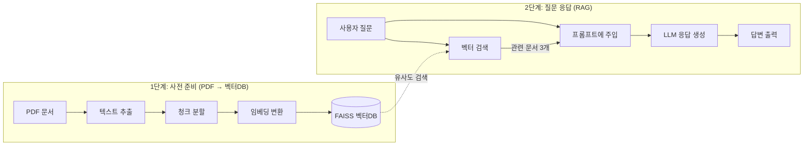

## 학습 목표

- FAISS 기반 PDF RAG 챗봇을 구현할 수 있다
- Ollama(로컬 무료) 또는 OpenAI(클라우드) 중 선택하여 실행할 수 있다
- Streamlit으로 대화형 인터페이스를 구축할 수 있다

<a id="toc"></a>

## 진행 순서

1. [RAG 파이프라인 이해](#part1) - 전체 흐름 파악
2. [환경설정](#part2) - 패키지 설치, LLM 제공자 선택, PDF 준비
3. [핵심 RAG 먼저 체험하기](#part3) - Streamlit 없이 터미널에서 40줄로 동작 확인
4. [Streamlit 챗봇 구현](#part4) - 웹 UI 통합
5. [실행](#part5) - 챗봇 서비스 실행
6. [FAISS 데이터 확인](#part6) - 벡터 인덱스 내용 확인 도구
7. [실습 미션](#part7)


---

## 주택 청약 FAQ 챗봇


<a id="part1"></a>

### 1. RAG 파이프라인 이해 [↑](#toc)

이 챗봇은 10~13장에서 배운 RAG 개념을 실제 서비스로 구현한 것입니다. 전체 흐름은 다음과 같습니다:



| 단계 | 코드의 역할 | 10~13장 대응 |
|------|------------|-------------|
| PDF → 텍스트 | `PyMuPDFLoader` | 10장: 문서 로드 |
| 청크 분할 | `RecursiveCharacterTextSplitter` | 10장: 텍스트 분할 |
| 임베딩 변환 | `OllamaEmbeddings` 또는 `OpenAIEmbeddings` | 12장: 임베딩 모델 |
| 벡터DB 저장 | `FAISS.from_documents()` | 12장: 인덱스 구축 |
| 벡터 검색 | `retriever.invoke()` | 13장: 벡터 검색 |
| LLM 응답 | LCEL 체인 (`retriever \| prompt \| llm`) | 3장: LCEL |

> **14번(AI 소믈리에)과의 차이:** 14번은 클라우드 벡터DB(Pinecone) + OpenAI를 사용했습니다. 15번은 **로컬 벡터DB(FAISS) + Ollama/OpenAI 선택형**으로, 외부 서비스 없이도 실행할 수 있는 구성입니다.

<a id="part2"></a>

### 2. 환경설정 [↑](#toc)

#### 패키지 설치

`requirements.txt`
```
streamlit>=1.30.0
langchain>=1.0.0
langchain-core>=0.3.0
langchain-text-splitters>=0.3.0
langchain-community>=0.3.0
langchain-ollama>=0.2.0
langchain-openai>=0.2.0
faiss-cpu>=1.8.0
pymupdf>=1.24.0
python-dotenv
```

```bash
pip install -r requirements.txt
```

#### 제공자 선택

Ollama(무료, 로컬)와 OpenAI(유료, 클라우드) 중 하나를 선택합니다. LLM과 임베딩 모두 선택한 제공자를 사용합니다.

**방법 A: Ollama 사용 (완전 무료, 로컬 실행)**

```bash
# Ollama 설치: https://ollama.com 에서 다운로드
ollama pull gemma3:1b           # LLM 모델
ollama pull nomic-embed-text   # 임베딩 모델
```

`.env`
```
LLM_PROVIDER=ollama
OLLAMA_URL=http://127.0.0.1:11434
OLLAMA_LLM_MODEL=gemma3:1b:latest
OLLAMA_EMBEDDING_MODEL=nomic-embed-text
```

**방법 B: OpenAI 사용 (유료, 클라우드)**

`.env`
```
LLM_PROVIDER=openai
OPENAI_API_KEY=본인의_OpenAI_API키
OPENAI_LLM_MODEL=gpt-4o-mini
OPENAI_EMBEDDING_MODEL=text-embedding-3-small
```

> 💡 `.env` 파일은 `.gitignore`에 반드시 추가하세요. API 키가 외부에 노출될 수 있습니다.

> ⚠️ **제공자 전환 시 주의:** `LLM_PROVIDER`를 변경하면 임베딩 모델도 함께 바뀝니다. 임베딩 모델이 달라지면 벡터 차원이 달라져 기존 FAISS 인덱스와 호환되지 않으므로, **PDF를 다시 업로드하여 인덱스를 재생성**해야 합니다.

#### PDF 문서 준비

[주택청약 pdf문서 다운로드 사이트](https://www.molit.go.kr/USR/policyData/m_34681/dtl.jsp?search=&srch_dept_nm=&srch_dept_id=&srch_usr_nm=&srch_usr_titl=Y&srch_usr_ctnt=&search_regdate_s=&search_regdate_e=&psize=10&s_category=&p_category=&lcmspage=1&id=4765)

[주택청약 pdf문서](./data/2024_주택청약_FAQ.pdf)

<a id="part3"></a>

### 3. 핵심 RAG 먼저 체험하기 [↑](#toc)

Streamlit UI 없이, **터미널에서 RAG 파이프라인의 핵심만** 먼저 실행해봅니다. 전체 Streamlit 코드를 이해하기 전에 RAG의 동작 원리를 확인하는 것이 목적입니다.

`rag_core.py`
```python
from langchain_community.document_loaders import PyMuPDFLoader
from langchain_text_splitters import RecursiveCharacterTextSplitter
from langchain_community.vectorstores import FAISS
from langchain_core.prompts import ChatPromptTemplate
from langchain_core.output_parsers import StrOutputParser
from langchain_core.runnables import RunnablePassthrough
from dotenv import load_dotenv
import os

load_dotenv()

provider = os.getenv("LLM_PROVIDER", "ollama")

## 제공자에 따라 임베딩과 LLM 선택
if provider == "openai":
    from langchain_openai import OpenAIEmbeddings, ChatOpenAI
    embeddings = OpenAIEmbeddings(model=os.getenv("OPENAI_EMBEDDING_MODEL", "text-embedding-3-small"))
    llm = ChatOpenAI(model=os.getenv("OPENAI_LLM_MODEL", "gpt-4o-mini"), temperature=0)
else:
    from langchain_ollama import OllamaEmbeddings, ChatOllama
    base_url = os.getenv("OLLAMA_URL", "http://127.0.0.1:11434")
    embeddings = OllamaEmbeddings(model=os.getenv("OLLAMA_EMBEDDING_MODEL", "nomic-embed-text"), base_url=base_url)
    llm = ChatOllama(model=os.getenv("OLLAMA_LLM_MODEL", "gemma3:1b:latest"), base_url=base_url, temperature=0)

## 1단계: PDF → 벡터DB
loader = PyMuPDFLoader("pdf_temp/2024_주택청약_FAQ.pdf")  # PDF 경로를 맞게 수정하세요
docs = loader.load()

splitter = RecursiveCharacterTextSplitter(chunk_size=800, chunk_overlap=100)
splits = splitter.split_documents(docs)

vectorstore = FAISS.from_documents(splits, embeddings)
retriever = vectorstore.as_retriever(search_kwargs={"k": 3})

## 2단계: RAG 체인 구성
prompt = ChatPromptTemplate.from_messages([
    ("system",
     "당신은 주택청약 관련 질문에 답변하는 전문 도우미입니다.\n"
     "아래 제공된 문서 내용만을 바탕으로 질문에 답변하세요.\n"
     "문서에서 답을 찾을 수 없으면, '제공된 자료에서 해당 정보를 찾을 수 없습니다'라고 답변하세요.\n"
     "답변은 간결하게 3~5줄 이내로 작성하세요.\n\n"
     "문서 내용:\n{context}"),
    ("human", "{question}"),
])

def format_docs(docs):
    return "\n\n".join(doc.page_content for doc in docs)

chain = (
    {"context": retriever | format_docs, "question": RunnablePassthrough()}
    | prompt
    | llm
    | StrOutputParser()
)

## 3단계: 질문하기
print(chain.invoke("청약통장 가입 조건이 뭔가요?"))
```

```bash
python rag_core.py
```

**실행 결과 (예시):**
```
청약통장(주택청약종합저축)은 국민이면 누구나 가입할 수 있습니다.
만 19세 이상이면 1인 1계좌로 가입 가능하며, 미성년자도 법정대리인의
동의를 받아 가입할 수 있습니다. 매월 2만원~50만원까지 자유롭게
납입할 수 있습니다.
```

> 이 ~40줄의 코드가 RAG의 전체 파이프라인입니다. 이제 이것을 Streamlit 웹 앱으로 확장합니다.

<a id="part4"></a>

### 4. Streamlit 챗봇 구현 [↑](#toc)

아래 코드는 Step 3의 핵심 RAG에 Streamlit UI, PDF 업로드, 출처 표시 기능을 추가한 완성 코드입니다.

`.env` — Step 2에서 작성한 파일을 그대로 사용합니다.

`chatbot.py`
```py
import streamlit as st
from streamlit.runtime.uploaded_file_manager import UploadedFile

from langchain_core.documents.base import Document
from langchain_text_splitters import RecursiveCharacterTextSplitter
from langchain_community.vectorstores import FAISS
from langchain_core.prompts import ChatPromptTemplate
from langchain_core.output_parsers import StrOutputParser
from langchain_core.runnables import RunnablePassthrough
from langchain_community.document_loaders import PyMuPDFLoader

import pymupdf
import os
import re

from dotenv import load_dotenv
load_dotenv()

## ========== 설정값 ==========
LLM_PROVIDER = os.getenv("LLM_PROVIDER", "ollama")
FAISS_INDEX_DIR = "faiss_index"
PDF_TEMP_DIR = "pdf_temp"
PDF_IMAGE_DIR = "pdf_images"


## ========== 제공자 선택: 임베딩 + LLM ==========
## .env의 LLM_PROVIDER 값에 따라 Ollama 또는 OpenAI를 사용합니다.
## 제공자를 전환하면 임베딩 모델도 바뀌므로 PDF를 다시 업로드해야 합니다.

@st.cache_resource
def get_embeddings():
    if LLM_PROVIDER == "openai":
        from langchain_openai import OpenAIEmbeddings
        return OpenAIEmbeddings(model=os.getenv("OPENAI_EMBEDDING_MODEL", "text-embedding-3-small"))
    else:
        from langchain_ollama import OllamaEmbeddings
        return OllamaEmbeddings(
            model=os.getenv("OLLAMA_EMBEDDING_MODEL", "nomic-embed-text"),
            base_url=os.getenv("OLLAMA_URL", "http://127.0.0.1:11434"),
        )

@st.cache_resource
def get_llm():
    if LLM_PROVIDER == "openai":
        from langchain_openai import ChatOpenAI
        return ChatOpenAI(model=os.getenv("OPENAI_LLM_MODEL", "gpt-4o-mini"), temperature=0)
    else:
        from langchain_ollama import ChatOllama
        return ChatOllama(
            model=os.getenv("OLLAMA_LLM_MODEL", "gemma3:1b:latest"),
            base_url=os.getenv("OLLAMA_URL", "http://127.0.0.1:11434"),
            temperature=0,   # 사실 기반 답변을 위해 temperature=0 설정
        )

@st.cache_resource
def load_vector_store():
    embeddings = get_embeddings()
    ## allow_dangerous_deserialization: FAISS는 pickle로 저장되므로 로드 시 이 옵션이 필요합니다.
    ## 직접 생성한 로컬 인덱스이므로 안전합니다. 출처를 알 수 없는 파일에는 사용하지 마세요.
    return FAISS.load_local(FAISS_INDEX_DIR, embeddings, allow_dangerous_deserialization=True)


## ========== 1단계: PDF → 벡터DB ==========

def save_uploadedfile(uploadedfile: UploadedFile) -> str:
    os.makedirs(PDF_TEMP_DIR, exist_ok=True)
    file_path = os.path.join(PDF_TEMP_DIR, uploadedfile.name)
    with open(file_path, "wb") as f:
        f.write(uploadedfile.read())
    return file_path

def pdf_to_documents(pdf_path: str) -> list[Document]:
    loader = PyMuPDFLoader(pdf_path)
    return loader.load()

def chunk_documents(documents: list[Document]) -> list[Document]:
    text_splitter = RecursiveCharacterTextSplitter(chunk_size=800, chunk_overlap=100)
    return text_splitter.split_documents(documents)

def save_to_vector_store(documents: list[Document]) -> None:
    embeddings = get_embeddings()
    vector_store = FAISS.from_documents(documents, embedding=embeddings)
    vector_store.save_local(FAISS_INDEX_DIR)


## ========== 2단계: RAG 체인 ==========

def get_retriever():
    db = load_vector_store()
    return db.as_retriever(search_kwargs={"k": 3})

def get_rag_chain():
    prompt = ChatPromptTemplate.from_messages([
        ("system",
         "당신은 주택청약 관련 질문에 답변하는 전문 도우미입니다.\n"
         "아래 제공된 문서 내용만을 바탕으로 질문에 답변하세요.\n"
         "문서에서 답을 찾을 수 없으면, '제공된 자료에서 해당 정보를 찾을 수 없습니다'라고 답변하세요.\n"
         "답변은 간결하게 3~5줄 이내로 작성하세요.\n\n"
         "문서 내용:\n{context}"),
        ("human", "{question}"),
    ])

    def format_docs(docs):
        return "\n\n".join(doc.page_content for doc in docs)

    retriever = get_retriever()

    chain = (
        {"context": retriever | format_docs, "question": RunnablePassthrough()}
        | prompt
        | get_llm()
        | StrOutputParser()
    )
    return chain, retriever

def stream_response(chain, question: str):
    for chunk in chain.stream(question):
        yield chunk


## ========== 3단계: PDF 이미지 변환 (선택 기능) ==========

@st.cache_data(show_spinner=False)
def convert_pdf_to_images(pdf_path: str, dpi: int = 250) -> list[str]:
    doc = pymupdf.open(pdf_path)
    image_paths = []
    os.makedirs(PDF_IMAGE_DIR, exist_ok=True)

    for page_num in range(len(doc)):
        page = doc.load_page(page_num)
        zoom = dpi / 72
        mat = pymupdf.Matrix(zoom, zoom)
        pix = page.get_pixmap(matrix=mat)

        image_path = os.path.join(PDF_IMAGE_DIR, f"page_{page_num + 1}.png")
        pix.save(image_path)
        image_paths.append(image_path)

    return image_paths

def display_pdf_page(image_path: str, page_number: int) -> None:
    with open(image_path, "rb") as f:
        st.image(f.read(), caption=f"Page {page_number}", output_format="PNG", width=600)


## ========== 메인 앱 ==========

def main():
    st.set_page_config("청약 FAQ 챗봇", layout="wide")

    ## 세션 상태 초기화
    if "messages" not in st.session_state:
        st.session_state.messages = []
    if "pdf_ready" not in st.session_state:
        st.session_state.pdf_ready = False

    left_column, right_column = st.columns([1, 1])

    with left_column:
        st.header("청약 FAQ 챗봇")
        st.caption(f"LLM: {LLM_PROVIDER.upper()}")

        ## PDF 업로드
        pdf_doc = st.file_uploader("PDF Uploader", type="pdf")
        if pdf_doc and st.button("PDF 업로드하기"):
            with st.status("PDF 처리 중...", expanded=True) as status:
                st.write("PDF 파일 저장 중...")
                pdf_path = save_uploadedfile(pdf_doc)

                st.write("문서 분할 중...")
                documents = pdf_to_documents(pdf_path)
                chunks = chunk_documents(documents)

                st.write("벡터 임베딩 중...")
                save_to_vector_store(chunks)

                st.write("PDF 이미지 변환 중...")
                st.session_state.images = convert_pdf_to_images(pdf_path)
                st.session_state.pdf_ready = True

                ## 새 PDF 업로드 시 벡터스토어 캐시 초기화
                load_vector_store.clear()

                status.update(label="처리 완료!", state="complete", expanded=False)

        ## 대화 히스토리 표시
        for msg in st.session_state.messages:
            with st.chat_message(msg["role"]):
                st.markdown(msg["content"])
                if "context" in msg:
                    for doc in msg["context"]:
                        with st.expander("관련 문서"):
                            st.write(doc["content"])
                            st.caption(f"출처: {doc['source']} pg.{doc['page']}")

        ## 채팅 입력
        if user_question := st.chat_input(
            "PDF 문서에 대해서 질문해 주세요",
            disabled=not st.session_state.pdf_ready
        ):
            ## 사용자 메시지 표시
            st.session_state.messages.append({"role": "user", "content": user_question})
            with st.chat_message("user"):
                st.markdown(user_question)

            ## 어시스턴트 응답 (스트리밍)
            with st.chat_message("assistant"):
                try:
                    chain, retriever = get_rag_chain()
                    retrieve_docs = retriever.invoke(user_question)

                    full_response = st.write_stream(stream_response(chain, user_question))

                    ## 관련 문서 표시
                    context_data = []
                    for doc in retrieve_docs:
                        source = os.path.basename(doc.metadata.get("source", ""))
                        page = doc.metadata.get("page", 0) + 1
                        context_data.append({
                            "content": doc.page_content,
                            "source": source,
                            "page": page,
                        })
                        with st.expander(f"관련 문서 - {source} pg.{page}"):
                            st.write(doc.page_content)
                            if st.button(f"PDF 페이지 보기", key=f"ref_{source}_{page}"):
                                st.session_state.page_number = page

                    st.session_state.messages.append({
                        "role": "assistant",
                        "content": full_response,
                        "context": context_data,
                    })
                except Exception as e:
                    st.error(f"응답 생성 중 오류가 발생했습니다: {e}")

    with right_column:
        page_number = st.session_state.get("page_number")
        if page_number and "images" in st.session_state:
            images = st.session_state.images
            if 0 < page_number <= len(images):
                display_pdf_page(images[page_number - 1], page_number)


if __name__ == "__main__":
    main()
```

#### 코드 구조 설명

| 섹션 | 역할 | 핵심 함수 |
|------|------|----------|
| 제공자 선택 | `.env`의 `LLM_PROVIDER`에 따라 임베딩+LLM 모두 Ollama 또는 OpenAI로 전환 | `get_embeddings()`, `get_llm()` |
| 1단계: PDF → 벡터DB | PDF 업로드 → 텍스트 추출 → 청크 분할 → FAISS 저장 | `pdf_to_documents()`, `chunk_documents()`, `save_to_vector_store()` |
| 2단계: RAG 체인 | 질문 → 벡터 검색 → 프롬프트 주입 → LLM 응답 | `get_rag_chain()`, `stream_response()` |
| 3단계: PDF 뷰어 | 원본 PDF 페이지를 이미지로 변환하여 우측에 표시 | `convert_pdf_to_images()` |
| 메인 앱 | Streamlit 레이아웃, 세션 관리, 채팅 UI | `main()` |

<a id="part5"></a>

### 5. 실행 [↑](#toc)

```bash
streamlit run chatbot.py --server.port 8501
```

**질문 예시와 예상 답변:**

| 질문 | 예상 답변 (요약) |
|------|-----------------|
| "청약통장 가입 조건이 뭔가요?" | 만 19세 이상 국민 1인 1계좌, 미성년자는 법정대리인 동의 |
| "특별공급 대상자는 누구인가요?" | 신혼부부, 다자녀가구, 노부모 부양자, 생애최초 등 |
| "비트코인 투자 방법을 알려주세요" | "제공된 자료에서 해당 정보를 찾을 수 없습니다" |

> 세 번째 질문은 PDF에 없는 내용이므로, 프롬프트의 "모르면 모른다고 답변" 지시에 따라 환각 없이 응답합니다.

<a id="part6"></a>

### 6. FAISS 데이터 확인 [↑](#toc)

FAISS에 저장된 벡터와 원본 텍스트를 확인하는 도구입니다. 벡터DB가 어떻게 구성되어 있는지 눈으로 확인하고 싶을 때 사용합니다.

`faiss_viewer.py`
```py
import streamlit as st
import pandas as pd
import json
from langchain_community.vectorstores import FAISS
from dotenv import load_dotenv
import tempfile
import os

load_dotenv()

st.set_page_config(page_title="FAISS 색인 내용 확인", layout="wide")
st.title("FAISS 색인 내용 확인")

LLM_PROVIDER = os.getenv("LLM_PROVIDER", "ollama")

def get_viewer_embeddings():
    if LLM_PROVIDER == "openai":
        from langchain_openai import OpenAIEmbeddings
        return OpenAIEmbeddings(model=os.getenv("OPENAI_EMBEDDING_MODEL", "text-embedding-3-small"))
    else:
        from langchain_ollama import OllamaEmbeddings
        return OllamaEmbeddings(
            model=os.getenv("OLLAMA_EMBEDDING_MODEL", "nomic-embed-text"),
            base_url=os.getenv("OLLAMA_URL", "http://127.0.0.1:11434"),
        )

uploaded_files = st.file_uploader(
    "'index.faiss'와 'index.pkl' 파일을 업로드하세요",
    type=["faiss", "pkl"],
    accept_multiple_files=True,
)

if uploaded_files:
    with tempfile.TemporaryDirectory() as tmpdir:
        file_map = {}
        for uploaded_file in uploaded_files:
            file_path = os.path.join(tmpdir, uploaded_file.name)
            with open(file_path, "wb") as f:
                f.write(uploaded_file.getbuffer())
            file_map[uploaded_file.name] = file_path

        if "index.faiss" not in file_map or "index.pkl" not in file_map:
            st.error("'index.faiss'와 'index.pkl' 파일을 모두 업로드해주세요.")
            st.stop()

        try:
            ## allow_dangerous_deserialization: 직접 생성한 인덱스 파일만 사용하세요.
            vectorstore = FAISS.load_local(
                tmpdir,
                embeddings=get_viewer_embeddings(),
                allow_dangerous_deserialization=True,
            )
        except Exception as e:
            st.error(f"FAISS 색인 로드 실패: {e}")
            st.stop()

        n_vectors = vectorstore.index.ntotal
        rows = []

        for i in range(n_vectors):
            doc_id = vectorstore.index_to_docstore_id[i]
            doc = vectorstore.docstore.search(doc_id)
            embedding = vectorstore.index.reconstruct(i)
            embedding_preview = ", ".join(f"{v:.3f}" for v in embedding[:20]) + "..."

            rows.append({
                "text": doc.page_content,
                "metadata": json.dumps(doc.metadata, ensure_ascii=False, indent=2),
                "embeddings": f"[{embedding_preview}]",
            })

        df = pd.DataFrame(rows)

        st.subheader(f"총 {n_vectors}개 벡터")
        st.dataframe(
            df,
            use_container_width=True,
            height=600,
            column_config={
                "text": st.column_config.TextColumn("텍스트", width="large"),
                "metadata": st.column_config.TextColumn("메타데이터", width="medium"),
                "embeddings": st.column_config.TextColumn("임베딩 (미리보기)", width="medium"),
            },
        )
else:
    st.info("FAISS 색인 내용을 보려면 'index.faiss'와 'index.pkl' 파일을 모두 업로드해주세요.")
```

```bash
streamlit run faiss_viewer.py
```

<a id="part7"></a>

### 7. 실습 미션 [↑](#toc)

1. **프롬프트 수정:** 프롬프트의 응답 스타일을 "친근한 말투"로 바꿔보고, 답변이 어떻게 달라지는지 비교해보세요.
2. **청크 크기 실험:** `chunk_size`를 400, 800, 1600으로 변경하며 같은 질문에 대한 답변 품질을 비교해보세요.
3. **검색 개수 변경:** `search_kwargs={"k": 3}`의 `k` 값을 1, 3, 5로 바꿔보고, 답변의 정확도와 응답 속도 차이를 관찰해보세요.
4. **제공자 전환:** `.env`에서 `LLM_PROVIDER`를 `ollama` ↔ `openai`로 전환하고, PDF를 다시 업로드한 후 같은 질문에 대한 답변 품질을 비교해보세요.
