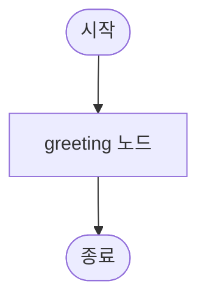
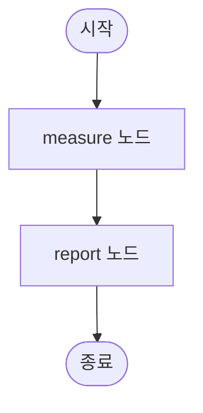
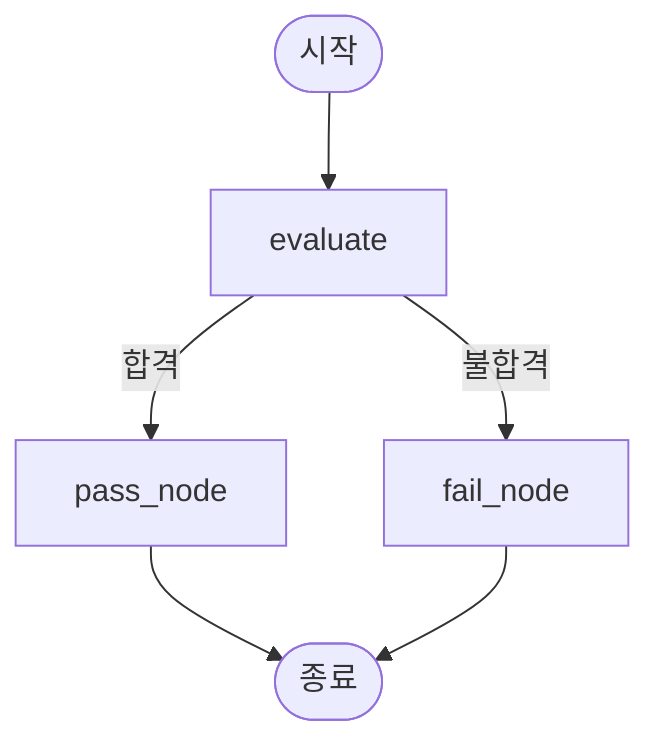

<a id="part2"></a>

## 2️⃣ 왜 LangGraph인가? [↑](#toc)

### 🔹 기존 LLM 한계
하나의 LLM이 모든 일을 처리하면 다음과 같은 문제가 생깁니다:
- 과도한 토큰 소비
- 컨텍스트 누락
- 역할 혼선

### 🔹 LangGraph의 철학
LangGraph는 **상태 기반(State-based)** 구조를 통해 문제를 해결합니다.

- **각 에이전트가 독립된 역할**을 맡음  
- **공유 상태(shared state)** 를 통해 협업  
- **그래프 전이(logic)** 로 대화 흐름 제어  

예를 들어:
> 사용자의 질문 → 검색 에이전트 → 요약 에이전트 → 답변 에이전트  
이 흐름 전체가 하나의 그래프로 정의됩니다.

---

<a id="part3"></a>

## 3️⃣ LangGraph의 구조 [↑](#toc)

### 🧱 ① 노드(Node)
- 하나의 **에이전트(Agent)** 또는 **처리 단계**를 의미합니다.  
- 예시: “검색(Searcher)”, “요약(Summarizer)”, “응답(Response)”  
- 각 노드는 자신만의 LLM, 프롬프트, 툴을 가집니다.

### 🔀 ② 엣지(Edge)
- 노드 간 **전이(Transition)** 를 담당합니다.  
- 한 노드의 결과가 조건에 따라 다음 노드로 이동합니다.  
- 조건부 로직(if/else)을 쉽게 표현할 수 있습니다.  
  - 예: `if state['done']: → END`  
  - 예: `if sender == "Researcher": → "Reviewer"`

### 💾 ③ 상태(State)
- LangGraph의 핵심!  
- **모든 에이전트가 공유하는 메모리** 역할을 합니다.  
- 예: 대화 기록, 검색 결과, 처리 진행 상태 등  

---

<a id="part4"></a>

## 4️⃣ 동작 방식 이해하기 [↑](#toc)

### 💬 메시지 흐름 (Message Flow)
1. 사용자 입력이 **엔트리 노드**로 전달됩니다.  
2. 해당 노드가 작업을 수행하고 상태를 업데이트합니다.  
3. 조건에 따라 다음 노드로 이동합니다.  
4. 최종적으로 **END 노드**에서 결과를 반환합니다.

### ⚙️ 제어 흐름 (Control Flow)
- 그래프는 **조건부 분기**, **반복**, **병렬 처리**를 지원합니다.  
- 예시:  
  - “Router” 노드가 다음 이동 경로를 결정  
  - “Checker” 노드가 “더 필요함/완료됨”을 판단해 반복 제어

---

<a id="part5"></a>

## 5️⃣ 설계 시 유의사항 [↑](#toc)

| 항목 | 설명 |
|------|------|
| ✅ **종료 조건 설정** | 무한 루프 방지를 위해 END 조건을 명확히 정의 |
| 🧠 **프롬프트 설계** | 각 에이전트가 자신의 역할만 수행하도록 명확히 지시 |
| 💸 **비용 관리** | 다중 LLM 호출은 API 비용이 증가하므로 효율적 구성 필요 |
| 🧾 **로깅/모니터링** | 실행 경로와 상태를 시각화하여 디버깅 용이 (예: Langfuse) |
| ⚠️ **모델 한계 고려** | 잘못된 판단 방지를 위해 검증 단계나 휴먼 인터벤션 추가 |

---

<a id="part6"></a>

## 6️⃣ 주요 활용 사례 [↑](#toc)

### 🔹 1. QA 시스템
- 검색 에이전트 → 답변 생성 에이전트 → 응답 반환  
- 예: “서울 인구는?” → 검색 → 요약 → 답변

### 🔹 2. 코드 협업
- 코드 작성 에이전트 ↔ 코드 리뷰 에이전트  
- 반복 루프 구조로 품질 개선 가능

### 🔹 3. 문서 요약 파이프라인
- 분할 요약 → 통합 요약 → 결과 출력  
- 긴 텍스트를 단계별로 효율적으로 처리

### 🔹 4. 대화형 비서
- 일정, 이메일, 검색 등 전문 에이전트를 조합  
- 상황에 따라 라우터가 자동으로 역할 전환

---

<a id="part7"></a>

## 7️⃣ LangGraph의 장점 요약 [↑](#toc)

| 장점 | 설명 |
|------|------|
| 🧩 **모듈성** | 각 노드(에이전트)를 독립적으로 설계 및 재사용 가능 |
| 🔁 **유연한 흐름 제어** | 조건 분기, 반복, 병렬 처리 가능 |
| 💡 **가시성** | 그래프 기반 구조로 실행 흐름 시각화 용이 |
| 🚀 **확장성** | 새로운 에이전트나 기능을 쉽게 추가 가능 |

---

## 📘 마무리

LangGraph는 “멀티 에이전트 협업”을 **구조적·안정적**으로 구현할 수 있게 해줍니다.  
단순한 체인보다 강력한 **그래프형 워크플로우**를 통해  
복잡한 AI 시스템을 확장성과 유지보수성을 모두 확보한 형태로 설계할 수 있습니다.

> 🎓 실습에서는 직접 그래프를 설계하고,
> 각 노드(에이전트)가 협력하여 문제를 해결하는 구조를 구현해봅니다.

---

<a id="part8"></a>

## 8️⃣ 직접 해보기: 미니 그래프 실습 [↑](#toc)

이론으로 배운 노드, 엣지, 상태를 직접 코드로 확인해봅니다. **API 키 없이** 실행할 수 있습니다.

### 예제 1: 가장 간단한 그래프

```python
from typing import TypedDict
from langgraph.graph import StateGraph, START, END

# 1. 상태 정의
class State(TypedDict):
    message: str

# 2. 노드 함수 정의
def greeting(state: State):
    return {"message": f"안녕하세요! '{state['message']}'라고 하셨군요."}

# 3. 그래프 구성
graph = StateGraph(State)
graph.add_node("greeting", greeting)       # 노드 추가
graph.add_edge(START, "greeting")          # 시작 → greeting
graph.add_edge("greeting", END)            # greeting → 종료

# 4. 컴파일 및 실행
app = graph.compile()
result = app.invoke({"message": "LangGraph"})
print(result)
```

**실행 결과:**
```
{'message': "안녕하세요! 'LangGraph'라고 하셨군요."}
```

이 예제의 구조를 그래프로 표현하면 다음과 같습니다:



### 예제 2: 두 개의 노드를 연결하기

```python
from typing import TypedDict
from langgraph.graph import StateGraph, START, END

class State(TypedDict):
    text: str
    length: int

def measure(state: State):
    return {"length": len(state["text"])}

def report(state: State):
    return {"text": f"'{state['text']}'의 길이는 {state['length']}글자입니다."}

graph = StateGraph(State)
graph.add_node("measure", measure)
graph.add_node("report", report)
graph.add_edge(START, "measure")
graph.add_edge("measure", "report")
graph.add_edge("report", END)

app = graph.compile()
result = app.invoke({"text": "LangGraph는 재미있다", "length": 0})
print(result)
```

**실행 결과:**
```
{'text': "'LangGraph는 재미있다'의 길이는 12글자입니다.", 'length': 12}
```



> 핵심 포인트: `measure` 노드가 `length`를 계산하고, `report` 노드가 그 값을 사용합니다. 이것이 **공유 상태(State)** 를 통한 노드 간 협업입니다.

### 예제 3: 조건부 분기 (Conditional Edge)

```python
from typing import TypedDict, Literal
from langgraph.graph import StateGraph, START, END

class State(TypedDict):
    score: int
    result: str

def evaluate(state: State):
    if state["score"] >= 60:
        return {"result": "합격"}
    else:
        return {"result": "불합격"}

def pass_node(state: State):
    return {"result": f"축하합니다! {state['score']}점으로 합격입니다 🎉"}

def fail_node(state: State):
    return {"result": f"{state['score']}점입니다. 다음 기회에 도전하세요 💪"}

def route_by_result(state: State) -> Literal["pass_node", "fail_node"]:
    return "pass_node" if state["result"] == "합격" else "fail_node"

graph = StateGraph(State)
graph.add_node("evaluate", evaluate)
graph.add_node("pass_node", pass_node)
graph.add_node("fail_node", fail_node)

graph.add_edge(START, "evaluate")
graph.add_conditional_edges("evaluate", route_by_result)
graph.add_edge("pass_node", END)
graph.add_edge("fail_node", END)

app = graph.compile()

# 테스트 1: 합격
print(app.invoke({"score": 85, "result": ""})["result"])

# 테스트 2: 불합격
print(app.invoke({"score": 45, "result": ""})["result"])
```

**실행 결과:**
```
축하합니다! 85점으로 합격입니다 🎉
45점입니다. 다음 기회에 도전하세요 💪
```



> 핵심 포인트: `add_conditional_edges`를 사용하면 **조건에 따라 다른 노드로 이동**할 수 있습니다. 이것이 단순 체인과 그래프의 가장 큰 차이입니다.

### 🎯 실습 미션

1. 예제 1의 `greeting` 노드를 수정하여 현재 시간을 포함한 인사말을 출력해보세요.
2. 예제 3의 합격 기준을 70점으로 변경하고, 점수대별로 A/B/C/F 등급을 분류하는 노드를 추가해보세요.
3. 노드를 3개 이상 사용하는 자신만의 그래프를 설계하고 실행해보세요.
