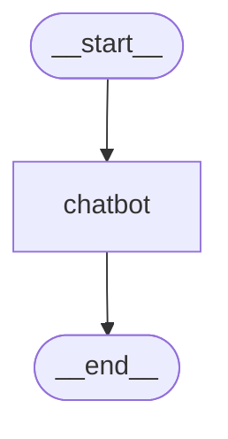

---
title: 3. LangGraph를 활용한 챗봇
layout: default
grand_parent: LLM
parent: LangGraph
nav_order: 3
permalink: /llm/langgraph/chat

--- 

# LangGraph를 활용한 간단한 챗봇 구현

## 학습 목표
- LangGraph의 기본 개념과 사용 방법 이해하기
- OpenAI 모델을 이용한 간단한 챗봇 구현 이해하기
- 상태 관리 및 그래프 구조의 기초 학습하기
- LangGraph 그래프 시각화하기

<a id="toc"></a>

## 진행 순서

1. [환경 설정](#part1)
2. [코드 설명](#part2)
3. [챗봇 실행](#part3)
4. [스트리밍 출력](#part4)
5. [대화형 챗봇 만들기](#part5)

<a id="part1"></a>

## 1. 환경 설정 [↑](#toc)

### 라이브러리 설치
필요한 라이브러리를 설치합니다.
```bash
pip install -U python-dotenv notebook langgraph langchain-openai
```

### 환경변수 설정
환경변수 파일 `.env`를 생성하여 OpenAI API 키와 OpenAI 모델을 설정합니다.

```bash
OPENAI_API_KEY=본인의_OpenAI_API키
OPENAI_MODEL=gpt-4o-mini
```

<a id="part2"></a>

## 2. 코드 설명 [↑](#toc)

### 환경변수 로딩

```python
from dotenv import load_dotenv
import os

load_dotenv()

print(f"OPENAI_API_KEY: {os.getenv('OPENAI_API_KEY') is not None}")

openai_model = os.getenv("OPENAI_MODEL", "gpt-4o-mini")
```

### 상태(State) 정의

```python
from typing_extensions import TypedDict
from typing import Annotated, List
from langgraph.graph.message import add_messages

class State(TypedDict):
    messages: Annotated[List, add_messages]
```

#### 구성 요소 설명
- **`class State(TypedDict)`**
  - Python의 `TypedDict`를 사용해 명시적인 타입이 있는 딕셔너리를 정의합니다.
  - 이를 통해 상태(State)의 구조와 타입을 명확히 지정하여 코드의 가독성과 안정성을 높입니다.

- **`messages`**
  - 상태에 저장되는 주요 데이터입니다. 여기서는 대화 중 주고받은 메시지를 담고 있는 리스트입니다.
  - LangGraph는 대화의 문맥을 유지하기 위해 메시지의 리스트를 관리합니다.

- **`Annotated[List, add_messages]`**
  - `Annotated` 타입 힌트를 사용하여 메시지 리스트가 특정한 규칙(`add_messages`)을 따르도록 합니다.
  - 여기서 `add_messages`는 LangGraph에서 제공하는 특별한 주석(annotation)으로, 메시지 리스트를 다룰 때 자동으로 관리(추가)를 돕는 기능을 수행합니다.

이 상태 정의를 통해 챗봇은:
- 대화의 각 단계를 명확히 관리할 수 있습니다.
- 사용자의 메시지와 모델의 응답 메시지를 체계적으로 기록하고 관리합니다.
- 명시적인 타입과 자동 관리 기능을 활용하여 코드의 오류를 최소화하고 유지보수를 쉽게 합니다.

이러한 방식을 통해, LangGraph는 상태 기반의 복잡한 챗봇 애플리케이션에서도 효율적이고 명확한 데이터 관리와 흐름 제어를 가능하게 합니다.

### LLM 모델 설정

```python
from langchain_openai import ChatOpenAI
llm = ChatOpenAI(model=openai_model)
```

> 💡 **Ollama 사용 시:** `from langchain_ollama import ChatOllama` 후 `llm = ChatOllama(model="gemma3:1b")`로 교체하면 무료로 실습할 수 있습니다.

### 챗봇 노드 정의

```python
def chatbot(state: State):
    response = llm.invoke(state["messages"])
    return {"messages": [response]}
```

- 이 함수는 챗봇 노드를 정의합니다.
- 입력 인자인 `state`는 앞서 정의한 상태(State)로, 사용자와 챗봇 간의 이전 메시지들을 포함하고 있습니다.
- `llm.invoke(state["messages"])`는 현재 상태에 있는 메시지를 기반으로 LLM 모델(`llm`)이 새로운 응답을 생성하도록 요청합니다.
- LLM 모델로부터 받은 응답을 다시 상태에 포함하여 `{ "messages": [response] }` 형태로 반환합니다. 이로 인해 챗봇이 생성한 메시지가 그래프의 다음 단계 또는 최종 출력에 반영됩니다.

### 그래프 구성 및 컴파일

```python
from langgraph.graph import StateGraph, START, END

workflow = StateGraph(State)

workflow.add_node("chatbot", chatbot)

workflow.add_edge(START, "chatbot")
workflow.add_edge("chatbot", END)

graph = workflow.compile()
```

- 먼저 `StateGraph(State)`를 통해 상태 기반 그래프를 생성합니다.
- `workflow.add_node("chatbot", chatbot)`은 그래프에 "chatbot"이라는 이름의 노드를 추가하며, 이 노드는 앞에서 정의한 `chatbot` 함수를 실행합니다.
- `workflow.add_edge(START, "chatbot")`은 시작점(START)에서 "chatbot" 노드로 연결하는 엣지를 정의합니다. 즉, 챗봇이 실행되는 첫 단계로 설정됩니다.
- `workflow.add_edge("chatbot", END)`은 "chatbot" 노드에서 종료점(END)으로 연결하는 엣지를 정의합니다. 이로써 챗봇이 메시지를 생성한 후 작업이 종료됩니다.
- 이 과정을 통해 LangGraph의 작업 흐름을 명확하게 구조화할 수 있습니다.
- `workflow.compile()` 메서드는 앞서 정의한 노드와 엣지를 기반으로 실행 가능한 애플리케이션을 생성합니다.
- 컴파일 과정에서 상태의 전환과 데이터 흐름을 최적화하여 실행 속도를 향상시키고, 그래프 구조 내의 노드 및 상태 변경 규칙을 명확히 합니다.
- 컴파일된 그래프는 사용자가 정의한 노드와 엣지 설정대로 동작하여 정확한 작업 흐름을 제공합니다.


### 그래프 시각화
LangGraph는 컴파일된 그래프를 시각화할 수 있는 기능을 제공합니다.

```python
from IPython.display import Image, display

display(Image(graph.get_graph().draw_mermaid_png()))
```

- 위 코드는 컴파일된 그래프를 mermaid 형식의 PNG 이미지로 생성하여 IPython 환경에서 출력합니다.
- 그래프의 흐름과 노드 간 관계를 직관적으로 파악할 수 있습니다.
- **`__start__` → `chatbot` (직선)**  
- **`chatbot` → `__end__` (직선)**  

이러한 직선 화살표는 모두 **명시적으로 추가된 엣지(edge)**를 나타내며,  
즉, 다음의 코드 라인들이 직접적으로 시각화된 것입니다.

```python
workflow.add_edge(START, "chatbot")
workflow.add_edge("chatbot", END)
```

#### 직선 화살표의 의미

- 직선 화살표는 **조건 없이** 항상 실행되는, **일반적인 엣지**입니다.
- 위 코드에서는 `__start__` 노드에서 `chatbot` 노드를 실행하고,  
  챗봇 노드가 완료되면 바로 `__end__`로 이동하여 그래프를 종료합니다.

#### 화살표의 종류

| 화살표 종류 | 의미                                  | 사용 예시                     |
|-------------|---------------------------------------|-------------------------------|
| **직선 화살표** | 조건 없는 일반 흐름 (항상 실행됨) | 단순 시작-종료 흐름 (현재 코드) |
| 점선 화살표  | 조건부 흐름 (조건 만족 시 실행됨)    | 도구 호출 여부와 같은 조건 판단 시 |

이번 코드에서 모든 화살표가 직선으로 나타난 이유는 **조건을 판단할 함수나 조건부 처리를 하지 않고 명시적으로 단순히 노드를 연결**했기 때문입니다.

아래는 이 그래프의 구조입니다:



<a id="part3"></a>

## 3. 챗봇 실행 [↑](#toc)

```python
from langchain_core.messages import HumanMessage

user_input = "LangGraph가 무엇인가요?"
state = {"messages": [HumanMessage(content=user_input)]}
response = graph.invoke(state)

print(response["messages"][-1].content)
```

**실행 결과 (예시):**
```
LangGraph는 LangChain 팀이 개발한 멀티 에이전트 오케스트레이션 프레임워크입니다.
복잡한 문제를 여러 전문화된 LLM 에이전트가 협력해 해결할 수 있도록
그래프 기반 구조로 설계된 것이 특징입니다...
```

- 메인 스크립트에서 사용자의 질문을 입력받아 챗봇을 실행합니다.
- 입력된 메시지는 `HumanMessage` 형식으로 LangGraph 상태로 전달됩니다.
- 실행된 챗봇의 응답은 화면에 출력됩니다.

<a id="part4"></a>

## 4. 스트리밍 출력 [↑](#toc)

`invoke()`는 전체 응답이 완성된 후 한 번에 반환합니다. `stream()`을 사용하면 노드가 실행될 때마다 중간 결과를 확인할 수 있습니다.

```python
for event in graph.stream({"messages": [HumanMessage(content="LangGraph가 무엇인가요?")]}):
    for node_name, value in event.items():
        print(f"--- [{node_name}] 노드 실행 ---")
        print(value["messages"][-1].content[:100], "...")
```

**실행 결과 (예시):**
```
--- [chatbot] 노드 실행 ---
LangGraph는 LangChain 팀이 개발한 멀티 에이전트 오케스트레이션 프레임워크입니다...
```

<a id="part5"></a>

## 5. 대화형 챗봇 만들기 [↑](#toc)

`while` 루프를 사용하면 터미널에서 연속 대화가 가능한 챗봇을 만들 수 있습니다.

```python
from langchain_core.messages import HumanMessage

while True:
    user_input = input("사용자: ")
    if user_input.lower() in ["quit", "q", "종료"]:
        print("대화를 종료합니다.")
        break

    response = graph.invoke({"messages": [HumanMessage(content=user_input)]})
    print(f"챗봇: {response['messages'][-1].content}\n")
```

**실행 결과 (예시):**
```
사용자: 안녕하세요
챗봇: 안녕하세요! 무엇을 도와드릴까요?

사용자: Python이 뭔가요?
챗봇: Python은 범용 프로그래밍 언어로...

사용자: 종료
대화를 종료합니다.
```

> ⚠️ **참고:** 이 챗봇은 이전 대화를 기억하지 못합니다. 메모리 기능은 [5단원](/llm/langgraph/chat_memory)에서 학습합니다.

### 🎯 실습 미션

1. 시스템 메시지를 추가하여 챗봇의 성격을 바꿔보세요. (힌트: `state["messages"]` 앞에 `SystemMessage`를 추가)
   ```python
   from langchain_core.messages import SystemMessage
   def chatbot(state: State):
       system = SystemMessage(content="당신은 해적 말투로 대답하는 AI입니다.")
       response = llm.invoke([system] + state["messages"])
       return {"messages": [response]}
   ```
2. 대화형 챗봇에서 사용자의 입력이 비어있을 때 "질문을 입력해주세요"라고 안내하는 코드를 추가해보세요.

---