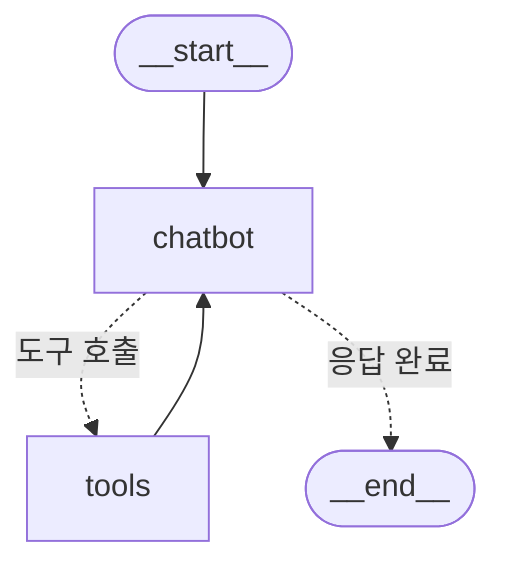

---
title: 5. LangGraph 챗봇에 메모리 추가하기
layout: default
grand_parent: LLM
parent: LangGraph
nav_order: 5
permalink: /llm/langgraph/chat_memory
# nav_exclude: true
# search_exclude: true
--- 
# LangGraph 챗봇에 메모리 추가하기

챗봇에 메모리 추가하기는 챗봇이 이전 대화의 맥락을 기억하여 일관된 다중 턴 대화를 가능하게 하는 방법을 다룹니다.  
이전까지의 챗봇은 도구를 활용하여 사용자 질문에 답변할 수 있었지만, 이전 대화의 맥락을 유지하지 못해 연속적인 대화에 한계가 있었습니다.  
LangGraph는 지속적인 체크포인팅(persistent checkpointing) 기능을 통해 이 문제를 해결합니다.

## 학습 목표
- 챗봇에 지속적인 체크포인팅 기능 추가하기
- 이전 대화 맥락을 유지하는 다중 턴 대화 구현하기
- LangGraph 내 메모리 기능 활용법 학습하기

<a id="toc"></a>

## 진행 순서

1. [환경 설정](#part1)
2. [코드 설명](#part2)
3. [챗봇 실행](#part3)

<a id="part1"></a>

## 1. 환경 설정 [↑](#toc)

### 환경변수 설정
환경변수 파일 `.env`를 생성하여 다음의 내용을 설정합니다.

```bash
OPENAI_API_KEY=본인의_OpenAI_API키
OPENAI_MODEL=gpt-4o-mini
TAVILY_API_KEY=본인의_tavily_api_key
```

<a id="part2"></a>

## 2. 코드 설명 [↑](#toc)

### 환경변수 로딩

```python
from dotenv import load_dotenv
import os
load_dotenv()

openai_model = os.getenv("OPENAI_MODEL", "gpt-4o-mini")
```

### 도구 정의

Tavily 검색 도구를 설정합니다.

```python
from langchain_tavily import TavilySearch

tool = TavilySearch(max_results=2)
tool.invoke("LangGraph가 무엇인가요?")
```

### 상태(State) 정의

```python
from langgraph.graph.message import add_messages
from typing_extensions import TypedDict
from typing import Annotated, List

class State(TypedDict):
    messages: Annotated[list, add_messages]
```

> 상태(State) 정의는 [3단원 챗봇](/llm/langgraph/chat)에서 학습한 것과 동일한 구조입니다.

### LLM 모델 설정 및 도구 바인딩

```python
from langchain_openai import ChatOpenAI

llm = ChatOpenAI(model=openai_model)
tools = [tool]
llm_with_tools = llm.bind_tools(tools)
```

> 💡 **Ollama 사용 시:** `from langchain_ollama import ChatOllama` 후 `llm = ChatOllama(model="llama3.2")`로 교체할 수 있습니다.

### 챗봇 노드 정의

챗봇이 도구를 이용하여 사용자 메시지에 응답하도록 설정합니다.

```python
def chatbot(state: State):
    response = llm_with_tools.invoke(state["messages"])
    return {"messages": [response]}
```

- `chatbot(state: State)`: 챗봇 노드 함수로, 상태에서 받은 메시지를 기반으로 도구를 활용하여 응답을 생성하고 상태를 업데이트합니다.

### 체크포인터 설정
체크포인팅을 위한 메모리 체크포인터를 생성합니다.

```python
from langgraph.checkpoint.memory import InMemorySaver

memory = InMemorySaver()
```

- `InMemorySaver`: 메모리 기반의 체크포인터로, 각 대화의 상태를 메모리에 임시로 저장하고 관리합니다.   
이를 통해 챗봇은 이전 대화 내용을 기억하고 다음 번 상호작용 시에도 맥락을 유지한 상태로 대화를 진행할 수 있습니다.  
실제 운영 환경에서는 더 영구적인 상태 관리를 위해 데이터베이스 기반 체크포인터(예: SqliteSaver 또는 PostgresSaver)를 사용하는 것이 권장됩니다.

### 그래프 구성 및 컴파일
LangGraph의 ToolNode와 tools_condition을 사용하여 조건부로 도구 노드를 호출합니다.

```python
from langgraph.prebuilt import ToolNode, tools_condition

tool_node = ToolNode(tools)

workflow = StateGraph(State)

workflow.add_node("chatbot", chatbot)
workflow.add_node("tools", tool_node)

workflow.add_conditional_edges("chatbot", tools_condition)
workflow.add_edge("tools", "chatbot")
workflow.add_edge(START, "chatbot")

graph = workflow.compile(checkpointer=memory)
```

> `ToolNode`와 `tools_condition`의 작동 원리는 [4단원 도구 사용](/llm/langgraph/chat_tool)에서 학습한 것과 동일합니다.

### 그래프 시각화
컴파일된 그래프를 이용해 시각화해봅니다.

```python
from IPython.display import Image, display

display(Image(graph.get_graph().draw_mermaid_png()))
```



<a id="part3"></a>

## 3. 챗봇 실행 [↑](#toc)
동일한 thread_id를 사용하여 이전 대화 맥락을 유지하는 예시입니다. 이 예시에서는 두 개의 서로 다른 thread_id를 사용하여 두 개의 독립된 대화를 관리하는 방법을 보여줍니다.

```python
config = {"configurable": {"thread_id": "user123"}}
```

`config`는 LangGraph의 그래프 실행 시 설정을 정의하는 딕셔너리입니다.
여기서 `configurable` 키는 실행 시 동적으로 설정할 수 있는 옵션을 포함합니다.

- `thread_id`: 대화의 고유 식별자 역할을 합니다.
- LangGraph는 상태 기반 그래프(StateGraph)를 사용하여 대화를 관리합니다.
- `thread_id`는 각 대화의 상태를 구분하는 데 사용됩니다.
- 동일한 `thread_id`를 사용하면 이전 대화의 맥락을 유지하며 대화를 이어갈 수 있습니다.
- 서로 다른 `thread_id`를 사용하면 독립된 대화를 관리할 수 있습니다.

예를 들어:
- `thread_id`가 "user123"인 경우, 해당 대화의 상태를 기반으로 응답을 생성합니다.
- 새로운 `thread_id`를 지정하면 이전 대화와는 별개의 새로운 대화가 시작됩니다.

이 설정은 LangGraph의 체크포인팅(checkpointing) 기능과 결합하여 다중 턴 대화에서 맥락을 유지하거나 독립적인 대화를 관리하는 데 유용합니다.

```python
from langchain_core.messages import HumanMessage

# 첫 번째 대화: 새로운 대화 맥락 생성
user_input1 = "LangGraph가 무엇인가요?"
state1 = {"messages": [HumanMessage(content=user_input1)]}
response1 = graph.invoke(state1, config)

# 챗봇의 첫 번째 응답 출력
print(response1["messages"][-1].content)
```

**실행 결과 (예시):**
```
LangGraph는 LangChain 팀이 개발한 멀티 에이전트 오케스트레이션 프레임워크로,
복잡한 워크플로우를 그래프 기반으로 설계할 수 있게 해줍니다...
```

```python
# 두 번째 대화: 이전 대화 맥락 유지
user_input2 = "그것을 만든 회사는 어딘가요?"
state2 = {"messages": [HumanMessage(content=user_input2)]}
response2 = graph.invoke(state2, config)

# 챗봇의 두 번째 응답 출력 (이전 대화의 맥락이 유지된 상태)
print(response2["messages"][-1].content)
```

**실행 결과 (예시):**
```
LangGraph를 만든 회사는 LangChain입니다.
LangChain은 LLM 기반 애플리케이션을 위한 다양한 프레임워크를 개발하고 있습니다.
```

> ✅ **핵심:** "그것을 만든 회사"라는 질문이 동작하는 이유는 **동일한 thread_id("user123")** 를 사용하여 이전 대화 맥락이 유지되었기 때문입니다.

```python
# 세 번째 대화: 새로운 thread_id 사용하여 독립된 새로운 대화 맥락 생성
user_input3 = "그것을 만든 회사는 어딘가요?"
state3 = {"messages": [HumanMessage(content=user_input3)]}
response3 = graph.invoke(state3, {"configurable": {"thread_id": "user456"}})

# 새로운 대화 맥락에서의 챗봇 응답 출력 (기존 thread_id와 독립된 상태)
print(response3["messages"][-1].content)
```

**실행 결과 (예시):**
```
죄송합니다, "그것"이 무엇을 가리키는지 알 수 없습니다. 좀 더 구체적으로 질문해 주시겠어요?
```

> ⚠️ **핵심:** 새로운 thread_id("user456")를 사용했으므로 이전 대화 맥락이 없습니다. 같은 질문이지만 "그것"이 무엇인지 모릅니다.

```python
# 기존 thread_id의 대화 상태 확인
snapshot = graph.get_state(config)
snapshot.values['messages']
```

```python
# 새 thread_id의 대화 상태 확인
graph.get_state({"configurable": {"thread_id": "user456"}}).values['messages']
```

코드 실행 흐름
- 첫 번째 대화는 새로운 대화 맥락을 생성하며, 질문에 대한 답변을 얻습니다.
- 두 번째 대화는 첫 번째 대화와 동일한 `thread_id`를 사용하여 이전의 대화 맥락을 유지하고, 이어지는 질문에 답변을 얻습니다.
- 세 번째 대화는 별도의 새로운 `thread_id`를 사용하여 첫 번째, 두 번째 대화와 독립적인 새로운 대화 맥락을 형성합니다.
- 마지막으로 각각의 `thread_id`로 관리되는 대화 상태를 조회하여, 상태가 독립적으로 관리되고 있음을 확인합니다.


```python
from pprint import pprint

# 체크포인터가 InMemorySaver일 경우 예시
all_snapshots = memory.list({})  # 모든 thread_id 상태 조회

for snapshot in all_snapshots:
    print(snapshot.config['configurable']['thread_id'])
    if 'messages' in snapshot.checkpoint['channel_values']:
        pprint(snapshot.checkpoint['channel_values']['messages'])
    else:
        print("No messages found in this snapshot.")
```

### 🎯 실습 미션

1. `thread_id`를 3개 만들어 각각 다른 주제로 대화하고, `graph.get_state(config).values['messages']`로 각 상태를 비교해보세요.
2. 같은 `thread_id`로 5번 이상 대화를 이어가며 맥락이 유지되는지 확인해보세요.
3. 프로그램을 재시작한 후 같은 `thread_id`로 대화해보세요. `InMemorySaver`의 한계를 직접 확인할 수 있습니다.
