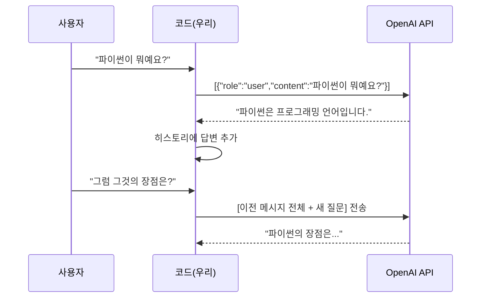

# 4. 역할 기반 프롬프트와 대화 설계

<a id="toc"></a>

## 진행 순서

1. [페르소나 설계의 힘](#part1)
2. [2단계 역할 프롬프팅](#part2)
3. [싱글턴 vs 멀티턴](#part3)
4. [메시지 배열 구조](#part4)
5. [멀티턴 시나리오 실습](#part5)

---

<a id="part1"></a>

## 1. 페르소나 설계의 힘 [↑](#toc)

**학습목표**: system 메시지로 전문가 역할을 부여하고, 역할에 따라 응답이 어떻게 달라지는지 비교할 수 있다.

같은 주제를 설명하더라도, **누가 설명하느냐**에 따라 말투·깊이·어휘가 완전히 달라집니다. LLM의 system 메시지는 이 "화자의 역할"을 정의합니다.

### 역할별 응답 비교 실습

아래 코드는 "마이크로서비스 아키텍처가 뭔가요?" 라는 동일한 질문을 세 가지 다른 역할로 반복하여 결과를 DataFrame에 저장합니다.

```python
# ===================================
# 역할별 응답 비교 실습
# ===================================
import os
import pandas as pd
from openai import OpenAI

client = OpenAI(api_key=os.environ["OPENAI_API_KEY"])

# 비교할 역할 목록 정의
roles = {
    "신입 교육 담당 사수": "당신은 IT 회사에서 신입 개발자를 교육하는 3년차 개발자입니다. 쉬운 비유와 그림을 활용해 설명해주세요.",
    "시니어 아키텍트": "당신은 대기업 소프트웨어 아키텍트입니다. 정확한 기술 용어와 트레이드오프를 포함하여 설명해주세요.",
    "스타트업 CTO": "당신은 5인 스타트업 CTO입니다. '우리 팀 규모에서 이게 필요한가?'라는 현실적 관점으로 답해주세요.",
}

question = "마이크로서비스 아키텍처가 뭔가요? 우리 팀은 4명인데 도입해야 하나요?"

결과_목록 = []

for name, system in roles.items():
    response = client.chat.completions.create(
        model="gpt-4o-mini",
        messages=[
            {"role": "system", "content": system},
            {"role": "user", "content": question},
        ],
        temperature=0.7,
    )
    답변 = response.choices[0].message.content
    결과_목록.append({
        "역할": name,
        "답변": 답변,
    })
    print(f"[{name}]\n{답변}\n{'='*60}\n")

# DataFrame으로 정리하여 비교
df = pd.DataFrame(결과_목록)
print(df[["역할", "답변"]].to_string(index=False))
```

### 역할에 따른 응답 차이 요약

| 역할 | 특징 | 적합한 상황 |
|------|------|-------------|
| 신입 교육 담당 사수 | 쉬운 비유, 단계적 설명, 친근한 어조 | 신입 교육 문서, 온보딩 자료 |
| 시니어 아키텍트 | 전문 용어, 트레이드오프 포함, 정확성 우선 | 기술 검토, 설계 문서 |
| 스타트업 CTO | 현실적 관점, 비용·규모 고려, 결론 중심 | 팀 의사결정, 기술 도입 검토 |

**핵심**: "같은 지식도 청중에 따라 전달 방식이 달라져야 한다." 페르소나를 정밀하게 설계할수록 원하는 톤과 깊이의 답변을 얻을 수 있습니다.

> **확인**: 세 역할의 답변 중 가장 쉽게 이해되는 답변은 무엇인가요? 그 이유는?

---

<a id="part2"></a>

## 2. 2단계 역할 프롬프팅 [↑](#toc)

**학습목표**: 역할 설정(system)과 구체적 지시(user)를 분리하여 더 정밀한 프롬프트를 설계할 수 있다.

단순히 역할만 지정하는 것에서 나아가, **2단계로 나누어** 지시하면 더 일관된 결과를 얻을 수 있습니다.

### 2단계 구조

| 단계 | 메시지 역할 | 내용 | 목적 |
|------|-------------|------|------|
| 1단계 | system | "당신은 10년 경력의 파이썬 시니어 개발자입니다" | 역할·태도·제약 설정 |
| 2단계 | user | "아래 코드의 문제점을 찾아 수정해 주세요" | 구체적 작업 지시 |

```python
# ===================================
# 2단계 역할 프롬프팅 예시
# ===================================

# 1단계: system으로 역할 설정
system_message = """당신은 10년 경력의 파이썬 시니어 개발자입니다.
코드 리뷰 시 다음 기준을 지킵니다:
- 버그보다 설계 문제를 먼저 지적합니다
- 개선 이유를 반드시 설명합니다
- 예시 코드를 함께 제공합니다
"""

# 2단계: user로 구체적 작업 지시
user_message = """아래 코드의 문제점을 찾아 수정된 코드와 함께 설명해 주세요.

def get_user(users, id):
    for u in users:
        if u['id'] == id:
            return u
    return None

result = get_user(None, 5)
print(result['name'])
"""

response = client.chat.completions.create(
    model="gpt-4o-mini",
    messages=[
        {"role": "system", "content": system_message},
        {"role": "user", "content": user_message},
    ],
    temperature=0.3,  # 코드 리뷰는 일관성이 중요하므로 낮게 설정
)

print(response.choices[0].message.content)
```

### 주의: 역할이 객관성을 해칠 수 있다

역할 프롬프팅은 강력하지만, **편향(bias)** 을 유발할 수 있습니다.

| 상황 | 위험 | 대응 |
|------|------|------|
| "보수적인 경제학자로서..." | 특정 정치 관점의 답변 유도 | 중립 역할 또는 역할 미지정 |
| "우리 제품을 홍보하는 마케터로서..." | 단점 누락, 과장 | 균형 잡힌 역할 추가 지시 |
| "낙관적인 투자자로서..." | 리스크 경고 생략 | "단점도 반드시 포함" 명시 |

**핵심**: 역할 설정은 응답의 품질을 높이는 도구이지만, 편향이 생기지 않도록 지시문을 신중하게 작성해야 합니다.

> **확인**: system 메시지 없이 동일한 코드 리뷰 요청을 해보세요. 어떤 차이가 있나요?

---

<a id="part3"></a>

## 3. 싱글턴 vs 멀티턴 [↑](#toc)

**학습목표**: 싱글턴과 멀티턴의 차이를 설명하고, LLM이 상태를 저장하지 않는 이유를 이해한다.

### 두 방식 비교

| 항목 | 싱글턴(Single-turn) | 멀티턴(Multi-turn) |
|------|--------------------|--------------------|
| 대화 형태 | 질문 1개 → 답변 1개 | 여러 차례 주고받음 |
| 문맥 유지 | 없음 | 있음 (히스토리 포함) |
| 적합한 상황 | 번역, 요약, 단순 분류 | 상담, 튜터링, 코드 디버깅 |
| API 비용 | 낮음 | 높음 (히스토리 토큰 누적) |
| 구현 복잡도 | 단순 | 상대적으로 복잡 |

### LLM은 Stateless다

LLM API는 **무상태(stateless)** 로 동작합니다. 즉, 이전 대화를 자체적으로 기억하지 않습니다.

```
[잘못된 이해]
사용자: "파이썬이 뭐예요?"
LLM: "파이썬은 프로그래밍 언어입니다..."
사용자: "그럼 그것의 장점은?" ← LLM은 "파이썬"이 무엇인지 모른다!

[올바른 구현]
매 요청마다 이전 대화 전체를 messages 배열에 담아 전송해야 합니다.
```



**핵심**: LLM이 문맥을 유지하는 것처럼 느껴지는 건, 우리 코드가 매번 전체 히스토리를 함께 보내기 때문입니다.

> **확인**: 멀티턴 대화에서 API 비용이 증가하는 이유는 무엇인가요?

---

<a id="part4"></a>

## 4. 메시지 배열 구조 [↑](#toc)

**학습목표**: system / user / assistant 세 역할의 차이를 설명하고, messages 배열을 직접 구성할 수 있다.

### 세 가지 역할

| 역할(role) | 작성 주체 | 목적 |
|------------|-----------|------|
| `system` | 개발자 | LLM의 성격·제약·역할을 정의. 대화 전체에 적용 |
| `user` | 사용자 | 사용자의 질문이나 요청 |
| `assistant` | LLM (이전 응답) | LLM의 이전 답변. 문맥 유지를 위해 포함 |

### 멀티턴 대화 구현 패턴

```python
# ===================================
# 멀티턴 대화 기본 구조
# ===================================

# 대화 히스토리를 저장할 리스트
messages = [
    {"role": "system", "content": "당신은 친절한 시니어 개발자입니다. 신입 개발자의 코드 질문에 항상 예제 코드를 포함해서 답변하세요."}
]

def chat(user_input):
    """사용자 입력을 받아 멀티턴 대화를 이어가는 함수"""
    # 1. 사용자 메시지를 히스토리에 추가
    messages.append({
        "role": "user",
        "content": user_input
    })

    # 2. 전체 히스토리를 API에 전송
    response = client.chat.completions.create(
        model="gpt-4o-mini",
        messages=messages,  # 매번 전체 히스토리 전송
        temperature=0.7,
    )

    # 3. LLM 응답을 히스토리에 추가
    assistant_message = response.choices[0].message.content
    messages.append({
        "role": "assistant",
        "content": assistant_message
    })

    return assistant_message

# 실제 사용
print("=== 시니어 개발자와 대화 ===")
answer1 = chat("try-except로 에러를 처리하는데, 어떤 에러를 잡아야 할지 모르겠어요.")
print(f"[시니어]: {answer1}\n")

answer2 = chat("방금 설명한 것 중에서 API 호출할 때는 어떤 예외를 잡아야 하나요?")
print(f"[시니어]: {answer2}\n")

# 현재 messages 배열 확인
print("\n=== 현재 messages 배열 구조 ===")
for i, msg in enumerate(messages):
    print(f"[{i}] role: {msg['role']}")
    print(f"     content: {msg['content'][:60]}...")
```

**핵심**: messages는 단순한 리스트입니다. 대화가 이어질수록 리스트가 길어지며, 이 전체 리스트가 매 요청마다 전송됩니다.

> **확인**: messages 배열에서 assistant role을 모두 제거하면 어떤 일이 생길까요?

---

<a id="part5"></a>

## 5. 멀티턴 시나리오 실습 [↑](#toc)

**학습목표**: 실제 상담 시나리오를 코드로 구현하여 멀티턴 대화의 흐름을 체험한다.

### 시나리오: SaaS 기술 고객 지원

고객이 SaaS 서비스 이용 중 겪는 기술 문제를 문의하는 4턴 대화를 구현합니다.

```python
# ===================================
# SaaS 기술 고객 지원 멀티턴 시나리오
# ===================================

# 상담사 역할 설정
상담_messages = [
    {
        "role": "system",
        "content": """당신은 SaaS 서비스 '데브플로우'의 기술 지원 담당자입니다.
다음 정책을 따릅니다:
- 무료 플랜: 월 1,000 API 호출, 커뮤니티 지원
- Pro 플랜: 월 50,000 API 호출, 이메일 지원, 우선 응답
- Enterprise: 무제한 호출, 전담 매니저, SLA 99.9%
- API 키 재발급: 보안 확인 후 즉시 가능
- 장애 발생 시: status.devflow.io 안내 후 에스컬레이션

항상 고객에게 먼저 공감을 표현하고, 정확한 정책을 안내해 주세요."""
    }
]

def 상담(고객_입력):
    """기술 지원 멀티턴 대화 함수"""
    상담_messages.append({"role": "user", "content": 고객_입력})

    response = client.chat.completions.create(
        model="gpt-4o-mini",
        messages=상담_messages,
        temperature=0.3,  # 상담은 일관성이 중요
    )

    답변 = response.choices[0].message.content
    상담_messages.append({"role": "assistant", "content": 답변})
    return 답변

# 실제 상담 시나리오 진행
print("=" * 60)
print("데브플로우 기술 지원 시작")
print("=" * 60)

# 턴 1: 에러 문의
고객1 = "안녕하세요. API 호출이 갑자기 429 에러를 반환하는데 왜 그런가요?"
print(f"\n[고객]: {고객1}")
print(f"[상담사]: {상담(고객1)}")

# 턴 2: 업그레이드 문의
고객2 = "현재 무료 플랜인데, Pro로 업그레이드하면 바로 적용되나요?"
print(f"\n[고객]: {고객2}")
print(f"[상담사]: {상담(고객2)}")

# 턴 3: 보안 문의
고객3 = "API 키가 노출된 것 같은데 재발급 받을 수 있나요?"
print(f"\n[고객]: {고객3}")
print(f"[상담사]: {상담(고객3)}")

# 턴 4: 추가 문의
고객4 = "감사합니다. 혹시 Pro 플랜 할인 이벤트가 있나요?"
print(f"\n[고객]: {고객4}")
print(f"[상담사]: {상담(고객4)}")

print("\n" + "=" * 60)
print(f"총 사용된 메시지 수: {len(상담_messages)}")
print("(system 1 + user 4 + assistant 4 = 9개)")
```

### 대화 흐름 분석

| 턴 | 고객 요청 | 핵심 정보 | LLM이 활용한 문맥 |
|----|-----------|-----------|-------------------|
| 1 | 429 에러 문의 | 무료 플랜 한도 초과 | system 정책 |
| 2 | Pro 업그레이드 문의 | 현재 무료 플랜 | 턴 1의 "429 에러" 맥락 |
| 3 | API 키 재발급 요청 | 보안 노출 우려 | 턴 1~2 전체 문맥 |
| 4 | 할인 이벤트 문의 | - | 턴 1~3 전체 문맥 |

**핵심**: "문맥을 유지하려면 전체 대화 히스토리를 함께 보내야 한다." 턴 2에서 LLM이 "무료 플랜"이라는 정보를 별도로 묻지 않아도 아는 이유는, 턴 1의 429 에러 설명 과정에서 이미 플랜 정보가 히스토리에 담겨 있기 때문입니다.

> **확인**: 턴 4의 요청만 단독으로 보내면 (이전 히스토리 없이) 어떤 답변이 나올까요? 직접 실험해 보세요.
