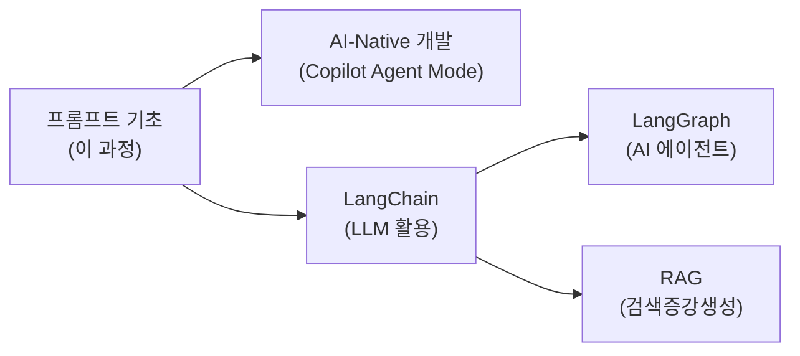

# 5. 미니프로젝트

## 학습 목표

1. 지금까지 배운 기법을 종합하여 실제 웹 서비스를 만들 수 있다
2. 프롬프트 엔지니어링에서 컨텍스트 엔지니어링으로 나아가는 방향을 이해한다

> **사전 설치**: `pip install streamlit openai python-dotenv` (또는 `uv pip install streamlit openai python-dotenv`)
>
> **실행**: `streamlit run app.py`

### .env 파일 생성

프로젝트 폴더에 `.env` 파일을 만들고 API 키를 저장합니다. 이 파일은 Git에 올리지 않도록 `.gitignore`에 추가하세요.

```
# .env
OPENAI_API_KEY=sk-여기에-발급받은-키를-붙여넣기
```

> **주의**: `.env` 파일에는 따옴표 없이 키 값만 적습니다. 이 파일은 절대 GitHub에 올리면 안 됩니다!

<a id="toc"></a>
## 진행 순서

1. [프로젝트 A: 역할 전환 AI 챗봇](#projectA)
2. [프로젝트 B: 자기소개서 첨삭 서비스](#projectB)
3. [프롬프트 → 컨텍스트 엔지니어링](#context)
4. [전체 과정 복습](#review)

---

<a id="projectA"></a>
## 프로젝트 A: 역할 전환 AI 챗봇 [↑](#toc)

**목표**: Streamlit으로 역할을 전환할 수 있는 멀티턴 챗봇 만들기

**사용 기법:**

| 기법 | 적용 위치 |
|------|-----------|
| Role Prompting | system 메시지에 역할별 페르소나 |
| 멀티턴 대화 | session_state로 히스토리 관리 |
| CRAFT | 각 역할의 Context + Tone 설정 |

### 완성 코드

```python
# app_chatbot.py
# 실행: streamlit run app_chatbot.py
import streamlit as st
from openai import OpenAI
from dotenv import load_dotenv

# .env 파일에서 OPENAI_API_KEY를 자동으로 읽어옴
load_dotenv()
client = OpenAI()  # 환경 변수에서 자동으로 API 키를 가져옴

# ===== 역할 정의 (CRAFT의 Role + Tone) =====
ROLES = {
    "파이썬 튜터": """당신은 3년차 백엔드 개발자이고 신입 교육을 담당합니다.
파이썬 기초 질문에 항상 코드 예시를 포함해 답변합니다.
잘못된 코드를 보여주면 부드럽게 교정하고 더 나은 방법을 알려줍니다.
항상 마지막에 '더 궁금한 점이 있나요?'라고 묻습니다.""",

    "딥러닝 멘토": """당신은 5년차 ML 엔지니어입니다.
CNN, RNN, YOLO 등 딥러닝 개념을 실생활 비유로 쉽게 설명합니다.
수학 공식보다 직관적 이해를 우선합니다.
학습 로드맵과 추천 자료도 함께 제공합니다.""",

    "코드 리뷰어": """당신은 시니어 개발자이며 코드 리뷰 전문가입니다.
코드의 문제점을 찾고 개선된 버전을 제시합니다.
버그보다 설계 문제를 먼저 지적하고, 개선 이유를 반드시 설명합니다.
어투는 격려하되 핵심은 날카롭게 유지합니다.""",
}

# ===== Streamlit UI =====
st.set_page_config(page_title="역할 전환 AI 챗봇", page_icon="💬", layout="centered")
st.title("💬 프로그래밍 학습 AI 챗봇")
st.caption("역할을 선택하면 해당 전문가로 대화합니다.")

# 사이드바: 역할 선택
with st.sidebar:
    st.header("설정")
    선택_역할 = st.radio("대화 상대 선택", list(ROLES.keys()))

    # 역할 변경 시 대화 초기화
    if "현재_역할" not in st.session_state:
        st.session_state["현재_역할"] = 선택_역할
    if st.session_state["현재_역할"] != 선택_역할:
        st.session_state["현재_역할"] = 선택_역할
        st.session_state["messages"] = []
        st.rerun()

    st.divider()
    st.markdown(f"**현재 역할**: {선택_역할}")
    st.markdown(f"**대화 수**: {len(st.session_state.get('messages', []))} 턴")

    if st.button("대화 초기화", use_container_width=True):
        st.session_state["messages"] = []
        st.rerun()

# 대화 히스토리 초기화
if "messages" not in st.session_state:
    st.session_state["messages"] = []

# 이전 대화 표시
for msg in st.session_state["messages"]:
    with st.chat_message(msg["role"]):
        st.write(msg["content"])

# 사용자 입력 처리
if user_input := st.chat_input(f"{선택_역할}에게 말을 걸어보세요..."):
    # 사용자 메시지 표시 & 저장
    with st.chat_message("user"):
        st.write(user_input)
    st.session_state["messages"].append({"role": "user", "content": user_input})

    # API 호출 (system + 전체 히스토리)
    api_messages = [
        {"role": "system", "content": ROLES[선택_역할]},
    ] + st.session_state["messages"]

    with st.chat_message("assistant"):
        with st.spinner("생각 중..."):
            response = client.chat.completions.create(
                model="gpt-4.1-nano",
                messages=api_messages,
                temperature=0.7,
                stream=True,   # 실시간 스트리밍
            )
            전체_답변 = st.write_stream(response)

    # AI 응답 저장
    st.session_state["messages"].append({"role": "assistant", "content": 전체_답변})
```


---

<a id="projectB"></a>
## 프로젝트 B: 자기소개서 첨삭 서비스 [↑](#toc)

**목표**: Few-shot + Role Prompting으로 직무별 맞춤 피드백 제공

**사용 기법:**

| 기법 | 적용 위치 |
|------|-----------|
| Role Prompting | "10년 경력 자소서 멘토" 역할 |
| Few-shot | 직무별 좋은/나쁜 예시 제공 |
| 포맷 제어 | 강점 3개 + 개선점 3개 + 수정안 |

### 완성 코드

```python
# app_resume.py
# 실행: streamlit run app_resume.py
import streamlit as st
from openai import OpenAI
from dotenv import load_dotenv

# .env 파일에서 OPENAI_API_KEY를 자동으로 읽어옴
load_dotenv()
client = OpenAI()

# ===== 직무별 Few-shot 예시 =====
EXAMPLES = {
    "마케팅": [
        {"role": "user", "content": "자소서: '마케팅에 관심이 있고 열심히 하겠습니다.'\n직무: 마케팅"},
        {"role": "assistant", "content": """**강점**
1. 마케팅 직무에 대한 관심을 표현했습니다.
2. 열정과 의지를 보여주었습니다.
3. 간결한 표현을 사용했습니다.

**개선점**
1. 구체적인 경험이나 성과가 없어 역량 증명이 부족합니다.
2. '열심히 하겠습니다'는 모든 지원자가 쓰는 표현으로 차별화가 없습니다.
3. 마케팅의 어떤 분야(디지털, 콘텐츠, 브랜딩)에 관심이 있는지 불명확합니다.

**수정된 자소서**
대학 동아리에서 인스타그램 계정을 운영하며 팔로워를 500명에서 3,000명으로 성장시킨 경험이 있습니다.
콘텐츠 기획부터 성과 분석까지 직접 수행하며, 데이터 기반 마케팅의 중요성을 체감했습니다.
이 경험을 바탕으로 귀사의 디지털 마케팅 팀에서 실질적인 성과를 만들어내겠습니다."""},
    ],
}

# ===== 첨삭 함수 =====
def review_resume(job: str, content: str) -> str:
    system = """당신은 IT 기업 인사 담당자이며 10년 경력의 자기소개서 전문 멘토입니다.
항상 다음 형식으로 출력하세요:
**강점** (3개) → **개선점** (3개) → **수정된 자소서** (완성본)"""

    few_shot = EXAMPLES.get(job, EXAMPLES["마케팅"])
    messages = [
        {"role": "system", "content": system},
        *few_shot,
        {"role": "user", "content": f"자소서: '{content}'\n직무: {job}"},
    ]

    response = client.chat.completions.create(
        model="gpt-4.1-nano",
        messages=messages,
        temperature=0.5,
    )
    return response.choices[0].message.content

# ===== Streamlit UI =====
st.set_page_config(page_title="자소서 첨삭", page_icon="📝", layout="centered")
st.title("📝 자기소개서 첨삭 서비스")
st.caption("직무를 선택하고 자소서를 입력하면 맞춤 피드백을 드립니다.")

job_role = st.selectbox("지원 직무", ["마케팅", "기획/PM", "디자인", "개발", "영업"])
resume_input = st.text_area("자기소개서 입력", height=200, placeholder="첨삭받을 내용을 입력하세요.")

if resume_input:
    st.caption(f"입력 글자 수: {len(resume_input)}자")

if st.button("첨삭하기", type="primary", use_container_width=True):
    if not resume_input or len(resume_input.strip()) < 20:
        st.warning("최소 20자 이상 입력해주세요.")
    else:
        with st.spinner(f"{job_role} 직무 기준으로 첨삭 중..."):
            result = review_resume(job_role, resume_input)

        st.divider()
        st.subheader(f"첨삭 결과 — {job_role}")
        st.markdown(result)

        st.download_button(
            label="결과 저장 (.txt)",
            data=result,
            file_name=f"자소서_첨삭_{job_role}.txt",
        )
```

### 실행 방법

```bash
# 1) .env 파일이 있는지 확인
cat .env
# 출력: OPENAI_API_KEY=sk-...

# 2) 실행
streamlit run app_chatbot.py     # 프로젝트 A
streamlit run app_resume.py      # 프로젝트 B
```

> **참고**: `python-dotenv`가 `.env` 파일에서 API 키를 자동으로 읽어오므로, `export` 명령으로 환경 변수를 설정할 필요가 없습니다.


---

<a id="context"></a>
## 프롬프트 엔지니어링 → 컨텍스트 엔지니어링 [↑](#toc)

이 과정에서 배운 프롬프트 엔지니어링은 **"AI에게 잘 질문하는 기술"**이었습니다.

2026년 현재 업계는 이를 한 단계 발전시킨 **컨텍스트 엔지니어링**으로 나아가고 있습니다.

| | 프롬프트 엔지니어링 | 컨텍스트 엔지니어링 |
|---|---|---|
| **초점** | "어떻게 질문할까?" | "AI가 무엇을 알아야 하는가?" |
| **범위** | 질문 1개 | 전체 정보 아키텍처 |
| **비유** | 좋은 질문하기 | **좋은 브리핑 자료 만들기** |
| **적용** | ChatGPT 채팅, API 호출 | AI 에이전트, RAG, 자동화 파이프라인 |

> **다음 단계**: [AI-Native 개발](/llm/ai-native-dev) 과정에서 GitHub Copilot Agent Mode 커스터마이징을 통해 컨텍스트 엔지니어링을 실전으로 배울 수 있습니다.


---

<a id="review"></a>
## 전체 과정 복습 [↑](#toc)

### 복습 질문

1. CRAFT 프레임워크의 5가지 요소는 무엇인가?
2. Zero-shot과 Few-shot의 차이를 한 문장으로 설명하세요
3. Role Prompting에서 system 메시지의 역할은?
4. Chain-of-Thought가 효과적인 상황은 언제인가?
5. LLM이 멀티턴 대화에서 이전 내용을 "기억"하는 방법은?
6. temperature 0과 1의 차이는?
7. 프롬프트 평가의 4가지 기준은?
8. 프롬프트 엔지니어링과 컨텍스트 엔지니어링의 차이는?

### 심화 과제

- **기본**: 프로젝트 A 또는 B를 실행하고 역할/직무를 자신의 업무에 맞게 수정
- **중급**: 자신의 프롬프트에 대해 4가지 평가 기준으로 자기 평가표 작성
- **중급**: CoT + Role + Few-shot 3기법을 조합한 프롬프트를 CRAFT로 설계
- **심화**: Streamlit Cloud에 프로젝트 배포하고 URL 공유

### 학습 경로 안내



### 참고 자료

| 주제 | 링크 |
|------|------|
| OpenAI API 문서 | [platform.openai.com/docs](https://platform.openai.com/docs) |
| OpenAI Playground | [platform.openai.com/playground](https://platform.openai.com/playground) |
| Prompt Engineering Guide | [promptingguide.ai](https://www.promptingguide.ai/) |
| CRAFT 프레임워크 | [craftingaiprompts.org](https://craftingaiprompts.org/) |
| Streamlit 공식 문서 | [docs.streamlit.io](https://docs.streamlit.io/) |
| 컨텍스트 엔지니어링 (Gartner) | [gartner.com/en/articles/context-engineering](https://www.gartner.com/en/articles/context-engineering) |
