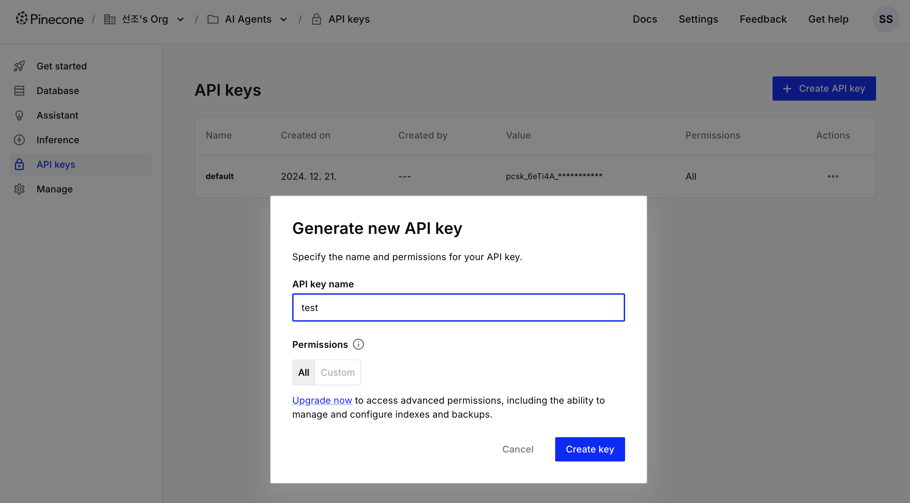
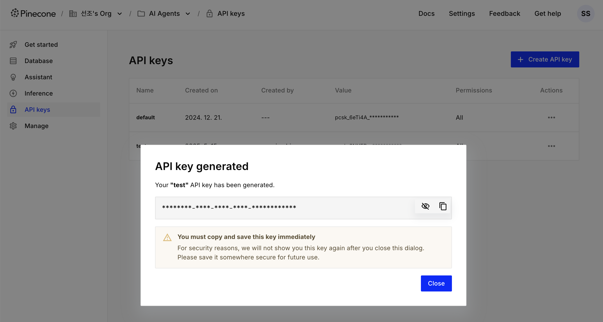
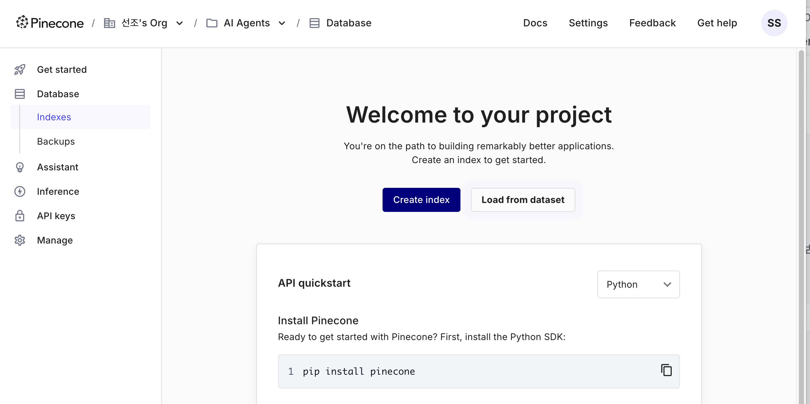
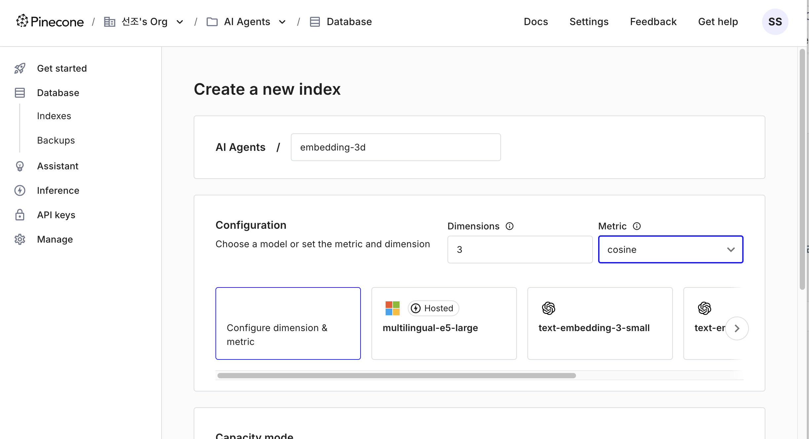
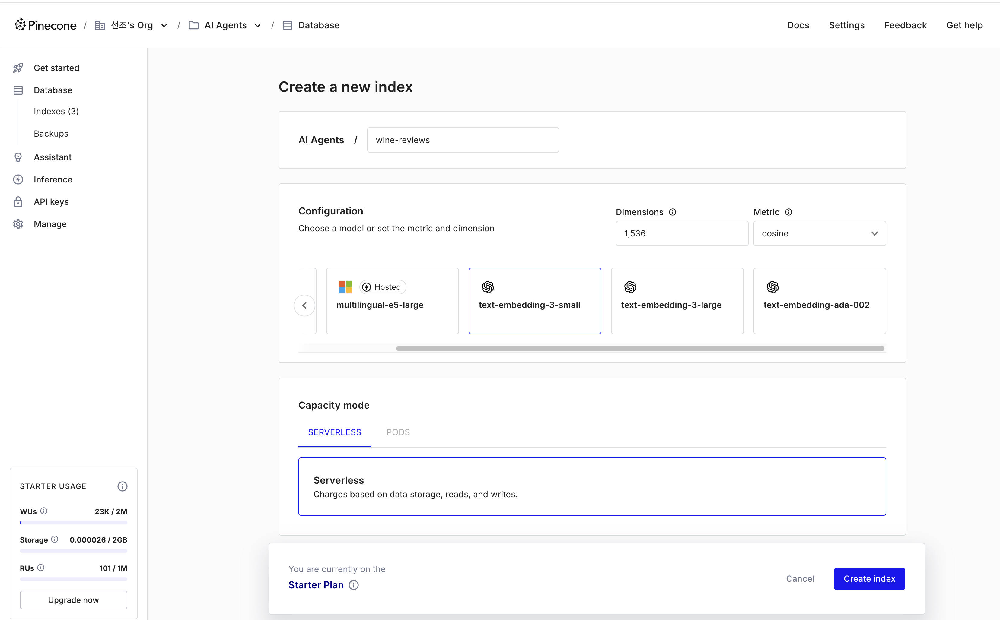

# LangChain Rag

## RAG이란 무엇인가?

Retrieval augmented generation (RAG)는 생성형 AI 애플리케이션의 대형 언어 모델(LLM)이 작업을 수행할 때 가장 관련 있고 컨텍스트에서 중요한 독점적, 비공개 또는 동적 데이터를 제공하여 정확성과 성능을 향상시키는 아키텍처입니다.

생성 AI에서 RAG는 사용자의 쿼리에 맞는 가장 컨텍스트에 관련성이 높은 결과를 데이터베이스에서 가져오는 기술입니다.

OpenAI의 ChatGPT와 Anthropic의 Claude와 같은 대형 언어 모델(LLM)을 기반으로 구축된 제품들은 뛰어나지만 몇 가지 단점을 가지고 있습니다:

- **정적입니다** - LLM은 "시간에 고정"되어 있으며 최신 정보를 포함하지 않습니다. 거대한 훈련 데이터셋을 업데이트하는 것은 현실적이지 않습니다.
- **도메인별 지식이 부족합니다** - LLM은 일반화된 작업을 위해 훈련되었기 때문에 회사의 비공개 데이터를 알지 못합니다.
- **"블랙 박스"로 작동합니다** - LLM이 결론에 도달할 때 어떤 소스를 고려했는지 이해하기 어렵습니다.
- **비효율적이고 생산 비용이 높습니다** - 파운데이션 모델을 생산하고 배포할 재정적, 인적 자원을 가진 조직은 거의 없습니다.

이러한 문제들은 LLM을 활용한 생성형 AI 애플리케이션의 정확성에 영향을 미칩니다. 챗봇 데모보다 더 까다로운 요구 사항을 가진 비즈니스 애플리케이션의 경우, 프롬프트 외에 수정 없이 "그대로" 사용된 LLM은 고객이 다음 비행기를 예약하는 데 도움을 주는 것과 같은 컨텍스트에 의존하는 작업에서 성능이 저조할 것입니다.


- LLM은 다음 예와 같이 Volvo XC60에 대한 도메인별 정보가 부족합니다.<br><br>


- 도메인별 독점 데이터를 사용하여 임베딩 모델로 벡터 데이터베이스 생성합니다.<br><br>


- RAG는 LLM이 더 정확한 응답을 생성할 수 있도록 관련 있고 시기적절한 컨텍스트를 검색하기 위해 의미론적 검색을 사용합니다.<br><br>


- RAG는 LLM의 컨텍스트 윈도우를 통해 도메인별 정보를 제공함으로써 환각의 가능성을 줄입니다.<br><br>


## RAG의 주요 컴포넌트


### 인덱싱:

데이터 소스에서 데이터를 가져와 인덱싱하는 파이프라인으로, 일반적으로 오프라인 작업을 수행합니다.

1. 데이터 로드: 먼저 데이터를 로드해야 합니다. 이는 일반적으로 Document Loaders를 사용하여 수행됩니다.
2. 텍스트 분리: 텍스트 분리기는 큰 문서를 더 작은 청크로 나눕니다. 이는 데이터를 인덱싱하거나 모델에 전달할 때 유용합니다. 큰 청크는 검색하기 어렵고 모델의 제한된 컨텍스트 윈도우 크기에 맞지 않기 때문입니다.
3. 벡터 저장: 나중에 검색할 수 있도록 분리된 청크를 저장하고 인덱싱할 장소가 필요합니다. 이는 VectorStore와 Embeddings 모델을 사용하여 수행됩니다.


### 검색과 생성

4. 벡터 검색: 사용자 입력이 주어지면, Retriever를 사용하여 저장소에서 관련된 청크를 검색합니다.
5. 답변 생성: ChatModel / LLM은 질문과 검색된 데이터를 포함하는 프롬프트를 사용하여 답변을 생성합니다.


## Vector Database


Vector Database는 벡터 형태로 데이터를 저장하고 검색하는 데이터베이스입니다. 주로 고차원 벡터 공간에서 유사한 항목을 빠르게 찾기 위해 사용됩니다.

다음은 Vector Database의 주요 특징과 사용 사례입니다:

주요 특징

1. 고차원 데이터 처리: 벡터 데이터는 일반적으로 고차원 공간에 위치하며, Vector Database는 이러한 데이터를 효율적으로 저장하고 검색할 수 있습니다. (https://www.pinecone.io/learn/a-developers-guide-to-ann-algorithms/)
2. 유사성 검색: 벡터 간의 유사성을 측정하여 가장 유사한 벡터를 빠르게 찾을 수 있습니다. 이는 코사인 유사도, 유클리드 거리 등을 사용하여 계산됩니다.
3. 확장성: 대규모 데이터셋을 처리할 수 있도록 설계되어 있으며, 분산 시스템을 통해 확장 가능합니다.
4. 실시간 검색: 실시간으로 유사한 벡터를 검색할 수 있어, 빠른 응답 시간이 요구되는 애플리케이션에 적합합니다.

사용 사례

1. 추천 시스템: 사용자 행동 데이터를 벡터로 변환하여 유사한 사용자나 아이템을 추천하는 데 사용됩니다.
2. 이미지 검색: 이미지 특징을 벡터로 변환하여 유사한 이미지를 검색하는 데 사용됩니다.
3. 자연어 처리: 문장을 벡터로 변환하여 유사한 문장을 찾거나, 문서 분류, 클러스터링 등에 사용됩니다.
4. 생물정보학: 유전자 서열을 벡터로 변환하여 유사한 서열을 찾는 데 사용됩니다.


이 표는 각 Vector Database의 주요 특징과 사용 사례, 확장성, 실시간 검색 지원 여부를 요약한 것입니다. 각 데이터베이스는 특정 사용 사례에 맞게 최적화되어 있으며, 필요에 따라 적절한 솔루션을 선택할 수 있습니다.

| 종류  | 주요 특징  | 사용 사례  | 확장성    | 실시간 검색 지원 여부 |
| ---- | ------- | -------- | ------- | -------------- |
| Pinecone      | 고성능, 분산형, 서버리스 지원                         | 추천 시스템, 이미지 검색, 자연어 처리, 생물정보학  | 매우 높음 | 지원 |
| FAISS         | Facebook AI가 개발한 라이브러리, 빠른 유사성 검색       | 이미지 검색, 추천 시스템, 문서 검색             | 제한적 | 제한적 |
| Milvus        | 오픈소스, 고성능, 분산형, 다양한 인덱싱 알고리즘 지원      | 추천 시스템, 이미지 검색, 비디오 검색, 자연어 처리 | 매우 높음 | 지원 |
| Annoy         | Spotify가 개발한 라이브러리, 메모리 효율적, 빠른 검      | 음악 추천, 이미지 검색, 유사 항목 검색           | 제한적 | 제한적 |
| Elasticsearch | 텍스트 검색에 강점, 벡터 검색 기능 추가                 | 로그 분석, 텍스트 검색, 추천 시스템              | 높음 | 지원  |
| Weaviate      | 오픈소스, 그래프 데이터베이스와 통합, 다양한 데이터 타입 지원 | 추천 시스템, 지식 그래프, 자연어 처리            | 높음 | 지원  |


### Pinecone

Pinecone는 고성능 벡터 검색 및 유사성 검색을 위한 완전 관리형 인덱싱 및 검색 서비스입니다. 주로 머신 러닝 및 인공지능 애플리케이션에서 사용되며, 대규모 데이터셋에서 유사한 항목을 빠르게 찾는 데 유용합니다.

Pinecone는 다음과 같은 주요 기능을 제공합니다:

1. 벡터 인덱싱: 고차원 벡터를 효율적으로 인덱싱하여 빠른 검색을 가능하게 합니다.
2. 유사성 검색: 유사한 항목을 빠르게 찾기 위해 다양한 유사성 측정 방법을 지원합니다.
3. 확장성: 대규모 데이터셋을 처리할 수 있도록 설계되어 있으며, 필요에 따라 자동으로 확장됩니다.
4. 완전 관리형 서비스: 인프라 관리 없이 쉽게 사용할 수 있습니다.

Pinecone는 주로 추천 시스템, 이미지 검색, 자연어 처리 등 다양한 애플리케이션에서 사용됩니다.

[Pinecone](https://www.pinecone.io/)

회원가입 후 API Key 생성하고 복사해서 .env 파일에 입력








## 환경설정 파일 생성 및 테스트

`.env 파일 생성`
```
OPENAI API_KEY=xxxxxxxxxxxxxxxxxxx 
PINECONE API_KEY=xxxxxxxxxxxxxxxxxxx
```

`00_config_test.py`
```
from dotenv import load_dotenv
import os

load_dotenv()
print(f"OPENAI_API_KEY: {os.getenv('OPENAI_API_KEY')}")
print(f"PINECONE_API_KEY: {os.getenv('PINECONE_API_KEY')}")
```

### 주요 패키지 설치

```python
pip install -qU python-dotenv
# -q: "quiet" 모드
# -U: "upgrade"의 의미로, 이미 설치된 패키지가 있다면 최신 버전으로 업그레이드
```

```python
pip install -qU langchain langchain-community langchain-openai langchain-pinecone
```

```python
pip install -qU pinecone-client
```

```python
pip install -qU pandas matplotlib tqdm ipywidgets
```

### 환경변수 설정


```python
from dotenv import load_dotenv
import os

# .env 파일에서 환경 변수를 로드합니다.
load_dotenv()

# 환경 변수에서 PINECONE_API_KEY를 가져옵니다.
PINECONE_API_KEY = os.getenv('PINECONE_API_KEY')
```

### Pinecone 클라이언트 초기화

```python
from pinecone import Pinecone

# Pinecone 클라이언트를 초기화합니다.
# PINECONE_API_KEY는 환경 변수에서 가져온 API 키입니다.
pc = Pinecone(api_key=PINECONE_API_KEY)
```

### 레코드 업서트(Upsert)

**"업서트(Upsert)"는 "Update"와 "Insert"의 합성어**
특정 레코드가 데이터베이스에 이미 존재하면 해당 레코드를 업데이트(Update), 레코드가 존재하지 않으면 새로운 레코드를 삽입(Insert)

```python
# "embedding-3d"라는 이름의 인덱스를 초기화합니다.
index = pc.Index("embedding-3d")

# 인덱스의 통계 정보를 설명하는 메서드를 호출하고, 그 결과를 출력합니다.
# 인덱스의 통계 정보에는 인덱스에 저장된 벡터의 수, 차원, 메타데이터 등의 정보가 포함될 수 있습니다.
index.describe_index_stats()
```

    {'dimension': 3,
     'index_fullness': 0.0,
     'namespaces': {},
     'total_vector_count': 0}


```python
# 벡터를 인덱스에 업서트(upsert)합니다.
# "embedding-3d-ns1" 네임스페이스에 벡터를 추가합니다.
index.upsert(
    vectors=[
        {
            "id": "vec1",
            "values": [1.0, 1.5, 2.0],
            "metadata": {"genre": "drama"}
        }, {
            "id": "vec2",
            "values": [2.0, 1.0, 0.5],
            "metadata": {"genre": "action"}
        }, {
            "id": "vec3",
            "values": [0.1, 0.3, 0.5],
            "metadata": {"genre": "drama"}
        }, {
            "id": "vec4",
            "values": [1.0, 2.5, 3.5],
            "metadata": {"genre": "action"}
        }, {
            "id": "vec5",
            "values": [3.0, 1.2, 1.3],
            "metadata": {"genre": "action"}
        }, {
            "id": "vec6",
            "values": [0.3, 1.1, 2.5],
            "metadata": {"genre": "drama"}
        }
    ],
    namespace="embedding-3d-ns1"
)
```

    {'upserted_count': 6}


### 쿼리하기

```python
# 주어진 벡터와 유사한 상위 k개의 항목을 쿼리하여 응답을 반환합니다.
# namespace (str): 쿼리할 네임스페이스 이름.
# vector (list): 쿼리에 사용할 벡터.
# top_k (int): 반환할 상위 k개의 항목 수.
# include_values (bool): 응답에 벡터 값을 포함할지 여부.
# include_metadata (bool): 응답에 메타데이터를 포함할지 여부.
response = index.query(
    namespace="embedding-3d-ns1",
    vector=[0.1, 0.3, 0.7],
    top_k=3,
    include_values=True,
    include_metadata=True
)

print(response)
```

    {'matches': [{'id': 'vec6',
                  'metadata': {'genre': 'drama'},
                  'score': 0.999730587,
                  'values': [0.3, 1.1, 2.5]},
                 {'id': 'vec3',
                  'metadata': {'genre': 'drama'},
                  'score': 0.990267396,
                  'values': [0.1, 0.3, 0.5]},
                 {'id': 'vec4',
                  'metadata': {'genre': 'action'},
                  'score': 0.972905517,
                  'values': [1.0, 2.5, 3.5]}],
     'namespace': 'embedding-3d-ns1',
     'usage': {'read_units': 6}}


```python
# 주어진 벡터와 유사한 상위 k개의 항목을 필터 조건으로 쿼리하여 응답을 반환합니다.
# filter (dict): 쿼리할 벡터의 필터 조건.
response = index.query(
    namespace="embedding-3d-ns1",
    vector=[0.1, 0.3, 0.7],
    top_k=3,
    include_values=True,
    include_metadata=True,
    filter={
        "genre": {"$eq": "drama"}
    }
)

print(response)
```

    {'matches': [{'id': 'vec6',
                  'metadata': {'genre': 'drama'},
                  'score': 0.998498499,
                  'values': [0.3, 1.1, 2.5]},
                 {'id': 'vec3',
                  'metadata': {'genre': 'drama'},
                  'score': 0.987675,
                  'values': [0.1, 0.3, 0.5]},
                 {'id': 'vec1',
                  'metadata': {'genre': 'drama'},
                  'score': 0.940560639,
                  'values': [1.0, 1.5, 2.0]}],
     'namespace': 'embedding-3d-ns1',
     'usage': {'read_units': 6}}


```python
# embedding-3d-ns1 네임스페이스의 모든 레코드 id를 조회합니다.
for ids in index.list(namespace='embedding-3d-ns1'):
    print(ids)
```

    ['vec1', 'vec2', 'vec3', 'vec4', 'vec5', 'vec6']


```python
# 지정된 네임스페이스(embedding-3d-ns1)에 있는 모든 ID를 리스트 형태로 반환합니다.
for ids in index.list(namespace='embedding-3d-ns1'):
# 주어진 ID와 네임스페이스에 해당하는 벡터 데이터를 가져옵니다.
# 반환된 데이터는 딕셔너리 형태이며, 그 중에서 'vectors' 키에 해당하는 값을 vectors 변수에 저장합니다.
    vectors = index.fetch(ids, namespace='embedding-3d-ns1')['vectors']

print(vectors.values())
```

    dict_values([
        {'id': 'vec5', 'metadata': {'genre': 'action'}, 'values': [3.0, 1.2, 1.3]}, 
        {'id': 'vec6', 'metadata': {'genre': 'drama'}, 'values': [0.3, 1.1, 2.5]}, 
        {'id': 'vec3', 'metadata': {'genre': 'drama'}, 'values': [0.1, 0.3, 0.5]}, 
        {'id': 'vec4', 'metadata': {'genre': 'action'}, 'values': [1.0, 2.5, 3.5]}, 
        {'id': 'vec1', 'metadata': {'genre': 'drama'}, 'values': [1.0, 1.5, 2.0]}, 
        {'id': 'vec2', 'metadata': {'genre': 'action'}, 'values': [2.0, 1.0, 0.5]}])


```python
# ids: 벡터 데이터에서 추출한 ID 리스트.
# values: 벡터 데이터에서 추출한 값 리스트.

ids = [v['id'] for v in vectors.values()]
values = [v['values'] for v in vectors.values()]

print(ids + ['query_vector'])
print(values + [[0.1, 0.3, 0.7]])
```

    ['vec5', 'vec6', 'vec3', 'vec4', 'vec1', 'vec2', 'query_vector']
    [[3.0, 1.2, 1.3], [0.3, 1.1, 2.5], [0.1, 0.3, 0.5], [1.0, 2.5, 3.5], [1.0, 1.5, 2.0], [2.0, 1.0, 0.5], [0.1, 0.3, 0.7]]


### 서버리스 인덱스 생성

```python
index_name = "quickstart"

# Pinecone에 있는 모든 인덱스를 순회합니다.
for idx in pc.list_indexes():
# 인덱스 이름이 "quickstart"와 일치하는 경우 해당 인덱스를 삭제합니다.
    if idx.name == index_name:
        pc.delete_index(idx.name)
```


```python
from pinecone import ServerlessSpec

# Pinecone 인덱스를 생성합니다.
# 인덱스 이름은 "quickstart"이고, 차원은 1024, 메트릭은 코사인 유사도를 사용합니다.
# 인덱스는 AWS의 us-east-1 리전에서 서버리스 사양으로 생성됩니다.
pc.create_index(
    name=index_name,
    dimension=1024,
    metric="cosine",
    spec=ServerlessSpec(
        cloud="aws",
        region="us-east-1"
    )
)
```


```python
# Pinecone 클라이언트를 사용하여 현재 사용 가능한 모든 인덱스의 목록을 반환합니다.
pc.list_indexes()
```

    {'indexes': [{'deletion_protection': 'disabled',
                  'dimension': 1536,
                  'host': 'wine-reviews-szyj9c0.svc.aped-4627-b74a.pinecone.io',
                  'metric': 'cosine',
                  'name': 'wine-reviews',
                  'spec': {'serverless': {'cloud': 'aws', 'region': 'us-east-1'}},
                  'status': {'ready': True, 'state': 'Ready'}},
                 {'deletion_protection': 'disabled',
                  'dimension': 1024,
                  'host': 'quickstart-szyj9c0.svc.aped-4627-b74a.pinecone.io',
                  'metric': 'cosine',
                  'name': 'quickstart',
                  'spec': {'serverless': {'cloud': 'aws', 'region': 'us-east-1'}},
                  'status': {'ready': True, 'state': 'Ready'}},
                 {'deletion_protection': 'disabled',
                  'dimension': 1536,
                  'host': 'wiki-szyj9c0.svc.aped-4627-b74a.pinecone.io',
                  'metric': 'cosine',
                  'name': 'wiki',
                  'spec': {'serverless': {'cloud': 'aws', 'region': 'us-east-1'}},
                  'status': {'ready': True, 'state': 'Ready'}},
                 {'deletion_protection': 'disabled',
                  'dimension': 3,
                  'host': 'embedding-3d-szyj9c0.svc.aped-4627-b74a.pinecone.io',
                  'metric': 'cosine',
                  'name': 'embedding-3d',
                  'spec': {'serverless': {'cloud': 'aws', 'region': 'us-east-1'}},
                  'status': {'ready': True, 'state': 'Ready'}},
                 {'deletion_protection': 'disabled',
                  'dimension': 1024,
                  'host': 'sample-movies-szyj9c0.svc.aped-4627-b74a.pinecone.io',
                  'metric': 'cosine',
                  'name': 'sample-movies',
                  'spec': {'serverless': {'cloud': 'aws', 'region': 'us-east-1'}},
                  'status': {'ready': True, 'state': 'Ready'}}]}


### 임베딩 벡터 생성

Pinecone에서 레코드 id는 각 벡터를 고유하게 식별하는 데 사용됩니다.

Pinecone에서 id에 대한 주요 제약사항은 다음과 같습니다:

- 고유성: 각 벡터의 id는 인덱스 내에서 고유해야 합니다.
- 문자열 형식: id는 문자열 형태여야 합니다.
- 길이 제한: id의 최대 길이는 512바이트입니다.
- 허용 문자: id에는 영숫자, -, \_, #, :를 사용할 수 있습니다.
- 대소문자 구분: id는 대소문자를 구분합니다.
- 공백 불가: id에는 공백을 포함할 수 없습니다

이러한 제약사항들은 Pinecone 시스템에서 벡터를 효율적으로 관리하고 검색할 수 있도록 하기 위해 설계되었습니다. id를 생성할 때 이러한 규칙을 준수하면 Pinecone 인덱스와 원활하게 작업할 수 있습니다.


```python
data = [
    {"id": "vec1", "text": "사과는 달콤하고 아삭한 식감으로 유명한 인기 있는 과일입니다."},
    {"id": "vec2", "text": "애플이라는 기술 회사는 아이폰과 같은 혁신적인 제품으로 유명합니다."},
    {"id": "vec3", "text": "많은 사람들이 건강한 간식으로 사과를 즐겨 먹습니다."},
    {"id": "vec4", "text": "애플 주식회사는 세련된 디자인과 사용자 친화적인 인터페이스로 기술 산업을 혁신했습니다."},
    {"id": "vec5", "text": "하루에 사과 하나면 의사를 멀리할 수 있다는 속담이 있습니다."},
    {"id": "vec6", "text": "애플 컴퓨터 회사는 1976년 4월 1일 스티브 잡스, 스티브 워즈니악, 로널드 웨인에 의해 파트너십으로 설립되었습니다."}
]
```

multilingual-e5-large 임베딩 모델

- 마이크로소프트가 만든 1024 차원을 가진 고성능의 오픈소스 다국어 임베딩 모델입니다.
- 코사인 메트릭을 사용하고, 입력 토큰으로 최대 507개를, 최대 96번의 배치 처리를 허용합니다.
- 지저분한 데이터에서도 잘 작동하고, 짧은 쿼리에 대해 중간 길이의 텍스트 단락(1-2 단락)을 반환하는 데 적합합니다.


```python
# 텍스트 데이터를 임베딩 벡터로 변환합니다.
# inputs 매개변수는 임베딩할 텍스트 데이터를 지정합니다. data 리스트의 각 항목에서 'text' 키에 해당하는 값을 추출하여 리스트로 만듭니다.
# parameters 매개변수는 추가적인 파라미터를 지정합니다.
# "input_type"은 입력 데이터의 유형을 지정합니다. "passage"는 입력 데이터가 문단 또는 긴 텍스트 조각임을 나타냅니다.
# 이는 모델이 입력 데이터를 처리하는 방식을 결정하는 데 사용됩니다.
# "truncate"는 입력 데이터가 모델의 최대 길이를 초과할 경우 어떻게 처리할지를 지정합니다. "END"는 입력 데이터가 너무 길 경우 끝부분을
# 잘라내는(truncate) 방식을 의미합니다. 즉, 입력 데이터의 앞부분은 유지하고 뒷부분을 잘라내어 모델의 최대 길이에 맞춥니다.
embeddings = pc.inference.embed(
    model='multilingual-e5-large',
    inputs=[d['text'] for d in data],
    parameters={"input_type": "passage", "truncate": "END"}
)

# 첫 번째 임베딩 벡터를 출력합니다.
print(embeddings[0])
print(len(embeddings[0]['values']))
```

    {'values': [0.030059814453125, -0.0205535888671875, ..., -0.0302581787109375, 0.02410888671875]}
    1024


### 레코드 업서트(Upsert)

```python
import time
index_name = "quickstart"

# 인덱스가 준비될 때까지 대기합니다.
while not pc.describe_index(index_name).status['ready']:
    time.sleep(1)

# 인덱스를 초기화합니다.
index = pc.Index(index_name)

# 벡터 리스트를 초기화합니다.
vectors = []
for d, e in zip(data, embeddings):
    # 각 데이터와 임베딩을 결합하여 벡터를 생성합니다.
    vectors.append({
        "id": d['id'],
        "values": e['values'],
        "metadata": {"text": d['text']}
    })

# 벡터를 인덱스에 업서트(upsert)합니다. quickstart_ns1 네임스페이스에 벡터를 추가합니다.
index.upsert(
    vectors=vectors,
    namespace='quickstart_ns1'
)
```

    {'upserted_count': 6}


### 인덱스 통계 정보 확인

```python
# Pinecone 인덱스의 통계 정보를 설명하는 메서드를 호출하고, 그 결과를 출력합니다.
# 인덱스의 통계 정보에는 인덱스에 저장된 벡터의 수, 차원, 메타데이터 등의 정보가 포함될 수 있습니다.
index.describe_index_stats()
```

    {'dimension': 1024,
     'index_fullness': 0.0,
     'namespaces': {'quickstart_ns1': {'vector_count': 6}},
     'total_vector_count': 6}


### 쿼리(Query)

#### 쿼리 벡터 생성

```python
# 쿼리 텍스트를 정의합니다.
query = "애플이라는 기술 회사에 대해 알려주세요."

# 쿼리 텍스트를 임베딩 벡터로 변환합니다.
# 입력 타입을 쿼리로 설정합니다.
embedding = pc.inference.embed(
    model='multilingual-e5-large',
    inputs=[query],
    parameters={"input_type": "query"}
)

# 첫 번째 임베딩 벡터를 출력합니다.
print(embedding[0])
```

    {'values': [0.01128387451171875, -0.017608642578125, ..., -0.02032470703125, -0.006984710693359375]}


#### 유사 벡터 검색 쿼리 실행

```python
# ns1 네임스페이스에서 쿼리 벡터와 유사한 상위 3개의 벡터를 검색합니다.
# 검색 결과에는 벡터 값은 포함되지 않고 메타데이터만 포함됩니다.
results = index.query(
    namespace="quickstart_ns1",
    vector=embedding[0]['values'],
    top_k=3,
    include_values=False,
    include_metadata=True
)

# 검색 결과를 출력합니다.
results
```

    {'matches': [{'id': 'vec2',
                  'metadata': {'text': '애플이라는 기술 회사는 아이폰과 같은 혁신적인 제품으로 유명합니다.'},
                  'score': 0.896300793,
                  'values': []},
                 {'id': 'vec4',
                  'metadata': {'text': '애플 주식회사는 세련된 디자인과 사용자 친화적인 인터페이스로 기술 산업을 '
                                       '혁신했습니다.'},
                  'score': 0.884069443,
                  'values': []},
                 {'id': 'vec6',
                  'metadata': {'text': '애플 컴퓨터 회사는 1976년 4월 1일 스티브 잡스, 스티브 워즈니악, '
                                       '로널드 웨인에 의해 파트너십으로 설립되었습니다.'},
                  'score': 0.867699087,
                  'values': []}],
     'namespace': 'quickstart_ns1',
     'usage': {'read_units': 6}}


### 환경변수 설정


```python
from dotenv import load_dotenv
import os

load_dotenv()

OPENAI_API_KEY = os.environ['OPENAI_API_KEY']
PINECONE_API_KEY = os.environ['PINECONE_API_KEY']
```

### Pinecone 클라이언트 초기화


```python
from pinecone import Pinecone, ServerlessSpec

# Pinecone 클라이언트를 초기화합니다.
# PINECONE_API_KEY는 환경 변수에서 가져온 API 키입니다.
pc = Pinecone(api_key=PINECONE_API_KEY)
```

### 서버리스 인덱스 생성

```python
index_name = "wiki"

# Pinecone에 있는 모든 인덱스를 순회합니다.
for idx in pc.list_indexes():
    # 인덱스 이름이 "wiki"와 일치하는 경우 해당 인덱스를 삭제합니다.
    if idx.name == index_name:
        pc.delete_index(idx.name)
```


```python
# Pinecone 인덱스를 생성합니다.
# 인덱스 이름은 "wiki"이고, 차원은 1536, 메트릭은 코사인 유사도를 사용합니다.
# 인덱스는 AWS의 us-east-1 리전에서 서버리스 사양으로 생성됩니다.
pc.create_index(
    name=index_name,
    dimension=1536,  # 모델 차원
    metric="cosine",  # 모델 메트릭
    spec=ServerlessSpec(
        cloud="aws",
        region="us-east-1"
    )
)
```


```python
# Pinecone 클라이언트를 사용하여 현재 사용 가능한 모든 인덱스의 목록을 반환합니다.
pc.list_indexes()
```

    {'indexes': [{'deletion_protection': 'disabled',
                  'dimension': 1536,
                  'host': 'wiki-dob4bs2.svc.aped-4627-b74a.pinecone.io',
                  'metric': 'cosine',
                  'name': 'wiki',
                  'spec': {'serverless': {'cloud': 'aws', 'region': 'us-east-1'}},
                  'status': {'ready': True, 'state': 'Ready'}},
                 {'deletion_protection': 'disabled',
                  'dimension': 3,
                  'host': 'embedding-3d-dob4bs2.svc.aped-4627-b74a.pinecone.io',
                  'metric': 'cosine',
                  'name': 'embedding-3d',
                  'spec': {'serverless': {'cloud': 'aws', 'region': 'us-east-1'}},
                  'status': {'ready': True, 'state': 'Ready'}},
                 {'deletion_protection': 'disabled',
                  'dimension': 1024,
                  'host': 'quickstart-dob4bs2.svc.aped-4627-b74a.pinecone.io',
                  'metric': 'cosine',
                  'name': 'quickstart',
                  'spec': {'serverless': {'cloud': 'aws', 'region': 'us-east-1'}},
                  'status': {'ready': True, 'state': 'Ready'}}]}


```python
# 'wiki' 인덱스를 가져옵니다.
index = pc.Index(index_name)

# 인덱스의 통계 정보를 설명합니다.
index.describe_index_stats()
```

    {'dimension': 1536,
     'index_fullness': 0.0,
     'namespaces': {},
     'total_vector_count': 0}

### 임베딩 객체 생성

```python
from langchain_openai import OpenAIEmbeddings

# OpenAIEmbeddings 클래스를 초기화합니다.
# OPENAI_API_KEY는 환경 변수에서 가져온 API 키입니다.
embedding = OpenAIEmbeddings(model="text-embedding-3-small", api_key=OPENAI_API_KEY)
```

### 텍스트 분할

```python
pip install -qU datasets
```

```python
from datasets import load_dataset

# 'wikipedia' 데이터셋의 '20220301.simple' 버전을 로드합니다.
# 데이터셋의 'train' 스플릿에서 처음 100개의 샘플을 가져옵니다.
# trust_remote_code=True는 원격 코드 실행을 신뢰한다는 의미입니다.
data = load_dataset("wikipedia", "20220301.simple", split="train[:100]", trust_remote_code=True)
print(data)
```

    Dataset({
        features: ['id', 'url', 'title', 'text'],
        num_rows: 100
    })


```python
for record in data:
    print(record)
```

    {'id': '17', 'url': 'https://simple.wikipedia.org/wiki/Adobe%20Illustrator', 'title': 'Adobe Illustrator', 'text': 'Adobe Illustrator is a computer program for making graphic design and illustrations. It is made by Adobe Systems. Pictures created in Adobe Illustrator can be made bigger or smaller, and look exactly the same at any size. It works well with the rest of the products with the Adobe name.\n\nHistory\nIt was first released in 1986 for the Apple Macintosh. The latest version is Adobe Illustrator CS6, part of Creative Suite 6.\n\nRelease history\n\nReferences\n\nVector graphics editors\nAdobe software'}
    {'id': '18', 'url': 'https://simple.wikipedia.org/wiki/Andouille', 'title': 'Andouille', 'text': 'Andouille is a type of pork sausage. It is spicy (hot in taste) and smoked. There are different kinds, all with different combinations of pork meat, fat, intestines (tubes going to the stomach), and tripe (the wall of the stomach).\n\nOther sorts are "French andouille" and "German andouille"; they are less spicy than Cajun. Cajun has extra salt, black pepper, and garlic. Andouille makers smoke the sausages over pecan wood and sugar cane for a maximum of seven or eight hours, at about 175 degrees Fahrenheit (80 degrees Celsius).\n\nSausage'}
    {'id': '182', 'url': 'https://simple.wikipedia.org/wiki/Cost%20of%20living', 'title': 'Cost of living', 'text': 'Cost of living is the amount of money it costs just to live in a certain place.  It includes food, housing, etc.\n\nEconomics'}
    ...


```python
from langchain.text_splitter import RecursiveCharacterTextSplitter

# RecursiveCharacterTextSplitter를 초기화합니다.
# 이 클래스는 텍스트를 재귀적으로 문자 단위로 분할합니다.
splitter = RecursiveCharacterTextSplitter(
    chunk_size=400,  # 분할할 텍스트의 크기
    chunk_overlap=20,  # 분할된 텍스트의 중첩 크기
    length_function=len,  # 텍스트 길이를 계산하는 함수
    separators=["\n\n", "\n", " ", ""]  # 분할할 텍스트의 구분자
)
```

### 레코드 업서트(Upsert)

```python
from tqdm.auto import tqdm
from uuid import uuid4
import time

batch_size = 100
texts = []
metas = []
count = 0

# 데이터셋의 각 샘플에 대해 반복합니다.
for i, sample in enumerate(tqdm(data)):

    full_text = sample["text"] # Wikipedia 문서 텍스트
    metadata = {
        'wiki_id': str(sample["id"]),  # Wikipedia 문서 ID
        'url': sample["url"],  # Wikipedia 문서 URL
        'title': sample["title"],  # Wikipedia 문서 제목
    }


    chunks = splitter.split_text(full_text)  # 텍스트를 청크로 분할합니다.
    # print(len(chunks))

    # 각 청크에 대해 반복합니다.
    for i, chunk in enumerate(chunks):
        record = {
            'chunk_id': i,  # 청크 ID
            'full_text': full_text,  # 전체 텍스트
            **metadata,  # 메타데이터 언패킹
        }

        texts.append(chunk)  # 청크를 텍스트 목록에 추가합니다.
        metas.append(record)  # 메타데이터를 메타데이터 목록에 추가합니다.

        count += 1  # 처리된 청크 수를 증가시킵니다.

        # batch_size만큼의 청크를 처리할 때마다 청크를 Pinecone 인덱스에 추가합니다.
        if count % batch_size == 0:
            # Pinecone 인덱스에 청크를 추가합니다.
            ids = [str(uuid4()) for _ in range(len(texts))]
            embeddings = embedding.embed_documents(texts)
            index.upsert(
                vectors=zip(ids, embeddings, metas),
                namespace="wiki-ns1")
            # 청크 목록과 메타데이터 목록을 비웁니다.
            texts = []
            metas = []
            # 1초 대기합니다.
            time.sleep(1)

```

      0%|          | 0/100 [00:00<?, ?it/s]


### 환경변수 설정


```python
from dotenv import load_dotenv
import os

load_dotenv()

OPENAI_API_KEY = os.environ['OPENAI_API_KEY']
PINECONE_API_KEY = os.environ['PINECONE_API_KEY']
```

### Pinecone 클라이언트 초기화

```python
from pinecone import Pinecone

# Pinecone 클라이언트를 초기화합니다.
# PINECONE_API_KEY는 환경 변수에서 가져온 API 키입니다.
pc = Pinecone(api_key=PINECONE_API_KEY)
```


```python
# Pinecone 클라이언트를 사용하여 현재 사용 가능한 모든 인덱스의 목록을 반환합니다.
pc.list_indexes()
```

    {'indexes': [{'deletion_protection': 'disabled',
                  'dimension': 1536,
                  'host': 'wiki-dob4bs2.svc.aped-4627-b74a.pinecone.io',
                  'metric': 'cosine',
                  'name': 'wiki',
                  'spec': {'serverless': {'cloud': 'aws', 'region': 'us-east-1'}},
                  'status': {'ready': True, 'state': 'Ready'}},
                 {'deletion_protection': 'disabled',
                  'dimension': 3,
                  'host': 'embedding-3d-dob4bs2.svc.aped-4627-b74a.pinecone.io',
                  'metric': 'cosine',
                  'name': 'embedding-3d',
                  'spec': {'serverless': {'cloud': 'aws', 'region': 'us-east-1'}},
                  'status': {'ready': True, 'state': 'Ready'}},
                 {'deletion_protection': 'disabled',
                  'dimension': 1024,
                  'host': 'quickstart-dob4bs2.svc.aped-4627-b74a.pinecone.io',
                  'metric': 'cosine',
                  'name': 'quickstart',
                  'spec': {'serverless': {'cloud': 'aws', 'region': 'us-east-1'}},
                  'status': {'ready': True, 'state': 'Ready'}}]}

```python
# 사용할 인덱스 이름을 지정합니다.
index_name = "wiki"

# 지정한 이름으로 Pinecone 인덱스를 가져옵니다.
index = pc.Index(index_name)

# 인덱스의 통계 정보를 설명합니다.
index.describe_index_stats()
```

    {'dimension': 1536,
     'index_fullness': 0.0,
     'namespaces': {'wiki-ns1': {'vector_count': 1500}},
     'total_vector_count': 1500}

### 검색하기 (Pinecone)

```python
from langchain_openai import OpenAIEmbeddings

# OpenAIEmbeddings 객체를 초기화합니다.
# 모델은 "text-embedding-3-small"을 사용하고, API 키는 OPENAI_API_KEY를 사용합니다.
embedding = OpenAIEmbeddings(model="text-embedding-3-small", api_key=OPENAI_API_KEY)

# 질문 리스트를 정의합니다.
question = ["벨기에(Belgium)는 어디 있나요?"]

# 질문을 임베딩하여 벡터로 변환합니다.
embedded_question = embedding.embed_documents(question)

# 임베딩된 질문 벡터를 출력합니다.
print(embedded_question)
```

    [[-0.03147738426923752, 0.021170910447835922, 0.0714610368013382, 0.027771687135100365, -0.06320743262767792, -0.023644885048270226, -0.01403322909027338, 0.04215232655405998, -0.030277244746685028, -0.03490936756134033, -0.02360277622938156, 0.022297358140349388, -0.008316767401993275, -0.04728977009654045, -0.010832852683961391, 0.03743598237633705, -0.04973216354846954, 0.03438299149274826, 0.010506498627364635, 0.0011705324286594987, -0.027161089703440666, -0.019244369119405746, -0.04623701795935631, 0.03318284824490547, 0.04408939555287361, 0.00933267641812563, 0.010053813457489014, -0.04305769503116608, 0.004926895257085562, -0.038951948285102844, 0.021897312253713608, -0.037941303104162216, -0.0008757608593441546, -0.021065635606646538, -0.00022864530910737813, -0.004711080342531204, 0.014875433407723904, -0.05276409909129143, 0.03333023563027382, 0.01184349786490202, -0.029287654906511307, -0.026529435068368912, 0.024234429001808167, 0.02806645818054676, -0.01783367618918419, 0.015917660668492317, -0.0428260900080204, 0.000942216080147773, -0.008300975896418095, 0.027898017317056656, 0.04800564423203468, 0.029350820928812027, -0.012959418818354607, 0.003324075136333704, -0.029287654906511307, 0.01811791956424713, -0.007379815448075533, -0.017612596973776817, 0.02951926179230213, 0.015349173918366432, 0.037078045308589935, 0.016686173155903816, -0.01620190590620041, -0.00282664829865098, 0.008300975896418095, 0.009622184559702873, -0.009169499389827251, 0.002077875891700387, 0.026887372136116028, -0.008653649128973484, 0.01916014775633812, 0.041078515350818634, 0.002381859114393592, -0.030951008200645447, -0.03280385583639145, 0.03749914839863777, 0.029835088178515434, -0.0198654942214489, -0.04598435387015343, -0.012906781397759914, -0.0345093198120594, -0.008948421105742455, 0.0030398310627788305, -0.026971593499183655, 0.008274657651782036, -0.026297830045223236, -0.031687937676906586, 0.04015209153294563, 0.018475856631994247, 0.01635981909930706, -0.008279921486973763, -0.02575039677321911, -0.04396306350827217, 0.052637770771980286, 0.017517849802970886, 0.05625924840569496, 0.010885491035878658, -0.02168676070868969, -0.03438299149274826, 0.007121890317648649, 0.0224868543446064, -0.02787696197628975, -0.0027871697675436735, -0.014233252964913845, 0.03052990697324276, -0.010285420343279839, 0.04463682696223259, 0.053901076316833496, -0.018644297495484352, -0.02794012799859047, -0.08207280933856964, 0.021602541208267212, 0.00844309851527214, 0.026697875931859016, -0.01583344116806984, -0.015454448759555817, 0.033688172698020935, 0.004847938660532236, 0.01437011081725359, 0.0025924101937562227, 0.033835556358098984, 0.06986084580421448, 0.02646627090871334, -0.05419584736227989, -0.02193942293524742, -0.004632123745977879, -0.007169264368712902, 0.0056901429779827595, 0.006637622602283955, -0.013296300545334816, 0.04947950318455696, -0.009390577673912048, 0.006679732818156481, 0.008758924901485443, 0.009806415997445583, -0.0029029729776084423, 0.006516555789858103, 0.0446789376437664, -0.025960948318243027, 0.004650546703487635, -0.05116391181945801, 0.013517378829419613, 0.09062118083238602, -0.013780567795038223, -0.008922101929783821, 0.053437862545251846, -0.03198270872235298, 0.03364606201648712, 0.06977662444114685, -0.006011233199387789, -0.0037636004853993654, 0.013148915022611618, 0.044805269688367844, 0.004155751783400774, 0.021391989663243294, -0.02193942293524742, -0.0034030317328870296, 0.0680922195315361, 0.0041978619992733, 0.01460171677172184, -0.015180733054876328, 0.01042754203081131, 0.02282373607158661, -0.03423560410737991, 0.0015620257472619414, 0.06463918089866638, -0.028845498338341713, 0.03672010824084282, 0.018907487392425537, -0.01161189191043377, -0.005848056171089411, -0.03198270872235298, 0.027287419885396957, 0.009095806628465652, 0.003426718758419156, 0.0024831867776811123, 0.010738104581832886, 0.03046674095094204, -0.02488713711500168, 0.022528965026140213, -0.032488029450178146, 0.04232076555490494, 0.043331410735845566, 0.0008665492641739547, -0.01836005412042141, 0.07790389657020569, 0.005313782952725887, -0.00034247449366375804, -0.05794365704059601, 0.00197128439322114, -0.026424160227179527, 0.017328353598713875, 0.029919307678937912, 0.007464035879820585, -0.01184349786490202, -0.021276187151670456, 0.03126683458685875, -0.04257342591881752, 0.006095453631132841, 0.02448708936572075, -0.031140504404902458, 0.016738809645175934, 0.004468946717679501, -0.017570488154888153, -0.02421337366104126, 0.008364141918718815, 0.03998364880681038, 0.012222490273416042, 0.06329165399074554, 0.008506263606250286, -0.023897547274827957, -0.02144462801516056, -0.004150487948209047, -0.014127977192401886, 0.012748867273330688, 0.02520296350121498, -0.010285420343279839, -0.0016265070298686624, 0.046321235597133636, 0.03893089294433594, -0.027434805408120155, 8.882623660610989e-05, 0.06207045912742615, 0.029477151110768318, -0.06577615439891815, 0.038678232580423355, 0.0016988839488476515, -0.02091825008392334, -0.004032053053379059, 0.0406574122607708, -0.01492807175964117, -0.04935317113995552, 0.0032398547045886517, -0.01653878763318062, -0.01323313545435667, 0.03509886562824249, -0.012032994069159031, -0.01706516556441784, 0.0206445325165987, 0.013696347363293171, 0.01829688809812069, 0.0248029176145792, 0.042131271213293076, -0.041541729122400284, 0.028550725430250168, 0.00033276938484050333, -0.00844309851527214, 0.014959653839468956, 0.0074271890334784985, 0.04124695435166359, -0.017886314541101456, -0.008285184390842915, 0.03743598237633705, 0.001935753971338272, 0.04830041527748108, -7.710610589128919e-06, -0.04943739250302315, -0.0083957239985466, -0.01440169382840395, -0.03425665944814682, -0.009048432111740112, -0.0022371052764356136, 0.03457248583436012, -0.02070769853889942, 0.0041978619992733, -0.006379697471857071, -0.01771787367761135, -0.013727930374443531, -0.022865846753120422, -0.09516908973455429, -0.03255119547247887, -0.0400468148291111, 0.03293018788099289, -0.024845026433467865, -0.01180138811469078, -0.03836240619421005, -0.032635416835546494, -0.04855307936668396, -0.0051216548308730125, 0.018560077995061874, -0.022297358140349388, 0.011590836569666862, -0.019444391131401062, -0.04703710973262787, -0.021518319845199585, 0.018833793699741364, -0.008837881498038769, 0.0385097935795784, -0.016444038599729538, -0.0035214668605476618, 0.0690186396241188, 0.014359583146870136, -0.020634004846215248, 0.001224486157298088, 0.004237340297549963, -0.012422513216733932, 0.023981766775250435, -0.035414692014455795, 0.03012985922396183, -0.024760806933045387, 0.06034393981099129, 0.003331970889121294, 0.011348702944815159, -0.010896017774939537, -0.029034992679953575, 0.027182143181562424, -0.0573120042681694, 0.056638240814208984, -0.032488029450178146, 0.0024476563557982445, -0.03890983760356903, -0.03486725687980652, 0.026171498000621796, -0.024845026433467865, -0.02979297749698162, 0.025224018841981888, -0.014959653839468956, 0.013791095465421677, -0.0263399388641119, -0.03977309912443161, 0.0010060393251478672, 0.032888077199459076, 0.0011665845522657037, 0.00105341337621212, -0.00981167983263731, 0.007737752050161362, 0.0008060158579610288, -0.00848520826548338, -0.008253602311015129, 0.0011672425316646695, 0.010695994831621647, 0.004008366260677576, 0.05588025599718094, 0.016654590144753456, 0.035751573741436005, 0.009822207503020763, 0.011980356648564339, 0.053311534225940704, 0.01912856474518776, 0.03526730462908745, -0.02673998661339283, 0.025329293683171272, 0.024423925206065178, 0.023855436593294144, 0.02821384370326996, 0.03246697410941124, 0.013812150806188583, -0.0223394688218832, -0.007895665243268013, 0.004105745814740658, -0.006669205147773027, -0.037351761013269424, -0.01164347492158413, -0.048847850412130356, -0.010406486690044403, -0.058954302221536636, 0.05133235082030296, 0.03006669320166111, -0.04910051077604294, 0.01153819914907217, -0.04531059041619301, -0.05061648041009903, 0.006316532380878925, 0.05529071390628815, -0.001644930336624384, 0.0012968630762770772, -0.027855906635522842, 0.03360395133495331, 0.03465670719742775, -0.018717991188168526, -0.025624066591262817, 0.009495853446424007, -0.02446603588759899, 0.02011815458536148, 0.033224958926439285, 0.024129154160618782, 0.037141211330890656, 0.004137328825891018, 0.003547785570845008, 0.0035004117526113987, -0.025245074182748795, 0.01323313545435667, 0.006363906431943178, -0.05166923254728317, -0.014127977192401886, -0.012822560966014862, 0.00851679127663374, 0.0028424395713955164, -0.05486961081624031, 0.01383320614695549, -0.049395281821489334, 0.013127859681844711, -0.011348702944815159, -0.002771378494799137, -0.0207919180393219, -0.00448210583999753, 0.02193942293524742, -0.05785943567752838, -0.08325189352035522, 0.0040452126413583755, -0.01549655944108963, -0.035140976309776306, -0.03817291185259819, -0.0662393718957901, 0.009501117281615734, -0.014359583146870136, -0.06451284885406494, 0.0018989074742421508, 0.01700199954211712, -0.01722307875752449, -0.02501346729695797, -0.032087985426187515, 0.009185290895402431, 0.011127624660730362, -0.00950638111680746, 0.014549079351127148, 0.017170440405607224, -0.02667682059109211, -0.01919173076748848, -0.005816473625600338, 0.014622772112488747, -0.0009974857093766332, -0.03307757526636124, 0.013075222261250019, -0.03817291185259819, 0.003624110482633114, 0.018960123881697655, -0.019107509404420853, 0.024381814524531364, -0.008006204850971699, -0.019791800528764725, -0.03339340165257454, -0.028298065066337585, 0.04707922041416168, -0.04661600664258003, -0.057101450860500336, 0.01903381757438183, 0.05192189663648605, 0.03503569960594177, -0.013001528568565845, 0.014317473396658897, -0.05137446150183678, -0.020991941913962364, 0.05027959868311882, 0.01432800106704235, 0.00026795914163812995, 0.002776642329990864, -0.02042345516383648, 0.010522290132939816, -0.02320272848010063, 0.013096276670694351, -0.04048897325992584, 0.020444508641958237, -0.009306357242166996, 0.027708521112799644, 0.032824911177158356, 0.011548726819455624, 0.04754243418574333, 0.014359583146870136, 0.01613873988389969, -0.005421690177172422, -0.0090115861967206, 0.0124014588072896, -0.0006033604149706662, 0.030845733359456062, 0.07369287312030792, -0.03497253358364105, -0.0010560452938079834, -0.026445215567946434, -0.046321235597133636, 0.037688642740249634, 0.013443686068058014, 0.01992866024374962, -0.014222725294530392, 0.016654590144753456, 0.07567206025123596, -0.03465670719742775, 0.010511762462556362, -0.06607092916965485, -0.042131271213293076, 0.0449737086892128, 0.004721608012914658, -0.019918132573366165, -0.06266000121831894, -0.044005174189805984, 0.038615066558122635, 0.009459007531404495, 0.06059660017490387, -0.012696229852735996, -0.048721518367528915, -0.01891801506280899, 0.0029766657389700413, 0.03147738426923752, -0.006390225142240524, -0.01639140211045742, -0.022971121594309807, -0.03503569960594177, -0.002123933983966708, -0.005663823802024126, -0.015949243679642677, -0.03585684671998024, -0.019265422597527504, -0.015307063236832619, 0.008848409168422222, 0.07562994956970215, 0.000441170297563076, -0.01858113333582878, 0.02812962420284748, -0.00622178427875042, -0.003618846647441387, -0.011632947251200676, -0.03309863060712814, 0.015970299020409584, -0.011959301307797432, -0.0019239104585722089, 0.014096394181251526, 0.015370228327810764, 0.038804564625024796, -0.02852967008948326, -0.010611774399876595, 0.0062007294036448, 0.021770982071757317, 0.012096159160137177, 0.008816826157271862, -0.023855436593294144, 0.0012573846615850925, -0.012348820455372334, 0.0071166264824569225, 0.016865141689777374, 0.004540007561445236, 0.014222725294530392, -0.0051927161403000355, -0.0008579956484027207, 0.016001882031559944, 0.014243780635297298, -0.004605804570019245, -0.01922331377863884, -0.00034247449366375804, 0.04358407109975815, 0.0124751515686512, 0.004395253490656614, 0.017391519621014595, -0.0032240634318441153, -0.00014894844207447022, -0.027834853157401085, -0.017570488154888153, -0.019023289903998375, 0.0059533314779400826, 0.006511291954666376, 0.024571310728788376, -0.003868876025080681, -0.007806180976331234, 0.005282199941575527, -0.031498439610004425, 0.008622066117823124, 0.014770157635211945, -0.00336618535220623, -0.0004865703813266009, 0.024234429001808167, 0.012896253727376461, 0.012864670716226101, 0.007216637954115868, 0.049858495593070984, -0.011201317422091961, 0.005958595313131809, 0.0027266363613307476, 0.001967336516827345, -0.009959066286683083, -0.03945727273821831, -0.029624536633491516, -0.0095484908670187, 0.007979885675013065, -0.0012481730664148927, -0.01592818833887577, -0.010611774399876595, -0.01839163713157177, 0.043668292462825775, 0.0017383623635396361, -0.04842674732208252, 0.03693065792322159, -0.0026239927392452955, 0.028613891452550888, 0.01064335647970438, -0.029013939201831818, 0.04425783455371857, 0.009922219440340996, -0.009432688355445862, -0.0354357473552227, -0.0016909883124753833, -0.019633887335658073, 0.017749454826116562, -0.0043636709451675415, 0.021581485867500305, -0.003697803243994713, 0.007095571141690016, -0.028613891452550888, -0.023897547274827957, -0.02535034902393818, -0.035477858036756516, -0.010474915616214275, -0.046194907277822495, 0.0056006587110459805, -0.0015199155313894153, -0.01577027514576912, -0.004139960743486881, -0.015612361952662468, 0.004468946717679501, -0.055838145315647125, -0.011180262081325054, 0.024255484342575073, -0.04931106045842171, -0.0158650241792202, -0.029708756133913994, 0.03278280422091484, 0.03351972997188568, -0.009143180213868618, -0.0418996624648571, -0.007721960544586182, -0.0018831162014976144, 0.0545327290892601, 0.008032524026930332, -0.0047874050214886665, 0.013475269079208374, 0.004339984152466059, -0.0468265600502491, -0.0077693345956504345, 0.010948656126856804, -0.005147974006831646, 0.004324192646890879, 0.009801152162253857, 0.002892445307224989, 0.013959536328911781, -0.010990765877068043, -0.018444273620843887, -0.004366302862763405, -0.01898117922246456, -0.02313956245779991, -0.0010428858222439885, 0.02002340741455555, -0.019149620085954666, -0.004921631421893835, -0.04015209153294563, 0.016991471871733665, -0.05394318699836731, -0.001631770865060389, -0.014517496339976788, 0.005169028881937265, 0.01207510381937027, 0.027434805408120155, 0.009016850031912327, 0.008648385293781757, 0.005240089725703001, 0.011759277433156967, 0.015454448759555817, -0.01021172758191824, -0.00022272356727626175, -0.01746521145105362, 0.022044697776436806, 0.037225428968667984, 0.02387649193406105, 0.02920343354344368, 0.008227283135056496, 0.03594106808304787, 0.01104340422898531, 0.0029924572445452213, 0.0283401757478714, 0.024529200047254562, 0.053185202181339264, 0.03278280422091484, 0.02039187215268612, -0.00786934606730938, 0.007721960544586182, -0.018812738358974457, 0.031835321336984634, 0.024360759183764458, 0.014738575555384159, 0.012222490273416042, 0.005632241256535053, -0.019939186051487923, 0.04255237430334091, 0.028234899044036865, 0.04750032350420952, -0.03737281635403633, -0.015296535566449165, 0.011432923376560211, 0.009532700292766094, -0.020497146993875504, 0.004992692265659571, 0.012390931136906147, -0.0029161323327571154, -0.003739913459867239, 0.013654237613081932, 0.013338410295546055, 0.05495383217930794, 0.020107626914978027, -0.01891801506280899, 0.01854955032467842, -0.015370228327810764, -0.004979533143341541, 0.04956372454762459, 0.0071745277382433414, 0.021918367594480515, 0.017338881269097328, -0.004974269308149815, -0.031751103699207306, -0.0351199209690094, 0.02779274247586727, -0.02301323227584362, 0.03179321438074112, -0.022571075707674026, -0.0388256199657917, 0.002288426971063018, -0.08834723383188248, -0.02054978534579277, -0.05141657218337059, 0.013738458044826984, -0.00618493789806962, 0.03712015599012375, -0.0163282360881567, -0.03842557221651077, -0.00701661454513669, 0.025729341432452202, -0.03617267310619354, -0.02227630466222763, 0.0446789376437664, 0.04337352141737938, 0.029687702655792236, 0.0459001362323761, -0.010695994831621647, 0.008158854208886623, -0.011790860444307327, 0.0071166264824569225, -0.023497499525547028, -0.008053578436374664, -0.00366622069850564, 0.04623701795935631, -0.023834381252527237, -0.0010040655033662915, -0.0437525138258934, -0.02067611552774906, 0.007437716703861952, -0.014801740646362305, 0.005574339535087347, -0.029287654906511307, -0.015243898145854473, 0.05781732499599457, -0.015665000304579735, -0.01906540058553219, -0.04164700210094452, -0.06324954330921173, -0.057227782905101776, 0.004466314800083637, -0.011348702944815159, 0.016917778179049492, 0.007248220965266228, -0.007521937135607004, 0.04737399145960808, 0.001015908899717033, -0.017949478700757027, 0.006100717466324568, 0.026255719363689423, 0.01821266859769821, -0.027287419885396957, -0.022802680730819702, 0.0018094233237206936, -0.019149620085954666, -0.055838145315647125, -0.012485679239034653, 0.01672828383743763, -0.0010257784742861986, 0.023981766775250435, -0.0017791566206142306, 0.0010224886937066913, 0.022381579503417015, 0.0643865168094635, 0.015012292191386223, -0.027519024908542633, 0.031898487359285355, -0.021423572674393654, -0.001190929557196796, 0.0005971096688881516, 0.014812268316745758, 0.0005043356213718653, 0.008337822742760181, -0.01814950257539749, -0.03964676707983017, 0.04175227880477905, 0.0026489957235753536, -0.01697041653096676, 0.011580308899283409, -0.0351199209690094, -0.01866535283625126, -0.011990883387625217, -0.06817644089460373, 0.009427424520254135, 0.024529200047254562, 0.0033293389715254307, -0.019833911210298538, -0.008316767401993275, -0.017886314541101456, -0.02600305713713169, -0.018844321370124817, 9.976502042263746e-05, -0.0028029612731188536, -0.003139843000099063, -0.009453743696212769, 0.008090425282716751, 0.03703593462705612, -0.01127501018345356, -0.00033819765667431056, -0.02455025538802147, 0.005827000830322504, 0.008711550384759903, 0.05141657218337059, 0.0489741787314415, 0.0009033957030624151, 0.005245353560894728, -0.023729106411337852, 0.04943739250302315, -0.008474680595099926, 0.01629665307700634, -0.0220236424356699, 0.0214130450040102, -0.018591659143567085, 0.01357001718133688, -0.03587790206074715, 0.004413676913827658, -0.041268009692430496, 0.029435040429234505, -0.019760219380259514, 0.004003102425485849, -0.0046242279931902885, 0.016991471871733665, -0.012991001829504967, 5.362472802517004e-05, -0.010301211848855019, 0.008811562322080135, -0.0008323347428813577, -0.010595982894301414, -0.00592174893245101, 0.013991119340062141, 0.023181673139333725, 0.06329165399074554, -0.03613056614995003, -0.019402282312512398, 0.013580544851720333, -0.0107065225020051, -0.010601246729493141, -0.005134814418852329, -0.01922331377863884, -0.03299335390329361, 0.025960948318243027, -0.02368699572980404, 0.01466488279402256, 0.021581485867500305, 0.013317355886101723, -0.006132300011813641, 0.05806998535990715, 0.015822913497686386, -0.05979650467634201, -0.021855201572179794, 0.018465328961610794, 0.018244251608848572, -0.015759747475385666, -0.0033346025738865137, -0.006932394113391638, 0.01180138811469078, -0.022971121594309807, -0.016917778179049492, 0.0013606863794848323, -0.012517261318862438, 0.02021290361881256, 0.02473975159227848, -0.03610951080918312, 0.0096274483948946, 0.008343086577951908, -0.008637857623398304, 0.017517849802970886, 0.03012985922396183, -0.02612938918173313, 0.04396306350827217, 0.0076956418342888355, -0.004158383700996637, -0.004121537320315838, -0.011969828978180885, 0.017728401347994804, 0.011327647604048252, 0.023181673139333725, 0.015433394350111485, 0.0039399368688464165, -0.0034109274856746197, 0.0016041359631344676, 0.03583579137921333, 0.04362618178129196, 0.006574457511305809, 0.011432923376560211, 0.009322148747742176, 0.020381344482302666, 0.017307298257946968, -0.030550960451364517, 0.0064481268636882305, 0.009385313838720322, -0.010669675655663013, -0.03244592249393463, 0.03431982547044754, -0.03657272085547447, 0.008985267020761967, 0.06025971844792366, 0.030298300087451935, -0.0175599604845047, 0.00708504393696785, -0.0292665995657444, 0.03225642442703247, 0.012948891147971153, 0.007321913726627827, -0.03290913254022598, -0.01808633655309677, 0.02048661932349205, -0.03181426599621773, 0.015507087111473083, -0.027813797816634178, 0.029771922156214714, -0.01180138811469078, 0.0054374816827476025, -0.018381109461188316, -0.036614831537008286, -0.05705934017896652, -0.004384726285934448, 0.0011132888030260801, 0.0013179181842133403, -0.014780685305595398, -0.0067744809202849865, -0.013264717534184456, -0.02402387745678425, -0.012380403466522694, 0.024508144706487656, -0.012906781397759914, -0.014075339771807194, -0.009974856860935688, -0.0025897782761603594, 0.04771087318658829, 0.0203287061303854, -0.008311503566801548, -0.004397885408252478, 0.02979297749698162, -0.03219325840473175, 0.0010395959252491593, 0.014738575555384159, 0.037078045308589935, -0.0254135150462389, 0.023434335365891457, -0.0006862648879177868, 0.02301323227584362, -0.0013034427538514137, -0.014096394181251526, -0.023097453638911247, 0.02627677470445633, 0.018802210688591003, -0.007411397993564606, 0.007464035879820585, 0.010006439872086048, -0.026508379727602005, 0.005411162506788969, -0.0603860504925251, -0.0069534494541585445, 0.03314073756337166, 0.04263659194111824, -0.017581013962626457, 0.019454918801784515, 0.02692948281764984, -0.0034688289742916822, 0.007106098812073469, 0.016254542395472527, 0.022128917276859283, -0.0008033839403651655, -0.024065988138318062, 0.04392095282673836, -0.00616914639249444, -0.018844321370124817, -0.017675762996077538, 0.010490707121789455, 0.0025779346469789743, 0.011338175274431705, -0.006942921783775091, 0.020065518096089363, 0.048131976276636124, 0.00922740064561367, 0.05280620977282524, 0.0292665995657444, 0.004308401606976986, 0.016370346769690514, -0.002102878876030445, 0.014885961078107357, -0.04880573973059654, 0.013222607783973217, -0.005705934017896652, 0.014643827453255653, 0.02098141424357891, 0.026487326249480247, 0.002929291920736432, -0.022528965026140213, -0.002442392520606518, -0.013296300545334816, -0.020412927493453026, -0.007195583079010248, -0.031245779246091843, 0.03897300362586975, -0.014443803578615189, 0.04362618178129196, 0.007964094169437885, 0.036277949810028076, -0.026529435068368912, -0.002514769323170185, -0.007095571141690016, -0.006369170267134905, 0.008879991248250008, 0.0557539239525795, 0.022844791412353516, -0.008048314601182938, 0.0468265600502491, 0.009180027060210705, 0.01906540058553219, 0.012011938728392124, -0.008948421105742455, 0.01885484904050827, -0.023623831570148468, 0.0035109391901642084, -0.03829924017190933, 0.011253954842686653, -0.01207510381937027, 0.010638093575835228, 0.004897944629192352, -0.026024112477898598, -0.021644650027155876, -0.006153355352580547, -0.02005499042570591, -0.00475319055840373, -0.04383673518896103, 0.017412573099136353, 0.024571310728788376, -0.003542521968483925, 0.00034543537185527384, -0.014275362715125084, -0.021834146231412888, -0.030487796291708946, -0.012769922614097595, 0.0015791330952197313, 0.009264247491955757, 0.02907710336148739, -0.056511908769607544, 0.006885020062327385, -0.010874963365495205, 0.003589895786717534, -0.01207510381937027, 0.013106804341077805, -0.014433275908231735, -0.01648614928126335, -0.02433970384299755, -0.03869928792119026, -0.010027495212852955, 0.007416661828756332, -0.04396306350827217, 0.006411280483007431, 0.01639140211045742, 0.0013685820158571005, 0.014117449522018433, -0.003174057463183999, 0.007795653771609068, -0.003324075136333704, 0.00673237070441246, 0.00010264365118928254, 0.010227518156170845, 0.01296994648873806, 0.003747809212654829, -0.005124286748468876, 0.0031029963865876198, 0.007643003948032856, 0.03366711735725403, 0.015696583315730095, 0.020412927493453026, 0.015085984952747822, -0.016180850565433502, 0.0292665995657444, -0.0007889085682108998, -0.02347644418478012, -0.006985031999647617, 0.004916367586702108, -0.0038109745364636183, -0.004532111808657646, -0.014233252964913845, -0.014980709180235863, 0.05019537732005119, 0.0016686172457411885, -0.026087278500199318, 0.019170675426721573, 0.01437011081725359, 0.0006836330285295844, 0.024529200047254562, 0.04301558434963226, -0.006763953249901533, 0.021770982071757317, -0.03139316663146019, -0.03290913254022598, 0.03351972997188568, 0.01904434524476528, -0.029624536633491516, 0.0036951713263988495, -0.02408704347908497, 0.008153590373694897, 0.011980356648564339, -0.03497253358364105, -0.0412890650331974, 0.02227630466222763, 0.02747691608965397, -0.03539363667368889, 0.01719149574637413, 0.026297830045223236, -0.014759630896151066, 0.010811797343194485, -0.038551900535821915, 0.04387884587049484, -0.037078045308589935, -0.03524624928832054, -0.017359936609864235, 0.005500646773725748, 0.02144462801516056, 0.013548961840569973, 0.0034240868408232927, 0.005542756989598274, 0.006421807687729597, 0.0052743046544492245, -0.005421690177172422, -0.03391977772116661, 0.010438069701194763, 0.023244839161634445, -0.03215114772319794, 0.02859283611178398, 0.030908897519111633, 0.016380874440073967, 0.022107863798737526, 0.0189495962113142, 0.04514215141534805, -0.011285537853837013, -0.0005181530141271651, 0.03339340165257454, -0.0038951949682086706, -0.008211491629481316, 0.050574369728565216, -0.01663353480398655, -0.005932276602834463, -0.02794012799859047, 0.02772957645356655, 0.007321913726627827, 0.024571310728788376, 0.003495147917419672, -0.00862732995301485, 0.007306122221052647, 0.0019475974841043353, -0.0003079309535678476, 0.06240734085440636, -0.02152884751558304, 0.019391754642128944, -2.4715078325243667e-05, 0.030951008200645447, -0.03074045665562153, 0.0027924336027354, 0.009864318184554577, 0.01992866024374962, 0.015064929611980915, 0.006037551909685135, 0.025118744000792503, -0.011117096990346909, 0.0015830808551982045, 0.010711786337196827, 0.016254542395472527, -0.010448597371578217, -0.01879168301820755, -0.04232076555490494, 0.03589895740151405, 0.006642886437475681, 0.005753308068960905, 0.022107863798737526, 0.00936425942927599, -0.02840333990752697, -0.006021760869771242, -0.006074398756027222, 0.055248603224754333, -0.03490936756134033, 0.008406251668930054, -0.02553984522819519, -0.038951948285102844, 0.004411044996231794, -0.034425102174282074, -0.010022231377661228, 0.005963859148323536, 0.02101299725472927, -0.010480179451406002, -0.005895430222153664, 0.0363621711730957, 0.011074986308813095, 0.00837993249297142, 0.0023529082536697388, -0.016654590144753456, -0.011759277433156967, -0.029371874406933784, 0.007685114163905382, -0.008248338475823402, 0.008074633777141571, -0.0006602749926969409, -0.016222961246967316, -0.005626977421343327, 0.005050593987107277, 0.009659030474722385, -0.013106804341077805, -0.03347761929035187, -0.015591307543218136, -0.004000470507889986, 0.024929247796535492, -0.008569428697228432, -0.0024344967678189278, -0.02054978534579277, -0.0079325120896101, -0.017338881269097328, -0.022634239867329597, -0.0032161676790565252, 0.021055107936263084, 0.029919307678937912, -0.03324601426720619, 0.004953213967382908, 0.019454918801784515, -0.003281964920461178, -0.010290684178471565, -0.014117449522018433, 0.003768864320591092, -0.0381939634680748, 0.01738099195063114, 0.022065753117203712, -0.0062849498353898525, 0.05625924840569496, -0.023118508979678154, -0.013559489510953426, -0.0017857362981885672, 0.006669205147773027, -0.0013633181806653738, -0.0320458747446537, 0.008585220202803612, -0.007690377999097109, 0.005500646773725748, -0.0030529906507581472, -0.012190907262265682, -0.018465328961610794, 0.02440286986529827, -0.0320458747446537, 0.0010474915616214275, -0.004987428430467844, -0.013380520977079868, 0.04057319089770317, -0.003274069167673588, 0.00449789734557271, -0.01327524520456791, -0.02122354879975319, 0.00509796803817153, -0.053437862545251846, 0.005626977421343327, 0.0016212433110922575, -0.013696347363293171, 0.022655295208096504, 0.027497971430420876, -0.00811674352735281, -0.017170440405607224, 0.009795889258384705, 0.034825146198272705, 0.011127624660730362, -0.0037714962381869555, -0.0045057930983603, -0.005008483771234751, 0.0013975327601656318, -0.006079662125557661, 0.013138387352228165, -0.004018893465399742, 0.022592131048440933, -0.00010173893679166213, 0.005774363409727812, -0.002710845088586211, 0.0184863843023777, -0.025918837636709213, 0.02427653968334198, 0.02051820233464241, 0.004203125834465027, 0.0013817414874210954, -0.007732488214969635, 0.034825146198272705, -0.01583344116806984, -0.013875315897166729, 0.03434088081121445, -0.004408413078635931, 0.008000941015779972, -0.042615536600351334, -0.0354357473552227, -0.013864788226783276, -0.014180614612996578, 0.008074633777141571, 0.013327883556485176, 0.007648267783224583, 0.025645121932029724, -0.019360171630978584, -0.016043992713093758, -0.006711315363645554, -0.0218762569129467, -0.05225877836346626, -0.010548609308898449, 0.036151621490716934, -0.022444745525717735, 0.030150914564728737, -0.029582425951957703, -0.011338175274431705, -0.0035319942981004715, 0.029498206451535225, -0.008111480623483658, -0.03577262908220291, 0.015338646247982979, 0.017454683780670166, 0.004918999504297972, -0.0018831162014976144, 0.0030819412786513567, -0.015549196861684322, -0.01096971146762371, -0.02196047641336918, -0.01992866024374962, 0.01150661613792181, -0.033625006675720215, 0.011317119933664799, 0.0019028553506359458, 0.007421925663948059, -0.0141700878739357, 0.024655530229210854, -0.007153472863137722, 0.0015093879774212837, -0.055038049817085266, 0.035477858036756516, 0.008527318947017193, -0.05840686708688736, -0.03869928792119026, -0.023308003321290016, 0.0007836447912268341, 0.04175227880477905, -0.028361229225993156, 0.021065635606646538, 0.030108803883194923, 0.018570605665445328, 0.02575039677321911, -0.030951008200645447, 0.03250908479094505, -0.011232899501919746, 0.010290684178471565, -0.02553984522819519, -0.019665470346808434, 0.0017291507683694363, -0.038615066558122635, -0.029013939201831818, -0.010853908024728298, 0.006311268545687199, -0.01610715687274933, -0.0010053813457489014, -0.03810974583029747, -0.015665000304579735, -0.03406716510653496, -0.02107616327702999, 0.03185637667775154, -0.018138974905014038, -0.03339340165257454, -0.009464270435273647, 0.0006888968055136502, -0.03227747976779938, 0.017138857394456863, -0.013696347363293171, -0.0031082602217793465, 0.00480582844465971, 0.01666511781513691, -0.03754125535488129, -0.04017314687371254, -0.00952217262238264, -0.0038925630506128073, 0.021644650027155876, 0.02852967008948326, 0.01153819914907217, 0.01771787367761135, -0.010843380354344845, 0.014980709180235863, -0.024592366069555283, 0.009969593025743961, -0.007374551612883806, 0.00018110682140104473, -0.04152067378163338, -0.002459499752148986, -0.01410692185163498, 0.03259330615401268, 0.03305651992559433, 0.004640019498765469, -0.0009382682619616389, 0.01568605564534664, -0.013285772874951363, -0.017486266791820526, 0.013991119340062141, -0.00017896841745823622, -0.018223196268081665, -0.016275597736239433, -0.0015357069205492735, -0.016433510929346085, 0.01150661613792181, 0.03903616964817047, -0.011980356648564339, 0.009985384531319141, 0.008853673003613949, 0.032024819403886795, -0.018686408177018166, 0.015780802816152573, 0.0022647399455308914, 0.02347644418478012, -0.012843615375459194, 0.010853908024728298, -0.0029977208469063044, 0.03299335390329361, -0.02787696197628975, 0.003889931133016944, -0.00028375047259032726, -0.025245074182748795, 0.013064694590866566, -0.0026503116823732853, -0.010543345473706722, -0.009106334298849106, -0.04981638491153717, 0.008548373356461525, 0.001996287377551198, 0.010759159922599792, -0.004255763720721006, -0.012159324251115322, 0.04943739250302315, -0.00479793269187212, -0.006811327300965786, -0.012096159160137177, 0.02301323227584362, -0.014591190032660961, -0.005563812330365181, 0.001662037568166852, -0.011822442524135113, -0.0431208610534668, -0.017538905143737793, -0.021297240629792213, 0.009648502804338932, -0.03884667530655861, 0.008090425282716751, 0.0075166733004152775, 0.005300623364746571, -0.0008231230895034969, 0.0026713667903095484, 0.005176924634724855, 0.019265422597527504, -0.00910107046365738, 0.016191378235816956, 0.004063635598868132, 0.02002340741455555, -0.030887842178344727, -0.006900811567902565, -0.0096274483948946, 0.03406716510653496, -0.009343204088509083, -0.0014896488282829523, 0.059501733630895615, 0.01743362843990326, -0.014422749169170856, 0.01466488279402256, -0.02440286986529827, -0.014580662362277508, 0.004590013530105352, 0.009995912201702595, 0.012306710705161095, 0.019633887335658073, 0.020255014300346375, 0.006442863028496504, -0.043794624507427216, -0.0028845497872680426, -0.006969240494072437, -0.02042345516383648, -7.348725921474397e-05, 0.019854966551065445, -0.005369052290916443, 0.025855671614408493, -0.04137328639626503, 0.007274539675563574, -0.020402399823069572, -0.018444273620843887, -0.00016539773787371814, -0.021149855107069016, 0.01270675752311945, 0.037414927035570145, 0.0022160501684993505, 0.08952631801366806, -0.009064223617315292, -0.020991941913962364, -0.04472104832530022, -0.027308475226163864, 0.00675342557951808, -0.005569076165556908, 0.016180850565433502, 0.006969240494072437, 0.032172203063964844, -0.02196047641336918, -0.01836005412042141, 0.010669675655663013, -0.02945609577000141, -0.01690725050866604, 0.014949126169085503, -0.019518084824085236, 0.04396306350827217, 0.008985267020761967, 0.022929012775421143, -0.015843968838453293, -0.01799158938229084, -0.029477151110768318, -0.03381450101733208, 0.005532229319214821, 0.009337940253317356, -0.020370816811919212, -0.003871507942676544, -0.03598317876458168, -0.007542992476373911, -0.01093812845647335, -0.08329400420188904, -0.001975232269614935, -0.02288690209388733, -0.021707816049456596, -0.005469064228236675, -0.04324718937277794, -0.012727812863886356, 0.01851796731352806]]


```python
# Pinecone 인덱스에서 쿼리를 실행합니다.
query_result = index.query(
    namespace="wiki-ns1",  # wiki-ns1 네임스페이스를 지정합니다.
    vector=embedded_question,  # 임베딩된 질문 벡터를 사용합니다.
    top_k=5,  # 상위 5개의 결과를 반환합니다.
    include_vector=False,  # 벡터를 포함하지 않습니다.
    include_metadata=True  # 메타데이터를 포함합니다.
)

# 쿼리 결과에서 각 매치의 ID를 추출하여 리스트로 만듭니다.
result_ids = [r.id for r in query_result.matches]
print(result_ids)  # 결과 ID를 출력합니다.
```

    ['18bedfc9-0946-4c43-9b5f-7ea212fd39ef', '6dd22e76-f390-44dc-8343-a1c4792dedd4', '62ad1231-d29f-4c9b-9eca-5aab1044d1eb', '215b3c4a-bc1e-4486-95ab-2f86f8c5b686', 'ccb6d2ee-b021-48e0-a22b-99f417758f68']


```python
# 쿼리 결과에서 각 매치의 점수와 메타데이터를 출력합니다.
for r in query_result.matches:
    print(r.score, r.metadata)
```

    0.546919107 {'chunk_id': 0.0, 'full_text': 'Belgium, officially the Kingdom of Belgium (Dutch: Koninkrijk België, German: Königreich Belgien, French: Royaume de Belgique), is a federal state in Western Europe. Belgium has an area of . Around 11 million people live in Belgium. It is a founding member of the European Union and is home to its headquarters. The capital city of Belgium is Brussels, where the European Union, NATO and other famous organisations are based.\n\nThere are three regions in Belgium:\n Flanders is the name of the northern half of Belgium, just south of the Netherlands. Most of the people in this region, called the Flemish people, speak Dutch.\n Wallonia is the name of the southern half of Belgium, just north of France. Here, most of the people, the Walloons, speak French. There is a small part of Wallonia next to the border with Germany where the people speak German.\n The Brussels-Capital Region, where the capital of Brussels is found, is in the middle of the country, but surrounded by Flanders on all sides. It used to be Dutch-speaking, but today French is mostly spoken, with some Dutch.\nThe population is about 60% Dutch-speaking, 39% French-speaking, and 1% German-speaking (the so-called Deutschbelgier). To look after all these groups, Belgium has a complicated system of government.\n\nHistory\n\nThe name \'Belgium\' comes from Gallia Belgica. This was a Roman province in the northernmost part of Gaul. Before Roman invasion in 100\xa0BC, the Belgae, a mix of Celtic and Germanic peoples, lived there. The Germanic Frankish tribes during the 5th century brought the area under the rule of the Merovingian kings. A slow shift of power during the 8th century led the kingdom of the Franks to change into the Carolingian Empire. The Treaty of Verdun in 843 divided the region into Middle and West Francia. They were vassals either of the King of France or of the Holy Roman Emperor.\nMany of these fiefdoms were united in the Burgundian Netherlands of the 14th and 15th centuries.\n\nThe Eighty Years\' War (1568–1648) divided the Low Countries into the northern United Provinces and the Southern Netherlands. Southern Netherlands were ruled by the Spanish and the Austrian Habsburgs. This made up most of modern Belgium.\n\nAfter the campaigns of 1794 in the French Revolutionary Wars, the Low Countries were added into the French First Republic. This ended Austrian rule in the area. Adding back the Low Countries formed the United Kingdom of the Netherlands. This happened at the end of the First French Empire in 1815.\n\nThe Belgian Revolution was in 1830. Leopold became king on  1831. This is now celebrated as Belgium\'s National Day.\n\nThe Berlin Conference of 1885 gave control of the Congo Free State to King Leopold\xa0II.  Millions of Congolese people were hurt or killed, mostly to make rubber, and Leopold became very wealthy.  In 1908 the Belgian state took control of the colony after  a scandal about the deaths.\n\nGermany invaded Belgium in 1914. This was part of World War I.  The opening months of the war were very bad in Belgium.  During the war Belgium took over Ruanda-Urundi (modern-day Rwanda and Burundi).  After the War, the Prussian districts of Eupen and Malmedy were added into Belgium in 1925.  The country was again invaded by Germany in 1940 and under German control until 1944.  After World War II, the people made king Leopold III leave his throne in 1951.  This is because they thought he helped the Germans.  Belgium joined NATO as a founding member.\n\nIn 1960 the Belgian Congo stopped being under Belgian rule.  Two years later Ruanda-Urundi also became free.\n\nGovernment and politics \nSince 1993, Belgium is a federal state, divided into three regions and three communities.\n\nRegions:\n Brussels-Capital Region\n Flemish Region (or Flanders)\n Walloon Region (or Wallonia)\n\nCommunities:\n Flemish Community\n French Community of Belgium\n German-speaking Community of Belgium\n\nIt has a system of government known as a constitutional monarchy, meaning that it has a monarch, but that the monarch does not rule the country, and that a government is elected democratically.\n\nBelgium has had its own monarchy since 1831. King Albert II left the throne on July 21, 2013 and the current king is Philippe.\n\nIn Belgium, the government is elected. Between mid-2010 and late 2011, after no clear result in the election, Belgium had no official government, until Elio Di Rupo became Prime Minister. Flanders and Wallonia both also have their own regional governments, and there is a notable independence movement in Flanders. Alexander De Croo is currently the Prime Minister.\n\nGeography \n\nBelgium is next to France, Germany, Luxembourg and the Netherlands. Its total area is 33,990 square kilometers. The land area alone is 30,528\xa0km². Belgium has three main geographical regions. The coastal plain is in the north-west. The central plateau are part of the Anglo-Belgian Basin. The Ardennes uplands are in the south-east. The Paris Basin reaches a small fourth area at Belgium\'s southernmost tip, Belgian Lorraine.\n\nThe coastal plain is mostly sand dunes and polders. Further inland is a smooth, slowly rising landscape. There are fertile valleys. The hills have many forests. The plateaus of the Ardennes are more rough and rocky. They have caves and small, narrow valleys. Signal de Botrange is the country\'s highest point at 694 metres (2,277\xa0ft).\n\nProvinces\nBelgium is divided into three Regions.  Flanders and Wallonia are divided into provinces. The third Region, Brussels is not part of any province.\n\nMilitary\nThe Belgian Armed Forces have about 46,000 active troops. In 2009 the yearly defence budget was $6 billion. There are four parts: Belgian Land Component, or the Army; Belgian Air Component, or the Air Force; Belgian Naval Component, or the Navy; Belgian Medical Component.\n\nScience and technology\n\nAdding to science and technology has happened throughout the country\'s history. cartographer Gerardus Mercator, anatomist Andreas Vesalius, herbalist Rembert Dodoens and mathematician Simon Stevin are among the most influential scientists.\n\nChemist Ernest Solvay and engineer Zenobe Gramme gave their names to the Solvay process and the Gramme dynamo in the 1860s. Bakelite was formed in 1907–1909 by Leo Baekeland. A major addition to science was also due to a Belgian, Georges Lemaître. He is the one who made the Big Bang theory of the start of the universe in 1927.\n\nThree Nobel Prizes in Physiology or Medicine were awarded to Belgians: Jules Bordet in 1919, Corneille Heymans in 1938 and Albert Claude together with Christian De Duve in 1974.  Ilya Prigogine was awarded the Nobel Prize in Chemistry in 1977. Two Belgian mathematicians have been awarded the Fields Medal: Pierre Deligne in 1978 and Jean Bourgain in 1994.\n\nIn February 2014, Belgium became the first country in the world to legalize euthanasia without any age limits.\n\nCulture\n\nFine arts\n\nThere have been many additions to painting and architecture. Several examples of major architectural places in Belgium belong to UNESCO\'s World Heritage List. In the 15th century the religious paintings of Jan van Eyck and Rogier van der Weyden were important. The 16th century had more styles such as Peter Breughel\'s landscape paintings and Lambert Lombard\'s showing of the antique. The style of Peter Paul Rubens and Anthony van Dyck was strong in the early 17th century in the Southern Netherlands.\n\nDuring the 19th and 20th centuries many original romantic, expressionist and surrealist Belgian painters started. These include James Ensor and other artists in the Les XX group, Constant Permeke, Paul Delvaux and René Magritte. The sculptor Panamarenko is still a remarkable figure in contemporary art. The artist Jan Fabre and the painter Luc Tuymans are other internationally known figures in contemporary art.\n\nBelgian contributions to architecture were also in the 19th and 20th centuries. Victor Horta and Henry van de Velde were major starters of the Art Nouveau style.\n\nIn the 19th and 20th centuries, there were major violinists, such as Henri Vieuxtemps, Eugène Ysaÿe and Arthur Grumiaux. Adolphe Sax invented the saxophone in 1846. The composer César Franck was born in Liège in 1822. Newer music in Belgium is also famous. Jazz musician Toots Thielemans and singer Jacques Brel have made global fame. In rock/pop music, Telex, Front 242, K\'s Choice, Hooverphonic, Zap Mama, Soulwax and dEUS are well known. In the heavy metal scene, bands like Machiavel, Channel Zero and Enthroned have a worldwide fan-base.\n\nBelgium has several well-known authors, including the poet Emile Verhaeren and novelists Hendrik Conscience, Georges Simenon, Suzanne Lilar and Amélie Nothomb. The poet and playwright Maurice Maeterlinck won the Nobel Prize in literature in 1911. The Adventures of Tintin by Hergé is the best known of Franco-Belgian comics. Many other major authors, including Peyo, André Franquin, Edgar P. Jacobs and Willy Vandersteen brought the Belgian cartoon strip industry a worldwide fame.\n\nBelgian cinema has brought a number of mainly Flemish novels to life on-screen. Belgian directors include André Delvaux, Stijn Coninx, Luc and Jean-Pierre Dardenne. Well-known actors include Jan Decleir and Marie Gillain. Successful films include Man Bites Dog and The Alzheimer Affair.\n\nCuisine\n\nBelgium is famous for beer, chocolate, waffles and french fries. French fries were first made in Belgium. The national dishes are "steak and fries with salad", and "mussels with fries".\nOther local fast food dishes include a Mitraillette. Brands of Belgian chocolate and pralines, like Côte d\'Or, Guylian, Neuhaus, Leonidas, Corné and Galler are famous. Belgium makes over 1100 varieties of beer. The Trappist beer of the Abbey of Westvleteren has repeatedly been rated the world\'s best beer. The biggest brewer in the world by volume is Anheuser-Busch InBev, based in Leuven.\n\nSports\n\nSince the 1970s, sports clubs are organised separately by each language community. Association football is one of the most popular sports in both parts of Belgium, together with cycling, tennis, swimming and judo. With five victories in the Tour de France and many other cycling records, Belgian Eddy Merckx is said to be one of the greatest cyclists of all time. Jean-Marie Pfaff, a former Belgian goalkeeper, is said to be one of the greatest in the history of football (soccer). Belgium and The Netherlands hosted the UEFA European Football Championship in 2000. Belgium hosted the 1972 European Football Championships.\n\nKim Clijsters and Justine Henin both were Player of the Year in the Women\'s Tennis Association. The Spa-Francorchamps motor-racing circuit hosts the Formula One World Championship Belgian Grand Prix. The Belgian driver, Jacky Ickx, won eight Grands Prix and six 24 Hours of Le Mans. Belgium also has a strong reputation in motocross. Sporting events held each year in Belgium include the Memorial Van Damme athletics competition, the Belgian Grand Prix Formula One, and a number of classic cycle races such as the Tour of Flanders and Liège–Bastogne–Liège. The 1920 Summer Olympics were held in Antwerp.\n\nRelated pages\n Belgium at the Olympics\n Belgium national football team\n List of rivers of Belgium\n\nReferences\n\nOther websites \n\n Official website of Belgian monarchy\n Official website of the Belgian federal government\n Belgian Telephone directory\n Belgium Travel Guide \n Brussels map\n\n \nEuropean Union member states\nBenelux\nCurrent monarchies\nDutch-speaking countries\nFrench-speaking countries\nGerman-speaking countries\nFederations', 'title': 'Belgium', 'url': 'https://simple.wikipedia.org/wiki/Belgium', 'wiki_id': '103'}
    0.509065509 {'chunk_id': 20.0, 'full_text': 'Belgium, officially the Kingdom of Belgium (Dutch: Koninkrijk België, German: Königreich Belgien, French: Royaume de Belgique), is a federal state in Western Europe. Belgium has an area of . Around 11 million people live in Belgium. It is a founding member of the European Union and is home to its headquarters. The capital city of Belgium is Brussels, where the European Union, NATO and other famous organisations are based.\n\nThere are three regions in Belgium:\n Flanders is the name of the northern half of Belgium, just south of the Netherlands. Most of the people in this region, called the Flemish people, speak Dutch.\n Wallonia is the name of the southern half of Belgium, just north of France. Here, most of the people, the Walloons, speak French. There is a small part of Wallonia next to the border with Germany where the people speak German.\n The Brussels-Capital Region, where the capital of Brussels is found, is in the middle of the country, but surrounded by Flanders on all sides. It used to be Dutch-speaking, but today French is mostly spoken, with some Dutch.\nThe population is about 60% Dutch-speaking, 39% French-speaking, and 1% German-speaking (the so-called Deutschbelgier). To look after all these groups, Belgium has a complicated system of government.\n\nHistory\n\nThe name \'Belgium\' comes from Gallia Belgica. This was a Roman province in the northernmost part of Gaul. Before Roman invasion in 100\xa0BC, the Belgae, a mix of Celtic and Germanic peoples, lived there. The Germanic Frankish tribes during the 5th century brought the area under the rule of the Merovingian kings. A slow shift of power during the 8th century led the kingdom of the Franks to change into the Carolingian Empire. The Treaty of Verdun in 843 divided the region into Middle and West Francia. They were vassals either of the King of France or of the Holy Roman Emperor.\nMany of these fiefdoms were united in the Burgundian Netherlands of the 14th and 15th centuries.\n\nThe Eighty Years\' War (1568–1648) divided the Low Countries into the northern United Provinces and the Southern Netherlands. Southern Netherlands were ruled by the Spanish and the Austrian Habsburgs. This made up most of modern Belgium.\n\nAfter the campaigns of 1794 in the French Revolutionary Wars, the Low Countries were added into the French First Republic. This ended Austrian rule in the area. Adding back the Low Countries formed the United Kingdom of the Netherlands. This happened at the end of the First French Empire in 1815.\n\nThe Belgian Revolution was in 1830. Leopold became king on  1831. This is now celebrated as Belgium\'s National Day.\n\nThe Berlin Conference of 1885 gave control of the Congo Free State to King Leopold\xa0II.  Millions of Congolese people were hurt or killed, mostly to make rubber, and Leopold became very wealthy.  In 1908 the Belgian state took control of the colony after  a scandal about the deaths.\n\nGermany invaded Belgium in 1914. This was part of World War I.  The opening months of the war were very bad in Belgium.  During the war Belgium took over Ruanda-Urundi (modern-day Rwanda and Burundi).  After the War, the Prussian districts of Eupen and Malmedy were added into Belgium in 1925.  The country was again invaded by Germany in 1940 and under German control until 1944.  After World War II, the people made king Leopold III leave his throne in 1951.  This is because they thought he helped the Germans.  Belgium joined NATO as a founding member.\n\nIn 1960 the Belgian Congo stopped being under Belgian rule.  Two years later Ruanda-Urundi also became free.\n\nGovernment and politics \nSince 1993, Belgium is a federal state, divided into three regions and three communities.\n\nRegions:\n Brussels-Capital Region\n Flemish Region (or Flanders)\n Walloon Region (or Wallonia)\n\nCommunities:\n Flemish Community\n French Community of Belgium\n German-speaking Community of Belgium\n\nIt has a system of government known as a constitutional monarchy, meaning that it has a monarch, but that the monarch does not rule the country, and that a government is elected democratically.\n\nBelgium has had its own monarchy since 1831. King Albert II left the throne on July 21, 2013 and the current king is Philippe.\n\nIn Belgium, the government is elected. Between mid-2010 and late 2011, after no clear result in the election, Belgium had no official government, until Elio Di Rupo became Prime Minister. Flanders and Wallonia both also have their own regional governments, and there is a notable independence movement in Flanders. Alexander De Croo is currently the Prime Minister.\n\nGeography \n\nBelgium is next to France, Germany, Luxembourg and the Netherlands. Its total area is 33,990 square kilometers. The land area alone is 30,528\xa0km². Belgium has three main geographical regions. The coastal plain is in the north-west. The central plateau are part of the Anglo-Belgian Basin. The Ardennes uplands are in the south-east. The Paris Basin reaches a small fourth area at Belgium\'s southernmost tip, Belgian Lorraine.\n\nThe coastal plain is mostly sand dunes and polders. Further inland is a smooth, slowly rising landscape. There are fertile valleys. The hills have many forests. The plateaus of the Ardennes are more rough and rocky. They have caves and small, narrow valleys. Signal de Botrange is the country\'s highest point at 694 metres (2,277\xa0ft).\n\nProvinces\nBelgium is divided into three Regions.  Flanders and Wallonia are divided into provinces. The third Region, Brussels is not part of any province.\n\nMilitary\nThe Belgian Armed Forces have about 46,000 active troops. In 2009 the yearly defence budget was $6 billion. There are four parts: Belgian Land Component, or the Army; Belgian Air Component, or the Air Force; Belgian Naval Component, or the Navy; Belgian Medical Component.\n\nScience and technology\n\nAdding to science and technology has happened throughout the country\'s history. cartographer Gerardus Mercator, anatomist Andreas Vesalius, herbalist Rembert Dodoens and mathematician Simon Stevin are among the most influential scientists.\n\nChemist Ernest Solvay and engineer Zenobe Gramme gave their names to the Solvay process and the Gramme dynamo in the 1860s. Bakelite was formed in 1907–1909 by Leo Baekeland. A major addition to science was also due to a Belgian, Georges Lemaître. He is the one who made the Big Bang theory of the start of the universe in 1927.\n\nThree Nobel Prizes in Physiology or Medicine were awarded to Belgians: Jules Bordet in 1919, Corneille Heymans in 1938 and Albert Claude together with Christian De Duve in 1974.  Ilya Prigogine was awarded the Nobel Prize in Chemistry in 1977. Two Belgian mathematicians have been awarded the Fields Medal: Pierre Deligne in 1978 and Jean Bourgain in 1994.\n\nIn February 2014, Belgium became the first country in the world to legalize euthanasia without any age limits.\n\nCulture\n\nFine arts\n\nThere have been many additions to painting and architecture. Several examples of major architectural places in Belgium belong to UNESCO\'s World Heritage List. In the 15th century the religious paintings of Jan van Eyck and Rogier van der Weyden were important. The 16th century had more styles such as Peter Breughel\'s landscape paintings and Lambert Lombard\'s showing of the antique. The style of Peter Paul Rubens and Anthony van Dyck was strong in the early 17th century in the Southern Netherlands.\n\nDuring the 19th and 20th centuries many original romantic, expressionist and surrealist Belgian painters started. These include James Ensor and other artists in the Les XX group, Constant Permeke, Paul Delvaux and René Magritte. The sculptor Panamarenko is still a remarkable figure in contemporary art. The artist Jan Fabre and the painter Luc Tuymans are other internationally known figures in contemporary art.\n\nBelgian contributions to architecture were also in the 19th and 20th centuries. Victor Horta and Henry van de Velde were major starters of the Art Nouveau style.\n\nIn the 19th and 20th centuries, there were major violinists, such as Henri Vieuxtemps, Eugène Ysaÿe and Arthur Grumiaux. Adolphe Sax invented the saxophone in 1846. The composer César Franck was born in Liège in 1822. Newer music in Belgium is also famous. Jazz musician Toots Thielemans and singer Jacques Brel have made global fame. In rock/pop music, Telex, Front 242, K\'s Choice, Hooverphonic, Zap Mama, Soulwax and dEUS are well known. In the heavy metal scene, bands like Machiavel, Channel Zero and Enthroned have a worldwide fan-base.\n\nBelgium has several well-known authors, including the poet Emile Verhaeren and novelists Hendrik Conscience, Georges Simenon, Suzanne Lilar and Amélie Nothomb. The poet and playwright Maurice Maeterlinck won the Nobel Prize in literature in 1911. The Adventures of Tintin by Hergé is the best known of Franco-Belgian comics. Many other major authors, including Peyo, André Franquin, Edgar P. Jacobs and Willy Vandersteen brought the Belgian cartoon strip industry a worldwide fame.\n\nBelgian cinema has brought a number of mainly Flemish novels to life on-screen. Belgian directors include André Delvaux, Stijn Coninx, Luc and Jean-Pierre Dardenne. Well-known actors include Jan Decleir and Marie Gillain. Successful films include Man Bites Dog and The Alzheimer Affair.\n\nCuisine\n\nBelgium is famous for beer, chocolate, waffles and french fries. French fries were first made in Belgium. The national dishes are "steak and fries with salad", and "mussels with fries".\nOther local fast food dishes include a Mitraillette. Brands of Belgian chocolate and pralines, like Côte d\'Or, Guylian, Neuhaus, Leonidas, Corné and Galler are famous. Belgium makes over 1100 varieties of beer. The Trappist beer of the Abbey of Westvleteren has repeatedly been rated the world\'s best beer. The biggest brewer in the world by volume is Anheuser-Busch InBev, based in Leuven.\n\nSports\n\nSince the 1970s, sports clubs are organised separately by each language community. Association football is one of the most popular sports in both parts of Belgium, together with cycling, tennis, swimming and judo. With five victories in the Tour de France and many other cycling records, Belgian Eddy Merckx is said to be one of the greatest cyclists of all time. Jean-Marie Pfaff, a former Belgian goalkeeper, is said to be one of the greatest in the history of football (soccer). Belgium and The Netherlands hosted the UEFA European Football Championship in 2000. Belgium hosted the 1972 European Football Championships.\n\nKim Clijsters and Justine Henin both were Player of the Year in the Women\'s Tennis Association. The Spa-Francorchamps motor-racing circuit hosts the Formula One World Championship Belgian Grand Prix. The Belgian driver, Jacky Ickx, won eight Grands Prix and six 24 Hours of Le Mans. Belgium also has a strong reputation in motocross. Sporting events held each year in Belgium include the Memorial Van Damme athletics competition, the Belgian Grand Prix Formula One, and a number of classic cycle races such as the Tour of Flanders and Liège–Bastogne–Liège. The 1920 Summer Olympics were held in Antwerp.\n\nRelated pages\n Belgium at the Olympics\n Belgium national football team\n List of rivers of Belgium\n\nReferences\n\nOther websites \n\n Official website of Belgian monarchy\n Official website of the Belgian federal government\n Belgian Telephone directory\n Belgium Travel Guide \n Brussels map\n\n \nEuropean Union member states\nBenelux\nCurrent monarchies\nDutch-speaking countries\nFrench-speaking countries\nGerman-speaking countries\nFederations', 'title': 'Belgium', 'url': 'https://simple.wikipedia.org/wiki/Belgium', 'wiki_id': '103'}
    0.495540679 {'chunk_id': 2.0, 'full_text': 'Belgium, officially the Kingdom of Belgium (Dutch: Koninkrijk België, German: Königreich Belgien, French: Royaume de Belgique), is a federal state in Western Europe. Belgium has an area of . Around 11 million people live in Belgium. It is a founding member of the European Union and is home to its headquarters. The capital city of Belgium is Brussels, where the European Union, NATO and other famous organisations are based.\n\nThere are three regions in Belgium:\n Flanders is the name of the northern half of Belgium, just south of the Netherlands. Most of the people in this region, called the Flemish people, speak Dutch.\n Wallonia is the name of the southern half of Belgium, just north of France. Here, most of the people, the Walloons, speak French. There is a small part of Wallonia next to the border with Germany where the people speak German.\n The Brussels-Capital Region, where the capital of Brussels is found, is in the middle of the country, but surrounded by Flanders on all sides. It used to be Dutch-speaking, but today French is mostly spoken, with some Dutch.\nThe population is about 60% Dutch-speaking, 39% French-speaking, and 1% German-speaking (the so-called Deutschbelgier). To look after all these groups, Belgium has a complicated system of government.\n\nHistory\n\nThe name \'Belgium\' comes from Gallia Belgica. This was a Roman province in the northernmost part of Gaul. Before Roman invasion in 100\xa0BC, the Belgae, a mix of Celtic and Germanic peoples, lived there. The Germanic Frankish tribes during the 5th century brought the area under the rule of the Merovingian kings. A slow shift of power during the 8th century led the kingdom of the Franks to change into the Carolingian Empire. The Treaty of Verdun in 843 divided the region into Middle and West Francia. They were vassals either of the King of France or of the Holy Roman Emperor.\nMany of these fiefdoms were united in the Burgundian Netherlands of the 14th and 15th centuries.\n\nThe Eighty Years\' War (1568–1648) divided the Low Countries into the northern United Provinces and the Southern Netherlands. Southern Netherlands were ruled by the Spanish and the Austrian Habsburgs. This made up most of modern Belgium.\n\nAfter the campaigns of 1794 in the French Revolutionary Wars, the Low Countries were added into the French First Republic. This ended Austrian rule in the area. Adding back the Low Countries formed the United Kingdom of the Netherlands. This happened at the end of the First French Empire in 1815.\n\nThe Belgian Revolution was in 1830. Leopold became king on  1831. This is now celebrated as Belgium\'s National Day.\n\nThe Berlin Conference of 1885 gave control of the Congo Free State to King Leopold\xa0II.  Millions of Congolese people were hurt or killed, mostly to make rubber, and Leopold became very wealthy.  In 1908 the Belgian state took control of the colony after  a scandal about the deaths.\n\nGermany invaded Belgium in 1914. This was part of World War I.  The opening months of the war were very bad in Belgium.  During the war Belgium took over Ruanda-Urundi (modern-day Rwanda and Burundi).  After the War, the Prussian districts of Eupen and Malmedy were added into Belgium in 1925.  The country was again invaded by Germany in 1940 and under German control until 1944.  After World War II, the people made king Leopold III leave his throne in 1951.  This is because they thought he helped the Germans.  Belgium joined NATO as a founding member.\n\nIn 1960 the Belgian Congo stopped being under Belgian rule.  Two years later Ruanda-Urundi also became free.\n\nGovernment and politics \nSince 1993, Belgium is a federal state, divided into three regions and three communities.\n\nRegions:\n Brussels-Capital Region\n Flemish Region (or Flanders)\n Walloon Region (or Wallonia)\n\nCommunities:\n Flemish Community\n French Community of Belgium\n German-speaking Community of Belgium\n\nIt has a system of government known as a constitutional monarchy, meaning that it has a monarch, but that the monarch does not rule the country, and that a government is elected democratically.\n\nBelgium has had its own monarchy since 1831. King Albert II left the throne on July 21, 2013 and the current king is Philippe.\n\nIn Belgium, the government is elected. Between mid-2010 and late 2011, after no clear result in the election, Belgium had no official government, until Elio Di Rupo became Prime Minister. Flanders and Wallonia both also have their own regional governments, and there is a notable independence movement in Flanders. Alexander De Croo is currently the Prime Minister.\n\nGeography \n\nBelgium is next to France, Germany, Luxembourg and the Netherlands. Its total area is 33,990 square kilometers. The land area alone is 30,528\xa0km². Belgium has three main geographical regions. The coastal plain is in the north-west. The central plateau are part of the Anglo-Belgian Basin. The Ardennes uplands are in the south-east. The Paris Basin reaches a small fourth area at Belgium\'s southernmost tip, Belgian Lorraine.\n\nThe coastal plain is mostly sand dunes and polders. Further inland is a smooth, slowly rising landscape. There are fertile valleys. The hills have many forests. The plateaus of the Ardennes are more rough and rocky. They have caves and small, narrow valleys. Signal de Botrange is the country\'s highest point at 694 metres (2,277\xa0ft).\n\nProvinces\nBelgium is divided into three Regions.  Flanders and Wallonia are divided into provinces. The third Region, Brussels is not part of any province.\n\nMilitary\nThe Belgian Armed Forces have about 46,000 active troops. In 2009 the yearly defence budget was $6 billion. There are four parts: Belgian Land Component, or the Army; Belgian Air Component, or the Air Force; Belgian Naval Component, or the Navy; Belgian Medical Component.\n\nScience and technology\n\nAdding to science and technology has happened throughout the country\'s history. cartographer Gerardus Mercator, anatomist Andreas Vesalius, herbalist Rembert Dodoens and mathematician Simon Stevin are among the most influential scientists.\n\nChemist Ernest Solvay and engineer Zenobe Gramme gave their names to the Solvay process and the Gramme dynamo in the 1860s. Bakelite was formed in 1907–1909 by Leo Baekeland. A major addition to science was also due to a Belgian, Georges Lemaître. He is the one who made the Big Bang theory of the start of the universe in 1927.\n\nThree Nobel Prizes in Physiology or Medicine were awarded to Belgians: Jules Bordet in 1919, Corneille Heymans in 1938 and Albert Claude together with Christian De Duve in 1974.  Ilya Prigogine was awarded the Nobel Prize in Chemistry in 1977. Two Belgian mathematicians have been awarded the Fields Medal: Pierre Deligne in 1978 and Jean Bourgain in 1994.\n\nIn February 2014, Belgium became the first country in the world to legalize euthanasia without any age limits.\n\nCulture\n\nFine arts\n\nThere have been many additions to painting and architecture. Several examples of major architectural places in Belgium belong to UNESCO\'s World Heritage List. In the 15th century the religious paintings of Jan van Eyck and Rogier van der Weyden were important. The 16th century had more styles such as Peter Breughel\'s landscape paintings and Lambert Lombard\'s showing of the antique. The style of Peter Paul Rubens and Anthony van Dyck was strong in the early 17th century in the Southern Netherlands.\n\nDuring the 19th and 20th centuries many original romantic, expressionist and surrealist Belgian painters started. These include James Ensor and other artists in the Les XX group, Constant Permeke, Paul Delvaux and René Magritte. The sculptor Panamarenko is still a remarkable figure in contemporary art. The artist Jan Fabre and the painter Luc Tuymans are other internationally known figures in contemporary art.\n\nBelgian contributions to architecture were also in the 19th and 20th centuries. Victor Horta and Henry van de Velde were major starters of the Art Nouveau style.\n\nIn the 19th and 20th centuries, there were major violinists, such as Henri Vieuxtemps, Eugène Ysaÿe and Arthur Grumiaux. Adolphe Sax invented the saxophone in 1846. The composer César Franck was born in Liège in 1822. Newer music in Belgium is also famous. Jazz musician Toots Thielemans and singer Jacques Brel have made global fame. In rock/pop music, Telex, Front 242, K\'s Choice, Hooverphonic, Zap Mama, Soulwax and dEUS are well known. In the heavy metal scene, bands like Machiavel, Channel Zero and Enthroned have a worldwide fan-base.\n\nBelgium has several well-known authors, including the poet Emile Verhaeren and novelists Hendrik Conscience, Georges Simenon, Suzanne Lilar and Amélie Nothomb. The poet and playwright Maurice Maeterlinck won the Nobel Prize in literature in 1911. The Adventures of Tintin by Hergé is the best known of Franco-Belgian comics. Many other major authors, including Peyo, André Franquin, Edgar P. Jacobs and Willy Vandersteen brought the Belgian cartoon strip industry a worldwide fame.\n\nBelgian cinema has brought a number of mainly Flemish novels to life on-screen. Belgian directors include André Delvaux, Stijn Coninx, Luc and Jean-Pierre Dardenne. Well-known actors include Jan Decleir and Marie Gillain. Successful films include Man Bites Dog and The Alzheimer Affair.\n\nCuisine\n\nBelgium is famous for beer, chocolate, waffles and french fries. French fries were first made in Belgium. The national dishes are "steak and fries with salad", and "mussels with fries".\nOther local fast food dishes include a Mitraillette. Brands of Belgian chocolate and pralines, like Côte d\'Or, Guylian, Neuhaus, Leonidas, Corné and Galler are famous. Belgium makes over 1100 varieties of beer. The Trappist beer of the Abbey of Westvleteren has repeatedly been rated the world\'s best beer. The biggest brewer in the world by volume is Anheuser-Busch InBev, based in Leuven.\n\nSports\n\nSince the 1970s, sports clubs are organised separately by each language community. Association football is one of the most popular sports in both parts of Belgium, together with cycling, tennis, swimming and judo. With five victories in the Tour de France and many other cycling records, Belgian Eddy Merckx is said to be one of the greatest cyclists of all time. Jean-Marie Pfaff, a former Belgian goalkeeper, is said to be one of the greatest in the history of football (soccer). Belgium and The Netherlands hosted the UEFA European Football Championship in 2000. Belgium hosted the 1972 European Football Championships.\n\nKim Clijsters and Justine Henin both were Player of the Year in the Women\'s Tennis Association. The Spa-Francorchamps motor-racing circuit hosts the Formula One World Championship Belgian Grand Prix. The Belgian driver, Jacky Ickx, won eight Grands Prix and six 24 Hours of Le Mans. Belgium also has a strong reputation in motocross. Sporting events held each year in Belgium include the Memorial Van Damme athletics competition, the Belgian Grand Prix Formula One, and a number of classic cycle races such as the Tour of Flanders and Liège–Bastogne–Liège. The 1920 Summer Olympics were held in Antwerp.\n\nRelated pages\n Belgium at the Olympics\n Belgium national football team\n List of rivers of Belgium\n\nReferences\n\nOther websites \n\n Official website of Belgian monarchy\n Official website of the Belgian federal government\n Belgian Telephone directory\n Belgium Travel Guide \n Brussels map\n\n \nEuropean Union member states\nBenelux\nCurrent monarchies\nDutch-speaking countries\nFrench-speaking countries\nGerman-speaking countries\nFederations', 'title': 'Belgium', 'url': 'https://simple.wikipedia.org/wiki/Belgium', 'wiki_id': '103'}
    0.480223238 {'chunk_id': 19.0, 'full_text': 'Belgium, officially the Kingdom of Belgium (Dutch: Koninkrijk België, German: Königreich Belgien, French: Royaume de Belgique), is a federal state in Western Europe. Belgium has an area of . Around 11 million people live in Belgium. It is a founding member of the European Union and is home to its headquarters. The capital city of Belgium is Brussels, where the European Union, NATO and other famous organisations are based.\n\nThere are three regions in Belgium:\n Flanders is the name of the northern half of Belgium, just south of the Netherlands. Most of the people in this region, called the Flemish people, speak Dutch.\n Wallonia is the name of the southern half of Belgium, just north of France. Here, most of the people, the Walloons, speak French. There is a small part of Wallonia next to the border with Germany where the people speak German.\n The Brussels-Capital Region, where the capital of Brussels is found, is in the middle of the country, but surrounded by Flanders on all sides. It used to be Dutch-speaking, but today French is mostly spoken, with some Dutch.\nThe population is about 60% Dutch-speaking, 39% French-speaking, and 1% German-speaking (the so-called Deutschbelgier). To look after all these groups, Belgium has a complicated system of government.\n\nHistory\n\nThe name \'Belgium\' comes from Gallia Belgica. This was a Roman province in the northernmost part of Gaul. Before Roman invasion in 100\xa0BC, the Belgae, a mix of Celtic and Germanic peoples, lived there. The Germanic Frankish tribes during the 5th century brought the area under the rule of the Merovingian kings. A slow shift of power during the 8th century led the kingdom of the Franks to change into the Carolingian Empire. The Treaty of Verdun in 843 divided the region into Middle and West Francia. They were vassals either of the King of France or of the Holy Roman Emperor.\nMany of these fiefdoms were united in the Burgundian Netherlands of the 14th and 15th centuries.\n\nThe Eighty Years\' War (1568–1648) divided the Low Countries into the northern United Provinces and the Southern Netherlands. Southern Netherlands were ruled by the Spanish and the Austrian Habsburgs. This made up most of modern Belgium.\n\nAfter the campaigns of 1794 in the French Revolutionary Wars, the Low Countries were added into the French First Republic. This ended Austrian rule in the area. Adding back the Low Countries formed the United Kingdom of the Netherlands. This happened at the end of the First French Empire in 1815.\n\nThe Belgian Revolution was in 1830. Leopold became king on  1831. This is now celebrated as Belgium\'s National Day.\n\nThe Berlin Conference of 1885 gave control of the Congo Free State to King Leopold\xa0II.  Millions of Congolese people were hurt or killed, mostly to make rubber, and Leopold became very wealthy.  In 1908 the Belgian state took control of the colony after  a scandal about the deaths.\n\nGermany invaded Belgium in 1914. This was part of World War I.  The opening months of the war were very bad in Belgium.  During the war Belgium took over Ruanda-Urundi (modern-day Rwanda and Burundi).  After the War, the Prussian districts of Eupen and Malmedy were added into Belgium in 1925.  The country was again invaded by Germany in 1940 and under German control until 1944.  After World War II, the people made king Leopold III leave his throne in 1951.  This is because they thought he helped the Germans.  Belgium joined NATO as a founding member.\n\nIn 1960 the Belgian Congo stopped being under Belgian rule.  Two years later Ruanda-Urundi also became free.\n\nGovernment and politics \nSince 1993, Belgium is a federal state, divided into three regions and three communities.\n\nRegions:\n Brussels-Capital Region\n Flemish Region (or Flanders)\n Walloon Region (or Wallonia)\n\nCommunities:\n Flemish Community\n French Community of Belgium\n German-speaking Community of Belgium\n\nIt has a system of government known as a constitutional monarchy, meaning that it has a monarch, but that the monarch does not rule the country, and that a government is elected democratically.\n\nBelgium has had its own monarchy since 1831. King Albert II left the throne on July 21, 2013 and the current king is Philippe.\n\nIn Belgium, the government is elected. Between mid-2010 and late 2011, after no clear result in the election, Belgium had no official government, until Elio Di Rupo became Prime Minister. Flanders and Wallonia both also have their own regional governments, and there is a notable independence movement in Flanders. Alexander De Croo is currently the Prime Minister.\n\nGeography \n\nBelgium is next to France, Germany, Luxembourg and the Netherlands. Its total area is 33,990 square kilometers. The land area alone is 30,528\xa0km². Belgium has three main geographical regions. The coastal plain is in the north-west. The central plateau are part of the Anglo-Belgian Basin. The Ardennes uplands are in the south-east. The Paris Basin reaches a small fourth area at Belgium\'s southernmost tip, Belgian Lorraine.\n\nThe coastal plain is mostly sand dunes and polders. Further inland is a smooth, slowly rising landscape. There are fertile valleys. The hills have many forests. The plateaus of the Ardennes are more rough and rocky. They have caves and small, narrow valleys. Signal de Botrange is the country\'s highest point at 694 metres (2,277\xa0ft).\n\nProvinces\nBelgium is divided into three Regions.  Flanders and Wallonia are divided into provinces. The third Region, Brussels is not part of any province.\n\nMilitary\nThe Belgian Armed Forces have about 46,000 active troops. In 2009 the yearly defence budget was $6 billion. There are four parts: Belgian Land Component, or the Army; Belgian Air Component, or the Air Force; Belgian Naval Component, or the Navy; Belgian Medical Component.\n\nScience and technology\n\nAdding to science and technology has happened throughout the country\'s history. cartographer Gerardus Mercator, anatomist Andreas Vesalius, herbalist Rembert Dodoens and mathematician Simon Stevin are among the most influential scientists.\n\nChemist Ernest Solvay and engineer Zenobe Gramme gave their names to the Solvay process and the Gramme dynamo in the 1860s. Bakelite was formed in 1907–1909 by Leo Baekeland. A major addition to science was also due to a Belgian, Georges Lemaître. He is the one who made the Big Bang theory of the start of the universe in 1927.\n\nThree Nobel Prizes in Physiology or Medicine were awarded to Belgians: Jules Bordet in 1919, Corneille Heymans in 1938 and Albert Claude together with Christian De Duve in 1974.  Ilya Prigogine was awarded the Nobel Prize in Chemistry in 1977. Two Belgian mathematicians have been awarded the Fields Medal: Pierre Deligne in 1978 and Jean Bourgain in 1994.\n\nIn February 2014, Belgium became the first country in the world to legalize euthanasia without any age limits.\n\nCulture\n\nFine arts\n\nThere have been many additions to painting and architecture. Several examples of major architectural places in Belgium belong to UNESCO\'s World Heritage List. In the 15th century the religious paintings of Jan van Eyck and Rogier van der Weyden were important. The 16th century had more styles such as Peter Breughel\'s landscape paintings and Lambert Lombard\'s showing of the antique. The style of Peter Paul Rubens and Anthony van Dyck was strong in the early 17th century in the Southern Netherlands.\n\nDuring the 19th and 20th centuries many original romantic, expressionist and surrealist Belgian painters started. These include James Ensor and other artists in the Les XX group, Constant Permeke, Paul Delvaux and René Magritte. The sculptor Panamarenko is still a remarkable figure in contemporary art. The artist Jan Fabre and the painter Luc Tuymans are other internationally known figures in contemporary art.\n\nBelgian contributions to architecture were also in the 19th and 20th centuries. Victor Horta and Henry van de Velde were major starters of the Art Nouveau style.\n\nIn the 19th and 20th centuries, there were major violinists, such as Henri Vieuxtemps, Eugène Ysaÿe and Arthur Grumiaux. Adolphe Sax invented the saxophone in 1846. The composer César Franck was born in Liège in 1822. Newer music in Belgium is also famous. Jazz musician Toots Thielemans and singer Jacques Brel have made global fame. In rock/pop music, Telex, Front 242, K\'s Choice, Hooverphonic, Zap Mama, Soulwax and dEUS are well known. In the heavy metal scene, bands like Machiavel, Channel Zero and Enthroned have a worldwide fan-base.\n\nBelgium has several well-known authors, including the poet Emile Verhaeren and novelists Hendrik Conscience, Georges Simenon, Suzanne Lilar and Amélie Nothomb. The poet and playwright Maurice Maeterlinck won the Nobel Prize in literature in 1911. The Adventures of Tintin by Hergé is the best known of Franco-Belgian comics. Many other major authors, including Peyo, André Franquin, Edgar P. Jacobs and Willy Vandersteen brought the Belgian cartoon strip industry a worldwide fame.\n\nBelgian cinema has brought a number of mainly Flemish novels to life on-screen. Belgian directors include André Delvaux, Stijn Coninx, Luc and Jean-Pierre Dardenne. Well-known actors include Jan Decleir and Marie Gillain. Successful films include Man Bites Dog and The Alzheimer Affair.\n\nCuisine\n\nBelgium is famous for beer, chocolate, waffles and french fries. French fries were first made in Belgium. The national dishes are "steak and fries with salad", and "mussels with fries".\nOther local fast food dishes include a Mitraillette. Brands of Belgian chocolate and pralines, like Côte d\'Or, Guylian, Neuhaus, Leonidas, Corné and Galler are famous. Belgium makes over 1100 varieties of beer. The Trappist beer of the Abbey of Westvleteren has repeatedly been rated the world\'s best beer. The biggest brewer in the world by volume is Anheuser-Busch InBev, based in Leuven.\n\nSports\n\nSince the 1970s, sports clubs are organised separately by each language community. Association football is one of the most popular sports in both parts of Belgium, together with cycling, tennis, swimming and judo. With five victories in the Tour de France and many other cycling records, Belgian Eddy Merckx is said to be one of the greatest cyclists of all time. Jean-Marie Pfaff, a former Belgian goalkeeper, is said to be one of the greatest in the history of football (soccer). Belgium and The Netherlands hosted the UEFA European Football Championship in 2000. Belgium hosted the 1972 European Football Championships.\n\nKim Clijsters and Justine Henin both were Player of the Year in the Women\'s Tennis Association. The Spa-Francorchamps motor-racing circuit hosts the Formula One World Championship Belgian Grand Prix. The Belgian driver, Jacky Ickx, won eight Grands Prix and six 24 Hours of Le Mans. Belgium also has a strong reputation in motocross. Sporting events held each year in Belgium include the Memorial Van Damme athletics competition, the Belgian Grand Prix Formula One, and a number of classic cycle races such as the Tour of Flanders and Liège–Bastogne–Liège. The 1920 Summer Olympics were held in Antwerp.\n\nRelated pages\n Belgium at the Olympics\n Belgium national football team\n List of rivers of Belgium\n\nReferences\n\nOther websites \n\n Official website of Belgian monarchy\n Official website of the Belgian federal government\n Belgian Telephone directory\n Belgium Travel Guide \n Brussels map\n\n \nEuropean Union member states\nBenelux\nCurrent monarchies\nDutch-speaking countries\nFrench-speaking countries\nGerman-speaking countries\nFederations', 'title': 'Belgium', 'url': 'https://simple.wikipedia.org/wiki/Belgium', 'wiki_id': '103'}
    0.474294484 {'chunk_id': 4.0, 'full_text': 'Belgium, officially the Kingdom of Belgium (Dutch: Koninkrijk België, German: Königreich Belgien, French: Royaume de Belgique), is a federal state in Western Europe. Belgium has an area of . Around 11 million people live in Belgium. It is a founding member of the European Union and is home to its headquarters. The capital city of Belgium is Brussels, where the European Union, NATO and other famous organisations are based.\n\nThere are three regions in Belgium:\n Flanders is the name of the northern half of Belgium, just south of the Netherlands. Most of the people in this region, called the Flemish people, speak Dutch.\n Wallonia is the name of the southern half of Belgium, just north of France. Here, most of the people, the Walloons, speak French. There is a small part of Wallonia next to the border with Germany where the people speak German.\n The Brussels-Capital Region, where the capital of Brussels is found, is in the middle of the country, but surrounded by Flanders on all sides. It used to be Dutch-speaking, but today French is mostly spoken, with some Dutch.\nThe population is about 60% Dutch-speaking, 39% French-speaking, and 1% German-speaking (the so-called Deutschbelgier). To look after all these groups, Belgium has a complicated system of government.\n\nHistory\n\nThe name \'Belgium\' comes from Gallia Belgica. This was a Roman province in the northernmost part of Gaul. Before Roman invasion in 100\xa0BC, the Belgae, a mix of Celtic and Germanic peoples, lived there. The Germanic Frankish tribes during the 5th century brought the area under the rule of the Merovingian kings. A slow shift of power during the 8th century led the kingdom of the Franks to change into the Carolingian Empire. The Treaty of Verdun in 843 divided the region into Middle and West Francia. They were vassals either of the King of France or of the Holy Roman Emperor.\nMany of these fiefdoms were united in the Burgundian Netherlands of the 14th and 15th centuries.\n\nThe Eighty Years\' War (1568–1648) divided the Low Countries into the northern United Provinces and the Southern Netherlands. Southern Netherlands were ruled by the Spanish and the Austrian Habsburgs. This made up most of modern Belgium.\n\nAfter the campaigns of 1794 in the French Revolutionary Wars, the Low Countries were added into the French First Republic. This ended Austrian rule in the area. Adding back the Low Countries formed the United Kingdom of the Netherlands. This happened at the end of the First French Empire in 1815.\n\nThe Belgian Revolution was in 1830. Leopold became king on  1831. This is now celebrated as Belgium\'s National Day.\n\nThe Berlin Conference of 1885 gave control of the Congo Free State to King Leopold\xa0II.  Millions of Congolese people were hurt or killed, mostly to make rubber, and Leopold became very wealthy.  In 1908 the Belgian state took control of the colony after  a scandal about the deaths.\n\nGermany invaded Belgium in 1914. This was part of World War I.  The opening months of the war were very bad in Belgium.  During the war Belgium took over Ruanda-Urundi (modern-day Rwanda and Burundi).  After the War, the Prussian districts of Eupen and Malmedy were added into Belgium in 1925.  The country was again invaded by Germany in 1940 and under German control until 1944.  After World War II, the people made king Leopold III leave his throne in 1951.  This is because they thought he helped the Germans.  Belgium joined NATO as a founding member.\n\nIn 1960 the Belgian Congo stopped being under Belgian rule.  Two years later Ruanda-Urundi also became free.\n\nGovernment and politics \nSince 1993, Belgium is a federal state, divided into three regions and three communities.\n\nRegions:\n Brussels-Capital Region\n Flemish Region (or Flanders)\n Walloon Region (or Wallonia)\n\nCommunities:\n Flemish Community\n French Community of Belgium\n German-speaking Community of Belgium\n\nIt has a system of government known as a constitutional monarchy, meaning that it has a monarch, but that the monarch does not rule the country, and that a government is elected democratically.\n\nBelgium has had its own monarchy since 1831. King Albert II left the throne on July 21, 2013 and the current king is Philippe.\n\nIn Belgium, the government is elected. Between mid-2010 and late 2011, after no clear result in the election, Belgium had no official government, until Elio Di Rupo became Prime Minister. Flanders and Wallonia both also have their own regional governments, and there is a notable independence movement in Flanders. Alexander De Croo is currently the Prime Minister.\n\nGeography \n\nBelgium is next to France, Germany, Luxembourg and the Netherlands. Its total area is 33,990 square kilometers. The land area alone is 30,528\xa0km². Belgium has three main geographical regions. The coastal plain is in the north-west. The central plateau are part of the Anglo-Belgian Basin. The Ardennes uplands are in the south-east. The Paris Basin reaches a small fourth area at Belgium\'s southernmost tip, Belgian Lorraine.\n\nThe coastal plain is mostly sand dunes and polders. Further inland is a smooth, slowly rising landscape. There are fertile valleys. The hills have many forests. The plateaus of the Ardennes are more rough and rocky. They have caves and small, narrow valleys. Signal de Botrange is the country\'s highest point at 694 metres (2,277\xa0ft).\n\nProvinces\nBelgium is divided into three Regions.  Flanders and Wallonia are divided into provinces. The third Region, Brussels is not part of any province.\n\nMilitary\nThe Belgian Armed Forces have about 46,000 active troops. In 2009 the yearly defence budget was $6 billion. There are four parts: Belgian Land Component, or the Army; Belgian Air Component, or the Air Force; Belgian Naval Component, or the Navy; Belgian Medical Component.\n\nScience and technology\n\nAdding to science and technology has happened throughout the country\'s history. cartographer Gerardus Mercator, anatomist Andreas Vesalius, herbalist Rembert Dodoens and mathematician Simon Stevin are among the most influential scientists.\n\nChemist Ernest Solvay and engineer Zenobe Gramme gave their names to the Solvay process and the Gramme dynamo in the 1860s. Bakelite was formed in 1907–1909 by Leo Baekeland. A major addition to science was also due to a Belgian, Georges Lemaître. He is the one who made the Big Bang theory of the start of the universe in 1927.\n\nThree Nobel Prizes in Physiology or Medicine were awarded to Belgians: Jules Bordet in 1919, Corneille Heymans in 1938 and Albert Claude together with Christian De Duve in 1974.  Ilya Prigogine was awarded the Nobel Prize in Chemistry in 1977. Two Belgian mathematicians have been awarded the Fields Medal: Pierre Deligne in 1978 and Jean Bourgain in 1994.\n\nIn February 2014, Belgium became the first country in the world to legalize euthanasia without any age limits.\n\nCulture\n\nFine arts\n\nThere have been many additions to painting and architecture. Several examples of major architectural places in Belgium belong to UNESCO\'s World Heritage List. In the 15th century the religious paintings of Jan van Eyck and Rogier van der Weyden were important. The 16th century had more styles such as Peter Breughel\'s landscape paintings and Lambert Lombard\'s showing of the antique. The style of Peter Paul Rubens and Anthony van Dyck was strong in the early 17th century in the Southern Netherlands.\n\nDuring the 19th and 20th centuries many original romantic, expressionist and surrealist Belgian painters started. These include James Ensor and other artists in the Les XX group, Constant Permeke, Paul Delvaux and René Magritte. The sculptor Panamarenko is still a remarkable figure in contemporary art. The artist Jan Fabre and the painter Luc Tuymans are other internationally known figures in contemporary art.\n\nBelgian contributions to architecture were also in the 19th and 20th centuries. Victor Horta and Henry van de Velde were major starters of the Art Nouveau style.\n\nIn the 19th and 20th centuries, there were major violinists, such as Henri Vieuxtemps, Eugène Ysaÿe and Arthur Grumiaux. Adolphe Sax invented the saxophone in 1846. The composer César Franck was born in Liège in 1822. Newer music in Belgium is also famous. Jazz musician Toots Thielemans and singer Jacques Brel have made global fame. In rock/pop music, Telex, Front 242, K\'s Choice, Hooverphonic, Zap Mama, Soulwax and dEUS are well known. In the heavy metal scene, bands like Machiavel, Channel Zero and Enthroned have a worldwide fan-base.\n\nBelgium has several well-known authors, including the poet Emile Verhaeren and novelists Hendrik Conscience, Georges Simenon, Suzanne Lilar and Amélie Nothomb. The poet and playwright Maurice Maeterlinck won the Nobel Prize in literature in 1911. The Adventures of Tintin by Hergé is the best known of Franco-Belgian comics. Many other major authors, including Peyo, André Franquin, Edgar P. Jacobs and Willy Vandersteen brought the Belgian cartoon strip industry a worldwide fame.\n\nBelgian cinema has brought a number of mainly Flemish novels to life on-screen. Belgian directors include André Delvaux, Stijn Coninx, Luc and Jean-Pierre Dardenne. Well-known actors include Jan Decleir and Marie Gillain. Successful films include Man Bites Dog and The Alzheimer Affair.\n\nCuisine\n\nBelgium is famous for beer, chocolate, waffles and french fries. French fries were first made in Belgium. The national dishes are "steak and fries with salad", and "mussels with fries".\nOther local fast food dishes include a Mitraillette. Brands of Belgian chocolate and pralines, like Côte d\'Or, Guylian, Neuhaus, Leonidas, Corné and Galler are famous. Belgium makes over 1100 varieties of beer. The Trappist beer of the Abbey of Westvleteren has repeatedly been rated the world\'s best beer. The biggest brewer in the world by volume is Anheuser-Busch InBev, based in Leuven.\n\nSports\n\nSince the 1970s, sports clubs are organised separately by each language community. Association football is one of the most popular sports in both parts of Belgium, together with cycling, tennis, swimming and judo. With five victories in the Tour de France and many other cycling records, Belgian Eddy Merckx is said to be one of the greatest cyclists of all time. Jean-Marie Pfaff, a former Belgian goalkeeper, is said to be one of the greatest in the history of football (soccer). Belgium and The Netherlands hosted the UEFA European Football Championship in 2000. Belgium hosted the 1972 European Football Championships.\n\nKim Clijsters and Justine Henin both were Player of the Year in the Women\'s Tennis Association. The Spa-Francorchamps motor-racing circuit hosts the Formula One World Championship Belgian Grand Prix. The Belgian driver, Jacky Ickx, won eight Grands Prix and six 24 Hours of Le Mans. Belgium also has a strong reputation in motocross. Sporting events held each year in Belgium include the Memorial Van Damme athletics competition, the Belgian Grand Prix Formula One, and a number of classic cycle races such as the Tour of Flanders and Liège–Bastogne–Liège. The 1920 Summer Olympics were held in Antwerp.\n\nRelated pages\n Belgium at the Olympics\n Belgium national football team\n List of rivers of Belgium\n\nReferences\n\nOther websites \n\n Official website of Belgian monarchy\n Official website of the Belgian federal government\n Belgian Telephone directory\n Belgium Travel Guide \n Brussels map\n\n \nEuropean Union member states\nBenelux\nCurrent monarchies\nDutch-speaking countries\nFrench-speaking countries\nGerman-speaking countries\nFederations', 'title': 'Belgium', 'url': 'https://simple.wikipedia.org/wiki/Belgium', 'wiki_id': '103'}


### 검색하기 (LangChain)

```python
from langchain_pinecone import PineconeVectorStore

# PineconeVectorStore 객체를 초기화합니다.
# 인덱스는 이전에 정의된 index 객체를 사용하고, 임베딩은 embedding 객체를 사용합니다.
# 텍스트 키는 "full_text"로 설정합니다.
vector_store = PineconeVectorStore(index=index, embedding=embedding, text_key="full_text")

# 질문에 대한 유사도 검색을 수행합니다.
# query는 question 리스트의 첫 번째 요소를 사용하고, 상위 5개의 결과를 반환합니다.
docs = vector_store.similarity_search(query=question[0], k=5, namespace="wiki-ns1")
print(docs)

# 검색된 문서의 메타데이터를 출력합니다.
for doc in docs:
    print(doc.metadata)
```

    [Document(id='18bedfc9-0946-4c43-9b5f-7ea212fd39ef', metadata={'chunk_id': 0.0, 'title': 'Belgium', 'url': 'https://simple.wikipedia.org/wiki/Belgium', 'wiki_id': '103'}, page_content='Belgium, officially the Kingdom of Belgium (Dutch: Koninkrijk België, German: Königreich Belgien, French: Royaume de Belgique), is a federal state in Western Europe. Belgium has an area of . Around 11 million people live in Belgium. It is a founding member of the European Union and is home to its headquarters. The capital city of Belgium is Brussels, where the European Union, NATO and other famous organisations are based.\n\nThere are three regions in Belgium:\n Flanders is the name of the northern half of Belgium, just south of the Netherlands. Most of the people in this region, called the Flemish people, speak Dutch.\n Wallonia is the name of the southern half of Belgium, just north of France. Here, most of the people, the Walloons, speak French. There is a small part of Wallonia next to the border with Germany where the people speak German.\n The Brussels-Capital Region, where the capital of Brussels is found, is in the middle of the country, but surrounded by Flanders on all sides. It used to be Dutch-speaking, but today French is mostly spoken, with some Dutch.\nThe population is about 60% Dutch-speaking, 39% French-speaking, and 1% German-speaking (the so-called Deutschbelgier). To look after all these groups, Belgium has a complicated system of government.\n\nHistory\n\nThe name \'Belgium\' comes from Gallia Belgica. This was a Roman province in the northernmost part of Gaul. Before Roman invasion in 100\xa0BC, the Belgae, a mix of Celtic and Germanic peoples, lived there. The Germanic Frankish tribes during the 5th century brought the area under the rule of the Merovingian kings. A slow shift of power during the 8th century led the kingdom of the Franks to change into the Carolingian Empire. The Treaty of Verdun in 843 divided the region into Middle and West Francia. They were vassals either of the King of France or of the Holy Roman Emperor.\nMany of these fiefdoms were united in the Burgundian Netherlands of the 14th and 15th centuries.\n\nThe Eighty Years\' War (1568–1648) divided the Low Countries into the northern United Provinces and the Southern Netherlands. Southern Netherlands were ruled by the Spanish and the Austrian Habsburgs. This made up most of modern Belgium.\n\nAfter the campaigns of 1794 in the French Revolutionary Wars, the Low Countries were added into the French First Republic. This ended Austrian rule in the area. Adding back the Low Countries formed the United Kingdom of the Netherlands. This happened at the end of the First French Empire in 1815.\n\nThe Belgian Revolution was in 1830. Leopold became king on  1831. This is now celebrated as Belgium\'s National Day.\n\nThe Berlin Conference of 1885 gave control of the Congo Free State to King Leopold\xa0II.  Millions of Congolese people were hurt or killed, mostly to make rubber, and Leopold became very wealthy.  In 1908 the Belgian state took control of the colony after  a scandal about the deaths.\n\nGermany invaded Belgium in 1914. This was part of World War I.  The opening months of the war were very bad in Belgium.  During the war Belgium took over Ruanda-Urundi (modern-day Rwanda and Burundi).  After the War, the Prussian districts of Eupen and Malmedy were added into Belgium in 1925.  The country was again invaded by Germany in 1940 and under German control until 1944.  After World War II, the people made king Leopold III leave his throne in 1951.  This is because they thought he helped the Germans.  Belgium joined NATO as a founding member.\n\nIn 1960 the Belgian Congo stopped being under Belgian rule.  Two years later Ruanda-Urundi also became free.\n\nGovernment and politics \nSince 1993, Belgium is a federal state, divided into three regions and three communities.\n\nRegions:\n Brussels-Capital Region\n Flemish Region (or Flanders)\n Walloon Region (or Wallonia)\n\nCommunities:\n Flemish Community\n French Community of Belgium\n German-speaking Community of Belgium\n\nIt has a system of government known as a constitutional monarchy, meaning that it has a monarch, but that the monarch does not rule the country, and that a government is elected democratically.\n\nBelgium has had its own monarchy since 1831. King Albert II left the throne on July 21, 2013 and the current king is Philippe.\n\nIn Belgium, the government is elected. Between mid-2010 and late 2011, after no clear result in the election, Belgium had no official government, until Elio Di Rupo became Prime Minister. Flanders and Wallonia both also have their own regional governments, and there is a notable independence movement in Flanders. Alexander De Croo is currently the Prime Minister.\n\nGeography \n\nBelgium is next to France, Germany, Luxembourg and the Netherlands. Its total area is 33,990 square kilometers. The land area alone is 30,528\xa0km². Belgium has three main geographical regions. The coastal plain is in the north-west. The central plateau are part of the Anglo-Belgian Basin. The Ardennes uplands are in the south-east. The Paris Basin reaches a small fourth area at Belgium\'s southernmost tip, Belgian Lorraine.\n\nThe coastal plain is mostly sand dunes and polders. Further inland is a smooth, slowly rising landscape. There are fertile valleys. The hills have many forests. The plateaus of the Ardennes are more rough and rocky. They have caves and small, narrow valleys. Signal de Botrange is the country\'s highest point at 694 metres (2,277\xa0ft).\n\nProvinces\nBelgium is divided into three Regions.  Flanders and Wallonia are divided into provinces. The third Region, Brussels is not part of any province.\n\nMilitary\nThe Belgian Armed Forces have about 46,000 active troops. In 2009 the yearly defence budget was $6 billion. There are four parts: Belgian Land Component, or the Army; Belgian Air Component, or the Air Force; Belgian Naval Component, or the Navy; Belgian Medical Component.\n\nScience and technology\n\nAdding to science and technology has happened throughout the country\'s history. cartographer Gerardus Mercator, anatomist Andreas Vesalius, herbalist Rembert Dodoens and mathematician Simon Stevin are among the most influential scientists.\n\nChemist Ernest Solvay and engineer Zenobe Gramme gave their names to the Solvay process and the Gramme dynamo in the 1860s. Bakelite was formed in 1907–1909 by Leo Baekeland. A major addition to science was also due to a Belgian, Georges Lemaître. He is the one who made the Big Bang theory of the start of the universe in 1927.\n\nThree Nobel Prizes in Physiology or Medicine were awarded to Belgians: Jules Bordet in 1919, Corneille Heymans in 1938 and Albert Claude together with Christian De Duve in 1974.  Ilya Prigogine was awarded the Nobel Prize in Chemistry in 1977. Two Belgian mathematicians have been awarded the Fields Medal: Pierre Deligne in 1978 and Jean Bourgain in 1994.\n\nIn February 2014, Belgium became the first country in the world to legalize euthanasia without any age limits.\n\nCulture\n\nFine arts\n\nThere have been many additions to painting and architecture. Several examples of major architectural places in Belgium belong to UNESCO\'s World Heritage List. In the 15th century the religious paintings of Jan van Eyck and Rogier van der Weyden were important. The 16th century had more styles such as Peter Breughel\'s landscape paintings and Lambert Lombard\'s showing of the antique. The style of Peter Paul Rubens and Anthony van Dyck was strong in the early 17th century in the Southern Netherlands.\n\nDuring the 19th and 20th centuries many original romantic, expressionist and surrealist Belgian painters started. These include James Ensor and other artists in the Les XX group, Constant Permeke, Paul Delvaux and René Magritte. The sculptor Panamarenko is still a remarkable figure in contemporary art. The artist Jan Fabre and the painter Luc Tuymans are other internationally known figures in contemporary art.\n\nBelgian contributions to architecture were also in the 19th and 20th centuries. Victor Horta and Henry van de Velde were major starters of the Art Nouveau style.\n\nIn the 19th and 20th centuries, there were major violinists, such as Henri Vieuxtemps, Eugène Ysaÿe and Arthur Grumiaux. Adolphe Sax invented the saxophone in 1846. The composer César Franck was born in Liège in 1822. Newer music in Belgium is also famous. Jazz musician Toots Thielemans and singer Jacques Brel have made global fame. In rock/pop music, Telex, Front 242, K\'s Choice, Hooverphonic, Zap Mama, Soulwax and dEUS are well known. In the heavy metal scene, bands like Machiavel, Channel Zero and Enthroned have a worldwide fan-base.\n\nBelgium has several well-known authors, including the poet Emile Verhaeren and novelists Hendrik Conscience, Georges Simenon, Suzanne Lilar and Amélie Nothomb. The poet and playwright Maurice Maeterlinck won the Nobel Prize in literature in 1911. The Adventures of Tintin by Hergé is the best known of Franco-Belgian comics. Many other major authors, including Peyo, André Franquin, Edgar P. Jacobs and Willy Vandersteen brought the Belgian cartoon strip industry a worldwide fame.\n\nBelgian cinema has brought a number of mainly Flemish novels to life on-screen. Belgian directors include André Delvaux, Stijn Coninx, Luc and Jean-Pierre Dardenne. Well-known actors include Jan Decleir and Marie Gillain. Successful films include Man Bites Dog and The Alzheimer Affair.\n\nCuisine\n\nBelgium is famous for beer, chocolate, waffles and french fries. French fries were first made in Belgium. The national dishes are "steak and fries with salad", and "mussels with fries".\nOther local fast food dishes include a Mitraillette. Brands of Belgian chocolate and pralines, like Côte d\'Or, Guylian, Neuhaus, Leonidas, Corné and Galler are famous. Belgium makes over 1100 varieties of beer. The Trappist beer of the Abbey of Westvleteren has repeatedly been rated the world\'s best beer. The biggest brewer in the world by volume is Anheuser-Busch InBev, based in Leuven.\n\nSports\n\nSince the 1970s, sports clubs are organised separately by each language community. Association football is one of the most popular sports in both parts of Belgium, together with cycling, tennis, swimming and judo. With five victories in the Tour de France and many other cycling records, Belgian Eddy Merckx is said to be one of the greatest cyclists of all time. Jean-Marie Pfaff, a former Belgian goalkeeper, is said to be one of the greatest in the history of football (soccer). Belgium and The Netherlands hosted the UEFA European Football Championship in 2000. Belgium hosted the 1972 European Football Championships.\n\nKim Clijsters and Justine Henin both were Player of the Year in the Women\'s Tennis Association. The Spa-Francorchamps motor-racing circuit hosts the Formula One World Championship Belgian Grand Prix. The Belgian driver, Jacky Ickx, won eight Grands Prix and six 24 Hours of Le Mans. Belgium also has a strong reputation in motocross. Sporting events held each year in Belgium include the Memorial Van Damme athletics competition, the Belgian Grand Prix Formula One, and a number of classic cycle races such as the Tour of Flanders and Liège–Bastogne–Liège. The 1920 Summer Olympics were held in Antwerp.\n\nRelated pages\n Belgium at the Olympics\n Belgium national football team\n List of rivers of Belgium\n\nReferences\n\nOther websites \n\n Official website of Belgian monarchy\n Official website of the Belgian federal government\n Belgian Telephone directory\n Belgium Travel Guide \n Brussels map\n\n \nEuropean Union member states\nBenelux\nCurrent monarchies\nDutch-speaking countries\nFrench-speaking countries\nGerman-speaking countries\nFederations'), Document(id='6dd22e76-f390-44dc-8343-a1c4792dedd4', metadata={'chunk_id': 20.0, 'title': 'Belgium', 'url': 'https://simple.wikipedia.org/wiki/Belgium', 'wiki_id': '103'}, page_content='Belgium, officially the Kingdom of Belgium (Dutch: Koninkrijk België, German: Königreich Belgien, French: Royaume de Belgique), is a federal state in Western Europe. Belgium has an area of . Around 11 million people live in Belgium. It is a founding member of the European Union and is home to its headquarters. The capital city of Belgium is Brussels, where the European Union, NATO and other famous organisations are based.\n\nThere are three regions in Belgium:\n Flanders is the name of the northern half of Belgium, just south of the Netherlands. Most of the people in this region, called the Flemish people, speak Dutch.\n Wallonia is the name of the southern half of Belgium, just north of France. Here, most of the people, the Walloons, speak French. There is a small part of Wallonia next to the border with Germany where the people speak German.\n The Brussels-Capital Region, where the capital of Brussels is found, is in the middle of the country, but surrounded by Flanders on all sides. It used to be Dutch-speaking, but today French is mostly spoken, with some Dutch.\nThe population is about 60% Dutch-speaking, 39% French-speaking, and 1% German-speaking (the so-called Deutschbelgier). To look after all these groups, Belgium has a complicated system of government.\n\nHistory\n\nThe name \'Belgium\' comes from Gallia Belgica. This was a Roman province in the northernmost part of Gaul. Before Roman invasion in 100\xa0BC, the Belgae, a mix of Celtic and Germanic peoples, lived there. The Germanic Frankish tribes during the 5th century brought the area under the rule of the Merovingian kings. A slow shift of power during the 8th century led the kingdom of the Franks to change into the Carolingian Empire. The Treaty of Verdun in 843 divided the region into Middle and West Francia. They were vassals either of the King of France or of the Holy Roman Emperor.\nMany of these fiefdoms were united in the Burgundian Netherlands of the 14th and 15th centuries.\n\nThe Eighty Years\' War (1568–1648) divided the Low Countries into the northern United Provinces and the Southern Netherlands. Southern Netherlands were ruled by the Spanish and the Austrian Habsburgs. This made up most of modern Belgium.\n\nAfter the campaigns of 1794 in the French Revolutionary Wars, the Low Countries were added into the French First Republic. This ended Austrian rule in the area. Adding back the Low Countries formed the United Kingdom of the Netherlands. This happened at the end of the First French Empire in 1815.\n\nThe Belgian Revolution was in 1830. Leopold became king on  1831. This is now celebrated as Belgium\'s National Day.\n\nThe Berlin Conference of 1885 gave control of the Congo Free State to King Leopold\xa0II.  Millions of Congolese people were hurt or killed, mostly to make rubber, and Leopold became very wealthy.  In 1908 the Belgian state took control of the colony after  a scandal about the deaths.\n\nGermany invaded Belgium in 1914. This was part of World War I.  The opening months of the war were very bad in Belgium.  During the war Belgium took over Ruanda-Urundi (modern-day Rwanda and Burundi).  After the War, the Prussian districts of Eupen and Malmedy were added into Belgium in 1925.  The country was again invaded by Germany in 1940 and under German control until 1944.  After World War II, the people made king Leopold III leave his throne in 1951.  This is because they thought he helped the Germans.  Belgium joined NATO as a founding member.\n\nIn 1960 the Belgian Congo stopped being under Belgian rule.  Two years later Ruanda-Urundi also became free.\n\nGovernment and politics \nSince 1993, Belgium is a federal state, divided into three regions and three communities.\n\nRegions:\n Brussels-Capital Region\n Flemish Region (or Flanders)\n Walloon Region (or Wallonia)\n\nCommunities:\n Flemish Community\n French Community of Belgium\n German-speaking Community of Belgium\n\nIt has a system of government known as a constitutional monarchy, meaning that it has a monarch, but that the monarch does not rule the country, and that a government is elected democratically.\n\nBelgium has had its own monarchy since 1831. King Albert II left the throne on July 21, 2013 and the current king is Philippe.\n\nIn Belgium, the government is elected. Between mid-2010 and late 2011, after no clear result in the election, Belgium had no official government, until Elio Di Rupo became Prime Minister. Flanders and Wallonia both also have their own regional governments, and there is a notable independence movement in Flanders. Alexander De Croo is currently the Prime Minister.\n\nGeography \n\nBelgium is next to France, Germany, Luxembourg and the Netherlands. Its total area is 33,990 square kilometers. The land area alone is 30,528\xa0km². Belgium has three main geographical regions. The coastal plain is in the north-west. The central plateau are part of the Anglo-Belgian Basin. The Ardennes uplands are in the south-east. The Paris Basin reaches a small fourth area at Belgium\'s southernmost tip, Belgian Lorraine.\n\nThe coastal plain is mostly sand dunes and polders. Further inland is a smooth, slowly rising landscape. There are fertile valleys. The hills have many forests. The plateaus of the Ardennes are more rough and rocky. They have caves and small, narrow valleys. Signal de Botrange is the country\'s highest point at 694 metres (2,277\xa0ft).\n\nProvinces\nBelgium is divided into three Regions.  Flanders and Wallonia are divided into provinces. The third Region, Brussels is not part of any province.\n\nMilitary\nThe Belgian Armed Forces have about 46,000 active troops. In 2009 the yearly defence budget was $6 billion. There are four parts: Belgian Land Component, or the Army; Belgian Air Component, or the Air Force; Belgian Naval Component, or the Navy; Belgian Medical Component.\n\nScience and technology\n\nAdding to science and technology has happened throughout the country\'s history. cartographer Gerardus Mercator, anatomist Andreas Vesalius, herbalist Rembert Dodoens and mathematician Simon Stevin are among the most influential scientists.\n\nChemist Ernest Solvay and engineer Zenobe Gramme gave their names to the Solvay process and the Gramme dynamo in the 1860s. Bakelite was formed in 1907–1909 by Leo Baekeland. A major addition to science was also due to a Belgian, Georges Lemaître. He is the one who made the Big Bang theory of the start of the universe in 1927.\n\nThree Nobel Prizes in Physiology or Medicine were awarded to Belgians: Jules Bordet in 1919, Corneille Heymans in 1938 and Albert Claude together with Christian De Duve in 1974.  Ilya Prigogine was awarded the Nobel Prize in Chemistry in 1977. Two Belgian mathematicians have been awarded the Fields Medal: Pierre Deligne in 1978 and Jean Bourgain in 1994.\n\nIn February 2014, Belgium became the first country in the world to legalize euthanasia without any age limits.\n\nCulture\n\nFine arts\n\nThere have been many additions to painting and architecture. Several examples of major architectural places in Belgium belong to UNESCO\'s World Heritage List. In the 15th century the religious paintings of Jan van Eyck and Rogier van der Weyden were important. The 16th century had more styles such as Peter Breughel\'s landscape paintings and Lambert Lombard\'s showing of the antique. The style of Peter Paul Rubens and Anthony van Dyck was strong in the early 17th century in the Southern Netherlands.\n\nDuring the 19th and 20th centuries many original romantic, expressionist and surrealist Belgian painters started. These include James Ensor and other artists in the Les XX group, Constant Permeke, Paul Delvaux and René Magritte. The sculptor Panamarenko is still a remarkable figure in contemporary art. The artist Jan Fabre and the painter Luc Tuymans are other internationally known figures in contemporary art.\n\nBelgian contributions to architecture were also in the 19th and 20th centuries. Victor Horta and Henry van de Velde were major starters of the Art Nouveau style.\n\nIn the 19th and 20th centuries, there were major violinists, such as Henri Vieuxtemps, Eugène Ysaÿe and Arthur Grumiaux. Adolphe Sax invented the saxophone in 1846. The composer César Franck was born in Liège in 1822. Newer music in Belgium is also famous. Jazz musician Toots Thielemans and singer Jacques Brel have made global fame. In rock/pop music, Telex, Front 242, K\'s Choice, Hooverphonic, Zap Mama, Soulwax and dEUS are well known. In the heavy metal scene, bands like Machiavel, Channel Zero and Enthroned have a worldwide fan-base.\n\nBelgium has several well-known authors, including the poet Emile Verhaeren and novelists Hendrik Conscience, Georges Simenon, Suzanne Lilar and Amélie Nothomb. The poet and playwright Maurice Maeterlinck won the Nobel Prize in literature in 1911. The Adventures of Tintin by Hergé is the best known of Franco-Belgian comics. Many other major authors, including Peyo, André Franquin, Edgar P. Jacobs and Willy Vandersteen brought the Belgian cartoon strip industry a worldwide fame.\n\nBelgian cinema has brought a number of mainly Flemish novels to life on-screen. Belgian directors include André Delvaux, Stijn Coninx, Luc and Jean-Pierre Dardenne. Well-known actors include Jan Decleir and Marie Gillain. Successful films include Man Bites Dog and The Alzheimer Affair.\n\nCuisine\n\nBelgium is famous for beer, chocolate, waffles and french fries. French fries were first made in Belgium. The national dishes are "steak and fries with salad", and "mussels with fries".\nOther local fast food dishes include a Mitraillette. Brands of Belgian chocolate and pralines, like Côte d\'Or, Guylian, Neuhaus, Leonidas, Corné and Galler are famous. Belgium makes over 1100 varieties of beer. The Trappist beer of the Abbey of Westvleteren has repeatedly been rated the world\'s best beer. The biggest brewer in the world by volume is Anheuser-Busch InBev, based in Leuven.\n\nSports\n\nSince the 1970s, sports clubs are organised separately by each language community. Association football is one of the most popular sports in both parts of Belgium, together with cycling, tennis, swimming and judo. With five victories in the Tour de France and many other cycling records, Belgian Eddy Merckx is said to be one of the greatest cyclists of all time. Jean-Marie Pfaff, a former Belgian goalkeeper, is said to be one of the greatest in the history of football (soccer). Belgium and The Netherlands hosted the UEFA European Football Championship in 2000. Belgium hosted the 1972 European Football Championships.\n\nKim Clijsters and Justine Henin both were Player of the Year in the Women\'s Tennis Association. The Spa-Francorchamps motor-racing circuit hosts the Formula One World Championship Belgian Grand Prix. The Belgian driver, Jacky Ickx, won eight Grands Prix and six 24 Hours of Le Mans. Belgium also has a strong reputation in motocross. Sporting events held each year in Belgium include the Memorial Van Damme athletics competition, the Belgian Grand Prix Formula One, and a number of classic cycle races such as the Tour of Flanders and Liège–Bastogne–Liège. The 1920 Summer Olympics were held in Antwerp.\n\nRelated pages\n Belgium at the Olympics\n Belgium national football team\n List of rivers of Belgium\n\nReferences\n\nOther websites \n\n Official website of Belgian monarchy\n Official website of the Belgian federal government\n Belgian Telephone directory\n Belgium Travel Guide \n Brussels map\n\n \nEuropean Union member states\nBenelux\nCurrent monarchies\nDutch-speaking countries\nFrench-speaking countries\nGerman-speaking countries\nFederations'), Document(id='62ad1231-d29f-4c9b-9eca-5aab1044d1eb', metadata={'chunk_id': 2.0, 'title': 'Belgium', 'url': 'https://simple.wikipedia.org/wiki/Belgium', 'wiki_id': '103'}, page_content='Belgium, officially the Kingdom of Belgium (Dutch: Koninkrijk België, German: Königreich Belgien, French: Royaume de Belgique), is a federal state in Western Europe. Belgium has an area of . Around 11 million people live in Belgium. It is a founding member of the European Union and is home to its headquarters. The capital city of Belgium is Brussels, where the European Union, NATO and other famous organisations are based.\n\nThere are three regions in Belgium:\n Flanders is the name of the northern half of Belgium, just south of the Netherlands. Most of the people in this region, called the Flemish people, speak Dutch.\n Wallonia is the name of the southern half of Belgium, just north of France. Here, most of the people, the Walloons, speak French. There is a small part of Wallonia next to the border with Germany where the people speak German.\n The Brussels-Capital Region, where the capital of Brussels is found, is in the middle of the country, but surrounded by Flanders on all sides. It used to be Dutch-speaking, but today French is mostly spoken, with some Dutch.\nThe population is about 60% Dutch-speaking, 39% French-speaking, and 1% German-speaking (the so-called Deutschbelgier). To look after all these groups, Belgium has a complicated system of government.\n\nHistory\n\nThe name \'Belgium\' comes from Gallia Belgica. This was a Roman province in the northernmost part of Gaul. Before Roman invasion in 100\xa0BC, the Belgae, a mix of Celtic and Germanic peoples, lived there. The Germanic Frankish tribes during the 5th century brought the area under the rule of the Merovingian kings. A slow shift of power during the 8th century led the kingdom of the Franks to change into the Carolingian Empire. The Treaty of Verdun in 843 divided the region into Middle and West Francia. They were vassals either of the King of France or of the Holy Roman Emperor.\nMany of these fiefdoms were united in the Burgundian Netherlands of the 14th and 15th centuries.\n\nThe Eighty Years\' War (1568–1648) divided the Low Countries into the northern United Provinces and the Southern Netherlands. Southern Netherlands were ruled by the Spanish and the Austrian Habsburgs. This made up most of modern Belgium.\n\nAfter the campaigns of 1794 in the French Revolutionary Wars, the Low Countries were added into the French First Republic. This ended Austrian rule in the area. Adding back the Low Countries formed the United Kingdom of the Netherlands. This happened at the end of the First French Empire in 1815.\n\nThe Belgian Revolution was in 1830. Leopold became king on  1831. This is now celebrated as Belgium\'s National Day.\n\nThe Berlin Conference of 1885 gave control of the Congo Free State to King Leopold\xa0II.  Millions of Congolese people were hurt or killed, mostly to make rubber, and Leopold became very wealthy.  In 1908 the Belgian state took control of the colony after  a scandal about the deaths.\n\nGermany invaded Belgium in 1914. This was part of World War I.  The opening months of the war were very bad in Belgium.  During the war Belgium took over Ruanda-Urundi (modern-day Rwanda and Burundi).  After the War, the Prussian districts of Eupen and Malmedy were added into Belgium in 1925.  The country was again invaded by Germany in 1940 and under German control until 1944.  After World War II, the people made king Leopold III leave his throne in 1951.  This is because they thought he helped the Germans.  Belgium joined NATO as a founding member.\n\nIn 1960 the Belgian Congo stopped being under Belgian rule.  Two years later Ruanda-Urundi also became free.\n\nGovernment and politics \nSince 1993, Belgium is a federal state, divided into three regions and three communities.\n\nRegions:\n Brussels-Capital Region\n Flemish Region (or Flanders)\n Walloon Region (or Wallonia)\n\nCommunities:\n Flemish Community\n French Community of Belgium\n German-speaking Community of Belgium\n\nIt has a system of government known as a constitutional monarchy, meaning that it has a monarch, but that the monarch does not rule the country, and that a government is elected democratically.\n\nBelgium has had its own monarchy since 1831. King Albert II left the throne on July 21, 2013 and the current king is Philippe.\n\nIn Belgium, the government is elected. Between mid-2010 and late 2011, after no clear result in the election, Belgium had no official government, until Elio Di Rupo became Prime Minister. Flanders and Wallonia both also have their own regional governments, and there is a notable independence movement in Flanders. Alexander De Croo is currently the Prime Minister.\n\nGeography \n\nBelgium is next to France, Germany, Luxembourg and the Netherlands. Its total area is 33,990 square kilometers. The land area alone is 30,528\xa0km². Belgium has three main geographical regions. The coastal plain is in the north-west. The central plateau are part of the Anglo-Belgian Basin. The Ardennes uplands are in the south-east. The Paris Basin reaches a small fourth area at Belgium\'s southernmost tip, Belgian Lorraine.\n\nThe coastal plain is mostly sand dunes and polders. Further inland is a smooth, slowly rising landscape. There are fertile valleys. The hills have many forests. The plateaus of the Ardennes are more rough and rocky. They have caves and small, narrow valleys. Signal de Botrange is the country\'s highest point at 694 metres (2,277\xa0ft).\n\nProvinces\nBelgium is divided into three Regions.  Flanders and Wallonia are divided into provinces. The third Region, Brussels is not part of any province.\n\nMilitary\nThe Belgian Armed Forces have about 46,000 active troops. In 2009 the yearly defence budget was $6 billion. There are four parts: Belgian Land Component, or the Army; Belgian Air Component, or the Air Force; Belgian Naval Component, or the Navy; Belgian Medical Component.\n\nScience and technology\n\nAdding to science and technology has happened throughout the country\'s history. cartographer Gerardus Mercator, anatomist Andreas Vesalius, herbalist Rembert Dodoens and mathematician Simon Stevin are among the most influential scientists.\n\nChemist Ernest Solvay and engineer Zenobe Gramme gave their names to the Solvay process and the Gramme dynamo in the 1860s. Bakelite was formed in 1907–1909 by Leo Baekeland. A major addition to science was also due to a Belgian, Georges Lemaître. He is the one who made the Big Bang theory of the start of the universe in 1927.\n\nThree Nobel Prizes in Physiology or Medicine were awarded to Belgians: Jules Bordet in 1919, Corneille Heymans in 1938 and Albert Claude together with Christian De Duve in 1974.  Ilya Prigogine was awarded the Nobel Prize in Chemistry in 1977. Two Belgian mathematicians have been awarded the Fields Medal: Pierre Deligne in 1978 and Jean Bourgain in 1994.\n\nIn February 2014, Belgium became the first country in the world to legalize euthanasia without any age limits.\n\nCulture\n\nFine arts\n\nThere have been many additions to painting and architecture. Several examples of major architectural places in Belgium belong to UNESCO\'s World Heritage List. In the 15th century the religious paintings of Jan van Eyck and Rogier van der Weyden were important. The 16th century had more styles such as Peter Breughel\'s landscape paintings and Lambert Lombard\'s showing of the antique. The style of Peter Paul Rubens and Anthony van Dyck was strong in the early 17th century in the Southern Netherlands.\n\nDuring the 19th and 20th centuries many original romantic, expressionist and surrealist Belgian painters started. These include James Ensor and other artists in the Les XX group, Constant Permeke, Paul Delvaux and René Magritte. The sculptor Panamarenko is still a remarkable figure in contemporary art. The artist Jan Fabre and the painter Luc Tuymans are other internationally known figures in contemporary art.\n\nBelgian contributions to architecture were also in the 19th and 20th centuries. Victor Horta and Henry van de Velde were major starters of the Art Nouveau style.\n\nIn the 19th and 20th centuries, there were major violinists, such as Henri Vieuxtemps, Eugène Ysaÿe and Arthur Grumiaux. Adolphe Sax invented the saxophone in 1846. The composer César Franck was born in Liège in 1822. Newer music in Belgium is also famous. Jazz musician Toots Thielemans and singer Jacques Brel have made global fame. In rock/pop music, Telex, Front 242, K\'s Choice, Hooverphonic, Zap Mama, Soulwax and dEUS are well known. In the heavy metal scene, bands like Machiavel, Channel Zero and Enthroned have a worldwide fan-base.\n\nBelgium has several well-known authors, including the poet Emile Verhaeren and novelists Hendrik Conscience, Georges Simenon, Suzanne Lilar and Amélie Nothomb. The poet and playwright Maurice Maeterlinck won the Nobel Prize in literature in 1911. The Adventures of Tintin by Hergé is the best known of Franco-Belgian comics. Many other major authors, including Peyo, André Franquin, Edgar P. Jacobs and Willy Vandersteen brought the Belgian cartoon strip industry a worldwide fame.\n\nBelgian cinema has brought a number of mainly Flemish novels to life on-screen. Belgian directors include André Delvaux, Stijn Coninx, Luc and Jean-Pierre Dardenne. Well-known actors include Jan Decleir and Marie Gillain. Successful films include Man Bites Dog and The Alzheimer Affair.\n\nCuisine\n\nBelgium is famous for beer, chocolate, waffles and french fries. French fries were first made in Belgium. The national dishes are "steak and fries with salad", and "mussels with fries".\nOther local fast food dishes include a Mitraillette. Brands of Belgian chocolate and pralines, like Côte d\'Or, Guylian, Neuhaus, Leonidas, Corné and Galler are famous. Belgium makes over 1100 varieties of beer. The Trappist beer of the Abbey of Westvleteren has repeatedly been rated the world\'s best beer. The biggest brewer in the world by volume is Anheuser-Busch InBev, based in Leuven.\n\nSports\n\nSince the 1970s, sports clubs are organised separately by each language community. Association football is one of the most popular sports in both parts of Belgium, together with cycling, tennis, swimming and judo. With five victories in the Tour de France and many other cycling records, Belgian Eddy Merckx is said to be one of the greatest cyclists of all time. Jean-Marie Pfaff, a former Belgian goalkeeper, is said to be one of the greatest in the history of football (soccer). Belgium and The Netherlands hosted the UEFA European Football Championship in 2000. Belgium hosted the 1972 European Football Championships.\n\nKim Clijsters and Justine Henin both were Player of the Year in the Women\'s Tennis Association. The Spa-Francorchamps motor-racing circuit hosts the Formula One World Championship Belgian Grand Prix. The Belgian driver, Jacky Ickx, won eight Grands Prix and six 24 Hours of Le Mans. Belgium also has a strong reputation in motocross. Sporting events held each year in Belgium include the Memorial Van Damme athletics competition, the Belgian Grand Prix Formula One, and a number of classic cycle races such as the Tour of Flanders and Liège–Bastogne–Liège. The 1920 Summer Olympics were held in Antwerp.\n\nRelated pages\n Belgium at the Olympics\n Belgium national football team\n List of rivers of Belgium\n\nReferences\n\nOther websites \n\n Official website of Belgian monarchy\n Official website of the Belgian federal government\n Belgian Telephone directory\n Belgium Travel Guide \n Brussels map\n\n \nEuropean Union member states\nBenelux\nCurrent monarchies\nDutch-speaking countries\nFrench-speaking countries\nGerman-speaking countries\nFederations'), Document(id='215b3c4a-bc1e-4486-95ab-2f86f8c5b686', metadata={'chunk_id': 19.0, 'title': 'Belgium', 'url': 'https://simple.wikipedia.org/wiki/Belgium', 'wiki_id': '103'}, page_content='Belgium, officially the Kingdom of Belgium (Dutch: Koninkrijk België, German: Königreich Belgien, French: Royaume de Belgique), is a federal state in Western Europe. Belgium has an area of . Around 11 million people live in Belgium. It is a founding member of the European Union and is home to its headquarters. The capital city of Belgium is Brussels, where the European Union, NATO and other famous organisations are based.\n\nThere are three regions in Belgium:\n Flanders is the name of the northern half of Belgium, just south of the Netherlands. Most of the people in this region, called the Flemish people, speak Dutch.\n Wallonia is the name of the southern half of Belgium, just north of France. Here, most of the people, the Walloons, speak French. There is a small part of Wallonia next to the border with Germany where the people speak German.\n The Brussels-Capital Region, where the capital of Brussels is found, is in the middle of the country, but surrounded by Flanders on all sides. It used to be Dutch-speaking, but today French is mostly spoken, with some Dutch.\nThe population is about 60% Dutch-speaking, 39% French-speaking, and 1% German-speaking (the so-called Deutschbelgier). To look after all these groups, Belgium has a complicated system of government.\n\nHistory\n\nThe name \'Belgium\' comes from Gallia Belgica. This was a Roman province in the northernmost part of Gaul. Before Roman invasion in 100\xa0BC, the Belgae, a mix of Celtic and Germanic peoples, lived there. The Germanic Frankish tribes during the 5th century brought the area under the rule of the Merovingian kings. A slow shift of power during the 8th century led the kingdom of the Franks to change into the Carolingian Empire. The Treaty of Verdun in 843 divided the region into Middle and West Francia. They were vassals either of the King of France or of the Holy Roman Emperor.\nMany of these fiefdoms were united in the Burgundian Netherlands of the 14th and 15th centuries.\n\nThe Eighty Years\' War (1568–1648) divided the Low Countries into the northern United Provinces and the Southern Netherlands. Southern Netherlands were ruled by the Spanish and the Austrian Habsburgs. This made up most of modern Belgium.\n\nAfter the campaigns of 1794 in the French Revolutionary Wars, the Low Countries were added into the French First Republic. This ended Austrian rule in the area. Adding back the Low Countries formed the United Kingdom of the Netherlands. This happened at the end of the First French Empire in 1815.\n\nThe Belgian Revolution was in 1830. Leopold became king on  1831. This is now celebrated as Belgium\'s National Day.\n\nThe Berlin Conference of 1885 gave control of the Congo Free State to King Leopold\xa0II.  Millions of Congolese people were hurt or killed, mostly to make rubber, and Leopold became very wealthy.  In 1908 the Belgian state took control of the colony after  a scandal about the deaths.\n\nGermany invaded Belgium in 1914. This was part of World War I.  The opening months of the war were very bad in Belgium.  During the war Belgium took over Ruanda-Urundi (modern-day Rwanda and Burundi).  After the War, the Prussian districts of Eupen and Malmedy were added into Belgium in 1925.  The country was again invaded by Germany in 1940 and under German control until 1944.  After World War II, the people made king Leopold III leave his throne in 1951.  This is because they thought he helped the Germans.  Belgium joined NATO as a founding member.\n\nIn 1960 the Belgian Congo stopped being under Belgian rule.  Two years later Ruanda-Urundi also became free.\n\nGovernment and politics \nSince 1993, Belgium is a federal state, divided into three regions and three communities.\n\nRegions:\n Brussels-Capital Region\n Flemish Region (or Flanders)\n Walloon Region (or Wallonia)\n\nCommunities:\n Flemish Community\n French Community of Belgium\n German-speaking Community of Belgium\n\nIt has a system of government known as a constitutional monarchy, meaning that it has a monarch, but that the monarch does not rule the country, and that a government is elected democratically.\n\nBelgium has had its own monarchy since 1831. King Albert II left the throne on July 21, 2013 and the current king is Philippe.\n\nIn Belgium, the government is elected. Between mid-2010 and late 2011, after no clear result in the election, Belgium had no official government, until Elio Di Rupo became Prime Minister. Flanders and Wallonia both also have their own regional governments, and there is a notable independence movement in Flanders. Alexander De Croo is currently the Prime Minister.\n\nGeography \n\nBelgium is next to France, Germany, Luxembourg and the Netherlands. Its total area is 33,990 square kilometers. The land area alone is 30,528\xa0km². Belgium has three main geographical regions. The coastal plain is in the north-west. The central plateau are part of the Anglo-Belgian Basin. The Ardennes uplands are in the south-east. The Paris Basin reaches a small fourth area at Belgium\'s southernmost tip, Belgian Lorraine.\n\nThe coastal plain is mostly sand dunes and polders. Further inland is a smooth, slowly rising landscape. There are fertile valleys. The hills have many forests. The plateaus of the Ardennes are more rough and rocky. They have caves and small, narrow valleys. Signal de Botrange is the country\'s highest point at 694 metres (2,277\xa0ft).\n\nProvinces\nBelgium is divided into three Regions.  Flanders and Wallonia are divided into provinces. The third Region, Brussels is not part of any province.\n\nMilitary\nThe Belgian Armed Forces have about 46,000 active troops. In 2009 the yearly defence budget was $6 billion. There are four parts: Belgian Land Component, or the Army; Belgian Air Component, or the Air Force; Belgian Naval Component, or the Navy; Belgian Medical Component.\n\nScience and technology\n\nAdding to science and technology has happened throughout the country\'s history. cartographer Gerardus Mercator, anatomist Andreas Vesalius, herbalist Rembert Dodoens and mathematician Simon Stevin are among the most influential scientists.\n\nChemist Ernest Solvay and engineer Zenobe Gramme gave their names to the Solvay process and the Gramme dynamo in the 1860s. Bakelite was formed in 1907–1909 by Leo Baekeland. A major addition to science was also due to a Belgian, Georges Lemaître. He is the one who made the Big Bang theory of the start of the universe in 1927.\n\nThree Nobel Prizes in Physiology or Medicine were awarded to Belgians: Jules Bordet in 1919, Corneille Heymans in 1938 and Albert Claude together with Christian De Duve in 1974.  Ilya Prigogine was awarded the Nobel Prize in Chemistry in 1977. Two Belgian mathematicians have been awarded the Fields Medal: Pierre Deligne in 1978 and Jean Bourgain in 1994.\n\nIn February 2014, Belgium became the first country in the world to legalize euthanasia without any age limits.\n\nCulture\n\nFine arts\n\nThere have been many additions to painting and architecture. Several examples of major architectural places in Belgium belong to UNESCO\'s World Heritage List. In the 15th century the religious paintings of Jan van Eyck and Rogier van der Weyden were important. The 16th century had more styles such as Peter Breughel\'s landscape paintings and Lambert Lombard\'s showing of the antique. The style of Peter Paul Rubens and Anthony van Dyck was strong in the early 17th century in the Southern Netherlands.\n\nDuring the 19th and 20th centuries many original romantic, expressionist and surrealist Belgian painters started. These include James Ensor and other artists in the Les XX group, Constant Permeke, Paul Delvaux and René Magritte. The sculptor Panamarenko is still a remarkable figure in contemporary art. The artist Jan Fabre and the painter Luc Tuymans are other internationally known figures in contemporary art.\n\nBelgian contributions to architecture were also in the 19th and 20th centuries. Victor Horta and Henry van de Velde were major starters of the Art Nouveau style.\n\nIn the 19th and 20th centuries, there were major violinists, such as Henri Vieuxtemps, Eugène Ysaÿe and Arthur Grumiaux. Adolphe Sax invented the saxophone in 1846. The composer César Franck was born in Liège in 1822. Newer music in Belgium is also famous. Jazz musician Toots Thielemans and singer Jacques Brel have made global fame. In rock/pop music, Telex, Front 242, K\'s Choice, Hooverphonic, Zap Mama, Soulwax and dEUS are well known. In the heavy metal scene, bands like Machiavel, Channel Zero and Enthroned have a worldwide fan-base.\n\nBelgium has several well-known authors, including the poet Emile Verhaeren and novelists Hendrik Conscience, Georges Simenon, Suzanne Lilar and Amélie Nothomb. The poet and playwright Maurice Maeterlinck won the Nobel Prize in literature in 1911. The Adventures of Tintin by Hergé is the best known of Franco-Belgian comics. Many other major authors, including Peyo, André Franquin, Edgar P. Jacobs and Willy Vandersteen brought the Belgian cartoon strip industry a worldwide fame.\n\nBelgian cinema has brought a number of mainly Flemish novels to life on-screen. Belgian directors include André Delvaux, Stijn Coninx, Luc and Jean-Pierre Dardenne. Well-known actors include Jan Decleir and Marie Gillain. Successful films include Man Bites Dog and The Alzheimer Affair.\n\nCuisine\n\nBelgium is famous for beer, chocolate, waffles and french fries. French fries were first made in Belgium. The national dishes are "steak and fries with salad", and "mussels with fries".\nOther local fast food dishes include a Mitraillette. Brands of Belgian chocolate and pralines, like Côte d\'Or, Guylian, Neuhaus, Leonidas, Corné and Galler are famous. Belgium makes over 1100 varieties of beer. The Trappist beer of the Abbey of Westvleteren has repeatedly been rated the world\'s best beer. The biggest brewer in the world by volume is Anheuser-Busch InBev, based in Leuven.\n\nSports\n\nSince the 1970s, sports clubs are organised separately by each language community. Association football is one of the most popular sports in both parts of Belgium, together with cycling, tennis, swimming and judo. With five victories in the Tour de France and many other cycling records, Belgian Eddy Merckx is said to be one of the greatest cyclists of all time. Jean-Marie Pfaff, a former Belgian goalkeeper, is said to be one of the greatest in the history of football (soccer). Belgium and The Netherlands hosted the UEFA European Football Championship in 2000. Belgium hosted the 1972 European Football Championships.\n\nKim Clijsters and Justine Henin both were Player of the Year in the Women\'s Tennis Association. The Spa-Francorchamps motor-racing circuit hosts the Formula One World Championship Belgian Grand Prix. The Belgian driver, Jacky Ickx, won eight Grands Prix and six 24 Hours of Le Mans. Belgium also has a strong reputation in motocross. Sporting events held each year in Belgium include the Memorial Van Damme athletics competition, the Belgian Grand Prix Formula One, and a number of classic cycle races such as the Tour of Flanders and Liège–Bastogne–Liège. The 1920 Summer Olympics were held in Antwerp.\n\nRelated pages\n Belgium at the Olympics\n Belgium national football team\n List of rivers of Belgium\n\nReferences\n\nOther websites \n\n Official website of Belgian monarchy\n Official website of the Belgian federal government\n Belgian Telephone directory\n Belgium Travel Guide \n Brussels map\n\n \nEuropean Union member states\nBenelux\nCurrent monarchies\nDutch-speaking countries\nFrench-speaking countries\nGerman-speaking countries\nFederations'), Document(id='ccb6d2ee-b021-48e0-a22b-99f417758f68', metadata={'chunk_id': 4.0, 'title': 'Belgium', 'url': 'https://simple.wikipedia.org/wiki/Belgium', 'wiki_id': '103'}, page_content='Belgium, officially the Kingdom of Belgium (Dutch: Koninkrijk België, German: Königreich Belgien, French: Royaume de Belgique), is a federal state in Western Europe. Belgium has an area of . Around 11 million people live in Belgium. It is a founding member of the European Union and is home to its headquarters. The capital city of Belgium is Brussels, where the European Union, NATO and other famous organisations are based.\n\nThere are three regions in Belgium:\n Flanders is the name of the northern half of Belgium, just south of the Netherlands. Most of the people in this region, called the Flemish people, speak Dutch.\n Wallonia is the name of the southern half of Belgium, just north of France. Here, most of the people, the Walloons, speak French. There is a small part of Wallonia next to the border with Germany where the people speak German.\n The Brussels-Capital Region, where the capital of Brussels is found, is in the middle of the country, but surrounded by Flanders on all sides. It used to be Dutch-speaking, but today French is mostly spoken, with some Dutch.\nThe population is about 60% Dutch-speaking, 39% French-speaking, and 1% German-speaking (the so-called Deutschbelgier). To look after all these groups, Belgium has a complicated system of government.\n\nHistory\n\nThe name \'Belgium\' comes from Gallia Belgica. This was a Roman province in the northernmost part of Gaul. Before Roman invasion in 100\xa0BC, the Belgae, a mix of Celtic and Germanic peoples, lived there. The Germanic Frankish tribes during the 5th century brought the area under the rule of the Merovingian kings. A slow shift of power during the 8th century led the kingdom of the Franks to change into the Carolingian Empire. The Treaty of Verdun in 843 divided the region into Middle and West Francia. They were vassals either of the King of France or of the Holy Roman Emperor.\nMany of these fiefdoms were united in the Burgundian Netherlands of the 14th and 15th centuries.\n\nThe Eighty Years\' War (1568–1648) divided the Low Countries into the northern United Provinces and the Southern Netherlands. Southern Netherlands were ruled by the Spanish and the Austrian Habsburgs. This made up most of modern Belgium.\n\nAfter the campaigns of 1794 in the French Revolutionary Wars, the Low Countries were added into the French First Republic. This ended Austrian rule in the area. Adding back the Low Countries formed the United Kingdom of the Netherlands. This happened at the end of the First French Empire in 1815.\n\nThe Belgian Revolution was in 1830. Leopold became king on  1831. This is now celebrated as Belgium\'s National Day.\n\nThe Berlin Conference of 1885 gave control of the Congo Free State to King Leopold\xa0II.  Millions of Congolese people were hurt or killed, mostly to make rubber, and Leopold became very wealthy.  In 1908 the Belgian state took control of the colony after  a scandal about the deaths.\n\nGermany invaded Belgium in 1914. This was part of World War I.  The opening months of the war were very bad in Belgium.  During the war Belgium took over Ruanda-Urundi (modern-day Rwanda and Burundi).  After the War, the Prussian districts of Eupen and Malmedy were added into Belgium in 1925.  The country was again invaded by Germany in 1940 and under German control until 1944.  After World War II, the people made king Leopold III leave his throne in 1951.  This is because they thought he helped the Germans.  Belgium joined NATO as a founding member.\n\nIn 1960 the Belgian Congo stopped being under Belgian rule.  Two years later Ruanda-Urundi also became free.\n\nGovernment and politics \nSince 1993, Belgium is a federal state, divided into three regions and three communities.\n\nRegions:\n Brussels-Capital Region\n Flemish Region (or Flanders)\n Walloon Region (or Wallonia)\n\nCommunities:\n Flemish Community\n French Community of Belgium\n German-speaking Community of Belgium\n\nIt has a system of government known as a constitutional monarchy, meaning that it has a monarch, but that the monarch does not rule the country, and that a government is elected democratically.\n\nBelgium has had its own monarchy since 1831. King Albert II left the throne on July 21, 2013 and the current king is Philippe.\n\nIn Belgium, the government is elected. Between mid-2010 and late 2011, after no clear result in the election, Belgium had no official government, until Elio Di Rupo became Prime Minister. Flanders and Wallonia both also have their own regional governments, and there is a notable independence movement in Flanders. Alexander De Croo is currently the Prime Minister.\n\nGeography \n\nBelgium is next to France, Germany, Luxembourg and the Netherlands. Its total area is 33,990 square kilometers. The land area alone is 30,528\xa0km². Belgium has three main geographical regions. The coastal plain is in the north-west. The central plateau are part of the Anglo-Belgian Basin. The Ardennes uplands are in the south-east. The Paris Basin reaches a small fourth area at Belgium\'s southernmost tip, Belgian Lorraine.\n\nThe coastal plain is mostly sand dunes and polders. Further inland is a smooth, slowly rising landscape. There are fertile valleys. The hills have many forests. The plateaus of the Ardennes are more rough and rocky. They have caves and small, narrow valleys. Signal de Botrange is the country\'s highest point at 694 metres (2,277\xa0ft).\n\nProvinces\nBelgium is divided into three Regions.  Flanders and Wallonia are divided into provinces. The third Region, Brussels is not part of any province.\n\nMilitary\nThe Belgian Armed Forces have about 46,000 active troops. In 2009 the yearly defence budget was $6 billion. There are four parts: Belgian Land Component, or the Army; Belgian Air Component, or the Air Force; Belgian Naval Component, or the Navy; Belgian Medical Component.\n\nScience and technology\n\nAdding to science and technology has happened throughout the country\'s history. cartographer Gerardus Mercator, anatomist Andreas Vesalius, herbalist Rembert Dodoens and mathematician Simon Stevin are among the most influential scientists.\n\nChemist Ernest Solvay and engineer Zenobe Gramme gave their names to the Solvay process and the Gramme dynamo in the 1860s. Bakelite was formed in 1907–1909 by Leo Baekeland. A major addition to science was also due to a Belgian, Georges Lemaître. He is the one who made the Big Bang theory of the start of the universe in 1927.\n\nThree Nobel Prizes in Physiology or Medicine were awarded to Belgians: Jules Bordet in 1919, Corneille Heymans in 1938 and Albert Claude together with Christian De Duve in 1974.  Ilya Prigogine was awarded the Nobel Prize in Chemistry in 1977. Two Belgian mathematicians have been awarded the Fields Medal: Pierre Deligne in 1978 and Jean Bourgain in 1994.\n\nIn February 2014, Belgium became the first country in the world to legalize euthanasia without any age limits.\n\nCulture\n\nFine arts\n\nThere have been many additions to painting and architecture. Several examples of major architectural places in Belgium belong to UNESCO\'s World Heritage List. In the 15th century the religious paintings of Jan van Eyck and Rogier van der Weyden were important. The 16th century had more styles such as Peter Breughel\'s landscape paintings and Lambert Lombard\'s showing of the antique. The style of Peter Paul Rubens and Anthony van Dyck was strong in the early 17th century in the Southern Netherlands.\n\nDuring the 19th and 20th centuries many original romantic, expressionist and surrealist Belgian painters started. These include James Ensor and other artists in the Les XX group, Constant Permeke, Paul Delvaux and René Magritte. The sculptor Panamarenko is still a remarkable figure in contemporary art. The artist Jan Fabre and the painter Luc Tuymans are other internationally known figures in contemporary art.\n\nBelgian contributions to architecture were also in the 19th and 20th centuries. Victor Horta and Henry van de Velde were major starters of the Art Nouveau style.\n\nIn the 19th and 20th centuries, there were major violinists, such as Henri Vieuxtemps, Eugène Ysaÿe and Arthur Grumiaux. Adolphe Sax invented the saxophone in 1846. The composer César Franck was born in Liège in 1822. Newer music in Belgium is also famous. Jazz musician Toots Thielemans and singer Jacques Brel have made global fame. In rock/pop music, Telex, Front 242, K\'s Choice, Hooverphonic, Zap Mama, Soulwax and dEUS are well known. In the heavy metal scene, bands like Machiavel, Channel Zero and Enthroned have a worldwide fan-base.\n\nBelgium has several well-known authors, including the poet Emile Verhaeren and novelists Hendrik Conscience, Georges Simenon, Suzanne Lilar and Amélie Nothomb. The poet and playwright Maurice Maeterlinck won the Nobel Prize in literature in 1911. The Adventures of Tintin by Hergé is the best known of Franco-Belgian comics. Many other major authors, including Peyo, André Franquin, Edgar P. Jacobs and Willy Vandersteen brought the Belgian cartoon strip industry a worldwide fame.\n\nBelgian cinema has brought a number of mainly Flemish novels to life on-screen. Belgian directors include André Delvaux, Stijn Coninx, Luc and Jean-Pierre Dardenne. Well-known actors include Jan Decleir and Marie Gillain. Successful films include Man Bites Dog and The Alzheimer Affair.\n\nCuisine\n\nBelgium is famous for beer, chocolate, waffles and french fries. French fries were first made in Belgium. The national dishes are "steak and fries with salad", and "mussels with fries".\nOther local fast food dishes include a Mitraillette. Brands of Belgian chocolate and pralines, like Côte d\'Or, Guylian, Neuhaus, Leonidas, Corné and Galler are famous. Belgium makes over 1100 varieties of beer. The Trappist beer of the Abbey of Westvleteren has repeatedly been rated the world\'s best beer. The biggest brewer in the world by volume is Anheuser-Busch InBev, based in Leuven.\n\nSports\n\nSince the 1970s, sports clubs are organised separately by each language community. Association football is one of the most popular sports in both parts of Belgium, together with cycling, tennis, swimming and judo. With five victories in the Tour de France and many other cycling records, Belgian Eddy Merckx is said to be one of the greatest cyclists of all time. Jean-Marie Pfaff, a former Belgian goalkeeper, is said to be one of the greatest in the history of football (soccer). Belgium and The Netherlands hosted the UEFA European Football Championship in 2000. Belgium hosted the 1972 European Football Championships.\n\nKim Clijsters and Justine Henin both were Player of the Year in the Women\'s Tennis Association. The Spa-Francorchamps motor-racing circuit hosts the Formula One World Championship Belgian Grand Prix. The Belgian driver, Jacky Ickx, won eight Grands Prix and six 24 Hours of Le Mans. Belgium also has a strong reputation in motocross. Sporting events held each year in Belgium include the Memorial Van Damme athletics competition, the Belgian Grand Prix Formula One, and a number of classic cycle races such as the Tour of Flanders and Liège–Bastogne–Liège. The 1920 Summer Olympics were held in Antwerp.\n\nRelated pages\n Belgium at the Olympics\n Belgium national football team\n List of rivers of Belgium\n\nReferences\n\nOther websites \n\n Official website of Belgian monarchy\n Official website of the Belgian federal government\n Belgian Telephone directory\n Belgium Travel Guide \n Brussels map\n\n \nEuropean Union member states\nBenelux\nCurrent monarchies\nDutch-speaking countries\nFrench-speaking countries\nGerman-speaking countries\nFederations')]
    {'chunk_id': 0.0, 'title': 'Belgium', 'url': 'https://simple.wikipedia.org/wiki/Belgium', 'wiki_id': '103'}
    {'chunk_id': 20.0, 'title': 'Belgium', 'url': 'https://simple.wikipedia.org/wiki/Belgium', 'wiki_id': '103'}
    {'chunk_id': 2.0, 'title': 'Belgium', 'url': 'https://simple.wikipedia.org/wiki/Belgium', 'wiki_id': '103'}
    {'chunk_id': 19.0, 'title': 'Belgium', 'url': 'https://simple.wikipedia.org/wiki/Belgium', 'wiki_id': '103'}
    {'chunk_id': 4.0, 'title': 'Belgium', 'url': 'https://simple.wikipedia.org/wiki/Belgium', 'wiki_id': '103'}


### 환경변수 설정

```python
from dotenv import load_dotenv
import os

load_dotenv()

OPENAI_API_KEY = os.environ['OPENAI_API_KEY']
PINECONE_API_KEY = os.environ['PINECONE_API_KEY']
```

### Pinecone 벡터스토어를 이용한 유사도 검색

```python
from pinecone import Pinecone

# Pinecone 객체를 초기화합니다.
pc = Pinecone(api_key=PINECONE_API_KEY)

# 인덱스 이름을 설정합니다.
index_name = "wiki"

# 인덱스를 초기화합니다.
index = pc.Index(index_name)

# 인덱스의 통계 정보를 출력합니다.
index.describe_index_stats()
```

    {'dimension': 1536,
     'index_fullness': 0.0,
     'namespaces': {'wiki-ns1': {'vector_count': 1500}},
     'total_vector_count': 1500}


```python
from langchain_openai import OpenAIEmbeddings

# OpenAIEmbeddings 객체를 초기화합니다.
# 모델은 "text-embedding-3-small"을 사용하고, API 키는 OPENAI_API_KEY를 사용합니다.
embedding = OpenAIEmbeddings(model="text-embedding-3-small", api_key=OPENAI_API_KEY)
```


```python
from langchain_pinecone import PineconeVectorStore

# PineconeVectorStore 객체를 초기화합니다.
# 인덱스는 이전에 정의된 index 객체를 사용하고, 임베딩은 embedding 객체를 사용합니다.
# 텍스트 키는 "full_text"로 설정합니다.
vector_store = PineconeVectorStore(index=index, embedding=embedding, text_key="full_text")
```


```python
# 질문을 정의합니다.
question = "벨기에(Belgium)는 어디 있나요?"

# 질문에 대한 유사도 검색을 수행합니다.
# query는 question을 사용해, wiki-ns1 네임스페이스의 상위 5개의 결과를 반환합니다.
docs = vector_store.similarity_search(query=question, k=5, namespace="wiki-ns1")
print(docs)

# 검색된 문서의 메타데이터를 출력합니다.
for doc in docs:
    print(doc.metadata)
```

    [Document(id='18bedfc9-0946-4c43-9b5f-7ea212fd39ef', metadata={'chunk_id': 0.0, 'title': 'Belgium', 'url': 'https://simple.wikipedia.org/wiki/Belgium', 'wiki_id': '103'}, page_content='Belgium, officially the Kingdom of Belgium (Dutch: Koninkrijk België, German: Königreich Belgien, French: Royaume de Belgique), is a federal state in Western Europe. Belgium has an area of . Around 11 million people live in Belgium. It is a founding member of the European Union and is home to its headquarters. The capital city of Belgium is Brussels, where the European Union, NATO and other famous organisations are based.\n\nThere are three regions in Belgium:\n Flanders is the name of the northern half of Belgium, just south of the Netherlands. Most of the people in this region, called the Flemish people, speak Dutch.\n Wallonia is the name of the southern half of Belgium, just north of France. Here, most of the people, the Walloons, speak French. There is a small part of Wallonia next to the border with Germany where the people speak German.\n The Brussels-Capital Region, where the capital of Brussels is found, is in the middle of the country, but surrounded by Flanders on all sides. It used to be Dutch-speaking, but today French is mostly spoken, with some Dutch.\nThe population is about 60% Dutch-speaking, 39% French-speaking, and 1% German-speaking (the so-called Deutschbelgier). To look after all these groups, Belgium has a complicated system of government.\n\nHistory\n\nThe name \'Belgium\' comes from Gallia Belgica. This was a Roman province in the northernmost part of Gaul. Before Roman invasion in 100\xa0BC, the Belgae, a mix of Celtic and Germanic peoples, lived there. The Germanic Frankish tribes during the 5th century brought the area under the rule of the Merovingian kings. A slow shift of power during the 8th century led the kingdom of the Franks to change into the Carolingian Empire. The Treaty of Verdun in 843 divided the region into Middle and West Francia. They were vassals either of the King of France or of the Holy Roman Emperor.\nMany of these fiefdoms were united in the Burgundian Netherlands of the 14th and 15th centuries.\n\nThe Eighty Years\' War (1568–1648) divided the Low Countries into the northern United Provinces and the Southern Netherlands. Southern Netherlands were ruled by the Spanish and the Austrian Habsburgs. This made up most of modern Belgium.\n\nAfter the campaigns of 1794 in the French Revolutionary Wars, the Low Countries were added into the French First Republic. This ended Austrian rule in the area. Adding back the Low Countries formed the United Kingdom of the Netherlands. This happened at the end of the First French Empire in 1815.\n\nThe Belgian Revolution was in 1830. Leopold became king on  1831. This is now celebrated as Belgium\'s National Day.\n\nThe Berlin Conference of 1885 gave control of the Congo Free State to King Leopold\xa0II.  Millions of Congolese people were hurt or killed, mostly to make rubber, and Leopold became very wealthy.  In 1908 the Belgian state took control of the colony after  a scandal about the deaths.\n\nGermany invaded Belgium in 1914. This was part of World War I.  The opening months of the war were very bad in Belgium.  During the war Belgium took over Ruanda-Urundi (modern-day Rwanda and Burundi).  After the War, the Prussian districts of Eupen and Malmedy were added into Belgium in 1925.  The country was again invaded by Germany in 1940 and under German control until 1944.  After World War II, the people made king Leopold III leave his throne in 1951.  This is because they thought he helped the Germans.  Belgium joined NATO as a founding member.\n\nIn 1960 the Belgian Congo stopped being under Belgian rule.  Two years later Ruanda-Urundi also became free.\n\nGovernment and politics \nSince 1993, Belgium is a federal state, divided into three regions and three communities.\n\nRegions:\n Brussels-Capital Region\n Flemish Region (or Flanders)\n Walloon Region (or Wallonia)\n\nCommunities:\n Flemish Community\n French Community of Belgium\n German-speaking Community of Belgium\n\nIt has a system of government known as a constitutional monarchy, meaning that it has a monarch, but that the monarch does not rule the country, and that a government is elected democratically.\n\nBelgium has had its own monarchy since 1831. King Albert II left the throne on July 21, 2013 and the current king is Philippe.\n\nIn Belgium, the government is elected. Between mid-2010 and late 2011, after no clear result in the election, Belgium had no official government, until Elio Di Rupo became Prime Minister. Flanders and Wallonia both also have their own regional governments, and there is a notable independence movement in Flanders. Alexander De Croo is currently the Prime Minister.\n\nGeography \n\nBelgium is next to France, Germany, Luxembourg and the Netherlands. Its total area is 33,990 square kilometers. The land area alone is 30,528\xa0km². Belgium has three main geographical regions. The coastal plain is in the north-west. The central plateau are part of the Anglo-Belgian Basin. The Ardennes uplands are in the south-east. The Paris Basin reaches a small fourth area at Belgium\'s southernmost tip, Belgian Lorraine.\n\nThe coastal plain is mostly sand dunes and polders. Further inland is a smooth, slowly rising landscape. There are fertile valleys. The hills have many forests. The plateaus of the Ardennes are more rough and rocky. They have caves and small, narrow valleys. Signal de Botrange is the country\'s highest point at 694 metres (2,277\xa0ft).\n\nProvinces\nBelgium is divided into three Regions.  Flanders and Wallonia are divided into provinces. The third Region, Brussels is not part of any province.\n\nMilitary\nThe Belgian Armed Forces have about 46,000 active troops. In 2009 the yearly defence budget was $6 billion. There are four parts: Belgian Land Component, or the Army; Belgian Air Component, or the Air Force; Belgian Naval Component, or the Navy; Belgian Medical Component.\n\nScience and technology\n\nAdding to science and technology has happened throughout the country\'s history. cartographer Gerardus Mercator, anatomist Andreas Vesalius, herbalist Rembert Dodoens and mathematician Simon Stevin are among the most influential scientists.\n\nChemist Ernest Solvay and engineer Zenobe Gramme gave their names to the Solvay process and the Gramme dynamo in the 1860s. Bakelite was formed in 1907–1909 by Leo Baekeland. A major addition to science was also due to a Belgian, Georges Lemaître. He is the one who made the Big Bang theory of the start of the universe in 1927.\n\nThree Nobel Prizes in Physiology or Medicine were awarded to Belgians: Jules Bordet in 1919, Corneille Heymans in 1938 and Albert Claude together with Christian De Duve in 1974.  Ilya Prigogine was awarded the Nobel Prize in Chemistry in 1977. Two Belgian mathematicians have been awarded the Fields Medal: Pierre Deligne in 1978 and Jean Bourgain in 1994.\n\nIn February 2014, Belgium became the first country in the world to legalize euthanasia without any age limits.\n\nCulture\n\nFine arts\n\nThere have been many additions to painting and architecture. Several examples of major architectural places in Belgium belong to UNESCO\'s World Heritage List. In the 15th century the religious paintings of Jan van Eyck and Rogier van der Weyden were important. The 16th century had more styles such as Peter Breughel\'s landscape paintings and Lambert Lombard\'s showing of the antique. The style of Peter Paul Rubens and Anthony van Dyck was strong in the early 17th century in the Southern Netherlands.\n\nDuring the 19th and 20th centuries many original romantic, expressionist and surrealist Belgian painters started. These include James Ensor and other artists in the Les XX group, Constant Permeke, Paul Delvaux and René Magritte. The sculptor Panamarenko is still a remarkable figure in contemporary art. The artist Jan Fabre and the painter Luc Tuymans are other internationally known figures in contemporary art.\n\nBelgian contributions to architecture were also in the 19th and 20th centuries. Victor Horta and Henry van de Velde were major starters of the Art Nouveau style.\n\nIn the 19th and 20th centuries, there were major violinists, such as Henri Vieuxtemps, Eugène Ysaÿe and Arthur Grumiaux. Adolphe Sax invented the saxophone in 1846. The composer César Franck was born in Liège in 1822. Newer music in Belgium is also famous. Jazz musician Toots Thielemans and singer Jacques Brel have made global fame. In rock/pop music, Telex, Front 242, K\'s Choice, Hooverphonic, Zap Mama, Soulwax and dEUS are well known. In the heavy metal scene, bands like Machiavel, Channel Zero and Enthroned have a worldwide fan-base.\n\nBelgium has several well-known authors, including the poet Emile Verhaeren and novelists Hendrik Conscience, Georges Simenon, Suzanne Lilar and Amélie Nothomb. The poet and playwright Maurice Maeterlinck won the Nobel Prize in literature in 1911. The Adventures of Tintin by Hergé is the best known of Franco-Belgian comics. Many other major authors, including Peyo, André Franquin, Edgar P. Jacobs and Willy Vandersteen brought the Belgian cartoon strip industry a worldwide fame.\n\nBelgian cinema has brought a number of mainly Flemish novels to life on-screen. Belgian directors include André Delvaux, Stijn Coninx, Luc and Jean-Pierre Dardenne. Well-known actors include Jan Decleir and Marie Gillain. Successful films include Man Bites Dog and The Alzheimer Affair.\n\nCuisine\n\nBelgium is famous for beer, chocolate, waffles and french fries. French fries were first made in Belgium. The national dishes are "steak and fries with salad", and "mussels with fries".\nOther local fast food dishes include a Mitraillette. Brands of Belgian chocolate and pralines, like Côte d\'Or, Guylian, Neuhaus, Leonidas, Corné and Galler are famous. Belgium makes over 1100 varieties of beer. The Trappist beer of the Abbey of Westvleteren has repeatedly been rated the world\'s best beer. The biggest brewer in the world by volume is Anheuser-Busch InBev, based in Leuven.\n\nSports\n\nSince the 1970s, sports clubs are organised separately by each language community. Association football is one of the most popular sports in both parts of Belgium, together with cycling, tennis, swimming and judo. With five victories in the Tour de France and many other cycling records, Belgian Eddy Merckx is said to be one of the greatest cyclists of all time. Jean-Marie Pfaff, a former Belgian goalkeeper, is said to be one of the greatest in the history of football (soccer). Belgium and The Netherlands hosted the UEFA European Football Championship in 2000. Belgium hosted the 1972 European Football Championships.\n\nKim Clijsters and Justine Henin both were Player of the Year in the Women\'s Tennis Association. The Spa-Francorchamps motor-racing circuit hosts the Formula One World Championship Belgian Grand Prix. The Belgian driver, Jacky Ickx, won eight Grands Prix and six 24 Hours of Le Mans. Belgium also has a strong reputation in motocross. Sporting events held each year in Belgium include the Memorial Van Damme athletics competition, the Belgian Grand Prix Formula One, and a number of classic cycle races such as the Tour of Flanders and Liège–Bastogne–Liège. The 1920 Summer Olympics were held in Antwerp.\n\nRelated pages\n Belgium at the Olympics\n Belgium national football team\n List of rivers of Belgium\n\nReferences\n\nOther websites \n\n Official website of Belgian monarchy\n Official website of the Belgian federal government\n Belgian Telephone directory\n Belgium Travel Guide \n Brussels map\n\n \nEuropean Union member states\nBenelux\nCurrent monarchies\nDutch-speaking countries\nFrench-speaking countries\nGerman-speaking countries\nFederations'), Document(id='6dd22e76-f390-44dc-8343-a1c4792dedd4', metadata={'chunk_id': 20.0, 'title': 'Belgium', 'url': 'https://simple.wikipedia.org/wiki/Belgium', 'wiki_id': '103'}, page_content='Belgium, officially the Kingdom of Belgium (Dutch: Koninkrijk België, German: Königreich Belgien, French: Royaume de Belgique), is a federal state in Western Europe. Belgium has an area of . Around 11 million people live in Belgium. It is a founding member of the European Union and is home to its headquarters. The capital city of Belgium is Brussels, where the European Union, NATO and other famous organisations are based.\n\nThere are three regions in Belgium:\n Flanders is the name of the northern half of Belgium, just south of the Netherlands. Most of the people in this region, called the Flemish people, speak Dutch.\n Wallonia is the name of the southern half of Belgium, just north of France. Here, most of the people, the Walloons, speak French. There is a small part of Wallonia next to the border with Germany where the people speak German.\n The Brussels-Capital Region, where the capital of Brussels is found, is in the middle of the country, but surrounded by Flanders on all sides. It used to be Dutch-speaking, but today French is mostly spoken, with some Dutch.\nThe population is about 60% Dutch-speaking, 39% French-speaking, and 1% German-speaking (the so-called Deutschbelgier). To look after all these groups, Belgium has a complicated system of government.\n\nHistory\n\nThe name \'Belgium\' comes from Gallia Belgica. This was a Roman province in the northernmost part of Gaul. Before Roman invasion in 100\xa0BC, the Belgae, a mix of Celtic and Germanic peoples, lived there. The Germanic Frankish tribes during the 5th century brought the area under the rule of the Merovingian kings. A slow shift of power during the 8th century led the kingdom of the Franks to change into the Carolingian Empire. The Treaty of Verdun in 843 divided the region into Middle and West Francia. They were vassals either of the King of France or of the Holy Roman Emperor.\nMany of these fiefdoms were united in the Burgundian Netherlands of the 14th and 15th centuries.\n\nThe Eighty Years\' War (1568–1648) divided the Low Countries into the northern United Provinces and the Southern Netherlands. Southern Netherlands were ruled by the Spanish and the Austrian Habsburgs. This made up most of modern Belgium.\n\nAfter the campaigns of 1794 in the French Revolutionary Wars, the Low Countries were added into the French First Republic. This ended Austrian rule in the area. Adding back the Low Countries formed the United Kingdom of the Netherlands. This happened at the end of the First French Empire in 1815.\n\nThe Belgian Revolution was in 1830. Leopold became king on  1831. This is now celebrated as Belgium\'s National Day.\n\nThe Berlin Conference of 1885 gave control of the Congo Free State to King Leopold\xa0II.  Millions of Congolese people were hurt or killed, mostly to make rubber, and Leopold became very wealthy.  In 1908 the Belgian state took control of the colony after  a scandal about the deaths.\n\nGermany invaded Belgium in 1914. This was part of World War I.  The opening months of the war were very bad in Belgium.  During the war Belgium took over Ruanda-Urundi (modern-day Rwanda and Burundi).  After the War, the Prussian districts of Eupen and Malmedy were added into Belgium in 1925.  The country was again invaded by Germany in 1940 and under German control until 1944.  After World War II, the people made king Leopold III leave his throne in 1951.  This is because they thought he helped the Germans.  Belgium joined NATO as a founding member.\n\nIn 1960 the Belgian Congo stopped being under Belgian rule.  Two years later Ruanda-Urundi also became free.\n\nGovernment and politics \nSince 1993, Belgium is a federal state, divided into three regions and three communities.\n\nRegions:\n Brussels-Capital Region\n Flemish Region (or Flanders)\n Walloon Region (or Wallonia)\n\nCommunities:\n Flemish Community\n French Community of Belgium\n German-speaking Community of Belgium\n\nIt has a system of government known as a constitutional monarchy, meaning that it has a monarch, but that the monarch does not rule the country, and that a government is elected democratically.\n\nBelgium has had its own monarchy since 1831. King Albert II left the throne on July 21, 2013 and the current king is Philippe.\n\nIn Belgium, the government is elected. Between mid-2010 and late 2011, after no clear result in the election, Belgium had no official government, until Elio Di Rupo became Prime Minister. Flanders and Wallonia both also have their own regional governments, and there is a notable independence movement in Flanders. Alexander De Croo is currently the Prime Minister.\n\nGeography \n\nBelgium is next to France, Germany, Luxembourg and the Netherlands. Its total area is 33,990 square kilometers. The land area alone is 30,528\xa0km². Belgium has three main geographical regions. The coastal plain is in the north-west. The central plateau are part of the Anglo-Belgian Basin. The Ardennes uplands are in the south-east. The Paris Basin reaches a small fourth area at Belgium\'s southernmost tip, Belgian Lorraine.\n\nThe coastal plain is mostly sand dunes and polders. Further inland is a smooth, slowly rising landscape. There are fertile valleys. The hills have many forests. The plateaus of the Ardennes are more rough and rocky. They have caves and small, narrow valleys. Signal de Botrange is the country\'s highest point at 694 metres (2,277\xa0ft).\n\nProvinces\nBelgium is divided into three Regions.  Flanders and Wallonia are divided into provinces. The third Region, Brussels is not part of any province.\n\nMilitary\nThe Belgian Armed Forces have about 46,000 active troops. In 2009 the yearly defence budget was $6 billion. There are four parts: Belgian Land Component, or the Army; Belgian Air Component, or the Air Force; Belgian Naval Component, or the Navy; Belgian Medical Component.\n\nScience and technology\n\nAdding to science and technology has happened throughout the country\'s history. cartographer Gerardus Mercator, anatomist Andreas Vesalius, herbalist Rembert Dodoens and mathematician Simon Stevin are among the most influential scientists.\n\nChemist Ernest Solvay and engineer Zenobe Gramme gave their names to the Solvay process and the Gramme dynamo in the 1860s. Bakelite was formed in 1907–1909 by Leo Baekeland. A major addition to science was also due to a Belgian, Georges Lemaître. He is the one who made the Big Bang theory of the start of the universe in 1927.\n\nThree Nobel Prizes in Physiology or Medicine were awarded to Belgians: Jules Bordet in 1919, Corneille Heymans in 1938 and Albert Claude together with Christian De Duve in 1974.  Ilya Prigogine was awarded the Nobel Prize in Chemistry in 1977. Two Belgian mathematicians have been awarded the Fields Medal: Pierre Deligne in 1978 and Jean Bourgain in 1994.\n\nIn February 2014, Belgium became the first country in the world to legalize euthanasia without any age limits.\n\nCulture\n\nFine arts\n\nThere have been many additions to painting and architecture. Several examples of major architectural places in Belgium belong to UNESCO\'s World Heritage List. In the 15th century the religious paintings of Jan van Eyck and Rogier van der Weyden were important. The 16th century had more styles such as Peter Breughel\'s landscape paintings and Lambert Lombard\'s showing of the antique. The style of Peter Paul Rubens and Anthony van Dyck was strong in the early 17th century in the Southern Netherlands.\n\nDuring the 19th and 20th centuries many original romantic, expressionist and surrealist Belgian painters started. These include James Ensor and other artists in the Les XX group, Constant Permeke, Paul Delvaux and René Magritte. The sculptor Panamarenko is still a remarkable figure in contemporary art. The artist Jan Fabre and the painter Luc Tuymans are other internationally known figures in contemporary art.\n\nBelgian contributions to architecture were also in the 19th and 20th centuries. Victor Horta and Henry van de Velde were major starters of the Art Nouveau style.\n\nIn the 19th and 20th centuries, there were major violinists, such as Henri Vieuxtemps, Eugène Ysaÿe and Arthur Grumiaux. Adolphe Sax invented the saxophone in 1846. The composer César Franck was born in Liège in 1822. Newer music in Belgium is also famous. Jazz musician Toots Thielemans and singer Jacques Brel have made global fame. In rock/pop music, Telex, Front 242, K\'s Choice, Hooverphonic, Zap Mama, Soulwax and dEUS are well known. In the heavy metal scene, bands like Machiavel, Channel Zero and Enthroned have a worldwide fan-base.\n\nBelgium has several well-known authors, including the poet Emile Verhaeren and novelists Hendrik Conscience, Georges Simenon, Suzanne Lilar and Amélie Nothomb. The poet and playwright Maurice Maeterlinck won the Nobel Prize in literature in 1911. The Adventures of Tintin by Hergé is the best known of Franco-Belgian comics. Many other major authors, including Peyo, André Franquin, Edgar P. Jacobs and Willy Vandersteen brought the Belgian cartoon strip industry a worldwide fame.\n\nBelgian cinema has brought a number of mainly Flemish novels to life on-screen. Belgian directors include André Delvaux, Stijn Coninx, Luc and Jean-Pierre Dardenne. Well-known actors include Jan Decleir and Marie Gillain. Successful films include Man Bites Dog and The Alzheimer Affair.\n\nCuisine\n\nBelgium is famous for beer, chocolate, waffles and french fries. French fries were first made in Belgium. The national dishes are "steak and fries with salad", and "mussels with fries".\nOther local fast food dishes include a Mitraillette. Brands of Belgian chocolate and pralines, like Côte d\'Or, Guylian, Neuhaus, Leonidas, Corné and Galler are famous. Belgium makes over 1100 varieties of beer. The Trappist beer of the Abbey of Westvleteren has repeatedly been rated the world\'s best beer. The biggest brewer in the world by volume is Anheuser-Busch InBev, based in Leuven.\n\nSports\n\nSince the 1970s, sports clubs are organised separately by each language community. Association football is one of the most popular sports in both parts of Belgium, together with cycling, tennis, swimming and judo. With five victories in the Tour de France and many other cycling records, Belgian Eddy Merckx is said to be one of the greatest cyclists of all time. Jean-Marie Pfaff, a former Belgian goalkeeper, is said to be one of the greatest in the history of football (soccer). Belgium and The Netherlands hosted the UEFA European Football Championship in 2000. Belgium hosted the 1972 European Football Championships.\n\nKim Clijsters and Justine Henin both were Player of the Year in the Women\'s Tennis Association. The Spa-Francorchamps motor-racing circuit hosts the Formula One World Championship Belgian Grand Prix. The Belgian driver, Jacky Ickx, won eight Grands Prix and six 24 Hours of Le Mans. Belgium also has a strong reputation in motocross. Sporting events held each year in Belgium include the Memorial Van Damme athletics competition, the Belgian Grand Prix Formula One, and a number of classic cycle races such as the Tour of Flanders and Liège–Bastogne–Liège. The 1920 Summer Olympics were held in Antwerp.\n\nRelated pages\n Belgium at the Olympics\n Belgium national football team\n List of rivers of Belgium\n\nReferences\n\nOther websites \n\n Official website of Belgian monarchy\n Official website of the Belgian federal government\n Belgian Telephone directory\n Belgium Travel Guide \n Brussels map\n\n \nEuropean Union member states\nBenelux\nCurrent monarchies\nDutch-speaking countries\nFrench-speaking countries\nGerman-speaking countries\nFederations'), Document(id='62ad1231-d29f-4c9b-9eca-5aab1044d1eb', metadata={'chunk_id': 2.0, 'title': 'Belgium', 'url': 'https://simple.wikipedia.org/wiki/Belgium', 'wiki_id': '103'}, page_content='Belgium, officially the Kingdom of Belgium (Dutch: Koninkrijk België, German: Königreich Belgien, French: Royaume de Belgique), is a federal state in Western Europe. Belgium has an area of . Around 11 million people live in Belgium. It is a founding member of the European Union and is home to its headquarters. The capital city of Belgium is Brussels, where the European Union, NATO and other famous organisations are based.\n\nThere are three regions in Belgium:\n Flanders is the name of the northern half of Belgium, just south of the Netherlands. Most of the people in this region, called the Flemish people, speak Dutch.\n Wallonia is the name of the southern half of Belgium, just north of France. Here, most of the people, the Walloons, speak French. There is a small part of Wallonia next to the border with Germany where the people speak German.\n The Brussels-Capital Region, where the capital of Brussels is found, is in the middle of the country, but surrounded by Flanders on all sides. It used to be Dutch-speaking, but today French is mostly spoken, with some Dutch.\nThe population is about 60% Dutch-speaking, 39% French-speaking, and 1% German-speaking (the so-called Deutschbelgier). To look after all these groups, Belgium has a complicated system of government.\n\nHistory\n\nThe name \'Belgium\' comes from Gallia Belgica. This was a Roman province in the northernmost part of Gaul. Before Roman invasion in 100\xa0BC, the Belgae, a mix of Celtic and Germanic peoples, lived there. The Germanic Frankish tribes during the 5th century brought the area under the rule of the Merovingian kings. A slow shift of power during the 8th century led the kingdom of the Franks to change into the Carolingian Empire. The Treaty of Verdun in 843 divided the region into Middle and West Francia. They were vassals either of the King of France or of the Holy Roman Emperor.\nMany of these fiefdoms were united in the Burgundian Netherlands of the 14th and 15th centuries.\n\nThe Eighty Years\' War (1568–1648) divided the Low Countries into the northern United Provinces and the Southern Netherlands. Southern Netherlands were ruled by the Spanish and the Austrian Habsburgs. This made up most of modern Belgium.\n\nAfter the campaigns of 1794 in the French Revolutionary Wars, the Low Countries were added into the French First Republic. This ended Austrian rule in the area. Adding back the Low Countries formed the United Kingdom of the Netherlands. This happened at the end of the First French Empire in 1815.\n\nThe Belgian Revolution was in 1830. Leopold became king on  1831. This is now celebrated as Belgium\'s National Day.\n\nThe Berlin Conference of 1885 gave control of the Congo Free State to King Leopold\xa0II.  Millions of Congolese people were hurt or killed, mostly to make rubber, and Leopold became very wealthy.  In 1908 the Belgian state took control of the colony after  a scandal about the deaths.\n\nGermany invaded Belgium in 1914. This was part of World War I.  The opening months of the war were very bad in Belgium.  During the war Belgium took over Ruanda-Urundi (modern-day Rwanda and Burundi).  After the War, the Prussian districts of Eupen and Malmedy were added into Belgium in 1925.  The country was again invaded by Germany in 1940 and under German control until 1944.  After World War II, the people made king Leopold III leave his throne in 1951.  This is because they thought he helped the Germans.  Belgium joined NATO as a founding member.\n\nIn 1960 the Belgian Congo stopped being under Belgian rule.  Two years later Ruanda-Urundi also became free.\n\nGovernment and politics \nSince 1993, Belgium is a federal state, divided into three regions and three communities.\n\nRegions:\n Brussels-Capital Region\n Flemish Region (or Flanders)\n Walloon Region (or Wallonia)\n\nCommunities:\n Flemish Community\n French Community of Belgium\n German-speaking Community of Belgium\n\nIt has a system of government known as a constitutional monarchy, meaning that it has a monarch, but that the monarch does not rule the country, and that a government is elected democratically.\n\nBelgium has had its own monarchy since 1831. King Albert II left the throne on July 21, 2013 and the current king is Philippe.\n\nIn Belgium, the government is elected. Between mid-2010 and late 2011, after no clear result in the election, Belgium had no official government, until Elio Di Rupo became Prime Minister. Flanders and Wallonia both also have their own regional governments, and there is a notable independence movement in Flanders. Alexander De Croo is currently the Prime Minister.\n\nGeography \n\nBelgium is next to France, Germany, Luxembourg and the Netherlands. Its total area is 33,990 square kilometers. The land area alone is 30,528\xa0km². Belgium has three main geographical regions. The coastal plain is in the north-west. The central plateau are part of the Anglo-Belgian Basin. The Ardennes uplands are in the south-east. The Paris Basin reaches a small fourth area at Belgium\'s southernmost tip, Belgian Lorraine.\n\nThe coastal plain is mostly sand dunes and polders. Further inland is a smooth, slowly rising landscape. There are fertile valleys. The hills have many forests. The plateaus of the Ardennes are more rough and rocky. They have caves and small, narrow valleys. Signal de Botrange is the country\'s highest point at 694 metres (2,277\xa0ft).\n\nProvinces\nBelgium is divided into three Regions.  Flanders and Wallonia are divided into provinces. The third Region, Brussels is not part of any province.\n\nMilitary\nThe Belgian Armed Forces have about 46,000 active troops. In 2009 the yearly defence budget was $6 billion. There are four parts: Belgian Land Component, or the Army; Belgian Air Component, or the Air Force; Belgian Naval Component, or the Navy; Belgian Medical Component.\n\nScience and technology\n\nAdding to science and technology has happened throughout the country\'s history. cartographer Gerardus Mercator, anatomist Andreas Vesalius, herbalist Rembert Dodoens and mathematician Simon Stevin are among the most influential scientists.\n\nChemist Ernest Solvay and engineer Zenobe Gramme gave their names to the Solvay process and the Gramme dynamo in the 1860s. Bakelite was formed in 1907–1909 by Leo Baekeland. A major addition to science was also due to a Belgian, Georges Lemaître. He is the one who made the Big Bang theory of the start of the universe in 1927.\n\nThree Nobel Prizes in Physiology or Medicine were awarded to Belgians: Jules Bordet in 1919, Corneille Heymans in 1938 and Albert Claude together with Christian De Duve in 1974.  Ilya Prigogine was awarded the Nobel Prize in Chemistry in 1977. Two Belgian mathematicians have been awarded the Fields Medal: Pierre Deligne in 1978 and Jean Bourgain in 1994.\n\nIn February 2014, Belgium became the first country in the world to legalize euthanasia without any age limits.\n\nCulture\n\nFine arts\n\nThere have been many additions to painting and architecture. Several examples of major architectural places in Belgium belong to UNESCO\'s World Heritage List. In the 15th century the religious paintings of Jan van Eyck and Rogier van der Weyden were important. The 16th century had more styles such as Peter Breughel\'s landscape paintings and Lambert Lombard\'s showing of the antique. The style of Peter Paul Rubens and Anthony van Dyck was strong in the early 17th century in the Southern Netherlands.\n\nDuring the 19th and 20th centuries many original romantic, expressionist and surrealist Belgian painters started. These include James Ensor and other artists in the Les XX group, Constant Permeke, Paul Delvaux and René Magritte. The sculptor Panamarenko is still a remarkable figure in contemporary art. The artist Jan Fabre and the painter Luc Tuymans are other internationally known figures in contemporary art.\n\nBelgian contributions to architecture were also in the 19th and 20th centuries. Victor Horta and Henry van de Velde were major starters of the Art Nouveau style.\n\nIn the 19th and 20th centuries, there were major violinists, such as Henri Vieuxtemps, Eugène Ysaÿe and Arthur Grumiaux. Adolphe Sax invented the saxophone in 1846. The composer César Franck was born in Liège in 1822. Newer music in Belgium is also famous. Jazz musician Toots Thielemans and singer Jacques Brel have made global fame. In rock/pop music, Telex, Front 242, K\'s Choice, Hooverphonic, Zap Mama, Soulwax and dEUS are well known. In the heavy metal scene, bands like Machiavel, Channel Zero and Enthroned have a worldwide fan-base.\n\nBelgium has several well-known authors, including the poet Emile Verhaeren and novelists Hendrik Conscience, Georges Simenon, Suzanne Lilar and Amélie Nothomb. The poet and playwright Maurice Maeterlinck won the Nobel Prize in literature in 1911. The Adventures of Tintin by Hergé is the best known of Franco-Belgian comics. Many other major authors, including Peyo, André Franquin, Edgar P. Jacobs and Willy Vandersteen brought the Belgian cartoon strip industry a worldwide fame.\n\nBelgian cinema has brought a number of mainly Flemish novels to life on-screen. Belgian directors include André Delvaux, Stijn Coninx, Luc and Jean-Pierre Dardenne. Well-known actors include Jan Decleir and Marie Gillain. Successful films include Man Bites Dog and The Alzheimer Affair.\n\nCuisine\n\nBelgium is famous for beer, chocolate, waffles and french fries. French fries were first made in Belgium. The national dishes are "steak and fries with salad", and "mussels with fries".\nOther local fast food dishes include a Mitraillette. Brands of Belgian chocolate and pralines, like Côte d\'Or, Guylian, Neuhaus, Leonidas, Corné and Galler are famous. Belgium makes over 1100 varieties of beer. The Trappist beer of the Abbey of Westvleteren has repeatedly been rated the world\'s best beer. The biggest brewer in the world by volume is Anheuser-Busch InBev, based in Leuven.\n\nSports\n\nSince the 1970s, sports clubs are organised separately by each language community. Association football is one of the most popular sports in both parts of Belgium, together with cycling, tennis, swimming and judo. With five victories in the Tour de France and many other cycling records, Belgian Eddy Merckx is said to be one of the greatest cyclists of all time. Jean-Marie Pfaff, a former Belgian goalkeeper, is said to be one of the greatest in the history of football (soccer). Belgium and The Netherlands hosted the UEFA European Football Championship in 2000. Belgium hosted the 1972 European Football Championships.\n\nKim Clijsters and Justine Henin both were Player of the Year in the Women\'s Tennis Association. The Spa-Francorchamps motor-racing circuit hosts the Formula One World Championship Belgian Grand Prix. The Belgian driver, Jacky Ickx, won eight Grands Prix and six 24 Hours of Le Mans. Belgium also has a strong reputation in motocross. Sporting events held each year in Belgium include the Memorial Van Damme athletics competition, the Belgian Grand Prix Formula One, and a number of classic cycle races such as the Tour of Flanders and Liège–Bastogne–Liège. The 1920 Summer Olympics were held in Antwerp.\n\nRelated pages\n Belgium at the Olympics\n Belgium national football team\n List of rivers of Belgium\n\nReferences\n\nOther websites \n\n Official website of Belgian monarchy\n Official website of the Belgian federal government\n Belgian Telephone directory\n Belgium Travel Guide \n Brussels map\n\n \nEuropean Union member states\nBenelux\nCurrent monarchies\nDutch-speaking countries\nFrench-speaking countries\nGerman-speaking countries\nFederations'), Document(id='215b3c4a-bc1e-4486-95ab-2f86f8c5b686', metadata={'chunk_id': 19.0, 'title': 'Belgium', 'url': 'https://simple.wikipedia.org/wiki/Belgium', 'wiki_id': '103'}, page_content='Belgium, officially the Kingdom of Belgium (Dutch: Koninkrijk België, German: Königreich Belgien, French: Royaume de Belgique), is a federal state in Western Europe. Belgium has an area of . Around 11 million people live in Belgium. It is a founding member of the European Union and is home to its headquarters. The capital city of Belgium is Brussels, where the European Union, NATO and other famous organisations are based.\n\nThere are three regions in Belgium:\n Flanders is the name of the northern half of Belgium, just south of the Netherlands. Most of the people in this region, called the Flemish people, speak Dutch.\n Wallonia is the name of the southern half of Belgium, just north of France. Here, most of the people, the Walloons, speak French. There is a small part of Wallonia next to the border with Germany where the people speak German.\n The Brussels-Capital Region, where the capital of Brussels is found, is in the middle of the country, but surrounded by Flanders on all sides. It used to be Dutch-speaking, but today French is mostly spoken, with some Dutch.\nThe population is about 60% Dutch-speaking, 39% French-speaking, and 1% German-speaking (the so-called Deutschbelgier). To look after all these groups, Belgium has a complicated system of government.\n\nHistory\n\nThe name \'Belgium\' comes from Gallia Belgica. This was a Roman province in the northernmost part of Gaul. Before Roman invasion in 100\xa0BC, the Belgae, a mix of Celtic and Germanic peoples, lived there. The Germanic Frankish tribes during the 5th century brought the area under the rule of the Merovingian kings. A slow shift of power during the 8th century led the kingdom of the Franks to change into the Carolingian Empire. The Treaty of Verdun in 843 divided the region into Middle and West Francia. They were vassals either of the King of France or of the Holy Roman Emperor.\nMany of these fiefdoms were united in the Burgundian Netherlands of the 14th and 15th centuries.\n\nThe Eighty Years\' War (1568–1648) divided the Low Countries into the northern United Provinces and the Southern Netherlands. Southern Netherlands were ruled by the Spanish and the Austrian Habsburgs. This made up most of modern Belgium.\n\nAfter the campaigns of 1794 in the French Revolutionary Wars, the Low Countries were added into the French First Republic. This ended Austrian rule in the area. Adding back the Low Countries formed the United Kingdom of the Netherlands. This happened at the end of the First French Empire in 1815.\n\nThe Belgian Revolution was in 1830. Leopold became king on  1831. This is now celebrated as Belgium\'s National Day.\n\nThe Berlin Conference of 1885 gave control of the Congo Free State to King Leopold\xa0II.  Millions of Congolese people were hurt or killed, mostly to make rubber, and Leopold became very wealthy.  In 1908 the Belgian state took control of the colony after  a scandal about the deaths.\n\nGermany invaded Belgium in 1914. This was part of World War I.  The opening months of the war were very bad in Belgium.  During the war Belgium took over Ruanda-Urundi (modern-day Rwanda and Burundi).  After the War, the Prussian districts of Eupen and Malmedy were added into Belgium in 1925.  The country was again invaded by Germany in 1940 and under German control until 1944.  After World War II, the people made king Leopold III leave his throne in 1951.  This is because they thought he helped the Germans.  Belgium joined NATO as a founding member.\n\nIn 1960 the Belgian Congo stopped being under Belgian rule.  Two years later Ruanda-Urundi also became free.\n\nGovernment and politics \nSince 1993, Belgium is a federal state, divided into three regions and three communities.\n\nRegions:\n Brussels-Capital Region\n Flemish Region (or Flanders)\n Walloon Region (or Wallonia)\n\nCommunities:\n Flemish Community\n French Community of Belgium\n German-speaking Community of Belgium\n\nIt has a system of government known as a constitutional monarchy, meaning that it has a monarch, but that the monarch does not rule the country, and that a government is elected democratically.\n\nBelgium has had its own monarchy since 1831. King Albert II left the throne on July 21, 2013 and the current king is Philippe.\n\nIn Belgium, the government is elected. Between mid-2010 and late 2011, after no clear result in the election, Belgium had no official government, until Elio Di Rupo became Prime Minister. Flanders and Wallonia both also have their own regional governments, and there is a notable independence movement in Flanders. Alexander De Croo is currently the Prime Minister.\n\nGeography \n\nBelgium is next to France, Germany, Luxembourg and the Netherlands. Its total area is 33,990 square kilometers. The land area alone is 30,528\xa0km². Belgium has three main geographical regions. The coastal plain is in the north-west. The central plateau are part of the Anglo-Belgian Basin. The Ardennes uplands are in the south-east. The Paris Basin reaches a small fourth area at Belgium\'s southernmost tip, Belgian Lorraine.\n\nThe coastal plain is mostly sand dunes and polders. Further inland is a smooth, slowly rising landscape. There are fertile valleys. The hills have many forests. The plateaus of the Ardennes are more rough and rocky. They have caves and small, narrow valleys. Signal de Botrange is the country\'s highest point at 694 metres (2,277\xa0ft).\n\nProvinces\nBelgium is divided into three Regions.  Flanders and Wallonia are divided into provinces. The third Region, Brussels is not part of any province.\n\nMilitary\nThe Belgian Armed Forces have about 46,000 active troops. In 2009 the yearly defence budget was $6 billion. There are four parts: Belgian Land Component, or the Army; Belgian Air Component, or the Air Force; Belgian Naval Component, or the Navy; Belgian Medical Component.\n\nScience and technology\n\nAdding to science and technology has happened throughout the country\'s history. cartographer Gerardus Mercator, anatomist Andreas Vesalius, herbalist Rembert Dodoens and mathematician Simon Stevin are among the most influential scientists.\n\nChemist Ernest Solvay and engineer Zenobe Gramme gave their names to the Solvay process and the Gramme dynamo in the 1860s. Bakelite was formed in 1907–1909 by Leo Baekeland. A major addition to science was also due to a Belgian, Georges Lemaître. He is the one who made the Big Bang theory of the start of the universe in 1927.\n\nThree Nobel Prizes in Physiology or Medicine were awarded to Belgians: Jules Bordet in 1919, Corneille Heymans in 1938 and Albert Claude together with Christian De Duve in 1974.  Ilya Prigogine was awarded the Nobel Prize in Chemistry in 1977. Two Belgian mathematicians have been awarded the Fields Medal: Pierre Deligne in 1978 and Jean Bourgain in 1994.\n\nIn February 2014, Belgium became the first country in the world to legalize euthanasia without any age limits.\n\nCulture\n\nFine arts\n\nThere have been many additions to painting and architecture. Several examples of major architectural places in Belgium belong to UNESCO\'s World Heritage List. In the 15th century the religious paintings of Jan van Eyck and Rogier van der Weyden were important. The 16th century had more styles such as Peter Breughel\'s landscape paintings and Lambert Lombard\'s showing of the antique. The style of Peter Paul Rubens and Anthony van Dyck was strong in the early 17th century in the Southern Netherlands.\n\nDuring the 19th and 20th centuries many original romantic, expressionist and surrealist Belgian painters started. These include James Ensor and other artists in the Les XX group, Constant Permeke, Paul Delvaux and René Magritte. The sculptor Panamarenko is still a remarkable figure in contemporary art. The artist Jan Fabre and the painter Luc Tuymans are other internationally known figures in contemporary art.\n\nBelgian contributions to architecture were also in the 19th and 20th centuries. Victor Horta and Henry van de Velde were major starters of the Art Nouveau style.\n\nIn the 19th and 20th centuries, there were major violinists, such as Henri Vieuxtemps, Eugène Ysaÿe and Arthur Grumiaux. Adolphe Sax invented the saxophone in 1846. The composer César Franck was born in Liège in 1822. Newer music in Belgium is also famous. Jazz musician Toots Thielemans and singer Jacques Brel have made global fame. In rock/pop music, Telex, Front 242, K\'s Choice, Hooverphonic, Zap Mama, Soulwax and dEUS are well known. In the heavy metal scene, bands like Machiavel, Channel Zero and Enthroned have a worldwide fan-base.\n\nBelgium has several well-known authors, including the poet Emile Verhaeren and novelists Hendrik Conscience, Georges Simenon, Suzanne Lilar and Amélie Nothomb. The poet and playwright Maurice Maeterlinck won the Nobel Prize in literature in 1911. The Adventures of Tintin by Hergé is the best known of Franco-Belgian comics. Many other major authors, including Peyo, André Franquin, Edgar P. Jacobs and Willy Vandersteen brought the Belgian cartoon strip industry a worldwide fame.\n\nBelgian cinema has brought a number of mainly Flemish novels to life on-screen. Belgian directors include André Delvaux, Stijn Coninx, Luc and Jean-Pierre Dardenne. Well-known actors include Jan Decleir and Marie Gillain. Successful films include Man Bites Dog and The Alzheimer Affair.\n\nCuisine\n\nBelgium is famous for beer, chocolate, waffles and french fries. French fries were first made in Belgium. The national dishes are "steak and fries with salad", and "mussels with fries".\nOther local fast food dishes include a Mitraillette. Brands of Belgian chocolate and pralines, like Côte d\'Or, Guylian, Neuhaus, Leonidas, Corné and Galler are famous. Belgium makes over 1100 varieties of beer. The Trappist beer of the Abbey of Westvleteren has repeatedly been rated the world\'s best beer. The biggest brewer in the world by volume is Anheuser-Busch InBev, based in Leuven.\n\nSports\n\nSince the 1970s, sports clubs are organised separately by each language community. Association football is one of the most popular sports in both parts of Belgium, together with cycling, tennis, swimming and judo. With five victories in the Tour de France and many other cycling records, Belgian Eddy Merckx is said to be one of the greatest cyclists of all time. Jean-Marie Pfaff, a former Belgian goalkeeper, is said to be one of the greatest in the history of football (soccer). Belgium and The Netherlands hosted the UEFA European Football Championship in 2000. Belgium hosted the 1972 European Football Championships.\n\nKim Clijsters and Justine Henin both were Player of the Year in the Women\'s Tennis Association. The Spa-Francorchamps motor-racing circuit hosts the Formula One World Championship Belgian Grand Prix. The Belgian driver, Jacky Ickx, won eight Grands Prix and six 24 Hours of Le Mans. Belgium also has a strong reputation in motocross. Sporting events held each year in Belgium include the Memorial Van Damme athletics competition, the Belgian Grand Prix Formula One, and a number of classic cycle races such as the Tour of Flanders and Liège–Bastogne–Liège. The 1920 Summer Olympics were held in Antwerp.\n\nRelated pages\n Belgium at the Olympics\n Belgium national football team\n List of rivers of Belgium\n\nReferences\n\nOther websites \n\n Official website of Belgian monarchy\n Official website of the Belgian federal government\n Belgian Telephone directory\n Belgium Travel Guide \n Brussels map\n\n \nEuropean Union member states\nBenelux\nCurrent monarchies\nDutch-speaking countries\nFrench-speaking countries\nGerman-speaking countries\nFederations'), Document(id='ccb6d2ee-b021-48e0-a22b-99f417758f68', metadata={'chunk_id': 4.0, 'title': 'Belgium', 'url': 'https://simple.wikipedia.org/wiki/Belgium', 'wiki_id': '103'}, page_content='Belgium, officially the Kingdom of Belgium (Dutch: Koninkrijk België, German: Königreich Belgien, French: Royaume de Belgique), is a federal state in Western Europe. Belgium has an area of . Around 11 million people live in Belgium. It is a founding member of the European Union and is home to its headquarters. The capital city of Belgium is Brussels, where the European Union, NATO and other famous organisations are based.\n\nThere are three regions in Belgium:\n Flanders is the name of the northern half of Belgium, just south of the Netherlands. Most of the people in this region, called the Flemish people, speak Dutch.\n Wallonia is the name of the southern half of Belgium, just north of France. Here, most of the people, the Walloons, speak French. There is a small part of Wallonia next to the border with Germany where the people speak German.\n The Brussels-Capital Region, where the capital of Brussels is found, is in the middle of the country, but surrounded by Flanders on all sides. It used to be Dutch-speaking, but today French is mostly spoken, with some Dutch.\nThe population is about 60% Dutch-speaking, 39% French-speaking, and 1% German-speaking (the so-called Deutschbelgier). To look after all these groups, Belgium has a complicated system of government.\n\nHistory\n\nThe name \'Belgium\' comes from Gallia Belgica. This was a Roman province in the northernmost part of Gaul. Before Roman invasion in 100\xa0BC, the Belgae, a mix of Celtic and Germanic peoples, lived there. The Germanic Frankish tribes during the 5th century brought the area under the rule of the Merovingian kings. A slow shift of power during the 8th century led the kingdom of the Franks to change into the Carolingian Empire. The Treaty of Verdun in 843 divided the region into Middle and West Francia. They were vassals either of the King of France or of the Holy Roman Emperor.\nMany of these fiefdoms were united in the Burgundian Netherlands of the 14th and 15th centuries.\n\nThe Eighty Years\' War (1568–1648) divided the Low Countries into the northern United Provinces and the Southern Netherlands. Southern Netherlands were ruled by the Spanish and the Austrian Habsburgs. This made up most of modern Belgium.\n\nAfter the campaigns of 1794 in the French Revolutionary Wars, the Low Countries were added into the French First Republic. This ended Austrian rule in the area. Adding back the Low Countries formed the United Kingdom of the Netherlands. This happened at the end of the First French Empire in 1815.\n\nThe Belgian Revolution was in 1830. Leopold became king on  1831. This is now celebrated as Belgium\'s National Day.\n\nThe Berlin Conference of 1885 gave control of the Congo Free State to King Leopold\xa0II.  Millions of Congolese people were hurt or killed, mostly to make rubber, and Leopold became very wealthy.  In 1908 the Belgian state took control of the colony after  a scandal about the deaths.\n\nGermany invaded Belgium in 1914. This was part of World War I.  The opening months of the war were very bad in Belgium.  During the war Belgium took over Ruanda-Urundi (modern-day Rwanda and Burundi).  After the War, the Prussian districts of Eupen and Malmedy were added into Belgium in 1925.  The country was again invaded by Germany in 1940 and under German control until 1944.  After World War II, the people made king Leopold III leave his throne in 1951.  This is because they thought he helped the Germans.  Belgium joined NATO as a founding member.\n\nIn 1960 the Belgian Congo stopped being under Belgian rule.  Two years later Ruanda-Urundi also became free.\n\nGovernment and politics \nSince 1993, Belgium is a federal state, divided into three regions and three communities.\n\nRegions:\n Brussels-Capital Region\n Flemish Region (or Flanders)\n Walloon Region (or Wallonia)\n\nCommunities:\n Flemish Community\n French Community of Belgium\n German-speaking Community of Belgium\n\nIt has a system of government known as a constitutional monarchy, meaning that it has a monarch, but that the monarch does not rule the country, and that a government is elected democratically.\n\nBelgium has had its own monarchy since 1831. King Albert II left the throne on July 21, 2013 and the current king is Philippe.\n\nIn Belgium, the government is elected. Between mid-2010 and late 2011, after no clear result in the election, Belgium had no official government, until Elio Di Rupo became Prime Minister. Flanders and Wallonia both also have their own regional governments, and there is a notable independence movement in Flanders. Alexander De Croo is currently the Prime Minister.\n\nGeography \n\nBelgium is next to France, Germany, Luxembourg and the Netherlands. Its total area is 33,990 square kilometers. The land area alone is 30,528\xa0km². Belgium has three main geographical regions. The coastal plain is in the north-west. The central plateau are part of the Anglo-Belgian Basin. The Ardennes uplands are in the south-east. The Paris Basin reaches a small fourth area at Belgium\'s southernmost tip, Belgian Lorraine.\n\nThe coastal plain is mostly sand dunes and polders. Further inland is a smooth, slowly rising landscape. There are fertile valleys. The hills have many forests. The plateaus of the Ardennes are more rough and rocky. They have caves and small, narrow valleys. Signal de Botrange is the country\'s highest point at 694 metres (2,277\xa0ft).\n\nProvinces\nBelgium is divided into three Regions.  Flanders and Wallonia are divided into provinces. The third Region, Brussels is not part of any province.\n\nMilitary\nThe Belgian Armed Forces have about 46,000 active troops. In 2009 the yearly defence budget was $6 billion. There are four parts: Belgian Land Component, or the Army; Belgian Air Component, or the Air Force; Belgian Naval Component, or the Navy; Belgian Medical Component.\n\nScience and technology\n\nAdding to science and technology has happened throughout the country\'s history. cartographer Gerardus Mercator, anatomist Andreas Vesalius, herbalist Rembert Dodoens and mathematician Simon Stevin are among the most influential scientists.\n\nChemist Ernest Solvay and engineer Zenobe Gramme gave their names to the Solvay process and the Gramme dynamo in the 1860s. Bakelite was formed in 1907–1909 by Leo Baekeland. A major addition to science was also due to a Belgian, Georges Lemaître. He is the one who made the Big Bang theory of the start of the universe in 1927.\n\nThree Nobel Prizes in Physiology or Medicine were awarded to Belgians: Jules Bordet in 1919, Corneille Heymans in 1938 and Albert Claude together with Christian De Duve in 1974.  Ilya Prigogine was awarded the Nobel Prize in Chemistry in 1977. Two Belgian mathematicians have been awarded the Fields Medal: Pierre Deligne in 1978 and Jean Bourgain in 1994.\n\nIn February 2014, Belgium became the first country in the world to legalize euthanasia without any age limits.\n\nCulture\n\nFine arts\n\nThere have been many additions to painting and architecture. Several examples of major architectural places in Belgium belong to UNESCO\'s World Heritage List. In the 15th century the religious paintings of Jan van Eyck and Rogier van der Weyden were important. The 16th century had more styles such as Peter Breughel\'s landscape paintings and Lambert Lombard\'s showing of the antique. The style of Peter Paul Rubens and Anthony van Dyck was strong in the early 17th century in the Southern Netherlands.\n\nDuring the 19th and 20th centuries many original romantic, expressionist and surrealist Belgian painters started. These include James Ensor and other artists in the Les XX group, Constant Permeke, Paul Delvaux and René Magritte. The sculptor Panamarenko is still a remarkable figure in contemporary art. The artist Jan Fabre and the painter Luc Tuymans are other internationally known figures in contemporary art.\n\nBelgian contributions to architecture were also in the 19th and 20th centuries. Victor Horta and Henry van de Velde were major starters of the Art Nouveau style.\n\nIn the 19th and 20th centuries, there were major violinists, such as Henri Vieuxtemps, Eugène Ysaÿe and Arthur Grumiaux. Adolphe Sax invented the saxophone in 1846. The composer César Franck was born in Liège in 1822. Newer music in Belgium is also famous. Jazz musician Toots Thielemans and singer Jacques Brel have made global fame. In rock/pop music, Telex, Front 242, K\'s Choice, Hooverphonic, Zap Mama, Soulwax and dEUS are well known. In the heavy metal scene, bands like Machiavel, Channel Zero and Enthroned have a worldwide fan-base.\n\nBelgium has several well-known authors, including the poet Emile Verhaeren and novelists Hendrik Conscience, Georges Simenon, Suzanne Lilar and Amélie Nothomb. The poet and playwright Maurice Maeterlinck won the Nobel Prize in literature in 1911. The Adventures of Tintin by Hergé is the best known of Franco-Belgian comics. Many other major authors, including Peyo, André Franquin, Edgar P. Jacobs and Willy Vandersteen brought the Belgian cartoon strip industry a worldwide fame.\n\nBelgian cinema has brought a number of mainly Flemish novels to life on-screen. Belgian directors include André Delvaux, Stijn Coninx, Luc and Jean-Pierre Dardenne. Well-known actors include Jan Decleir and Marie Gillain. Successful films include Man Bites Dog and The Alzheimer Affair.\n\nCuisine\n\nBelgium is famous for beer, chocolate, waffles and french fries. French fries were first made in Belgium. The national dishes are "steak and fries with salad", and "mussels with fries".\nOther local fast food dishes include a Mitraillette. Brands of Belgian chocolate and pralines, like Côte d\'Or, Guylian, Neuhaus, Leonidas, Corné and Galler are famous. Belgium makes over 1100 varieties of beer. The Trappist beer of the Abbey of Westvleteren has repeatedly been rated the world\'s best beer. The biggest brewer in the world by volume is Anheuser-Busch InBev, based in Leuven.\n\nSports\n\nSince the 1970s, sports clubs are organised separately by each language community. Association football is one of the most popular sports in both parts of Belgium, together with cycling, tennis, swimming and judo. With five victories in the Tour de France and many other cycling records, Belgian Eddy Merckx is said to be one of the greatest cyclists of all time. Jean-Marie Pfaff, a former Belgian goalkeeper, is said to be one of the greatest in the history of football (soccer). Belgium and The Netherlands hosted the UEFA European Football Championship in 2000. Belgium hosted the 1972 European Football Championships.\n\nKim Clijsters and Justine Henin both were Player of the Year in the Women\'s Tennis Association. The Spa-Francorchamps motor-racing circuit hosts the Formula One World Championship Belgian Grand Prix. The Belgian driver, Jacky Ickx, won eight Grands Prix and six 24 Hours of Le Mans. Belgium also has a strong reputation in motocross. Sporting events held each year in Belgium include the Memorial Van Damme athletics competition, the Belgian Grand Prix Formula One, and a number of classic cycle races such as the Tour of Flanders and Liège–Bastogne–Liège. The 1920 Summer Olympics were held in Antwerp.\n\nRelated pages\n Belgium at the Olympics\n Belgium national football team\n List of rivers of Belgium\n\nReferences\n\nOther websites \n\n Official website of Belgian monarchy\n Official website of the Belgian federal government\n Belgian Telephone directory\n Belgium Travel Guide \n Brussels map\n\n \nEuropean Union member states\nBenelux\nCurrent monarchies\nDutch-speaking countries\nFrench-speaking countries\nGerman-speaking countries\nFederations')]
    {'chunk_id': 0.0, 'title': 'Belgium', 'url': 'https://simple.wikipedia.org/wiki/Belgium', 'wiki_id': '103'}
    {'chunk_id': 20.0, 'title': 'Belgium', 'url': 'https://simple.wikipedia.org/wiki/Belgium', 'wiki_id': '103'}
    {'chunk_id': 2.0, 'title': 'Belgium', 'url': 'https://simple.wikipedia.org/wiki/Belgium', 'wiki_id': '103'}
    {'chunk_id': 19.0, 'title': 'Belgium', 'url': 'https://simple.wikipedia.org/wiki/Belgium', 'wiki_id': '103'}
    {'chunk_id': 4.0, 'title': 'Belgium', 'url': 'https://simple.wikipedia.org/wiki/Belgium', 'wiki_id': '103'}


### 프롬프트에서 RAG 결과 사용하기

```python
from langchain_openai import ChatOpenAI
from langchain.prompts import ChatPromptTemplate

# ChatOpenAI 객체를 초기화합니다.
llm = ChatOpenAI(model="gpt-4o", api_key=OPENAI_API_KEY)

# 여행할 국가를 설정합니다.
country = "벨기에(Belgium)"

# ChatPromptTemplate 객체를 초기화합니다.
# 시스템 메시지와 사용자 메시지를 포함한 프롬프트 템플릿을 정의합니다.
chat_template = ChatPromptTemplate.from_messages([
    ("system", "당신은 베테랑 여행 가이드로, 고객 최적의 맞춤 여행 일정 수립을 도와줍니다."),
    ("human", """저는 {country} 여행을 계획하고 있습니다.
                 {country}에서 무엇을 할 수 있을지 조언해 주세요.
                 아래의 context에서만 정보를 사용하고 다른 정보는 사용하지 마세요.
                 context:
                 {context}"""),
])

# 유사도 검색을 위한 쿼리를 정의합니다.
query = f"{country}는 어디 있나요?"

# 벡터 스토어에서 유사도 검색을 수행하여 상위 5개의 결과를 반환합니다.
results = vector_store.similarity_search(query=query, k=5, namespace="wiki-ns1")

# 검색 결과를 기반으로 context를 생성합니다.
context = ""
for result in results:
    context += result.page_content

# 프롬프트 템플릿을 사용하여 메시지를 포맷합니다.
prompt = chat_template.format_messages(country=country, context=context)
print(prompt)

# LLM을 사용하여 프롬프트에 대한 응답을 생성합니다.
response = llm.invoke(prompt)
print(response.content)
```

    [SystemMessage(content='당신은 베테랑 여행 가이드로, 고객 최적의 맞춤 여행 일정 수립을 도와줍니다.', additional_kwargs={}, response_metadata={}), HumanMessage(content='저는 벨기에(Belgium) 여행을 계획하고 있습니다.\n                 벨기에(Belgium)에서 무엇을 할 수 있을지 조언해 주세요.\n                 아래의 context에서만 정보를 사용하고 다른 정보는 사용하지 마세요.\n                 context:\n                 Belgium, officially the Kingdom of Belgium (Dutch: Koninkrijk België, German: Königreich Belgien, French: Royaume de Belgique), is a federal state in Western Europe. Belgium has an area of . Around 11 million people live in Belgium. It is a founding member of the European Union and is home to its headquarters. The capital city of Belgium is Brussels, where the European Union, NATO and other famous organisations are based.\n\nThere are three regions in Belgium:\n Flanders is the name of the northern half of Belgium, just south of the Netherlands. Most of the people in this region, called the Flemish people, speak Dutch.\n Wallonia is the name of the southern half of Belgium, just north of France. Here, most of the people, the Walloons, speak French. There is a small part of Wallonia next to the border with Germany where the people speak German.\n The Brussels-Capital Region, where the capital of Brussels is found, is in the middle of the country, but surrounded by Flanders on all sides. It used to be Dutch-speaking, but today French is mostly spoken, with some Dutch.\nThe population is about 60% Dutch-speaking, 39% French-speaking, and 1% German-speaking (the so-called Deutschbelgier). To look after all these groups, Belgium has a complicated system of government.\n\nHistory\n\nThe name \'Belgium\' comes from Gallia Belgica. This was a Roman province in the northernmost part of Gaul. Before Roman invasion in 100\xa0BC, the Belgae, a mix of Celtic and Germanic peoples, lived there. The Germanic Frankish tribes during the 5th century brought the area under the rule of the Merovingian kings. A slow shift of power during the 8th century led the kingdom of the Franks to change into the Carolingian Empire. The Treaty of Verdun in 843 divided the region into Middle and West Francia. They were vassals either of the King of France or of the Holy Roman Emperor.\nMany of these fiefdoms were united in the Burgundian Netherlands of the 14th and 15th centuries.\n\nThe Eighty Years\' War (1568–1648) divided the Low Countries into the northern United Provinces and the Southern Netherlands. Southern Netherlands were ruled by the Spanish and the Austrian Habsburgs. This made up most of modern Belgium.\n\nAfter the campaigns of 1794 in the French Revolutionary Wars, the Low Countries were added into the French First Republic. This ended Austrian rule in the area. Adding back the Low Countries formed the United Kingdom of the Netherlands. This happened at the end of the First French Empire in 1815.\n\nThe Belgian Revolution was in 1830. Leopold became king on  1831. This is now celebrated as Belgium\'s National Day.\n\nThe Berlin Conference of 1885 gave control of the Congo Free State to King Leopold\xa0II.  Millions of Congolese people were hurt or killed, mostly to make rubber, and Leopold became very wealthy.  In 1908 the Belgian state took control of the colony after  a scandal about the deaths.\n\nGermany invaded Belgium in 1914. This was part of World War I.  The opening months of the war were very bad in Belgium.  During the war Belgium took over Ruanda-Urundi (modern-day Rwanda and Burundi).  After the War, the Prussian districts of Eupen and Malmedy were added into Belgium in 1925.  The country was again invaded by Germany in 1940 and under German control until 1944.  After World War II, the people made king Leopold III leave his throne in 1951.  This is because they thought he helped the Germans.  Belgium joined NATO as a founding member.\n\nIn 1960 the Belgian Congo stopped being under Belgian rule.  Two years later Ruanda-Urundi also became free.\n\nGovernment and politics \nSince 1993, Belgium is a federal state, divided into three regions and three communities.\n\nRegions:\n Brussels-Capital Region\n Flemish Region (or Flanders)\n Walloon Region (or Wallonia)\n\nCommunities:\n Flemish Community\n French Community of Belgium\n German-speaking Community of Belgium\n\nIt has a system of government known as a constitutional monarchy, meaning that it has a monarch, but that the monarch does not rule the country, and that a government is elected democratically.\n\nBelgium has had its own monarchy since 1831. King Albert II left the throne on July 21, 2013 and the current king is Philippe.\n\nIn Belgium, the government is elected. Between mid-2010 and late 2011, after no clear result in the election, Belgium had no official government, until Elio Di Rupo became Prime Minister. Flanders and Wallonia both also have their own regional governments, and there is a notable independence movement in Flanders. Alexander De Croo is currently the Prime Minister.\n\nGeography \n\nBelgium is next to France, Germany, Luxembourg and the Netherlands. Its total area is 33,990 square kilometers. The land area alone is 30,528\xa0km². Belgium has three main geographical regions. The coastal plain is in the north-west. The central plateau are part of the Anglo-Belgian Basin. The Ardennes uplands are in the south-east. The Paris Basin reaches a small fourth area at Belgium\'s southernmost tip, Belgian Lorraine.\n\nThe coastal plain is mostly sand dunes and polders. Further inland is a smooth, slowly rising landscape. There are fertile valleys. The hills have many forests. The plateaus of the Ardennes are more rough and rocky. They have caves and small, narrow valleys. Signal de Botrange is the country\'s highest point at 694 metres (2,277\xa0ft).\n\nProvinces\nBelgium is divided into three Regions.  Flanders and Wallonia are divided into provinces. The third Region, Brussels is not part of any province.\n\nMilitary\nThe Belgian Armed Forces have about 46,000 active troops. In 2009 the yearly defence budget was $6 billion. There are four parts: Belgian Land Component, or the Army; Belgian Air Component, or the Air Force; Belgian Naval Component, or the Navy; Belgian Medical Component.\n\nScience and technology\n\nAdding to science and technology has happened throughout the country\'s history. cartographer Gerardus Mercator, anatomist Andreas Vesalius, herbalist Rembert Dodoens and mathematician Simon Stevin are among the most influential scientists.\n\nChemist Ernest Solvay and engineer Zenobe Gramme gave their names to the Solvay process and the Gramme dynamo in the 1860s. Bakelite was formed in 1907–1909 by Leo Baekeland. A major addition to science was also due to a Belgian, Georges Lemaître. He is the one who made the Big Bang theory of the start of the universe in 1927.\n\nThree Nobel Prizes in Physiology or Medicine were awarded to Belgians: Jules Bordet in 1919, Corneille Heymans in 1938 and Albert Claude together with Christian De Duve in 1974.  Ilya Prigogine was awarded the Nobel Prize in Chemistry in 1977. Two Belgian mathematicians have been awarded the Fields Medal: Pierre Deligne in 1978 and Jean Bourgain in 1994.\n\nIn February 2014, Belgium became the first country in the world to legalize euthanasia without any age limits.\n\nCulture\n\nFine arts\n\nThere have been many additions to painting and architecture. Several examples of major architectural places in Belgium belong to UNESCO\'s World Heritage List. In the 15th century the religious paintings of Jan van Eyck and Rogier van der Weyden were important. The 16th century had more styles such as Peter Breughel\'s landscape paintings and Lambert Lombard\'s showing of the antique. The style of Peter Paul Rubens and Anthony van Dyck was strong in the early 17th century in the Southern Netherlands.\n\nDuring the 19th and 20th centuries many original romantic, expressionist and surrealist Belgian painters started. These include James Ensor and other artists in the Les XX group, Constant Permeke, Paul Delvaux and René Magritte. The sculptor Panamarenko is still a remarkable figure in contemporary art. The artist Jan Fabre and the painter Luc Tuymans are other internationally known figures in contemporary art.\n\nBelgian contributions to architecture were also in the 19th and 20th centuries. Victor Horta and Henry van de Velde were major starters of the Art Nouveau style.\n\nIn the 19th and 20th centuries, there were major violinists, such as Henri Vieuxtemps, Eugène Ysaÿe and Arthur Grumiaux. Adolphe Sax invented the saxophone in 1846. The composer César Franck was born in Liège in 1822. Newer music in Belgium is also famous. Jazz musician Toots Thielemans and singer Jacques Brel have made global fame. In rock/pop music, Telex, Front 242, K\'s Choice, Hooverphonic, Zap Mama, Soulwax and dEUS are well known. In the heavy metal scene, bands like Machiavel, Channel Zero and Enthroned have a worldwide fan-base.\n\nBelgium has several well-known authors, including the poet Emile Verhaeren and novelists Hendrik Conscience, Georges Simenon, Suzanne Lilar and Amélie Nothomb. The poet and playwright Maurice Maeterlinck won the Nobel Prize in literature in 1911. The Adventures of Tintin by Hergé is the best known of Franco-Belgian comics. Many other major authors, including Peyo, André Franquin, Edgar P. Jacobs and Willy Vandersteen brought the Belgian cartoon strip industry a worldwide fame.\n\nBelgian cinema has brought a number of mainly Flemish novels to life on-screen. Belgian directors include André Delvaux, Stijn Coninx, Luc and Jean-Pierre Dardenne. Well-known actors include Jan Decleir and Marie Gillain. Successful films include Man Bites Dog and The Alzheimer Affair.\n\nCuisine\n\nBelgium is famous for beer, chocolate, waffles and french fries. French fries were first made in Belgium. The national dishes are "steak and fries with salad", and "mussels with fries".\nOther local fast food dishes include a Mitraillette. Brands of Belgian chocolate and pralines, like Côte d\'Or, Guylian, Neuhaus, Leonidas, Corné and Galler are famous. Belgium makes over 1100 varieties of beer. The Trappist beer of the Abbey of Westvleteren has repeatedly been rated the world\'s best beer. The biggest brewer in the world by volume is Anheuser-Busch InBev, based in Leuven.\n\nSports\n\nSince the 1970s, sports clubs are organised separately by each language community. Association football is one of the most popular sports in both parts of Belgium, together with cycling, tennis, swimming and judo. With five victories in the Tour de France and many other cycling records, Belgian Eddy Merckx is said to be one of the greatest cyclists of all time. Jean-Marie Pfaff, a former Belgian goalkeeper, is said to be one of the greatest in the history of football (soccer). Belgium and The Netherlands hosted the UEFA European Football Championship in 2000. Belgium hosted the 1972 European Football Championships.\n\nKim Clijsters and Justine Henin both were Player of the Year in the Women\'s Tennis Association. The Spa-Francorchamps motor-racing circuit hosts the Formula One World Championship Belgian Grand Prix. The Belgian driver, Jacky Ickx, won eight Grands Prix and six 24 Hours of Le Mans. Belgium also has a strong reputation in motocross. Sporting events held each year in Belgium include the Memorial Van Damme athletics competition, the Belgian Grand Prix Formula One, and a number of classic cycle races such as the Tour of Flanders and Liège–Bastogne–Liège. The 1920 Summer Olympics were held in Antwerp.\n\nRelated pages\n Belgium at the Olympics\n Belgium national football team\n List of rivers of Belgium\n\nReferences\n\nOther websites \n\n Official website of Belgian monarchy\n Official website of the Belgian federal government\n Belgian Telephone directory\n Belgium Travel Guide \n Brussels map\n\n \nEuropean Union member states\nBenelux\nCurrent monarchies\nDutch-speaking countries\nFrench-speaking countries\nGerman-speaking countries\nFederationsBelgium, officially the Kingdom of Belgium (Dutch: Koninkrijk België, German: Königreich Belgien, French: Royaume de Belgique), is a federal state in Western Europe. Belgium has an area of . Around 11 million people live in Belgium. It is a founding member of the European Union and is home to its headquarters. The capital city of Belgium is Brussels, where the European Union, NATO and other famous organisations are based.\n\nThere are three regions in Belgium:\n Flanders is the name of the northern half of Belgium, just south of the Netherlands. Most of the people in this region, called the Flemish people, speak Dutch.\n Wallonia is the name of the southern half of Belgium, just north of France. Here, most of the people, the Walloons, speak French. There is a small part of Wallonia next to the border with Germany where the people speak German.\n The Brussels-Capital Region, where the capital of Brussels is found, is in the middle of the country, but surrounded by Flanders on all sides. It used to be Dutch-speaking, but today French is mostly spoken, with some Dutch.\nThe population is about 60% Dutch-speaking, 39% French-speaking, and 1% German-speaking (the so-called Deutschbelgier). To look after all these groups, Belgium has a complicated system of government.\n\nHistory\n\nThe name \'Belgium\' comes from Gallia Belgica. This was a Roman province in the northernmost part of Gaul. Before Roman invasion in 100\xa0BC, the Belgae, a mix of Celtic and Germanic peoples, lived there. The Germanic Frankish tribes during the 5th century brought the area under the rule of the Merovingian kings. A slow shift of power during the 8th century led the kingdom of the Franks to change into the Carolingian Empire. The Treaty of Verdun in 843 divided the region into Middle and West Francia. They were vassals either of the King of France or of the Holy Roman Emperor.\nMany of these fiefdoms were united in the Burgundian Netherlands of the 14th and 15th centuries.\n\nThe Eighty Years\' War (1568–1648) divided the Low Countries into the northern United Provinces and the Southern Netherlands. Southern Netherlands were ruled by the Spanish and the Austrian Habsburgs. This made up most of modern Belgium.\n\nAfter the campaigns of 1794 in the French Revolutionary Wars, the Low Countries were added into the French First Republic. This ended Austrian rule in the area. Adding back the Low Countries formed the United Kingdom of the Netherlands. This happened at the end of the First French Empire in 1815.\n\nThe Belgian Revolution was in 1830. Leopold became king on  1831. This is now celebrated as Belgium\'s National Day.\n\nThe Berlin Conference of 1885 gave control of the Congo Free State to King Leopold\xa0II.  Millions of Congolese people were hurt or killed, mostly to make rubber, and Leopold became very wealthy.  In 1908 the Belgian state took control of the colony after  a scandal about the deaths.\n\nGermany invaded Belgium in 1914. This was part of World War I.  The opening months of the war were very bad in Belgium.  During the war Belgium took over Ruanda-Urundi (modern-day Rwanda and Burundi).  After the War, the Prussian districts of Eupen and Malmedy were added into Belgium in 1925.  The country was again invaded by Germany in 1940 and under German control until 1944.  After World War II, the people made king Leopold III leave his throne in 1951.  This is because they thought he helped the Germans.  Belgium joined NATO as a founding member.\n\nIn 1960 the Belgian Congo stopped being under Belgian rule.  Two years later Ruanda-Urundi also became free.\n\nGovernment and politics \nSince 1993, Belgium is a federal state, divided into three regions and three communities.\n\nRegions:\n Brussels-Capital Region\n Flemish Region (or Flanders)\n Walloon Region (or Wallonia)\n\nCommunities:\n Flemish Community\n French Community of Belgium\n German-speaking Community of Belgium\n\nIt has a system of government known as a constitutional monarchy, meaning that it has a monarch, but that the monarch does not rule the country, and that a government is elected democratically.\n\nBelgium has had its own monarchy since 1831. King Albert II left the throne on July 21, 2013 and the current king is Philippe.\n\nIn Belgium, the government is elected. Between mid-2010 and late 2011, after no clear result in the election, Belgium had no official government, until Elio Di Rupo became Prime Minister. Flanders and Wallonia both also have their own regional governments, and there is a notable independence movement in Flanders. Alexander De Croo is currently the Prime Minister.\n\nGeography \n\nBelgium is next to France, Germany, Luxembourg and the Netherlands. Its total area is 33,990 square kilometers. The land area alone is 30,528\xa0km². Belgium has three main geographical regions. The coastal plain is in the north-west. The central plateau are part of the Anglo-Belgian Basin. The Ardennes uplands are in the south-east. The Paris Basin reaches a small fourth area at Belgium\'s southernmost tip, Belgian Lorraine.\n\nThe coastal plain is mostly sand dunes and polders. Further inland is a smooth, slowly rising landscape. There are fertile valleys. The hills have many forests. The plateaus of the Ardennes are more rough and rocky. They have caves and small, narrow valleys. Signal de Botrange is the country\'s highest point at 694 metres (2,277\xa0ft).\n\nProvinces\nBelgium is divided into three Regions.  Flanders and Wallonia are divided into provinces. The third Region, Brussels is not part of any province.\n\nMilitary\nThe Belgian Armed Forces have about 46,000 active troops. In 2009 the yearly defence budget was $6 billion. There are four parts: Belgian Land Component, or the Army; Belgian Air Component, or the Air Force; Belgian Naval Component, or the Navy; Belgian Medical Component.\n\nScience and technology\n\nAdding to science and technology has happened throughout the country\'s history. cartographer Gerardus Mercator, anatomist Andreas Vesalius, herbalist Rembert Dodoens and mathematician Simon Stevin are among the most influential scientists.\n\nChemist Ernest Solvay and engineer Zenobe Gramme gave their names to the Solvay process and the Gramme dynamo in the 1860s. Bakelite was formed in 1907–1909 by Leo Baekeland. A major addition to science was also due to a Belgian, Georges Lemaître. He is the one who made the Big Bang theory of the start of the universe in 1927.\n\nThree Nobel Prizes in Physiology or Medicine were awarded to Belgians: Jules Bordet in 1919, Corneille Heymans in 1938 and Albert Claude together with Christian De Duve in 1974.  Ilya Prigogine was awarded the Nobel Prize in Chemistry in 1977. Two Belgian mathematicians have been awarded the Fields Medal: Pierre Deligne in 1978 and Jean Bourgain in 1994.\n\nIn February 2014, Belgium became the first country in the world to legalize euthanasia without any age limits.\n\nCulture\n\nFine arts\n\nThere have been many additions to painting and architecture. Several examples of major architectural places in Belgium belong to UNESCO\'s World Heritage List. In the 15th century the religious paintings of Jan van Eyck and Rogier van der Weyden were important. The 16th century had more styles such as Peter Breughel\'s landscape paintings and Lambert Lombard\'s showing of the antique. The style of Peter Paul Rubens and Anthony van Dyck was strong in the early 17th century in the Southern Netherlands.\n\nDuring the 19th and 20th centuries many original romantic, expressionist and surrealist Belgian painters started. These include James Ensor and other artists in the Les XX group, Constant Permeke, Paul Delvaux and René Magritte. The sculptor Panamarenko is still a remarkable figure in contemporary art. The artist Jan Fabre and the painter Luc Tuymans are other internationally known figures in contemporary art.\n\nBelgian contributions to architecture were also in the 19th and 20th centuries. Victor Horta and Henry van de Velde were major starters of the Art Nouveau style.\n\nIn the 19th and 20th centuries, there were major violinists, such as Henri Vieuxtemps, Eugène Ysaÿe and Arthur Grumiaux. Adolphe Sax invented the saxophone in 1846. The composer César Franck was born in Liège in 1822. Newer music in Belgium is also famous. Jazz musician Toots Thielemans and singer Jacques Brel have made global fame. In rock/pop music, Telex, Front 242, K\'s Choice, Hooverphonic, Zap Mama, Soulwax and dEUS are well known. In the heavy metal scene, bands like Machiavel, Channel Zero and Enthroned have a worldwide fan-base.\n\nBelgium has several well-known authors, including the poet Emile Verhaeren and novelists Hendrik Conscience, Georges Simenon, Suzanne Lilar and Amélie Nothomb. The poet and playwright Maurice Maeterlinck won the Nobel Prize in literature in 1911. The Adventures of Tintin by Hergé is the best known of Franco-Belgian comics. Many other major authors, including Peyo, André Franquin, Edgar P. Jacobs and Willy Vandersteen brought the Belgian cartoon strip industry a worldwide fame.\n\nBelgian cinema has brought a number of mainly Flemish novels to life on-screen. Belgian directors include André Delvaux, Stijn Coninx, Luc and Jean-Pierre Dardenne. Well-known actors include Jan Decleir and Marie Gillain. Successful films include Man Bites Dog and The Alzheimer Affair.\n\nCuisine\n\nBelgium is famous for beer, chocolate, waffles and french fries. French fries were first made in Belgium. The national dishes are "steak and fries with salad", and "mussels with fries".\nOther local fast food dishes include a Mitraillette. Brands of Belgian chocolate and pralines, like Côte d\'Or, Guylian, Neuhaus, Leonidas, Corné and Galler are famous. Belgium makes over 1100 varieties of beer. The Trappist beer of the Abbey of Westvleteren has repeatedly been rated the world\'s best beer. The biggest brewer in the world by volume is Anheuser-Busch InBev, based in Leuven.\n\nSports\n\nSince the 1970s, sports clubs are organised separately by each language community. Association football is one of the most popular sports in both parts of Belgium, together with cycling, tennis, swimming and judo. With five victories in the Tour de France and many other cycling records, Belgian Eddy Merckx is said to be one of the greatest cyclists of all time. Jean-Marie Pfaff, a former Belgian goalkeeper, is said to be one of the greatest in the history of football (soccer). Belgium and The Netherlands hosted the UEFA European Football Championship in 2000. Belgium hosted the 1972 European Football Championships.\n\nKim Clijsters and Justine Henin both were Player of the Year in the Women\'s Tennis Association. The Spa-Francorchamps motor-racing circuit hosts the Formula One World Championship Belgian Grand Prix. The Belgian driver, Jacky Ickx, won eight Grands Prix and six 24 Hours of Le Mans. Belgium also has a strong reputation in motocross. Sporting events held each year in Belgium include the Memorial Van Damme athletics competition, the Belgian Grand Prix Formula One, and a number of classic cycle races such as the Tour of Flanders and Liège–Bastogne–Liège. The 1920 Summer Olympics were held in Antwerp.\n\nRelated pages\n Belgium at the Olympics\n Belgium national football team\n List of rivers of Belgium\n\nReferences\n\nOther websites \n\n Official website of Belgian monarchy\n Official website of the Belgian federal government\n Belgian Telephone directory\n Belgium Travel Guide \n Brussels map\n\n \nEuropean Union member states\nBenelux\nCurrent monarchies\nDutch-speaking countries\nFrench-speaking countries\nGerman-speaking countries\nFederationsBelgium, officially the Kingdom of Belgium (Dutch: Koninkrijk België, German: Königreich Belgien, French: Royaume de Belgique), is a federal state in Western Europe. Belgium has an area of . Around 11 million people live in Belgium. It is a founding member of the European Union and is home to its headquarters. The capital city of Belgium is Brussels, where the European Union, NATO and other famous organisations are based.\n\nThere are three regions in Belgium:\n Flanders is the name of the northern half of Belgium, just south of the Netherlands. Most of the people in this region, called the Flemish people, speak Dutch.\n Wallonia is the name of the southern half of Belgium, just north of France. Here, most of the people, the Walloons, speak French. There is a small part of Wallonia next to the border with Germany where the people speak German.\n The Brussels-Capital Region, where the capital of Brussels is found, is in the middle of the country, but surrounded by Flanders on all sides. It used to be Dutch-speaking, but today French is mostly spoken, with some Dutch.\nThe population is about 60% Dutch-speaking, 39% French-speaking, and 1% German-speaking (the so-called Deutschbelgier). To look after all these groups, Belgium has a complicated system of government.\n\nHistory\n\nThe name \'Belgium\' comes from Gallia Belgica. This was a Roman province in the northernmost part of Gaul. Before Roman invasion in 100\xa0BC, the Belgae, a mix of Celtic and Germanic peoples, lived there. The Germanic Frankish tribes during the 5th century brought the area under the rule of the Merovingian kings. A slow shift of power during the 8th century led the kingdom of the Franks to change into the Carolingian Empire. The Treaty of Verdun in 843 divided the region into Middle and West Francia. They were vassals either of the King of France or of the Holy Roman Emperor.\nMany of these fiefdoms were united in the Burgundian Netherlands of the 14th and 15th centuries.\n\nThe Eighty Years\' War (1568–1648) divided the Low Countries into the northern United Provinces and the Southern Netherlands. Southern Netherlands were ruled by the Spanish and the Austrian Habsburgs. This made up most of modern Belgium.\n\nAfter the campaigns of 1794 in the French Revolutionary Wars, the Low Countries were added into the French First Republic. This ended Austrian rule in the area. Adding back the Low Countries formed the United Kingdom of the Netherlands. This happened at the end of the First French Empire in 1815.\n\nThe Belgian Revolution was in 1830. Leopold became king on  1831. This is now celebrated as Belgium\'s National Day.\n\nThe Berlin Conference of 1885 gave control of the Congo Free State to King Leopold\xa0II.  Millions of Congolese people were hurt or killed, mostly to make rubber, and Leopold became very wealthy.  In 1908 the Belgian state took control of the colony after  a scandal about the deaths.\n\nGermany invaded Belgium in 1914. This was part of World War I.  The opening months of the war were very bad in Belgium.  During the war Belgium took over Ruanda-Urundi (modern-day Rwanda and Burundi).  After the War, the Prussian districts of Eupen and Malmedy were added into Belgium in 1925.  The country was again invaded by Germany in 1940 and under German control until 1944.  After World War II, the people made king Leopold III leave his throne in 1951.  This is because they thought he helped the Germans.  Belgium joined NATO as a founding member.\n\nIn 1960 the Belgian Congo stopped being under Belgian rule.  Two years later Ruanda-Urundi also became free.\n\nGovernment and politics \nSince 1993, Belgium is a federal state, divided into three regions and three communities.\n\nRegions:\n Brussels-Capital Region\n Flemish Region (or Flanders)\n Walloon Region (or Wallonia)\n\nCommunities:\n Flemish Community\n French Community of Belgium\n German-speaking Community of Belgium\n\nIt has a system of government known as a constitutional monarchy, meaning that it has a monarch, but that the monarch does not rule the country, and that a government is elected democratically.\n\nBelgium has had its own monarchy since 1831. King Albert II left the throne on July 21, 2013 and the current king is Philippe.\n\nIn Belgium, the government is elected. Between mid-2010 and late 2011, after no clear result in the election, Belgium had no official government, until Elio Di Rupo became Prime Minister. Flanders and Wallonia both also have their own regional governments, and there is a notable independence movement in Flanders. Alexander De Croo is currently the Prime Minister.\n\nGeography \n\nBelgium is next to France, Germany, Luxembourg and the Netherlands. Its total area is 33,990 square kilometers. The land area alone is 30,528\xa0km². Belgium has three main geographical regions. The coastal plain is in the north-west. The central plateau are part of the Anglo-Belgian Basin. The Ardennes uplands are in the south-east. The Paris Basin reaches a small fourth area at Belgium\'s southernmost tip, Belgian Lorraine.\n\nThe coastal plain is mostly sand dunes and polders. Further inland is a smooth, slowly rising landscape. There are fertile valleys. The hills have many forests. The plateaus of the Ardennes are more rough and rocky. They have caves and small, narrow valleys. Signal de Botrange is the country\'s highest point at 694 metres (2,277\xa0ft).\n\nProvinces\nBelgium is divided into three Regions.  Flanders and Wallonia are divided into provinces. The third Region, Brussels is not part of any province.\n\nMilitary\nThe Belgian Armed Forces have about 46,000 active troops. In 2009 the yearly defence budget was $6 billion. There are four parts: Belgian Land Component, or the Army; Belgian Air Component, or the Air Force; Belgian Naval Component, or the Navy; Belgian Medical Component.\n\nScience and technology\n\nAdding to science and technology has happened throughout the country\'s history. cartographer Gerardus Mercator, anatomist Andreas Vesalius, herbalist Rembert Dodoens and mathematician Simon Stevin are among the most influential scientists.\n\nChemist Ernest Solvay and engineer Zenobe Gramme gave their names to the Solvay process and the Gramme dynamo in the 1860s. Bakelite was formed in 1907–1909 by Leo Baekeland. A major addition to science was also due to a Belgian, Georges Lemaître. He is the one who made the Big Bang theory of the start of the universe in 1927.\n\nThree Nobel Prizes in Physiology or Medicine were awarded to Belgians: Jules Bordet in 1919, Corneille Heymans in 1938 and Albert Claude together with Christian De Duve in 1974.  Ilya Prigogine was awarded the Nobel Prize in Chemistry in 1977. Two Belgian mathematicians have been awarded the Fields Medal: Pierre Deligne in 1978 and Jean Bourgain in 1994.\n\nIn February 2014, Belgium became the first country in the world to legalize euthanasia without any age limits.\n\nCulture\n\nFine arts\n\nThere have been many additions to painting and architecture. Several examples of major architectural places in Belgium belong to UNESCO\'s World Heritage List. In the 15th century the religious paintings of Jan van Eyck and Rogier van der Weyden were important. The 16th century had more styles such as Peter Breughel\'s landscape paintings and Lambert Lombard\'s showing of the antique. The style of Peter Paul Rubens and Anthony van Dyck was strong in the early 17th century in the Southern Netherlands.\n\nDuring the 19th and 20th centuries many original romantic, expressionist and surrealist Belgian painters started. These include James Ensor and other artists in the Les XX group, Constant Permeke, Paul Delvaux and René Magritte. The sculptor Panamarenko is still a remarkable figure in contemporary art. The artist Jan Fabre and the painter Luc Tuymans are other internationally known figures in contemporary art.\n\nBelgian contributions to architecture were also in the 19th and 20th centuries. Victor Horta and Henry van de Velde were major starters of the Art Nouveau style.\n\nIn the 19th and 20th centuries, there were major violinists, such as Henri Vieuxtemps, Eugène Ysaÿe and Arthur Grumiaux. Adolphe Sax invented the saxophone in 1846. The composer César Franck was born in Liège in 1822. Newer music in Belgium is also famous. Jazz musician Toots Thielemans and singer Jacques Brel have made global fame. In rock/pop music, Telex, Front 242, K\'s Choice, Hooverphonic, Zap Mama, Soulwax and dEUS are well known. In the heavy metal scene, bands like Machiavel, Channel Zero and Enthroned have a worldwide fan-base.\n\nBelgium has several well-known authors, including the poet Emile Verhaeren and novelists Hendrik Conscience, Georges Simenon, Suzanne Lilar and Amélie Nothomb. The poet and playwright Maurice Maeterlinck won the Nobel Prize in literature in 1911. The Adventures of Tintin by Hergé is the best known of Franco-Belgian comics. Many other major authors, including Peyo, André Franquin, Edgar P. Jacobs and Willy Vandersteen brought the Belgian cartoon strip industry a worldwide fame.\n\nBelgian cinema has brought a number of mainly Flemish novels to life on-screen. Belgian directors include André Delvaux, Stijn Coninx, Luc and Jean-Pierre Dardenne. Well-known actors include Jan Decleir and Marie Gillain. Successful films include Man Bites Dog and The Alzheimer Affair.\n\nCuisine\n\nBelgium is famous for beer, chocolate, waffles and french fries. French fries were first made in Belgium. The national dishes are "steak and fries with salad", and "mussels with fries".\nOther local fast food dishes include a Mitraillette. Brands of Belgian chocolate and pralines, like Côte d\'Or, Guylian, Neuhaus, Leonidas, Corné and Galler are famous. Belgium makes over 1100 varieties of beer. The Trappist beer of the Abbey of Westvleteren has repeatedly been rated the world\'s best beer. The biggest brewer in the world by volume is Anheuser-Busch InBev, based in Leuven.\n\nSports\n\nSince the 1970s, sports clubs are organised separately by each language community. Association football is one of the most popular sports in both parts of Belgium, together with cycling, tennis, swimming and judo. With five victories in the Tour de France and many other cycling records, Belgian Eddy Merckx is said to be one of the greatest cyclists of all time. Jean-Marie Pfaff, a former Belgian goalkeeper, is said to be one of the greatest in the history of football (soccer). Belgium and The Netherlands hosted the UEFA European Football Championship in 2000. Belgium hosted the 1972 European Football Championships.\n\nKim Clijsters and Justine Henin both were Player of the Year in the Women\'s Tennis Association. The Spa-Francorchamps motor-racing circuit hosts the Formula One World Championship Belgian Grand Prix. The Belgian driver, Jacky Ickx, won eight Grands Prix and six 24 Hours of Le Mans. Belgium also has a strong reputation in motocross. Sporting events held each year in Belgium include the Memorial Van Damme athletics competition, the Belgian Grand Prix Formula One, and a number of classic cycle races such as the Tour of Flanders and Liège–Bastogne–Liège. The 1920 Summer Olympics were held in Antwerp.\n\nRelated pages\n Belgium at the Olympics\n Belgium national football team\n List of rivers of Belgium\n\nReferences\n\nOther websites \n\n Official website of Belgian monarchy\n Official website of the Belgian federal government\n Belgian Telephone directory\n Belgium Travel Guide \n Brussels map\n\n \nEuropean Union member states\nBenelux\nCurrent monarchies\nDutch-speaking countries\nFrench-speaking countries\nGerman-speaking countries\nFederationsBelgium, officially the Kingdom of Belgium (Dutch: Koninkrijk België, German: Königreich Belgien, French: Royaume de Belgique), is a federal state in Western Europe. Belgium has an area of . Around 11 million people live in Belgium. It is a founding member of the European Union and is home to its headquarters. The capital city of Belgium is Brussels, where the European Union, NATO and other famous organisations are based.\n\nThere are three regions in Belgium:\n Flanders is the name of the northern half of Belgium, just south of the Netherlands. Most of the people in this region, called the Flemish people, speak Dutch.\n Wallonia is the name of the southern half of Belgium, just north of France. Here, most of the people, the Walloons, speak French. There is a small part of Wallonia next to the border with Germany where the people speak German.\n The Brussels-Capital Region, where the capital of Brussels is found, is in the middle of the country, but surrounded by Flanders on all sides. It used to be Dutch-speaking, but today French is mostly spoken, with some Dutch.\nThe population is about 60% Dutch-speaking, 39% French-speaking, and 1% German-speaking (the so-called Deutschbelgier). To look after all these groups, Belgium has a complicated system of government.\n\nHistory\n\nThe name \'Belgium\' comes from Gallia Belgica. This was a Roman province in the northernmost part of Gaul. Before Roman invasion in 100\xa0BC, the Belgae, a mix of Celtic and Germanic peoples, lived there. The Germanic Frankish tribes during the 5th century brought the area under the rule of the Merovingian kings. A slow shift of power during the 8th century led the kingdom of the Franks to change into the Carolingian Empire. The Treaty of Verdun in 843 divided the region into Middle and West Francia. They were vassals either of the King of France or of the Holy Roman Emperor.\nMany of these fiefdoms were united in the Burgundian Netherlands of the 14th and 15th centuries.\n\nThe Eighty Years\' War (1568–1648) divided the Low Countries into the northern United Provinces and the Southern Netherlands. Southern Netherlands were ruled by the Spanish and the Austrian Habsburgs. This made up most of modern Belgium.\n\nAfter the campaigns of 1794 in the French Revolutionary Wars, the Low Countries were added into the French First Republic. This ended Austrian rule in the area. Adding back the Low Countries formed the United Kingdom of the Netherlands. This happened at the end of the First French Empire in 1815.\n\nThe Belgian Revolution was in 1830. Leopold became king on  1831. This is now celebrated as Belgium\'s National Day.\n\nThe Berlin Conference of 1885 gave control of the Congo Free State to King Leopold\xa0II.  Millions of Congolese people were hurt or killed, mostly to make rubber, and Leopold became very wealthy.  In 1908 the Belgian state took control of the colony after  a scandal about the deaths.\n\nGermany invaded Belgium in 1914. This was part of World War I.  The opening months of the war were very bad in Belgium.  During the war Belgium took over Ruanda-Urundi (modern-day Rwanda and Burundi).  After the War, the Prussian districts of Eupen and Malmedy were added into Belgium in 1925.  The country was again invaded by Germany in 1940 and under German control until 1944.  After World War II, the people made king Leopold III leave his throne in 1951.  This is because they thought he helped the Germans.  Belgium joined NATO as a founding member.\n\nIn 1960 the Belgian Congo stopped being under Belgian rule.  Two years later Ruanda-Urundi also became free.\n\nGovernment and politics \nSince 1993, Belgium is a federal state, divided into three regions and three communities.\n\nRegions:\n Brussels-Capital Region\n Flemish Region (or Flanders)\n Walloon Region (or Wallonia)\n\nCommunities:\n Flemish Community\n French Community of Belgium\n German-speaking Community of Belgium\n\nIt has a system of government known as a constitutional monarchy, meaning that it has a monarch, but that the monarch does not rule the country, and that a government is elected democratically.\n\nBelgium has had its own monarchy since 1831. King Albert II left the throne on July 21, 2013 and the current king is Philippe.\n\nIn Belgium, the government is elected. Between mid-2010 and late 2011, after no clear result in the election, Belgium had no official government, until Elio Di Rupo became Prime Minister. Flanders and Wallonia both also have their own regional governments, and there is a notable independence movement in Flanders. Alexander De Croo is currently the Prime Minister.\n\nGeography \n\nBelgium is next to France, Germany, Luxembourg and the Netherlands. Its total area is 33,990 square kilometers. The land area alone is 30,528\xa0km². Belgium has three main geographical regions. The coastal plain is in the north-west. The central plateau are part of the Anglo-Belgian Basin. The Ardennes uplands are in the south-east. The Paris Basin reaches a small fourth area at Belgium\'s southernmost tip, Belgian Lorraine.\n\nThe coastal plain is mostly sand dunes and polders. Further inland is a smooth, slowly rising landscape. There are fertile valleys. The hills have many forests. The plateaus of the Ardennes are more rough and rocky. They have caves and small, narrow valleys. Signal de Botrange is the country\'s highest point at 694 metres (2,277\xa0ft).\n\nProvinces\nBelgium is divided into three Regions.  Flanders and Wallonia are divided into provinces. The third Region, Brussels is not part of any province.\n\nMilitary\nThe Belgian Armed Forces have about 46,000 active troops. In 2009 the yearly defence budget was $6 billion. There are four parts: Belgian Land Component, or the Army; Belgian Air Component, or the Air Force; Belgian Naval Component, or the Navy; Belgian Medical Component.\n\nScience and technology\n\nAdding to science and technology has happened throughout the country\'s history. cartographer Gerardus Mercator, anatomist Andreas Vesalius, herbalist Rembert Dodoens and mathematician Simon Stevin are among the most influential scientists.\n\nChemist Ernest Solvay and engineer Zenobe Gramme gave their names to the Solvay process and the Gramme dynamo in the 1860s. Bakelite was formed in 1907–1909 by Leo Baekeland. A major addition to science was also due to a Belgian, Georges Lemaître. He is the one who made the Big Bang theory of the start of the universe in 1927.\n\nThree Nobel Prizes in Physiology or Medicine were awarded to Belgians: Jules Bordet in 1919, Corneille Heymans in 1938 and Albert Claude together with Christian De Duve in 1974.  Ilya Prigogine was awarded the Nobel Prize in Chemistry in 1977. Two Belgian mathematicians have been awarded the Fields Medal: Pierre Deligne in 1978 and Jean Bourgain in 1994.\n\nIn February 2014, Belgium became the first country in the world to legalize euthanasia without any age limits.\n\nCulture\n\nFine arts\n\nThere have been many additions to painting and architecture. Several examples of major architectural places in Belgium belong to UNESCO\'s World Heritage List. In the 15th century the religious paintings of Jan van Eyck and Rogier van der Weyden were important. The 16th century had more styles such as Peter Breughel\'s landscape paintings and Lambert Lombard\'s showing of the antique. The style of Peter Paul Rubens and Anthony van Dyck was strong in the early 17th century in the Southern Netherlands.\n\nDuring the 19th and 20th centuries many original romantic, expressionist and surrealist Belgian painters started. These include James Ensor and other artists in the Les XX group, Constant Permeke, Paul Delvaux and René Magritte. The sculptor Panamarenko is still a remarkable figure in contemporary art. The artist Jan Fabre and the painter Luc Tuymans are other internationally known figures in contemporary art.\n\nBelgian contributions to architecture were also in the 19th and 20th centuries. Victor Horta and Henry van de Velde were major starters of the Art Nouveau style.\n\nIn the 19th and 20th centuries, there were major violinists, such as Henri Vieuxtemps, Eugène Ysaÿe and Arthur Grumiaux. Adolphe Sax invented the saxophone in 1846. The composer César Franck was born in Liège in 1822. Newer music in Belgium is also famous. Jazz musician Toots Thielemans and singer Jacques Brel have made global fame. In rock/pop music, Telex, Front 242, K\'s Choice, Hooverphonic, Zap Mama, Soulwax and dEUS are well known. In the heavy metal scene, bands like Machiavel, Channel Zero and Enthroned have a worldwide fan-base.\n\nBelgium has several well-known authors, including the poet Emile Verhaeren and novelists Hendrik Conscience, Georges Simenon, Suzanne Lilar and Amélie Nothomb. The poet and playwright Maurice Maeterlinck won the Nobel Prize in literature in 1911. The Adventures of Tintin by Hergé is the best known of Franco-Belgian comics. Many other major authors, including Peyo, André Franquin, Edgar P. Jacobs and Willy Vandersteen brought the Belgian cartoon strip industry a worldwide fame.\n\nBelgian cinema has brought a number of mainly Flemish novels to life on-screen. Belgian directors include André Delvaux, Stijn Coninx, Luc and Jean-Pierre Dardenne. Well-known actors include Jan Decleir and Marie Gillain. Successful films include Man Bites Dog and The Alzheimer Affair.\n\nCuisine\n\nBelgium is famous for beer, chocolate, waffles and french fries. French fries were first made in Belgium. The national dishes are "steak and fries with salad", and "mussels with fries".\nOther local fast food dishes include a Mitraillette. Brands of Belgian chocolate and pralines, like Côte d\'Or, Guylian, Neuhaus, Leonidas, Corné and Galler are famous. Belgium makes over 1100 varieties of beer. The Trappist beer of the Abbey of Westvleteren has repeatedly been rated the world\'s best beer. The biggest brewer in the world by volume is Anheuser-Busch InBev, based in Leuven.\n\nSports\n\nSince the 1970s, sports clubs are organised separately by each language community. Association football is one of the most popular sports in both parts of Belgium, together with cycling, tennis, swimming and judo. With five victories in the Tour de France and many other cycling records, Belgian Eddy Merckx is said to be one of the greatest cyclists of all time. Jean-Marie Pfaff, a former Belgian goalkeeper, is said to be one of the greatest in the history of football (soccer). Belgium and The Netherlands hosted the UEFA European Football Championship in 2000. Belgium hosted the 1972 European Football Championships.\n\nKim Clijsters and Justine Henin both were Player of the Year in the Women\'s Tennis Association. The Spa-Francorchamps motor-racing circuit hosts the Formula One World Championship Belgian Grand Prix. The Belgian driver, Jacky Ickx, won eight Grands Prix and six 24 Hours of Le Mans. Belgium also has a strong reputation in motocross. Sporting events held each year in Belgium include the Memorial Van Damme athletics competition, the Belgian Grand Prix Formula One, and a number of classic cycle races such as the Tour of Flanders and Liège–Bastogne–Liège. The 1920 Summer Olympics were held in Antwerp.\n\nRelated pages\n Belgium at the Olympics\n Belgium national football team\n List of rivers of Belgium\n\nReferences\n\nOther websites \n\n Official website of Belgian monarchy\n Official website of the Belgian federal government\n Belgian Telephone directory\n Belgium Travel Guide \n Brussels map\n\n \nEuropean Union member states\nBenelux\nCurrent monarchies\nDutch-speaking countries\nFrench-speaking countries\nGerman-speaking countries\nFederationsBelgium, officially the Kingdom of Belgium (Dutch: Koninkrijk België, German: Königreich Belgien, French: Royaume de Belgique), is a federal state in Western Europe. Belgium has an area of . Around 11 million people live in Belgium. It is a founding member of the European Union and is home to its headquarters. The capital city of Belgium is Brussels, where the European Union, NATO and other famous organisations are based.\n\nThere are three regions in Belgium:\n Flanders is the name of the northern half of Belgium, just south of the Netherlands. Most of the people in this region, called the Flemish people, speak Dutch.\n Wallonia is the name of the southern half of Belgium, just north of France. Here, most of the people, the Walloons, speak French. There is a small part of Wallonia next to the border with Germany where the people speak German.\n The Brussels-Capital Region, where the capital of Brussels is found, is in the middle of the country, but surrounded by Flanders on all sides. It used to be Dutch-speaking, but today French is mostly spoken, with some Dutch.\nThe population is about 60% Dutch-speaking, 39% French-speaking, and 1% German-speaking (the so-called Deutschbelgier). To look after all these groups, Belgium has a complicated system of government.\n\nHistory\n\nThe name \'Belgium\' comes from Gallia Belgica. This was a Roman province in the northernmost part of Gaul. Before Roman invasion in 100\xa0BC, the Belgae, a mix of Celtic and Germanic peoples, lived there. The Germanic Frankish tribes during the 5th century brought the area under the rule of the Merovingian kings. A slow shift of power during the 8th century led the kingdom of the Franks to change into the Carolingian Empire. The Treaty of Verdun in 843 divided the region into Middle and West Francia. They were vassals either of the King of France or of the Holy Roman Emperor.\nMany of these fiefdoms were united in the Burgundian Netherlands of the 14th and 15th centuries.\n\nThe Eighty Years\' War (1568–1648) divided the Low Countries into the northern United Provinces and the Southern Netherlands. Southern Netherlands were ruled by the Spanish and the Austrian Habsburgs. This made up most of modern Belgium.\n\nAfter the campaigns of 1794 in the French Revolutionary Wars, the Low Countries were added into the French First Republic. This ended Austrian rule in the area. Adding back the Low Countries formed the United Kingdom of the Netherlands. This happened at the end of the First French Empire in 1815.\n\nThe Belgian Revolution was in 1830. Leopold became king on  1831. This is now celebrated as Belgium\'s National Day.\n\nThe Berlin Conference of 1885 gave control of the Congo Free State to King Leopold\xa0II.  Millions of Congolese people were hurt or killed, mostly to make rubber, and Leopold became very wealthy.  In 1908 the Belgian state took control of the colony after  a scandal about the deaths.\n\nGermany invaded Belgium in 1914. This was part of World War I.  The opening months of the war were very bad in Belgium.  During the war Belgium took over Ruanda-Urundi (modern-day Rwanda and Burundi).  After the War, the Prussian districts of Eupen and Malmedy were added into Belgium in 1925.  The country was again invaded by Germany in 1940 and under German control until 1944.  After World War II, the people made king Leopold III leave his throne in 1951.  This is because they thought he helped the Germans.  Belgium joined NATO as a founding member.\n\nIn 1960 the Belgian Congo stopped being under Belgian rule.  Two years later Ruanda-Urundi also became free.\n\nGovernment and politics \nSince 1993, Belgium is a federal state, divided into three regions and three communities.\n\nRegions:\n Brussels-Capital Region\n Flemish Region (or Flanders)\n Walloon Region (or Wallonia)\n\nCommunities:\n Flemish Community\n French Community of Belgium\n German-speaking Community of Belgium\n\nIt has a system of government known as a constitutional monarchy, meaning that it has a monarch, but that the monarch does not rule the country, and that a government is elected democratically.\n\nBelgium has had its own monarchy since 1831. King Albert II left the throne on July 21, 2013 and the current king is Philippe.\n\nIn Belgium, the government is elected. Between mid-2010 and late 2011, after no clear result in the election, Belgium had no official government, until Elio Di Rupo became Prime Minister. Flanders and Wallonia both also have their own regional governments, and there is a notable independence movement in Flanders. Alexander De Croo is currently the Prime Minister.\n\nGeography \n\nBelgium is next to France, Germany, Luxembourg and the Netherlands. Its total area is 33,990 square kilometers. The land area alone is 30,528\xa0km². Belgium has three main geographical regions. The coastal plain is in the north-west. The central plateau are part of the Anglo-Belgian Basin. The Ardennes uplands are in the south-east. The Paris Basin reaches a small fourth area at Belgium\'s southernmost tip, Belgian Lorraine.\n\nThe coastal plain is mostly sand dunes and polders. Further inland is a smooth, slowly rising landscape. There are fertile valleys. The hills have many forests. The plateaus of the Ardennes are more rough and rocky. They have caves and small, narrow valleys. Signal de Botrange is the country\'s highest point at 694 metres (2,277\xa0ft).\n\nProvinces\nBelgium is divided into three Regions.  Flanders and Wallonia are divided into provinces. The third Region, Brussels is not part of any province.\n\nMilitary\nThe Belgian Armed Forces have about 46,000 active troops. In 2009 the yearly defence budget was $6 billion. There are four parts: Belgian Land Component, or the Army; Belgian Air Component, or the Air Force; Belgian Naval Component, or the Navy; Belgian Medical Component.\n\nScience and technology\n\nAdding to science and technology has happened throughout the country\'s history. cartographer Gerardus Mercator, anatomist Andreas Vesalius, herbalist Rembert Dodoens and mathematician Simon Stevin are among the most influential scientists.\n\nChemist Ernest Solvay and engineer Zenobe Gramme gave their names to the Solvay process and the Gramme dynamo in the 1860s. Bakelite was formed in 1907–1909 by Leo Baekeland. A major addition to science was also due to a Belgian, Georges Lemaître. He is the one who made the Big Bang theory of the start of the universe in 1927.\n\nThree Nobel Prizes in Physiology or Medicine were awarded to Belgians: Jules Bordet in 1919, Corneille Heymans in 1938 and Albert Claude together with Christian De Duve in 1974.  Ilya Prigogine was awarded the Nobel Prize in Chemistry in 1977. Two Belgian mathematicians have been awarded the Fields Medal: Pierre Deligne in 1978 and Jean Bourgain in 1994.\n\nIn February 2014, Belgium became the first country in the world to legalize euthanasia without any age limits.\n\nCulture\n\nFine arts\n\nThere have been many additions to painting and architecture. Several examples of major architectural places in Belgium belong to UNESCO\'s World Heritage List. In the 15th century the religious paintings of Jan van Eyck and Rogier van der Weyden were important. The 16th century had more styles such as Peter Breughel\'s landscape paintings and Lambert Lombard\'s showing of the antique. The style of Peter Paul Rubens and Anthony van Dyck was strong in the early 17th century in the Southern Netherlands.\n\nDuring the 19th and 20th centuries many original romantic, expressionist and surrealist Belgian painters started. These include James Ensor and other artists in the Les XX group, Constant Permeke, Paul Delvaux and René Magritte. The sculptor Panamarenko is still a remarkable figure in contemporary art. The artist Jan Fabre and the painter Luc Tuymans are other internationally known figures in contemporary art.\n\nBelgian contributions to architecture were also in the 19th and 20th centuries. Victor Horta and Henry van de Velde were major starters of the Art Nouveau style.\n\nIn the 19th and 20th centuries, there were major violinists, such as Henri Vieuxtemps, Eugène Ysaÿe and Arthur Grumiaux. Adolphe Sax invented the saxophone in 1846. The composer César Franck was born in Liège in 1822. Newer music in Belgium is also famous. Jazz musician Toots Thielemans and singer Jacques Brel have made global fame. In rock/pop music, Telex, Front 242, K\'s Choice, Hooverphonic, Zap Mama, Soulwax and dEUS are well known. In the heavy metal scene, bands like Machiavel, Channel Zero and Enthroned have a worldwide fan-base.\n\nBelgium has several well-known authors, including the poet Emile Verhaeren and novelists Hendrik Conscience, Georges Simenon, Suzanne Lilar and Amélie Nothomb. The poet and playwright Maurice Maeterlinck won the Nobel Prize in literature in 1911. The Adventures of Tintin by Hergé is the best known of Franco-Belgian comics. Many other major authors, including Peyo, André Franquin, Edgar P. Jacobs and Willy Vandersteen brought the Belgian cartoon strip industry a worldwide fame.\n\nBelgian cinema has brought a number of mainly Flemish novels to life on-screen. Belgian directors include André Delvaux, Stijn Coninx, Luc and Jean-Pierre Dardenne. Well-known actors include Jan Decleir and Marie Gillain. Successful films include Man Bites Dog and The Alzheimer Affair.\n\nCuisine\n\nBelgium is famous for beer, chocolate, waffles and french fries. French fries were first made in Belgium. The national dishes are "steak and fries with salad", and "mussels with fries".\nOther local fast food dishes include a Mitraillette. Brands of Belgian chocolate and pralines, like Côte d\'Or, Guylian, Neuhaus, Leonidas, Corné and Galler are famous. Belgium makes over 1100 varieties of beer. The Trappist beer of the Abbey of Westvleteren has repeatedly been rated the world\'s best beer. The biggest brewer in the world by volume is Anheuser-Busch InBev, based in Leuven.\n\nSports\n\nSince the 1970s, sports clubs are organised separately by each language community. Association football is one of the most popular sports in both parts of Belgium, together with cycling, tennis, swimming and judo. With five victories in the Tour de France and many other cycling records, Belgian Eddy Merckx is said to be one of the greatest cyclists of all time. Jean-Marie Pfaff, a former Belgian goalkeeper, is said to be one of the greatest in the history of football (soccer). Belgium and The Netherlands hosted the UEFA European Football Championship in 2000. Belgium hosted the 1972 European Football Championships.\n\nKim Clijsters and Justine Henin both were Player of the Year in the Women\'s Tennis Association. The Spa-Francorchamps motor-racing circuit hosts the Formula One World Championship Belgian Grand Prix. The Belgian driver, Jacky Ickx, won eight Grands Prix and six 24 Hours of Le Mans. Belgium also has a strong reputation in motocross. Sporting events held each year in Belgium include the Memorial Van Damme athletics competition, the Belgian Grand Prix Formula One, and a number of classic cycle races such as the Tour of Flanders and Liège–Bastogne–Liège. The 1920 Summer Olympics were held in Antwerp.\n\nRelated pages\n Belgium at the Olympics\n Belgium national football team\n List of rivers of Belgium\n\nReferences\n\nOther websites \n\n Official website of Belgian monarchy\n Official website of the Belgian federal government\n Belgian Telephone directory\n Belgium Travel Guide \n Brussels map\n\n \nEuropean Union member states\nBenelux\nCurrent monarchies\nDutch-speaking countries\nFrench-speaking countries\nGerman-speaking countries\nFederations', additional_kwargs={}, response_metadata={})]

    벨기에 여행을 계획하신다면, 다양한 문화와 역사, 그리고 맛있는 음식을 경험할 수 있는 흥미로운 활동들이 많습니다. 아래는 벨기에에서 즐길 수 있는 주요 활동들입니다:
    
    1. **브뤼셀 탐방**: 벨기에의 수도인 브뤼셀은 유럽 연합과 NATO 본부가 있는 국제적인 도시입니다. 다양한 박물관과 미술관을 방문하거나, 그랜드 플레이스 같은 세계문화유산을 둘러보세요.
    
    2. **플랑드르 지역 탐방**: 벨기에 북부의 플랑드르 지역에서는 아름다운 중세 도시인 브뤼헤와 헨트를 방문할 수 있습니다. 이 지역은 네덜란드어를 사용하는 플라망 사람들의 고향으로, 독특한 문화와 건축물을 감상할 수 있습니다.
    
    3. **왈로니아 지역 탐방**: 프랑스어를 주로 사용하는 벨기에 남부의 왈로니아에서는 역사적인 도시인 나뮈르와 리에주를 탐방할 수 있습니다. 특히 아르덴 산맥의 자연 경관과 함께 트레킹이나 하이킹을 즐길 수 있습니다.
    
    4. **벨기에 맥주와 초콜릿 체험**: 벨기에는 다양한 종류의 맥주와 세계적으로 유명한 초콜릿을 맛볼 수 있는 곳입니다. 브뤼셀의 초콜릿 박물관을 방문하거나, 현지 브루어리 투어를 통해 벨기에 맥주의 깊은 맛을 경험해 보세요.
    
    5. **벨기에 요리 맛보기**: 벨기에의 대표 음식인 '스테이크와 감자튀김', '홍합과 감자튀김'을 꼭 맛보세요. 벨기에는 또한 와플과 프렌치 프라이의 원조이기도 합니다.
    
    6. **벨기에의 예술과 건축**: 다양한 시대의 예술작품을 감상할 수 있는 미술관과 건축물들이 많습니다. 특히, 19세기와 20세기의 아르 누보 건축을 감상해 보세요.
    
    7. **스포츠와 액티비티**: 벨기에는 사이클링과 테니스가 인기 있는 스포츠입니다. 에디 멀크스 같은 전설적인 사이클리스트의 발자취를 따라 사이클링을 즐기거나, 스파-프랑코르샹 서킷에서 열리는 포뮬러 원 그랑프리 경기를 관람하세요.
    
    벨기에의 다양한 지역과 문화를 경험하면서 잊지 못할 여행을 즐기시길 바랍니다!
