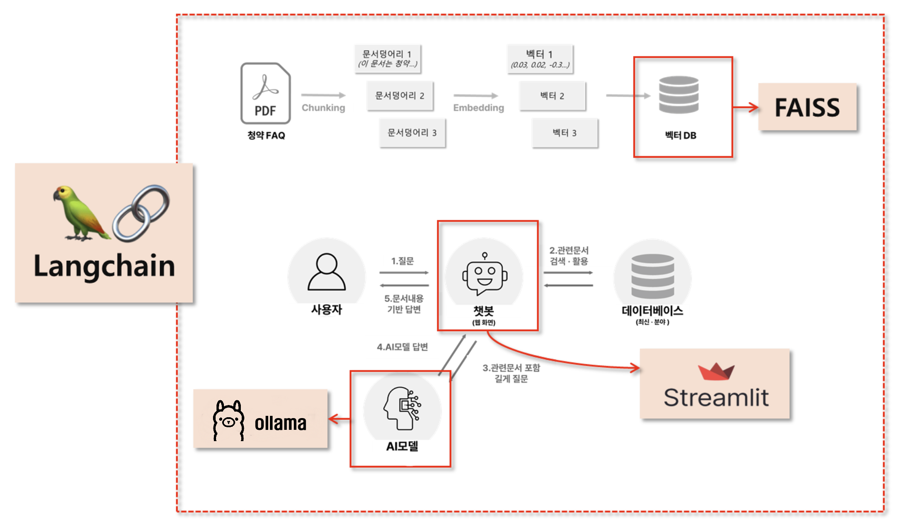

---
title: Houshing Subscription Chatbot
layout: default
parent: LangChain
nav_order: 6
permalink: /langchain/houshingchatbot
# nav_exclude: true
# search_exclude: true
--- 

## 주택 청약 FAQ 챗봇



### 1. 환경설정

requirements.txt
```
streamlit
langchain
faiss-cpu
openai
pymupdf
langchain-openai
langchain-community
```

```bash
pip install -r requirements.txt
```

[주택청약 pdf문서 다운로드 사이트](https://www.molit.go.kr/USR/policyData/m_34681/dtl.jsp?search=&srch_dept_nm=&srch_dept_id=&srch_usr_nm=&srch_usr_titl=Y&srch_usr_ctnt=&search_regdate_s=&search_regdate_e=&psize=10&s_category=&p_category=&lcmspage=1&id=4765)

[주택청약 pdf문서](./data/2024_주택청약_FAQ.pdf)

### 2. 코드 작성

`.env`
```
OPENAI_API_KEY=OPENAI_API_KEY
```

`chatbot_ollama.py`
```py
## streamlit 관련 모듈 불러오기
import streamlit as st
from streamlit.runtime.uploaded_file_manager import UploadedFile

## LLM 모델
from langchain_ollama import OllamaEmbeddings, OllamaLLM
from langchain_openai import ChatOpenAI, OpenAIEmbeddings
from langchain_core.documents.base import Document
from langchain.text_splitter import RecursiveCharacterTextSplitter
from langchain_community.vectorstores import FAISS
from langchain.prompts import PromptTemplate
from langchain_core.runnables import Runnable
from langchain.schema.output_parser import StrOutputParser
from langchain_community.document_loaders import PyMuPDFLoader
from typing import List
import os
import fitz  # PyMuPDF
import re
from tqdm import tqdm  # 진행 상태 보기용

## 환경변수 불러오기
from dotenv import load_dotenv,dotenv_values
load_dotenv()

# Ollama 서버 URL
ollama_url = "http://127.0.0.1:11434"  # 로컬에서 실행 중인 서버의 URL과 포트
lmstudio_url = "http://127.0.0.1:1234/v1"


############## 1단계 : PDF 문서를 벡터DB에 저장하는 함수들 ##############

## 1: 임시폴더에 파일 저장
def save_uploadedfile(uploadedfile: UploadedFile) -> str : 
    temp_dir = "PDF_임시폴더"
    if not os.path.exists(temp_dir):
        os.makedirs(temp_dir)
    file_path = os.path.join(temp_dir, uploadedfile.name)
    with open(file_path, "wb") as f:
        f.write(uploadedfile.read()) 
    return file_path

## 2: 저장된 PDF 파일을 Document로 변환
def pdf_to_documents(pdf_path:str) -> List[Document]:
    documents = []
    loader = PyMuPDFLoader(pdf_path)
    doc = loader.load()
    for d in doc:
        d.metadata['file_path'] = pdf_path
    documents.extend(doc)
    return documents

## 3: Document를 더 작은 document로 변환
def chunk_documents(documents: List[Document]) -> List[Document]:
    text_splitter = RecursiveCharacterTextSplitter(chunk_size=800, chunk_overlap=100)
    return text_splitter.split_documents(documents)

## 4: Document를 벡터DB로 저장

# def save_to_vector_store(documents: List[Document]) -> None:
#     # embeddings = OpenAIEmbeddings(model="text-embedding-3-small")
#     # embeddings = OllamaEmbeddings( model="nomic-embed-text", base_url=ollama_url)
#     embeddings = OpenAIEmbeddings(model="text-embedding-nomic-embed-text-v1", base_url=lmstudio_url, api_key="dummy")
#     vector_store = FAISS.from_documents(documents, embedding=embeddings)
#     vector_store.save_local("faiss_index")

def save_to_vector_store(documents: List[Document]) -> None:
    # embeddings = OpenAIEmbeddings(model="text-embedding-3-small")
    embeddings = OllamaEmbeddings( model="nomic-embed-text", base_url=ollama_url)
    # embeddings = OpenAIEmbeddings(model="text-embedding-nomic-embed-text-v1", base_url=lmstudio_url, api_key="dummy" )

    # 문서들을 임베딩 전에 작게 나눠서 처리
    batch_size = 50
    all_embeddings = []
    for i in tqdm(range(0, len(documents), batch_size), desc="Embedding 문서"):
        batch = documents[i:i+batch_size]
        try:
            vector_store = FAISS.from_documents(batch, embedding=embeddings)
            if i == 0:
                vector_store.save_local("faiss_index")
            else:
                vector_store.merge_from(vector_store)
        except Exception as e:
            print(f"{i}번째 배치에서 오류 발생: {e}")

    print("✅ 벡터스토어 저장 완료")

############## 2단계 : RAG 기능 구현과 관련된 함수들 ##############


## 사용자 질문에 대한 RAG 처리
@st.cache_data
def process_question(user_question):

    # embeddings = OpenAIEmbeddings(model="text-embedding-3-small")
    embeddings = OllamaEmbeddings( model="nomic-embed-text",base_url=ollama_url)
    # embeddings = OpenAIEmbeddings(model="text-embedding-nomic-embed-text-v1", base_url=lmstudio_url, api_key="dummy")

    ## 벡터 DB 호출
    new_db = FAISS.load_local("faiss_index", embeddings, allow_dangerous_deserialization=True)

    ## 관련 문서 3개를 호출하는 Retriever 생성
    retriever = new_db.as_retriever(search_kwargs={"k": 3})
    ## 사용자 질문을 기반으로 관련문서 3개 검색 
    retrieve_docs : List[Document] = retriever.invoke(user_question)

    ## RAG 체인 선언
    chain = get_rag_chain()
    ## 질문과 문맥을 넣어서 체인 결과 호출
    response = chain.invoke({"question": user_question, "context": retrieve_docs})

    return response, retrieve_docs


def get_rag_chain() -> Runnable:
    template = """
    다음의 컨텍스트를 활용해서 질문에 답변해줘
    - 질문에 대한 응답을 해줘
    - 간결하게 5줄 이내로 해줘
    - 곧바로 응답결과를 말해줘

    컨텍스트 : {context}

    질문: {question}

    응답:"""

    custom_rag_prompt = PromptTemplate.from_template(template)
    
    # model = ChatOpenAI(model="gpt-4o-mini")
    # model = OllamaLLM(model="llama3.1:latest", base_url=ollama_url)
    model = ChatOpenAI(model="exaone-3.5-2.4b-instruct", base_url=lmstudio_url, api_key="dummy")

    return custom_rag_prompt | model | StrOutputParser()


############## 3단계 : 응답결과와 문서를 함께 보도록 도와주는 함수 ##############
@st.cache_data(show_spinner=False)
def convert_pdf_to_images(pdf_path: str, dpi: int = 250) -> List[str]:
    doc = fitz.open(pdf_path)  # 문서 열기
    image_paths = []
    
    # 이미지 저장용 폴더 생성
    output_folder = "PDF_이미지"
    if not os.path.exists(output_folder):
        os.makedirs(output_folder)

    for page_num in range(len(doc)):  #  각 페이지를 순회
        page = doc.load_page(page_num)  # 페이지 로드

        zoom = dpi / 72  # 72이 디폴트 DPI
        mat = fitz.Matrix(zoom, zoom)
        pix = page.get_pixmap(matrix=mat) # type: ignore

        image_path = os.path.join(output_folder, f"page_{page_num + 1}.png")  # 페이지 이미지 저장 page_1.png, page_2.png, etc.
        pix.save(image_path)  # PNG 형태로 저장
        image_paths.append(image_path)  # 경로를 저장
        
    return image_paths

def display_pdf_page(image_path: str, page_number: int) -> None:
    image_bytes = open(image_path, "rb").read()  # 파일에서 이미지 인식
    st.image(image_bytes, caption=f"Page {page_number}", output_format="PNG", width=600)


def natural_sort_key(s):
    return [int(text) if text.isdigit() else text for text in re.split(r'(\d+)', s)]

def main():
    st.set_page_config("청약 FAQ 챗봇", layout="wide")

    left_column, right_column = st.columns([1, 1])
    with left_column:
        st.header("청약 FAQ 챗봇")

        pdf_doc = st.file_uploader("PDF Uploader", type="pdf")
        button =  st.button("PDF 업로드하기")
        if pdf_doc and button:
            with st.spinner("PDF문서 저장중"):
                pdf_path = save_uploadedfile(pdf_doc)
                pdf_document = pdf_to_documents(pdf_path)  #
                smaller_documents = chunk_documents(pdf_document)
                save_to_vector_store(smaller_documents)
            # (3단계) PDF를 이미지로 변환해서 세션 상태로 임시 저장
            with st.spinner("PDF 페이지를 이미지로 변환중"):
                images = convert_pdf_to_images(pdf_path)
                st.session_state.images = images

        user_question = st.text_input("PDF 문서에 대해서 질문해 주세요",
                                        placeholder="무순위 청약 시에도 부부 중복신청이 가능한가요?")

        if user_question:
            response, context = process_question(user_question)
            st.write(response)
            for document in context:
                with st.expander("관련 문서"):
                    st.write(document.page_content)
                    file_path = document.metadata.get('source', '')
                    page_number = document.metadata.get('page', 0) + 1
                    button_key = f"link_{file_path}_{page_number}"
                    reference_button = st.button(f"🔎 {os.path.basename(file_path)} pg.{page_number}", key=button_key)
                    if reference_button:
                        st.session_state.page_number = str(page_number)

    with right_column:
        # page_number 호출
        page_number = st.session_state.get('page_number')
        if page_number:
            page_number = int(page_number)
            image_folder = "pdf_이미지"
            images = sorted(os.listdir(image_folder), key=natural_sort_key)
            print(images)
            image_paths = [os.path.join(image_folder, image) for image in images]
            print(page_number)
            print(image_paths[page_number - 1])
            display_pdf_page(image_paths[page_number - 1], page_number)


if __name__ == "__main__":
    main()

```

### 3. 실행
```
streamlit run chatbot_ollama.py --server.port 8501
```
### 4. FAISS 데이터 확인

`faiss_upload_viewer.py`
```py
import streamlit as st
import pandas as pd
import numpy as np
from langchain_community.vectorstores import FAISS
from langchain_community.embeddings import OpenAIEmbeddings
from langchain_community.embeddings import OllamaEmbeddings
import tempfile
import os

# Set the page configuration (optional)
st.set_page_config(page_title="LangChain FAISS 색인 내용", layout="wide")

st.title("LangChain FAISS 색인 내용")

ollama_url = "http://127.0.0.1:11434"
# Add a file uploader for the individual FAISS index files
uploaded_files = st.file_uploader(
    "'index.faiss'와 'index.pkl' 파일을 업로드하세요",
    type=["faiss", "pkl"],
    accept_multiple_files=True
)

if uploaded_files is not None and len(uploaded_files) > 0:
    # Create a temporary directory to save the uploaded files
    with tempfile.TemporaryDirectory() as tmpdirname:
        # Initialize variables to store the paths of the uploaded files
        index_faiss_path = None
        index_pkl_path = None

        # Process the uploaded files
        for uploaded_file in uploaded_files:
            # Save each file to the temporary directory
            file_path = os.path.join(tmpdirname, uploaded_file.name)
            with open(file_path, 'wb') as f:
                f.write(uploaded_file.getbuffer())

            # Identify the file based on its name
            if uploaded_file.name == 'index.faiss':
                index_faiss_path = file_path
            elif uploaded_file.name == 'index.pkl':
                index_pkl_path = file_path

        # Check if both required files have been uploaded
        if index_faiss_path is None or index_pkl_path is None:
            st.error("'index.faiss'와 'index.pkl' 파일을 모두 업로드해주세요.")
            st.stop()

        # Now, load the FAISS index from the temporary directory
        # Since the files are saved in tmpdirname, we can use that as the base path
        try:
            vectorstore = FAISS.load_local(
                tmpdirname,
                # embeddings=OpenAIEmbeddings(model="text-embedding-3-small"),
                embeddings = OllamaEmbeddings( model="nomic-embed-text",base_url=ollama_url),
                allow_dangerous_deserialization=True
            )
        except Exception as e:
            st.error(f"FAISS 색인 로드 실패: {e}")
            st.stop()

        # Proceed with processing and displaying the data
        # Get the total number of vectors
        n_vectors = vectorstore.index.ntotal

        # Initialize lists to hold data
        texts = []
        metadatas = []
        embeddings_str = []

        # Function to convert embeddings to string with ellipsis, showing only the first 100 numbers
        def embedding_to_str(embedding):
            truncated_embedding = embedding[:100]  # Take the first 100 numbers
            embedding_str = ", ".join("{:.3f}".format(num) for num in truncated_embedding)
            return "[{}...]".format(embedding_str)

        # Iterate over the indices
        for i in range(n_vectors):
            # Get the document ID
            doc_id = vectorstore.index_to_docstore_id[i]

            # Retrieve the document
            doc = vectorstore.docstore.search(doc_id)

            # Append text and metadata
            texts.append(doc.page_content)
            metadatas.append(doc.metadata)

            # Reconstruct the embedding vector
            embedding_vector = vectorstore.index.reconstruct(i)

            # Convert embedding to string with ellipsis
            embeddings_str.append(embedding_to_str(embedding_vector))

        # Create the DataFrame
        df = pd.DataFrame({
            'text': texts,
            'metadata': metadatas,
            'embeddings': embeddings_str
        })

        # Function to convert DataFrame to HTML with code blocks in 'metadata' column
        def df_to_html_with_code(df):
            html = '''
            <html>
            <head>
                <style>
                    table {
                        width: 100%;
                        border-collapse: collapse;
                        table-layout: fixed;
                        word-wrap: break-word;
                    }
                    th, td {
                        text-align: left;
                        vertical-align: top;
                        padding: 8px;
                        border-bottom: 1px solid #ddd;
                        word-wrap: break-word;
                    }
                    th {
                        background-color: #f2f2f2;
                    }
                    pre {
                        background-color: #f0f0f0;
                        padding: 8px;
                        margin: 0;
                        white-space: pre-wrap; /* Wrap long lines */
                        word-wrap: break-word; /* Break long words */
                        font-size: 0.9em;
                    }
                    code {
                        font-family: Consolas, 'Courier New', monospace;
                    }
                    .cell-content {
                        max-height: 200px;
                        overflow: auto;
                    }
                </style>
            </head>
            <body>
                <table>
            '''
            # Add table header
            html += '<tr>'
            for column in df.columns:
                html += f'<th>{column}</th>'
            html += '</tr>'
            # Add table rows
            for _, row in df.iterrows():
                html += '<tr>'
                for column in df.columns:
                    cell_value = row[column]
                    if column == 'metadata':
                        # Convert metadata to JSON string with indentation
                        import json
                        metadata_str = json.dumps(cell_value, indent=2, ensure_ascii=False)
                        # Wrap in code block
                        cell_html = f'''
                        <div class="cell-content">
                            <pre><code>{metadata_str}</code></pre>
                        </div>
                        '''
                    else:
                        cell_html = f'''
                        <div class="cell-content">
                            {cell_value}
                        </div>
                        '''
                    html += f'<td>{cell_html}</td>'
                html += '</tr>'
            html += '''
                </table>
            </body>
            </html>
            '''
            return html

        # Convert DataFrame to HTML
        html_table = df_to_html_with_code(df)

        # Display the HTML table using st.components.v1.html()
        st.components.v1.html(html_table, height=800, scrolling=True)
    # Temporary directory and its contents are cleaned up here
else:
    st.info("FAISS 색인 내용을 보려면 'index.faiss'와 'index.pkl' 파일을 모두 업로드해주세요.")

```

```
streamlit run faiss_upload_viewer
```