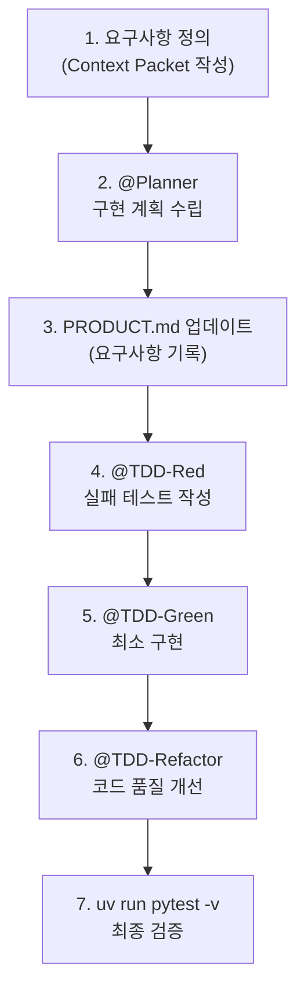

# AI와 함께 개발하기 — GitHub Copilot Agent Mode로 배우는 AI-Native 개발

## 학습 목표

1. AI-Native 개발의 의미와 기존 개발 방식과의 차이를 설명할 수 있다
2. GitHub Copilot Agent Mode를 사용하여 자연어로 코드를 생성할 수 있다
3. Custom Instructions, Prompt Files, Custom Agents의 차이를 이해하고 작성할 수 있다
4. Context Engineering의 원리를 이해하고 AI에게 효과적인 브리핑을 구성할 수 있다
5. TDD(테스트 주도 개발) Agent Chain을 구성하여 자동화된 개발 워크플로우를 실행할 수 있다
6. 학습한 커스터마이징을 자신의 업무에 적용할 수 있다

> **대상**: 프로그래밍 경험이 없는 비전공자 (마케팅, 기획, 디자인 등 직무 전환자)
>
> **환경**: Windows 또는 macOS + VS Code + GitHub Copilot (Free 또는 Pro)
>
> **프로젝트**: Todo Manager (할 일 관리 앱) — Python 기반, 코드 이해 불필요

<a id="toc"></a>
## 진행 순서 (10교시)

| 교시 | 제목 | 핵심 |
|:---:|------|------|
| 1 | [환경 설정 & AI 코딩 시대](#lesson1) | uv, VS Code, Copilot 설치 + 왜 배우는가 |
| 2 | [Copilot 첫 체험](#lesson2) | Agent Mode로 코드 생성 체험 |
| 3 | [Custom Instructions](#lesson3) | AI에게 규칙 가르치기 |
| 4 | [Prompt Files](#lesson4) | 반복 작업 자동화 |
| 5 | [Custom Agents](#lesson5) | 역할 분리 (계획 전문가) |
| 6 | [Context Engineering](#lesson6) | AI에게 좋은 브리핑 만들기 |
| 7 | [TDD 한 사이클 체험](#lesson7) | Red→Green→Refactor |
| 8 | [통합 실습](#lesson8) | 전체 워크플로우 실행 |
| 9 | [내 업무에 적용하기](#lesson9) | 실무 시나리오 커스터마이징 |
| 10 | [발표 & 회고](#lesson10) | 결과 공유, 피드백 |

---

<a id="lesson1"></a>
## 교시 1. 환경 설정 & AI 코딩 시대 [↑](#toc)

**학습목표**: 개발 환경을 설정하고, AI-Native 개발이 왜 필요한지 이해한다

### AI-Native 개발이란?

| | 기존 개발 | AI-Native 개발 |
|---|----------|---------------|
| **코드 작성** | 개발자가 직접 한 줄씩 | AI가 생성, 사람이 검토 |
| **핵심 역할** | 코딩 기술 | **AI에게 무엇을 시킬지 설계하는 능력** |
| **비유** | 직접 요리하기 | 레시피를 설계하고 AI 셰프에게 맡기기 |

> **왜 배우는가?**: 2026년 현재 개발자 84%가 AI 도구를 사용하지만, 46%는 결과를 신뢰하지 못합니다. AI를 **"잘 부리는 법"**을 아는 것이 경쟁력입니다.

### 환경 설정

#### 1단계: uv 설치 (Python 패키지 매니저)

> **uv란?**: Python 프로젝트를 관리하는 도구입니다. pip, venv, pyenv를 하나로 합친 것으로, 기존 도구보다 10~100배 빠릅니다.

**macOS/Linux:**
```bash
curl -LsSf https://astral.sh/uv/install.sh | sh
```

**Windows (PowerShell):**
```powershell
powershell -ExecutionPolicy ByPass -c "irm https://astral.sh/uv/install.ps1 | iex"
```

설치 확인:
```bash
uv --version
# 결과 예시: uv 0.11.2
```

#### 2단계: Python 설치

```bash
uv python install 3.12
uv python list
# 결과 예시: cpython-3.12.x ...
```

#### 3단계: VS Code 설치

[VS Code 다운로드](https://code.visualstudio.com/)에서 설치 후 실행 확인:

```bash
code --version
```

#### 4단계: GitHub Copilot 설정

1. [GitHub 계정](https://github.com/) 생성 (없으면)
2. VS Code에서 **확장(Extensions)** 탭 열기 (Ctrl+Shift+X / Cmd+Shift+X)
3. **"GitHub Copilot"** 검색 → 설치
4. VS Code 하단에 Copilot 아이콘이 나타나면 성공

> **요금**: Free 플랜($0)으로 월 50회 채팅 가능. 학생은 무료 무제한.

#### 5단계: 프로젝트 설정

```bash
# 프로젝트 폴더로 이동
cd 자료파일/AN.1.1

# 의존성 설치
uv sync

# 테스트 실행으로 환경 확인
uv run pytest -v
```

> **성공 기준**: 테스트가 실행되고 결과가 출력되면 환경 설정 완료입니다. 일부 테스트가 FAILED여도 정상입니다 (아직 구현되지 않은 기능이 있기 때문).

> **확인**: `uv --version`과 `code --version`이 모두 출력되나요?

---

<a id="lesson2"></a>
## 교시 2. Copilot 첫 체험 [↑](#toc)

**학습목표**: GitHub Copilot Agent Mode를 사용하여 자연어로 코드를 생성할 수 있다

### Copilot Chat 3가지 모드

VS Code에서 Copilot Chat을 열면 (Ctrl+Shift+I / Cmd+Shift+I) 상단에 모드를 선택할 수 있습니다.

| 모드 | 설명 | 코드 수정 | 언제 쓰나 |
|------|------|:---:|----------|
| **Ask** | 질문에 답변만 | ❌ | 개념 질문, 코드 설명 |
| **Edit** | 선택한 파일 수정 | ✅ (승인 후) | 버그 수정, 부분 수정 |
| **Agent** | 자율적 멀티스텝 | ✅ (자동) | 새 기능 개발, 대규모 작업 |

### 체험 1: Ask 모드

Chat에서 **Ask** 모드를 선택하고 질문합니다:

```
이 프로젝트가 어떤 프로젝트인지 설명해줘
```

> Copilot이 `src/todo/`, `tests/`, `docs/` 등을 읽고 프로젝트 구조를 설명합니다.

### 체험 2: Agent 모드 — 첫 코드 생성

**Agent** 모드를 선택하고 다음을 입력합니다:

```
src/todo/manager.py의 list_all 메서드를 구현해줘.
모든 할 일 목록을 반환하면 돼.
```

> **관찰 포인트**:
> - Copilot이 파일을 읽고, 코드를 분석하고, 구현을 생성합니다
> - 터미널에서 테스트를 자동 실행할 수도 있습니다
> - **사람의 역할**: 생성된 코드를 검토하고 "Accept" 또는 "Discard" 결정

### 체험 3: 테스트 실행으로 검증

```bash
uv run pytest -v
```

> **핵심**: 코드를 직접 작성하지 않았는데도 테스트가 통과합니다. 이것이 **AI-Native 개발**입니다 — "코드 작성"이 아니라 **"AI에게 무엇을 시킬지 설계"**하는 것.

### Before vs After

| 항목 | 커스터마이징 없이 | 커스터마이징 후 (교시 3~8) |
|------|:---:|:---:|
| 코딩 규칙 준수 | ❌ 제멋대로 | ✅ 내 규칙대로 |
| 반복 작업 | 매번 같은 말 입력 | `/명령어` 한 번 |
| 역할 분리 | 계획과 구현 뒤섞임 | Agent별 역할 고정 |
| 결과 일관성 | 매번 다른 스타일 | 일관된 품질 |

> **다음 교시부터 이 차이를 만드는 3가지 커스터마이징을 배웁니다.**

> **확인**: Agent 모드에서 Copilot이 코드를 수정한 후, 어떻게 승인/거절하나요?

---

<a id="lesson3"></a>
## 교시 3. Custom Instructions — AI에게 규칙 가르치기 [↑](#toc)

**학습목표**: Custom Instructions 파일을 작성하여 Copilot이 프로젝트 규칙을 자동으로 따르게 할 수 있다

### Custom Instructions란?

**Copilot이 항상 지켜야 할 규칙**을 파일로 저장하는 것입니다. 한 번 작성하면 모든 대화에 자동 적용됩니다.

> **비유**: 새로 입사한 인턴에게 "우리 회사 코딩 규칙 문서"를 주는 것과 같습니다. 매번 말하지 않아도 알아서 따릅니다.

### 2종류의 Instructions 파일

| 파일 | 위치 | 적용 범위 |
|------|------|----------|
| `copilot-instructions.md` | `.github/` | 프로젝트 전체 (항상) |
| `*.instructions.md` | `.github/instructions/` | 특정 파일 패턴만 |

### 실습 1: 프로젝트 전체 규칙 작성

`.github/copilot-instructions.md` 파일을 생성합니다:

```markdown
# 프로젝트 규칙

## 빌드 및 테스트
- 의존성 설치: `uv sync`
- 테스트 실행: `uv run pytest -v`

## 코딩 규칙
- Python 3.11 이상
- 외부 패키지 사용 금지 (표준 라이브러리만)
- 예외 처리 시 구체적인 예외 타입 사용 (Exception 대신 ValueError 등)

## 문서화
- public 메서드에는 반드시 한국어 docstring 작성
- 커밋 메시지는 한국어로 작성
```

### 실습 2: Python 파일 전용 규칙 작성

`.github/instructions/general.instructions.md` 파일을 생성합니다:

```markdown
---
applyTo: "**/*.py"
---
# Python 코딩 규칙

- 변수명과 함수명: snake_case (예: todo_list, add_item)
- 클래스명: PascalCase (예: TodoManager, Status)
- 모든 함수에 타입 힌트 작성 (예: def add(self, title: str) -> Todo:)
- 함수 중첩은 최대 3단계까지
```

> **`applyTo: "**/*.py"`**: 모든 폴더의 `.py` 파일에만 이 규칙을 적용한다는 의미입니다.

### 실습 3: 테스트 파일 전용 규칙 작성

`.github/instructions/testing.instructions.md` 파일을 생성합니다:

```markdown
---
applyTo: "tests/**"
---
# 테스트 규칙

- 테스트 프레임워크: pytest
- 함수명: test_메서드명_조건_기대결과 (예: test_add_empty_title_raises_error)
- AAA 패턴 사용:
  - Arrange: 테스트 데이터 준비
  - Act: 테스트 대상 실행
  - Assert: 결과 확인
- 하나의 테스트에는 하나의 assert만
```

### 검증: 규칙이 적용되는지 확인

Agent 모드에서 다음을 입력합니다:

```
TodoManager에 delete 메서드를 추가해줘.
할 일 ID를 받아서 삭제하는 기능이야.
```

> **관찰 포인트**: Copilot이 생성한 코드가:
> - ✅ snake_case 변수명을 사용하는지
> - ✅ 타입 힌트가 있는지
> - ✅ 한국어 docstring이 있는지
> - ✅ 테스트가 AAA 패턴을 따르는지

> **확인**: Instructions 파일 없이 같은 요청을 했을 때와 비교하면 어떤 차이가 있나요?

---

<a id="lesson4"></a>
## 교시 4. Prompt Files — 반복 작업 자동화 [↑](#toc)

**학습목표**: Prompt Files를 작성하여 반복적인 요청을 `/명령어`로 실행할 수 있다

### Prompt Files란?

**자주 쓰는 요청을 템플릿으로 저장**해두고, `/명령어`로 한 번에 실행하는 것입니다.

> **비유**: 카페에서 "제 평소 메뉴요"라고 말하면 바리스타가 알아서 만들어주는 것과 같습니다. 매번 "아이스 아메리카노 샷 추가 시럽 빼고..."라고 말할 필요 없습니다.

### Instructions vs Prompt Files 차이

| | Custom Instructions | Prompt Files |
|---|---|---|
| **적용** | 항상 자동 | `/명령어`로 수동 호출 |
| **용도** | 규칙 (항상 지켜야 할 것) | 작업 (가끔 실행하는 것) |
| **비유** | 회사 복장 규정 | 보고서 작성 양식 |

### 실습 1: 새 기능 추가 프롬프트

`.github/prompts/new-feature.prompt.md` 파일을 생성합니다:

```markdown
---
mode: agent
description: "새 기능과 테스트를 함께 생성합니다"
---
# 새 기능 추가

## 요청
다음 기능을 구현해주세요:

기능명: ${input:featureName}
요구사항: ${input:requirements}

## 작업 순서
1. `src/todo/manager.py`에 기능 구현
2. `tests/test_manager.py`에 테스트 작성
3. `uv run pytest -v`로 테스트 실행
4. 모든 테스트가 통과하는지 확인

## 규칙
- 기존 코드 스타일을 따를 것
- 타입 힌트와 한국어 docstring 필수
```

> **`${input:featureName}`**: 실행 시 사용자에게 입력을 요청하는 변수입니다.

### 실습 2: 코드 리뷰 프롬프트 (읽기 전용)

`.github/prompts/code-review.prompt.md` 파일을 생성합니다:

```markdown
---
mode: agent
description: "코드를 분석하고 개선점을 제안합니다 (수정하지 않음)"
tools: [read, search]
---
# 코드 리뷰

다음 관점에서 코드를 리뷰해주세요:
1. 버그 가능성
2. 코드 가독성
3. 테스트 커버리지
4. 성능 개선 여지

**코드를 직접 수정하지 마세요.** 개선 제안만 해주세요.
```

> **`tools: [read, search]`**: 이 프롬프트는 파일을 읽고 검색만 할 수 있고, 수정(edit)은 못합니다.

### 실행 방법

1. Copilot Chat을 엽니다 (Ctrl+Shift+I / Cmd+Shift+I)
2. 채팅창에 `/new-feature`를 입력합니다
3. 기능명과 요구사항을 입력하면 자동으로 실행됩니다

> **확인**: `/code-review`를 실행했을 때 Copilot이 코드를 수정하려고 하나요? tools 설정이 잘 적용되었는지 확인해보세요.

---

<a id="lesson5"></a>
## 교시 5. Custom Agents — 역할 분리 [↑](#toc)

**학습목표**: Custom Agent를 작성하여 AI에게 특정 역할만 수행하도록 제한할 수 있다

### Custom Agents란?

**AI에게 특정 역할을 부여하고, 할 수 있는 일을 제한**하는 것입니다.

> **비유**: 건축 프로젝트에서 "설계사는 설계만, 시공사는 시공만" 하는 것과 같습니다. 설계사가 직접 벽돌을 쌓으면 안 됩니다.

### Prompt Files vs Custom Agents 차이

| | Prompt Files | Custom Agents |
|---|---|---|
| **실행** | 1회 실행 후 종료 | 대화 내내 역할 유지 |
| **도구 제한** | 해당 실행에만 적용 | 전체 대화에 지속 |
| **비유** | 주문서 1장 | 전문가 1명 고용 |

### 실습: Planner Agent 만들기

`.github/agents/planner.agent.md` 파일을 생성합니다:

```markdown
---
name: "Planner"
description: "구현 계획을 세우는 전문가. 코드를 직접 작성하지 않습니다."
tools: [read, search]
---
# 역할

당신은 구현 계획 전문가입니다. 요구사항을 분석하고 구현 계획을 세웁니다.

## 절대 하지 말 것
- 코드를 직접 작성하거나 수정하지 마세요
- 파일을 생성하지 마세요

## 반드시 할 것
1. 영향받는 파일 목록 작성
2. 구현 단계를 순서대로 정리
3. 각 단계에서 필요한 테스트 시나리오 제안
4. 예상되는 위험 요소 언급

## 출력 형식
### 영향받는 파일
- 파일 경로와 변경 사유

### 구현 단계
1. 단계명: 상세 설명

### 테스트 시나리오
- 시나리오명: 기대 결과
```

### 실행 및 검증

Agent 모드에서 `@Planner`를 호출합니다:

```
@Planner TodoManager에 우선순위(priority) 기능을 추가하려고 해.
높음/보통/낮음 3단계로 나누고, 우선순위별로 정렬할 수 있어야 해.
```

> **관찰 포인트**:
> - ✅ 계획을 상세하게 출력하는지
> - ✅ 코드를 직접 작성하지 **않는지** (tools에 edit가 없으므로)
> - ✅ 영향받는 파일, 구현 단계, 테스트 시나리오가 나오는지

> **확인**: Planner Agent가 코드를 직접 작성하려고 시도하면 어떻게 되나요? tools 제한이 왜 중요한지 생각해보세요.

---

<a id="lesson6"></a>
## 교시 6. Context Engineering — AI에게 좋은 브리핑 만들기 [↑](#toc)

**학습목표**: Context Engineering의 원리를 이해하고, AI에게 효과적인 브리핑을 구성할 수 있다

### Context Engineering이란?

**AI가 작업할 때 보게 되는 모든 입력 정보를 설계하는 것**입니다.

| | 프롬프트 엔지니어링 | 컨텍스트 엔지니어링 |
|---|---|---|
| **초점** | "어떻게 질문할까?" | "AI가 무엇을 알아야 하는가?" |
| **범위** | 질문 1개 | 전체 정보 구조 |
| **비유** | 좋은 질문하기 | **좋은 브리핑 자료 만들기** |

> **핵심 원칙**: "더 많은 정보"보다 **"정확한 양 + 정확한 순서"**가 중요합니다. AI의 주의력은 유한합니다.

### Context Packet (브리핑 자료) 5요소

| 요소 | 설명 | 예시 |
|------|------|------|
| **1. 작업 목표** | 1문장으로 | "status별 필터링 기능 추가" |
| **2. 참조 파일** | 3~5개 최대 | models.py, manager.py, test_manager.py |
| **3. 제약 조건** | 코딩 규칙 | "표준 라이브러리만, 타입 힌트 필수" |
| **4. 완료 기준** | 테스트 가능한 조건 | "pytest 전체 통과" |
| **5. 제외 범위** | 하지 말 것 | "UI 구현 안 함, DB 연동 안 함" |

### 실습: Context Packet 작성

다음 요구사항에 대한 Context Packet을 작성해봅시다:

> "TodoManager에 마감일(due_date) 기능을 추가하고 싶다"

```markdown
## Context Packet: 마감일 기능

### 1. 작업 목표
Todo 항목에 마감일(due_date) 필드를 추가하고, 마감일 기준으로 정렬하는 기능을 구현한다.

### 2. 참조 파일
- `src/todo/models.py` — Todo 데이터 구조 (여기에 due_date 필드 추가)
- `src/todo/manager.py` — 비즈니스 로직 (정렬 메서드 추가)
- `tests/test_manager.py` — 테스트 (마감일 관련 테스트 추가)

### 3. 제약 조건
- datetime 모듈 사용 (표준 라이브러리)
- due_date는 Optional (없을 수 있음)
- 기존 테스트가 깨지면 안 됨

### 4. 완료 기준
- `uv run pytest -v` 전체 통과
- 마감일 없는 Todo도 정상 동작
- 마감일 기준 정렬 시 None은 마지막에 배치

### 5. 제외 범위
- 알림/리마인더 기능은 구현하지 않음
- 반복 일정은 구현하지 않음
```

### 이 Context Packet을 활용하여 Planner에게 요청

```
@Planner 아래 Context Packet을 참고하여 구현 계획을 세워주세요.

[위의 Context Packet 내용을 붙여넣기]
```

> **비교**: Context Packet 없이 "마감일 기능 추가해줘"라고만 했을 때와 결과를 비교해보세요. 어떤 차이가 있나요?

### Copilot이 보는 컨텍스트 계층

```
1. 시스템 (Copilot 내장, 수정 불가)
2. copilot-instructions.md (프로젝트 전체 규칙)
3. *.instructions.md (파일별 규칙)
4. *.prompt.md (작업 템플릿)
5. *.agent.md (역할 설정)
6. 사용자 채팅 입력 (Context Packet 포함)
7. 대화 히스토리
```

> **확인**: Context Packet에서 "제외 범위"를 빼면 AI 결과가 어떻게 달라질까요?

---

<a id="lesson7"></a>
## 교시 7. TDD 한 사이클 체험 [↑](#toc)

**학습목표**: TDD Agent Chain을 구성하여 Red→Green→Refactor 사이클을 실행할 수 있다

### TDD(테스트 주도 개발)란?

**코드보다 테스트를 먼저 작성**하는 개발 방법입니다.

```
1. Red   — 아직 없는 기능의 테스트를 먼저 작성 (당연히 실패)
2. Green — 테스트를 통과하는 최소한의 코드 작성
3. Refactor — 코드 품질 개선 (테스트는 계속 통과)
```

> **왜 AI와 TDD가 잘 맞는가?**: 테스트가 "정답"을 알려주므로, AI가 명확한 목표를 가지고 코드를 생성할 수 있습니다. "통과/실패"라는 이진 피드백이 AI에게 최적입니다.

### 3개의 TDD Agent 만들기

#### TDD Red Agent — 실패하는 테스트 작성

`.github/agents/TDD-red.agent.md`:

```markdown
---
name: "TDD-Red"
description: "요구사항에 맞는 실패하는 테스트를 작성합니다"
tools: [read, search]
---
# 역할: TDD Red 단계

당신은 테스트 작성 전문가입니다.

## 규칙
- 요구사항을 분석하여 **실패하는 테스트만** 작성하세요
- 구현 코드(manager.py 등)는 절대 수정하지 마세요
- tests/test_manager.py에만 테스트 함수를 추가하세요
- 함수명: test_메서드명_조건_기대결과

## 출력
- 새로 작성한 테스트 함수들
- 각 테스트가 검증하는 요구사항 설명
```

#### TDD Green Agent — 최소 구현

`.github/agents/TDD-green.agent.md`:

```markdown
---
name: "TDD-Green"
description: "Red 단계의 테스트를 통과시키는 최소한의 코드를 작성합니다"
tools: [read, edit, execute]
---
# 역할: TDD Green 단계

당신은 구현 전문가입니다.

## 규칙
- Red 단계에서 작성된 실패하는 테스트를 통과시키는 **최소한의** 코드만 작성하세요
- 리팩토링은 하지 마세요 (다음 단계에서 합니다)
- 기존 테스트가 깨지지 않도록 하세요
- 작업 후 반드시 `uv run pytest -v`를 실행하세요
```

#### TDD Refactor Agent — 코드 개선

`.github/agents/TDD-refactor.agent.md`:

```markdown
---
name: "TDD-Refactor"
description: "테스트를 유지하면서 코드 품질을 개선합니다"
tools: [read, edit, execute]
---
# 역할: TDD Refactor 단계

당신은 코드 품질 전문가입니다.

## 규칙
- 모든 테스트가 **계속 통과**하도록 유지하세요
- 중복 코드 제거
- 변수명/함수명 개선
- 단일 책임 원칙 적용
- 작업 후 반드시 `uv run pytest -v`를 실행하세요
```

### 실습: TDD 한 사이클 실행

#### Step 1: Red — 실패 테스트 작성

```
@TDD-Red TodoManager에 delete(todo_id) 메서드가 필요합니다.
- ID로 할 일을 삭제
- 존재하지 않는 ID면 ValueError 발생
```

```bash
uv run pytest -v
# 결과: 새 테스트들이 FAILED (아직 구현이 없으므로 정상!)
```

#### Step 2: Green — 최소 구현

```
@TDD-Green Red 단계에서 작성한 테스트를 통과시켜주세요.
```

```bash
uv run pytest -v
# 결과: 모든 테스트 PASSED
```

#### Step 3: Refactor — 코드 개선

```
@TDD-Refactor 방금 구현한 코드의 품질을 개선해주세요.
```

```bash
uv run pytest -v
# 결과: 여전히 모든 테스트 PASSED (코드는 더 깔끔해짐)
```

> **핵심**: 각 Agent가 **자기 역할만** 수행합니다. Red는 코드를 못 건드리고(tools에 edit 없음), Green과 Refactor는 테스트 통과를 반드시 확인합니다.

> **확인**: TDD-Red Agent에게 "코드도 함께 구현해줘"라고 요청하면 어떻게 되나요?

---

<a id="lesson8"></a>
## 교시 8. 통합 실습 — 전체 워크플로우 [↑](#toc)

**학습목표**: Planner → TDD 전체 워크플로우를 실행할 수 있다

### 통합 워크플로우



### 실습: 우선순위 기능 추가

#### 1단계: Context Packet 작성

```markdown
## 작업 목표
Todo에 우선순위(HIGH, MEDIUM, LOW) 기능을 추가한다.

## 참조 파일
- src/todo/models.py, src/todo/manager.py, tests/test_manager.py

## 제약 조건
- Priority enum 추가 (Status와 같은 패턴)
- 기본 우선순위: MEDIUM

## 완료 기준
- uv run pytest -v 전체 통과
- 우선순위별 필터링 가능

## 제외 범위
- UI 없음, 정렬 기능은 다음 단계
```

#### 2단계: Planner로 계획

```
@Planner 위의 Context Packet으로 구현 계획을 세워주세요.
```

#### 3단계: PRODUCT.md 업데이트

Planner의 결과를 바탕으로 `docs/PRODUCT.md`에 요구사항을 기록합니다.

#### 4단계: TDD 사이클 실행

```
@TDD-Red 우선순위 기능에 대한 테스트를 작성해주세요.
```

```
@TDD-Green Red 테스트를 통과시켜주세요.
```

```
@TDD-Refactor 코드 품질을 개선해주세요.
```

#### 5단계: 최종 검증

```bash
uv run pytest -v
```

> **성공 기준**: 모든 테스트 통과 + 새 기능이 정상 동작

> **확인**: Planner 없이 바로 TDD-Red에게 요청했을 때와 비교하면 어떤 차이가 있나요?

---

<a id="lesson9"></a>
## 교시 9. 내 업무에 적용하기 [↑](#toc)

**학습목표**: 학습한 커스터마이징을 자신의 업무에 적용할 수 있다

### 어떤 업무에 적용할 수 있을까?

| 업무 | 커스터마이징 예시 |
|------|-----------------|
| **데이터 분석** | Instructions: "pandas 사용, 그래프는 한국어 레이블" + Prompt: `/analyze-data` |
| **보고서 작성** | Instructions: "마크다운 형식, 표 사용" + Agent: 리뷰 전문가 (수정 불가) |
| **웹 스크래핑** | Instructions: "requests + BeautifulSoup" + Prompt: `/scrape-page` |
| **자동화 스크립트** | Agent: Planner (설계) + Builder (구현) 분리 |

### 실습: 나만의 커스터마이징 설계

아래 템플릿을 채워보세요:

```markdown
## 나의 AI 커스터마이징 계획

### 1. 어떤 업무에 적용할 것인가?
(예: 주간 매출 보고서 자동 생성)

### 2. Custom Instructions (항상 지킬 규칙)
- 규칙 1:
- 규칙 2:
- 규칙 3:

### 3. Prompt Files (반복 작업)
- /명령어1: 어떤 작업을 하는가
- /명령어2: 어떤 작업을 하는가

### 4. Custom Agents (역할 분리가 필요하면)
- Agent 1: 역할, 사용 가능 도구
- Agent 2: 역할, 사용 가능 도구

### 5. Context Packet (핵심 정보)
- 작업 목표:
- 참조 파일:
- 제약 조건:
- 완료 기준:
```

### 작성한 계획을 실제로 구현

1. `.github/` 폴더에 파일들을 생성합니다
2. Copilot Chat에서 테스트합니다
3. 결과를 확인하고 개선합니다

> **팁**: 처음에는 Instructions 1개 + Prompt 1개로 시작하세요. 작동하는 것을 확인한 후 점진적으로 확장합니다.

---

<a id="lesson10"></a>
## 교시 10. 발표 & 회고 [↑](#toc)

### 발표 (1인 3~5분)

다음 내용을 공유합니다:

1. **어떤 업무에 적용했는가?**
2. **어떤 커스터마이징 파일을 만들었는가?** (Instructions / Prompts / Agents)
3. **Before vs After**: 커스터마이징 전후 비교
4. **어려웠던 점과 해결 방법**

### 회고 질문

1. AI-Native 개발에서 **사람의 역할**은 무엇이라고 생각하나요?
2. Custom Instructions, Prompt Files, Custom Agents 중 가장 유용했던 것은?
3. Context Engineering에서 가장 중요한 요소는 무엇이었나요?
4. TDD Agent Chain이 실무에서 어떻게 활용될 수 있을까요?

### 다음 단계

| 레벨 | 학습 내용 | 추천 자료 |
|------|----------|----------|
| **기초 심화** | Python 기초 문법 | 이 사이트의 Python 섹션 |
| **LLM 활용** | LangChain, RAG | 이 사이트의 LLM 섹션 |
| **에이전트 심화** | LangGraph, 멀티 에이전트 | 이 사이트의 LangGraph 섹션 |
| **실무 적용** | MCP 서버, Coding Agent | [GitHub Copilot 공식 문서](https://docs.github.com/en/copilot) |

---

## 참고 자료

### 커스터마이징 공식 문서

| 주제 | 링크 |
|------|------|
| Custom Instructions | [GitHub Docs](https://docs.github.com/en/copilot/how-tos/configure-custom-instructions) |
| Prompt Files | [VS Code Docs](https://code.visualstudio.com/docs/copilot/customization/prompt-files) |
| Custom Agents | [GitHub Docs](https://docs.github.com/en/copilot/how-tos/use-copilot-agents/coding-agent/create-custom-agents) |
| Agent Mode 가이드 | [GitHub Blog](https://github.blog/ai-and-ml/github-copilot/agent-mode-101-all-about-github-copilots-powerful-mode/) |

### 컨텍스트 엔지니어링

| 주제 | 링크 |
|------|------|
| Context Engineering 개요 | [Gartner](https://www.gartner.com/en/articles/context-engineering) |
| 코딩 에이전트의 컨텍스트 | [Martin Fowler](https://martinfowler.com/articles/exploring-gen-ai/context-engineering-coding-agents.html) |

### 도구

| 도구 | 링크 |
|------|------|
| VS Code | [code.visualstudio.com](https://code.visualstudio.com/) |
| uv | [docs.astral.sh/uv](https://docs.astral.sh/uv/) |
| GitHub Copilot 요금제 | [github.com/features/copilot/plans](https://github.com/features/copilot/plans) |

### 커스터마이징 예시 모음

| 자료 | 링크 |
|------|------|
| Awesome Copilot Customizations | [GitHub 저장소](https://github.com/github/awesome-copilot) |
