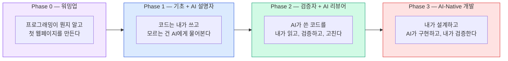

# AI-Native JavaScript — 비전공자를 위한 AI 시대의 JavaScript
{: .no_toc }

AI와 함께 JavaScript를 배우는 과정입니다. 프로그래밍 경험이 전혀 없어도 괜찮습니다.
{: .fs-6 .fw-300 }

---

## 이 과정이 특별한 이유

기존의 코딩 교육은 문법을 외우고, 혼자 코드를 작성하는 방식이었습니다.  
이 과정은 다릅니다. **AI를 학습 파트너로 활용**하되, 기초 역량은 반드시 직접 만들어갑니다.

> AI는 "거의 맞는" 초안을 빠르게 만들지만,  
> "정확히 맞는" 결과를 만드는 건 여전히 사람의 몫입니다.  
> — AI-Native 개발의 핵심 원칙

## 학습 대상

- 프로그래밍을 **처음** 배우는 비전공자
- 코드 한 줄 써본 적 없어도 괜찮습니다
- AI 도구(ChatGPT)를 써본 경험이 있으면 좋지만 필수는 아닙니다

## 학습 형식

- **자기 주도형 웹 문서** + **주 1회 대면 멘토링** (2시간)
- 온라인으로 자기 속도에 맞춰 학습하고, 대면에서 질문하고 확인합니다

## 사용 도구

| 도구 | 용도 | 도입 시점 |
|------|------|----------|
| VS Code | 코드 편집기 | 00장부터 |
| Node.js | JavaScript 실행 환경 | 00장부터 |
| ChatGPT | AI에게 개념 질문 | 00장부터 |
| GitHub Copilot (Free) | AI 코드 어시스턴트 | 07장부터 |
| Vitest | 테스트 프레임워크 | 07장부터 |

## 전체 흐름



## 과정 구조

### Phase 0: 워밍업
{: .text-purple-000 }

| 장 | 제목 | 핵심 내용 |
|----|------|-----------|
| 00 | [프로그래밍이란? + 환경 구축](/ai-native-js/intro) | 프로그래밍 개념, VS Code + Node.js 설치 |
| 01 | [첫 번째 웹페이지 만들기](/ai-native-js/first-page) | HTML + JS 맛보기, 버튼 클릭으로 글자 바꾸기 |

### Phase 1: 기초 + AI 설명자
{: .text-blue-000 }

AI 사용 규칙: **설명 모드만** — 코드는 직접 쓰고, 모르는 개념만 AI에게 질문
{: .label .label-blue }

| 장 | 제목 | 핵심 내용 |
|----|------|-----------|
| 02 | [변수와 데이터 타입](/ai-native-js/variables) | let/const, string/number/boolean, typeof |
| 03 | [조건문](/ai-native-js/conditionals) | if/else, switch, 비교 연산자 |
| 04 | [반복문과 배열](/ai-native-js/loops) | for, while, 배열 기본 |
| 05 | [함수](/ai-native-js/functions) | 선언, 매개변수, 반환값, 화살표 함수 |
| 06 | [객체와 배열 심화](/ai-native-js/objects) | 객체, 구조분해, map/filter |
| 07 | [테스트 입문 + AI 도구 설정](/ai-native-js/testing-intro) | Vitest 첫 경험, GitHub Copilot 설치 |

Phase 1 관문: AI 없이 함수, 반복문, 조건문을 작성할 수 있어야 합니다.
{: .label .label-yellow }

### Phase 2: 검증자 + AI 리뷰어
{: .text-green-000 }

AI 사용 규칙: **생성 + 검증 모드** — AI가 코드를 만들고, 내가 읽고 고치고 테스트한다
{: .label .label-green }

| 장 | 제목 | 핵심 내용 |
|----|------|-----------|
| 08 | [DOM과 이벤트](/ai-native-js/dom) | AI 생성 DOM 코드 읽기/수정 |
| 09 | [AI 출력 평가법 — Bug Hunt](/ai-native-js/bug-hunt) | 의도적 버그 찾기, AI 코드 비판적 평가 |
| 10 | [비동기 JavaScript](/ai-native-js/async) | fetch, async/await, API 호출 |
| 11 | [미니 프로젝트: AI 협업 ToDo 앱](/ai-native-js/todo-app) | 요구사항 → AI 생성 → 테스트 → 수정 |

Phase 2 관문: AI가 생성한 코드에서 버그 2개 이상을 찾아 설명할 수 있어야 합니다.
{: .label .label-yellow }

### Phase 3: AI-Native 개발
{: .text-red-000 }

AI 사용 규칙: **완전 페어 프로그래밍** — 내가 설계하고 AI가 구현, 테스트로 검증
{: .label .label-red }

| 장 | 제목 | 핵심 내용 |
|----|------|-----------|
| 12 | [Custom Instructions](/ai-native-js/instructions) | AI에게 프로젝트 규칙 알려주기 |
| 13 | [Prompt Files + Context Engineering](/ai-native-js/prompts) | 반복 작업 템플릿, 맥락 설계 |
| 14 | [TDD + AI 에이전트](/ai-native-js/tdd-agent) | 테스트 먼저, AI가 구현 |
| 15 | [통합 프로젝트: 날씨 앱](/ai-native-js/weather-app) | 전체 AI-Native 파이프라인 |

## 최종 산출물

이 과정을 마치면 두 가지가 완성됩니다:

### 1. 동작하는 날씨 앱
```
weather-app/
├── index.html          # 사용자 인터페이스
├── src/
│   ├── app.js          # 핵심 로직
│   └── api.js          # 날씨 API 연동
├── tests/
│   ├── app.test.js     # 앱 로직 테스트
│   └── api.test.js     # API 처리 테스트
└── package.json
```

### 2. AI-Native 개발 환경
```
.github/
├── copilot-instructions.md       # 프로젝트 공통 규칙
├── instructions/
│   ├── javascript.instructions.md # JS 코딩 컨벤션
│   └── testing.instructions.md    # Vitest 테스트 규칙
├── prompts/
│   ├── new-feature.prompt.md      # 새 기능 추가 템플릿
│   ├── write-tests.prompt.md      # 테스트 작성 템플릿
│   └── debug-code.prompt.md       # 디버깅 템플릿
└── agents/
    └── tdd-agent.md               # TDD 사이클 에이전트
```

## AI 사용 규칙 — 단계별 가이드

| Phase | AI 역할 | 허용 | 금지 |
|-------|---------|------|------|
| 0 | 선생님 | 개념 질문 | 코드 생성 요청 |
| 1 | 설명자 | 코드/에러 설명 요청 | 코드 생성 요청 |
| 2 | 리뷰어 | 코드 생성 + 학습자 검증 | 검증 없이 복붙 |
| 3 | 파트너 | 전체 AI-Native 워크플로우 | — |

## 멘토링 일정

주 1회, 2시간 대면 멘토링을 병행합니다.

| Phase | 멘토 역할 | 활동 |
|-------|----------|------|
| Phase 0 | 기술 지원 + 동기부여 | 환경 구축 도움, "포기하지 마세요" |
| Phase 1 | 개념 확인 + AI 코치 | 문법 확인, AI 질의 패턴 교정 |
| Phase 2 | 코드 리뷰어 | Bug Hunt 결과 리뷰, 테스트 피드백 |
| Phase 3 | 시니어 개발자 | 아키텍처 조언, Instructions 피드백 |

---

*이 과정은 [AI-Native JavaScript 분석 보고서](/ai-native/js-analysis-report)를 기반으로 설계되었습니다.*  
*다중 페르소나 비판적 분석과 최신 연구 데이터(2024-2026)를 반영합니다.*
