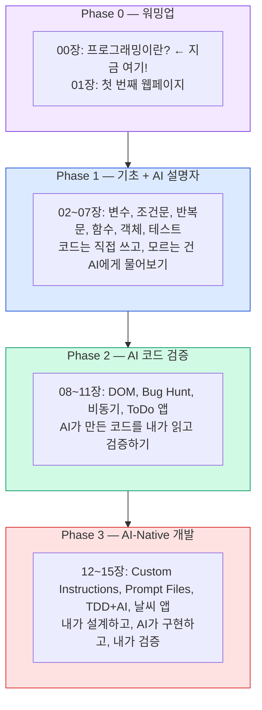

# 00장. 프로그래밍이란? + 환경 구축
{: .no_toc }

> **Day 1** · Phase 0 · 예상 시간: 90분

프로그래밍을 배우는 첫 번째 날입니다. 아무것도 몰라도 괜찮습니다. 오늘이 끝나면 컴퓨터에게 "안녕하세요!"라고 말하는 프로그램을 직접 만들게 됩니다.
{: .fs-6 .fw-300 }

---

## 학습 목표
{: .no_toc }

- "프로그래밍"이 무엇인지 자신의 말로 설명할 수 있다
- VS Code를 열고 JavaScript 파일을 만들어 실행할 수 있다
- AI(ChatGPT)에게 프로그래밍 개념을 질문하는 방법을 알 수 있다

---

## 진행 순서
{: .no_toc .text-delta }
<a name="toc"></a>

1. [1️⃣ 프로그래밍이란?](#1-프로그래밍이란)
2. [2️⃣ JavaScript는 무엇인가?](#2-javascript는-무엇인가)
3. [3️⃣ 개발 환경 설정](#3-개발-환경-설정)
4. [4️⃣ AI를 학습 파트너로 만들기](#4-ai를-학습-파트너로-만들기)
5. [5️⃣ 이 과정에서 만들 것](#5-이-과정에서-만들-것)
6. [6️⃣ 정리](#6-정리)

---

## ⭐ 핵심: 1️⃣ 프로그래밍이란? [↑](#toc)

### 요리 레시피와 프로그래밍

요리를 해본 적 있나요? 라면 하나를 끓이는 것도 프로그래밍과 똑같은 구조를 가지고 있습니다.

**라면 끓이는 법 (레시피)**
```
1. 물 550ml를 냄비에 붓는다
2. 물이 끓을 때까지 기다린다
3. 스프를 넣는다
4. 면을 넣는다
5. 4분 30초 동안 끓인다
6. 불을 끄고 그릇에 담는다
```

이 레시피에는 세 가지 요소가 있습니다:

| 요리 | 프로그래밍 |
|------|-----------|
| 재료 (물, 면, 스프) | **데이터** (숫자, 글자, 사진) |
| 순서 (1번 → 6번) | **알고리즘** (컴퓨터가 따르는 순서) |
| 완성된 라면 | **프로그램** (실행 결과) |

> **핵심 정의**: 프로그래밍이란 컴퓨터에게 줄 **레시피를 쓰는 것**입니다.

### 컴퓨터는 왜 레시피가 필요한가?

사람에게는 "라면 끓여줘"라고 말하면 알아서 합니다. 경험이 있기 때문입니다.  
하지만 컴퓨터는 경험이 없습니다. **모든 것을 명확하게** 알려줘야 합니다.

"숫자 두 개를 더해줘" — 컴퓨터는 이 말을 모릅니다.  
"첫 번째 숫자와 두 번째 숫자를 받아서, 둘을 더한 결과를 돌려줘" — 이렇게 정확히 말해야 합니다.

이 "정확한 지시"를 쓰는 것이 프로그래밍입니다.

### 프로그래밍 언어란?

컴퓨터는 사실 0과 1만 이해합니다. (전기가 켜지면 1, 꺼지면 0)

```
0101010001101000011010010111001100100000011010010111001100100000
01100001001000000111001101100101011011100111010001100101011011100110
```

이것이 "This is a sentence"를 컴퓨터가 보는 방식입니다. 사람이 읽기엔 너무 힘듭니다.

그래서 사람이 읽을 수 있는 언어와 컴퓨터의 0/1 사이를 연결하는 것이 **프로그래밍 언어**입니다.

```
[사람] JavaScript → [번역기] 컴파일러/인터프리터 → [컴퓨터] 0과 1
```

세계에는 수백 개의 프로그래밍 언어가 있습니다. Python, Java, C++, Ruby, Swift... 그리고 우리가 배울 **JavaScript**도 그 중 하나입니다.

### 잠깐, 실습해봐요

> 💡 **실습 흐름**: 강사 시연 보기 → 함께 따라하기 → 혼자 변형해 보기

아래 두 가지를 비교해봅시다. 같은 의미이지만 하나는 사람이, 하나는 컴퓨터가 이해합니다.

**사람이 쓰는 말:**
> "5와 3을 더해서 결과를 화면에 보여줘"

**JavaScript (프로그래밍 언어):**
```javascript
console.log(5 + 3);
// 결과: 8
```

어떤가요? JavaScript가 생각보다 읽기 쉽지 않나요? `console.log`가 "화면에 보여줘"라는 뜻이고, `5 + 3`은 그대로 5 더하기 3입니다.

---

## ⭐ 핵심: 2️⃣ JavaScript는 무엇인가? [↑](#toc)

### 왜 JavaScript인가?

프로그래밍 언어가 수백 개인데 왜 JavaScript를 배울까요?

**이유 1: 웹 브라우저에서 바로 실행됩니다**

여러분이 지금 사용하는 크롬, 파이어폭스, 사파리 — 모든 브라우저는 JavaScript를 기본으로 이해합니다. 설치 없이, 주소창에 URL만 입력하면 JavaScript 프로그램이 실행됩니다.

네이버를 열고 검색창에 글자를 타이핑하면 자동완성이 뜨죠? 그게 JavaScript입니다.  
유튜브에서 동영상이 재생되는 것도 JavaScript입니다.  
카카오톡 웹 버전에서 메시지를 보내는 것도 JavaScript입니다.

**이유 2: 서버에서도 실행됩니다 (Node.js)**

원래 JavaScript는 브라우저 전용이었습니다. 2009년, Ryan Dahl이라는 개발자가 Node.js를 만들었고, 그 이후로 JavaScript는 서버에서도 실행됩니다.

```
예전: JavaScript = 웹 브라우저 전용
지금: JavaScript = 웹 브라우저 + 서버 + 모바일 앱 + 데스크톱 앱
```

**이유 3: 취업 시장에서 가장 많이 사용됩니다**

Stack Overflow의 2024년 개발자 설문조사에 따르면, JavaScript는 12년 연속 가장 많이 사용되는 프로그래밍 언어 1위입니다.

**이유 4: AI와 함께 쓰기 가장 좋습니다**

ChatGPT, GitHub Copilot 등 AI 도구들이 JavaScript 코드를 가장 잘 생성합니다. 예제와 자료가 가장 많기 때문입니다. AI-Native 개발에 최적화된 언어입니다.

### JavaScript가 실제로 쓰이는 곳

```
웹사이트 → 네이버, 유튜브, 구글 등 거의 모든 웹사이트
모바일 앱 → React Native로 iOS/Android 앱 개발
데스크톱 앱 → Electron으로 VS Code, Slack, Discord 등
서버 → Node.js로 백엔드 서버
게임 → 브라우저 기반 게임
AI/ML → TensorFlow.js로 브라우저에서 AI 실행
```

### 브라우저 콘솔에서 바로 써보기

> 💡 **실습 흐름**: 강사 시연 보기 → 함께 따라하기 → 혼자 변형해 보기

강사 시연을 보면서 따라하세요. 지금 당장 JavaScript를 실행할 수 있습니다. 설치가 필요 없어요!

1. Chrome 브라우저를 엽니다
2. 아무 페이지에서 `F12` 키를 누릅니다 (Mac: `Cmd + Option + J`)
3. "Console" 탭을 클릭합니다
4. 아래 코드를 타이핑합니다:

```javascript
1 + 1
// 결과: 2

"안녕" + "하세요"
// 결과: "안녕하세요"

Math.max(10, 20, 30)
// 결과: 30
```

어떤가요? 계산기이자 프로그래밍 환경입니다. 이것이 JavaScript의 힘입니다.

---

## ⭐ 핵심: 3️⃣ 개발 환경 설정 [↑](#toc)

> 💡 **실습 흐름**: 강사 시연 보기 → 함께 따라하기 → 혼자 변형해 보기

이제 본격적인 개발 환경을 만듭니다. 두 가지를 설치할 겁니다: **Node.js** (JavaScript 실행 엔진)와 **VS Code** (코드 편집기).

### 3-1. Node.js 설치

**Node.js가 무엇인가?**

Chrome 브라우저 안에는 "V8"이라는 JavaScript 엔진이 있습니다. Node.js는 이 엔진을 꺼내서 컴퓨터 어디서든 JavaScript를 실행할 수 있게 만든 것입니다.

마치 자동차 엔진을 꺼내 발전기로 사용하는 것과 같습니다.

**설치 방법**

1. [https://nodejs.org](https://nodejs.org) 에 접속합니다
2. 두 가지 버전이 보입니다:
   - **LTS** (Long Term Support): 안정적인 버전 ← **이것을 선택하세요**
   - Current: 최신 기능, 불안정할 수 있음
3. LTS 버튼을 클릭해서 설치 파일을 다운로드합니다
4. 다운로드된 파일을 실행하고 "다음" → "다음" → "설치"를 클릭합니다

**설치 확인**

설치가 끝나면 **터미널**을 열어서 확인합니다.

- Windows: `시작 버튼` → `cmd` 검색 → `명령 프롬프트` 실행
- Mac: `Cmd + Space` → `terminal` 검색 → `터미널` 실행

```bash
node -v
# v20.x.x 같은 버전 번호가 나오면 성공!

npm -v
# 10.x.x 같은 버전 번호가 나오면 성공!
```

버전 번호가 보이면 성공입니다. `npm`은 Node.js와 함께 설치되는 패키지 관리자입니다 (나중에 설명).

> **문제 해결**: 숫자 대신 "command not found" 나 "npm은(는) 내부 또는 외부 명령..."이라고 뜬다면 Node.js를 다시 설치하거나 터미널을 완전히 닫고 다시 열어보세요.

### 3-2. VS Code 설치

**VS Code가 무엇인가?**

코드를 쓰는 곳입니다. 메모장에도 코드를 쓸 수 있지만, VS Code는 코드를 쓸 때 도움이 되는 기능이 가득합니다.

마치 일반 공책과 전문 다이어리의 차이 같은 것입니다. 둘 다 쓸 수 있지만 전문 다이어리에는 구분선, 날짜칸, 체크리스트 등이 미리 있습니다.

VS Code의 주요 기능:
- **문법 색상 강조**: 코드 종류별로 색이 다르게 표시됨
- **자동 완성**: 타이핑 중에 완성 후보를 제안
- **오류 표시**: 문법 오류를 빨간 밑줄로 즉시 알려줌
- **터미널 내장**: VS Code 안에서 터미널을 열 수 있음

**설치 방법**

1. [https://code.visualstudio.com](https://code.visualstudio.com) 에 접속합니다
2. 자신의 운영체제에 맞는 버튼을 클릭합니다 (Windows / Mac)
3. 다운로드된 파일을 실행하고 설치합니다

**추천 확장 프로그램 설치**

VS Code를 열면 왼쪽에 블록 모양 아이콘이 있습니다. 클릭하면 확장 프로그램 검색창이 뜹니다.

아래 두 가지를 검색해서 설치하세요:

1. **Korean Language Pack for Visual Studio Code**
   - 검색어: `Korean Language Pack`
   - VS Code 메뉴를 한국어로 바꿔줍니다

2. **Live Server**
   - 검색어: `Live Server`
   - HTML 파일을 저장할 때마다 브라우저가 자동으로 새로고침됩니다
   - 다음 장에서 매우 유용하게 씁니다

### 3-3. 첫 JavaScript 파일 만들기

드디어! 첫 프로그램을 만들 시간입니다.

**폴더 만들기**

1. 컴퓨터에서 작업할 폴더를 만듭니다
   - 예: 바탕화면에 `javascript-study` 폴더 생성

2. VS Code를 열고, 메뉴에서 `파일 > 폴더 열기`를 클릭합니다

3. 방금 만든 `javascript-study` 폴더를 선택합니다

**파일 만들기**

VS Code 왼쪽의 파일 탐색기에서 새 파일 아이콘(빈 종이 모양)을 클릭합니다.

파일 이름을 `hello.js`로 입력하고 Enter를 누릅니다.

(`.js`가 JavaScript 파일 확장자입니다. 마치 `.doc`가 Word 파일인 것처럼)

**코드 작성**

열린 파일에 아래 코드를 직접 타이핑합니다. (복사 붙여넣기 말고 손으로 타이핑하세요! 타이핑하면서 익힙니다)

```javascript
console.log("안녕하세요!");
console.log("저는 프로그래밍을 배우고 있습니다.");
console.log("오늘이 첫 번째 날입니다!");
```

`Ctrl + S` (Mac: `Cmd + S`)로 저장합니다.

**실행하기**

VS Code 상단 메뉴에서 `터미널 > 새 터미널`을 클릭합니다.

터미널에 아래 명령어를 입력합니다:

```bash
node hello.js
```

결과:
```
안녕하세요!
저는 프로그래밍을 배우고 있습니다.
오늘이 첫 번째 날입니다!
```

**축하합니다! 첫 번째 프로그램을 실행했습니다!**

잠깐, `console.log()`가 무슨 뜻인지 알아볼까요?

```javascript
console.log("안녕하세요!");
//  ↑         ↑
//  콘솔에    이것을 출력해줘
//  기록해줘
```

`console`은 "콘솔(화면)"이고, `log`는 "기록하다/출력하다"는 뜻입니다. 그 사이의 점(`.`)은 "콘솔의 log 기능을 사용해"라는 의미입니다. 괄호 안에는 출력할 내용을 넣습니다. 큰따옴표 `"`는 "이것은 글자야"라고 알려주는 표시입니다.

### 3-4. 브라우저 콘솔에서도 해보기

Node.js로 터미널에서 실행했는데, 브라우저에서도 됩니다!

1. Chrome을 열고 `F12` 키를 누릅니다
2. "Console" 탭을 클릭합니다
3. 아래를 타이핑합니다:

```javascript
alert("반갑습니다!");
```

Enter를 누르면 팝업 창이 뜹니다! 확인을 클릭하면 닫힙니다.

이번엔 다른 것도 해봅시다:

```javascript
console.log("브라우저에서도 작동합니다!");
// 콘솔 탭에 메시지가 출력됩니다

document.title = "내가 바꿨어요!";
// 브라우저 탭 제목이 바뀝니다!
```

`document.title`은 웹페이지의 제목을 말합니다. JavaScript로 실시간으로 바꿀 수 있습니다. 신기하죠?

---

## ⭐ 핵심: 4️⃣ AI를 학습 파트너로 만들기 [↑](#toc)

### ChatGPT 소개

ChatGPT는 OpenAI가 만든 AI 챗봇입니다. [https://chat.openai.com](https://chat.openai.com) 에서 무료로 사용할 수 있습니다. (계정 가입 필요)

많은 사람들이 ChatGPT를 두려워하거나 "치팅"이라고 생각합니다. 하지만 이 과정에서 ChatGPT는 **친절한 선생님**입니다.

### AI는 무서운 게 아니라 친절한 선생님

생각해보세요. 좋은 선생님에게는 어떤 질문이든 할 수 있습니다.

> "이거 왜 이렇게 되는 거예요?"  
> "저는 아직도 이해가 안 돼요."  
> "다시 한번만 설명해주실 수 있어요?"

ChatGPT는 지치지 않습니다. 밤 12시에도 답해줍니다. 같은 질문을 열 번 해도 짜증내지 않습니다. 어떤 비유를 들어야 이해할지 알려달라고 하면 여러 가지로 설명해줍니다.

이 과정에서 ChatGPT는 **개념 선생님**입니다. 모르는 개념이 생기면 바로 물어보세요.

### 좋은 질문 만들기

AI에게 좋은 질문을 하는 것도 실력입니다. 아래 예시를 보세요.

**좋은 질문 예시:**

```
"프로그래밍에서 변수가 뭐야? 비전공자인 나에게 쉽게 설명해줘."

"JavaScript에서 세미콜론(;)은 왜 쓰는 거야? 없으면 어떻게 돼?"

"console.log()가 정확히 어떤 역할을 해? 실제 예시로 설명해줘."

"프로그래밍에서 함수가 뭔지 요리 비유로 설명해줄 수 있어?"

"다음 에러 메시지가 무슨 뜻인지 설명해줘:
  ReferenceError: result is not defined"
```

좋은 질문의 특징:
- 구체적입니다 (무엇을 모르는지 명확)
- 내 수준을 알려줍니다 ("비전공자", "처음 배우는")
- 원하는 설명 방식을 요청합니다 ("비유로", "예시로")
- 에러가 났을 때 에러 메시지를 그대로 붙여넣습니다

**이 단계에서 나쁜 질문 예시:**

```
❌ "로그인 기능 코드 만들어줘"
❌ "버튼 클릭하면 팝업 뜨는 코드 짜줘"
❌ "자기소개 페이지 HTML 코드 주세요"
```

지금 단계에서 AI에게 코드를 달라고 하면 안 됩니다. **왜냐고요?**

요리 학원을 생각해봅시다. 요리 학원에서 "셰프님, 그냥 만들어주세요, 저는 먹을게요"라고 하면 요리를 배울 수 없습니다. 지금은 직접 손으로 하면서 익히는 단계입니다.

### Phase 0 AI 사용 규칙

> **AI 사용 규칙 — Phase 0**  
> ✅ **허용**: 개념 설명 요청, 에러 메시지 해석, 비유로 설명 요청  
> ❌ **금지**: 코드 생성 요청, 과제 코드 요청  
{: .label .label-red }

이 규칙은 여러분을 위한 것입니다. Phase 1이 되면 더 많은 것을 AI에게 물어볼 수 있고, Phase 3이 되면 AI와 완전히 함께 코딩합니다. 지금은 기초 근육을 만드는 시간입니다.

### 실습: ChatGPT에게 질문해보기

지금 ChatGPT를 열고 아래 질문을 해보세요:

```
"나는 지금 JavaScript를 처음 배우는 비전공자야.
프로그래밍에서 '알고리즘'이 뭔지, 요리 레시피 비유 말고
다른 일상생활 예시로 설명해줄 수 있어?"
```

ChatGPT의 답변을 읽고, 더 궁금한 게 있으면 바로 이어서 물어보세요. 대화를 이어나가는 것이 중요합니다.

---

## 📖 더 알아보기: 5️⃣ 이 과정에서 만들 것 [↑](#toc)

> 수업 후에 천천히 읽어보세요. 이 과정의 전체 그림을 파악하는 데 도움이 됩니다.

이 과정에서 무엇을 배우고 만들지 미리 보겠습니다.

### 전체 로드맵



### 최종 결과물 미리보기

이 과정이 끝나면 두 가지가 완성됩니다:

**1. 날씨 앱**

실제로 동작하는 웹 애플리케이션입니다. 도시 이름을 입력하면 실시간 날씨 정보가 표시됩니다.

```
weather-app/
├── index.html       ← 사용자 화면 (버튼, 입력창, 날씨 표시)
├── src/
│   ├── app.js       ← 앱의 핵심 로직
│   └── api.js       ← 날씨 데이터 가져오기
└── tests/
    └── app.test.js  ← 코드 검증 테스트
```

**2. AI-Native 개발 환경**

단순히 앱을 만드는 것을 넘어, AI와 협업하는 나만의 개발 환경을 갖게 됩니다.

```
.github/
├── copilot-instructions.md        ← AI에게 프로젝트 규칙 알려주기
├── instructions/
│   ├── javascript.instructions.md ← JS 코딩 컨벤션
│   └── testing.instructions.md    ← Vitest 테스트 규칙
├── prompts/
│   ├── new-feature.prompt.md      ← "새 기능 추가" 요청 템플릿
│   ├── write-tests.prompt.md      ← "테스트 작성" 요청 템플릿
│   └── debug-code.prompt.md       ← "디버깅" 요청 템플릿
└── agents/
    └── tdd-agent.md               ← TDD 사이클 에이전트
```

### 각 Phase에서의 변화

| Phase | 나의 역할 | AI의 역할 |
|-------|---------|---------|
| 0 (지금) | 직접 모든 것을 한다 | 개념 설명 선생님 |
| 1 | 코드를 직접 쓴다 | 모르는 것 설명해주는 도우미 |
| 2 | AI 코드를 읽고 검증한다 | 초안 코드 생성 |
| 3 | 설계하고 지시한다 | 구현 담당 파트너 |

> **비유**: 자전거 배우기와 같습니다. 처음엔 보조바퀴 없이 직접 탑니다(Phase 0-1). 익숙해지면 두 손을 놓고도 탈 수 있습니다(Phase 2-3).

---

## ⭐ 핵심: 6️⃣ 정리 [↑](#toc)

### 이 장에서 배운 것

| 개념 | 한 줄 정리 |
|------|----------|
| 프로그래밍 | 컴퓨터에게 줄 레시피를 쓰는 것 |
| 알고리즘 | 문제를 푸는 순서/방법 |
| 프로그래밍 언어 | 사람과 컴퓨터 사이의 번역 매개체 |
| JavaScript | 브라우저와 서버 모두에서 실행되는 프로그래밍 언어 |
| Node.js | 브라우저 밖에서 JavaScript를 실행하는 환경 |
| VS Code | 코드를 편리하게 작성하는 전문 편집기 |
| `console.log()` | 터미널/콘솔에 텍스트를 출력하는 명령 |

### 학습 체크리스트

아래 항목을 모두 완료했는지 확인하세요:

- [ ] Node.js를 설치하고 `node -v`로 버전을 확인했다
- [ ] VS Code를 설치했다
- [ ] Korean Language Pack과 Live Server 확장을 설치했다
- [ ] `hello.js` 파일을 만들고 `node hello.js`로 실행했다
- [ ] 브라우저 콘솔에서 `alert("반갑습니다!")`를 실행했다
- [ ] ChatGPT에 프로그래밍 관련 질문을 한 번 이상 해봤다

### 자주 하는 실수

**1. 대소문자 오류**
```javascript
Console.log("안녕");  // ❌ 오류! C가 대문자
console.log("안녕");  // ✅ 맞습니다
```

**2. 괄호나 따옴표를 빠뜨림**
```javascript
console.log "안녕";   // ❌ 괄호가 없음
console.log("안녕"    // ❌ 닫는 괄호가 없음
console.log("안녕");  // ✅ 맞습니다
```

**3. 파일 저장을 안 함**
- 코드를 바꾸고 저장하지 않으면 예전 코드가 실행됩니다
- VS Code 탭에 점(●)이 있으면 저장이 안 된 상태입니다
- `Ctrl + S` (Mac: `Cmd + S`)로 항상 저장하세요

### 핵심 한 줄

> 프로그래밍은 컴퓨터에게 주는 레시피입니다. 정확하고 순서가 있어야 합니다.

---

### 다음 장 미리보기

**01장: 첫 번째 웹페이지 만들기**

다음 장에서는 실제 웹페이지를 만듭니다. HTML로 뼈대를 만들고, JavaScript로 움직임을 추가합니다. 버튼을 클릭하면 화면이 바뀌는 인터랙티브 웹페이지를 30분 안에 완성합니다.

다음 내용으로 넘어가기 전에:
- VS Code와 Node.js가 정상적으로 설치되어 있는지 확인하세요
- Live Server 확장이 설치되어 있는지 확인하세요

[다음 장: 01장. 첫 번째 웹페이지 만들기 →](/ai-native-js/first-page)

---

*Phase 0 — AI 사용 규칙: 개념 질문만 허용. 코드 생성 요청 금지.*
{: .label .label-red }
