# AI-Native JavaScript 교육설계 분석 보고서

## 다중 페르소나 비판적 검토: 자기주도형 → 5일 대면 집중과정 전환

> **목적:** 현행 "자기 주도형 웹 문서 + 주 1회 멘토링" 형식을 "1일 8시간 × 5일(40시간) 대면 집중 교육"으로 전환하기 위한 분석 및 개선 방안 도출  
> **현행 구조:** 16개 챕터, 4단계 Phase (0: Warming up → 1: Foundation → 2: Validator → 3: AI-Native)  
> **대상:** 비전공자 (프로그래밍 경험 없음)  
> **분석일:** 2026-04-17

---

## 1. 현행 콘텐츠 구조 요약

### 전체 구성 (16챕터, 4 Phase)

```mermaid
flowchart LR
    subgraph P0["Phase 0: Warming Up"]
        C00["00장: 프로그래밍이란?"]
        C01["01장: 첫 웹페이지"]
    end
    subgraph P1["Phase 1: Foundation"]
        C02["02장: 변수/데이터타입"]
        C03["03장: 조건문"]
        C04["04장: 반복문/배열"]
        C05["05장: 함수"]
        C06["06장: 객체/배열 심화"]
        C07["07장: 테스트+AI도구"]
    end
    subgraph P2["Phase 2: Validator"]
        C08["08장: DOM/이벤트"]
        C09["09장: AI출력 평가법"]
        C10["10장: 비동기 JS"]
        C11["11장: ToDo 프로젝트"]
    end
    subgraph P3["Phase 3: AI-Native"]
        C12["12장: Custom Instructions"]
        C13["13장: Prompt Files"]
        C14["14장: TDD+AI에이전트"]
        C15["15장: 날씨앱 캡스톤"]
    end

    P0 --> P1 --> P2 --> P3

    style P0 fill:#E3F2FD,stroke:#1565C0
    style P1 fill:#FFF3E0,stroke:#FF9800
    style P2 fill:#E8F5E9,stroke:#4CAF50
    style P3 fill:#F3E5F5,stroke:#7B1FA2
```

### AI 역할의 점진적 확대

| Phase | AI 역할 | 학생 역할 | 도구 |
|-------|---------|----------|------|
| **0** | 개념 설명자 | 직접 코드 작성 | ChatGPT (질문만) |
| **1** | 설명자/도우미 | 직접 코드 작성 | ChatGPT + Copilot (참고만) |
| **2** | 코드 생성자 | 검증자/테스터 | Copilot (생성+검증) |
| **3** | 구현 파트너 | 설계자/아키텍트 | Copilot + Instructions + Prompt Files + TDD |

### 현행 학습 형식 vs 변경 필요

| 항목 | 현행 | 변경 후 |
|------|------|---------|
| **형식** | 자기 주도형 웹 문서 + 주 1회 멘토링(2시간) | **1일 8시간 × 5일 대면 집중 교육** |
| **총 시간** | 약 30-40시간 (자기 학습) + 8시간 (멘토링 4회) | **40시간 (대면)** |
| **진행 속도** | 개인 페이스 | **강사 주도 + 동기화** |
| **실습 방식** | 혼자 따라하기 | **강사 시연 → 따라하기 → 팀 활동** |

---

## 2. 다중 페르소나 비판적 검토

### 페르소나 A: 코딩 부트캠프 강사 (7년 경력, 비전공자 대상 전문)

> *"16챕터를 40시간에 우겨넣으면 비전공자는 3일차에 이탈합니다."*

#### 핵심 지적

1. **콘텐츠 과부하 — 16챕터/40시간은 비현실적**
   - 자기 주도형에서는 각 챕터 2-3시간이지만, 대면 수업에서는 설명 + Q&A + 트러블슈팅으로 **1.5-2배** 소요
   - Phase 1(6챕터)만 해도 최소 15-18시간 필요 → 나머지 3일로 Phase 2+3 불가능
   - **제안:** 16챕터 → **10-12챕터로 압축**, Phase 3의 일부를 "맛보기" 수준으로 축소

2. **Phase 1이 너무 "전통적 프로그래밍 교육"**
   - 변수→조건문→반복문→함수→객체 순서는 CS 전공 커리큘럼 그대로
   - 비전공자 5일 과정에서 이 순서를 밟으면 Day2 오후에 "왜 이걸 배우는 거지?" 동기 상실
   - **제안:** "만들면서 배우기" — Day1부터 동작하는 것을 만들고, 필요한 문법을 그때그때 배우는 방식

3. **실습 프로젝트가 후반에 집중**
   - ToDo 앱(11장), 날씨 앱(15장)이 과정 후반에만 등장
   - 비전공자는 "내가 만든 것이 동작한다"는 성취감이 매일 필요
   - **제안:** 매일 하나의 미니 프로젝트 완성 (Day1: 자기소개 페이지, Day2: 계산기, Day3: ToDo, Day4: 날씨앱, Day5: 자유 프로젝트)

4. **대면 수업에 필요한 참여 활동 전무**
   - 현행은 웹 문서라 아이스브레이커, 에너자이저, 팀 활동이 없음
   - 8시간 대면에서 강의+실습만으로는 5시간차에 집중도 붕괴
   - **제안:** Agentria 과정과 동일한 참여 활동 프레임 (Standup, 퀴즈, 에너자이저, TIL)

5. **비동기(10장) 내용이 비전공자 5일 과정에 과도**
   - Promise, async/await는 전공자도 어려워하는 개념
   - 비전공자 5일 과정에서는 `fetch` 사용법만 "따라하기"로 충분
   - **제안:** 비동기 이론 제거 → "API에서 데이터 가져오기"를 레시피로 제공

---

### 페르소나 B: AI-네이티브 개발 전도사 (Vibe Coding 전문가)

> *"2025-2026년에 비전공자에게 for문을 가르치는 건 마차 모는 법을 가르치는 것과 같습니다."*

#### 핵심 지적

1. **Phase 1의 "AI 없이 코드 직접 작성" 원칙이 40시간에는 비효율적**
   - 현행: Phase 1에서 6챕터 동안 AI 코드 생성 금지, 직접 작성만
   - 40시간 과정에서 비전공자가 for문을 직접 작성하는 데 3시간을 쓰는 것은 낭비
   - **제안:** Phase 0-1을 합치고, Day1부터 "AI가 코드를 써주고, 나는 읽고 수정하기" 접근
   - 단, "코드를 전혀 이해하지 않아도 된다"가 아니라 "AI가 쓴 코드를 읽고 수정할 수 있다"가 목표

2. **Cursor/Windsurf IDE가 교육 도구로 더 적합할 수 있음**
   - 현행은 VS Code + GitHub Copilot 조합
   - Cursor는 AI-네이티브로 설계된 IDE — 비전공자에게 더 직관적
   - 2025-2026 부트캠프 트렌드: Cursor/Windsurf가 교육용 표준으로 부상 중
   - **제안:** VS Code + Copilot 대신 **Cursor IDE** 를 주 도구로 채택 고려 (또는 둘 다 소개 후 선택)

3. **"Vibe Coding" 접근이 비전공자에게 더 효과적**
   - Andrej Karpathy가 제안한 Vibe Coding: "코드를 라인별로 쓰는 것이 아니라, 대화로 AI에게 지시하여 개발"
   - 비전공자에게는 "프롬프트로 앱 만들기"가 "for문 배우기"보다 동기 부여 효과 높음
   - **제안:** Day1 아이스브레이커로 "프롬프트만으로 웹 앱 만들기" 데모 → "이것이 5일 후 여러분의 모습입니다"

4. **현행 Phase 3 콘텐츠는 40시간에서 핵심**
   - Custom Instructions, Prompt Files, TDD+AI 에이전트는 2025-2026 실무 워크플로우의 핵심
   - 현행 배치에서는 가장 마지막에 위치하여 시간 부족으로 삭감 위험
   - **제안:** Phase 3의 핵심(Custom Instructions, 기본 Prompt Files)을 Day3부터 도입하여 시간 확보

---

### 페르소나 C: 교육공학 전문가 (Instructional Design)

> *"자기 주도형 웹 문서를 대면 수업에 그대로 옮기면 안 됩니다. 설계 원리가 완전히 다릅니다."*

#### 핵심 지적

1. **자기 주도형 → 대면 전환 시 핵심 차이**

   | 차원 | 자기 주도형 | 대면 집중 |
   |------|-----------|----------|
   | 속도 조절 | 개인이 조절 | 강사가 전체 동기화 |
   | 반복 학습 | 원하는 만큼 재방문 | 한 번 지나가면 끝 |
   | 질문 방식 | 비동기 (글로 질문) | 즉시 (손 들고 질문) |
   | 동기 관리 | 자기 의지 | 강사가 에너지 관리 |
   | 평가 | 자가 체크포인트 | 실시간 확인 |

2. **"게이트웨이 체크포인트" 재설계 필요**
   - 현행: Phase 1→2 전환 시 "if/else, 반복문, 함수를 AI 없이 작성 가능" 게이트
   - 대면 40시간에서 이 게이트를 Day2에 두면, 통과 못하는 학생이 Day3부터 따라가지 못함
   - **제안:** 엄격한 게이트 대신 "이해도 자가진단 퀴즈 + 보충 실습 시간" 으로 유연하게 전환

3. **인지 부하 관리 — I Do / We Do / You Do 모델**
   - 대면 수업의 골든 패턴:
     - **I Do** (10분): 강사가 시연
     - **We Do** (15분): 강사와 함께 따라하기
     - **You Do** (15분): 혼자 변형 미션
   - 매 40분 사이클을 이 패턴으로 구성하면 비전공자도 따라갈 수 있음

4. **스캐폴딩 전략 필수**
   - 현행 웹 문서는 "읽고 따라하기"만 있음
   - 대면에서는 "빈칸 채우기 코드" → "일부 수정 코드" → "처음부터 작성" 의 3단계 스캐폴딩 필요
   - **제안:** 모든 실습에 3단계 난이도 (기본/도전/심화) 제공

5. **매일 "오늘 만든 것" 산출물이 있어야 함**
   - 비전공자 동기 유지의 핵심: "오늘 내가 만든 것이 동작한다"
   - 현행은 프로젝트가 11장(ToDo), 15장(날씨앱)에만 있음
   - **제안:**

   | Day | 산출물 |
   |-----|--------|
   | Day1 | 나만의 자기소개 웹페이지 (HTML+JS) |
   | Day2 | 인터랙티브 퀴즈 게임 |
   | Day3 | AI 협업 ToDo 앱 |
   | Day4 | API 연동 날씨 앱 |
   | Day5 | 자유 주제 캡스톤 프로젝트 |

---

### 페르소나 D: 비전공자 수강생 관점 (대학교 4학년 경영학과)

> *"for문이 뭔지는 이해했는데, 그래서 이걸로 뭘 만들 수 있는 건가요?"*

#### 핵심 지적

1. **Day1-2가 "문법 나열"이면 포기 확률 높음**
   - 변수 → 조건문 → 반복문을 순서대로 배우면 "코딩 학원" 느낌
   - "내가 왜 이걸 배우는지"가 안 보이면 동기 급락
   - **제안:** 매 개념마다 "이것으로 만들 수 있는 것" 데모를 먼저 보여주기

2. **"코드를 직접 쓰세요" 압박감**
   - Phase 1에서 AI 코드 생성을 금지하고 직접 쓰게 하면, "나는 역시 안 되나 봐" 좌절감
   - 반면 AI가 다 써주면 "내가 한 게 뭐지?" 공허감
   - **제안:** "AI가 80% 써주고, 핵심 20%를 내가 수정/완성하기" 방식이 심리적으로 적절

3. **취업/실무 연결이 불명확**
   - "JavaScript를 배웠는데, 경영학 전공인 내가 이걸 어디에 쓰지?"
   - **제안:** 비전공자 활용 시나리오를 Day1부터 제시:
     - 마케팅: 랜딩 페이지 직접 수정
     - 기획: 프로토타입 빠르게 만들기
     - 데이터: 간단한 대시보드 제작
     - 자동화: 반복 업무 스크립트

4. **객체/배열 심화(06장)와 비동기(10장)는 5일에 과도**
   - 구조분해 할당, map/filter, Promise chain은 비전공자 5일 과정에 불필요
   - **제안:** 이 내용을 "참고 자료"로 빼고, 대신 실습 프로젝트 시간 확보

---

### 페르소나 E: 11_ai_native 과정 담당 강사 (기존 과정과의 연계 관점)

> *"11_ai_native(Python 기반)와 12_ai_native_javascript의 중복과 차별화를 정리해야 합니다."*

#### 핵심 지적

1. **11_ai_native와의 관계 정립 필요**
   - 11_ai_native: Python/AI-Native 개발 (GitHub Copilot 중심)
   - 12_ai_native_javascript: JavaScript/AI-Native 개발
   - Phase 3(Custom Instructions, Prompt Files, TDD+AI)의 개념이 거의 동일
   - **제안:** Phase 3의 공통 개념은 "AI-Native 개발 공통 원칙"으로 분리하고, JavaScript 특화 부분만 남기기

2. **평가 체계 부재**
   - 현행 웹 문서에는 점수/등급 체계가 없음 (자기 주도형이라 불필요했음)
   - 5일 대면 과정이면 평가 기준 필수
   - **제안:** FACT 프레임워크 도입
     - **F (Fundamental)**: AI 없이 기초 코드 읽기 (Day2)
     - **A (Applied)**: AI 협업 프로젝트 완성도 (Day3-4)
     - **C (Conceptual)**: 핵심 개념 퀴즈 (매일)
     - **T (Thinking)**: 캡스톤 프로젝트 (Day5)

---

## 3. 페르소나 간 교차 합의

### 5개 페르소나 공통 지적 TOP 5

| 순위 | 문제 | 합의 | 심각도 |
|------|------|------|--------|
| 1 | **16챕터가 40시간에 과도 — 10-12챕터로 압축 필요** | A,B,C,D | Critical |
| 2 | **Phase 1의 "AI 없이 직접 코딩" 원칙이 비전공자 5일에 부적합** | A,B,D | Critical |
| 3 | **매일 완성 가능한 미니 프로젝트가 없음** | A,C,D | Major |
| 4 | **대면 수업용 참여 활동/시간 구조 전무** | A,C | Major |
| 5 | **객체 심화(06장), 비동기 이론(10장)이 비전공자에게 과도** | A,D,E | Major |

### 페르소나 간 의견 충돌 및 조율

| 쟁점 | 찬성 측 | 반대 측 | 조율안 |
|------|---------|---------|--------|
| AI 코드 생성을 Day1부터 허용? | B(효율), D(동기) | A(기초 체득), C(인지 부하) | Day1 오후부터 "AI가 쓴 코드 읽기" 도입, 단 핵심 문법은 "빈칸 채우기"로 체득 |
| 비동기/Promise 포함? | E(완성도) | A,D(과도) | fetch 사용법만 "레시피"로 제공, 이론은 삭제 |
| Cursor vs VS Code+Copilot? | B(트렌드) | A(안정성), E(기존 과정 일관성) | VS Code + Copilot 유지, Day4에 Cursor 30분 "맛보기" 소개 |
| Phase 3 비중? | B(핵심), E(차별화) | A(시간 부족), D(어려움) | Custom Instructions+Prompt Files는 Day3-4에 "따라하기"로 포함, TDD는 축소 |

---

## 4. 5일(40시간) 대면 과정 재설계안

### 4.1 설계 원칙

1. **매일 "동작하는 산출물"** — 성취감이 동기를 유지
2. **AI 역할 점진적 확대** — Day1(설명자) → Day2(코드 생성자) → Day3-5(구현 파트너)
3. **I Do → We Do → You Do** — 강사 시연 → 함께 따라하기 → 혼자 변형
4. **문법은 필요할 때 배우기** — 프로젝트를 만들다가 필요한 문법을 그때 학습
5. **매일 참여 활동 60분** — Standup, 퀴즈, 에너자이저, TIL

### 4.2 Day별 구성안

#### Day 1: "나도 웹페이지를 만들 수 있다!" (8시간)

| 시간 | 활동 | 내용 | Phase |
|------|------|------|-------|
| 09:00-09:30 | 아이스브레이커 | Speed Networking + 과정 안내 | - |
| 09:30-10:00 | **데모: AI로 앱 만들기** | 강사가 프롬프트만으로 날씨앱을 5분 만에 만드는 것을 시연 → "5일 후 여러분의 모습" | - |
| 10:00-10:30 | 이론: 프로그래밍이란? | 요리 레시피 비유, JavaScript 소개 | P0 |
| 10:30-12:00 | **[따라하기] 환경 설정 + 첫 웹페이지** | VS Code, Node.js 설치, HTML 기초, 첫 "안녕하세요" 페이지 | P0 |
| 12:00-13:00 | 점심 | | |
| 13:00-13:15 | 에너자이저 | | |
| 13:15-14:30 | **변수 + 조건문 — "계산기 만들기"** | 변수(상자 비유), if/else를 "계산기 앱"을 만들면서 학습 | P1 |
| 14:30-14:45 | 쉬는시간 | | |
| 14:45-16:00 | **함수 + 이벤트 — "버튼 클릭하면 동작"** | 함수 = 레시피, onclick, DOM 기초를 "퀴즈 게임"으로 학습 | P1 |
| 16:00-16:15 | 쉬는시간 | | |
| 16:15-17:30 | **[미니 프로젝트] 나만의 자기소개 페이지** | HTML+CSS+JS 조합, 버튼/팝업/스타일 적용 | P0-1 |
| 17:30-18:00 | 산출물 공유 + Daily 퀴즈 | 짝과 서로 페이지 보여주기, OX 퀴즈 5문항 | |
| 18:00-18:30 | TIL 카드 + 미니과제 | 오늘 배운 것 1문장 + 미니과제: 자기소개 페이지 꾸미기 | |

> **Day1 산출물**: 나만의 자기소개 웹페이지 (버튼, 팝업 포함)

#### Day 2: "AI와 함께 코드 읽기" (8시간)

| 시간 | 활동 | 내용 | Phase |
|------|------|------|-------|
| 09:00-09:20 | Standup + 복습 퀴즈 | Day1 퀴즈 + 미니과제 공유 | |
| 09:20-10:30 | **반복문 + 배열 — "데이터 다루기"** | for문, 배열을 "학생 성적표 앱"으로 학습 | P1 |
| 10:30-10:45 | 쉬는시간 | | |
| 10:45-12:00 | **GitHub Copilot 설정 + "AI가 쓴 코드 읽기"** | Copilot 설치, AI 제안 코드 읽기/수정 실습 | P1→2 |
| 12:00-13:00 | 점심 | | |
| 13:00-13:15 | 에너자이저 | | |
| 13:15-14:30 | **AI 출력 평가법 — Bug Hunt 게임** | AI가 쓴 코드에서 버그 찾기 (3단계 난이도) | P2 |
| 14:30-14:45 | 쉬는시간 | | |
| 14:45-16:00 | **DOM 조작 — "버튼 누르면 화면이 바뀐다"** | querySelector, addEventListener를 AI 코드 생성+검증으로 | P2 |
| 16:00-16:15 | 쉬는시간 | | |
| 16:15-17:30 | **[미니 프로젝트] 인터랙티브 퀴즈 게임** | AI가 코드 생성 → 학생이 검증/수정 → 완성 | P2 |
| 17:30-18:00 | Bug Hunt 대결 + Daily 퀴즈 | 팀 대항 버그 찾기 대결 | |
| 18:00-18:30 | TIL 카드 + 미니과제 | | |

> **Day2 산출물**: 인터랙티브 퀴즈 게임

#### Day 3: "AI와 팀으로 개발하기" (8시간)

| 시간 | 활동 | 내용 | Phase |
|------|------|------|-------|
| 09:00-09:20 | Standup + 복습 퀴즈 | | |
| 09:20-10:00 | **테스트 입문 — "AI 코드가 맞는지 확인하기"** | Vitest 기초, "왜 테스트가 필요한가" | P2 |
| 10:00-10:45 | **Custom Instructions — "AI에게 규칙 알려주기"** | .github/copilot-instructions.md 작성 실습 | P3 |
| 10:45-12:00 | **[미니 프로젝트] AI 협업 ToDo 앱 (Part 1)** | 요구사항 작성 → AI 코드 생성 → 검증 → 테스트 | P2-3 |
| 12:00-13:00 | 점심 | | |
| 13:00-13:15 | 에너자이저 | | |
| 13:15-14:30 | **ToDo 앱 (Part 2)** — 기능 확장 | 삭제, 완료 체크, 필터링 기능 AI로 추가 | P2-3 |
| 14:30-14:45 | 쉬는시간 | | |
| 14:45-16:00 | **Prompt Files — "AI에게 요청서 만들기"** | .prompt.md 작성, 반복 작업 템플릿화 | P3 |
| 16:00-16:15 | 쉬는시간 | | |
| 16:15-17:30 | **ToDo 앱 마무리 + 교차 테스트** | 팀 간 서로의 앱 테스트 + 피드백 | P2-3 |
| 17:30-18:00 | 에이전트 배틀: ToDo 앱 대결 | 팀별 시연 + 투표 | |
| 18:00-18:30 | TIL 카드 + 미니과제 | | |

> **Day3 산출물**: AI 협업 ToDo 앱 (Custom Instructions 포함)

#### Day 4: "실제 데이터로 앱 만들기" (8시간)

| 시간 | 활동 | 내용 | Phase |
|------|------|------|-------|
| 09:00-09:20 | Standup + 복습 퀴즈 | | |
| 09:20-10:00 | **API란? — "다른 서비스에서 데이터 가져오기"** | fetch 사용법 = "전화 걸어서 정보 요청하기" (레시피 제공) | P2 |
| 10:00-10:45 | **[따라하기] 날씨 API 연동** | OpenWeatherMap API로 날씨 데이터 가져오기 | P2-3 |
| 10:45-12:00 | **[미니 프로젝트] 날씨 앱 (Part 1)** | 검색 → API 호출 → 결과 표시 | P3 |
| 12:00-13:00 | 점심 | | |
| 13:00-13:15 | 에너자이저 | | |
| 13:15-14:30 | **TDD 맛보기 — "테스트 먼저, 코드는 AI가"** | Red-Green-Refactor 사이클 체험 (간단 함수 2개) | P3 |
| 14:30-14:45 | 쉬는시간 | | |
| 14:45-16:00 | **날씨 앱 (Part 2)** — 스타일링 + 기능 확장 | CSS 적용, 검색 기록, localStorage | P3 |
| 16:00-16:15 | 쉬는시간 | | |
| 16:15-17:00 | **Cursor IDE 맛보기** (선택) | Cursor의 AI-네이티브 기능 30분 체험 | - |
| 17:00-17:30 | 날씨 앱 완성 + 공유 | | |
| 17:30-18:00 | Daily 퀴즈 | | |
| 18:00-18:30 | TIL 카드 + 캡스톤 프로젝트 안내 | Day5 자유 프로젝트 주제 선정 | |

> **Day4 산출물**: 날씨 검색 앱 (API 연동, 스타일링 포함)

#### Day 5: "나만의 앱을 세상에 내놓기" (8시간)

| 시간 | 활동 | 내용 | Phase |
|------|------|------|-------|
| 09:00-09:20 | Standup + 복습 퀴즈 | | |
| 09:20-12:00 | **[캡스톤] 자유 프로젝트 구현** | 마이크로 스프린트(30분 사이클) × 5, 팀/개인 선택 | P3 |
| 12:00-13:00 | 점심 | | |
| 13:00-13:15 | 에너자이저 | | |
| 13:15-14:30 | **프로젝트 완성 + 테스트** | 마이크로 스프린트 × 2, 교차 테스트 | P3 |
| 14:30-14:45 | 쉬는시간 | | |
| 14:45-15:30 | **발표 준비** | | |
| 15:30-17:00 | **최종 발표** | 팀당 10분 시연 + 5분 Q&A | |
| 17:00-17:30 | **시상 + AI 윤리 토론** | "AI가 코드를 써주면 개발자는 뭘 하나요?" | |
| 17:30-18:00 | **커리어 로드맵 + 수료** | 비전공자의 AI-네이티브 개발 활용 경로 | |
| 18:00-18:30 | 회고 + 네트워킹 | | |

> **Day5 산출물**: 자유 주제 캡스톤 프로젝트

### 4.3 챕터-Day 매핑 (16챕터 → 10세션으로 압축)

| 현행 챕터 | Day 배치 | 변경 사항 |
|-----------|---------|----------|
| 00장 프로그래밍이란 | Day1 오전 | 30분으로 압축 |
| 01장 첫 웹페이지 | Day1 오전 | 따라하기 실습으로 전환 |
| 02장 변수/데이터타입 | Day1 오후 | "계산기 앱"으로 통합 |
| 03장 조건문 | Day1 오후 | "계산기 앱"에 포함 |
| 04장 반복문/배열 | Day2 오전 | "성적표 앱"으로 통합 |
| 05장 함수 | Day1 오후 | "버튼 클릭" 실습에 통합 |
| **06장 객체/배열 심화** | **삭제** | **참고 자료로 이동** |
| 07장 테스트+AI도구 | Day2 오전 + Day3 오전 | Copilot 설정(Day2) + Vitest(Day3) 분리 |
| 08장 DOM/이벤트 | Day2 오후 | AI 코드 생성+검증 방식으로 |
| 09장 AI 출력 평가법 | Day2 오후 | Bug Hunt 게임으로 |
| **10장 비동기 JS** | **대폭 축소** | **fetch 레시피만 Day4에 포함** |
| 11장 ToDo 프로젝트 | Day3 전체 | 핵심 프로젝트 |
| 12장 Custom Instructions | Day3 오전 | Day3로 앞당김 |
| 13장 Prompt Files | Day3 오후 | Day3로 앞당김 |
| **14장 TDD+AI 에이전트** | **Day4 1시간으로 축소** | **"맛보기" 수준** |
| 15장 날씨앱 캡스톤 | Day4 전체 | API 부분은 레시피 제공 |

### 4.4 평가 체계

| 항목 | 배점 | 평가 방법 |
|------|------|----------|
| 출석 및 참여 | 10% | Daily 참여도 (퀴즈, 토론, 팀 활동) |
| Daily 미니과제 (4회) | 15% | Day1-4 미니과제 |
| 코드 이해도 (Bug Hunt) | 15% | Day2 Bug Hunt 점수 |
| AI 협업 프로젝트 (ToDo + 날씨) | 30% | Day3-4 프로젝트 완성도 |
| 캡스톤 프로젝트 + 발표 | 20% | Day5 최종 산출물 |
| 동료 평가 | 10% | 팀 기여도 상호 평가 |

---

## 5. 추가 권고사항

### 5.1 사전 준비 (D-7)

- [ ] VS Code + Node.js 설치 가이드 사전 배포 (스크린샷 포함)
- [ ] GitHub 계정 생성 + Copilot 학생 무료 라이선스 신청
- [ ] 실습용 폴더 구조 템플릿 GitHub repo 공유
- [ ] 수강생 사전 설문: 코딩 경험 유무, 사용 OS, 관심 분야
- [ ] OpenWeatherMap API 키 사전 발급

### 5.2 위험 관리

| 위험 | 확률 | 대응 |
|------|------|------|
| 환경 설정 실패 (Node.js/VS Code) | 높음 | Day1 첫 90분을 설정에 충분히 배분 + 조교 순회 |
| Copilot 라이선스 미승인 | 중 | 백업: ChatGPT 웹 사용 |
| 학습 속도 격차 | 높음 | 3단계 난이도(기본/도전/심화) + 보너스 챌린지 |
| Day3 이후 포기자 | 중 | 매일 산출물 성취감 + 팀 활동으로 사회적 유대 |
| API 키 제한/장애 | 낮음 | 백업 JSON 데이터 로컬 제공 |

### 5.3 도구 비교 참고

| 도구 | 장점 | 단점 | 추천 |
|------|------|------|------|
| **VS Code + Copilot** | 업계 표준, 학생 무료, 풍부한 확장 | 설정 복잡 | 주 도구 |
| **Cursor** | AI-네이티브 설계, 직관적 | 유료(무료 체험), 생태계 작음 | Day4 맛보기 |
| **Windsurf** | 무료, Cascade 기능 | 시장 점유율 낮음 | 참고만 |
| **ChatGPT 웹** | 무설정, 즉시 사용 | 에디터 통합 없음 | 백업/보조 |

---

## 6. 결론

### 핵심 전환 사항 3가지

1. **16챕터 순차 학습 → 5일 프로젝트 중심 학습**
   - 문법 나열식 → "매일 하나의 앱 완성" 구조로 전환
   - 객체 심화(06장), 비동기 이론(10장)은 삭제/축소

2. **자기 주도형 → 대면 I Do/We Do/You Do 패턴**
   - 웹 문서 "읽고 따라하기" → 강사 시연 → 함께 → 혼자
   - 매일 60분 참여 활동 (Standup, 퀴즈, 에너자이저, TIL)

3. **Phase 1 "AI 금지" → Day1부터 AI 점진적 도입**
   - Day1 오후: AI가 쓴 코드 "읽기"
   - Day2: AI 코드 "검증하기"  
   - Day3-5: AI와 "함께 만들기"

> **작성 방법론**: 5개 독립 페르소나(부트캠프 강사, AI-네이티브 전도사, 교육공학자, 비전공자 수강생, 기존 과정 강사)가 각자의 관점에서 독립 분석 후, 교차 합의를 통해 우선순위를 도출하였습니다.
> **벤치마크**: LEARN Academy, Le Wagon, Zero To Mastery, GitHub Copilot Bootcamp, DeepLearning.AI, Cursor/Windsurf 공식 교육 등을 비교 분석하였습니다.
