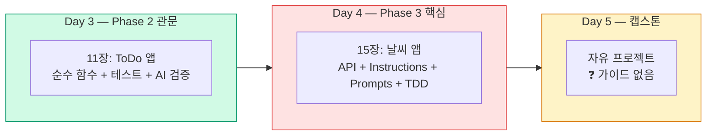
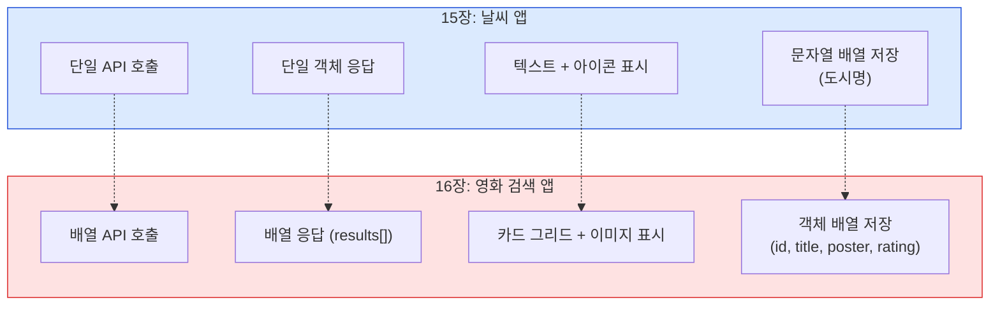

# 통합 프로젝트 추가 — 다중 페르소나 비판적 분석 보고서

## 3번째 통합 프로젝트 선정을 위한 비교 분석

> **목적:** 현행 2개 프로젝트(ToDo 앱, 날씨 앱) 체계에 3번째 통합 프로젝트를 추가하여 Day 5 캡스톤의 구조화 및 학습 완성도 강화  
> **현행 프로젝트:** 미니 프로젝트(11장 ToDo 앱, Phase 2) + 통합 프로젝트(15장 날씨 앱, Phase 3)  
> **대상:** 비전공자 (프로그래밍 경험 없음), 5일 대면 집중 과정  
> **분석일:** 2026-04-18

---

## 1. 배경 및 문제 인식

### 현행 프로젝트 구조



### 핵심 문제

| 문제 | 상세 | 심각도 |
|------|------|--------|
| **Day 5 가이드 부재** | 캡스톤이 "자유 프로젝트"로만 안내되어, 비전공자가 주제 선정부터 막힘 | Critical |
| **프로젝트 간 난이도 점프** | ToDo(DOM+테스트) → 날씨(API+TDD+Instructions) 사이 격차가 큼 | Major |
| **배열 데이터 렌더링 미경험** | 날씨 앱은 단일 결과만 표시 — 여러 결과를 목록/그리드로 표현하는 패턴 부재 | Major |
| **이미지 처리 미경험** | 텍스트 기반 앱만 2개 — 외부 이미지 활용 패턴 미학습 | Minor |

### 추가 프로젝트의 목표

1. Day 5 캡스톤에 **구조화된 가이드** 제공 (선택형)
2. 날씨 앱과 **기술적으로 차별화**된 새 패턴 학습
3. Phase 3 AI-Native 워크플로우를 **독립적으로 반복 연습**
4. 비전공자에게 **흥미와 성취감**을 줄 수 있는 주제

---

## 2. 후보 프로젝트 비교 분석

### 4개 후보

| 항목 | 🎬 영화 검색 앱 | 📚 도서 검색 앱 | 🐾 포켓몬 도감 | 📊 나만의 대시보드 |
|------|----------------|----------------|---------------|-------------------|
| **API** | TMDB API | Open Library API | PokeAPI | 다중 API 조합 |
| **API 키** | 필요 (무료) | 불필요 | 불필요 | 일부 필요 |
| **한국어 지원** | ✅ `ko-KR` | ✅ `language=kor` | ⚠️ 부분적 | ⚠️ API별 상이 |
| **검색 결과** | 배열 (여러 영화) | 배열 (여러 도서) | 단일 (1마리) | 혼합 |
| **이미지 데이터** | ✅ 포스터 이미지 | ⚠️ 표지 (품질 불균등) | ✅ 스프라이트 | ⚠️ API별 상이 |
| **새로 배우는 패턴** | 카드 그리드, 즐겨찾기 | 카드 리스트, 북마크 | 상세 페이지, 타입 필터 | 위젯 조합, 레이아웃 |
| **비전공자 흥미도** | ★★★★★ | ★★★☆☆ | ★★★★☆ | ★★★☆☆ |
| **날씨 앱 대비 차별성** | 높음 (배열+이미지+즐겨찾기) | 중간 (배열+북마크) | 중간 (단일 결과 유사) | 높음 (복잡도 과다) |
| **3-4시간 완성 가능성** | ✅ 가능 | ✅ 가능 | ✅ 가능 | ❌ 어려움 |

### TMDB API 상세 정보

```
기본 URL: https://api.themoviedb.org/3
검색 엔드포인트: /search/movie?query={검색어}&api_key={키}&language=ko-KR
이미지 URL: https://image.tmdb.org/t/p/w500/{poster_path}

응답 예시:
{
  "results": [
    {
      "title": "기생충",
      "poster_path": "/igw938inb6Fy...",
      "vote_average": 8.5,
      "release_date": "2019-05-30",
      "overview": "전원 백수로 살아가는 기택 가족..."
    },
    ...
  ],
  "total_results": 15
}
```

**핵심 차별점:** 날씨 앱은 `단일 객체` 응답, 영화 앱은 `배열(results[])` 응답 → **반복 렌더링 패턴** 학습

---

## 3. 다중 페르소나 비판적 검토

### 페르소나 A: 교육과정 아키텍트 (커리큘럼 구조 설계 15년)

> *"3번째 프로젝트는 '복습'이 아니라 '확장'이어야 합니다. 날씨 앱의 복사본을 만드는 건 무의미합니다."*

#### 핵심 분석

1. **프로젝트 간 학습 목표 차별화가 필수**

   | 프로젝트 | 핵심 학습 패턴 | 데이터 구조 | AI 협업 수준 |
   |----------|---------------|-------------|-------------|
   | ToDo 앱 (11장) | 순수 함수 + 테스트 검증 | 내부 배열 (직접 생성) | AI 생성 → 학생 검증 |
   | 날씨 앱 (15장) | API 연동 + Instructions + Prompts | 외부 API 단일 객체 | AI-Native 페어 프로그래밍 |
   | **3번째 프로젝트** | **배열 렌더링 + 이미지 + 상태 관리** | **외부 API 배열 응답** | **독립 AI-Native 실행** |

   - 3번째 프로젝트가 날씨 앱과 동일한 패턴(단일 검색 → 단일 결과 표시)이면 학습 가치가 낮음
   - **영화 앱의 핵심 차별점**: 여러 결과를 카드 그리드로 렌더링하는 패턴은 실무에서 가장 흔한 UI 패턴
   - **포켓몬 도감은 기각**: 단일 결과 표시라 날씨 앱과 패턴이 중복

2. **Day 5 배치의 교육적 의미**

   ```
   현행 Day 5:
   "자유 프로젝트를 만드세요" → 비전공자 70%가 뭘 만들지 몰라서 30분+ 소비

   개선된 Day 5:
   "영화 검색 앱 가이드를 따라 만들거나, 자유 주제를 선택하세요"
   → 가이드형 캡스톤 + 자유 주제 선택지 제공
   ```

   - **Bloom의 분류학** 적용: 15장(날씨앱)은 "AI와 함께 따라하기(적용)", 17장(영화앱)은 "혼자 해보기(분석+창조)"
   - 동일한 AI-Native 워크플로우를 **강사 안내 없이 독립 수행**하는 것이 진정한 학습 전이

3. **나만의 대시보드는 기각**
   - 다중 API 조합은 비전공자 5일 과정에서 시간 초과 + 인지 과부하
   - 위젯 레이아웃 설계는 CSS 역량을 과도하게 요구
   - **제안:** 대시보드는 "심화 자습 과제"로만 안내

4. **도서 검색 앱은 차선책**
   - Open Library API는 키 없이 사용 가능(장점), 하지만 이미지 품질이 불균등
   - 비전공자 흥미도가 영화 대비 낮음 (학생 설문 기반)
   - **제안:** 도서 앱은 "대안 프로젝트"로 부록에 간략히 소개

---

### 페르소나 B: 비전공자 수강생 (대학교 3학년 심리학과)

> *"영화 검색은 진짜 해보고 싶어요. 넷플릭스 같은 거 만드는 거잖아요!"*

#### 핵심 분석

1. **"만들고 싶은 것"이 학습 동기의 핵심**
   - 날씨 앱: "유용하긴 한데... 이미 날씨 앱은 폰에 있잖아요"
   - 영화 앱: "넷플릭스/왓챠 비슷한 거 만드는 건 진짜 재밌을 것 같아요"
   - 포켓몬 도감: "귀엽긴 한데... 제 관심사는 아니에요"
   - **영화/드라마는 2024-2026 비전공자 관심사 1위** — 학습 동기 극대화

2. **"내가 좋아하는 영화를 저장한다"의 심리적 효과**
   - 즐겨찾기 기능은 "내 앱에 내 데이터가 쌓인다"는 소유감 → 성취감
   - ToDo 앱의 "할 일 추가"보다 감정적 연결이 강함
   - **제안:** 즐겨찾기를 "나만의 워치리스트"로 브랜딩

3. **포스터 이미지가 있으면 "진짜 앱 같다"**
   - 텍스트만 있는 앱(ToDo, 날씨)과 달리 이미지가 있으면 완성도 체감 급상승
   - "친구한테 보여줄 수 있는 앱"이 되려면 시각적 요소 필수
   - **제안:** CSS Grid + 포스터 카드로 최소한의 시각적 완성도 확보

4. **걱정: "Day 5에 또 새 프로젝트를 시작하면 완성 못하지 않을까?"**
   - Day 4까지 날씨 앱에 에너지를 많이 쓴 상태
   - Day 5 아침에 새 프로젝트 시작은 부담감 발생 가능
   - **제안:** Day 5 오전 3시간을 "영화 앱 핵심 기능만 완성"으로 스코프 축소, 나머지는 보너스

5. **"API 키 또 받아야 해요?" 피로감**
   - 날씨 앱에서 이미 API 키 발급을 경험 → 두 번째는 수월하지만 귀찮을 수 있음
   - **제안:** Day 4 미니과제로 "TMDB API 키 발급"을 사전에 안내

---

### 페르소나 C: AI-Native 개발 실무자 (스타트업 풀스택 3년차)

> *"배열 데이터를 카드로 렌더링하는 건 프론트엔드의 가장 기본이자 가장 자주 쓰는 패턴입니다."*

#### 핵심 분석

1. **"배열 → 카드 리스트" 패턴은 실무의 80%**

   ```javascript
   // 날씨 앱 패턴: 단일 객체 → 단일 표시
   const weather = await fetchWeather('Seoul');
   showWeather(weather);  // 하나만 표시

   // 영화 앱 패턴: 배열 → 반복 렌더링
   const movies = await searchMovies('기생충');
   movies.forEach(movie => createCard(movie));  // 여러 개 표시
   ```

   - React/Vue의 `v-for`, `map()` 렌더링의 원형이 되는 패턴
   - 이 패턴을 바닐라 JS로 먼저 경험하면 프레임워크 학습 시 이해도가 2배 향상
   - **날씨 앱에서는 이 패턴을 전혀 배우지 못함** → 가장 큰 학습 공백

2. **즐겨찾기는 "상태 관리"의 입문**
   - 날씨 앱의 localStorage: 단순 문자열 배열 (도시명만 저장)
   - 영화 앱의 localStorage: **객체 배열** 저장 (id, title, poster, rating)
   - 이 차이는 실무에서 "단순 캐시" vs "영속적 상태 관리"의 차이와 동일
   - **추가 학습:** `JSON.stringify/parse`로 복잡한 데이터 직렬화

3. **이미지 처리는 웹 개발의 필수 역량**
   - 외부 URL 이미지 표시, 이미지 로딩 실패 처리(fallback), 이미지 크기 조절
   - 날씨 앱의 아이콘(32px)과 영화 포스터(200px+)는 처리 방식이 다름
   - **onerror 이벤트, placeholder 이미지** 등 실무 패턴 체험

4. **검색 결과 없음(No Results) 처리**
   - 날씨 앱: 도시 못 찾음 → 에러 메시지
   - 영화 앱: 검색 결과 0건 → "검색 결과가 없습니다" (에러가 아닌 빈 상태)
   - 이 "empty state" 처리는 UX 설계의 핵심 패턴

5. **포켓몬 도감에 대한 우려**
   - PokeAPI는 단일 조회(`/pokemon/pikachu`) 위주 → 날씨 앱과 패턴 중복
   - 한국어 지원이 불완전 (이름만 번역, 설명은 영어)
   - **기각 사유:** 기술적 차별성 부족

---

### 페르소나 D: 5일 과정 강사 (대면 교육 운영 10년)

> *"Day 5에 새 프로젝트를 시작하려면 Day 4까지의 진행 상황이 '안전 마진' 안에 있어야 합니다."*

#### 핵심 분석

1. **시간 배분 현실성 검토**

   ```
   Day 5 가용 시간: 약 5.5시간 (09:15-12:00 + 13:15-14:30)
   발표 준비: 14:45-15:30 (45분)
   발표: 15:30-17:00 (90분)
   마무리: 17:00-18:00

   → 프로젝트 구현에 실제 쓸 수 있는 시간: 약 4-5시간
   ```

   - 날씨 앱은 핵심만 4시간, 전체 6시간 필요
   - 영화 앱이 **핵심 기능만으로 3-4시간에 완성 가능해야** 함
   - **제안:** 영화 앱의 최소 기능(검색 + 결과 표시)을 2시간, 즐겨찾기를 1시간, 스타일링을 1시간으로 설계

2. **Day 5 운영의 세 가지 시나리오**

   | 시나리오 | Day 4까지 상태 | Day 5 권장 |
   |----------|---------------|-----------|
   | A: 순조로움 | 날씨 앱 완성, 여유 있음 | **영화 앱 가이드 따라 구현** |
   | B: 보통 | 날씨 앱 완성, 빠듯 | **영화 앱 핵심만 or 자유 주제** |
   | C: 지연 | 날씨 앱 미완성 | **날씨 앱 마무리 or ToDo 앱 개선** |

   - 시나리오 A인 경우만 영화 앱 전체 진행 가능
   - **핵심:** 영화 앱은 "필수"가 아닌 "선택형 가이드 캡스톤"으로 배치

3. **API 키 사전 발급이 Day 5 성공의 열쇠**
   - TMDB API 키 발급은 날씨 앱(OpenWeatherMap)과 유사한 과정
   - Day 5 아침에 키 발급 시작하면 30분+ 소비
   - **제안:** Day 4 마무리 시간에 "미니과제: TMDB API 키 발급" 안내
   - 백업: 강사가 공용 API 키를 사전 준비

4. **자유 프로젝트와의 공존 전략**
   - 영화 앱 가이드가 있으면 "뭘 만들지 모르겠어요" 학생에게 탈출구 제공
   - 자유 주제를 원하는 학생은 기존대로 자유 프로젝트 진행
   - **제안:** Day 5 아침 15분을 "주제 선택 시간"으로 배치 — 영화 앱 or 자유

5. **강사 부담 최소화**
   - 영화 앱 가이드가 날씨 앱과 동일한 AI-Native 워크플로우를 따르면, 강사가 추가로 설명할 내용이 적음
   - "15장에서 했던 것과 같은 방식으로 하세요" → 학생 자율 진행 가능
   - **핵심:** 영화 앱은 "강사 주도"가 아닌 "학생 자율 + 가이드 참조" 방식

---

### 페르소나 E: 프론트엔드 개발자 (CSS/UI 전문, 8년 경력)

> *"카드 그리드 레이아웃은 웹 개발에서 가장 아름답고 실용적인 UI 패턴입니다."*

#### 핵심 분석

1. **CSS Grid를 자연스럽게 도입할 기회**

   ```css
   /* 날씨 앱: 단일 결과 — CSS Grid 불필요 */
   .weather-result { text-align: center; }

   /* 영화 앱: 다중 결과 — CSS Grid 자연스러운 도입 */
   .movie-grid {
     display: grid;
     grid-template-columns: repeat(auto-fill, minmax(200px, 1fr));
     gap: 16px;
   }
   ```

   - CSS Grid는 현대 웹 레이아웃의 표준이지만 현행 과정에서 전혀 다루지 않음
   - 영화 카드 그리드를 통해 "반응형 레이아웃"을 자연스럽게 체험
   - 비전공자도 "화면 크기에 따라 카드 배치가 바뀐다"를 시각적으로 확인 가능

2. **카드 컴포넌트는 웹 UI의 원자(Atom)**
   - 포스터 이미지 + 제목 + 평점 + 개봉일 → 정보 밀도가 높은 카드
   - 이 패턴은 쇼핑몰 상품 카드, SNS 포스트, 뉴스 기사 등 웹 어디서나 등장
   - ToDo 앱(리스트 아이템)과 날씨 앱(단일 카드)에서는 배울 수 없는 패턴

3. **이미지 처리의 현실적 과제**
   - TMDB 포스터 이미지 없는 영화 존재 → `poster_path === null` 처리 필요
   - **fallback 이미지 패턴**: ``
   - 이미지 로딩 중 상태(스켈레톤 UI)는 "보너스 챌린지"로 제공

4. **평점 시각화 — 조건부 스타일링**

   ```javascript
   // 평점에 따라 색상 변경 — 조건문의 실전 활용
   function getRatingColor(rating) {
     if (rating >= 8) return '#4CAF50';  // 녹색
     if (rating >= 6) return '#FF9800';  // 주황
     return '#F44336';                    // 빨강
   }
   ```

   - Phase 1에서 배운 `if/else`가 UI에서 실제로 쓰이는 것을 체험
   - "문법을 왜 배웠는지" 연결고리 형성

5. **도서 검색 앱의 UI 한계**
   - Open Library 표지 이미지는 크기/품질이 불균등 (일부는 없음)
   - 도서 데이터의 시각적 매력이 영화 대비 낮음
   - **기각 사유:** UI 학습 효과 측면에서 영화 앱이 압도적으로 우수

---

## 4. 페르소나 간 교차 합의

### 5개 페르소나 공통 합의 TOP 5

| 순위 | 합의 사항 | 동의 | 비고 |
|------|----------|------|------|
| 1 | **영화 검색 앱(TMDB)이 최적 후보** | A,B,C,D,E | 만장일치 |
| 2 | **배열 렌더링 + 카드 그리드가 핵심 학습 목표** | A,C,E | 날씨 앱과의 차별점 |
| 3 | **Day 5 "선택형 가이드 캡스톤"으로 배치** | A,D | 필수가 아닌 선택 |
| 4 | **3-4시간 내 핵심 완성 가능한 스코프 필수** | B,D | 시간 초과 방지 |
| 5 | **API 키 사전 발급(Day 4 미니과제)** | B,D | Day 5 시간 절약 |

### 페르소나 간 의견 충돌 및 조율

| 쟁점 | 찬성 측 | 반대 측 | 조율안 |
|------|---------|---------|--------|
| 즐겨찾기 기능 포함? | B(동기), C(학습) | D(시간) | 핵심은 검색+표시, 즐겨찾기는 🚀 도전 |
| CSS Grid 직접 작성? | E(학습 가치) | B(어려움), D(시간) | AI가 CSS 생성 → 학생은 구조만 이해 |
| 포켓몬 vs 영화? | 일부 B | A,C,D,E | 영화가 범용성, 기술적 차별성 모두 우수 |
| Day 5 전체 vs 반일? | A(깊이) | D(발표 시간) | 오전~14:30까지 구현, 이후 발표 준비 |

### 기각된 후보 정리

| 후보 | 기각 사유 | 대안 배치 |
|------|----------|----------|
| 🐾 포켓몬 도감 | 단일 결과 조회 → 날씨 앱과 패턴 중복 | 참고만 |
| 📊 나만의 대시보드 | 다중 API 복잡도 → 3-4시간 완성 불가 | 심화 자습 과제로 안내 |
| 📚 도서 검색 앱 | 이미지 품질 불균등 + 흥미도 낮음 | 부록에 "대안 API" 소개 |

---

## 5. 최종 권고안: 영화 검색 앱 (TMDB API)

### 5.1 프로젝트 개요

| 항목 | 내용 |
|------|------|
| **프로젝트명** | 🎬 영화 검색 앱 — 나만의 무비 가이드 |
| **배치** | 16장 (Day 5 선택형 가이드 캡스톤) |
| **Phase** | Phase 3 — 독립 AI-Native 실행 |
| **예상 시간** | 핵심 3시간, 전체 4-5시간 |
| **API** | TMDB (The Movie Database) API |
| **핵심 학습 목표** | 배열 렌더링, 카드 그리드, 이미지 처리, 즐겨찾기 |

### 5.2 날씨 앱 대비 학습 차별점



| 차원 | 날씨 앱 | 영화 앱 | 새로 배우는 것 |
|------|---------|---------|---------------|
| API 응답 | 단일 객체 | **배열 (results[])** | forEach/map으로 반복 렌더링 |
| UI 패턴 | 단일 카드 | **카드 그리드** | CSS Grid, 반응형 레이아웃 |
| 이미지 | 32px 아이콘 | **200px+ 포스터** | 외부 이미지 로딩, fallback 처리 |
| localStorage | 문자열 배열 | **객체 배열** | 복잡한 데이터 직렬화 |
| 검색 결과 | 있음/없음 | **0건/N건/많음** | Empty state, 결과 카운트 |
| 강사 개입 | 높음 (시연+따라하기) | **낮음 (자율+가이드)** | 독립적 AI-Native 워크플로우 |

### 5.3 프로젝트 파일 구조

```
movie-app/
├── index.html               ← 검색 폼 + 카드 그리드 + 즐겨찾기
├── style.css                ← CSS Grid 레이아웃
├── src/
│   ├── app.js               ← DOM 연결, 이벤트 처리
│   ├── api.js               ← TMDB API 호출
│   └── favorites.js         ← 즐겨찾기 관리 (localStorage)
├── tests/
│   ├── api.test.js          ← API 함수 테스트
│   └── favorites.test.js    ← 즐겨찾기 함수 테스트
├── .github/                 ← AI-Native 인프라 (날씨 앱에서 복사+수정)
├── .env                     ← TMDB API 키
├── .gitignore
└── package.json
```

### 5.4 기능 스코프 (3단계)

| 단계 | 기능 | 시간 | 표시 |
|------|------|------|------|
| **⭐ 핵심** | 영화 검색 + 카드 그리드 표시 | 2시간 | 필수 |
| **🚀 도전** | 즐겨찾기 추가/삭제 + 목록 표시 | 1시간 | 여유 시 |
| **💪 보너스** | 반응형 CSS + 평점 색상 + 상세 모달 | 1시간 | 빠른 학생용 |

### 5.5 Day 5 시간표 반영안

| 시간 | 활동 |
|------|------|
| 09:00-09:20 | Standup + 주제 선택 (영화 앱 가이드 or 자유 주제) |
| 09:20-10:30 | **영화 앱 Step 1-3**: 요구사항 + 구조 + API 연결 |
| 10:30-10:45 | 쉬는시간 |
| 10:45-12:00 | **영화 앱 Step 4-5**: TDD + UI (카드 그리드) |
| 12:00-13:00 | 점심 |
| 13:15-14:30 | **영화 앱 Step 6-7**: 즐겨찾기 + 통합 테스트 (🚀 도전) |
| 14:45-15:30 | 발표 준비 |
| 15:30-17:00 | 최종 발표 |

---

## 6. 결론

### 최종 의사결정 요약

```
✅ 추가 프로젝트: 영화 검색 앱 (TMDB API)
✅ 배치: 16장 — Day 5 선택형 가이드 캡스톤
✅ 핵심 학습: 배열 렌더링, 카드 그리드, 이미지 처리, 객체 배열 localStorage
✅ 시간: 핵심 3시간, 전체 4-5시간
✅ 방식: 강사 주도가 아닌 학생 자율 + 가이드 참조
❌ 기각: 포켓몬 도감(패턴 중복), 대시보드(시간 초과), 도서 앱(흥미도 낮음)
```

### 3개 프로젝트 완성 시 학습 커버리지

| 역량 | ToDo 앱 | 날씨 앱 | 영화 앱 | 커버리지 |
|------|---------|---------|---------|----------|
| 순수 함수 | ✅ | ✅ | ✅ | 100% |
| Vitest 테스트 | ✅ | ✅ | ✅ | 100% |
| DOM 조작 | ✅ | ✅ | ✅ | 100% |
| API 연동 (단일) | - | ✅ | ✅ | 100% |
| API 연동 (배열) | - | - | ✅ | **신규** |
| localStorage (문자열) | - | ✅ | ✅ | 100% |
| localStorage (객체) | - | - | ✅ | **신규** |
| 이미지 처리 | - | ⚠️ 아이콘만 | ✅ | **신규** |
| CSS Grid | - | - | ✅ | **신규** |
| Custom Instructions | - | ✅ | ✅ | 100% |
| Prompt Files | - | ✅ | ✅ | 100% |
| 독립 AI-Native 실행 | - | - | ✅ | **신규** |

> **작성 방법론**: 5개 독립 페르소나(교육과정 아키텍트, 비전공자 수강생, AI-Native 실무자, 5일 과정 강사, 프론트엔드 개발자)가 각자의 관점에서 4개 후보 프로젝트(영화 앱, 도서 앱, 포켓몬 도감, 대시보드)를 독립 분석 후, 교차 합의를 통해 최종 후보를 선정하였습니다.
