---
title: llamaindex 개발환경
layout: default
parent: llamaindex
nav_order: 1
permalink: /llamaindex/env
# nav_exclude: true
# search_exclude: true
--- 

#
## Qdrant 가입 및 셋팅

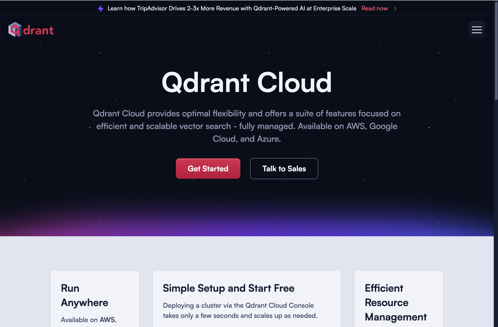


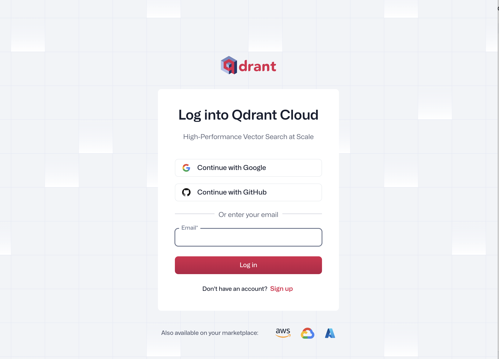


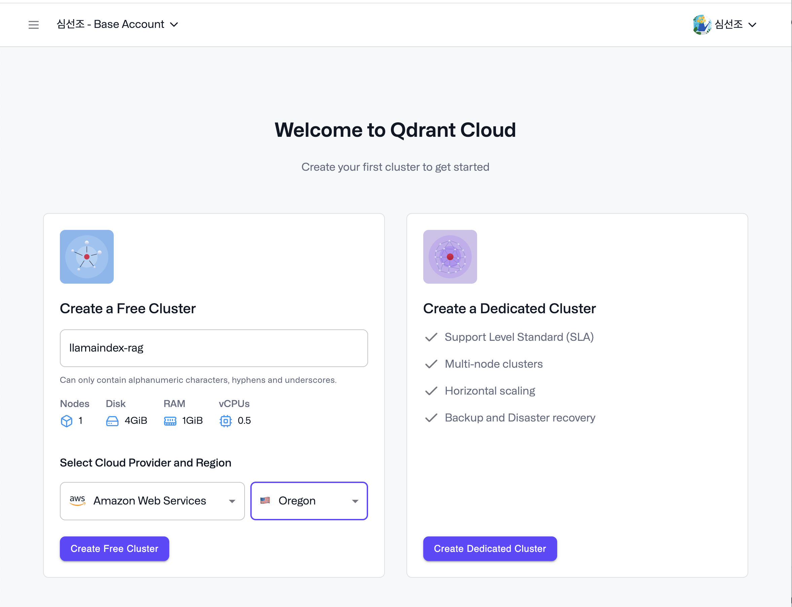


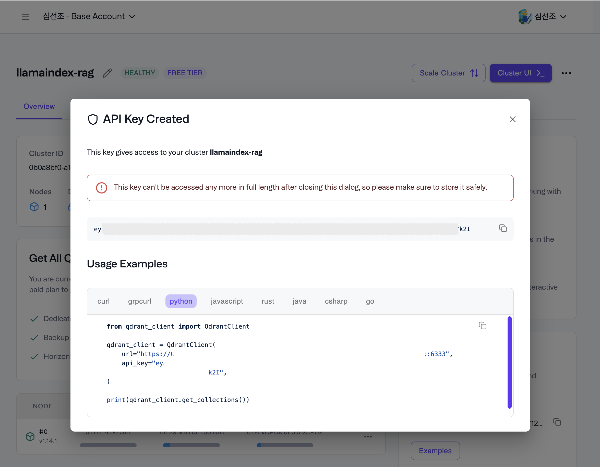


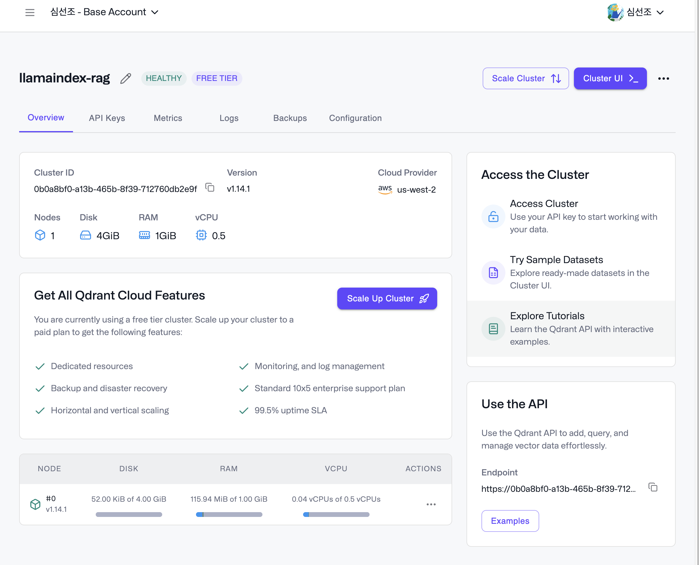


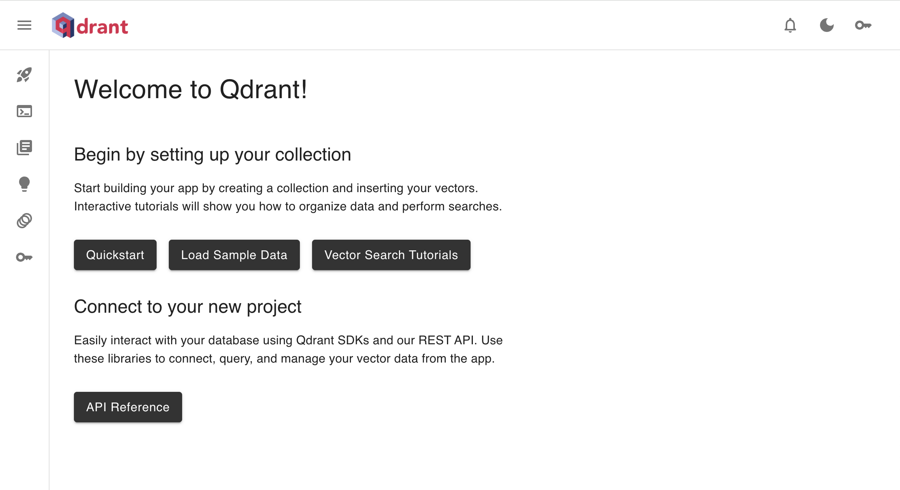


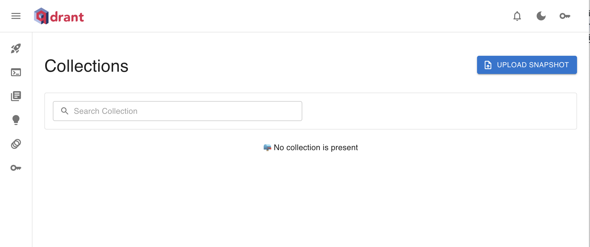


## Cohere 가입 및 api key


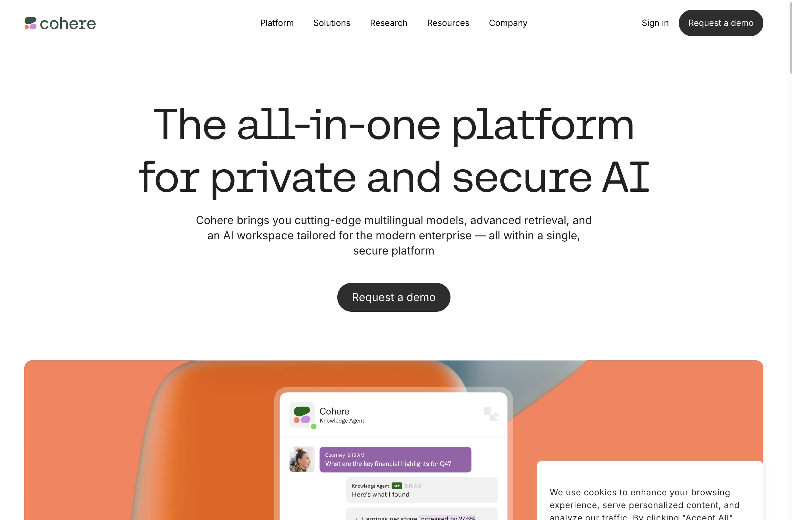


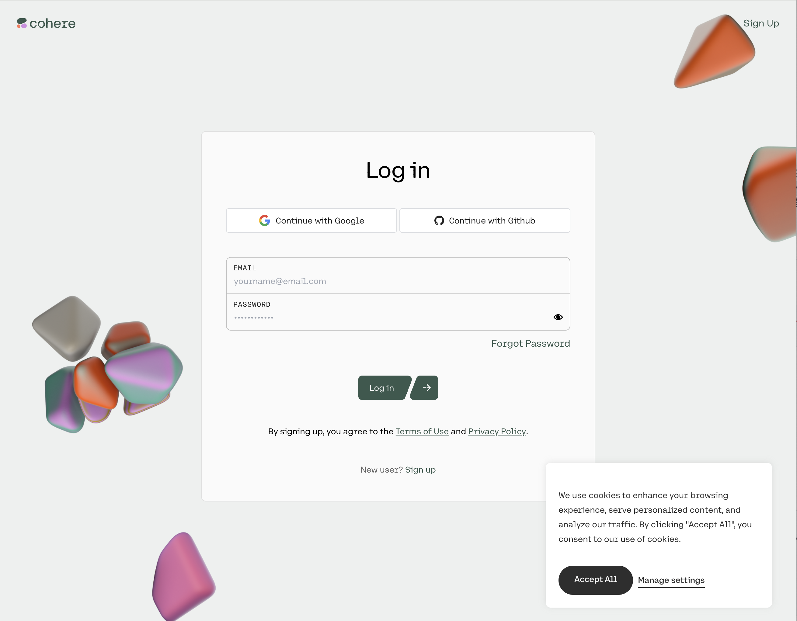


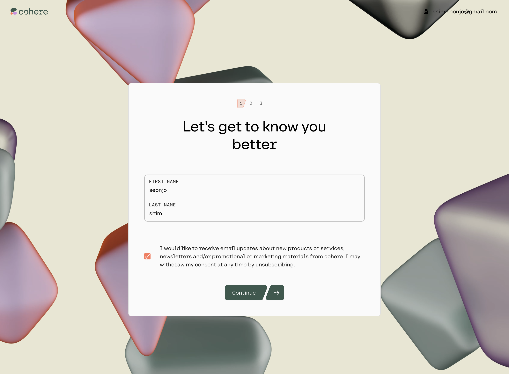


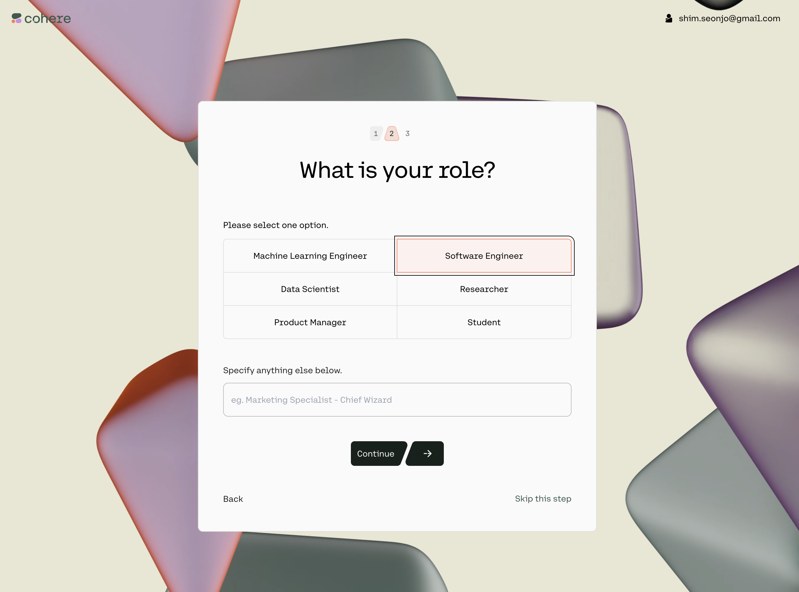


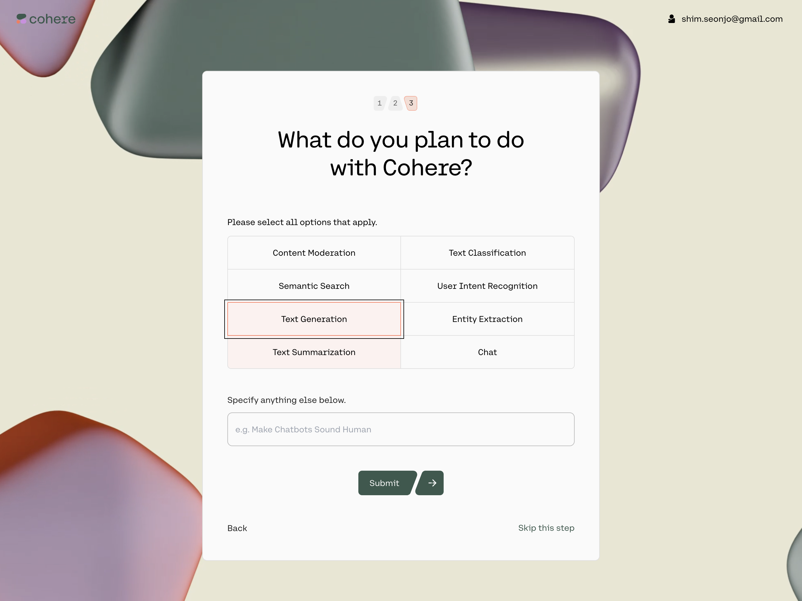


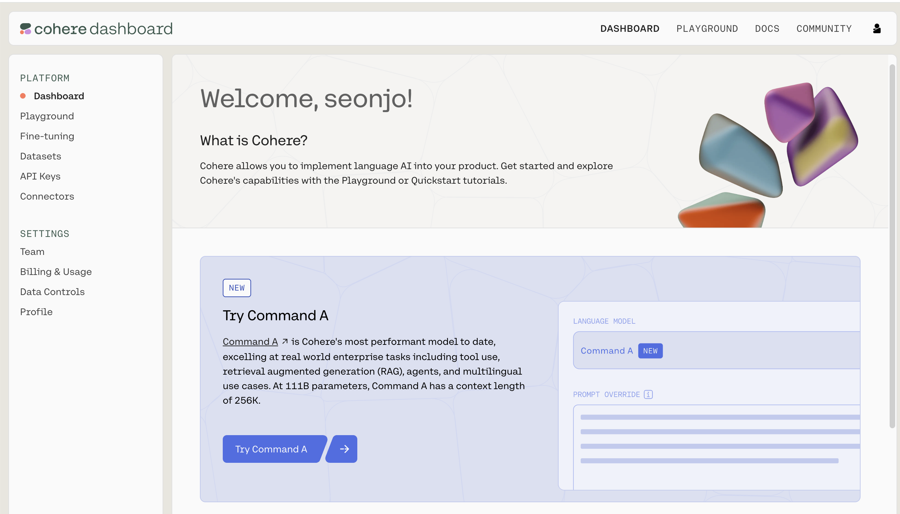


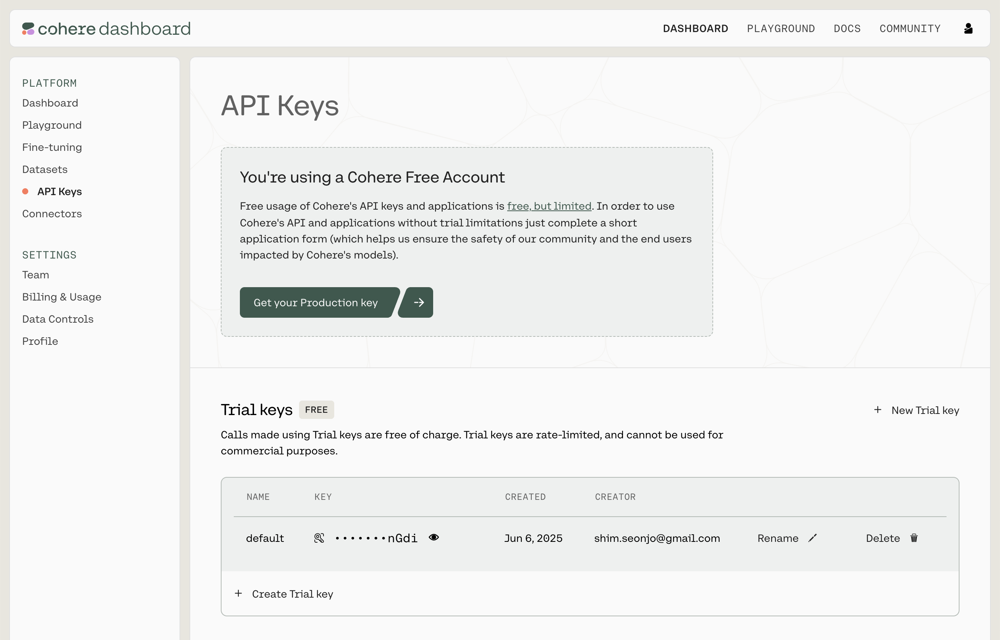

`.env 작성`

```
OPENAI_API_KEY=
QDRANT_API_KEY=
QDRANT_URL=
HUGGINGFACE_TOKEN=
COHERE_API_KEY=
```
