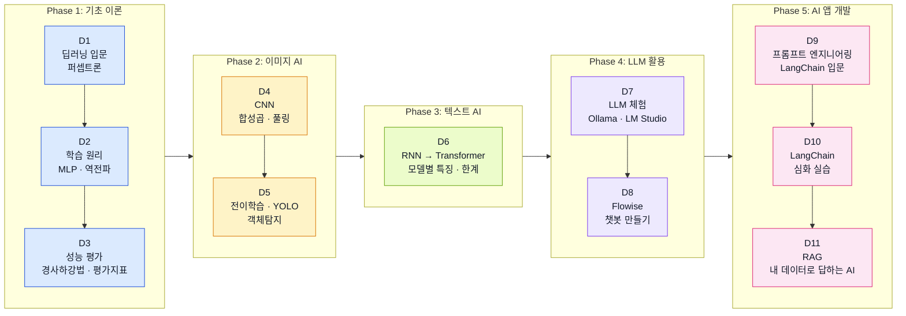

# 딥러닝 11일 과정 시간표

## 1. 교육목표

딥러닝과 생성형 AI의 핵심 개념을 이해하고 간단한 실습을 통해 실제 활용 감각을 익히는 것을 목표로 합니다.

### 전체 목표

비전공자가 AI 기술의 **원리를 직관적으로 이해**하고, **LLM 기반 도구를 실무에 활용**할 수 있는 기초 역량을 갖춘다.

### 단계별 목표

| 단계 | Day | 목표 |
|------|-----|------|
| **기초 이론** | D1~D3 | 딥러닝의 동작 원리(학습, 평가)를 수식 없이 직관적으로 이해한다 |
| **이미지 AI** | D4~D5 | CNN과 전이학습의 원리를 이해하고, 이미지 분류·객체탐지 실습을 경험한다 |
| **텍스트 AI** | D6 | RNN에서 Transformer까지의 발전 흐름을 모델별 특징과 한계 중심으로 파악한다 |
| **LLM 활용** | D7~D8 | 로컬 LLM을 직접 실행하고, no-code 도구로 챗봇을 만들 수 있다 |
| **AI 앱 개발** | D9~D11 | 프롬프트 엔지니어링, LangChain, RAG를 활용하여 실무에 적용 가능한 AI 서비스를 구현한다 |

### 수료 후 기대 역량

- 딥러닝 모델의 학습 과정과 평가 지표를 설명할 수 있다
- CNN, RNN, Transformer 등 주요 모델의 역할과 차이를 구분할 수 있다
- LLM을 로컬 환경에서 실행하고 프롬프트를 설계할 수 있다
- LangChain과 RAG를 활용한 AI 애플리케이션을 구현할 수 있다

---

## 2. 일자별 요약

| Day | 주제 | 핵심 |
|-----|------|------|
| **D1** | 딥러닝 입문 | 딥러닝 역사 연대기, ML/회귀분석, PyTorch 기본사용법, colab 환경 확인, 퍼셉트론과 인공신경망 기초 |
| **D2** | 신경망 학습 원리 | MLP, 활성화함수 순전파, 역전파, 기울기소실 |
| **D3** | 모델 성능 평가 | 경사하강법, 학습률, 과적합, 평가지표(Precision/Recall/F1/ROC-AUC) |
| **D4** | CNN (이미지 AI) | 합성곱, 풀링, 증강, 배치정규화 등 |
| **D5** | 전이학습 + 객체탐지 | 전이학습, YOLO |
| **D6** | 텍스트 AI 기초 | Embedding, RNN/LSTM/GRU, 어텐션/트랜스포머/BERT/GPT 모델별 특징 및 문제점 |
| **D7** | LLM 모델 | LLM, Ollama, lmstudio |
| **D8** | flowise | flowise를 이용하여 간단한 챗봇 만들기 |
| **D9** | LangChain | 프롬프트 엔지니어링, LangChain 기본 사용법 및 실습 |
| **D10** | LangChain | LangChain 기본 사용법 및 실습 |
| **D11** | RAG | RAG 이해 및 실습 |

---

## 3. 일자별 스토리라인

### Phase 1: 기초 이론 (D1~D3) — "딥러닝이 뭔지 감을 잡는다"

```
D1 딥러닝 입문
 ├─ "AI가 뭐고, 딥러닝은 어디에 있는가?" → 역사 연대기로 큰 그림
 ├─ ML/회귀분석으로 "모델이 데이터에서 배운다"는 감각 체험
 ├─ PyTorch + Colab 환경설정 → 이후 11일간 쓸 도구 준비
 └─ 퍼셉트론 → "뉴런 하나가 어떻게 판단하는가"
    ↓
D2 신경망 학습 원리
 ├─ 퍼셉트론을 여러 개 쌓으면? → MLP (다층 퍼셉트론)
 ├─ 활성화함수 → "뉴런이 켜지는 조건"
 ├─ 순전파 → "입력이 들어가서 출력이 나오는 길"
 ├─ 역전파 → "틀린 만큼 거꾸로 되돌려서 수정"
 └─ 기울기소실 → "깊어지면 수정 신호가 사라진다" (D6의 RNN 문제와 연결)
    ↓
D3 모델 성능 평가
 ├─ 경사하강법 → "산을 내려가듯 최적점을 찾는다"
 ├─ 학습률 → "보폭이 크면 빠르지만 지나친다"
 ├─ 과적합 → "시험 문제는 잘 푸는데 응용이 안 되는 학생"
 └─ 평가지표 → "모델이 잘하는지 어떻게 판단하나?" (Precision/Recall/F1/ROC-AUC)
```

> **Phase 1을 마치면**: "딥러닝 모델이 어떻게 학습하고, 어떻게 평가하는지" 설명할 수 있다

---

### Phase 2: 이미지 AI (D4~D5) — "눈을 가진 AI를 만든다"

```
D4 CNN (이미지 AI)
 ├─ "사람이 이미지를 볼 때 부분 → 전체로 인식하듯, CNN도 필터로 특징을 추출한다"
 ├─ 합성곱 → "작은 돋보기로 이미지를 훑는다"
 ├─ 풀링 → "핵심만 남기고 크기를 줄인다"
 ├─ 증강 → "데이터가 부족하면 뒤집고 회전시켜 늘린다"
 └─ 배치정규화 → "학습을 안정시키는 장치"
    ↓
D5 전이학습 + 객체탐지
 ├─ 전이학습 → "이미 배운 모델의 눈을 빌려 쓴다" (ImageNet → 내 데이터)
 └─ YOLO → "사진 속 여러 물체를 한 번에 찾아낸다"
```

> **Phase 2를 마치면**: "이미지를 분류하고 물체를 탐지하는 AI의 원리"를 이해하고 실습을 경험했다

---

### Phase 3: 텍스트 AI (D6) — "글을 읽는 AI의 진화사"

```
D6 텍스트 AI 기초
 ├─ Embedding → "단어를 숫자 좌표로 바꾸면 의미 비교가 가능해진다"
 ├─ RNN → "순서대로 읽는 AI" → 문제: 긴 문장 앞부분을 잊는다 (D2 기울기소실과 연결)
 ├─ LSTM/GRU → "메모장을 들고 읽는 AI" → 해결: 잊지 않는 구조
 ├─ 어텐션 → "중요한 부분에 형광펜을 치며 읽는다"
 ├─ 트랜스포머 → "순서대로가 아니라 한 번에 전체를 본다" → 병렬 처리 가능
 └─ BERT/GPT → "미리 엄청나게 읽어둔 AI" → 이것이 D7의 LLM으로 이어진다
```

> **Phase 3을 마치면**: "RNN → LSTM → Transformer → GPT"의 발전 흐름과 각 모델의 특징/한계를 설명할 수 있다

---

### Phase 4: LLM 활용 (D7~D8) — "대형 언어 모델을 직접 만져본다"

```
D7 LLM 모델
 ├─ D6에서 배운 Transformer/GPT가 거대해지면? → LLM
 ├─ Ollama → "내 컴퓨터에서 LLM을 돌려본다"
 └─ LM Studio → "GUI로 다양한 모델을 비교 체험한다"
    ↓
D8 Flowise
 ├─ "코딩 없이 챗봇을 만들 수 있다면?"
 └─ Flowise로 드래그&드롭 챗봇 완성 → 첫 번째 성취물
```

> **Phase 4를 마치면**: LLM을 로컬에서 실행하고, no-code 도구로 챗봇을 직접 만들어봤다

---

### Phase 5: AI 앱 개발 (D9~D11) — "실무에서 쓸 수 있는 AI 서비스를 만든다"

```
D9 LangChain 입문
 ├─ 프롬프트 엔지니어링 → "AI에게 잘 질문하는 기술"
 └─ LangChain 기초 → "LLM을 프로그래밍으로 제어하는 프레임워크"
    ↓
D10 LangChain 심화
 └─ LangChain 실습 → 체인 구성, 도구 연동, 메모리 활용
    ↓
D11 RAG
 ├─ "LLM이 모르는 내용을 외부 문서에서 찾아서 답하게 하려면?"
 ├─ RAG 개념 → 검색 + 생성의 결합
 └─ RAG 실습 → 문서 기반 Q&A 시스템 구현
```

> **Phase 5를 마치면**: LangChain과 RAG를 활용하여 "내 데이터로 답하는 AI 서비스"를 구현할 수 있다

---

### 전체 흐름 한눈에


