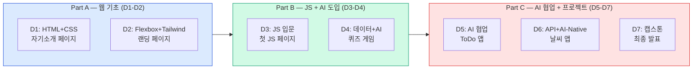

# 웹 프론트엔드 + AI-Native JavaScript — 7일 강의 계획서

---

## 과정 개요

| 항목 | 내용 |
|------|------|
| **과정명** | 웹 프론트엔드 + AI-Native JavaScript |
| **대상** | 비전공자 / 프로그래밍 경험 없는 학습자 |
| **수업 시간** | 7일 (1일 8교시, 50분 수업 × 56교시) |
| **시간** | 09:00-17:50 (점심 13:00-14:00) |
| **실습 환경** | 개인 노트북 + VS Code + Node.js + GitHub Copilot (Free) |
| **교재** | [shimseonjo.github.io](https://shimseonjo.github.io) 웹 교재 |

---

## 1. 교육목표

### 전체 목표

비전공자가 **웹 페이지의 구조와 스타일을 이해**하고, **AI와 협업하여 JavaScript 웹 앱을 개발**할 수 있는 역량을 갖춘다.

### 단계별 목표

| 단계 | Day | 목표 |
|------|-----|------|
| **웹 기초** | D1 | HTML로 웹페이지의 구조를 만들고, CSS로 스타일을 적용할 수 있다 |
| **웹 디자인** | D2 | Flexbox로 레이아웃을 구성하고, Tailwind CSS로 빠르게 UI를 만들 수 있다 |
| **JS 입문** | D3 | JavaScript의 기본 문법(변수, 조건문, 함수)을 이해하고 첫 웹페이지를 만들 수 있다 |
| **JS 활용 + AI 도입** | D4 | 반복문, 배열, 객체를 다루고, AI 도구(Copilot)를 설정하여 코드 검증을 시작한다 |
| **AI 협업 개발** | D5 | AI가 생성한 코드를 읽고, 검증하고, 테스트하여 ToDo 앱을 완성한다 |
| **API + AI-Native** | D6 | 외부 API를 연동하고, Custom Instructions/Prompt Files로 AI-Native 워크플로우를 구축한다 |
| **캡스톤** | D7 | 전체 AI-Native 파이프라인으로 날씨 앱(또는 영화 앱)을 완성하고 발표한다 |

### 수업 후 기대 역량

- HTML/CSS/Tailwind로 반응형 웹페이지를 제작할 수 있다
- JavaScript의 핵심 문법(변수, 조건문, 반복문, 함수, 객체)을 이해하고 사용할 수 있다
- AI(GitHub Copilot)가 생성한 코드를 읽고, 버그를 찾고, 테스트로 검증할 수 있다
- 요구사항을 작성하고, AI가 구현하고, 테스트로 검증하는 AI-Native 워크플로우를 수행할 수 있다
- 외부 API를 연동하는 웹 앱을 완성할 수 있다

---

## 2. 일자별 요약

| Day | 주제 | 핵심 내용 | 산출물 |
|-----|------|----------|--------|
| **D1** | HTML + CSS 기초 | HTML 태그, 문서 구조, 폼, 시맨틱 태그, CSS 연결, 선택자, 박스 모델, 색상/폰트 | HTML+CSS 자기소개 페이지 |
| **D2** | Flexbox + Tailwind CSS | Flexbox 레이아웃, 반응형 디자인, Tailwind 유틸리티 클래스, 랜딩 페이지 | Tailwind 랜딩 페이지 |
| **D3** | JS 입문 + 첫 웹페이지 | 프로그래밍이란, VS Code+Node.js, 변수, 조건문, 함수, DOM 기초, 이벤트 | 나만의 자기소개 JS 페이지 |
| **D4** | 데이터 다루기 + AI 도입 | 반복문, 배열, 객체, Copilot 설치, AI 코드 읽기, Bug Hunt | 인터랙티브 퀴즈 게임 |
| **D5** | AI 협업 개발 + 테스트 | Vitest 테스트, DOM 조작, AI 코드 평가, TDD 미니 경험 | AI 협업 ToDo 앱 |
| **D6** | API + AI-Native 워크플로우 | 비동기/fetch, Custom Instructions, Prompt Files, TDD | 날씨 앱 (Part 1) |
| **D7** | 캡스톤 프로젝트 + 발표 | 날씨 앱 완성 or 영화 검색 앱, 발표, 수료 | 최종 프로젝트 |

---

## 3. 일자별 스토리라인

### Part A: 웹 기초 (D1~D2) — "눈에 보이는 결과물을 만든다"

```
D1 HTML + CSS 기초
 ├─ "웹페이지는 어떻게 만들어지는가?" → HTML = 뼈대, CSS = 옷
 ├─ HTML 태그 실습 → 제목, 문단, 이미지, 링크, 목록
 ├─ 폼과 시맨틱 태그 → 입력 양식, header/nav/main/footer
 ├─ CSS 연결 → 인라인/내부/외부 스타일시트
 ├─ 선택자 + 박스 모델 → "모든 요소는 상자다"
 └─ 실습: 나만의 자기소개 페이지 (HTML+CSS)
    ↓
D2 Flexbox + Tailwind CSS
 ├─ Flexbox → "상자들을 가로/세로로 정렬하는 마법"
 ├─ justify-content, align-items → 주축/교차축 정렬
 ├─ 반응형 디자인 → 미디어 쿼리, 모바일 퍼스트
 ├─ Tailwind CSS → "클래스 이름만으로 스타일링"
 ├─ Tailwind 핵심 패턴 → hover, 반응형(sm/md/lg), 그룹
 └─ 실습: Tailwind 랜딩 페이지 완성
```

> **Part A를 마치면**: HTML 구조 위에 CSS/Tailwind로 스타일을 입혀 "보기 좋은 웹페이지"를 만들 수 있다

---

### Part B: JavaScript 기초 + AI 도입 (D3~D4) — "웹페이지에 생명을 불어넣는다"

```
D3 JS 입문 + 첫 웹페이지
 ├─ "HTML은 뼈대, CSS는 옷이라면, JavaScript는 근육과 뇌"
 ├─ 프로그래밍이란? → VS Code + Node.js 환경 구축
 ├─ 변수(let/const), 데이터 타입, 조건문(if/else)
 ├─ 함수 → "반복되는 작업을 묶는 상자"
 ├─ DOM 기초 → "HTML 요소를 JavaScript로 조작"
 ├─ 이벤트 → "버튼 클릭하면 동작하게 만들기"
 └─ 실습: 자기소개 페이지에 JS 인터랙션 추가
    ↓
D4 데이터 다루기 + AI 도입
 ├─ 반복문(for) + 배열 → "여러 데이터를 한꺼번에 처리"
 ├─ 객체 → "관련 데이터를 하나로 묶기"
 ├─ GitHub Copilot 설치 → Phase 2 전환
 ├─ AI가 쓴 코드 읽기 → "Explain It Back" 기법
 ├─ Bug Hunt → "AI 코드에서 버그 찾기"
 └─ 실습: 인터랙티브 퀴즈 게임
```

> **Part B를 마치면**: JavaScript로 동적 웹페이지를 만들고, AI 코드를 읽고 검증하는 역량을 갖춘다

---

### Part C: AI 협업 + 프로젝트 (D5~D7) — "AI와 함께 진짜 앱을 만든다"

```
D5 AI 협업 개발 + 테스트
 ├─ Vitest 테스트 → "코드가 올바른지 자동 확인"
 ├─ DOM 조작 심화 → AI 생성 DOM 코드 검증
 ├─ AI 코드 평가 체크리스트 → Bug Hunt 심화
 ├─ 미니 TDD → "테스트 먼저 → AI가 구현 → 검증"
 └─ 실습: AI 협업 ToDo 앱 완성 (Phase 2 관문)
    ↓
D6 API + AI-Native 워크플로우
 ├─ 비동기/fetch → "다른 서비스에서 데이터 가져오기"
 ├─ Custom Instructions → "AI에게 프로젝트 규칙 알려주기"
 ├─ Prompt Files → "반복 작업 템플릿"
 ├─ TDD + AI 에이전트 → "테스트 먼저, AI가 구현"
 └─ 실습: 날씨 앱 Part 1 (API 연동 + TDD)
    ↓
D7 캡스톤 프로젝트 + 발표
 ├─ 날씨 앱 완성 or 영화 검색 앱 (선택형 가이드 캡스톤)
 ├─ 발표 준비 + 최종 발표
 ├─ AI 윤리 토론 → "AI가 코드를 써주면 개발자는 뭘 하나요?"
 └─ 커리어 로드맵 + 수료
```

> **Part C를 마치면**: "요구사항 작성 → AI 구현 → 테스트 검증"의 전체 AI-Native 워크플로우를 독립적으로 수행할 수 있다

---

## 4. 시간표

### 일일 기본 구조 (8교시, 50분 수업 + 10분 쉬는 시간)

| 교시 | 시간 | 구분 |
|------|------|------|
| 1교시 | 09:00-09:50 | 오전 수업 |
| 2교시 | 10:00-10:50 | |
| 3교시 | 11:00-11:50 | |
| 4교시 | 12:00-12:50 | |
| 점심 | 13:00-14:00 | |
| 5교시 | 14:00-14:50 | 오후 수업 |
| 6교시 | 15:00-15:50 | |
| 7교시 | 16:00-16:50 | |
| 8교시 | 17:00-17:50 | |

---

### Day 1: HTML + CSS 기초

| 교시 | 장 | 주제 | 형태 | 핵심 성취 |
|------|---|------|------|-----------|
| 1교시 | - | 아이스브레이커 + 과정 안내 + 최종 결과물 미리보기 | 강의 | |
| 2교시 | **HTML 01장** | HTML 시작하기 — 태그, 문서 구조, 텍스트, 링크, 이미지, 목록 | 강의+실습 | ✅ 첫 HTML 파일 작성 |
| 3교시 | **HTML 02장** | 폼과 시맨틱 태그 — Input, Label, Form, header/nav/main/footer | 강의+실습 | ✅ 입력 폼 + 시맨틱 구조 |
| 4교시 | **CSS 01장** | CSS 기초 — 연결 방법, 선택자, 색상, 폰트 | 강의+실습 | ✅ CSS 연결 성공 |
| 점심 | | | | |
| 5교시 | **CSS 01장** | 박스 모델, display 속성, 여백/패딩, 배경 | 실습 | ✅ 박스 모델 이해 |
| 6교시 | **HTML 03장** | 미니 프로젝트: HTML+CSS 자기소개 페이지 (Part 1) | **실습** | ✅ 구조 + 기본 스타일 |
| 7교시 | **HTML 03장** | 미니 프로젝트: 자기소개 페이지 (Part 2) | **실습** | ✅ 페이지 완성 |
| 8교시 | | 짝과 서로 페이지 보여주기 + TIL 카드 + 미니과제 안내 | 공유 | |

> **D1 산출물**: HTML+CSS 자기소개 페이지

---

### Day 2: Flexbox + Tailwind CSS

| 교시 | 장 | 주제 | 형태 | 핵심 성취 |
|------|---|------|------|-----------|
| 1교시 | | D1 복습 퀴즈 + 미니과제 공유 | Standup | |
| 2교시 | **CSS 02장** | Flexbox — 주축/교차축, justify-content, align-items | 강의+실습 | ✅ Flexbox 레이아웃 |
| 3교시 | **CSS 03장** | 반응형 디자인 — 미디어 쿼리 개념 + 반응형 유닛 | 강의+실습 | ✅ 반응형 개념 이해 |
| 4교시 | **Tailwind 01장** | Tailwind CSS 시작하기 — CDN, 유틸리티 클래스, 색상, hover | 강의+실습 | ✅ Tailwind 첫 체험 |
| 점심 | | | | |
| 5교시 | **Tailwind 01장** | Tailwind 반응형(sm/md/lg) + Flexbox 조합 | 실습 | ✅ 반응형 카드 완성 |
| 6교시 | **Tailwind 03장** | 미니 프로젝트: Tailwind 랜딩 페이지 (Part 1) | **실습** | ✅ Hero 섹션 + 네비게이션 |
| 7교시 | **Tailwind 03장** | 미니 프로젝트: 랜딩 페이지 (Part 2) — 특징 카드 + 푸터 | **실습** | ✅ 랜딩 페이지 완성 |
| 8교시 | | 산출물 공유 + "내가 만든 웹사이트" 자랑 + TIL | 공유 | |

> **D2 산출물**: Tailwind CSS 랜딩 페이지

---

### Day 3: JavaScript 입문 + 첫 웹페이지

| 교시 | 장 | 주제 | 형태 | 핵심 성취 |
|------|---|------|------|-----------|
| 1교시 | **JS 00장** | 브릿지: D1 HTML에 `<script>` 추가 + 프로그래밍이란? + 환경 구축 | 강의+실습 | ✅ "HTML에 생명 불어넣기" |
| 2교시 | **JS 01장** | 첫 웹페이지 — HTML+JS 연결, 버튼 클릭으로 글자 바꾸기 | 실습 | ✅ 첫 JS 동작 확인 |
| 3교시 | **JS 02장** | 변수와 데이터 타입 — let/const, string/number/boolean | 강의+실습 | ✅ 변수 개념 이해 |
| 4교시 | **JS 03장** | 조건문 — if/else, switch, 비교 연산자 | 강의+실습 | ✅ 조건 분기 작성 |
| 점심 | | | | |
| 5교시 | **JS 05장** | 함수 — 선언, 매개변수, 반환값 | 강의+실습 | ✅ 함수 선언/호출 가능 |
| 6교시 | **JS 05장** | 화살표 함수 + DOM 기초 — querySelector, onclick | 실습 | ✅ 버튼 이벤트 연결 |
| 7교시 | | 미니 프로젝트: 나만의 자기소개 JS 페이지 | **실습** | ✅ 버튼/팝업/스타일 변경 |
| 8교시 | | 짝과 서로 페이지 보여주기 + OX 퀴즈 + TIL | 공유 | |

> **D3 산출물**: JavaScript 인터랙션이 있는 자기소개 페이지
> **D3 Phase**: Phase 0→1 (AI 사용: 개념 질문만)

---

### Day 4: 데이터 다루기 + AI 도구 도입

| 교시 | 장 | 주제 | 형태 | 핵심 성취 |
|------|---|------|------|-----------|
| 1교시 | | D3 복습 퀴즈 + 미니과제 공유 | Standup | |
| 2교시 | **JS 04장** | 반복문과 배열 — for, while, 배열 기본 | 강의+실습 | ✅ for문 작성 가능 |
| 3교시 | **JS 06장** | 객체와 배열 심화 — 객체, map/filter (핵심만) | 강의+실습 | ✅ 객체 개념 이해 |
| 4교시 | **JS 07장** | GitHub Copilot 설치 + Vitest 첫 경험 | 실습 | ✅ Copilot 작동 확인 |
| 점심 | | | | |
| 5교시 | **JS 09장** | AI 출력 평가법 — Bug Hunt 게임 (Level 1-2) | 실습 | ✅ AI 코드에서 버그 발견 |
| 6교시 | **JS 09장** | Bug Hunt 게임 (Level 3) + "Explain It Back" | 실습 | ✅ AI 코드 설명 가능 |
| 7교시 | | 미니 프로젝트: 인터랙티브 퀴즈 게임 | **실습** | ✅ 퀴즈 게임 완성 |
| 8교시 | | Bug Hunt 팀 대결 + Daily 퀴즈 + TIL | 공유 | |

> **D4 산출물**: 인터랙티브 퀴즈 게임
> **D4 Phase**: Phase 1→2 전환 (Copilot 도입)

---

### Day 5: AI 협업 개발 + ToDo 앱

| 교시 | 장 | 주제 | 형태 | 핵심 성취 |
|------|---|------|------|-----------|
| 1교시 | **JS 07장 후반** | Vitest 테스트 심화 — describe, it, expect, beforeEach | 실습 | ✅ 테스트 작성 가능 |
| 2교시 | **JS 08장** | DOM과 이벤트 — querySelector, addEventListener | 강의+실습 | ✅ DOM 조작 이해 |
| 3교시 | **JS 11장** | ToDo 앱 — 요구사항 작성 + 프로젝트 구조 만들기 | 실습 | ✅ 요구사항 문서 완성 |
| 4교시 | **JS 11장** | ToDo 앱 — 테스트 먼저 작성 + Copilot에게 구현 요청 | 실습 | ✅ 테스트 통과 |
| 점심 | | | | |
| 5교시 | **JS 11장** | ToDo 앱 — UI 연결 + AI 코드 검증 (Bug Hunt 체크리스트) | 실습 | ✅ AI 코드 검증 |
| 6교시 | **JS 11장** | ToDo 앱 — 보안 수정 + 엣지 케이스 테스트 | 실습 | ✅ XSS 방지 수정 |
| 7교시 | | ToDo 앱 마무리 + 교차 테스트 (팀 간 앱 테스트) | **실습** | ✅ ToDo 앱 완성 |
| 8교시 | | ToDo 앱 대결 + Phase 2 관문 체크리스트 + TIL | 공유 | |

> **D5 산출물**: AI 협업 ToDo 앱
> **D5 Phase**: Phase 2 (AI 생성 + 학생 검증)
> **Phase 2 관문**: AI 코드에서 버그 2개 이상 찾아 설명 가능

---

### Day 6: API 연동 + AI-Native 워크플로우

| 교시 | 장 | 주제 | 형태 | 핵심 성취 |
|------|---|------|------|-----------|
| 1교시 | **JS 10장** | 비동기 JavaScript — fetch, async/await (레시피 제공) | 강의+실습 | ✅ API 호출 성공 |
| 2교시 | **JS 12장** | Custom Instructions — .github/copilot-instructions.md | 실습 | ✅ AI 규칙 설정 |
| 3교시 | **JS 13장** | Prompt Files + Context Engineering | 실습 | ✅ 프롬프트 템플릿 작성 |
| 4교시 | **JS 14장** | TDD + AI 에이전트 — Red-Green-Refactor (맛보기 30분) | 실습 | ✅ TDD 사이클 체험 |
| 점심 | | | | |
| 5교시 | **JS 15장** | 날씨 앱 — Step 1-2: 요구사항 작성 + 프로젝트 구조 + API 키 | 실습 | ✅ 프로젝트 뼈대 완성 |
| 6교시 | **JS 15장** | 날씨 앱 — Step 3-4: TDD로 핵심 로직 (storage.js, api.js) | 실습 | ✅ 테스트 통과 |
| 7교시 | **JS 15장** | 날씨 앱 — Step 5-6: UI 구현 + 통합 테스트 | **실습** | ✅ 날씨 앱 핵심 완성 |
| 8교시 | | 날씨 앱 공유 + TIL + 캡스톤 안내 (TMDB API 키 발급 미니과제) | 공유 | |

> **D6 산출물**: 날씨 검색 앱 (핵심 기능)
> **D6 Phase**: Phase 3 (완전 페어 프로그래밍)

---

### Day 7: 캡스톤 프로젝트 + 발표

| 교시 | 장 | 주제 | 형태 | 핵심 성취 |
|------|---|------|------|-----------|
| 1교시 | | 총정리 퀴즈 + **주제 선택** (날씨 앱 완성 / 영화 앱 / 자유 주제) | Standup | |
| 2교시 | **JS 15장 or 16장** | 프로젝트 구현 — 스프린트 1 | 실습 | ✅ 핵심 기능 구현 |
| 3교시 | | 프로젝트 구현 — 스프린트 2 (기능 확장 + 스타일링) | 실습 | ✅ UI 완성도 |
| 4교시 | | 프로젝트 구현 — 스프린트 3 (테스트 + 마무리) | 실습 | ✅ 최종 산출물 완성 |
| 점심 | | | | |
| 5교시 | | 프로젝트 교차 테스트 + 발표 준비 | 실습 | |
| 6교시 | | **최종 발표** (전반) — 팀당 10분 시연 + 5분 Q&A | 발표 | ✅ 프로젝트 시연 |
| 7교시 | | **최종 발표** (후반) + 시상 + AI 윤리 토론 | 발표+토론 | |
| 8교시 | | 커리어 로드맵 + 네트워킹 + 수료식 | 수료 | |

> **D7 산출물**: 날씨 앱 완성 / 영화 검색 앱 / 자유 주제 프로젝트

---

## 5. 전체 흐름



---

## 6. AI 사용 규칙 — 단계별 가이드

| Day | Phase | AI 역할 | 허용 | 금지 |
|-----|-------|---------|------|------|
| D1-D2 | - | 없음 | AI 사용 안 함 (HTML/CSS는 직접) | - |
| D3 | P0-1 | 선생님/설명자 | 개념 질문, 에러 설명 | 코드 생성 요청 |
| D4 전반 | P1 | 설명자 | 코드 설명 요청 | 코드 생성 요청 |
| D4 후반~D5 | P2 | 리뷰어 | AI 코드 생성 + 학생 검증 | 검증 없이 복붙 |
| D6-D7 | P3 | 파트너 | 전체 AI-Native 워크플로우 | — |

---

## 7. 사용 도구

| 도구 | 용도 | 도입 시점 |
|------|------|----------|
| VS Code | 코드 편집기 | D1부터 |
| Chrome 개발자 도구 | HTML/CSS 디버깅 | D1부터 |
| Node.js | JavaScript 실행 환경 | D3부터 |
| ChatGPT | AI에게 개념 질문 | D3부터 |
| GitHub Copilot (Free) | AI 코드 어시스턴트 | D4 오후부터 |
| Vitest | 테스트 프레임워크 | D4 오후부터 |

---

## 8. 최종 산출물

| Day | 산출물 | 사용 기술 |
|-----|--------|----------|
| D1 | HTML+CSS 자기소개 페이지 | HTML, CSS |
| D2 | Tailwind 랜딩 페이지 | HTML, CSS, Tailwind |
| D3 | JS 인터랙션 자기소개 페이지 | HTML, CSS, JavaScript |
| D4 | 인터랙티브 퀴즈 게임 | JavaScript, Copilot |
| D5 | AI 협업 ToDo 앱 | JavaScript, Vitest, Copilot |
| D6 | 날씨 검색 앱 | JavaScript, API, TDD, Instructions |
| D7 | 캡스톤 프로젝트 | 전체 AI-Native 파이프라인 |

---

## 9. 챕터-Day 매핑

### HTML/CSS/Tailwind (D1-D2)

| 챕터 | Day | 배치 | 비고 |
|------|-----|------|------|
| HTML 01장 (시작하기) | D1 오전 | 필수 | |
| HTML 02장 (폼+시맨틱) | D1 오전 | 필수 | |
| HTML 03장 (미니 프로젝트) | D1 오후 | 필수 | 산출물 |
| HTML 04장 (Emmet) | - | **참고** | 시간 여유 시 D1에서 5분 소개 |
| HTML 05장 (Font Awesome) | - | **참고** | 프로젝트에서 필요 시 안내 |
| CSS 01장 (기초) | D1 오후 | 필수 | |
| CSS 02장 (Flexbox) | D2 오전 | 필수 | |
| CSS 03장 (반응형) | D2 오전 | 필수 | |
| Tailwind 01장 (시작하기) | D2 오후 | 필수 | |
| Tailwind 02장 (핵심 패턴) | D2 오후 | 조건부 | 핵심만 진행 |
| Tailwind 03장 (미니 프로젝트) | D2 오후 | 필수 | 산출물 |

### AI-Native JavaScript (D3-D7)

| 챕터 | Day | 배치 | 비고 |
|------|-----|------|------|
| JS 00장 (프로그래밍이란) | D3 오전 | 필수 | 30분 압축 |
| JS 01장 (첫 웹페이지) | D3 오전 | 필수 | |
| JS 02장 (변수) | D3 오전~오후 | 필수 | |
| JS 03장 (조건문) | D3 오후 | 필수 | |
| JS 04장 (반복문/배열) | D4 오전 | 필수 | |
| JS 05장 (함수) | D3 오후 | 필수 | D3으로 앞당김 |
| JS 06장 (객체 심화) | D4 오전 | 조건부 | 핵심만 |
| JS 07장 (테스트+AI도구) | D4 오후 | 필수 | Copilot 설치 |
| JS 08장 (DOM) | D5 오전 | 필수 | |
| JS 09장 (Bug Hunt) | D4 오후 | 필수 | D4로 앞당김 |
| JS 10장 (비동기) | D6 오전 | 조건부 | fetch 레시피만 |
| JS 11장 (ToDo 프로젝트) | D5 전체 | 필수 | 핵심 프로젝트 |
| JS 12장 (Custom Instructions) | D6 오전 | 필수 | |
| JS 13장 (Prompt Files) | D6 오전 | 조건부 | |
| JS 14장 (TDD) | D6 오후 | 조건부 | 맛보기 |
| JS 15장 (날씨 앱) | D6-D7 | 필수 | 통합 프로젝트 |
| JS 16장 (영화 앱) | D7 | 선택 | 캡스톤 대안 |

---

## 10. 강사 준비물

| # | 준비물 | 용도 |
|---|--------|------|
| 1 | VS Code + Node.js 설치 가이드 (D-7 사전 배포) | 환경 설정 시간 절감 |
| 2 | GitHub 계정 + Copilot Free 신청 안내 (D-7) | D4 AI 도입 준비 |
| 3 | OpenWeatherMap API 키 사전 발급 안내 (D-5) | D6 날씨 앱 준비 |
| 4 | TMDB API 키 사전 발급 안내 (D6 미니과제) | D7 영화 앱 준비 |
| 5 | 각 Day별 starter code GitHub repo | 느린 수강생 지원 |
| 6 | 완성 HTML/CSS 파일 (복사용) | D1-D2 타이핑 느린 학생 |
| 7 | 백업: ChatGPT 웹 접속 확인 | Copilot 미승인 시 대체 |

---

## 11. 예상 트러블슈팅

| 문제 | Day | 대응 |
|------|-----|------|
| VS Code 설치 실패 | D1 | 온라인 에디터(CodeSandbox) 임시 전환 |
| Node.js 설치 실패 | D3 | 점심 시간 개별 해결 + 조교 |
| Copilot 라이선스 미승인 | D4 | ChatGPT 웹으로 대체 |
| D3 JS 기초 이해 부족 | D4 | D4 오전에 변수/함수 보충 후 진행 |
| API 키 미발급 (OpenWeatherMap) | D6 | 강사가 공용 키 사전 준비 |
| D1-D2와 D3-D7 연결감 부족 | D3 | D3에서 "D1-D2에서 만든 HTML을 JS로 동적으로 만든다" 연결 |

---

## 12. 수강생 배포 자료

| 자료 | 내용 | URL |
|------|------|-----|
| **웹 교재 (HTML)** | HTML 01-03장 | /language/html |
| **웹 교재 (CSS)** | CSS 01-03장 | /language/css |
| **웹 교재 (Tailwind)** | Tailwind 01-03장 | /language/tailwind |
| **웹 교재 (AI-Native JS)** | JS 00-16장 | /ai-native-js |
| **치트시트** | HTML 태그 + CSS 속성 + JS 문법 요약 | 별도 배포 |

---

*상기 계획은 학생 진행 상황에 따라 유연하게 조정될 수 있습니다.*

*교재: [https://shimseonjo.github.io](https://shimseonjo.github.io)*
