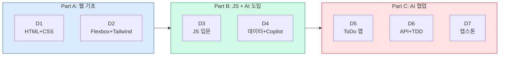

# 7일 강의계획서 — 다중 페르소나 비판적 분석 보고서

## HTML/CSS/Tailwind(2일) + AI-Native JavaScript(5일) 통합 과정

> **목적:** 비전공자 대상 7일(56시간) 통합 과정의 강의계획서 검증  
> **구성:** D1-D2 웹 기초(HTML+CSS+Tailwind) + D3-D7 AI-Native JavaScript  
> **참조:** 딥러닝 11일 과정 시간표(Notion) + AWS 1일 강의계획서 형식  
> **분석일:** 2026-04-19

---

## 1. 현행 계획서 구조 요약

### 7일 흐름



### 핵심 설계 결정

| 결정 | 내용 |
|------|------|
| D1-D2에 HTML+CSS+Tailwind 3과목 압축 | 8시간 × 2일 = 16시간에 11개 챕터 |
| D3-D7에 JS 17개 챕터 배치 | 원래 5일 과정 그대로 |
| D1-D2와 D3-D7의 연결 | D3에서 "HTML을 JS로 동적으로 만든다" |

---

## 2. 다중 페르소나 비판적 검토

### 페르소나 A: 웹 개발 부트캠프 강사 (비전공자 대상 8년)

> *"HTML/CSS/Tailwind를 2일에 넣는 건 가능하지만, 핵심만 추려야 합니다."*

#### 핵심 지적

1. **D1에 HTML 2챕터 + CSS 1챕터 = 적절, 다만 폼(02장)은 압축 필요**
   - HTML 기본 태그(01장)는 비전공자도 2시간이면 충분
   - 폼(02장)의 fieldset, dialog, progress 등은 7일 과정에서 불필요
   - **제안:** 폼은 input + button + label만 다루고, 시맨틱 태그는 header/nav/main/footer 4개만

2. **D2의 Tailwind 02장(핵심 패턴)이 과도할 수 있음**
   - position, z-index, group-hover, peer, transition은 비전공자 7일에 과도
   - **제안:** Tailwind 01장(기본 유틸리티) + 03장(미니 프로젝트) 중심, 02장은 "필요할 때 참조"

3. **CSS 반응형(03장)과 Tailwind 반응형이 중복**
   - CSS 미디어 쿼리 → Tailwind의 sm/md/lg로 동일 개념을 두 번 배움
   - **제안:** CSS 반응형은 "개념만 15분", 실습은 Tailwind 반응형으로 통합

4. **D1-D2의 산출물이 D3-D7과 단절될 위험**
   - D1-D2에서 만든 HTML/CSS 페이지가 D3 이후 JavaScript에서 재사용되지 않으면 "왜 배웠지?" 느낌
   - **제안:** D3의 "자기소개 JS 페이지"를 D1에서 만든 HTML 위에 JS를 추가하는 방식으로 연결

---

### 페르소나 B: 비전공자 수강생 (대학교 3학년 경영학과)

> *"D1-D2에서 웹페이지 만드는 건 재밌을 것 같은데, D3에서 갑자기 JavaScript 시작하면 분위기가 확 바뀔 것 같아요."*

#### 핵심 지적

1. **D1-D2의 시각적 성취감이 D3의 동기부여로 연결되어야**
   - D1-D2: 예쁜 웹페이지 완성 → 높은 성취감
   - D3: console.log, let, if/else → 화면에 아무것도 안 보임 → 성취감 급락
   - **제안:** D3 첫 시간에 "D1에서 만든 페이지의 버튼을 클릭하면 색상이 바뀌게 만들기" → 시각적 연결

2. **7일이 길어서 중간에 지칠 수 있음**
   - D1-D2: 새로운 것 배우는 흥미
   - D3-D4: JavaScript 문법 학습 → 피로 축적
   - D5: ToDo 프로젝트 → 성취감 회복
   - D6: API + TDD → 어려움 급상승
   - **제안:** D4 오후(Copilot 도입)가 "전환점" — 여기서 흥미를 회복시키는 것이 핵심

3. **"매일 산출물"이 동기 유지의 핵심 — 현재 계획서는 이를 잘 반영함**
   - D1: 자기소개 페이지 ✅
   - D2: 랜딩 페이지 ✅
   - D3: JS 페이지 ✅
   - D4: 퀴즈 게임 ✅
   - D5: ToDo 앱 ✅
   - D6: 날씨 앱 ✅
   - D7: 캡스톤 ✅
   - **평가:** 매일 산출물 설계는 우수

---

### 페르소나 C: 교육공학 전문가 (Instructional Design)

> *"2일 웹 기초 + 5일 JavaScript는 구조적으로 잘 설계되었지만, 전환점 관리가 핵심입니다."*

#### 핵심 지적

1. **D2→D3 전환이 과정 전체의 가장 큰 리스크**
   - D2까지: "눈에 보이는 것을 만드는" 시각적 학습
   - D3부터: "코드를 작성하는" 논리적 학습
   - 학습 모드가 완전히 전환됨 → 비전공자에게 심리적 장벽
   - **제안:** D3 오전 첫 30분을 "브릿지 세션"으로 설계
     - "D1-D2에서 만든 페이지에 생명을 불어넣겠습니다"
     - HTML 파일 열기 → `<script>` 태그 추가 → alert('안녕!') → "이게 JavaScript입니다"
     - 새 프로젝트가 아니라 **기존 산출물 위에 확장**

2. **7일 과정의 인지 부하 곡선**

   ```
   난이도
     ↑
     │           ┌─ D6 API+TDD
     │      ┌────┘
     │   ┌──┘ D4-D5 JS심화+AI
     │  ─┘ D3 JS입문
     │ ┌── D2 Tailwind
     │─┘ D1 HTML+CSS
     └──────────────────────→ Day
   ```

   - D3에서 갑자기 올라가고, D6에서 다시 급상승
   - **제안:** D3 오후와 D6 오전에 "속도 완충 구간" 배치 (복습 퀴즈, 페어 프로그래밍)

3. **딥러닝 과정의 "Phase + 스토리라인" 패턴을 차용한 것은 우수**
   - Part A/B/C 구분이 명확
   - 각 Part의 마무리 문장("~할 수 있다")이 학습 목표와 연결
   - **평가:** 딥러닝 과정 참조 형식을 잘 적용함

---

### 페르소나 D: AI-Native JavaScript 과정 담당 강사

> *"원래 5일 과정을 그대로 5일에 넣었는데, 앞에 2일이 추가되면 학생 컨디션이 달라집니다."*

#### 핵심 지적

1. **D3-D7이 원래 5일 과정(D1-D5)과 동일한 강도지만, 학생 상태가 다름**
   - 원래 과정: D1부터 JS → 신선함 최대
   - 7일 과정: D3에 JS 시작 → 이미 2일 수업 후 → 피로 축적 상태
   - **제안:** D3의 JS 00장(프로그래밍이란)을 15분으로 더 압축. D1-D2에서 이미 "코드란 무엇인가"를 체험했으므로

2. **D4에서 JS 05장(함수)이 D3으로 앞당겨진 것은 적절**
   - 원래 5일 과정에서는 D2에 함수를 배움
   - 7일 과정에서 D3에 넣은 것은 맞지만, D3의 분량이 과도해질 수 있음
   - **제안:** D3의 함수(05장)는 "선언과 호출"만 다루고, 화살표 함수와 콜백은 D4로

3. **JS 09장(Bug Hunt)을 D4로 앞당긴 것은 훌륭한 판단**
   - 원래: D3(AI 협업)에 배치
   - 7일: D4(Copilot 설치 직후)에 배치 → Copilot을 설치하자마자 "AI 코드를 검증하는 법"을 배움
   - **평가:** 적절한 순서 변경

4. **D6의 분량이 가장 위험**
   - 비동기(10장) + Custom Instructions(12장) + Prompt Files(13장) + TDD(14장) + 날씨 앱 시작(15장)
   - 5개 챕터를 하루에 소화해야 함
   - **제안:** 비동기(10장)는 "fetch 레시피 20분"으로 축소, TDD(14장)는 "맛보기 30분"으로 제한. 나머지 시간을 날씨 앱에 집중

---

### 페르소나 E: 딥러닝 과정 설계자 (참조 과정 관점)

> *"딥러닝 11일 과정의 시간표 형식을 7일 과정에 잘 적용했지만, 몇 가지 보완이 필요합니다."*

#### 핵심 지적

1. **딥러닝 과정의 "스토리라인" 패턴이 잘 반영됨**
   - 딥러닝: Phase별 스토리 (D1-D3 기초 → D4-D5 이미지 → D6 텍스트 → D7-D8 LLM → D9-D11 앱)
   - 웹+JS: Part A/B/C (D1-D2 웹 → D3-D4 JS+AI → D5-D7 프로젝트)
   - 동일한 "큰 그림 → 상세" 구조를 따름 ✅

2. **딥러닝 과정에 있는 "수업 후 기대 역량" 섹션이 포함됨 ✅**

3. **딥러닝 과정의 "각 Phase 마무리 문장"이 잘 적용됨**
   - "Part A를 마치면: ~ 할 수 있다" 형식 ✅

4. **보완 필요: 사전 준비 체크리스트가 더 구체적이어야**
   - 딥러닝 과정은 Colab으로 환경 통일 → 설정 이슈 거의 없음
   - 웹+JS 과정은 VS Code + Node.js + Copilot → 설정 이슈 빈발
   - **제안:** D-7 사전 가이드에 "VS Code + Node.js 설치 확인용 자가 테스트 스크립트" 포함

---

## 3. 페르소나 간 교차 합의

### 공통 합의 TOP 5

| 순위 | 합의 사항 | 동의 |
|------|----------|------|
| 1 | **D2→D3 전환이 최대 리스크 — 브릿지 세션 필수** | A,B,C,D |
| 2 | **D1-D2 산출물을 D3에서 재사용하여 연결감 확보** | A,B,C |
| 3 | **D6의 분량이 과도 — 비동기/TDD 축소하여 날씨 앱에 집중** | A,D |
| 4 | **매일 산출물 설계는 우수 — 7일 모두 산출물 있음** | B,C,E |
| 5 | **CSS 반응형 + Tailwind 반응형 중복 제거** | A,C |

### 의견 충돌 및 조율

| 쟁점 | 찬성 | 반대 | 조율안 |
|------|------|------|--------|
| D1에 HTML 폼(02장) 전체 포함? | C(기초 완성) | A(시간), B(지루) | input/button/label만 30분, 나머지는 참고 |
| D2에 Tailwind 02장(핵심 패턴) 포함? | 해당 없음 | A(과도), B(어려움) | 01+03장 중심, 02장은 📖 참고 |
| D3에 함수(05장) 전체 포함? | D(빠른 진행) | A(과도) | 선언+호출만, 화살표 함수는 D4 |
| D6에 TDD(14장) 포함? | D(원래 과정 유지) | A(시간) | 30분 맛보기로 축소 |

---

## 4. 최종 권고사항

### 4.1 즉시 반영 사항

1. **D3 첫 30분을 "브릿지 세션"으로 변경**
   - "D1에서 만든 HTML 파일을 열어서 `<script>alert('안녕!')</script>` 추가"
   - → "이게 JavaScript입니다. HTML에 생명을 불어넣는 언어입니다."

2. **D1 HTML 02장(폼) 축소**
   - input, button, label, select만 다루기 (30분)
   - fieldset, dialog, details, progress는 제거

3. **D2 CSS 03장(반응형)을 Tailwind 반응형과 통합**
   - CSS 미디어 쿼리: 개념 15분만
   - 실습은 Tailwind의 sm/md/lg로 진행

4. **D6 시간 재배분**
   - 비동기(10장): fetch 레시피 20분
   - TDD(14장): Red-Green-Refactor 맛보기 30분
   - 확보된 시간을 날씨 앱 구현에 투입

### 4.2 강의계획서 품질 평가

| 항목 | 평가 | 비고 |
|------|------|------|
| 교육목표 체계 | ⭐⭐⭐⭐⭐ | 단계별 목표 + 기대 역량 명확 |
| 일자별 스토리라인 | ⭐⭐⭐⭐⭐ | 딥러닝 과정 형식 잘 적용 |
| 시간표 상세도 | ⭐⭐⭐⭐⭐ | AWS 계획서 수준의 교시별 상세 |
| D2→D3 전환 설계 | ⭐⭐⭐☆☆ | 브릿지 세션 추가 필요 |
| D6 분량 적정성 | ⭐⭐⭐☆☆ | 5챕터/1일은 과도 — 축소 필요 |
| AI 사용 규칙 | ⭐⭐⭐⭐⭐ | Phase별 규칙 명확 |
| 산출물 설계 | ⭐⭐⭐⭐⭐ | 7일 모두 산출물 있음 |
| 참조 형식 적용 | ⭐⭐⭐⭐⭐ | 딥러닝+AWS 형식 잘 통합 |

---

## 5. 결론

### 핵심 강점 3가지

1. **"매일 산출물" 설계** — 7일 모두 동작하는 결과물이 있어 비전공자 동기 유지에 최적
2. **AI 점진적 도입** — D1-D2(AI 없음) → D3-D4(AI 설명자) → D5(AI 검증) → D6-D7(AI 파트너)
3. **딥러닝 과정 + AWS 계획서 형식 통합** — 스토리라인 + 교시별 상세 시간표의 조합

### 보완 필요 2가지

1. **D2→D3 전환 브릿지** — HTML/CSS에서 JavaScript로의 심리적 전환 관리
2. **D6 분량 최적화** — 비동기/TDD 축소 → 날씨 앱 집중

> **작성 방법론**: 5개 독립 페르소나(웹 부트캠프 강사, 비전공자 수강생, 교육공학 전문가, JS 과정 담당 강사, 딥러닝 과정 설계자)가 각자의 관점에서 강의계획서를 독립 분석 후, 교차 합의를 통해 권고사항을 도출하였습니다.
